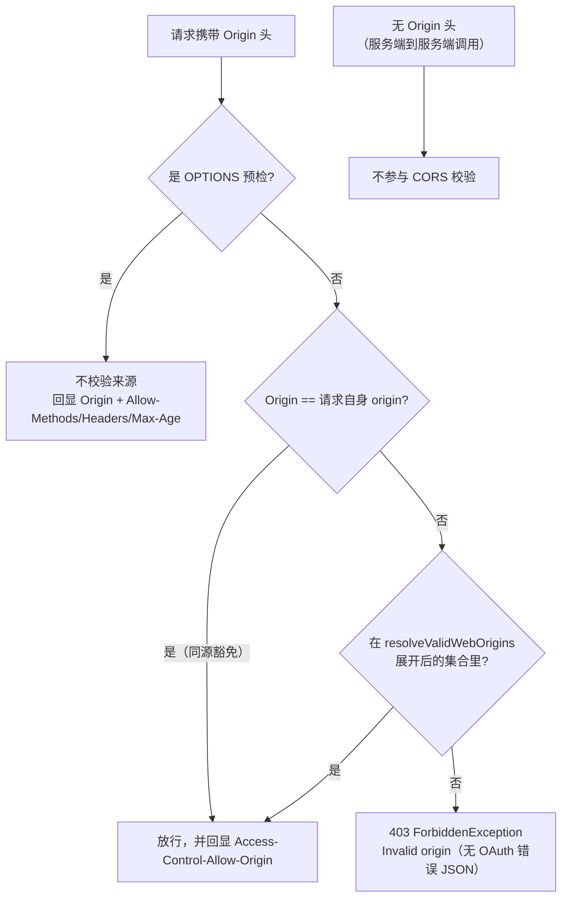

## 场景

三个症状，都能在半小时内定位，但中文资料里几乎找不到完整解释：

1. SPA 直连 `/token` 换 Token，浏览器控制台只有一句 `No 'Access-Control-Allow-Origin' header is present on the requested resource`，Network 面板里那条 `POST /realms/.../token` 是 **403**，body 里没有任何 `error` 字段。
2. 网关或后台服务跑 `grant_type=client_credentials`，凭据完全正确，从升到 26.6.3 那天起开始间歇性 403；同一请求把 `Origin` 头去掉就恢复正常。
3. `OPTIONS` 预检返回 200，`Access-Control-Allow-Origin` 也回显了，正式请求还是被拒——于是开始怀疑浏览器缓存、CDN、甚至「Keycloak 的 CORS 有 bug」。

本文只回答一个问题：**Web Origins 这个字段到底在哪些地方生效、匹配规则是什么、配错时具体会看到什么**。结论全部来自 Keycloak 26.7.4 的公开源码、官方升级说明和官方议题；凡是推测，都会标出来。

基线说明：Keycloak **26.7.4**（2026-09-16 发布，当前最新稳定版）。字段与行为核对自 `26.7.4` 标签下的 `WebOriginsUtils`、`DefaultCors`、`Cors`、`TokenEndpoint`、`UserInfoEndpoint`、`AuthorizeClientUtil` 源码，以及官方 *Upgrading Guide* 的 26.6.3 变更说明；核对日期 2026-09-20。

## 适用与不适用

| 适用 | 不适用 |
|------|--------|
| SPA / 移动端 / 桌面端作为 OIDC 公共客户端直连 Keycloak 端点 | Keycloak 19 及更早的 WildFly 发行版（26.6.3 的行为变更不存在，但匹配语义相同） |
| 网关、Ingress、Service Mesh 之后的反代部署中排查 `Origin` 相关 403 | 只是想了解 CORS 是什么——这里假设你已经知道预检与 `Access-Control-Allow-*` 的作用 |
| 26.5.x → 26.6.3+ 升级后的回归排查（服务账号、ROPC、UMA） | 用 oauth2-proxy / Pomerium / Envoy 自带 OIDC 客户端的场景：这些组件是服务端客户端，浏览器不直连 Keycloak，通常不需要 Web Origins（见 [Keycloak + oauth2-proxy 集成指南]()） |

## Web Origins 实际管的两件事

官方 *Server Administration Guide* 对 Web Origins 的说明只有一句关键信息：域名列表会被**写进 Access Token**，供客户端 adapter 判断是否允许跨源调用（"Only Keycloak client adapters support this feature"）。adapter 时代结束后这句话已经半失效——26.7.4 的真实行为是：**服务端也用它做请求校验，不匹配直接 403**。

这一点在源码里很清楚。`DefaultCors` 把客户端配置解析成允许集合：

```text
// services/src/main/java/org/keycloak/services/cors/DefaultCors.java（26.7.4）
public Cors checkAllowedOrigins(KeycloakSession session, ClientModel client) {
    if (client != null) {
        allowedOrigins = WebOriginsUtils.resolveValidWebOrigins(session, client);
    }
    checkOrigin();
    return this;
}
```

`checkOrigin()` 的判定顺序是：预检请求直接放行 → 没有 `Origin` 头直接放行 → `Origin` 在允许集合里放行 → `Origin` 等于本次请求自身的 origin 时放行（同源豁免）→ 其余情况抛 `ForbiddenException("Invalid origin")`，也就是 **HTTP 403**。



### 各端点实际的校验方式

| 端点 | 26.7.4 中的调用 | 不匹配时的结果 |
|------|----------------|---------------|
| `POST /token`（授权码、刷新、`password`、`client_credentials` 等） | 客户端解析完成后调用 `checkAllowedOrigins(session, client)`（`AuthorizeClientUtil` 内）；UMA grant 与 permission grant 不走 `checkClient()`，但 `AuthorizationTokenService`、`PermissionGrantType` 里同样各自调用了 `checkAllowedOrigins` | 403，无 OAuth 错误 JSON |
| `GET/POST /userinfo` | 先 `allowAllOrigins()`，Token 校验通过并解析出客户端后再 `checkAllowedOrigins(session, clientModel)` | 403 |
| `/token/revoke`、`/logout`、`/par`、identity brokering 回调 | `checkAllowedOrigins(session, client)` | 403 |
| Account REST API、Admin REST API | `checkAllowedOrigins(accessToken)`：优先用 Token 里的 `allowed-origins` 声明，取不到再回落到客户端 Web Origins | 403 |
| 各端点的 `OPTIONS` 预检 | 不校验来源，只按默认规则回显 | 200，永远不会因为 origin 不匹配被拒 |

两个由此推出的实用结论：

- **预检 200 不能证明 Web Origins 配对了**。预检处理器里没有 `checkAllowedOrigins` 调用，任何 origin 都能拿到 200 和回显头；真正拒绝发生在正式请求上。所以排查时永远用**正式请求 + 对照 Origin**，不要只看预检。
- **错误响应会把 CORS 头补回来**。走 `CorsErrorResponseException` 的错误（`invalid_client`、`unsupported_grant_type`、`invalid_grant` …）会用同一个 cors 实例补响应头；客户端还没解析出来的错误（`HTTPS required`、Realm 未启用）更是显式调用了 `allowAllOrigins()`，任何 Origin 都能读到错误 JSON。也就是说：**HTTP 层的 403 `Invalid origin` 和 OAuth 层的错误响应在 CORS 表现上完全不同**，前者在浏览器里是干净的 CORS 报错，后者能看到业务错误码。

`Origin` 头缺失（服务端到服务端调用、`curl` 默认行为、后端 HTTP 客户端）时这条校验完全不参与——这正是把机器流量和浏览器流量分开排查的依据。

## 匹配规则：精确字符串，唯一通配是 `*`

`isOriginAllowed` 是集合包含判断，没有前缀、后缀、子域或正则匹配：

| 配置值 | `Origin: https://app.example.com` 是否命中 | 说明 |
|--------|------------------------------------------|------|
| `https://app.example.com` | 命中 | 精确匹配 |
| `https://app.example.com/` | 不命中 | 末尾斜杠会写进配置并参与比较，界面不会自动去掉 |
| `http://app.example.com` | 不命中 | scheme 参与比较，`http`/`https` 是两个来源 |
| `https://app.example.com:8443` | 不命中 | 非默认端口必须显式写出，且端口必须一致 |
| `https://*.example.com` | 不命中 | 子域通配**不支持**，被当成普通字符串 |
| `*` | 命中 | 允许全部来源 |

`*` 的实际行为值得单独说明：它不会把字面量 `*` 写进 `Access-Control-Allow-Origin`，而是**回显请求里的 Origin**（`DefaultCors.add()` 始终 `response.setHeader(ACCESS_CONTROL_ALLOW_ORIGIN, origin)`）。所以带 Cookie 的跨源请求用 `*` 也不会被浏览器的「通配符 + credentials」规则拦下——不要因为「我们不用 Cookie」就放开 `*`，它在 Keycloak 里就是真正的允许全部。这一点官方议题 [#51776](https://github.com/keycloak/keycloak/issues/51776) 也在要求改进文档（该议题状态：open）。

同源豁免的实现是 `origin.equals(UriUtils.getOrigin(requestUri))`，即请求打到哪个 origin，那个 origin 天然被允许。这解释了为什么 Account Console（由 Keycloak 自身页面发起请求）即使 Web Origins 留空也能正常调用 Account REST，而同样一个 Token 拿到另一个域名下调 `/userinfo` 就会 403。

## `+` 的三种失效场景

Web Origins 里填 `+`（源码常量 `Constants.INCLUDE_REDIRECTS`）表示「沿用 Valid Redirect URIs 中的来源」。展开逻辑在 `WebOriginsUtils.resolveValidWebOrigins`：

```text
if (origins.contains(Constants.INCLUDE_REDIRECTS)) {
    origins.remove(Constants.INCLUDE_REDIRECTS);
    for (String redirectUri : RedirectUtils.resolveValidRedirects(session, client.getRootUrl(), client.getRedirectUris())) {
        if (redirectUri.startsWith("http://") || redirectUri.startsWith("https://")) {
            origins.add(UriUtils.getOrigin(redirectUri));
        }
    }
}
```

三个条件同时满足才有用，缺一个 `+` 就退化成空集合或不可匹配的字符串：

1. **redirect URI 必须是 `http://` 或 `https://` 开头**。移动端/桌面端常见的自定义 scheme（`myapp://callback`）一条 origin 都产生不了。如果该客户端只有自定义 scheme 的 redirect URI，`+` 展开后允许集合为空，所有带 `Origin` 的浏览器请求都会 403。
2. **host 部分不能带通配符**。`https://*.example.com/*` 会被 `UriUtils.getOrigin` 截成 `https://*.example.com` 这样一个普通字符串，而匹配是精确比较，永远命中不了真实 origin。官方议题 [#51776](https://github.com/keycloak/keycloak/issues/51776) 把这条列为文档缺失点（原文：`+` 对包含 `*` 的 redirect URI 是按字面处理的）。
3. **相对 redirect URI 会先用「服务端看到的地址」补成绝对 URL**。`RedirectUtils.resolveValidRedirects` 对以 `/` 开头的值调用 `relativeToAbsoluteURI`：有 Root URL 就用 Root URL，没有就用 `UriUtils.getOrigin(session.getContext().getUri().getBaseUri())`——也就是 Keycloak 自己认为的 base URI。反向代理或容器内网部署下，这个值可能是 `http://keycloak-service:8080` 之类的内网地址，展开出的 origin 和浏览器实际使用的 `https://keycloak.example.com` 不是同一个字符串，于是「配置看起来完全合理，却始终 403」。这类部署必须先按 [Keycloak hostname v2 配置]() 和 [反向代理下的真实客户端 IP 与信任边界]() 把外部地址与代理头配置正确，再谈 `+` 是否够用。

顺带一个审计经验：Keycloak 自己创建的 `admin-console` 客户端，Web Origins 就是 `+`（源码 `RealmManager` 中 `adminConsole.setWebOrigins(Collections.singleton(Constants.INCLUDE_REDIRECTS))`）。所以看到某个客户端用了 `+`，先别当成配置疏漏，真正要确认的是它眼下能展开出什么。

## 26.6.3 起的行为变化：非浏览器流程也会被 `Origin` 拒绝

这是目前最容易踩、也最少被中文资料提到的一条。官方 *Upgrading Guide* 在 26.6.3 的 Notable changes 里写得很直白：

> **CORS requests with an invalid Origin are now rejected before endpoint logic runs**
> Cross-origin requests sent to OIDC endpoints (such as the token, userinfo, token revocation, logout, and PAR endpoints) are now validated against the client's configured Web Origins before the endpoint reaches its authentication and request-processing logic. … After this change, such requests are rejected immediately with a CORS failure returning Forbidden (403) HTTP error status. There is no behavior change for same-origin requests (no `Origin` header) or for cross-origin requests whose `Origin` is already permitted by the client's Web Origins configuration.

这个改动的动机是安全修复：26.6.3 的安全公告中，[#48036 / CVE-2026-37977](https://github.com/keycloak/keycloak/releases/tag/26.6.3) 处理的是 **UMA token 端点从未经验证的 JWT `azp` claim 反射 `Access-Control-Allow-Origin`** 的问题。修法就是把响应头来源从「Token 里说的那个客户端」改成「按客户端 Web Origins 白名单校验」，副作用是校验被提前并收紧到所有 OIDC 端点。

副作用在服务端到服务端的流量上很具体。官方议题 [#51831](https://github.com/keycloak/keycloak/issues/51831)（2026-08-19，状态 open）报告：自 26.6.3 起，只要请求里带了不属于客户端 Web Origins 的 `Origin` 头，`grant_type=password`（ROPC）与 `grant_type=client_credentials` 会**在凭据完全正确的情况下**返回 403；去掉 `Origin` 头则成功。触发条件不是浏览器，而是链路中间件——API 网关、负载均衡、HTTP 客户端库把 `Origin` 头注入了本应纯服务端的请求。报告者记录的版本边界是：**26.5.4 正常，26.6.3+（含 26.7.1）复现**。

同一议题还指出配置侧的尴尬：这类「只开服务账号」的客户端，Admin Console 不显示 Web Origins 字段（可追溯到 [#32489](https://github.com/keycloak/keycloak/issues/32489)），Terraform provider 也不允许为未开启 Standard flow 的客户端写 `web_origins`。也就是说，服务端在强制一个官方工具链没有一等支持的设置——这条限制在 2026-08 仍未被修复（议题状态 open）。

### 升级前后的处置顺序

| 处置 | 适用 | 代价与边界 |
|------|------|-----------|
| 让上游剥离 `Origin` 头（Nginx `proxy_set_header Origin "";`、HAProxy `http-request del-header Origin`、网关的请求头改写） | **首选**。M2M 请求本来就不该带 `Origin`，剥离它同时消除了 CORS 语义和这一类误伤 | 需要确认没有下游依赖该头做审计或路由；改动本身要纳入网关配置的版本管理与回滚 |
| 给该客户端显式配置 Web Origins | 确有浏览器直连需求，或暂时无法改上游 | Admin Console 可能在关闭 Standard flow 时隐藏该字段、Terraform provider 不支持；用 Admin REST / `kcadm` 直接写 `webOrigins` 在服务端模型上可行，但属于绕过 UI 限制的做法，**上线前必须在预发环境用真实 `Origin` 头验证一次**，并确认后续用 IaC 重建时不会把该字段抹掉 |
| 什么都不改，等上游兼容 | 不推荐 | 26.6.3 之后没有回退迹象；长期靠「重启/重试偶尔成功」会掩盖真实原因 |
| 把 Web Origins 改成 `*` | 不推荐 | 等于对所有来源开放，与本次安全修复的意图相反 |

无论选哪条，升级到 26.6.3+ 的回归清单里都应加上一项：**列出所有会向 Keycloak 发请求的服务端组件，确认它们是否会在请求上附加 `Origin` 头**。这类问题在功能测试里不会暴露，因为测试客户端通常不带 `Origin`；判定方式是在目标链路的上游抓一次实际请求（网关访问日志、`tcpdump` 或上游的 `curl -v` 复现），而不是根据组件文档推测它「应该」不带这个头。

## 最小配置

### 前端客户端

Web Origins 只写 origin，不写路径、不写尾斜杠；开发环境有多少个端口就写多少条：

```bash
# 占位符替换为实际域名；生产只保留 https 的正式域名
kcadm.sh update clients/<client-uuid> -r <realm> \
  -s 'webOrigins=["https://app.example.com","https://app.example.com:8443"]'

# 确认写入结果（不要只看 Admin Console 的显示）
kcadm.sh get clients/<client-uuid> -r <realm> --fields clientId,webOrigins,redirectUris
```

`localhost` 与 `127.0.0.1` 是两个不同的 origin，开发环境里两个都要写；预检结果会被浏览器缓存 `Access-Control-Max-Age: 3600`（源码常量 `DEFAULT_MAX_AGE` 为 1 小时），改完配置如果浏览器还复用旧的预检结果，用无痕窗口或强制刷新验证。

### 服务端客户端（M2M / 网关 / BFF）

原则上不配置 Web Origins，也不要让链路上的组件注入 `Origin` 头。`oauth2-proxy`、Pomerium、Envoy Gateway 这类服务端 OIDC 客户端的配置示例里，Web Origins 通常留空，原因就在这里——它们与 Keycloak 之间的调用没有浏览器参与。

### 自定义请求头

预检允许的请求头集合在源码里是固定的默认值，加上认证场景追加的 `Authorization`：

```text
DEFAULT_ALLOW_HEADERS = Origin, Accept, X-Requested-With, Content-Type,
                        Access-Control-Request-Method, Access-Control-Request-Headers, DPoP
```

注意 `DPoP` 已在默认集合里，所以 DPoP 绑定 Token 的浏览器调用不需要额外配置。如果前端要带自定义头（例如 `X-Client-Version`），只能通过 CORS provider 的配置项追加，官方 *All provider configuration* 里登记的键名是：

```bash
--spi-cors--default--allowed-headers=<逗号分隔的额外头名>
# 容器环境变量形式：KC_SPI_CORS__DEFAULT__ALLOWED_HEADERS
```

官方说明原文是 "A comma-separated list of additional allowed headers for CORS requests"——是**追加**，不是覆盖，因此不需要把默认集合抄一遍。加头之前先问一句：这个头是否必须由浏览器发起？能挪到服务端就别改全局 CORS 配置。

## 验证

三步对照，缺一步都可能误判：

```bash
KC=https://keycloak.example.com/realms/<realm>/protocol/openid-connect/token

# 1. 预检：任何 origin 都会拿到 200，只用来确认链路通
curl -sS -i -X OPTIONS \
  -H 'Origin: https://app.example.com' \
  -H 'Access-Control-Request-Method: POST' \
  -H 'Access-Control-Request-Headers: content-type' \
  "$KC" | sed -n '1p;/^[Aa]ccess-[Cc]ontrol/p'
# 预期：HTTP/2 200 + Allow-Origin 回显 + Allow-Methods: POST, OPTIONS
#       + Allow-Headers 含 Content-Type 与 Authorization + Allow-Credentials: true + Max-Age: 3600

# 2. 正式请求 + 合法 origin：应拿到业务响应（授权码无效时是 400 invalid_grant），并带回 CORS 头
curl -sS -i -X POST -H 'Origin: https://app.example.com' \
  -H 'Content-Type: application/x-www-form-urlencoded' \
  --data-urlencode 'grant_type=authorization_code' \
  --data-urlencode 'client_id=<client-id>' \
  --data-urlencode 'code=<code>' \
  --data-urlencode 'redirect_uri=https://app.example.com/callback' \
  --data-urlencode 'code_verifier=<verifier>' "$KC" | sed -n '1p;/^[Aa]ccess-[Cc]ontrol/p'

# 3. 对照：换成未登记的 origin
curl -sS -i -X POST -H 'Origin: https://not-registered.example' \
  -H 'Content-Type: application/x-www-form-urlencoded' \
  --data-urlencode 'grant_type=authorization_code' --data-urlencode 'client_id=<client-id>' "$KC" | sed -n '1p;/^[Aa]ccess-[Cc]ontrol/p'
# 预期：403，且没有 Access-Control-Allow-Origin；body 不是 OAuth 错误 JSON
```

第 3 步是判定「Web Origins 是否真的生效」的唯一可靠方法：**403 出现说明校验在工作**。反过来说，第 3 步没出现 403，也不等于配置正确——可能是请求里的 `Origin` 恰好等于 Keycloak 自身 origin（同源豁免），也可能这个端点没有调用 `checkAllowedOrigins`。把第 2 步的响应头与第 3 步的状态码放在一起看，才能区分「放行是因为白名单」还是「放行是因为没校验」。

需要看到 Keycloak 眼里「允许集合到底是什么」时，打开这个 logger 的 debug：

```bash
kc.sh start --log-level=org.keycloak.services.cors:debug
# 日志文本：Invalid CORS request: origin <请求的 origin> not in allowed origins [<实际允许集合>]
```

这条日志只在 DEBUG 打印，且请求的 origin 与服务端自身 origin 相同时不打——所以「日志里什么都没有」不代表校验通过，先用第 3 步的 curl 复现。

浏览器侧不要只读控制台那句 `No 'Access-Control-Allow-Origin' header is present`：它同时对应「服务端 403 拒绝」和「服务端忘了配」，必须回到 Network 面板看状态码。`Origin` 与 `SameSite` 混淆导致的登录/回调异常是另一类问题，判断方法见 [oauth2-proxy 常见错误排错]()。

## 常见错误对照表

| 症状 | 根因 | 处置 |
|------|------|------|
| `POST /token` 403，控制台只有 CORS 报错 | `Origin` 不在客户端 Web Origins（26.6.3 起在端点逻辑前拦截） | 用 debug 日志确认允许集合，补精确 origin；M2M 场景优先剥离 `Origin` 头 |
| 预检 200、正式请求 403 | 预检不校验来源，属于设计如此 | 不要以预检结果为准，直接用正式请求做对照验证 |
| 配了 `+` 仍然 403 | redirect URI 是自定义 scheme、host 含通配符，或相对路径被补成内网 origin | 改成显式写 origin；先修 hostname / 代理头配置 |
| 服务账号 / ROPC 偶发 403，去掉 `Origin` 头即恢复 | 网关、LB 或 HTTP 客户端注入了 `Origin`（26.6.3+） | 上游剥离 `Origin`；把该项加入升级回归清单 |
| Account / Admin REST 返回 403 `Invalid origin` | 该路径用 Token 的 `allowed-origins` 声明比对 | 用同一客户端获取 Token；必要时按 [Keycloak 审计日志与合规实践]() 记录来源，便于回溯 |
| 预检报 `Request header field x-... is not allowed` | 自定义头不在默认允许集合 | `--spi-cors--default--allowed-headers` 追加；先确认该头是否必须由浏览器发送 |
| 换了域名或加了端口后全线 403 | 精确匹配：scheme、host、端口都参与比较 | 逐项对齐配置与浏览器地址栏，包括尾斜杠 |
| 多副本/多环境表现不一致 | 配置只改了一个 Realm 或只更新了一个客户端 | 用 `kcadm get clients/<uuid>` 直接读回，不要依赖控制台显示或缓存 |

## 常见问题（FAQ）

### Q1：IAM 前端用 SPA 直连 token 端点，Web Origins 该写什么？

写前端页面实际的 origin：`https://app.example.com`，有非默认端口就带上端口。不要写路径、不要写尾斜杠、不要用子域通配（不支持）。开发环境把 `http://localhost:<port>` 与 `http://127.0.0.1:<port>` 都列上——它们是两个不同的 origin。

### Q2：网关模式（oauth2-proxy / Nginx Ingress / Traefik）还需要配 Web Origins 吗？

不需要，而且不该配。这类网关是服务端 OIDC 客户端，令牌交换发生在服务端，浏览器不直接访问 Keycloak 的 token 端点。把它们配成浏览器来源只会扩大允许集合。网关侧的真正难点在 Cookie 域、CSRF 与转发头，见 [IAM 网关：Keycloak + oauth2-proxy 集成指南]() 和 [Traefik ForwardAuth + Keycloak]()。

### Q3：为什么机器客户端（client_credentials）也会报 CORS 相关 403？

因为 26.6.3 起 Web Origins 校验提前到了 OIDC 端点逻辑之前，而校验只判断请求里有没有 `Origin` 头、是否在白名单里，不判断这个请求是不是浏览器发起的。纯服务端调用只要被中间件注入了 `Origin` 头，就会命中 403。修复方向是让上游不要注入该头，而不是给机器客户端配 Web Origins（官方议题 [#51831](https://github.com/keycloak/keycloak/issues/51831) 仍在跟踪工具链对这类客户端的支持缺口）。

### Q4：`*` 与显式 origin 除了安全性还有什么差别？

功能上没差别：`*` 的实现是回显请求 Origin，所以带凭据的请求同样能通过浏览器的 CORS 检查。差别在风险面——`*` 让任何来源都能读取错误响应和 Token 端点行为，配合 XSS 或恶意页面即可探测 Realm、客户端 ID 是否存在。Keycloak 自身的 [安全加固清单]() 也把「CORS 白名单精确到域名」列为检查项。

### Q5：怎么区分「CORS 问题」和「Cookie / SameSite 问题」？

看请求是否被浏览器发出且是否有响应码：CORS 被拒时 Network 面板有请求、有状态码（403/200 但缺头）；`SameSite` 导致的问题通常表现为登录回调后仍是未登录、或重定向循环，`Set-Cookie` 上能看到 `SameSite` 与实际跳转的注册域不匹配。跨源（origin）不等于跨站（site），两者不能互推，判断顺序见 [oauth2-proxy 常见错误排错]()。

### Q6：升级到 26.6.3+ 之前，怎么确认自己会不会被这条变更影响？

搜三类东西：网关/Ingress/LB 配置里是否有 `Origin` 头的注入或改写；HTTP 客户端封装层是否默认设置 `Origin`（含浏览器模拟头）；监控里是否有服务账号客户端调用 `/token`。命中任意一类，就在预发环境按本文「验证」一节的第 3 步做一次对照测试，再安排生产升级。

## 回滚

改动很小，回滚路径也简单，但顺序要对：

1. **配置回滚**：把 `webOrigins` 还原成改动前的值（改动前先 `kcadm get clients/<uuid> --fields webOrigins` 存档）。单客户端维度的改动立即生效，无需重启，因此在预发验证后可按客户端灰度。
2. **网关回滚**：剥离 `Origin` 的规则属于请求改写，回滚即恢复原配置并 reload；回滚后要立刻确认 26.6.3+ 上的 403 是否复现，避免「回滚了但问题被掩盖」。
3. **不要用放开白名单兜底**：把 `webOrigins` 改成 `*` 或回退 Keycloak 版本都不是处理手段，前者扩大攻击面，后者会丢掉 CVE-2026-37977 的修复。
4. **验证回滚结果**：改完后重跑上面的三步 curl，确认 403 只在对照请求上出现，正常请求头齐全。

风险提示：CORS 配置错误在灰度阶段往往不可见——同一 Realm 下不同客户端的 Web Origins 互相独立，灰度客户端正常不代表其他客户端正常。按客户端维度逐一验证，比整体切换更安全。

## 参考来源

- Keycloak 26.7.4 源码：`services/src/main/java/org/keycloak/services/cors/DefaultCors.java`、`server-spi-private/src/main/java/org/keycloak/services/cors/Cors.java`、`services/src/main/java/org/keycloak/protocol/oidc/utils/WebOriginsUtils.java`、`RedirectUtils.java`、`common/src/main/java/org/keycloak/common/util/UriUtils.java`
- [Keycloak Upgrading Guide — 26.6.3 Notable changes: CORS requests with an invalid Origin are now rejected before endpoint logic runs](https://www.keycloak.org/docs/latest/upgrading/)
- [Keycloak 26.6.3 Release Notes（含 #48036 / CVE-2026-37977）](https://github.com/keycloak/keycloak/releases/tag/26.6.3)
- [Issue #51831: CORS Origin validation rejects non-browser token requests](https://github.com/keycloak/keycloak/issues/51831)
- [Issue #51776: Support Web Origins wildcards and improve documentation](https://github.com/keycloak/keycloak/issues/51776)
- [Keycloak Server Administration Guide — OIDC client Basic settings（Web Origins）](https://www.keycloak.org/docs/latest/server_admin/)
- [Keycloak All provider configuration（`spi-cors--default--allowed-headers`）](https://www.keycloak.org/server/all-provider-config)
