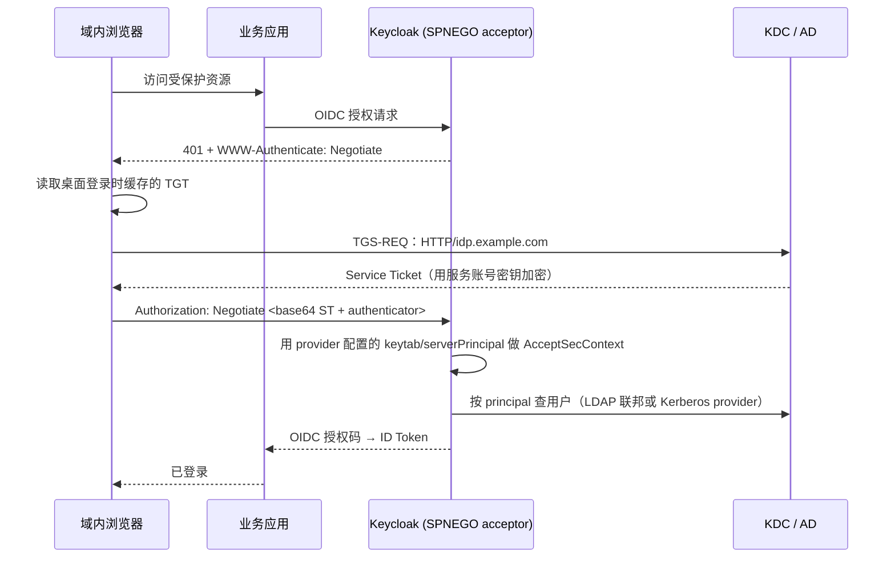

## 场景

三种表现，断点分别在 KDC、Keycloak、浏览器三段：

1. 员工已经用域账号登录 Windows，访问 Keycloak 保护的应用仍被要求再输一次域密码。
2. 内网访问时浏览器弹出用户名/密码框（NTLM 风格），输域账号也进不去。
3. Keycloak 日志出现 `Received kerberos token, but there is no user storage provider that handles kerberos credentials.`，浏览器侧显示「用户名或密码错误」。

**适用**：Keycloak 26.x，KDC 是 Active Directory（MIT Kerberos、FreeIPA 同理），用户浏览器与 KDC 网络可达，目标是「域内免密 + 出网回落表单登录」。

**不适用**：外网、移动端、非域设备（拿不到 TGT，只能走表单、Passkey 或设备码）；期望把票据透传给下游服务（Keycloak 的票据委派能力已标注 deprecated，见下文）；SAML 客户端的会话联动（SAML 单点登出与 Kerberos 票据是两套机制）。

Kerberos 与 LDAP 在企业 IAM 里的分工——哪一步用目录查询、哪一步用票据——见 [IAM 目录服务：LDAP 协议详解]()。本文只讲 SPNEGO 这一层怎么打通。

## SPNEGO 在 Keycloak 里的完整链路



三个要点：

- **Keycloak 是票据的「接受方」，不是签发方。** 它只负责验证浏览器送来的 Service Ticket，然后照常用 OIDC/SAML 与应用交互；应用完全看不到 Kerberos（Keycloak 官方文档的表述是「Keycloak acts as a broker to Kerberos/SPNEGO login」）。
- **401 挑战是入口。** `SpnegoAuthenticator` 在请求里没有 `Authorization` 头时返回 401 与 `WWW-Authenticate: Negotiate`；只有拿到 `Authorization: Negotiate <token>` 才会去验证。所以「浏览器没有发第二次请求」和「Keycloak 验证失败」是两类完全不同的问题，日志与浏览器网络面板要分开看。
- **flow 里 Kerberos 的执行状态决定体验。** 设为 `Alternative` 时，不具备 SPNEGO 能力的浏览器会拿到一个自动提交的中间页（标题 `Kerberos Unsupported`），无 JavaScript 时提示「点击按钮改用其他方式登录」，随后回落表单登录；设为 `Required` 时直接返回 401 错误页，没有回落。生产一般用 `Alternative`，只对确实无法回落的受控终端用 `Required`。

## 最小配置

### 1. KDC / AD 端：SPN 与 keytab

第一步不是配 Keycloak，而是让 `HTTP/<浏览器访问的域名>` 这个服务主体存在、并且有一份可导出的密钥。

Windows AD 上：

```bat
:: 1) 建一个专用服务账号（不要用域管理员），映射 SPN
setspn -S HTTP/idp.example.com svc_keycloak

:: 2) 导出 keytab
ktpass -princ HTTP/idp.example.com@EXAMPLE.COM ^
       -mapuser EXAMPLE\svc_keycloak ^
       -pass <password> ^
       -crypto AES256-SHA1 ^
       -ptype KRB5_NT_PRINCIPAL ^
       -out keycloak.keytab
```

四个容易踩的点，都在 Microsoft 的 `ktpass` 文档里写着，但配置时最常被忽略：

- `/princ` **大小写敏感**，且必须是 `HTTP/<fqdn>@REALM` 形式，域名要与浏览器实际访问的地址逐字符一致（含没有额外的代理别名）。
- `/crypto` **要显式指定**。文档明确提示默认值取的是老 MIT 实现，应该始终带上 `/crypto`，例如 `AES256-SHA1`。
- `/ptype` 推荐 `KRB5_NT_PRINCIPAL`。
- 同一个服务账号**不能**映射多个服务实例（文档原话 "You cannot map multiple service instances to the same user account"）。多套 Keycloak 或多域名请各用各的账号。

改过服务账号密码、或重新执行过一次带 `/pass` 的 `ktpass`，AD 侧的密钥版本就变了，**keytab 必须重新导出**，否则表现是客户端能拿到票据、Keycloak 却解密失败。

MIT Kerberos / FreeIPA 侧的等价操作（Keycloak 官方文档给的就是这两条）：

```bash
sudo kadmin.local
addprinc -randkey HTTP/idp.example.com@EXAMPLE.ORG
ktadd -k /tmp/http.keytab HTTP/idp.example.com@EXAMPLE.ORG
```

### 2. Keycloak 运行环境：krb5.conf 与 keytab

Keycloak 的官方镜像基于 `ubi9-micro`，Dockerfile 只额外安装了 `java-21-openjdk-headless`、`glibc-langpack-en`、`findutils`，**不含 `/etc/krb5.conf`**。官方容器文档对此有明确指引：Keycloak 的 Kerberos 能力不需要安装 `krb5-libs` 的二进制部分，只要把文本配置文件（例如 `/etc/krb5.conf`）`ADD` 进镜像即可。自建镜像时：

```dockerfile
FROM quay.io/keycloak/keycloak:26.3 AS base
COPY krb5.conf /etc/krb5.conf
# keytab 建议运行时以只读方式挂载，不打进镜像
```

`krb5.conf` 至少要让 Keycloak 知道 realm 与 KDC，并按官方文档的要求配置 `domain_realm`：

```ini
[libdefaults]
  default_realm = EXAMPLE.COM
  dns_lookup_kdc = true
  rdns = false

[realms]
  EXAMPLE.COM = {
    kdc = dc01.example.com
    admin_server = dc01.example.com
  }

[domain_realm]
  .example.com = EXAMPLE.COM
  example.com = EXAMPLE.COM
```

keytab 的两种挂法：

- 挂载成文件（推荐）：Kubernetes 用 `Secret` + `volumeMounts`，路径固定，权限只给 Keycloak 进程。注意官方镜像里进程以 `USER 1000` 运行，挂进去的 keytab 必须对该 UID 可读，否则表现为「配置看起来对但验证一直失败」。
- 打进镜像：省事，但密钥就固化在镜像里，轮换要重新构建、重新发版，不建议生产使用。

**这里有一个与通用 Kerberos 客户端不同的地方**：Keycloak 不使用 `KRB5_KTNAME` 环境变量。它把 provider 配置里的 `keyTab` 与 `serverPrincipal` 直接注入一个 JAAS `Krb5LoginModule` 配置（`KerberosServerSubjectAuthenticator`），每次 SPNEGO 验证都用这两项登录一次服务主体。所以：keytab 路径要写在 Keycloak 的 provider 配置里；`KRB5_KTNAME` 设了也不起作用。同理，Java 读取 `krb5.conf` 的默认路径是 `/etc/krb5.conf`，需要换位置时用系统属性 `-Djava.security.krb5.conf=/path/krb5.conf` 覆盖。

### 3. Keycloak 端：联邦提供者二选一

Keycloak 必须先有「能处理 Kerberos 凭据的用户存储提供者」，才会认票据。官方提供两条路径，**不能都当摆设配着**：

| 方案 | 什么时候用 | 用户属性从哪来 | 代价 |
|------|-----------|---------------|------|
| LDAP/AD 联邦 + `Allow Kerberos authentication = ON` | KDC 背后就是 AD/LDAP（绝大多数企业场景） | 按 LDAP 查询导入，姓名、邮箱、组都能拿到 | 需要同时维护 LDAP 连接配置 |
| `Kerberos` User Storage Provider | KDC 背后没有 LDAP（纯 MIT KDC、外部域） | 只解析票据里的 principal 并导入本地库，**不写入姓名/邮箱等资料** | 用户资料需要另想办法补 |

两种方案的公共配置项（配置键名取自源码 `KerberosConstants`，不是界面标签）：

| 配置键 | 含义 | 典型值 |
|--------|------|--------|
| `allowKerberosAuthentication` | LDAP 联邦上开启 SPNEGO 支持 | `true` |
| `kerberosRealm` | 期望的 Kerberos realm（大写） | `EXAMPLE.COM` |
| `serverPrincipal` | Keycloak 自己的 SPN，必须与 keytab 里的条目一致 | `HTTP/idp.example.com@EXAMPLE.COM` |
| `keyTab` | keytab 文件在容器内的绝对路径 | `/opt/keycloak/secrets/keycloak.keytab` |
| `krbPrincipalAttribute` | 用哪个目录属性匹配 ticket 里的 principal，见下一节 | 空，或 `userPrincipalName` |
| `debug` | 打开该 provider 的调试日志（等价于 Krb5LoginModule 的 debug） | `false`（排错时临时开） |
| `useKerberosForPasswordAuthentication` | 仅 LDAP 联邦：表单登录的密码改为向 KDC 校验，而不是 LDAP 简单绑定 | 默认关；AD 上通常不需要 |

界面上这一项叫 “Kerberos principal attribute”，**实际配置键是 `krbPrincipalAttribute`**（不是 `kerberosPrincipalAttribute`）。用 Admin REST API 或 `keycloak-config-cli` 声明式管理 realm 时，键名写错不会报错，只会被忽略——这是「界面点得通、代码写不通」的常见来源。

### 4. 用户映射：`krbPrincipalAttribute` 留空还是填 UPN

票据验证成功只是第一步，Keycloak 还得把票据里的 principal 映射到目录里的用户。规则只有两条：

- **留空**：拿 principal 去掉 realm 的前缀当用户名去查目录。`john@EXAMPLE.COM` → 用 `john` 查，等价于 `sAMAccountName=john` 或目录里用户名为 `john`。
- **填 `userPrincipalName`**：按该属性精确匹配。`john@EXAMPLE.COM` → 查 `userPrincipalName=john@EXAMPLE.COM`。

三种企业场景的取舍：

| 场景 | 建议 | 原因 |
|------|------|------|
| 域内 `sAMAccountName` 与登录名一致（单域名、单 UPN 后缀） | 留空即可 | 最短路径，不引入额外目录查询 |
| 用户登录名是 `john@example.com` 而 `sAMAccountName` 是 `john`（UPN 后缀 ≠ realm、多 UPN 后缀共存） | 填 `userPrincipalName` | 留空会把 UPN 前缀错当用户名，表现为「个别用户免登失败、表单登录却正常」 |
| 多地 AD 林、跨域信任 | 填 `userPrincipalName`，并确认各域用户的 UPN 在目录里可达 | 跨 realm 时前缀可能与目录属性对不上 |

其它目录的实现属性不同，官方源码常量里列得很清楚：AD 用 `userPrincipalName`，FreeIPA 用 `krbPrincipalName`，ApacheDS 用 `krb5PrincipalName`。

**一条容易被忽略的前提**：`Kerberos` 特性虽然默认启用，但它带一个运行时探测条件——只有 JVM 的 GSS 机制里包含 Kerberos OID 时才启用（源码 `Profile.KERBEROS` 与 `KerberosJdkProvider.isKerberosAvailable()`）。精简 JDK、受限/FIPS 构建上，这个特性会被判定为不可用，日志里会有一条 `Kerberos feature not supported by JDK. Check security providers for your JDK in java.security.`，表现是 User Federation 的下拉里**根本没有 Kerberos 这个 provider**。遇到这种情况不要去调 provider 参数，先换基础镜像或 JDK。

### 5. 浏览器端

Windows 域内机器上的 Edge/IE 默认就能参与 SPNEGO，Chrome 需要把 Keycloak 的域名加入集成认证白名单。策略说明里有一条关键语义（Edge 文档原话）：**不配置 `AuthServerAllowlist` 时，浏览器只会对「自己判定为内网」的服务器响应集成认证请求，来自外网判定区段的 IWA 请求会被直接忽略。**

这解释了本机测试通、换个网段就静默失败的现象：

| 浏览器 | 配置项 | 说明 |
|--------|--------|------|
| Edge / Chrome | `AuthServerAllowlist`（组策略：HTTP authentication） | 加分号/逗号分隔的域名列表，支持通配符，例如 `*example.com,idp.example.com`；需要重启浏览器 |
| Edge / Chrome | `AuthNegotiateDelegateAllowlist` | **只有需要凭据委派时才配**；不配时浏览器不委派 |
| Firefox | `network.negotiate-auth.trusted-uris`（about:config） | 官方文档给出的方式；值填 `.example.com` 或具体域名 |

还有一类体验问题值得提前知道：当浏览器无法完成 Kerberos（没有 TGT、或目标不在白名单），某些场景下会**回落到 NTLM 并弹出账号密码对话框**，而 Keycloak 不支持 NTLM 机制，用户只能点取消。Keycloak 文档为此专门加了警告，并说明这是「浏览器未被严格配置」或「Keycloak 同时服务内外网用户」时的典型现象；上游曾有一个「把 Negotiate 挑战限制到主机白名单」的自定义认证器讨论（keycloak#8989）。结论是：**白名单要配全，不要让浏览器走进 NTLM 分支。**

## 验证

按链路顺序验，别一上来就翻 Keycloak 日志：

```bash
# 1) 客户端能否为 Keycloak 的 SPN 取到服务票据（最常暴露 SPN/域名不一致）
kinit user@EXAMPLE.COM
kvno HTTP/idp.example.com@EXAMPLE.COM
klist -e                     # 看票据与加密类型

# 2) keytab 里的主体与加密类型，是否与上面一致、与 AD 账号当前密钥一致
ktutil -k keycloak.keytab list

# 3) 从 Keycloak 侧看认证链路（临时开，排错后关）
#    provider 的 debug 开关 + 全量 TRACE + JGSS/SPNEGO 系统属性
export JAVA_OPTS_APPEND="-Dsun.security.krb5.debug=true -Dsun.security.spnego.debug=true"
#    日志级别：org.keycloak = TRACE
```

`kvno` 报 `Server not found in Kerberos database` 一类错误，说明 SPN 与访问地址不一致，此时 Keycloak 里再怎么调都不会成功——先修 SPN 与 keytab，重跑第 1、2 步。

浏览器侧：在已登录域的机器上开无痕窗口访问应用，网络面板里应看到一个 `401` + `WWW-Authenticate: Negotiate`，紧接着一个带 `Authorization: Negotiate ...` 的重试请求。**只看到 401、看不到第二次请求 = 浏览器没参与（白名单/票据问题）；看到了第二次请求但登录失败 = Keycloak 侧验证或用户映射问题。** 这一条分界线能省掉大部分来回猜的时间。

## 常见错误对照表

Kerberos 错误码的语义以 RFC 4120 为准（客户端库会把它渲染成英文短语，日志里的数字与名称可以对照下表）：

| 症状 / 报错 | 证据在哪 | 根因 | 处理 |
|------------|---------|------|------|
| 一直显示登录表单，从未出现 401 挑战 | 浏览器网络面板无 401 | browser flow 里 Kerberos 是 `Disabled` | 改为 `Alternative` |
| 有 401 挑战，但没有第二次请求 | 无 `Authorization: Negotiate` | 浏览器不信任该站点；或站点被判为外网区段 | 配 `AuthServerAllowlist` / `trusted-uris` |
| 弹出 NTLM 用户名密码框 | 无 Kerberos 票据，只有 NTLM 挑战 | 浏览器回落 NTLM，Keycloak 不支持 | 查 TGT 是否可取、白名单是否漏了域名 |
| `Received kerberos token, but there is no user storage provider that handles kerberos credentials.` | Keycloak `WARN` | 没有任何支持 Kerberos 的联邦提供者（没配、被删、或 KERBEROS 特性在本机不可用） | 配 LDAP + `Allow Kerberos authentication`，或加 Kerberos provider |
| `GSSException: Defective token detected (GSSHeader did not find the right tag)` | Keycloak `WARN SPNEGO login failed` + 堆栈 | 送到 Keycloak 的不是 Kerberos 票据（NTLM token、中间代理改写、头部被重复编码） | 抓原始 `Authorization` 头比对 |
| `KDC_ERR_S_PRINCIPAL_UNKNOWN`(7) `Server not found in Kerberos database` | 客户端 `kvno` 失败 | SPN 与实际访问域名/端口不一致，或账号上没有该 SPN | `setspn -S` 补齐，重新导出 keytab |
| `KRB_AP_ERR_MODIFIED`(41) / 服务端解密失败 | Keycloak 侧验证失败堆栈 | keytab 与 AD 账号当前密钥不一致（改过密码、拿到的是旧 keytab、同一账号挂了多个 SPN） | 重新 `ktpass` 导出并只保留一份 |
| `KRB_AP_ERR_SKEW`(37) `Clock skew too great` | 客户端或服务端日志 | 容器/主机与 KDC 时间相差超过 5 分钟 | 同步 NTP，容器要继承宿主时间 |
| 多数人免登成功，个别人永远失败 | Keycloak 无 `WARN`，事件里是失败登录 | `krbPrincipalAttribute` 留空导致 UPN 前缀与目录用户名不匹配 | 改填 `userPrincipalName` |
| 免登成功但用户没有姓名/邮箱/组 | 用户列表里属性为空 | 用了 `Kerberos` User Storage Provider（只导入 principal，不写入资料） | 改用 LDAP/AD 联邦 + Kerberos |
| 换网段/出差后免登失效 | 浏览器无第二次请求 | 浏览器判定为非内网、或 KDC 不可达 | 预期行为，靠表单/Passkey 回落；必要时上 VPN |

上游 issue 里有两条值得对照的真实案例：keycloak#42340 就是「LDAP 表单登录正常、SPNEGO 一直报 no user storage provider」，说明这两件事是独立配置；keycloak#16981 记录的是官方文档对 NTLM 回落的描述不完整，后续文档才补上警告。

## 回滚

Kerberos 免登横跨 AD 账号、Keycloak realm、浏览器策略三层，**回滚时一次只退一层**，每步后重跑上一节的验证：

1. **先退浏览体验层**：把 browser flow 里的 Kerberos 从 `Alternative`/`Required` 改成 `Disabled`。这一步不动任何 AD 配置，表单登录立即恢复，是最安全的止血动作。
2. **再退认证层**：LDAP 联邦上把 `Allow Kerberos authentication` 关掉，密码登录继续走 LDAP 简单绑定，用户无感知；如果用的是独立 Kerberos provider，把它禁用即可，已导入的本地用户不受影响。
3. **最后才动 AD**：确认没有遗留依赖后再清理 SPN 与专用服务账号。`setspn -D` 与账号密码变更都会让已分发的 keytab 立即失效——这也是为什么这一步要放在最后。
4. **保留 keytab**：回滚期间不要删文件，`serverPrincipal`/`keyTab` 配置可能被其他 realm 复用；确认无人引用后再清。

回滚判据是「表单登录可用 + `LOGIN` 事件正常 + 不再出现 SPNEGO 相关 `WARN`」，不是「配置改回去了」。只改配置不验证，等于不知道是否真的恢复。

## 常见问题（IAM 内网免登）

### IAM 里的 Kerberos 认证和 LDAP 集成是一回事吗？

不是。LDAP 负责「用户数据在哪」（目录查询、属性同步、组成员），Kerberos 负责「用户是谁」（票据验证）。Keycloak 的常规做法是两者一起用：LDAP 联邦提供身份数据，`Allow Kerberos authentication` 让同一个联邦也能处理票据；只有 KDC 背后没有目录数据时，才单独用 Kerberos provider。

### 用户出差或在家，能免登吗？

不能，这是 Kerberos 的机制限制而不是 Keycloak 配置问题：浏览器需要能访问 KDC 才能申请服务票据。常见做法是内网走 SPNEGO、外网走表单登录或 Passkey，靠 flow 里的 `Alternative` 自动回落，再配合条件访问策略收紧外网认证强度，见 [IAM 条件访问与自适应认证]()。

### Keycloak 能把 Kerberos 票据透传给下游服务吗？

技术上可以：客户端上启用内置 mapper `gss delegation credential`，把委派凭据作为 claim 传给应用。但官方文档已明确标注 **credential delegation deprecated、可能在后续版本移除**，并指出它让凭据被转发复用、有明显安全影响，还不建议在非 HTTPS 环境使用。新项目不要把它当设计前提。

### 用了 SPNEGO 之后，还需要 OIDC/SAML 吗？

需要。Keycloak 在这里只是把 Kerberos 当作一种登录手段，应用侧照旧用 OIDC/SAML；这也正是它的价值——把「域内票据」与「应用侧标准协议」解耦，应用不需要装任何 Kerberos 依赖。应用侧令牌与会话的正确姿势见 [IAM 会话管理]()。

## 关键来源

- [Keycloak Server Administration Guide：Kerberos](https://www.keycloak.org/docs/latest/server_admin/)：SPNEGO 流程、`HTTP/www.mydomain.org@REALM`、`krb5.conf` 的 `domain_realm`、browser flow 中 Kerberos 的 alternative/required、LDAP 联邦与 Kerberos provider 两种方式、跨 realm 信任（`krbtgt/B@A`）、委派弃用警告
- [Keycloak：Running Keycloak in a container](https://www.keycloak.org/server/containers)：容器镜像构成、以及「Kerberos 能力不需要 `krb5-libs` 二进制，只要 `ADD` 文本配置文件如 `/etc/krb5.conf`」的官方指引
- Keycloak 源码（main）：`services/.../authenticators/browser/SpnegoAuthenticator.java`（401 挑战、`Alternative` 中间页、no user storage provider 日志）、`federation/kerberos/.../impl/{SPNEGOAuthenticator,KerberosServerSubjectAuthenticator}.java`（JAAS + keytab/serverPrincipal）、`federation/ldap/.../kerberos/LDAPProviderKerberosConfig.java`、`common/.../constants/KerberosConstants.java`（配置键名与各目录 principal 属性）、`common/.../Profile.java` 与 `KerberosJdkProvider.java`（KERBEROS 特性的 JDK 可用性探测）
- [Microsoft Learn：ktpass](https://learn.microsoft.com/en-us/windows-server/administration/windows-commands/ktpass)：`/princ` 大小写敏感、`/crypto` 应显式指定、`/ptype KRB5_NT_PRINCIPAL`、同一账号不能映射多个服务实例
- [Microsoft Edge 策略：AuthServerAllowlist](https://learn.microsoft.com/en-us/deployedge/microsoft-edge-policies/authserverallowlist)、[AuthNegotiateDelegateAllowlist](https://learn.microsoft.com/en-us/deployedge/microsoft-edge-policies/authnegotiatedelegateallowlist)：集成认证白名单语义与委派白名单
- [RFC 4120 §7.5.1](https://www.rfc-editor.org/rfc/rfc4120.txt)：错误码名称与编号对照（`KDC_ERR_S_PRINCIPAL_UNKNOWN` 7、`KDC_ERR_PREAUTH_FAILED` 24、`KRB_AP_ERR_SKEW` 37、`KRB_AP_ERR_MODIFIED` 41）
- keycloak/keycloak#42340（LDAP 表单登录正常但 SPNEGO 报 no user storage provider）、#16981（NTLM 回落的文档缺口）、#8989（把 Negotiate 挑战限制到主机白名单）
- [Red Hat Developer：Protect applications with Red Hat build of Keycloak using Kerberos & Active Directory](https://developers.redhat.com/articles/2024/06/26/protect-applications-red-hat-build-keycloak-using-kerberos-active-directory)：`setspn -S` + `ktpass` + `ktutil … list` 的完整流程与 krb5 加密类型注意事项
