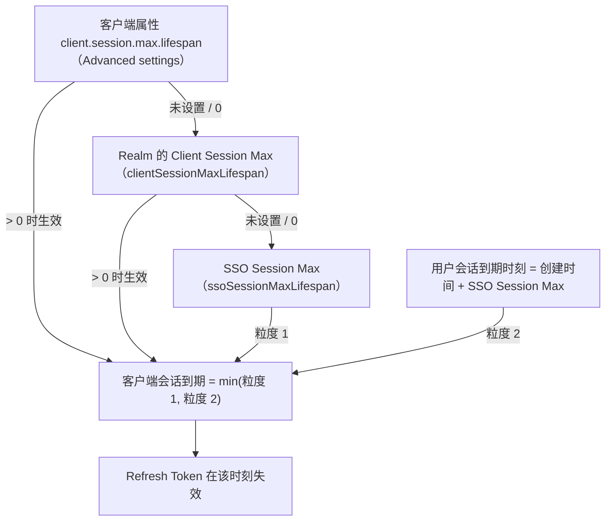

## 场景

三个症状，配置界面里都能找到「看起来对」的字段，但改完没效果：

1. SSO Session Idle 明明设了 30 分钟，用户却抱怨几分钟就被要求重新登录。
2. 为了让移动端的 Refresh Token 活得更久，把某个客户端 Advanced 里的 **Client Session Max** 调到比 **SSO Session Max** 还大——不生效；升级到 26.5 之后保存直接报错。
3. 客户端每次刷新都能拿到新的 `refresh_expires_in`，但某一次刷新突然返回 400 `invalid_token`，而用户在 IdP 的 SSO 会话其实还活着。

本文只讲一件事：**这些超时字段之间谁覆盖谁、谁夹住谁，以及改动的生效时机**。参数语义以 Keycloak 26.7.x 官方 *Server Administration Guide* 的 Sessions / Tokens 说明为准，行为以源码与官方测试用例为证；三层会话（用户会话 / 客户端会话 / Token）的概念与吊销机制不在本文重复，见 [IAM 会话管理与 Token 生命周期]()。

适用：Keycloak 26.x（本文基线 26.7.x），尤其是刚从 26.0 之前升上来、或准备升到 26.5+ 的部署。

不适用：17.x 及更早版本（Admin Console 字段划分与本文不同，且没有持久化用户会话）；其他 IdP 的字段名完全不一样，但「外层会话夹住内层 Token」的约束思路是通用的。

## 参数地图：哪个字段在哪个 Tab

先把「Realm Settings → Sessions」和「Realm Settings → Tokens」两个 Tab 分开记。把 SSO Session Idle 说成「在 Tokens 里配」是中文资料里最常见的错位，它会让你在错误的页面反复改一个不存在的字段。

**Sessions Tab（用户会话与客户端会话）**

| 字段 | Realm 级 JSON 属性 | 作用对象 |
|------|-------------------|---------|
| SSO Session Idle | `ssoSessionIdleTimeout` | 用户会话（父），空闲超时 |
| SSO Session Max | `ssoSessionMaxLifespan` | 用户会话（父），绝对超时 |
| SSO Session Idle Remember Me | `ssoSessionIdleTimeoutRememberMe` | 勾选 Remember Me 时的空闲超时 |
| SSO Session Max Remember Me | `ssoSessionMaxLifespanRememberMe` | 勾选 Remember Me 时的绝对超时 |
| Client Session Idle | `clientSessionIdleTimeout` | 客户端会话（子），空闲超时 |
| Client Session Max | `clientSessionMaxLifespan` | 客户端会话（子），绝对超时 |
| Offline Session Idle | `offlineSessionIdleTimeout` | 离线会话空闲超时 |
| Offline Session Max Limited | `offlineSessionMaxLifespanEnabled` | 是否给离线会话加绝对上限 |
| Offline Session Max | `offlineSessionMaxLifespan` | 离线会话绝对上限 |
| Client Offline Session Max | `clientOfflineSessionMaxLifespan` | 单个客户端的离线绝对上限 |

**Tokens Tab（Token 与动作有效期）**

| 字段 | Realm 级 JSON 属性 | 说明 |
|------|-------------------|------|
| Access Token Lifespan | `accessTokenLifespan` | Access Token 的 `exp` |
| Access Token Lifespan For Implicit Flow | `accessTokenLifespanForImplicitFlow` | 仅 Implicit Flow |
| Revoke Refresh Token | `revokeRefreshToken` | 刷新即轮换并撤销旧 Refresh Token |
| Refresh Token Max Reuse | `refreshTokenMaxReuse` | 与轮换配合的重用次数上限 |
| Client login timeout | `clientLoginTimeout` | 授权码流程完成时限 |

客户端级可以覆盖的是四个属性（Admin Console → 客户端 → Advanced settings，JSON 里表现为 `attributes`）：

```
client.session.idle.timeout
client.session.max.lifespan
client.offline.session.idle.timeout
client.offline.session.max.lifespan
```

字段名来自 Keycloak 源码常量 `OIDCConfigAttributes`，不是杜撰的别名——用 Admin REST API 或 partial import 写配置时必须用这四个字符串，界面上则显示为 Client Session Idle / Client Session Max / Client Offline Session Idle / Client Offline Session Max。

## 取值优先级：0 表示继承，min() 表示夹住

### 优先级顺序

`SessionExpirationUtils` 是 Keycloak 计算会话到期时刻的地方，客户端会话的最大生命周期按下面的顺序取值：



图的重点是右侧那个 `min()`：**无论你把 Client Session Max 调多大，客户端会话（也就是挂在它上面的 Refresh Token）都不会活得比用户会话更久**。源码中先算出 `clientSessionCreated + clientSessionMaxLifespan`，再与 `userSessionExpires` 取最小值，没有例外分支。所以「把 Client Session Max 设得比 SSO Session Max 大来延长 Refresh Token」这条路从来就不存在——26.5 之前它只是静默地取小值，让你以为配置生效了。

空闲超时同理按「客户端属性 → Realm 的 Client Session Idle → SSO Session Idle」取值，Remember Me 场景下会先用 `max(SSO Session Idle, SSO Session Idle Remember Me)` 作为基准；客户端会话空闲时间从「最后一次刷新」起算。注意客户端会话空闲判定与用户会话空闲判定是两条独立检查，**谁先到期谁生效**，所以最终有效空闲时间仍然是两者中较短的那个。

> 一段实测路径：Keycloak 官方测试 `RefreshTokenTimeoutsTest#refreshTokenUserSessionMaxLifespan` 把 `ssoSessionMaxLifespan` 设为 3600、`ssoSessionIdleTimeout` 设为 7200，然后在 1800 秒时刷新，断言 `refresh_expires_in <= 1800`。空闲值比最大生命周期大，Refresh Token 依然被 SSO Session Max 夹住——这就是上面那张图在代码里的样子。

### 26.5 起：越界配置不再静默

从 26.5 开始，Keycloak 在创建/更新 Realm 和客户端时会校验这些关系（官方升级说明 *Validation of client session timeouts*）。三处结果：

- 改 Realm：Realm 级的 Client Session Idle/Max 不得超过 SSO Session 对应值，否则抛错，报错文本形如 `Client Session Idle Timeout cannot be greater than Realm SSO Idle Timeout.` / `Client session max lifespan cannot exceed realm SSO session max lifespan.`
- 改客户端：客户端级属性超过 Realm 值时，表单直接给出校验错误，文本形如 `Client session idle timeout cannot exceed realm SSO session idle timeout.`
- Realm 开启了 Remember Me：允许的上限变为 `max(SSO 值, Remember Me 值)`，相应报错文本末尾会带上 `and RememberMe idle timeout.` / `and RememberMe Max span.`

有两个容易踩的边界：

1. **改 Realm 的 SSO 设置不会回头校验存量客户端**。官方明确说明当前只校验被更新/导入的那个对象，所以你可能在「动 Realm」的瞬间才第一次撞到报错。
2. **JSON 里写 `0` 或省略 ≠ 更宽松**，而是「继承上层值」。想让某个客户端比 Realm 更早掉会话（例如管理面应用要求 15 分钟绝对上限），填小于 Realm 的值是合法且推荐的；想比 Realm 更晚，26.5 开始直接拒绝。

## 为什么空闲时间不是「正好 30 分钟」

官方文档在 Sessions 说明下有一条 NOTE：**两分钟的空闲宽限窗口只在未启用持久化用户会话时生效**——即 30 分钟设置实际在 32 分钟失效，目的是避免集群/多数据中心里刷新消息尚未同步时误判会话过期。

而自 Keycloak 26.0 起，`persistent-user-sessions` **默认启用**（26 之前只持久化离线会话）。两件事叠起来意味着：默认部署里没有那 2 分钟宽限，到期时间就是配置值本身。如果你在网上看到「Keycloak 会自动多给 2 分钟」的结论，它描述的是易失会话（volatile sessions）的行为，不是你手上这套 26.x 默认配置。反过来说，为了排查问题显式禁用持久化会话后，观察到的到期时间会变，别把它当成 Keycloak 行为不稳定。

## 改配置什么时候生效

会话到期时刻是**按存储的时间戳与当前配置计算**的，不是签发 Token 时写死的绝对时间。官方测试直接覆盖了这个行为：`refreshTokenUserSessionMaxLifespanModifiedAfterTokenRefresh` 先以 7200 秒签发 Token，再把 SSO Session Max 与 Client Session Max 都改成 3600，然后把时钟推到 3700 秒刷新——返回 400 `invalid_token`，用户会话与客户端会话一并消失。

实践含义：

- **调小**超时会对**已经在线**的会话立即生效。上线前先在测试 Realm 用同一套数值验证一遍，不要在生产上「先调小观察」。
- 调大之后，已存在的会话是否立刻延长，取决于该会话是否还会走刷新；判定用的是当前配置，所以刷新生效是确定路径，不要假设所有客户端的既有会话都会马上变长。
- 用 `Refresh Token Max Reuse` + `Revoke Refresh Token` 做轮换时，旧 Refresh Token 的重用窗口同样受这层约束限制：外层会话一到期，轮换链整体失效，而不是「活到轮换次数用完」。

## 症状 → 先看什么

| 症状 | 先检查 | 常见根因 |
|------|-------|---------|
| 几分钟就要求重新登录 | `accessTokenLifespan`、网关侧 Cookie 有效期（如 oauth2-proxy `--cookie-expire` / `--cookie-refresh`） | 把 Access Token 生命周期当成用户登录有效期；网关 Cookie 比 IdP 会话短，前端不断重定向 |
| 空闲 30 分钟必掉线，即便期间一直在操作 | `ssoSessionIdleTimeout` 与客户端 `client.session.idle.timeout` | 客户端级空闲值比 Realm 小（或反过来）；刷新请求会 bump 空闲时间，纯后台任务不会 |
| 移动端/CLI 隔夜掉线 | `ssoSessionMaxLifespan`、`client.session.max.lifespan` | 无浏览器交互的客户端只能靠 Refresh Token，而它被 SSO Session Max 夹住 |
| 勾了 Remember Me 也没变长 | Realm 是否启用 Remember Me、`ssoSessionIdleTimeoutRememberMe` 是否为 0 | 值为 0 时回落成普通 SSO Session Idle，等于没配 |
| 离线 Token 似乎永不过期 | `offlineSessionMaxLifespanEnabled` | 该开关关闭时离线会话不按绝对时长失效，只按 `offlineSessionIdleTimeout` 空闲失效 |
| 刷新返回 400 `invalid_token`，但 IdP 会话还在 | 客户端会话是否已到期 | 客户端会话先于用户会话到期：浏览器流程会静默重新认证（用户无感），纯 bearer 客户端只能报错重登 |
| 26.5 升级后 Realm/客户端保存报超时校验错误 | 存量客户端 Advanced settings | 越界配置被新校验拦下，需要先改回合法范围 |

## 最小配置

下面两种写法等价，属性名以 Realm 级 JSON 为正：

```json
{
  "realm": "corp",
  "ssoSessionIdleTimeout": 1800,
  "ssoSessionMaxLifespan": 28800,
  "clientSessionIdleTimeout": 1800,
  "clientSessionMaxLifespan": 28800,
  "accessTokenLifespan": 300,
  "revokeRefreshToken": true,
  "refreshTokenMaxReuse": 0
}
```

```bash
# 用 kcadm 改现有 Realm（值均为秒）
kcadm.sh update realms/corp \
  -s ssoSessionIdleTimeout=1800 \
  -s ssoSessionMaxLifespan=28800 \
  -s clientSessionIdleTimeout=1800 \
  -s clientSessionMaxLifespan=28800

# 只收紧某个客户端的会话（不得超过 Realm 值）
kcadm.sh update clients/<client-uuid> -r corp \
  -s 'attributes."client.session.max.lifespan"=900'
```

数值取舍不在这里给「标准答案」：SSO Session Max 是有上限的信任窗口，办公后台 8-12 小时、管理面 1-2 小时都是常见区间，前提是你按自己的合规要求和登出体验验证过，而不是抄一个数字。

## 验证

```bash
# 1. 看 Realm 生效值（对比你刚写入的配置）
kcadm.sh get realms/corp | grep -E 'SessionIdle|SessionMax|AccessTokenLifespan|RevokeRefresh'
```

```bash
# 2. 观察真实签发结果：refresh_expires_in 就是被夹住之后的值
#    （占位符按实际环境替换；不要在生产上打印完整 Token）
curl -s -d "grant_type=password" -d "client_id=<client>" \
     -d "username=<user>" -d "password=<password>" \
     https://<idp-host>/realms/<realm>/protocol/openid-connect/token \
  | python3 -c 'import json,sys; r=json.load(sys.stdin); print("expires_in",r["expires_in"],"refresh_expires_in",r["refresh_expires_in"])'
```

```bash
# 3. 查在线会话（Admin REST API，路径取自官方 OpenAPI）
#    GET /admin/realms/{realm}/users/{user-id}/sessions
#    GET /admin/realms/{realm}/client-session-stats
curl -s -H "Authorization: Bearer $TOKEN" \
     "https://<idp-host>/admin/realms/<realm>/users/<user-id>/sessions" | python3 -m json.tool
```

```bash
# 4. 需要立刻让某人下线时的两个端点（作用范围不同）
#    POST /admin/realms/{realm}/users/{user-id}/logout   —— 该用户全部会话
#    DELETE /admin/realms/{realm}/sessions/{session-id}  —— 单个会话
```

另外，26.5 起 Account Console 的 **Device Activity** 会把离线会话和普通会话一起列出，用户自己就能签出，运维排查时可以直接让用户截图核对，比翻数据库快。Token 吊销后的行为边界（Access Token 在 `exp` 前仍可用）见 [IAM 单点登出排错]()。

## 回滚

1. 改之前先记录原值：`kcadm.sh get realms/<realm> > realm-before.json`，或者用 Realm 的 partial export 留档。
2. 这些参数是配置项而非 Schema 变更，改回原值即可恢复，不需要重启节点，也没有数据迁移。但注意上面讲的生效时机：**调小过的时间段已经让部分在线会话失效**，回滚配置不能复活它们，用户需要重新登录一次。
3. 如果因为 26.5 校验而无法保存，优先把越界的客户端属性清空（回到继承 Realm），而不是先把 Realm 的 SSO Session 值放大——后者等于把整个 Realm 的信任窗口一次性放宽。
4. 排查期间若临时禁用了持久化用户会话（`--features-disabled=persistent-user-sessions`），务必恢复：禁用该特性在开发分支的升级说明中已被标记为弃用（`changes-26_8_0.adoc`，截至 26.7.3 尚未发布，正式结论以发布后的 release notes 为准）。

## 常见问题（IAM 会话超时）

### IAM 里 SSO Session Idle 和 Client Session Idle 有什么区别？

SSO Session Idle 管的是用户在 IdP 的用户会话（父会话，一个用户一个），Client Session Idle 管的是每个客户端各自的子会话。父会话失效会带走全部子会话；子会话失效只影响该客户端，浏览器里如果父会话还在，用户点一下就会被静默重新认证。

### 为什么把 Client Session Max 调大不能让 Refresh Token 更长久？

因为客户端会话到期时刻与用户会话到期时刻取了 `min()`。客户端会话最多活得和 SSO Session Max 一样久，26.5 起这种越界配置会在保存时直接报错。

### 升级 Keycloak 26.5 后保存 Realm 报 "Client Session Idle Timeout cannot be greater than Realm SSO Idle Timeout" 怎么办？

这是新加的校验在拦截历史配置。先确认目标语义：如果希望这些客户端会话更短，就把 Realm 级或客户端级的值改到不超过 SSO Session 对应值；如果确实需要更长的窗口，应该调大 SSO Session Idle/Max（并重新评估信任窗口），而不是绕开校验。

### 改了会话超时，已经登录的用户会立刻被踢下线吗？

调小会立即影响在线会话——到期时刻按时间戳与当前配置计算，官方测试覆盖了「签发 Token 后修改上限，随后刷新即失败」的场景。调大不会让所有既有会话统一延长，实际以刷新时的判定为准。

### Access Token 该设多短？

Access Token 是无状态 JWT，撤销不会立即生效，所以它应该短（分钟级），长期登录状态交给会话和 Refresh Token 维持。真正的排查顺序是：先看 IdP 的会话上限，再看网关 Cookie 生命周期，最后才调 Access Token Lifespan。

## 关键来源

- Keycloak Server Administration Guide — Session and token timeouts（Sessions/Tokens 字段语义与 2 分钟宽限 NOTE）：<https://www.keycloak.org/docs/latest/server_admin/index.html#_timeouts>
- 文档源文件（main 分支）：<https://github.com/keycloak/keycloak/blob/main/docs/documentation/server_admin/topics/sessions/timeouts.adoc>
- 26.5 升级说明 — Validation of client session timeouts：<https://github.com/keycloak/keycloak/blob/main/docs/documentation/upgrading/topics/changes/changes-26_5_0.adoc>
- 26.0 发布说明 — User sessions persisted by default：<https://www.keycloak.org/docs/latest/release_notes/index.html>
- 到期计算源码：<https://github.com/keycloak/keycloak/blob/main/server-spi-private/src/main/java/org/keycloak/models/utils/SessionExpirationUtils.java>
- 客户端级校验源码：<https://github.com/keycloak/keycloak/blob/main/services/src/main/java/org/keycloak/validation/DefaultClientValidationProvider.java>
- Realm 级校验源码：<https://github.com/keycloak/keycloak/blob/main/model/storage-private/src/main/java/org/keycloak/storage/datastore/DefaultExportImportManager.java>
- 官方测试用例：<https://github.com/keycloak/keycloak/blob/main/tests/base/src/test/java/org/keycloak/tests/oauth/RefreshTokenTimeoutsTest.java>
- Admin REST API（会话相关端点）：<https://www.keycloak.org/docs-api/latest/rest-api/index.html>
