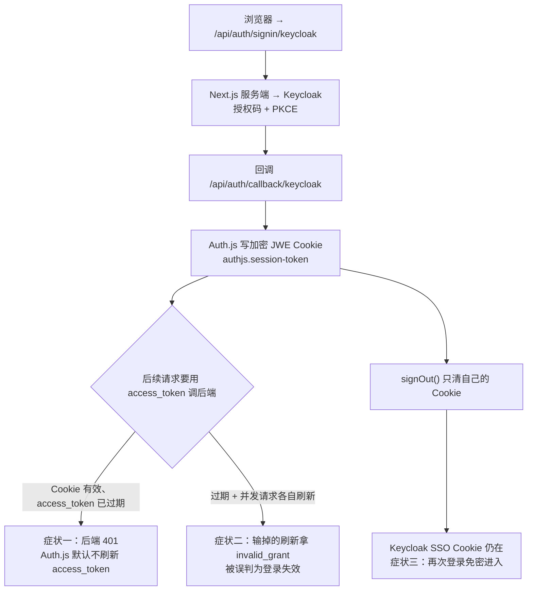

## 场景

两个症状，都发生在「登录本身完全正常」之后：

1. 用户登录成功、页面能看到自己的名字，但过几分钟后所有需要后端接口的操作开始 401；刷新页面还是登录态，于是有人把它当成后端的 Token 校验有 bug。
2. 用户点了应用里的「退出」，界面回到登录页；再点「登录」，**没有输密码就进去了**，看起来像登出没生效。

**适用**：Next.js（App Router）用 Auth.js / NextAuth 通过 OIDC 对接 Keycloak，需要把 access_token 透传给后端 API，并且要求登出真的结束 Keycloak 会话。

**不适用**：纯浏览器 OAuth 客户端（`keycloak-js` 直连，见 [Keycloak Web Origins 与 CORS 边界](/blog/keycloak-cors-web-origins/)）；oidc-client-ts / react-oidc-context 这类前端库；非 JS 技术栈的资源服务器接入（Java 侧见 [Spring Boot 资源服务器接入 Keycloak]()）。

三个症状的成因分别在不同的层，先看全貌：



## 先确定这条路是否还该走：Auth.js 2025 年之后的定位

写代码前值得知道的一个现状：**Auth.js（原 NextAuth.js）自 2025 年 9 月起由 Better Auth 团队维护**。官方公告的措辞是「继续处理安全补丁与紧急问题」，并明确建议**新项目直接用 Better Auth**，唯一点名的例外是「不依赖数据库的 stateless 会话管理」——这恰好是 Auth.js 默认 `strategy: "jwt"` 的形态。

| 你的情况 | 建议 | 依据 |
|---------|------|------|
| 已有 Auth.js/NextAuth 部署，只需要把 Keycloak 接对 | 继续用 Auth.js，按本文修 Token 与登出 | 项目仍在维护安全补丁，迁移成本与风险大于收益 |
| 新项目，需要一个不带数据库的会话 | Auth.js 的 JWT 会话仍是合理选项 | 公告把这一条列为「暂时只有 Auth.js 能做」的能力 |
| 新项目，可以接受数据库会话 | Better Auth 的 `genericOAuth` 插件（含 `keycloak()` provider helper，需要 `issuer`） | 官方推荐方向；该插件原生支持 `endSessionEndpoint`（RP-Initiated Logout）与 `pkce` 开关 |

这张表不改任何技术结论，但它决定了你后续要维护哪一套 Token 刷新代码——两者的刷新都要自己写，差别是 Better Auth 把登出端点与 PKCE 做成了配置项。

还要先接受 Auth.js 默认会话策略的三个硬边界（均来自官方会话策略文档）：

- **默认 `strategy: "jwt"`**（只有配了 adapter 才默认切到数据库会话），用户数据存在加密 JWE Cookie 里，服务端不保存会话。
- **JWT 会话无法提前失效**。官方原文：想在编码的过期时间之前让 JWT 失效是做不到的，除非维护服务端黑名单。
- **Cookie 有体积上限**，超过约 4096 字节时 Auth.js 会自行分片（`authjs.session-token.0`、`.1`…，HTTPS 下带 `__Secure-` 前缀）。分片本身不是错，但它会让「哪些 Cookie 必须被网关注入到上游」变成一个部署问题，参见 [Token 体积与 Cookie 膨胀](/blog/keycloak-token-size-oauth2-proxy-cookies/)。

如果这些边界与你的合规要求冲突（比如必须支持「管理员强制下线」），那说明你要的不是修 Auth.js，而是换架构——这种情况直接看 [IAM BFF 模式与 SPA Token 安全]()，那里的服务端会话能立刻撤销。

## 症状一：Session 还在，后端全是 401

### 根因：`access_token` 根本不在 Session 里，也没有任何自动刷新

Auth.js 官方 Refresh Token Rotation 指南的第一句话就是结论：**目前没有内置的自动 Refresh Token 轮换**（"there is no built-in solution for automatic Refresh Token rotation"）。

具体到代码，默认的 `session` 回调只往外暴露 `name` / `email` / `image` / `sub`。`account.access_token`、`account.refresh_token`、`account.expires_at` 只在**首次登录那一次**的 `jwt` 回调里出现，如果你没存，它们就被丢掉了。

于是就出现了最典型的错配：

| 层 | 默认有效期 | 后果 |
|----|-----------|------|
| Auth.js 会话 Cookie | 默认 30 天 | `auth()` 一直返回非空 Session，页面、中间件都认为用户是登录态 |
| Keycloak access_token | 默认 5 分钟（Realm → Tokens） | 5 分钟后所有带它的后端调用 401 |

而 Auth.js **不会因为 access_token 过期就让 Session 失效**——它不知道你在拿这个 Token 做什么。所以「界面显示已登录 + 接口全 401」不是 bug，是默认行为。

### 最小实现：在 `jwt` 回调里自己刷新

```ts
// auth.ts
import NextAuth from "next-auth"
import Keycloak from "next-auth/providers/keycloak"

const issuer = process.env.AUTH_KEYCLOAK_ISSUER!          // https://sso.example.com/realms/app
const tokenEndpoint = `${issuer}/protocol/openid-connect/token`

async function refreshTokens(refreshToken: string) {
  const res = await fetch(tokenEndpoint, {
    method: "POST",
    headers: { "content-type": "application/x-www-form-urlencoded" },
    body: new URLSearchParams({
      grant_type: "refresh_token",
      refresh_token: refreshToken,
      client_id: process.env.AUTH_KEYCLOAK_ID!,
      client_secret: process.env.AUTH_KEYCLOAK_SECRET!,
    }),
  })
  const body = await res.json()
  if (!res.ok) throw Object.assign(new Error(body.error ?? "refresh_failed"), {
    status: res.status,
    error: body.error,
  })
  return body as { access_token: string; expires_in: number; refresh_token?: string }
}

export const { handlers, auth, signIn, signOut } = NextAuth({
  providers: [Keycloak],           // AUTH_KEYCLOAK_ISSUER 必须包含 /realms/<realm>
  session: { strategy: "jwt" },
  callbacks: {
    async jwt({ token, account }) {
      if (account) {                // 只在登录那一次有值
        token.accessToken = account.access_token
        token.refreshToken = account.refresh_token
        token.expiresAt = account.expires_at          // 秒；OIDC 时由 expires_in 换算
        token.idToken = account.id_token              // 登出要用，见症状三
        return token
      }

      // 提前 60 秒判定过期，避免大量请求卡在同一瞬间一起刷新
      if (typeof token.expiresAt === "number" && Date.now() < (token.expiresAt - 60) * 1000) {
        return token
      }
      if (!token.refreshToken) { token.error = "MissingRefreshToken"; return token }

      try {
        const t = await refreshTokens(token.refreshToken as string)
        token.accessToken = t.access_token
        token.expiresAt = Math.floor(Date.now() / 1000) + t.expires_in
        if (t.refresh_token) token.refreshToken = t.refresh_token   // 轮换开启时必须回写
        token.error = undefined
      } catch (e: any) {
        token.error = e?.error ?? "RefreshFailed"
      }
      return token
    },
    async session({ session, token }) {
      session.error = token.error
      return session
    },
  },
})

declare module "next-auth/jwt" {
  interface JWT { accessToken?: string; refreshToken?: string; expiresAt?: number; idToken?: string; error?: string }
}
declare module "next-auth" {
  interface Session { error?: string }
}
```

三个容易写错的地方：

1. **`account` 只在首次登录那一次非空**。把它当「每次回调都有」来写，刷新逻辑永远不会触发。
2. **刷新成功后必须回写新的 `refresh_token`**。Keycloak 打开 Revoke Refresh Token 时旧 Refresh Token 立即失效，漏写一次，下一次刷新必然失败——这是「上线第一周正常、第二周开始掉线」的经典根因，机制细节见 [IAM BFF 模式与 SPA Token 安全]()。
3. **`expires_at` 是秒**，而 `Date.now()` 是毫秒。少乘 1000 会让每次请求都触发刷新。

### 刷新的两个外部前置条件

- **Keycloak 必须真的下发了 refresh_token**。如果 `token.refreshToken` 一直是空，先看授权码流程返回的 token set 里有没有它，再单独用 curl 验证刷新能不能成功。
- **Refresh Token 的实际可用窗口被 SSO Session 夹住**。Realm 的 SSO Session Idle / Max 到点后，刷新会直接失败。改了 Realm 的超时设置却只盯 Realm → Tokens 里的 Refresh Token 时长，会得到「配置明明很长却一小时就掉线」的结论，取值优先级见 [IAM 会话超时排错](/blog/keycloak-session-timeouts/)。

## 症状二：并发刷新让一部分请求拿到 `invalid_grant`

Auth.js 官方指南自己承认了这个问题：单次使用的 Refresh Token 在并发刷新时会触发竞态（"in some cases, a race-condition might occur if multiple requests will try to refresh the token at the same time"），并且明确写了团队还没有内置解决方案。

在 App Router 下这不是理论问题：**一次页面渲染里的多个 Server Component / Route Handler 会各自调用 `auth()`**，每个都发现 Token 已过期，于是各自跑一遍 `jwt` 回调，对同一条 Refresh Token 发起 N 个并发刷新请求。

Keycloak 侧的处理（源码级细节见 [IAM BFF 模式与 SPA Token 安全]()）可以概括为：同一条刷新链的并发刷新会被串行化，**输掉的那个请求拿到 `invalid_grant`**（`Stale token`）。

关键在于——**同一个错误码，在两种架构下含义不同**：

| 架构 | `invalid_grant` 意味着什么 | 该怎么处理 |
|------|--------------------------|-----------|
| BFF（服务端会话 + 进程内单飞） | 这条刷新链真的已经不可用了 | 清服务端会话，走重新登录 |
| Auth.js（无单飞，默认 JWT 会话） | 很可能只是这次并发里输了 | 不要立刻清会话，先区分「输掉竞争」和「链路真死」 |

所以从 BFF 页面的「`invalid_grant` 就清会话」直接照搬到 Auth.js，会把偶发的并发失败放大成「用户随机被踢出登录」。

区分方法只有一个：**看下一次请求能否用同一条 Refresh Token 成功刷新**。能成功 → 是并发输家，忽略本次失败、让刷新重试一次即可；持续失败 → 链路已死，清会话重新登录。别用「收到 400 就跳登录页」来判断。

在 Auth.js 里做单飞，比在有状态服务里难一层：

1. **进程内的单飞表只在单个实例内有效**。Serverless / 多副本部署下，两个实例看不到彼此的表，也看不到彼此的 Cookie——每个实例都在给浏览器下新的 `authjs.session-token`，谁的 `Set-Cookie` 最后到达由网络决定。
2. **能收敛的只有三条路**：把提前量做大（本文示例的 60 秒）让并发窗口尽量落在同一个请求里；把单飞放到共享存储（Redis `SET NX PX` 之类）并接受它变成一个有状态的依赖；或者改用数据库会话策略让会话状态集中。
3. **最省事的替代是关掉 Keycloak 的 Revoke Refresh Token**（Realm → Tokens）。代价要写清楚：关闭后同一条 Refresh Token 可被重复使用，失去对 Token 重用/泄露的检测能力。这是一个「用安全换可用性」的明确取舍，只有在你确认后端会独立校验 access_token 有效期时才划算。

## 症状三：登出后又能免密进去

### 根因：`signOut()` 只删自己的 Cookie

Auth.js 的 `signOut()` 做的事情是销毁自己的会话（JWT 策略下就是删除那个加密 Cookie）。它**不会**调用 Keycloak 的 `end_session_endpoint`。因此 Keycloak 的 SSO Cookie 还在，下一次 `signIn("keycloak")` 时 Keycloak 发现浏览器已有会话，直接发码回跳——中间不出现登录页。这不是「登出失败」，是只登出了一半。

要真正结束这场会话，必须由应用显式跳转到 Keycloak 的登出端点。这个端点的校验顺序值得记住（以下行为来自 Keycloak `LogoutEndpoint` 的公开源码）：

| 请求情形 | Keycloak 的反应 |
|---------|----------------|
| 带了 `post_logout_redirect_uri`，但既没有 `client_id` 也没有 `id_token_hint` | 400，错误文案：`Either the parameter 'client_id' or the parameter 'id_token_hint' is required when 'post_logout_redirect_uri' is used.` |
| `post_logout_redirect_uri` 不在该客户端的 **Valid post logout redirect URIs** 里 | 400 `Invalid redirect uri` |
| `client_id` 传了但 Realm 里找不到这个客户端 | 强制显示登出确认页 |
| 能定位客户端，且带了匹配的 `id_token_hint` | 跳过确认页，直接登出并回跳 |
| `id_token_hint` 指向的会话已经不存在，或该 ID Token 比当前会话更早签发 | 400（`Session not active` / `Session expired`），不会静默成功 |

关于 `id_token_hint` 过期这件事，可以直接排除一项嫌疑：RP-Initiated Logout 规范要求 OP 在会话仍存在时**接受已过期的 ID Token**（"The OP SHOULD accept ID Tokens … even when the exp time has passed"），Keycloak 的登出端点对 hint 只做签名与类型校验。真正的失败原因是上面表里的最后一行——会话没了，而不是 hint 过期了。

### 实现：先清本地，再跳 Keycloak

顺序不能反。如果先跳 Keycloak、等它 400 再清本地，用户会卡在「我以为点了退出、但还在登录态」的状态里。

```ts
// app/signout/route.ts —— 必须是 Route Handler 或 Server Action
import { auth, signOut } from "@/auth"

export async function GET() {
  const session = await auth()
  const idToken = (session as any)?.idToken

  await signOut({ redirect: false })      // 1. 先删本地会话 Cookie

  const url = new URL(`${process.env.AUTH_KEYCLOAK_ISSUER}/protocol/openid-connect/logout`)
  if (idToken) url.searchParams.set("id_token_hint", idToken)
  url.searchParams.set("client_id", process.env.AUTH_KEYCLOAK_ID!)
  url.searchParams.set("post_logout_redirect_uri", "https://app.example.com/signed-out")

  return Response.redirect(url)           // 2. 再让 Keycloak 结束 SSO 会话
}
```

两个 Next.js 层面的硬约束：

- **不能在 Server Component 的渲染过程里调 `signOut`**。Next.js 会直接报 `Cookies can only be modified in a Server Action or Route Handler`。所以登出要落在 Route Handler（如上）或 Server Action 里，不要写在页面组件的渲染路径上。
- **`id_token` 默认不在 Session 里**，需要像症状一的示例那样在 `jwt` 回调里把 `account.id_token` 存下来，再通过 `session` 回调暴露（或者用 `authorized` / `session` 回调按需传递）。不存就没有 hint，只能退化成 `client_id` + 确认页。

如果 `id_token_hint` 指向的会话已经结束（比如用户开了两个标签页，其中一个已经登出），上面的流程会拿到 400。这不是问题：本地 Cookie 已经先清了，用户看到的是一个 400 页面而已。可以再加一步——把这个 URL 换成自己的 `/signed-out` 页面，由服务端先试着调 logout 端点、再无条件重定向到站内页面，用户体验上就没有 400 了。

## Keycloak 侧最小配置

客户端（Realm → Clients → 你的 Next.js 应用）：

| 字段 | 值 | 说明 |
|------|-----|------|
| Client authentication | ON | Auth.js 用 `AUTH_KEYCLOAK_SECRET` 走密钥认证；Keycloak 的 "Client Id and Secret" 认证器同时接受 `client_secret_basic` 与 `client_secret_post`，不需要为 Auth.js 额外改认证器 |
| Standard flow | ON | Auth.js 用的是授权码流程 |
| Valid redirect URIs | `https://app.example.com/api/auth/callback/keycloak` | 必须逐字符匹配，末尾不要多加 `/`；本地开发另外加 `http://localhost:3000/api/auth/callback/keycloak` |
| Valid post logout redirect URIs | `https://app.example.com/signed-out` | 不登记就是这个症状：`Invalid redirect uri` |
| Web Origins | 不需要 | Auth.js 是服务端换码，浏览器不直连 Keycloak 的 token 端点；只有 `keycloak-js` 这类浏览器客户端才要配，见 [Web Origins 与 CORS 边界](/blog/keycloak-cors-web-origins/) |
| PKCE Code Challenge Method | 可开可不开 | Auth.js 的 `checks` **默认就是 `["pkce"]`**（官方 reference），客户端强制 S256 也能满足；注意默认**不校验 `state`**，只有设置了 `redirectProxyUrl` 时才会自动加上 |

关于 `AUTH_KEYCLOAK_ISSUER` 再强调一点：它同时被浏览器和服务端使用，必须包含 `/realms/<realm>`，并且**服务端容器要能解析这个地址**。踩到的表现通常是发现请求失败或 `Issuer mismatch`，这类问题的解法不是改 issuer 字符串，而是让内网能访问该域名，或按 backchannel 动态解析处理——四种拓扑的取舍见 [Keycloak Hostname v2 配置与 v1 选项迁移]()。

## 验证

```bash
# 1. 确认发现文档里的端点和你的假设一致
curl -s https://sso.example.com/realms/app/.well-known/openid-configuration \
  | jq '{issuer, token_endpoint, end_session_endpoint}'

# 2. 单独验证 Refresh Token 能不能换 Token（用一次真实登录拿到的 RT）
curl -s -X POST https://sso.example.com/realms/app/protocol/openid-connect/token \
  -d grant_type=refresh_token \
  -d client_id=nextjs-app -d client_secret="$SECRET" \
  -d refresh_token="$RT" | jq '{access_token: (.access_token|length), expires_in, has_new_rt: (.refresh_token != null)}'

# 3. 确认登出回跳地址已登记（把回跳地址换成不存在的值，对比报错）
curl -s -o /dev/null -w '%{http_code}\n' -G \
  "https://sso.example.com/realms/app/protocol/openid-connect/logout" \
  --data-urlencode "client_id=nextjs-app" \
  --data-urlencode "post_logout_redirect_uri=https://app.example.com/signed-out"
# 期望 302；填一个未登记的地址应得到 400 Invalid redirect uri

# 4. 看 access_token 的真实有效期与 aud/iss（后端 401 时先做这一步）
echo "$AT" | cut -d. -f2 | base64 -d 2>/dev/null | jq '{iss, aud, exp: (.exp|todate), azp}'
```

浏览器侧只需要看一件事：登录成功后 **`authjs.session-token` 有没有出现分片**（`.0`/`.1`）。分片代表加密 Cookie 里塞了 Token，任何会在网关层丢弃附加 Cookie 的配置都会变成随机掉登录。

## 常见错误对照表

| 症状 | 根因 | 先查什么 | 修复 |
|------|------|---------|------|
| 登录正常，几分钟后接口全 401 | 默认不刷新 access_token，Session 与 Token 有效期错配 | `session.accessToken` 是否为 undefined | 按症状一在 `jwt` 回调里刷新并暴露 |
| 偶尔跳到登录页，用户说「我没登出」 | 并发刷新里输掉的那个返回 `invalid_grant`，被当成登录失效 | 是否把任何 400 都直接清会话 | 区分竞争失败与链路真死，只对后者清会话 |
| 刷新一直失败、报 `Stale token` | 轮换开启但没回写新的 `refresh_token` | `jwt` 回调有没有 `if (t.refresh_token)` 回写 | 补上回写；同时检查是否真的存在并发刷新 |
| 用户被「强制登出」后怎么都进不来 | 复用预算被吃光，Keycloak 持续返回 `Maximum allowed refresh token reuse exceeded` | 会话是否已被撤销（Admin Console → Sessions） | 只能重新登录；根因排查见 BFF 页面的三条故障路径 |
| 点退出后再点登录，免密进入 | `signOut()` 不结束 Keycloak SSO 会话 | Keycloak 的 SSO Cookie 是否还在 | 按症状三显式跳 `end_session_endpoint` |
| 登出报 `Invalid redirect uri` | 回跳地址没登记在 Valid post logout redirect URIs | 客户端配置字段与实际回跳 URL 是否逐字符一致 | 登记；注意 `+` 表示复用 Valid redirect URIs |
| 登出报 `Session not active` | `id_token_hint` 指向的会话已经结束 | 是否在多个标签页里重复登出 | 先清本地会话再跳 Keycloak，把 400 当正常收尾 |
| 页面报 `Cookies can only be modified in a Server Action or Route Handler` | 在 Server Component 渲染路径里调了 `signOut` | 调用点是不是页面组件 | 挪到 Route Handler 或 Server Action |
| 发现请求失败 / `Issuer mismatch` | 服务端解析不到 issuer 指向的域名 | 容器内 `curl $AUTH_KEYCLOAK_ISSUER` | 打通内网访问或在你的部署形态下配置 backchannel |

## 回滚

按改动顺序倒着退，每一步都能单独止住问题：

1. **只回滚登出**：把登出入口改回 `signOut({ redirectTo: "/login" })`。用户会重新能登录，代价是登出后 SSO 会话残留（回到症状三）。这是风险最低的一步。
2. **只回滚刷新**：删掉 `jwt` 回调里的刷新分支，把 `token.error` 的透出保留。后果是回到「几分钟后接口 401」，但不会再有并发刷新把会话打散——如果你现在正被随机踢下线困扰，这是先止血的顺序。
3. **回滚客户端配置**：`Valid post logout redirect URIs` 先留着无害，不需要退；PKCE 强制开关退掉不影响已上线的客户端，因为 Auth.js 本来就会发 PKCE。
4. **回滚 Realm 级开关**：如果为了缓解症状二关掉了 Revoke Refresh Token，事后要恢复它，记得同时确认应用已经正确回写新的 Refresh Token，否则恢复轮换会立刻引发大面积刷新失败。

回滚判据是「用户能稳定刷新、登出能真正结束会话」，不是「日志没有新报错」——Token 相关的改动在已签发的 Token 上不会立刻体现，必须用重新登录后的流程验证。

## 常见问题（IAM 客户端接入）

### IAM 里 Next.js 应用到底该用 Auth.js 还是 BFF？

判据是「谁能撤销会话」。Auth.js 默认把用户数据放在加密 Cookie 里（JWT 会话），服务端没有会话记录，因此做不到即时吊销；BFF 把 Token 放在服务端，能立刻撤销，代价是你要维护会话存储与并发刷新。合规要求里出现「管理员强制下线」「登录态集中审计」这类条目时，直接选 BFF。

### Auth.js 算 IAM 里的 BFF 吗？

不算，但很接近。共同点是浏览器拿不到明文 Token、刷新在服务端发生；差别是 Auth.js 的 Token 存在**客户端 Cookie** 里，服务端无状态，所以多副本天然可扩展，但拿不到「服务端撤销」这个能力。把它当作「无状态 BFF」来规划部署约束比较准确。

### 为什么本地开发一切正常，上线后才出现 401 和被踢出？

三个典型差异：本地是单进程（并发刷新撞不到一起，也没有多副本 Cookie 竞争）；localStorage 与 Cookie 的生命周期不同；本地 Keycloak 通常是 `hostname-strict=false` 的开发模式，issuer 与内网地址的差异不会暴露。上线前至少验证「并发访问同一个过期 Token」和「登出后重登」这两条路径。

### access_token 应该放在 Session Cookie 里，还是只在服务端用？

在 Auth.js 的 JWT 策略下两者是一回事——加密 Cookie 就是唯一存储。要减少暴露面，就控制放进 JWT 的字段：只放后端真正需要的 access_token、expires_at、refresh_token 与 id_token，roles/groups 之类在 `session` 回调里按需读取，不要整包透传。Token 体积直接影响 Cookie 是否分片，见 [Token 体积与 Cookie 膨胀](/blog/keycloak-token-size-oauth2-proxy-cookies/)。

## 关键来源

- Auth.js Keycloak Provider：`AUTH_KEYCLOAK_ISSUER` 需包含 realm、回调地址 `/api/auth/callback/keycloak` — https://authjs.dev/getting-started/providers/keycloak
- Auth.js Refresh Token Rotation 指南：「目前没有内置的自动轮换」与并发竞态说明 — https://authjs.dev/guides/refresh-token-rotation
- Auth.js Session Strategies：默认 JWT、不可提前失效、Cookie 分片与 4096 字节上限 — https://authjs.dev/concepts/session-strategies
- Auth.js Providers reference：`checks` 默认 `["pkce"]`，设置 `redirectProxyUrl` 时自动加入 `state` — https://authjs.dev/reference/core/providers
- Auth.js 加入 Better Auth 的公告（2025-09-22）：维护范围与「新项目建议」— https://better-auth.com/blog/authjs-joins-better-auth
- Better Auth Generic OAuth 插件：`keycloak()` provider helper、`endSessionEndpoint`、`pkce` — https://better-auth.com/docs/plugins/generic-oauth
- Keycloak `LogoutEndpoint`：`client_id`/`id_token_hint` 缺参报错文案、post logout URI 校验、确认页与 `Session not active` 分支 — https://github.com/keycloak/keycloak/blob/main/services/src/main/java/org/keycloak/protocol/oidc/endpoints/LogoutEndpoint.java
- OpenID Connect RP-Initiated Logout 1.0：OP 应在会话仍存在时接受已过期的 ID Token 作为 hint — https://openid.net/specs/openid-connect-rpinitiated-1_0.html
