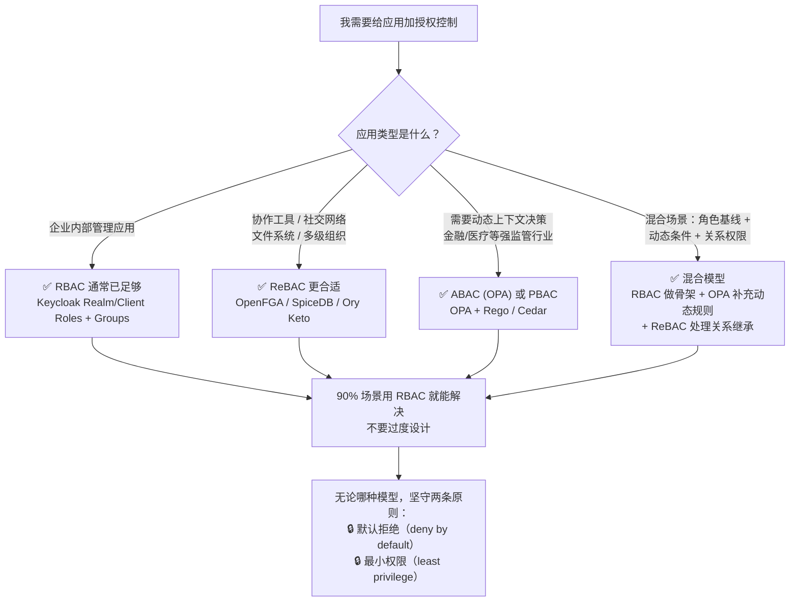

## 20.1 IAM 授权模型的演进

在企业 IAM（身份与访问管理）体系中，授权模型决定了"谁能访问什么"。从早期的自主访问控制（DAC）和强制访问控制（MAC），到如今主流的 RBAC、ABAC、ReBAC，每一次演进都在提升权限管理的精细度和可扩展性。理解这些模型的区别，是设计可维护 IAM 权限体系的前提。关于 IAM 整体概念和身份生命周期管理，请参阅 [IAM 基础概念]()；IAM 架构层面的设计考量见 [IAM 架构设计指南]()。

```
1960s-70s  1970s-80s  1990s-2000s   2000s-2010s    2019
   │          │          │              │             │
  DAC        MAC       RBAC           ABAC         ReBAC
(自主)     (强制)    (角色)         (属性)      (关系)
                    NIST 2004     XACML 2003   Google Zanzibar

复杂度递增，精细度递增
```

## 20.2 IAM RBAC（基于角色的访问控制）

### RBAC 在 IAM 体系中的定位

在企业 IAM 实践中，RBAC 是使用最广泛的授权模型。它的核心优势在于"角色"这个概念与组织架构天然对齐——HR 系统里叫"部门经理"，IAM 系统里就映射为 `manager` 角色，权限跟着角色走，而非跟着人走。这使得 IAM 权限审计（"谁拥有管理员权限？"）和权限回收（员工离职时移除角色即可）变得直观可控。本节聚焦 Keycloak 中的 RBAC 落地，实际生产环境中常与 [IAM 会话管理]() 配合，确保角色变更后会话及时失效。

### 核心模型

```
用户 ──→ 角色 ──→ 权限

Alice → [经理] → [审批报销, 查看团队报表]
Bob   → [员工] → [提交报销, 查看自己的报表]
```

### RBAC 的三个层次

**RBAC0（基础 RBAC）**：用户 → 角色 → 权限
**RBAC1（层次 RBAC）**：角色之间有继承关系

```
         [员工]
           │
    ┌──────┴──────┐
    │             │
  [组长]       [专员]
    │
  [经理]
    │
  [总监]
```

**RBAC2（约束 RBAC）**：角色互斥（SoD）、基数限制、先决条件

### RBAC 在 Keycloak 中的实现

Keycloak 的 RBAC 由三层组成：

- **Realm Roles**：Realm 级别的角色（全局）
- **Client Roles**：Client 级别的角色（应用特有）
- **Composite Roles**：组合角色（包含其他角色）

结合 Group 实现用户 → 组 → 角色的间接映射。

### RBAC 的局限

- **角色爆炸**：当业务精细化时，角色数量激增
- **静态性**：角色不能根据上下文（时间、位置、设备）动态调整
- **跨域困难**：不同系统的角色体系无法互通

## 20.3 IAM ABAC（基于属性的访问控制）

### 核心模型

不依赖角色，而是根据多维度属性动态决定：

```
策略 = f(主体属性, 客体属性, 环境属性, 操作)

决策: IF
  主体.clearance >= 资源.sensitivity AND
  主体.department == 资源.owner_department AND
  环境.time in BusinessHours AND
  环境.location in TrustedLocations AND
  操作 == "read"
THEN Permit
```

### XACML 标准

XACML（eXtensible Access Control Markup Language）是 ABAC 的标准化实现框架，基于 OASIS 标准：

```
┌──────┐     ┌──────┐     ┌──────┐     ┌──────┐
│ PAP  │────→│ PDP  │────→│ PEP  │────→│ 应用  │
│策略管理│     │策略决策│     │策略执行│     │      │
└──────┘     └──┬───┘     └──────┘     └──────┘
               │
          ┌────┴────┐
          │  PIP    │  ← 策略信息点（属性来源）
          └─────────┘
```

XACML 虽然概念强大，但复杂度高、性能开销大。在新项目中，更多选择 OPA（Open Policy Agent）或基于策略引擎的轻量方案。

### OPA（Open Policy Agent）

OPA 是 CNCF 毕业项目，使用 Rego 语言编写策略：

```rego
package example.authz

import rego.v1

default allow := false

allow if {
    # 用户必须属于被访问部门
    input.user.department == input.resource.department
    # 仅在工作时间（9:00-18:00）
    time.now_ns > input.business_hours.start
    time.now_ns < input.business_hours.end
    # 用户必须是活跃状态
    input.user.active == true
}
```

### ABAC 的优势与挑战

**优势**：
- 极度的灵活性，支持复杂策略
- 不依赖预定义角色
- 支持动态上下文

**挑战**：
- 策略难以可视化和审计（"这个用户最终能做什么？"）
- 策略编写和维护成本高
- 性能开销（每个请求需要评估多个属性）
- 属性来源的可靠性问题

### PBAC（基于策略的访问控制）

**PBAC（Policy-Based Access Control）** 并非与 ABAC 对立的新模型，而是把「以策略为授权第一公民」这一思想独立出来：策略显式、可版本化、外部化于应用代码，由策略引擎在运行时评估。它常被视为 ABAC 的工程化升华——ABAC 提供「按属性决策」的能力，PBAC 强调「策略即数据 + 引擎评估」的架构。

| 维度 | ABAC（概念） | PBAC（工程） |
|------|-------------|--------------|
| 策略承载 | 散落在代码 / 配置中 | 独立策略文件，可版本化、可审计 |
| 评估方式 | 应用内嵌逻辑 | 外部策略引擎统一评估（OPA、Cedar 等） |
| 变更成本 | 改代码、重新发版 | 热更新策略，应用零改动 |
| 治理 | 难以追溯「谁在何时改了什么策略」 | 策略有版本与变更历史 |

典型实现仍是 [OPA]() / Rego、AWS Cedar 等；在合规密集型行业（金融、医疗、政务），把 RBAC 的静态角色与 PBAC 的动态策略叠加，是当前最主流的落地形态（见 20.7 选型决策树）。术语速查见[附录术语表]()。

## 20.4 IAM ReBAC（基于关系的访问控制）

### Google Zanzibar

ReBAC 的理论基础来自 Google 的 Zanzibar 论文（2019）。核心思想是用**关系图**来表达权限：

```
关系元组: object⟨relation⟩→user / user_set     即 (客体, 关系, 主体)
（object 是被保护的资源，relation 是关系/权限名，user 或 user_set 是被授权的主体）

示例（Zanzibar 记法）:
- document:123⟨owner⟩→user:Alice
- document:123⟨parent⟩→folder:projects
- document:123⟨editor⟩→user:Bob
- folder:projects⟨viewer⟩→user:Charlie

userset 重写规则（权限由显式定义的重写规则推导，而非关系本身自动继承）:
document:⟨viewer⟩ → document:⟨viewer⟩ ∪ (document.parent:⟨viewer⟩)
即：文档的 viewer = 直接 viewer ∪ 其父文件夹的 viewer

权限推导:
Charlie 能看 document:123 吗？
→ Charlie 是 folder:projects 的 viewer
→ document:123 的 parent 是 folder:projects
→ 经重写规则，folder:projects 的 viewer 被纳入 document:123 的 viewer
→ 因此 Charlie 可以看 document:123 ✓
```

### ReBAC 的核心概念

- **关系元组**：(object, relation, user/user_set)
- **权限是通过关系推导出来的**，不是直接分配的
- **userset 重写规则**：定义了如何根据关系计算权限

### 开源实现

- **OpenFGA**（原 Auth0 FGA）：ReBAC 开源实现，CNCF Sandbox 项目（截至本稿）
- **SpiceDB**（authzed）：受 Zanzibar 启发的权限数据库
- **Ory Keto**：Ory 生态的权限服务，详见 [Ory 深度解析]()

### ReBAC 适合的场景

- 协作工具（Google Docs、Notion）
- 社交网络（Facebook、GitHub）
- 文件系统权限
- 多级组织架构

## 20.5 模型对比

| 维度 | RBAC | ABAC | ReBAC |
|-----|------|------|-------|
| 权限表达 | 角色 → 权限 | 属性条件 | 关系推导 |
| 精细度 | 粗 | 极细 | 中细 |
| 动态性 | 静态 | 高度动态 | 半动态 |
| 实现复杂度 | 低 | 高 | 中 |
| 管理复杂度 | 中（角色管理） | 高（策略管理） | 中（关系管理） |
| 性能 | 好 | 取决于策略复杂度 | 好 |
| 可视化 | 好（角色图） | 困难 | 好（关系图） |
| 适合场景 | 企业内部权限 | 跨域/动态权限 | 协作/社交权限 |

## 20.6 混合模型：Google 的实践

Google 的授权架构同时使用 RBAC 和 ReBAC：

```
Google Cloud IAM：
- RBAC 层面：Predefined Roles (Viewer, Editor, Owner)
- ReBAC 层面：Resource Hierarchy (Organization → Folder → Project → Resource)
- 权限是 RBAC 角色 + 资源层级继承的混合结果
```

## 20.7 实现建议

### 选型决策树



### Keep It Simple

- 90% 的场景可以用 RBAC 解决
- 不要过度设计——先确定 RBAC 确实不够用，再考虑 ABAC/ReBAC
- 如果选择了 ABAC，确保有策略测试和可视化
- 无论哪种模型，都要有**默认拒绝 + 最小权限**

## 20.8 IAM 授权模型小结

授权模型的选择取决于 IAM 业务的复杂度和场景需求。RBAC 仍然是大多数企业 IAM 应用的最佳起点——角色与组织架构对齐、审计友好；ABAC 在需要动态、精细控制的合规场景（金融、医疗、政务）中不可或缺；ReBAC 在强调关系的协作型 IAM 应用中是自然之选。好的 IAM 实践是组合使用——RBAC 作为骨架，策略引擎补充动态规则，关系模型处理继承和共享。（关于 IAM 权限设计的更多决策考量，可参阅 [IAM 协议选型指南]() 和 [IAM 安全最佳实践]()。）

## 20.9 常见问题（FAQ）

### Q1：RBAC 和 ABAC 到底有什么区别？我该怎么选？

**RBAC** 按照「角色」划分权限——你是谁（经理/员工/管理员）决定你能做什么。**ABAC** 按照「属性」决断——你是谁、在什么时间、从什么设备、访问什么资源，综合条件决定结果。

**选型简单判断**：
- 企业内部权限管理，角色边界清晰 → RBAC 足够
- 需要「工作时间才能访问」「只有通过公司 VPN 才能操作」「用户等级 ≥ 文档密级才能查看」这类多条件组合 → ABAC

### Q2：Keycloak 支持 ABAC 吗？

Keycloak 原生基于 RBAC（Realm Roles、Client Roles、Groups、Composite Roles）。但可以通过以下方式扩展 ABAC 能力：

- **Keycloak Authorization Services**（基于 UMA 2.0）：支持基于资源、Scope、策略的细粒度授权，可以使用 JavaScript 或 Drools 规则编写属性条件
- **外挂 OPA**：Keycloak 做认证 + 基础角色，OPA 做授权决策点（PDP），应用侧通过 OPA SDK 查询策略结果
- **自定义 Policy SPI**：Keycloak 的 SPI 接口允许实现自定义策略评估逻辑

对于大多数 Keycloak 用户，先用 RBAC 把角色体系建好，需要动态条件时用 Authorization Services + 外挂 OPA。

### Q3：ReBAC 的「关系推导」是什么意思？举个具体例子。

以 Google Drive 为例：

```
folder:A⟨parent⟩→folder:Projects       # A 归属于 Projects
document:123⟨parent⟩→folder:A          # 文档 123 在 A 下面
user:Bob⟨editor⟩→document:123          # Bob 是文档 123 的编辑者
folder:Projects⟨viewer⟩→user:Alice     # Alice 是 Projects 的查看者
```

**重写规则**定义权限如何沿关系图传递：

```
document:⟨viewer⟩ → document:⟨viewer⟩ ∪ document.parent:⟨viewer⟩
```

意思是「能看到文档的人 = 文档的直接 viewer + 其父文件夹的 viewer」。因此 Alice 是 folder:Projects 的 viewer，而 document:123 在 A 下面、A 在 Projects 下面，推导后 Alice 也是 document:123 的 viewer。

**不需要**给 Alice 直接分配 document:123 的权限——关系结构自动传递。这就是 ReBAC 相比 RBAC（每个文档都要分别赋权）的优势所在。

### Q4：OPA 和 Keycloak Authorization Services 怎么配合？会有冲突吗？

不会冲突。Keycloak Authorization Services 管理「谁有什么角色/权限」，OPA 做「基于这些属性的策略决策」。

典型架构：

```
应用请求 → PEP (应用侧拦截器/网关) → OPA (决策引擎)
                ↓                           ↓
          提取用户身份               查询 Keycloak 获取用户角色/属性
                                        ↓
                                  评估 Rego 策略
                                        ↓
                                  返回 Allow/Deny
```

OPA 不自己管理用户和角色，而是从 Keycloak 获取用户属性作为决策输入（通过 JWT claims、Token Introspection 或 Keycloak REST API）。

### Q5：我们团队刚起步，权限应该怎么开始设计？有「最小可行」方案吗？

**最小可行权限方案（MVP）**：

1. **第一周**：确定 3 个以内的核心角色（admin / editor / viewer），用 Keycloak Realm Roles 或 Client Roles 实现。不做层次继承，不做组合角色。
2. **第二周**：确认每个角色的最小权限集合——admin 能做什么、viewer 不能做什么，写在一个 README 里（比代码更早达成共识）。
3. **第三周**：在应用中实现「默认拒绝 + 按角色放行」。对所有未认证请求返回 401，对所有无权限返回 403。
4. **一个月后复盘**：角色是否开始膨胀？是否有「既是 A 又是 B」的情况？超过 15 个角色时考虑引入 Groups 分配。

这个方案的底线是**先让权限系统能被审计**——哪怕粗糙，只要每次权限变更都有记录，就比「所有权限散落在代码里」强一个数量级。

> **实战参考**：如果你已经在用 Keycloak，可以直接参考 [Keycloak 细粒度权限与授权策略实战]() 中的 Roles 配置和 Authorization Services 实操步骤，配有完整的 Policy Evaluation 调试方法。

### Q6：企业 IAM 权限模型选型有没有「黄金法则」？

有，但不是一条，是三条：

1. **先 RBAC 再扩展**：IAM 项目中，95% 的初始需求用 RBAC 就能满足。先把角色体系建好、审计链路跑通，再评估是否需要 ABAC/ReBAC。不要在项目第一天就引入 OPA。
2. **权限设计先于代码**：花半天在 Confluence 或 Markdown 里画一张"角色→权限"矩阵表，比写了一周代码后发现角色遗漏要划算得多。IAM 权限模型的核心是**对齐业务语义**，不是技术选型。
3. **默认拒绝是底线**：无论选 RBAC/ABAC/ReBAC，IAM 系统的第一行授权逻辑永远是 `deny unless explicitly allowed`。很多安全事故不是因为模型选错了，而是因为"不小心放行了所有人"。

违反这三条的 IAM 项目，最终都会在审计或安全事件中被迫返工。

### Q7：IAM RBAC 的「角色爆炸」问题怎么提前预防？

角色爆炸是 IAM RBAC 最常见的反模式——当角色数量从 5 个膨胀到 500 个时，RBAC 的优势（简单、可审计）就消失了。预防策略：

| 预防措施 | 具体做法 | 适用阶段 |
|---------|---------|---------|
| **角色粒度控制** | 一个角色对应一个业务职能（如"审批报销"），不要一个角色包揽所有权限 | 设计阶段 |
| **组合优于继承** | 用 Keycloak Composite Roles 把细小角色拼成大角色，而非创建多层继承 | 实现阶段 |
| **属性解耦** | 角色只管"职能"，把"地域/部门/项目"等维度放到用户属性（Attribute）中，由 ABAC 策略层处理 | 扩展阶段 |
| **定期角色审计** | 每季度跑一次「哪些角色超过 3 个月无人使用」的报告，及时回收 | 运维阶段 |
| **Groups 中间层** | 用户→Groups→Roles，用 Groups 做组织维度映射，避免直接给用户赋角色 | 架构阶段 |

> 角色的"10 倍法则"：如果角色数量超过了用户数量的 10%，就该反思是不是粒度太细了。一个 200 人的团队有 40 个角色是健康的；有 200 个角色就需要重构。

### Q8：IAM 零信任架构下，授权模型该怎么选？

零信任 IAM 的核心原则是「永不信任，始终验证」，这对授权模型提出了额外要求：

- **RBAC 不够**：零信任要求在每次访问时验证设备状态、网络位置、行为风险等上下文——纯静态角色做不到
- **ABAC/PBAC 是首选**：OPA 或 Cedar 策略引擎可以在每次请求时评估多维属性（用户身份 + 设备合规 + 地理位置 + 时间窗口），天然适配零信任的持续验证要求
- **ReBAC 做资源层**：零信任的微隔离场景（"服务 A 能否访问服务 B 的 API"）适合用 ReBAC 的关系模型表达

推荐组合：**PBAC（OPA）做策略决策层 + RBAC 做角色基线 + ReBAC 做资源关系层**。具体架构可参阅 [零信任身份架构]()。
