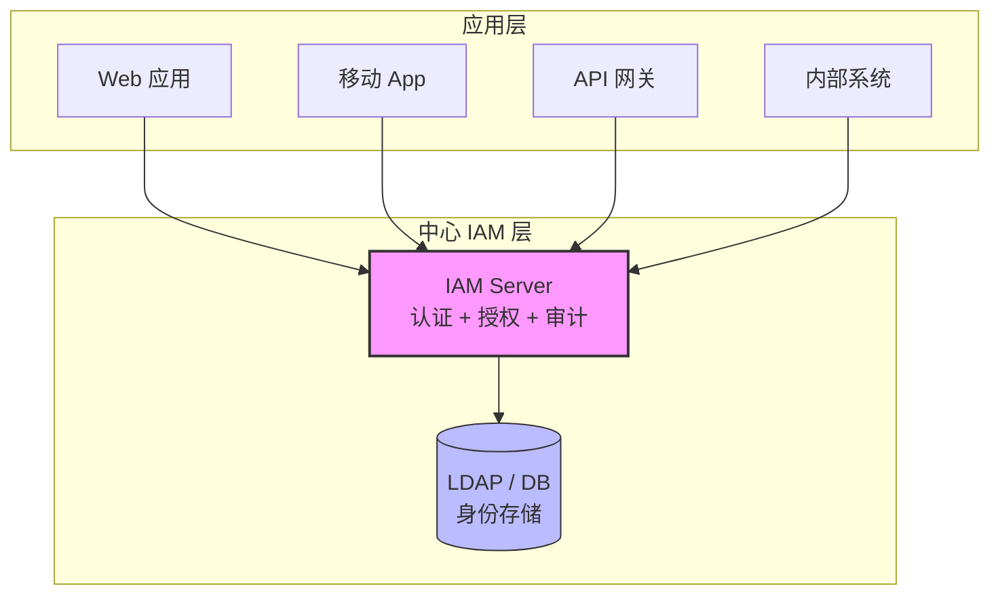
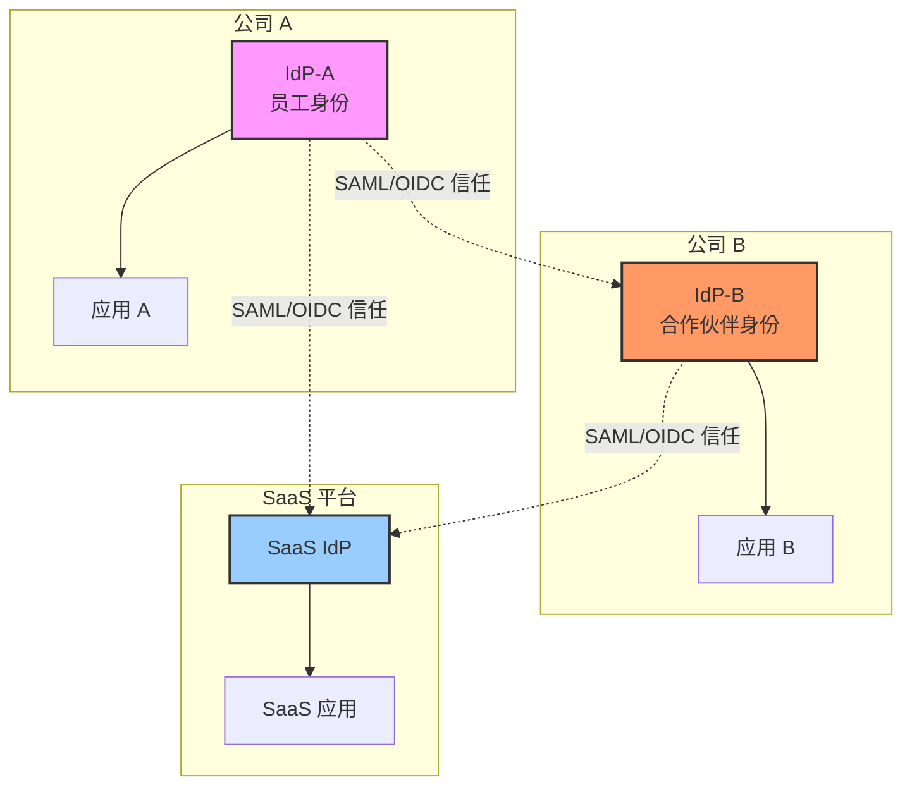
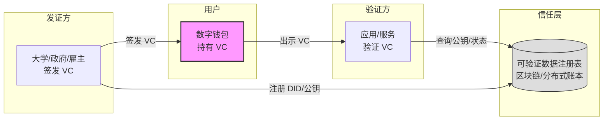
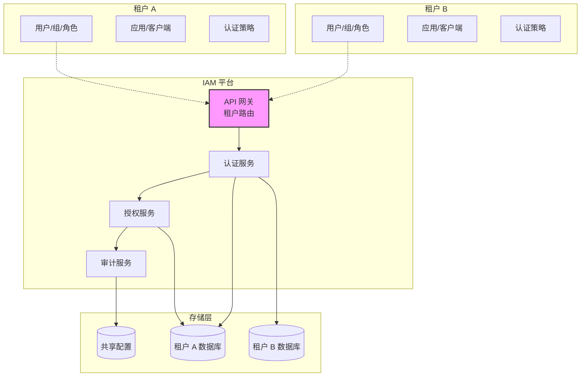
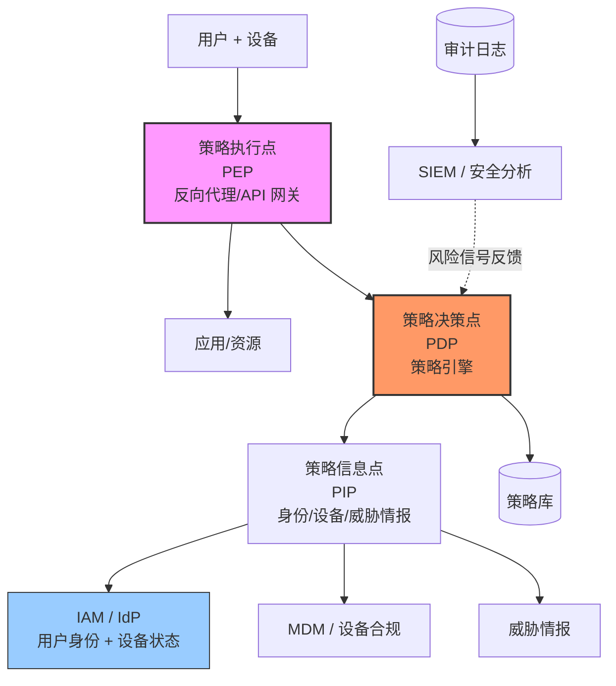
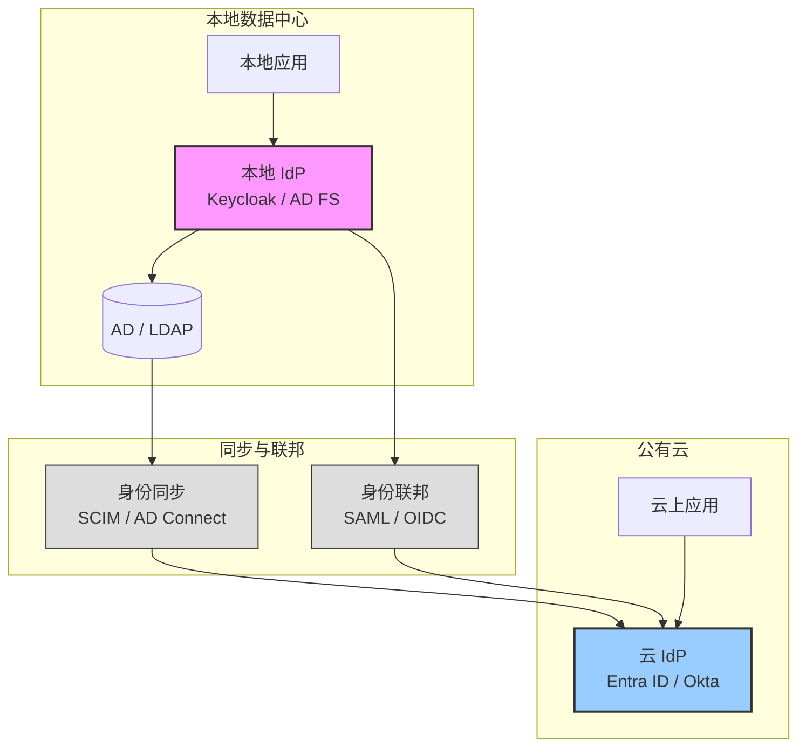
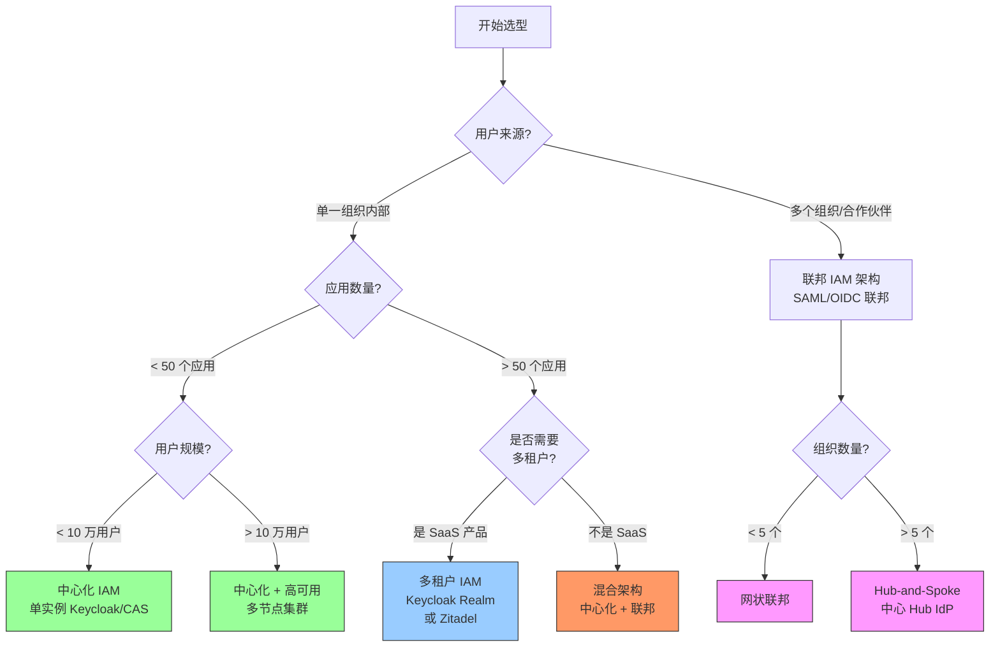

## IAM 架构的核心问题

设计一个 IAM 系统架构，本质上是在回答三个问题：

1. **身份数据放在哪？**——集中存储还是分布在各处？
2. **谁来做认证决策？**——单一权威源还是多点自治？
3. **如何应对规模和故障？**——垂直扩展、水平扩展还是多活？

这三个问题的答案，决定了 IAM 架构的形态。下面从经典到现代，逐一解析。

## 三种经典 IAM 架构模式

### 中心化 IAM 架构

所有身份数据和认证逻辑集中在一个中心节点，所有应用统一对接这个中心。

**优点**：
- 策略统一，一处管控所有访问
- 审计完整，所有认证事件集中在一条日志流
- 接入简单，应用只需对接一个端点

**缺点**：
- 单点故障——IAM 挂了，所有应用都无法登录
- 性能瓶颈——所有认证请求都打到同一个服务
- 组织边界受限——跨公司、跨域的身份联合需要额外机制

**适用场景**：单一组织、应用数量和用户规模较小、且已通过目标认证峰值压测的中小型企业。这里不提供通用的应用数或用户数硬阈值：登录峰值、数据库、缓存、网络和运维目标往往比总用户数更早成为约束。

### 联邦 IAM 架构

多个身份域通过信任关系互联，每个域维护自己的身份数据，跨域访问通过标准协议（SAML、OIDC）完成。

**优点**：
- 消除身份孤岛——用户用自己公司的账号登录合作方的应用
- 减少密码疲劳——不需要为每个外部系统单独注册
- 各域自治——每个组织控制自己的身份策略

**缺点**：
- 信任管理复杂——每增加一个联邦伙伴都要配置证书、metadata、属性映射
- 协议兼容性——SAML 和 OIDC 的互操作有坑（NameID 格式、属性声明方式不同）
- 故障影响面扩大——一个 IdP 出问题可能连锁影响多个下游

**常见拓扑**：

| 拓扑 | 描述 | 适用场景 |
|------|------|---------|
| Hub-and-Spoke | 所有 SP 对接中心 Hub IdP，Hub 再对接外部 IdP | 企业有多条业务线但希望统一管理 |
| 网状联邦 | 每对 IdP 之间独立建立信任 | 组织数量少（3-5 个），关系简单 |
| 链式联邦 | A 信任 B，B 信任 C，形成信任链 | 供应链场景，不推荐（故障传播链长） |

### 去中心化 IAM 架构（DID/VC）

用户自己持有身份凭证（Verifiable Credential），不依赖任何中心化的身份提供者。这是 IAM 的未来方向，依赖 W3C DID 标准和可验证凭证（VC）技术。

**优点**：
- 用户自主权——身份数据由用户控制，不是服务商控制
- 无单点故障——没有中心 IdP 可以宕掉
- 隐私保护——选择性披露（只出示"已满 18 岁"，不出示出生日期）

**缺点**：
- 基础设施不成熟——DID 方法、钱包互操作性仍在演进
- 合规挑战——GDPR"被遗忘权"与不可篡改的账本如何调和仍在讨论
- 用户体验——密钥管理和恢复对普通用户仍有门槛

**现阶段定位**：不适合作为企业 IAM 的主架构，但在特定场景（教育证书、供应链溯源、员工技能认证）已有落地案例。

## 现代 IAM 架构模式

### 多租户 SaaS IAM 架构

一个 IAM 实例服务多个租户（组织），每个租户的数据和配置完全隔离。

**三种隔离方案对比**：

| 方案 | 实现方式 | 隔离强度 | 成本 | 代表 |
|------|---------|---------|------|------|
| 独立实例 | 每个租户一套完整 IAM 部署 | ★★★★★ | 高 | Keycloak 多实例 |
| 共享实例 + 逻辑隔离 | 同一实例，通过 Realm/Organization 隔离 | ★★★★☆ | 中 | Keycloak Realm、Zitadel Organization |
| 共享实例 + 字段隔离 | 所有租户在同一张表，tenant_id 区分 | ★★★☆☆ | 低 | 自研方案 |

**选择建议**：
- 租户策略相同、隔离边界可由应用和 IAM 配置共同证明 → 共享实例 + 逻辑隔离；先用目标峰值压测决定是否需要水平扩展
- 租户需要独立策略，但仍希望共享运维面 → 独立 Realm；先验证 Realm 数量增长对启动、缓存、数据库和升级窗口的影响
- 每个租户要求独立合规、数据驻留或故障域 → 独立实例；用自动化交付、备份和回滚控制运维成本
- SaaS 产品卖的是 IAM 能力本身 → 建议 Zitadel（原生多租户）或自研

> **架构门槛不是人数阈值，而是可验证的边界。** 选型评审至少要回答四个问题：租户管理员能否访问其他租户的管理 API？令牌中的租户声明由谁签发、资源服务器如何校验？单租户登录尖峰是否会挤占其他租户的连接池和缓存？删除或恢复一个租户时，是否能只操作其身份数据而不影响全局？答不出来时，不要用“用户数少”替代证据；先补隔离测试、容量测试和恢复演练。

### 零信任 IAM 架构

零信任的核心原则是"永不信任，始终验证"。IAM 在零信任中承担持续认证和动态授权的角色。关于零信任的完整论述见[第24章]()，这里聚焦 IAM 架构如何在零信任中落地。

在这个架构中，IAM 系统承担的角色从"登录时验证一次"变为"为访问决策持续提供身份上下文"。但不要把 JWT 本地验签误写成持续验证：本地验签不会感知即时会话吊销；高风险操作才应按需调用 Token Introspection 或策略引擎。具体取舍见[零信任 IAM 中 JWT 与 Introspection 的边界]()。

### 混合云 IAM 架构

企业同时有本地数据中心和公有云上的应用，需要一个 IAM 架构同时覆盖两边。

**关键设计决策**：

| 决策点 | 选项 A | 选项 B |
|-------|--------|--------|
| 身份权威源 | 本地 AD 为主，同步到云 | 云 IdP 为主，本地为辅 |
| 认证锚点 | 本地 IdP，云 IdP 做代理 | 云 IdP，本地做直通认证 |
| 用户同步方向 | 本地 → 云（单向） | 双向同步 |
| 应用注册 | 各自注册 | 统一在云 IdP 注册 |

**推荐模式**：本地 AD 作为权威源 → SCIM/AD Connect 同步到云 IdP → 云 IdP 通过 OIDC/SAML 联邦回本地 IdP 做直通认证。这种"同步+直通"组合兼顾了云端应用的便利性和本地密码策略的控制力。

## 架构选型决策树

当你面对一个新的 IAM 项目，以下决策树可以帮你快速收敛到合适的架构：

这个决策树是简化的起点，实际选型还需要考虑：团队技能栈（Java 还是 Go？）、合规要求（等保、SOC2）、预算（开源自建还是商业 SaaS）、以及是否有特殊的认证流程需求。

## 高可用 IAM 架构设计要点

IAM 是高可用要求最高的基础设施之一——如果 IAM 挂了，所有应用都无法登录。高可用设计需要考虑三个层面：

### 1. 应用层高可用

- **多节点部署**：至少 2 个 IAM 节点，分布在不同的物理机或可用区；节点必须使用同一外部数据库，并保持版本一致。
- **负载均衡**：前面挂 LB（Nginx/HAProxy/云 LB），把流量转发到健康节点。不要把 `ip_hash` 当成高可用方案；它会降低故障切换和扩容效果。是否启用会话亲和性，应以所用 IAM 产品的缓存模型和压测结果为准。
- **健康检查**：监控 `/health/ready`，只把就绪节点加入后端；同时为数据库连接、缓存命中率和认证错误率设置告警。

### 2. 会话与令牌：先区分产品模型，再选组件

“把会话放 Redis”不是通用的 Keycloak 高可用答案。以 Keycloak 为例，集群会通过其分布式缓存处理认证会话和登录流程；应按当前版本的缓存配置、数据库连接池和跨节点通信要求部署，而不是自行再加一层 Redis。官方反向代理文档也要求正确设置代理模式和主机名，否则最常见的结果是回调地址错误或重定向循环。

令牌策略则是另一个决策：

| 决策 | 适合 | 代价与风险 |
|------|------|------------|
| JWT 本地验签 | 大多数 API 读请求，需要降低对 IAM 的实时依赖 | 已发出的令牌不会因用户刚被禁用而立即失效，必须用较短 TTL 配合轮换密钥 |
| Introspection / 策略引擎 | 高风险操作、即时吊销、需要实时设备或风险上下文 | 每次或按需依赖 IAM 网络可用性，需设置超时、缓存和降级策略 |
| IAM 会话 + 短期 Access Token | 浏览器登录、需要集中注销的场景 | 仍需正确处理 Cookie、代理 Header 和节点间缓存一致性 |

这也是为什么“JWT 无状态化”不能替代 IAM 的灾备设计：它只降低资源服务器对在线校验的依赖，不会让登录、刷新令牌和管理员操作在 IAM 故障时自动可用。具体的 JWT 与 Introspection 边界见[零信任 IAM 中 JWT 与 Introspection 的边界]()。

对内部 Web 应用采用网关认证时，还要把“入口认证”和“资源授权”拆开验证：例如 [Keycloak + oauth2-proxy 集成指南]() 中的 `/oauth2/auth` 只回答请求是否有有效会话，后端若消费 Access Token 仍需按资源服务器规则校验 `iss`、`aud` 和权限。否则 IAM 架构图看起来是闭环，实际授权边界却在反向代理的一个 Header 上。

### 3. 数据层高可用

- **数据库主从/集群**：使用受支持的 PostgreSQL/MySQL 高可用方案；先验证故障切换期间的连接重建和事务回滚，再宣称“多活”。
- **备份**：备份数据库、Realm/客户端配置、密钥材料和部署清单；只备份数据库而没有密钥，恢复后可能无法验证旧令牌或解密凭据。
- **恢复演练**：至少验证“数据库故障”“单节点故障”“整套 IAM 恢复”三条路径，并记录 RTO/RPO，而不是只检查备份文件是否生成。

> **Keycloak 部署提示**：反向代理、缓存/集群和数据库是三个独立故障域。先按[Keycloak 高可用集群与容灾恢复指南]()验证单节点故障，再引入跨可用区或跨集群方案。参考 Keycloak 的[反向代理配置文档](https://www.keycloak.org/server/reverseproxy)和[缓存配置文档](https://www.keycloak.org/server/caching)，不要把通用 IAM 经验直接套成 Keycloak 参数。

## 常见误区

**误区 1："IAM 架构设计就是选一个产品装上"**

实际上，IAM 架构是在回答"身份的权威源在哪、认证链路怎么走、故障怎么降级"。产品是实现架构的工具，不是架构本身。先想清楚架构，再选产品。

**误区 2："中心化 IAM 就是落后架构"**

在某些场景下，中心化 IAM 仍然是最合理的选择。小型组织用一个 Keycloak 实例就能满足所有需求，引入联邦或多租户反而增加不必要的复杂度。架构选型没有"先进/落后"，只有"合适/不合适"。

**误区 3："上了多活就万事大吉"**

多活（Active-Active）IAM 的难点不在部署，而在数据同步冲突。用户同时在两个数据中心修改密码、加入不同的组，冲突如何解决？大多数情况下，Active-Passive 加快速故障切换比 Active-Active 更务实。

**误区 4："微服务化 IAM 一定更好"**

将 IAM 拆成认证服务、授权服务、用户管理服务、审计服务听起来很合理，但带来了分布式事务、跨服务调用延迟、运维复杂度等问题。Ory 体系就是这种架构——灵活但运维成本高。除非团队有极强的微服务运维能力，否则单体 IAM（如 Keycloak）是更务实的选择。

## IAM 架构 FAQ

### Q1: IAM 架构设计中，认证和授权应该放在同一个服务还是分开？

**分开更好。** 认证（"你是谁"）和授权（"你能做什么"）是两个不同的关注点。实际架构中通常的做法是：
- 认证由 IdP（Keycloak/Dex/CAS）负责，返回 ID Token 或断言
- 授权策略由专门的策略引擎（OPA/Open Policy Agent）或在应用侧实现
- 认证服务和授权服务通过标准协议（OAuth 2.0 Token Introspection）解耦

分开的好处是：更换 IdP 时不影响授权逻辑，反之亦然。

### Q2: 多租户 IAM 用独立 Realm 还是共享 Realm + 属性过滤？

| 维度 | 独立 Realm | 共享 Realm |
|------|-----------|-----------|
| 隔离强度 | 强（数据、配置、会话完全隔离） | 弱（依赖字段过滤） |
| 运维成本 | 高（N 个 Realm = N 个配置管理） | 低（一处配置） |
| 性能 | 好（每个 Realm 独立缓存） | 有瓶颈（共享缓存和数据库表） |
| 适用 | 租户数 < 20，每个租户安全要求高 | 租户数 > 50，每个租户用户量小 |

**推荐**：先评估租户数量和安全隔离要求。如果每个租户有不同的合规要求（等保、SOC2），独立 Realm 是必须的；如果是轻量 SaaS 场景，共享 Realm 加逻辑隔离更经济。

### Q3: 从传统 AD/LDAP 架构迁移到现代 IAM 架构，最关键的三步是什么？

1. **先同步再切换**：用 SCIM 或同步工具把 AD 用户同步到新 IAM，保持双写一段时间
2. **按应用分批迁移**：不是一次性切所有应用，而是按"影响面小→大"的顺序，每切一个应用验证一个
3. **保留回退路径**：在新 IAM 中配置 AD 作为 User Federation 源（Keycloak 支持），切换失败时能快速退回 AD 直连认证

### Q4: IAM 架构中的"会话管理"多重要？

至关重要，但经常被忽视。会话管理决定了：
- 用户的登录体验（是否频繁要求重新登录）
- 安全事件响应速度（能否立即踢掉被入侵的会话）
- 高可用的难度（会话存在内存里还是 Redis 里）

一个合理的会话策略：短期访问令牌（Access Token 5-15 分钟）+ 长期刷新令牌（Refresh Token 8-24 小时）+ 服务端会话吊销能力（Token Introspection 或黑名单）。

## 小结

IAM 架构设计不是一次性决策。组织在成长，应用在增加，安全要求在变化——IAM 架构需要跟着演进。从中心化到联邦，从单体到多租户，每一步都是对"身份数据归谁管、认证决策谁来做、故障来了怎么办"这三个问题的重新回答。多租户场景下的隔离模式详解，参见 [多租户 IAM 架构设计与方案对比]()。

选架构时记住：简单够用 > 超前设计。一个维护良好的单实例 Keycloak，比一个没人能调通的微服务 IAM 栈有价值得多。

> **架构选好了，协议怎么选？** 协议和架构是 IAM 的两个决策维度——协议决定"用什么语言"传递身份信息，架构决定"用什么结构"组织身份系统。继续阅读 [IAM 协议选型指南]()，用决策树确定 OAuth 2.0、OIDC、SAML、LDAP、SCIM 在你架构中的角色。
>
> **架构和协议都定了，用哪个开源 IAM？** 参见 [开源 IAM 对比与选型指南]()——Keycloak、Casdoor、Zitadel、Authentik、Ory、Dex、CAS 的功能矩阵与场景推荐。
