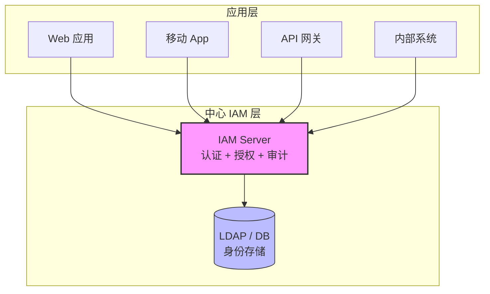
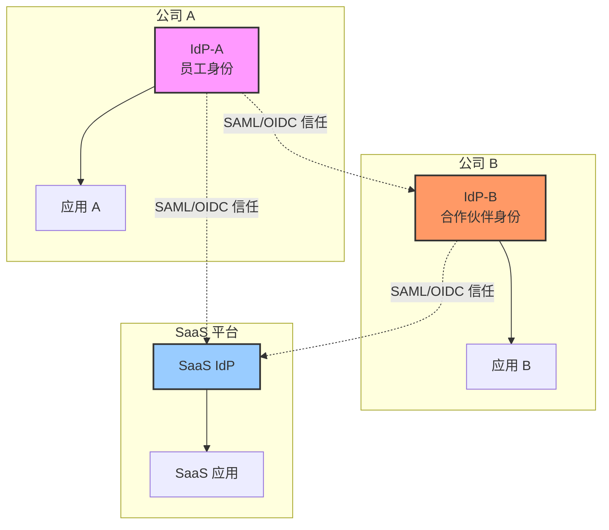
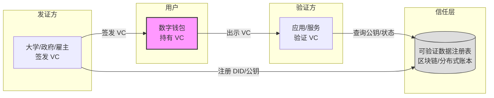
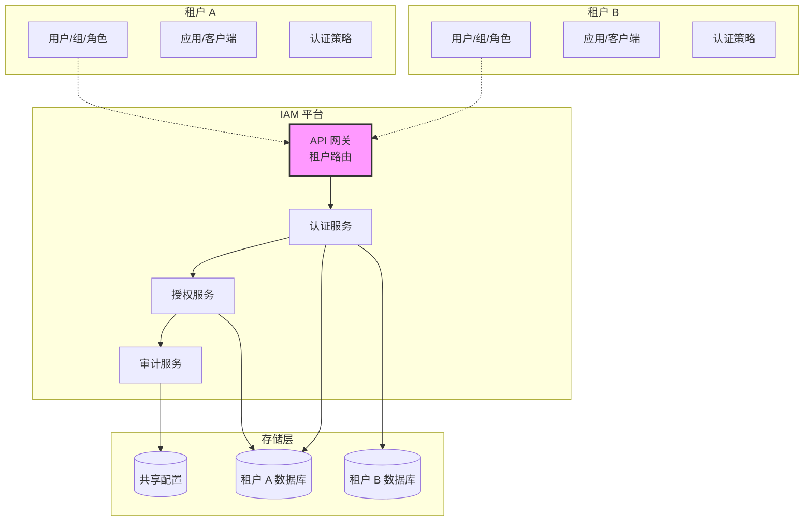
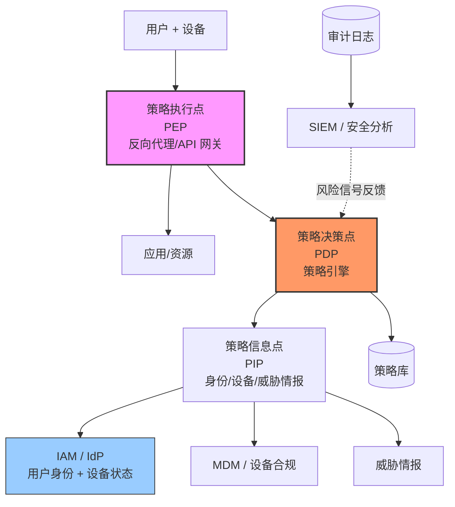
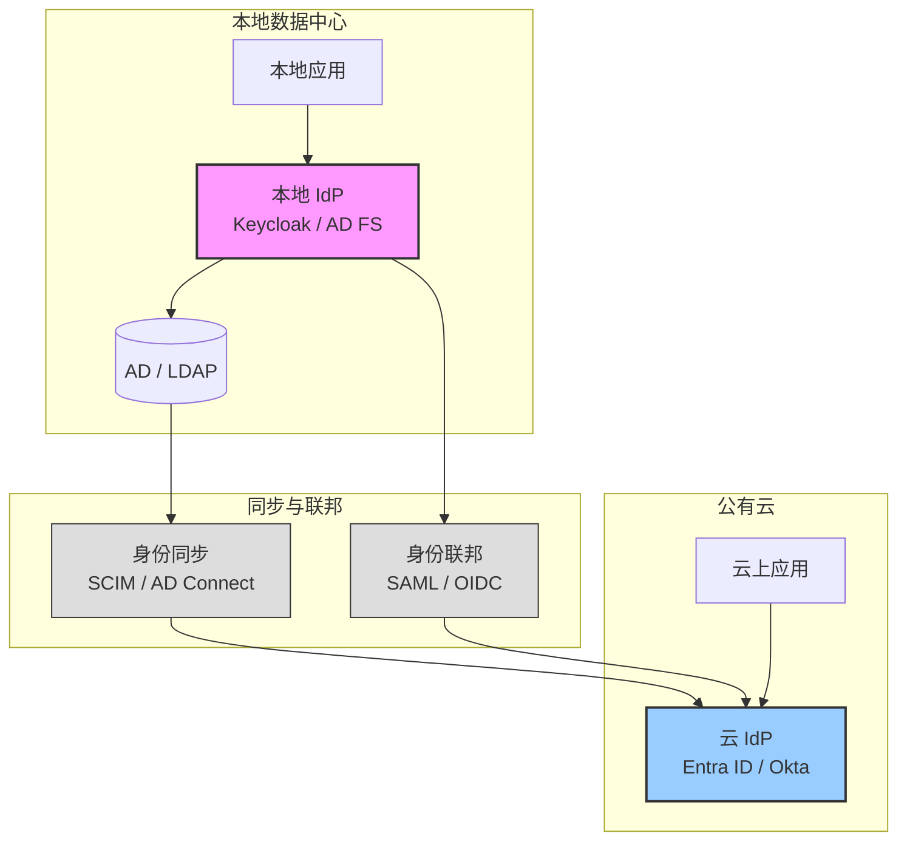
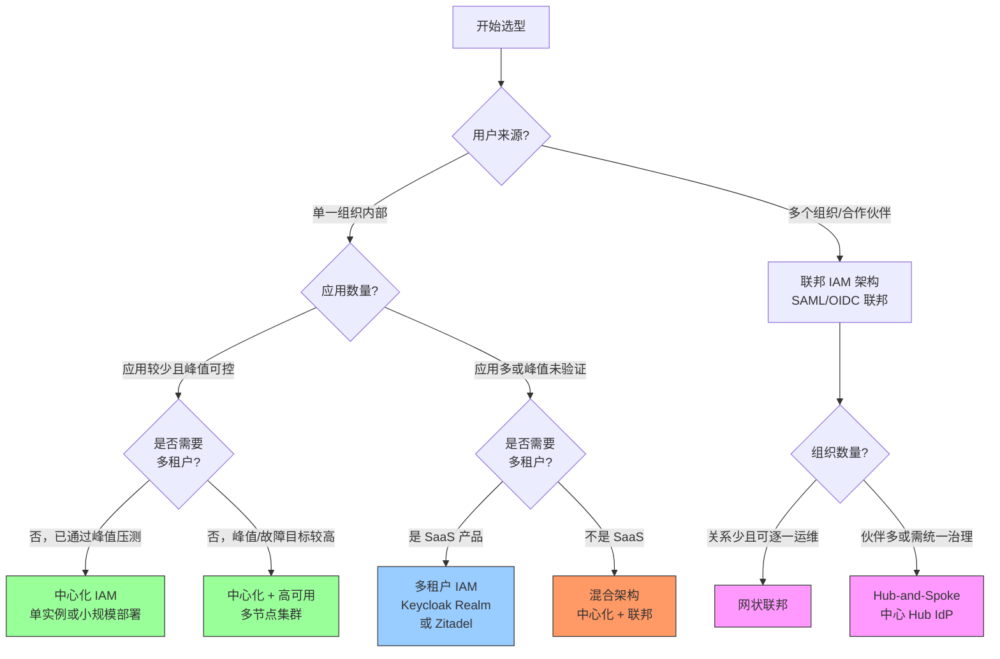

## IAM 架构的核心问题

设计一个 IAM 系统架构，本质上是在回答三个问题：

1. **身份数据放在哪？**——集中存储还是分布在各处？
2. **谁来做认证决策？**——单一权威源还是多点自治？
3. **如何应对规模和故障？**——垂直扩展、水平扩展还是多活？

这三个问题的答案，决定了 IAM 架构的形态。下面从经典到现代，逐一解析。

## 三种经典 IAM 架构模式

### 中心化 IAM 架构

所有身份数据和认证逻辑集中在一个中心节点，所有应用统一对接这个中心。


```mermaid
graph TB
    subgraph "应用层"
        A1[Web 应用]
        A2[移动 App]
        A3[API 网关]
        A4[内部系统]
    end

    subgraph "中心 IAM 层"
        IAM[IAM Server<br/>认证 + 授权 + 审计]
        LDAP[(LDAP / DB<br/>身份存储)]
    end

    A1 --> IAM
    A2 --> IAM
    A3 --> IAM
    A4 --> IAM
    IAM --> LDAP

    style IAM fill:#f9f,stroke:#333,stroke-width:2px
    style LDAP fill:#bbf,stroke:#333
```

**优点**：
- 策略统一，一处管控所有访问
- 审计完整，所有认证事件集中在一条日志流
- 接入简单，应用只需对接一个端点

**缺点**：
- 单点故障——IAM 挂了，所有应用都无法登录
- 性能瓶颈——所有认证请求都打到同一个服务
- 组织边界受限——跨公司、跨域的身份联合需要额外机制

**适用场景**：单一组织、身份权威源较少、应用可以统一接入的企业。应用数和用户数本身不能推出“应该单实例”或“必须集群”；认证峰值、故障预算、合规隔离和运维能力才是可验证的约束。

### 联邦 IAM 架构

多个身份域通过信任关系互联，每个域维护自己的身份数据，跨域访问通过标准协议（SAML、OIDC）完成。


```mermaid
graph TB
    subgraph "公司 A"
        IdPA[IdP-A<br/>员工身份]
        AppA[应用 A]
        IdPA --> AppA
    end

    subgraph "公司 B"
        IdPB[IdP-B<br/>合作伙伴身份]
        AppB[应用 B]
        IdPB --> AppB
    end

    subgraph "SaaS 平台"
        SaaS[SaaS IdP]
        SaaSApp[SaaS 应用]
        SaaS --> SaaSApp
    end

    IdPA -.->|SAML/OIDC 信任| IdPB
    IdPA -.->|SAML/OIDC 信任| SaaS
    IdPB -.->|SAML/OIDC 信任| SaaS

    style IdPA fill:#f9f,stroke:#333,stroke-width:2px
    style IdPB fill:#f96,stroke:#333,stroke-width:2px
    style SaaS fill:#9cf,stroke:#333,stroke-width:2px
```

**优点**：
- 消除身份孤岛——用户用自己公司的账号登录合作方的应用
- 减少密码疲劳——不需要为每个外部系统单独注册
- 各域自治——每个组织控制自己的身份策略

**缺点**：
- 信任管理复杂——每增加一个联邦伙伴都要配置证书、metadata、属性映射
- 协议兼容性——SAML 和 OIDC 的互操作有坑（NameID 格式、属性声明方式不同）
- 故障影响面扩大——一个 IdP 出问题可能连锁影响多个下游

**常见拓扑**：

| 拓扑 | 描述 | 适用场景 |
|------|------|---------|
| Hub-and-Spoke | 所有 SP 对接中心 Hub IdP，Hub 再对接外部 IdP | 企业有多条业务线但希望统一管理 |
| 网状联邦 | 每对 IdP 之间独立建立信任 | 组织数量少（3-5 个），关系简单 |
| 链式联邦 | A 信任 B，B 信任 C，形成信任链 | 供应链场景，不推荐（故障传播链长） |

### 去中心化 IAM 架构（DID/VC）

用户把可验证凭证（Verifiable Credential，VC）保存于自己的钱包，在出示时由验证方校验签名、Issuer 信任关系和凭证状态。它可以减少对中心化 IdP 在线登录的依赖，但不等于“没有中心化组件”：签发方、DID 解析服务、状态服务和企业信任治理仍可能是中心化的。DID/VC 是一组身份数据与验证模型，不是可以直接替换企业 IAM 的部署产品。


```mermaid
graph LR
    subgraph "用户"
        Wallet[数字钱包<br/>持有 VC]
    end

    subgraph "发证方"
        Issuer[大学/政府/雇主<br/>签发 VC]
    end

    subgraph "验证方"
        Verifier[应用/服务<br/>验证 VC]
    end

    subgraph "信任层"
        Registry[(可验证数据注册表<br/>区块链/分布式账本)]
    end

    Issuer -->|签发 VC| Wallet
    Wallet -->|出示 VC| Verifier
    Verifier -->|查询公钥/状态| Registry
    Issuer -->|注册 DID/公钥| Registry

    style Wallet fill:#f9f,stroke:#333,stroke-width:2px
    style Registry fill:#ddd,stroke:#333
```

**优点**：
- 用户自主权——身份数据由用户控制，不是服务商控制
- 降低对单一 IdP 在线登录的依赖——但钱包、状态服务、信任注册表或验证方仍可能成为新的故障点
- 隐私保护——选择性披露（只出示"已满 18 岁"，不出示出生日期）

**缺点**：
- 基础设施不成熟——DID 方法、钱包互操作性仍在演进
- 合规挑战——GDPR"被遗忘权"与不可篡改的账本如何调和仍在讨论
- 用户体验——密钥管理和恢复对普通用户仍有门槛

**现阶段定位**：不要把 DID/VC 图直接当成企业 IAM 的替换架构。它更适合身份提供方不应共享完整用户档案、但验证方需要检查某项资质的场景，例如：

- 教育机构签发证书，招聘系统只验证证书和有效状态；
- 供应链成员出示组织资质，平台不必复制整套员工目录；
- 员工出示培训或技能凭证，外部服务只接收完成状态而不是内部人事属性。

图中的“信任层”不是万能的可用性保证：验证方仍要决定信任哪些 Issuer、如何获取公钥、如何检查凭证状态，以及注册表不可用时是否拒绝。DID Core 只定义 DID 的解析和验证数据模型，VC Data Model 也不替应用决定业务授权；这些边界应写进故障和撤销演练。两份规范分别是 W3C Recommendation（DID Core，2022-07-19）和 W3C Recommendation（VC Data Model 2.0，2025-05-15），但规范状态不等于钱包、撤销服务或企业治理已经互操作。参见 [W3C DID Core](https://www.w3.org/TR/did-core/) 与 [W3C Verifiable Credentials Data Model 2.0](https://www.w3.org/TR/vc-data-model-2.0/)。

## 现代 IAM 架构模式

### 多租户 SaaS IAM 架构

一个 IAM 实例服务多个租户（组织），每个租户的数据和配置完全隔离。


```mermaid
graph TB
    subgraph "租户 A"
        UsersA[用户/组/角色]
        AppsA[应用/客户端]
        PoliciesA[认证策略]
    end

    subgraph "租户 B"
        UsersB[用户/组/角色]
        AppsB[应用/客户端]
        PoliciesB[认证策略]
    end

    subgraph "IAM 平台"
        Gateway[API 网关<br/>租户路由]
        AuthN[认证服务]
        AuthZ[授权服务]
        Audit[审计服务]
    end

    subgraph "存储层"
        DB_A[(租户 A 数据库)]
        DB_B[(租户 B 数据库)]
        Shared[(共享配置)]
    end

    UsersA -.-> Gateway
    UsersB -.-> Gateway
    Gateway --> AuthN --> AuthZ --> Audit
    AuthN --> DB_A
    AuthN --> DB_B
    AuthZ --> DB_A
    Audit --> Shared

    style Gateway fill:#f9f,stroke:#333,stroke-width:2px
```

**三种隔离方案对比**：

| 方案 | 实现方式 | 隔离强度 | 成本 | 代表 |
|------|---------|---------|------|------|
| 独立实例 | 每个租户一套完整 IAM 部署 | ★★★★★ | 高 | Keycloak 多实例 |
| 共享实例 + 逻辑隔离 | 同一实例，通过 Realm/Organization 隔离 | ★★★★☆ | 中 | Keycloak Realm、Zitadel Organization |
| 共享实例 + 字段隔离 | 所有租户在同一张表，tenant_id 区分 | ★★★☆☆ | 低 | 自研方案 |

> **先校正一个容易误读的词：Realm 不是“自动完成 SaaS 租户隔离”。** 在 Keycloak 中，Realm 负责隔离用户、客户端、角色、组和认证配置；但应用自己的业务数据、租户路由、资源授权和运维人员的权限边界，仍需要由业务系统和部署层验证。把一个 Realm 当成租户边界，不能替代资源服务器的 `iss`/`aud`/租户声明校验。

**选择建议**：
- 先把租户隔离要求写成可验收的边界：配置、用户、会话、密钥、审计和管理员权限分别是否隔离。
- 需要独立密钥、独立备份恢复或独立故障域时，优先评估独立实例；不要只用“字段过滤”替代安全边界。
- 共享实例能否承载流量，应由认证峰值、数据库连接池、缓存容量和故障演练结果决定，而不是用租户数阈值拍板。
- SaaS 产品卖的是 IAM 能力本身时，再比较原生多租户产品与自研；先验证租户删除、密钥轮换和跨租户授权测试。

> **架构门槛不是人数阈值，而是可验证的边界。** 选型评审至少要回答四个问题：租户管理员能否访问其他租户的管理 API？令牌中的租户声明由谁签发、资源服务器如何校验？单租户登录尖峰是否会挤占其他租户的连接池和缓存？删除或恢复一个租户时，是否能只操作其身份数据而不影响全局？答不出来时，不要用“用户数少”替代证据；先补隔离测试、容量测试和恢复演练。

### 零信任 IAM 架构

零信任的核心原则是"永不信任，始终验证"。IAM 在零信任中承担持续认证和动态授权的角色。关于零信任的完整论述见[第24章]()，这里聚焦 IAM 架构如何在零信任中落地。


```mermaid
graph TB
    User[用户 + 设备] --> PEP[策略执行点<br/>PEP<br/>反向代理/API 网关]
    PEP --> App[应用/资源]

    PEP --> PDP[策略决策点<br/>PDP<br/>策略引擎]
    PDP --> PIP[策略信息点<br/>PIP<br/>身份/设备/威胁情报]
    PDP --> Policy[(策略库)]

    PIP --> IDP[IAM / IdP<br/>用户身份 + 设备状态]
    PIP --> MDM[MDM / 设备合规]
    PIP --> TI[威胁情报]

    Audit[(审计日志)] --> SIEM[SIEM / 安全分析]
    SIEM -.->|风险信号反馈| PDP

    style PEP fill:#f9f,stroke:#333,stroke-width:2px
    style PDP fill:#f96,stroke:#333,stroke-width:2px
    style IDP fill:#9cf,stroke:#333
```

在这个架构中，IAM 系统承担的角色从"登录时验证一次"变为"为访问决策持续提供身份上下文"。但不要把 JWT 本地验签误写成持续验证：本地验签不会感知即时会话吊销；高风险操作才应按需调用 Token Introspection 或策略引擎。具体取舍见[零信任 IAM 中 JWT 与 Introspection 的边界]()。

### 混合云 IAM 架构

企业同时有本地数据中心和公有云上的应用，需要一个 IAM 架构同时覆盖两边。


```mermaid
graph TB
    subgraph "本地数据中心"
        OnPremApp[本地应用]
        OnPremIdP[本地 IdP<br/>Keycloak / AD FS]
        LDAP[(AD / LDAP)]
        OnPremIdP --> LDAP
        OnPremApp --> OnPremIdP
    end

    subgraph "公有云"
        CloudApp[云上应用]
        CloudIdP[云 IdP<br/>Entra ID / Okta]
    end

    subgraph "同步与联邦"
        Sync[身份同步<br/>SCIM / AD Connect]
        Fed[身份联邦<br/>SAML / OIDC]
    end

    LDAP --> Sync --> CloudIdP
    OnPremIdP --> Fed --> CloudIdP
    CloudApp --> CloudIdP

    style OnPremIdP fill:#f9f,stroke:#333,stroke-width:2px
    style CloudIdP fill:#9cf,stroke:#333,stroke-width:2px
    style Sync fill:#ddd,stroke:#333
    style Fed fill:#ddd,stroke:#333
```

**关键设计决策**：

| 决策点 | 选项 A | 选项 B |
|-------|--------|--------|
| 身份权威源 | 本地 AD 为主，同步到云 | 云 IdP 为主，本地为辅 |
| 认证锚点 | 本地 IdP，云 IdP 做代理 | 云 IdP，本地做直通认证 |
| 用户同步方向 | 本地 → 云（单向） | 双向同步 |
| 应用注册 | 各自注册 | 统一在云 IdP 注册 |

**推荐模式**：本地 AD 作为权威源 → SCIM/AD Connect 同步到云 IdP → 云 IdP 通过 OIDC/SAML 联邦回本地 IdP 做直通认证。这种"同步+直通"组合兼顾了云端应用的便利性和本地密码策略的控制力。

## 架构选型决策树

当你面对一个新的 IAM 项目，以下决策树可以帮你快速收敛到合适的架构：


```mermaid
graph TD
    Start[开始选型] --> Q1{用户来源?}

    Q1 -->|单一组织内部| Q2{应用数量?}
    Q1 -->|多个组织/合作伙伴| Fed[联邦 IAM 架构<br/>SAML/OIDC 联邦]

    Q2 -->|应用较少且峰值可控| Q3{是否需要<br/>多租户?}
    Q2 -->|应用多或峰值未验证| Q4{是否需要<br/>多租户?}

    Q3 -->|否，已通过峰值压测| Central[中心化 IAM<br/>单实例或小规模部署]
    Q3 -->|否，峰值/故障目标较高| HA[中心化 + 高可用<br/>多节点集群]

    Q4 -->|是 SaaS 产品| MT[多租户 IAM<br/>Keycloak Realm<br/>或 Zitadel]
    Q4 -->|不是 SaaS| Hybrid[混合架构<br/>中心化 + 联邦]

    Fed --> FQ{组织数量?}
    FQ -->|关系少且可逐一运维| Mesh[网状联邦]
    FQ -->|伙伴多或需统一治理| Hub[Hub-and-Spoke<br/>中心 Hub IdP]

    style Central fill:#9f9,stroke:#333
    style HA fill:#9f9,stroke:#333
    style MT fill:#9cf,stroke:#333
    style Hybrid fill:#f96,stroke:#333
    style Mesh fill:#f9f,stroke:#333
    style Hub fill:#f9f,stroke:#333
```

这个决策树是简化的起点，不把应用数或用户数写成通用分界线。实际选型还需要用目标认证峰值、数据库与缓存容量、故障切换目标、租户隔离测试结果来校正；同时考虑团队技能栈（Java 还是 Go？）、合规要求（等保、SOC2）、预算（开源自建还是商业 SaaS）以及特殊认证流程。

## 高可用 IAM 架构设计要点

IAM 是高可用要求最高的基础设施之一——如果 IAM 挂了，所有应用都无法登录。高可用设计需要考虑三个层面：

### 1. 应用层高可用

- **多节点部署**：只有在可用性目标和故障预算要求时才增加节点；节点应分布在独立故障域，使用受支持的共享数据库，并保持版本一致。节点数量不能替代故障切换演练。
- **负载均衡**：前面挂 LB（Nginx/HAProxy/云 LB），只把就绪节点加入后端。不要把 `ip_hash` 当成高可用方案；它会降低故障切换和扩容效果。是否启用会话亲和性，应以所用 IAM 产品的缓存模型和压测结果为准。对 Keycloak 而言，官方反向代理文档把基于 Cookie 的 session affinity 列为代理能力之一，但这不是“有亲和性就不需要集群”的替代品；启用前仍应验证节点故障、登录流程迁移和扩容后的缓存行为。
- **健康检查**：监控 `/health/ready`，只把就绪节点加入后端；同时为数据库连接、缓存命中率和认证错误率设置告警。

### 2. 会话与令牌：先区分产品模型，再选组件

“把会话放 Redis”不是通用的 Keycloak 高可用答案。以当前 Keycloak Server Guide 为准，生产集群使用分布式 Infinispan 缓存；`start-dev` 使用本地缓存只适合开发和测试，不能拿来证明多节点登录流程可用。应按当前版本的缓存配置、数据库连接池和跨节点通信要求部署，而不是自行再加一层 Redis。

一个最小的生产验证片段如下，重点不是复制参数，而是确认启动模式和代理信任边界：

```bash
# 生产启动：显式启用分布式缓存；不要用 start-dev 验证集群
bin/kc.sh start --cache=ispn \
  --proxy-headers=xforwarded \
  --proxy-trusted-addresses=10.0.10.0/24

# 反向代理必须覆盖写入 X-Forwarded-*，并且只允许上述代理网段直达 Keycloak。
# 若采用 TLS passthrough，不要同时启用 --proxy-headers；改用受支持的 PROXY protocol 路径。
```

验证时至少做三次：节点 A 登录后让回调落到节点 B；停止节点 A 后刷新已有会话；再检查节点 B 的就绪状态和数据库连接是否恢复。每次都记录 HTTP 状态、`iss`/`redirect_uri` 和节点日志。只看到两个 Pod 为 `Ready`，不能证明缓存、代理头和故障切换都正确。

令牌策略则是另一个决策：

| 决策 | 适合 | 代价与风险 |
|------|------|------------|
| JWT 本地验签 | 大多数 API 读请求，需要降低对 IAM 的实时依赖 | 已发出的令牌不会因用户刚被禁用而立即失效，必须用较短 TTL 配合轮换密钥 |
| Introspection / 策略引擎 | 高风险操作、即时吊销、需要实时设备或风险上下文 | 每次或按需依赖 IAM 网络可用性，需设置超时、缓存和降级策略 |
| IAM 会话 + 短期 Access Token | 浏览器登录、需要集中注销的场景 | 仍需正确处理 Cookie、代理 Header 和节点间缓存一致性 |

这也是为什么“JWT 无状态化”不能替代 IAM 的灾备设计：它只降低资源服务器对在线校验的依赖，不会让登录、刷新令牌和管理员操作在 IAM 故障时自动可用。具体的 JWT 与 Introspection 边界见[零信任 IAM 中 JWT 与 Introspection 的边界]()。

对内部 Web 应用采用网关认证时，还要把“入口认证”和“资源授权”拆开验证：例如 [Keycloak + oauth2-proxy 集成指南]() 中的 `/oauth2/auth` 只回答请求是否有有效会话，后端若消费 Access Token 仍需按资源服务器规则校验 `iss`、`aud` 和权限。否则 IAM 架构图看起来是闭环，实际授权边界却在反向代理的一个 Header 上。

### 3. 数据层高可用

- **数据库主从/集群**：使用受支持的 PostgreSQL/MySQL 高可用方案；先验证故障切换期间的连接重建和事务回滚，再宣称“多活”。
- **备份**：备份数据库、Realm/客户端配置、密钥材料和部署清单；只备份数据库而没有密钥，恢复后可能无法验证旧令牌或解密凭据。
- **恢复演练**：至少验证“数据库故障”“单节点故障”“整套 IAM 恢复”三条路径，并记录 RTO/RPO，而不是只检查备份文件是否生成。

> **Keycloak 部署提示**：反向代理、缓存/集群和数据库是三个独立故障域。先按[Keycloak 高可用集群与容灾恢复指南]()验证单节点故障，再引入跨可用区或跨集群方案。参考 Keycloak 的[反向代理配置文档](https://www.keycloak.org/server/reverseproxy)和[分布式缓存文档](https://www.keycloak.org/server/caching)，不要把通用 IAM 经验直接套成 Keycloak 参数。

## 常见误区

**误区 1："IAM 架构设计就是选一个产品装上"**

实际上，IAM 架构是在回答"身份的权威源在哪、认证链路怎么走、故障怎么降级"。产品是实现架构的工具，不是架构本身。先想清楚架构，再选产品。

**误区 2："中心化 IAM 就是落后架构"**

在某些场景下，中心化 IAM 仍然是最合理的选择。小型组织用一个 Keycloak 实例就能满足所有需求，引入联邦或多租户反而增加不必要的复杂度。架构选型没有"先进/落后"，只有"合适/不合适"。

**误区 3："上了多活就万事大吉"**

多活（Active-Active）IAM 的难点不在部署，而在数据同步冲突。用户同时在两个数据中心修改密码、加入不同的组，冲突如何解决？大多数情况下，Active-Passive 加快速故障切换比 Active-Active 更务实。

**误区 4："微服务化 IAM 一定更好"**

将 IAM 拆成认证服务、授权服务、用户管理服务、审计服务听起来很合理，但带来了分布式事务、跨服务调用延迟、运维复杂度等问题。Ory 体系就是这种架构——灵活但运维成本高。除非团队有极强的微服务运维能力，否则单体 IAM（如 Keycloak）是更务实的选择。

## IAM 架构 FAQ

### Q0: Keycloak Realm 能否直接当作 SaaS 租户边界？

不能直接这样推断。Realm 可以隔离 Keycloak 内的用户、客户端、角色、组和认证配置，但业务数据库的 `tenant_id`、租户路由、资源授权、审计归属和管理员 API 访问仍由应用与部署层负责。至少用不同租户的 Token 做四组验证：访问业务数据、调用管理 API、读取审计记录、执行租户删除或恢复；同时确认资源服务校验 `iss`、`aud` 和租户声明。若需要独立密钥、备份或故障域，应评估独立 Realm 之外的独立实例。

### Q1: IAM 架构设计中，认证和授权应该放在同一个服务还是分开？

不要把“分开”当成默认答案。认证（"你是谁"）和授权（"你能做什么"）是两个不同的决策，但部署边界应由授权复杂度、实时吊销要求和故障预算决定：

- 认证通常由 IdP（Keycloak/Dex/CAS）负责，向客户端提供 ID Token、Access Token 或协议断言。
- 简单的应用角色判断可以在资源服务器本地完成；涉及资源关系、设备状态或动态策略时，再引入 OPA 等策略引擎。
- Token Introspection 只能帮助资源服务器获得令牌的在线状态和元数据，不能自动替代业务授权决策，也不会因为“调用了 introspection”就获得租户或资源权限。

**分离的收益**是更换 IdP 时不必重写复杂授权策略；**分离的代价**是多一次网络依赖、超时和降级设计。对于低延迟读请求，通常采用本地验签 + 短 TTL；对于高风险操作，再按需在线校验或调用策略引擎。这个边界与 [零信任 IAM 中 JWT 与 Introspection 的边界]() 一致。

### Q2: 多租户 IAM 用独立 Realm 还是共享 Realm + 属性过滤？

| 维度 | 独立 Realm | 共享 Realm |
|------|-----------|-----------|
| 隔离强度 | 强（数据、配置、会话完全隔离） | 弱（依赖字段过滤） |
| 运维成本 | 高（N 个 Realm = N 个配置管理） | 低（一处配置） |
| 性能 | 好（每个 Realm 独立缓存） | 有瓶颈（共享缓存和数据库表） |
| 适用 | 需要独立策略、密钥或故障域；Realm 数量增长已通过运维验证 | 租户策略相近，且跨租户隔离已通过管理 API、令牌和资源访问测试 |

**推荐**：先评估租户数量、认证峰值和安全隔离要求。如果每个租户有不同的合规要求（等保、SOC2），独立 Realm 甚至独立实例可能更容易证明边界；如果是轻量 SaaS 场景，共享 Realm 加逻辑隔离可能更经济，但必须由资源服务器和管理 API 的隔离测试证明，而不是由租户数量推断。

### Q3: 从传统 AD/LDAP 架构迁移到现代 IAM 架构，最关键的三步是什么？

1. **先接入再切换**：用受支持的目录同步或用户联邦方式把 AD 用户接入新 IAM。不要默认对 AD 和新 IAM 双写；先确定唯一身份权威源、冲突处理规则和离职回收路径，再用测试租户验证同步延迟与失败重试
2. **按应用分批迁移**：不是一次性切所有应用，而是按"影响面小→大"的顺序，每切一个应用验证一个
3. **保留回退路径**：在新 IAM 中配置 AD 作为 User Federation 源（Keycloak 支持），切换失败时能快速退回 AD 直连认证

### Q4: IAM 架构中的"会话管理"多重要？

至关重要，但经常被忽视。会话管理决定了：
- 用户的登录体验（是否频繁要求重新登录）
- 安全事件响应速度（能否立即踢掉被入侵的会话）
- 高可用的难度（会话存在内存里还是 Redis 里）

会话策略不应套用固定时长模板，而应从威胁模型和故障目标倒推：Access Token 需要设置为能接受的暴露窗口，Refresh Token 需要绑定轮换、重放检测和撤销策略；高风险操作再按需使用 Token Introspection 或策略引擎。评审时至少验证：令牌泄露后的最大可用窗口、刷新令牌重放如何处理、用户禁用后新旧令牌分别何时失效，以及 IAM 不可用时资源服务是否允许受限访问。OAuth 安全最佳实践见 [RFC 9700](https://www.rfc-editor.org/rfc/rfc9700)。

## 小结

IAM 架构设计不是一次性决策。组织在成长，应用在增加，安全要求在变化——IAM 架构需要跟着演进。从中心化到联邦，从单体到多租户，每一步都是对"身份数据归谁管、认证决策谁来做、故障来了怎么办"这三个问题的重新回答。多租户场景下的隔离模式详解，参见 [多租户 IAM 架构设计与方案对比]()。

选架构时记住：简单够用 > 超前设计。一个维护良好的单实例 Keycloak，比一个没人能调通的微服务 IAM 栈有价值得多。

> **架构选好了，协议怎么选？** 协议和架构是 IAM 的两个决策维度——协议决定"用什么语言"传递身份信息，架构决定"用什么结构"组织身份系统。继续阅读 [IAM 协议选型指南]()，用决策树确定 OAuth 2.0、OIDC、SAML、LDAP、SCIM 在你架构中的角色。
>
> **架构和协议都定了，用哪个开源 IAM？** 参见 [开源 IAM 对比与选型指南]()——Keycloak、Casdoor、Zitadel、Authentik、Ory、Dex、CAS 的功能矩阵与场景推荐。
