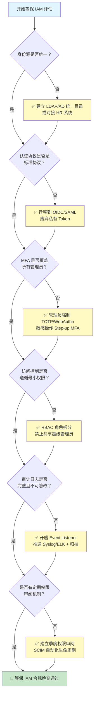

## 为什么 IAM 是等保 2.0 的核心控制域

等保 2.0（GB/T 22239-2019《信息安全技术 网络安全等级保护基本要求》）将安全要求分为技术和管理两大类。在技术层面，**身份与访问管理（IAM）跨越了"安全计算环境"和"安全区域边界"两个控制域**，直接影响以下测评项：

- **身份鉴别（Identification and Authentication）**：你是谁
- **访问控制（Access Control）**：你能做什么
- **安全审计（Security Audit）**：你做了什么

三者构成等保的"事前预防→事中控制→事后追溯"闭环。IAM 系统（无论是自建 Keycloak 还是 SaaS IDaaS）就是实现这个闭环的核心基础设施。

## 等保 IAM 要求逐条对照表（以三级为例）

以下对照表按 GB/T 22239-2019 三级安全标记保护要求整理，列出每项要求、测评要点和 IAM 技术落地方式。关于 IAM 整体概念见 [IAM 基础概念]()，架构设计考量见 [IAM 架构设计指南]()。

### 8.1.4.2 身份鉴别（安全计算环境）

| 等保要求 | 测评要点 | IAM 落地方式 | 对应协议/技术 |
|---------|---------|-------------|-------------|
| **a) 身份标识和鉴别** | 所有用户登录需唯一标识+密码/证书 | LDAP/AD 统一用户目录，所有应用通过 OIDC/SAML 回调 IAM 做认证 | OIDC Authorization Code Flow + PKCE |
| **b) 标识唯一性** | 用户名/UID 全局唯一，不存在同名账号 | IAM 用户目录强制唯一约束（uid/email），禁止重复注册 | LDAP uid 唯一索引 |
| **c) 登录失败处理** | 连续失败锁定账户，会话超时自动退出 | Keycloak Brute Force Detection，Token 短有效期（5-15min），Session Idle/Max 超时 | Keycloak Realm Settings → Security Defenses |
| **d) 远程管理加密** | 管理接口必须 HTTPS，禁止明文传输凭证 | IAM Admin Console 强制 HTTPS，管理 API 用 mTLS 或 JWT Bearer Token | TLS 1.2+、mTLS |
| **e) 双因素认证** | 重要操作需两种以上鉴别技术组合 | 管理员强制 TOTP/WebAuthn，高敏感操作（删除用户/改权限）要求 Step-up MFA | TOTP（RFC 6238）、WebAuthn/FIDO2 |
| **f) 口令复杂度** | 最小长度 ≥ 8，包含大小写+数字+特殊字符中 3 种 | Keycloak Password Policy：最小长度 8，至少 1 数字+1 特殊字符+1 大写 | Keycloak Password Policies |

### 8.1.4.3 访问控制（安全计算环境）

| 等保要求 | 测评要点 | IAM 落地方式 | 对应协议/技术 |
|---------|---------|-------------|-------------|
| **a) 账户与权限分配** | 为每个用户/进程分配独立账户和权限 | RBAC 角色绑定，用户只分配必要角色；服务账户用 Client Credentials Grant | RBAC + Client Credentials |
| **b) 默认账户处理** | 删除或重命名默认账户，修改默认口令 | 部署后立即禁用 admin 默认账户，创建命名管理员；Keycloak 初始 admin 改密码 | Keycloak Admin CLI |
| **c) 冗余账户清理** | 离职/转岗及时禁用或删除 | SCIM 自动同步 HR 系统，用户状态变更自动生效；定期审计僵尸账户 | SCIM 2.0 (RFC 7644) |
| **d) 最小权限原则** | 管理员授予完成工作所需的最小权限 | RBAC 细粒度角色拆分（只读管理员、用户管理员、Client 管理员），禁止共享超级管理员 | Keycloak Fine-Grained Admin Permissions |
| **e) 访问控制策略** | 由授权主体（安全管理员）配置策略，而非开发者 | 集中式 IAM 策略管理，应用只做 PEP（策略执行点），不自行决策 | XACML/OPA 策略引擎 |
| **f) 控制粒度** | 主体粒度达用户级，客体粒度达文件/数据库表级 | ABAC 可做到属性级授权；Keycloak Authorization Services 支持资源级权限 | UMA 2.0、Keycloak AuthZ Services |
| **g) 安全标记** | 敏感数据打标签，基于标签控制访问 | 用户属性打安全等级标签，ABAC 策略读取标签决策 | ABAC 属性策略 |

### 8.1.4.5 安全审计（安全计算环境）

| 等保要求 | 测评要点 | IAM 落地方式 | 对应协议/技术 |
|---------|---------|-------------|-------------|
| **a) 审计功能开启** | 审计覆盖所有用户、所有安全事件 | Keycloak Event Listener 开启，记录 LOGIN/LOGOUT/TOKEN_EXCHANGE/ADMIN 事件 | Keycloak Events、Syslog |
| **b) 审计记录完整性** | 记录时间、用户、事件类型、结果、来源 IP | Event 包含：时间戳（timestamp）、用户 ID、事件类型（type）、结果（success/error）、IP | Keycloak Event 结构 |
| **c) 审计记录保护** | 防篡改、防删除，定期备份 | 审计事件推送到不可篡改存储（ELK + 只读索引、Syslog 远程服务器），定期归档 | Logstash → Elasticsearch |
| **d) 审计记录留存** | 留存 ≥ 6 个月 | 日志归档策略：热数据 30 天（ES）、温数据 90 天（S3/对象存储）、冷数据 6 个月（归档存储） | 日志生命周期管理 |

## 等保 IAM 合规评估流程

上图的每条路径对应一组整改动作。大多数企业在初次评估时会在"身份源统一"和"MFA 覆盖"两个节点卡住——前者因为存量系统账密散落各处，后者因为运维习惯不习惯带 Token。

## 等保 IAM 可执行 Checklist

以下 Checklist 按控制域分组，每一项都可以直接对照检查。状态栏留空，便于实际测评时打勾。

### 身份鉴别（L3-Identification）

- [ ] 所有业务应用接入统一 IAM 认证，不自行维护用户表
- [ ] 用户标识（uid/email）全局唯一，系统强制检查
- [ ] 登录失败 5 次锁定 15 分钟，解锁需管理员或自动超时
- [ ] 管理控制台和 API 全程 TLS 1.2+
- [ ] 管理员强制 MFA（TOTP 或 WebAuthn）
- [ ] 密码最小长度 8 位，强制包含 3/4 类字符
- [ ] 密码不与用户名相同，不在已知泄露库中
- [ ] 会话空闲 30 分钟自动退出

### 访问控制（L3-AccessControl）

- [ ] 所有用户分配独立账户，不使用共享账号
- [ ] 默认 admin 账户重命名或禁用
- [ ] 离职/转岗流程触发 IAM 账户自动禁用（< 24h）
- [ ] 管理员角色拆分（≥ 3 种：用户管理/应用管理/审计查看）
- [ ] 访问控制策略由安全管理员集中配置，不在应用代码中硬编码
- [ ] 敏感数据（用户手机/身份证/PII）的访问有属性级策略控制
- [ ] 特权账户（sudo/root 类）的 IAM 操作有二次审批流程

### 安全审计（L3-Audit）

- [ ] IAM 事件日志（LOGIN/LOGOUT/ADMIN/TOKEN_EXCHANGE）全部记录
- [ ] 审计记录包含：时间戳、用户、事件类型、结果、来源 IP
- [ ] 审计日志推送至远程 Syslog/ELK，本地不留唯一副本
- [ ] 审计日志访问权限独立审计管理员角色，操作管理员不可删除日志
- [ ] 日志留存 ≥ 180 天，有定期归档和恢复验证流程

## 等保二级 vs 三级 IAM 要求差异

不是所有系统都需要三级，二级等保的 IAM 要求有明显简化：

| 控制项 | 二级要求 | 三级要求（额外） |
|-------|---------|----------------|
| 身份鉴别 | 用户名+口令 | +双因素认证（MFA） |
| 登录失败处理 | 结束会话 | +账户锁定+自动解锁策略 |
| 访问控制粒度 | 用户组级 | 用户级、文件/表级 |
| 安全标记 | 无要求 | 敏感数据打标签 |
| 审计留存 | 无明确规定 | ≥ 6 个月 |
| 远程管理 | HTTPS 加密 | +防窃听措施（mTLS） |

> 若当前为二级且未来可能升三级，建议从一开始就按三级标准设计 IAM 架构——后续补齐 MFA 和细粒度审计的成本远高于初始设计时就预留扩展点。

## 常见误区

### 误区 1：等保只是"买一堆安全设备"就行

等保测评关注的是**能力落地**，不是设备清单。防火墙和 WAF 不能替代 IAM 的认证和授权控制——如果测评员登录系统后发现"任何人输对密码就能看所有人数据"，设备再多也过不了。

### 误区 2：用 Keycloak 等开源 IAM 不能过等保

等保评价的是**安全机制是否存在且有效**，不关心你用的是开源还是商业产品。Keycloak + OIDC + MFA + 审计日志推送 Syslog 完全可以满足三级要求的身份鉴别和访问控制。关键是**配了还得在用**——测评时会实际登录验证。

### 误区 3：上了 SSO 就等于做了访问控制

SSO 解决的是认证（Authentication）问题——"你是谁"。访问控制（Authorization）是"你能看什么"。等保要求的是**两者都有**，且访问控制要做到用户级粒度。仅上 SSO 不配 RBAC 策略，测评时会扣分。

### 误区 4：密码策略严格就够了

NIST SP 800-63B 和等保 2.0 都从"定期强制改密"转向"凭证泄露检测+多因素"。密码复杂度只是第一道防线，MFA 才是等保三级真正的关键加分项。

## FAQ

### Q1：等保 2.0 IAM 要求适用于哪些系统？

所有定级为二级及以上并通过等保测评的信息系统，其"安全计算环境"部分都需要覆盖身份鉴别、访问控制和安全审计。对于企业内部 IAM 平台（如自建 Keycloak），它既是"被测系统"也是"服务提供方"——需要同时证明自身安全和对外提供安全能力。

### Q2：云 IDaaS 能过等保吗？

需要具体分析。公有云 SaaS IDaaS（Okta、Auth0）的数据中心在海外，不满足等保"数据不出境"要求。国内云 IDaaS（腾讯云 IDaaS、阿里云 IDaaS）通过了等保三级认证的平台侧，但租户侧（你的配置和策略）仍需自行证明合规。私有化部署的 Keycloak/Casdoor 完全自主可控，等保合规性取决于你的配置和运维。

### Q3：IAM 系统本身需要做等保定级吗？

需要。作为承载全企业身份数据的平台，IAM 系统本身就是关键信息基础设施的一部分——所有应用的入口都在这里。如果 IAM 被攻破，攻击者可以伪造任意用户身份。建议将 IAM 系统定级为**不低于其所服务的最高级别应用**。

### Q4：SCIM 自动同步用户算满足"冗余账户清理"要求吗？

算，但需验证状态同步时效。SCIM 推送用户禁用事件后，IAM 系统应在合理时间内（建议 < 5 分钟）生效，Token 吊销应在 < 15 分钟内生效（Token 剩余有效期窗口）。测评时会抽查"最近离职员工是否仍能登录"。

### Q5：等保 IAM 整改的优先级怎么排？

1. **第一优先**：统一身份源 + 强制 IAM 认证（消除本地账密），这是基础
2. **第二优先**：管理员 MFA + 审计日志开启（等保三级的硬指标）
3. **第三优先**：RBAC 权限拆分 + 最小权限（防止特权滥用）
4. **第四优先**：日志归档 + 不可篡改存储（长期合规）

建议先跑一遍上面的 Mermaid 评估流程图，定位卡点后再按优先级整改。

## 延伸阅读

- [IAM 安全最佳实践]() — 密钥管理、令牌保护与攻击面防御
- [IAM 架构设计指南]() — 高可用、多数据中心、扩展性架构
- [IAM 会话管理与 Token 生命周期]() — Session Idle/Max 超时配置详解
- [SCIM 协议：用户生命周期管理]() — 自动化的用户开通与禁用
- [IAM RBAC、ABAC、ReBAC 授权模型对比]() — 细粒度权限模型选型
- [Keycloak 安全功能详解]() — Brute Force Detection、Password Policies、MFA 配置
