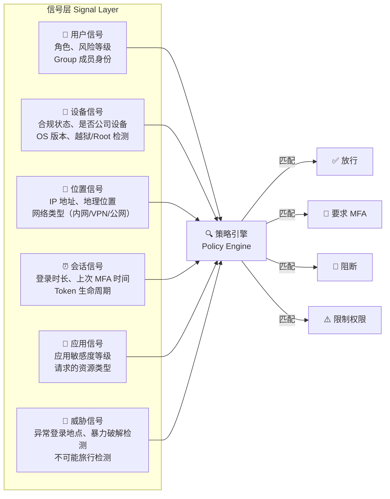

## 条件访问解决什么问题

传统 IAM 的认证模型是静态的：用户输入密码 → 验证通过 → 发放 Session/Token → 在过期前所有请求都放行。这个模型的问题在于，**登录时刻的安全上下文会快速过时**——用户可能从公司内网换到了星巴克 Wi-Fi、公司笔记本换成了个人手机、正常工作时间换到了凌晨 3 点，但系统浑然不觉。

条件访问（Conditional Access）把这个静态决策变成动态评估：**每次访问请求都带着当前的安全信号，策略引擎根据信号组合决定放行、拦截或要求额外验证**。它不是"要不要认证"的决策——用户已经认证了——而是"这个认证在当前上下文中够不够用"的决策。

本章聚焦条件访问的策略设计方法论，不绑定特定产品。Keycloak Authentication Flow 的条件子流是实现方式之一（详见 [Keycloak 条件认证与 Step-Up 实战]()），但策略模型本身是通用的。关于 IAM 整体架构中的认证层设计，参阅 [IAM 架构设计指南]()；零信任体系下条件访问的定位，参阅 [零信任身份架构]()。

## 核心概念：信号、条件、动作

条件访问策略由三个要素组成：

| 要素 | 含义 | 示例 |
|------|------|------|
| **信号 (Signal)** | 从请求上下文中提取的安全属性 | 用户 IP、设备是否合规、登录时间、MFA 状态 |
| **条件 (Condition)** | 对信号的逻辑判断 | "IP 不在公司网段内"、"设备未注册"、"距离上次 MFA 超过 8 小时" |
| **动作 (Action)** | 条件满足时的响应 | 放行、要求 MFA、要求重新认证、阻断、限制权限 |

### 信号分类

一个成熟的条件访问引擎会考虑六类信号：



### 策略引擎工作流

```
请求到达 → 提取信号 → 按优先级匹配策略 → 命中策略? 
                                              ├─ 是 → 执行动作 → 记录审计日志
                                              └─ 否 → 应用默认策略 → 记录审计日志
```

关键设计原则：
- **首次匹配即生效**：策略按优先级排序，命中第一条就停止评估，所以排序决定行为
- **默认拒绝**：未命中任何策略时，默认阻断（而非放行）
- **审计一切**：无论结果如何，每次评估都记录到审计日志

## 五种典型策略模式

### 模式一：按网络位置分级认证

最基础也是最常用的模式。核心逻辑：内网可信度高 → 轻量认证；外网不可信 → 强制 MFA。

| 信号 | 条件 | 动作 |
|------|------|------|
| 客户端 IP | 在公司内网 CIDR 段内 | 仅需密码认证 |
| 客户端 IP | 不在公司内网 CIDR 段内 | 密码 + TOTP MFA |
| 客户端 IP | 来自高风险国家/地区 | 阻断访问 |

**为什么内网也要有策略（而不是一律放行）**：内网不等于绝对可信。横向移动攻击的第一跳往往就在内网——攻击者通过钓鱼拿到一台内网机器的权限后，利用内网低认证要求访问更多系统。所以最低限度应对管理员和敏感应用在内网也要求 MFA。

### 模式二：按用户角色/风险等级

不是所有用户平等。管理员和持有敏感数据的用户需要更高的认证强度。

| 信号 | 条件 | 动作 |
|------|------|------|
| 用户角色 | `admin` 或 `superuser` | 强制 MFA + 要求注册 FIDO2/Passkey |
| 用户角色 | 普通员工 | 密码认证，外网时可选 TOTP |
| 用户风险等级 | `high`（近期多次失败登录、异地登录） | 强制密码重置 + MFA |

**与模式一的组合**：管理员从内网 → 密码 + FIDO2（不要降级为纯密码）；管理员从外网 → 密码 + FIDO2 + 设备合规检查。

### 模式三：按应用敏感度

不同应用有不同的安全要求。内部 Wiki 和财务系统的认证强度不应相同。

| 应用 | 敏感度 | 认证要求 |
|------|--------|---------|
| 内部文档 Wiki | 低 | 密码认证 |
| 代码仓库 (GitLab) | 中 | 密码 + TOTP（外网时） |
| 财务系统 / 生产环境管理后台 | 高 | 密码 + FIDO2/Passkey，限制仅公司设备 |
| PII 数据库查询界面 | 极高 | FIDO2 + 审批工作流 + 会话录制 |

### 模式四：基于会话风险的自适应升级

已经登录的用户不代表永远安全。会话中检测到风险信号时，动态提升认证要求——这叫 Step-Up Authentication。

| 触发信号 | 动作 |
|---------|------|
| 用户尝试访问比当前认证等级更高的资源 | 要求完成 Step-Up MFA，成功后提升会话认证等级 (ACR) |
| 检测到不可能旅行（北京登录后 10 分钟在纽约登录） | 立即吊销所有会话，强制全局重新认证 |
| 连续 API 调用速率异常（疑似 Token 泄露） | 吊销当前 Token，要求重新授权 |
| 设备合规状态从"合规"变为"不合规" | 阻断新请求，现有会话标记为待验证 |

### 模式五：特权操作的实时授权

某些操作即使已经登录，也应该要求二次确认——不仅仅是 MFA，而是明确的用户意图确认。

| 操作 | 额外要求 |
|------|---------|
| 删除项目 / 数据库 | 重新输入密码或 FIDO2 验证 |
| 修改 MFA 设置 / 绑定新设备 | 用现有 MFA 设备确认 |
| 导出全部用户数据 | 双人审批 + MFA |
| 修改计费信息 | FIDO2 + 邮件通知 |

## 策略优先级设计

当多个策略可能同时匹配一个请求时，优先级决定了谁生效。这是一个容易出错的设计点：

```
优先级 1（最高）：阻断策略 — IP 在黑名单 → 直接阻断（不继续评估）
优先级 2：管理员强制 MFA — 角色 = admin → 要求 FIDO2
优先级 3：高风险会话 — 用户风险等级 = high → 要求 MFA + 密码重置
优先级 4：外网 MFA — 不在内网 → 要求 TOTP
优先级 5（最低/默认）：放行 — 其他情况 → 允许密码认证
```

**常见错误**：把"外网 MFA"放在"管理员 FIDO2"之前——结果是管理员在外网只被要求 TOTP 而不是 FIDO2，防护降级了。

## 落地实现：Keycloak Authentication Flow 映射

Keycloak 的 Authentication Flow 框架原生支持条件子流，可以映射上述策略模式：

| 策略模式 | Keycloak 实现方式 |
|---------|------------------|
| 按网络位置 | Condition - IP Address Range 条件子流，IP 不匹配时走 ALTERNATIVE MFA 子流 |
| 按用户角色 | Condition - User Role 条件子流，admin 角色走 REQUIRED FIDO2 子流 |
| 按应用敏感度 | 为不同 Client 配置不同的 Authentication Flow（通过 Client 设置中的 `Authentication flow overrides`） |
| 会话风险 Step-Up | 应用端检测到敏感操作时，在 OIDC Authorization Request 中携带 `acr_values` 参数要求更高认证等级，Keycloak 端通过 `Condition - Level of Authentication` 判断当前 LoA 是否足够 |
| 特权操作确认 | 在应用层实现——不是 Keycloak 职责，但可以配合 Keycloak 的 Token Introspection 端点验证当前认证上下文 |

Keycloak 条件认证的完整配置步骤和排错指南见 [Keycloak 条件认证与 Step-Up 实战]()。

## 与 Microsoft Entra ID 条件访问的对比

如果你是 Microsoft 365 生态的用户，可能熟悉 Entra ID（原 Azure AD）的条件访问。它与开源方案的设计差异值得了解：

| 维度 | Entra ID Conditional Access | Keycloak + 自建策略 |
|------|---------------------------|---------------------|
| 策略定义方式 | GUI 向导，下拉菜单选条件 | Authentication Flow XML/JSON 编排，或用 Admin Console 拖拽 |
| 信号丰富度 | 内置集成 Intune 设备合规、Defender 威胁情报、MCAS 应用风险 | 需自行集成外部风险信号源（通过 SPI 扩展） |
| 设备合规判断 | 原生 Intune MDM 集成 | 需自行实现 SPI 对接 MDM（或通过反向代理层检测） |
| 持续访问评估 (CAE) | 支持（Exchange/Teams 等 M365 应用原生支持） | 需通过 Token 短有效期 + 频繁 Introspection 近似实现 |
| 成本 | Entra ID P1/P2 许可 | 开源免费，但工程投入较高 |
| 锁定风险 | 强（与 M365 深度绑定） | 低（标准协议，可替换） |

一句话：**Entra ID 的条件访问开箱即用但把你锁在微软生态，Keycloak 的条件访问灵活可控但要自己搭信号层。**

## 常见问题（FAQ）

**Q1: 条件访问和零信任是什么关系？**

条件访问是零信任架构在 IAM 层的核心落地机制。零信任的原则是"永不信任，始终验证"——条件访问提供"如何验证每次请求"的策略引擎。零信任还包括网络分段、数据分类、端点安全等 IAM 之外的维度。详见 [IAM 零信任 FAQ]()。

**Q2: 条件访问对用户体验的影响有多大？如何平衡安全与体验？**

好的条件访问应该让大部分用户在大部分时间感觉不到它的存在。策略设计原则：
- 内网 + 公司设备 + 正常工作时间 → 无感（密码即可）
- 外网 + 个人设备 → 要求 MFA（合理摩擦）
- 高风险信号 → 强制验证（用户能理解"这种异常情况确实该多验证一次"）

用户体验的杀手不是 MFA 本身，而是频繁的、不必要的 MFA——"我刚在内网输完密码为什么还要输 OTP"。

**Q3: 如何开始落地条件访问？**

最小启动方案（2 周可完成）：
1. 管理员账号强制 MFA——这是安全上回报最高的第一步
2. 外网访问强制 MFA——覆盖最大的攻击面（VPN 之外的公网入口）
3. 一个"阻断列表"——已知恶意 IP/国家直接拒绝，成本极低

这三步加起来可以阻止 80% 的身份攻击，而实施成本不高。之后再逐步引入设备合规、会话风险、Step-Up 等高级策略。

**Q4: 条件访问的审计日志应该记录什么？**

每次策略评估至少记录：请求时间、用户标识、应用标识、匹配的策略 ID、决策结果（放行/MFA/阻断）、触发决策的关键信号值（如 IP、设备合规状态）。这在合规审查和安全事件回溯时是黄金数据。注意不要记录完整 Token 或密码等敏感凭证。IAM 审计日志的完整要求见 [IAM 安全合规与等保 2.0]()。

## 小结

条件访问把 IAM 的认证决策从"登录时刻的一次性检查"升级为"每次请求的持续评估"。核心方法论是统一的——信号 → 条件 → 动作——但落地方式取决于你的 IAM 基础设施：Keycloak 的 Authentication Flow 是实现条件访问的开源基石，而 Entra ID 提供了开箱即用的商业化方案。

关键的思维转变：不要问"这个用户认证了没有"，而要问"这个用户在**当前上下文**中应该被授予**什么级别的访问权限**"。
