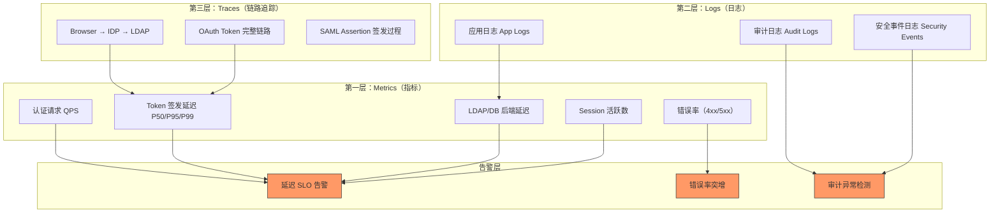

## 23.1 IAM 为什么需要专门的可观测性策略

在企业 IT 架构中，IAM 是一个特殊的存在——它不是业务系统，却是所有业务系统的登录入口。当 IAM 出现性能退化时，症状不会首先出现在 IAM 自身，而是表现为"应用登录慢""Token 刷新失败""新员工无法入职"等下游问题。等你从业务告警回溯到 IAM 时，往往已经过了十分钟。

IAM 可观测性要回答的核心问题不是"CPU 满没满"，而是：

- **当前有几条认证链路在排队？** 每一秒的排队都在影响用户登录体验
- **Token 签发的 P99 延迟有没有漂移？** 今天 50ms，下周变成 200ms——IAM 自身可能还在正常范围内，但上游应用已经在报超时
- **哪些 Client 在频繁请求？** 可能是业务扩容的正常行为，也可能是一个忘记加缓存的微服务正在 DoS 你的 Token Endpoint
- **审计日志里有没有异常模式？** 凌晨 3 点突然冒出一堆 admin 角色的 Token 签发——要不就是运维在加班，要不就是凭证泄露

关于 IAM 整体架构设计（包括高可用和性能扩展）请参阅 [IAM 架构设计指南]()和 [IAM 高可用与性能扩展]()。本章专注于"怎么看到问题正在发生"。

## 23.2 IAM 可观测性三层模型

IAM 可观测性可以按照数据形态分为三层——这不是凭空造的框架，而是 Google SRE 的"三大支柱"（Metrics / Logs / Traces）在身份领域的工程化映射：



**图释**：Metrics 层是实时监控的主力——你通过 QPS、延迟、错误率判断"系统是否健康"；Logs 层回答"刚才发生了什么"，尤其是审计日志是合规审计的硬需求；Traces 层解决"认证请求慢在哪一步"——当 P99 延迟从 50ms 漂移到 500ms 时，Trace 告诉你瓶颈是 LDAP 查询还是 Token 签名运算。三层叠加形成告警规则。

## 23.3 IAM 关键监控指标

### 23.3.1 认证链路指标

| 指标 | 含义 | 健康基线 | 告警阈值 |
|------|------|---------|---------|
| `iam_auth_requests_total` | 认证请求总量（按结果分组：success/failure） | — | success_rate < 99% |
| `iam_auth_duration_seconds` | 认证端到端延迟（P50/P95/P99） | P50 < 200ms, P95 < 500ms | P95 > 1s |
| `iam_auth_active_sessions` | 活跃会话数 | 日间波动 ±30% | 突然翻倍或减半 |
| `iam_token_issue_total` | Token 签发量（按 grant_type 分组） | — | client_credentials 量异常暴增 |

**实战建议**：`client_credentials` 的 Token 签发量是最容易被忽视的指标。一个忘记缓存 Token 的微服务可能以每秒几十次的频率请求 Token Endpoint，它的 RPS 甚至可能超过所有用户的登录请求之和。这个问题的修复不在 IAM 端（限流只是兜底），而应该在客户端加 Token 缓存和过期前提前刷新。

### 23.3.2 后端依赖指标

IAM 不是独立运行的系统——它依赖 LDAP/AD、数据库、外部 IDP 等后端：

| 指标 | 含义 | 关注点 |
|------|------|--------|
| `iam_ldap_query_duration_seconds` | LDAP 查询延迟 | LDAP 慢查询会拖慢整个登录流程 |
| `iam_db_query_duration_seconds` | 数据库查询延迟 | 用户/角色/Session 查询 |
| `iam_external_idp_call_duration_seconds` | 外部 IDP 调用延迟 | SAML/OIDC 联邦场景 |
| `iam_cache_hit_ratio` | 缓存命中率 | < 90% 需要检查缓存策略 |

**关键场景**：IAM 的高可用和性能扩展已经讨论了横向扩展和缓存策略（见 [IAM 高可用与性能扩展]()），但即便你做了集群部署，如果 LDAP 后端单点故障，所有认证请求都会阻塞在 LDAP 查询上。IAM 监控必须覆盖依赖链路的健康状态——不只是 IAM 自身的 CPU 和内存。

### 23.3.3 安全事件指标

| 指标 | 含义 | 响应动作 |
|------|------|---------|
| `iam_login_failures_by_user` | 按用户统计的登录失败次数 | 连续 5 次失败 → 临时锁定 + 告警 |
| `iam_login_failures_by_ip` | 按 IP 统计的登录失败次数 | 同一 IP 跨多用户 → 疑似爆破攻击 |
| `iam_token_revocation_total` | Token 吊销次数 | 异常暴增 → 可能在做凭证轮换 |
| `iam_admin_operations_total` | 管理操作次数 | 凌晨管理操作 → 人工确认 |

关于 IAM 安全审计和合规的更多内容，参见 [IAM 安全合规与等保 2.0]()和 [IAM 安全最佳实践]()。

## 23.4 IAM 审计日志

### 23.4.1 什么必须记

审计日志是 IAM 合规的底线。一个最低可审的 IAM 审计日志至少包含以下事件类型：

- **认证事件**：谁、什么时间、从哪个 IP、用什么方式（密码/OTP/Passkey）登录，结果成功还是失败
- **授权事件**：谁、什么时间、请求了什么权限、被授予了什么 Scope/Claims
- **管理事件**：谁、什么时间、创建/修改/删除了什么对象（用户、角色、Client、Realm 配置）
- **Token 事件**：Token 签发（含 grant_type、client_id、scopes）、Token 刷新、Token 吊销

### 23.4.2 审计日志格式

推荐以结构化格式（JSON）输出 IAM 审计日志，每条日志包含：

```json
{
  "timestamp": "2026-07-12T10:23:45.123Z",
  "event_type": "authentication.success",
  "user_id": "a1b2c3d4-...",
  "client_id": "my-web-app",
  "ip_address": "10.0.1.42",
  "auth_method": "password_otp",
  "realm": "employees",
  "session_id": "sess_xyz",
  "request_id": "req-abc123"
}
```

结构化日志的价值在于：你可以用 `jq` 或 Loki/Elasticsearch 直接按字段查询——"今天 10:00-11:00 之间 `event_type=authentication.failure` 且 `ip_address=10.0.1.42` 的所有事件"——比 grep 字符串快一个数量级。

> Keycloak 的审计事件开箱即用，格式为 `KC-SERVICES-*` 和 `KC-LOGIN-*` 前缀的事件日志。生产环境建议将 Keycloak 事件通过 Event Listener SPI 转发到外部日志平台（Elasticsearch / Loki / Splunk），具体操作请参阅 [Keycloak 审计日志与 IAM 合规实践]()。

## 23.5 IAM 可观测性工具链

### 23.5.1 工具选型对比

| 层次 | 开源方案 | 商业/云方案 | 适用场景 |
|------|---------|------------|---------|
| Metrics 采集 | Prometheus + Grafana | Datadog, Grafana Cloud | 所有规模 |
| 日志聚合 | Loki + Grafana, ELK Stack | Splunk, Datadog | 日志 > 10GB/天建议上云方案 |
| 链路追踪 | Jaeger, Tempo | Datadog APM, New Relic | 多 IDP 联邦场景必备 |
| 告警 | Alertmanager + Grafana | PagerDuty, Opsgenie | 根据值班体系选择 |
| 审计专用 | Wazuh (SIEM) | Splunk Enterprise Security | 合规+等保场景 |

### 23.5.2 最小可运行方案

如果团队只有 2-3 人维护 IAM，不需要一开始就部署全链路追踪。最小可运行的可观测性方案分三步走：

**第一步：Prometheus + Grafana（1 天）**

部署 Prometheus Operator（如果有 K8s）或单机 Prometheus，配置 IAM 的 `/metrics` 端点（Keycloak 需 `--metrics-enabled=true`，详见 [Keycloak Prometheus 监控指标详解]()），导入社区 Grafana Dashboard。至少能看到：认证 QPS、认证延迟、JVM/Go 内存、数据库连接池。

**第二步：结构化审计日志（半天）**

配置 IAM 将事件日志以 JSON 格式输出到 stdout，由 Loki 或 ELK 采集。先不追求复杂的告警规则，确保"出了事能查到日志"。

**第三步：SLO + 告警（1 天）**

定义两条 IAM SLO：

- 认证可用率 ≥ 99.9%（30 天内 error/total < 0.1%）
- 登录 P95 延迟 ≤ 1s

配两条告警规则：
- 5 分钟内认证错误率 > 5% → 告警
- 15 分钟内 P95 延迟 > 2s → 告警

## 23.6 IAM 监控 FAQ

### Q1：IAM 监控和其他后端服务的监控有什么本质区别？

IAM 是企业认证的单点依赖——它坏了，所有应用都登不进去。普通后端服务（如一个报表服务）挂了只影响它自己，IAM 挂了是系统性故障。这意味着 IAM 的监控等级应该和"核心网络交换机"同级，而不是和"某个微服务"同级。你的告警通道（短信/电话）在凌晨 3 点被 IAM 告警叫醒是合理的。

### Q2：我们的 IAM 在云上（SaaS），还需要自己监控吗？

需要——但要分清楚责任边界。如果用的是 Auth0/Okta/Entra ID 等 SaaS IDP，你不需要监控 IDP 自身的 CPU/内存/数据库，但你**必须监控**：

- IDP 的 Status Page 和 SLA 报告（这决定了你是否需要多 IDP 容灾）
- 从你的应用到 IDP 的网络延迟（跨区域部署的常见坑）
- 你自己的应用侧认证成功率（IDP 返回什么错误码？是网络问题还是 IDP 限流？）
- Token 签发的延迟（从你的应用侧测量，不是 IDP 的延迟）

### Q3：Keycloak 的日志太多了，怎么过滤真正重要的？

Keycloak 默认日志级别是 `INFO`，生产中建议：

- 认证相关：`INFO`（保留所有登录/登出事件）
- 管理相关：`INFO`（保留 Realm/User/Client 的创建/修改/删除）
- 底层框架：`WARN`（Quarkus/Undertow 的内部日志，生产环境不需要 DEBUG）

具体过滤：在 `keycloak.conf` 中设置
```ini
log-level-console=info
quarkus.log.category."org.keycloak".level=INFO
quarkus.log.category."org.keycloak.events".level=DEBUG
```
只对事件日志开 DEBUG，其余保持 INFO。

### Q4：IAM 监控需要存多久数据？

- **Metrics（指标）**：至少 30 天（看趋势），推荐 90 天（看季节性）
- **Audit Logs（审计日志）**：至少 180 天（等保 2.0 的最低要求），推荐 1 年（应付安全审计）
- **Traces（链路追踪）**：7-15 天（排错用，不需要长期保留）

### Q5：我们的 IAM 告警太频繁，怎么办？

告警疲劳的根本原因通常是阈值设得太紧。IAM 有自己的业务节奏——周一的 9:00-9:30 是登录高峰，认证延迟 P95 从 200ms 涨到 600ms 是正常的。不要把"工作日登录高峰"当成"性能退化"去告警。

建议做法：**基于历史基线设阈值**，而非固定值。例如"当前 P95 延迟超过历史同期（同一时间段，同一工作日）的 3 倍"——先用 Prometheus `quantile_over_time` 建立 30 天基线，再做同比告警。

### Q6：中小团队没有专职 SRE，IAM 监控怎么搞？

优先保证两条：

1. **审计日志绝对不能丢**——这是合规底线，也是出事之后唯一能回溯的东西。用 `rsyslog` 转发到远端也比裸写本地磁盘强。
2. **认证可用性告警必须有**——哪怕只配一条"5 分钟内没有成功登录事件 → 告警"的反向指标（heartbeat check），也比零监控强。

其余 Metrics/Traces/Dashboard 可以逐步加，但上面两条必须第一天就有。
