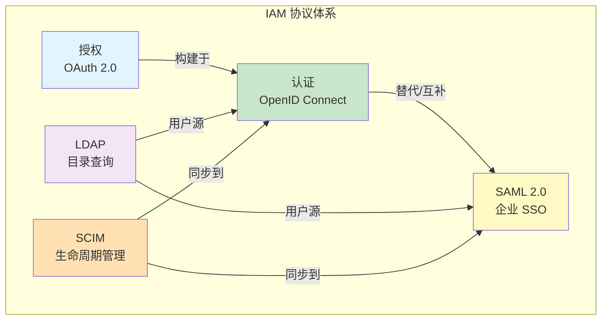
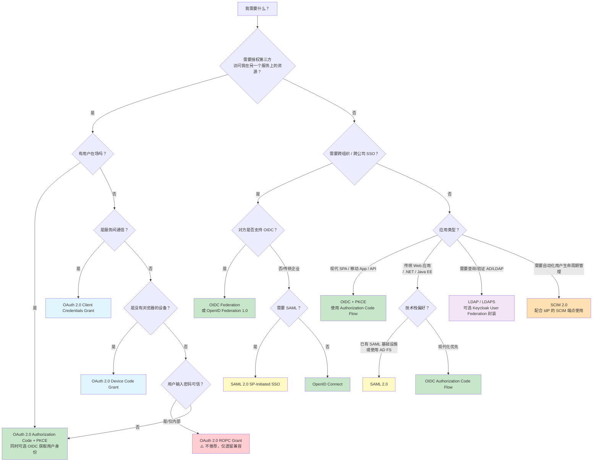

## 协议选型为什么重要

IAM 系统的核心任务是"把正确的身份信息，在正确的时机，以正确的方式，交给正确的应用"。而**协议**就是这条信息传递通道的语法和合同。

选错协议的代价不是"功能少了几个"，而是：

| 问题类型 | 典型后果 | 实际案例 |
|---------|---------|---------|
| 协议不匹配 | 用 OAuth 做认证，结果拿到 Access Token 却不知道用户是谁 | 早期很多开发者把 OAuth 2.0 当成"社交登录协议"用 |
| 过度设计 | 在内部管理面板里用 SAML，每个 SP 都要交换 XML 元数据 | 几十个内部工具维护 SAML metadata 的运维噩梦 |
| 协议混用 | OIDC + SAML 双栈但未统一会话管理，导致登出不同步 | 用户在一个应用登出，另一个应用会话依然有效 |
| 安全盲区 | PKCE 缺失、redirect_uri 未校验、state 参数未使用 | OAuth 授权码拦截、CSRF、Mix-Up Attack |

本章不重复 OAuth 2.0、OIDC、SAML 的协议细节——那些在[协议与标准]()部分有完整阐述。这里专注于**决策**：你面对一个具体场景时，该选哪个协议、为什么、不选其他协议的原因是什么。

## 五大协议的核心定位

在进入决策树之前，先理解每个协议在 IAM 体系中的核心角色——它们解决的是**不同层面的问题**：

| 协议 | 核心问题 | 在 IAM 中的位置 | 数据格式 | 典型端口 |
|------|---------|---------------|---------|---------|
| **OAuth 2.0** | "我能做什么？（授权）" | 授权层——控制第三方应用对受保护资源的访问范围 | JSON | 通常 HTTPS |
| **OpenID Connect (OIDC)** | "你是谁？（认证）" | 认证层——OAuth 2.0 + 身份层，标准化用户身份传递 | JSON (JWT) | HTTPS |
| **SAML 2.0** | "企业里的你是谁？（联邦认证）" | 身份联邦——跨组织/跨域传递用户身份断言 | XML | HTTPS / Redirect |
| **LDAP** | "用户信息在哪？（目录查询）" | 用户存储——身份数据的查询、验证和修改协议 | ASN.1 / LDIF | 389 / 636 |
| **SCIM** | "用户怎么创建/更新/删除？（生命周期）" | 用户供应——自动化用户帐号的 CRUD 生命周期管理 | JSON (REST) | HTTPS |

> **一句话判断**：需要授权第三方访问资源 → OAuth 2.0；需要证明"我是谁" → OIDC 或 SAML；需要连企业 AD → LDAP；需要自动创建/删除用户 → SCIM；需要跨公司 SSO → SAML 或 OIDC Federation。

## IAM 协议选型决策树

下面这个决策树覆盖了企业 IAM 中最常见的 10 种场景。从你的需求出发，沿着分支走到叶子节点，就是推荐协议。

**决策树使用说明**：

1. 从顶部"我需要什么"开始，诚实回答自己的需求
2. 一个项目可能涉及多个分支——例如一个 SaaS 产品可能同时需要 OAuth 2.0（第三方集成）、OIDC（用户登录）、SCIM（企业客户自动同步用户）
3. 红色节点（ROPC Grant）表示有已知安全风险，仅限特定遗留场景

## 十个典型场景的协议选型

### 场景 1：SaaS 产品需要支持企业客户 SSO 登录

**需求**：让使用 Okta / Entra ID / Google Workspace 的企业客户，用他们自己的帐号登录你的 SaaS。

| 考量 | 答案 |
|------|------|
| 推荐协议 | **OIDC** 为主，**SAML 2.0** 作为补充 |
| 为什么不是纯 SAML | 大多数现代 IdP 已支持 OIDC；OIDC 客户端实现简单、调试方便、JSON 可读性远好于 XML |
| 为什么还要 SAML | 传统企业（金融/政府）和 Microsoft AD FS 生态仍然主要使用 SAML——如果不支持 SAML，你就放弃了一批大客户 |
| 实现策略 | OIDC 优先（80% 客户覆盖），SAML 作为"企业版"功能（剩余 20%） |

> 实现时需要注意：Keycloak 可以同时作为 OIDC Provider 和 SAML IdP；Dex 只做 OIDC 到上游 IdP 的联邦代理，不原生支持 SAML。如果要用 SAML，Keycloak 比 Dex 更合适。

### 场景 2：内部工具统一登录（Grafana / Jenkins / Harbor / GitLab 等）

**需求**：公司内部 20-50 个 DevOps 工具需要单点登录。

| 考量 | 答案 |
|------|------|
| 推荐协议 | **OIDC**（几乎所有现代 DevOps 工具都支持 OIDC） |
| 配置方式 | oauth2-proxy 作为反向代理前置，或各工具原生 OIDC 集成 |
| 为什么不是 SAML | 配置成本高——每个工具的 SAML metadata 都要维护，内部环境没必要承受这个复杂度 |
| 特殊注意 | 一些老工具（如 Jenkins 旧版）可能需要 SAML 插件，考虑升级或替换 |

### 场景 3：移动 App 需要登录

**需求**：原生 iOS/Android App 的用户登录。

| 考量 | 答案 |
|------|------|
| 推荐协议 | **OIDC Authorization Code + PKCE** |
| 为什么 PKCE 必须 | 移动 App 无法安全保存 client_secret。PKCE 提供了等效的安全保障 |
| 推荐库 | AppAuth (iOS/Android)，不要用 WebView 直接加载登录页 |
| 为什么不是 Implicit Grant | OAuth 2.1 已废弃 Implicit Grant——它在移动端的攻击面（token 可能被拦截、无法验证 redirect_uri）已被 PKCE + Authorization Code 替代 |

### 场景 4：微服务间 API 调用需要授权

**需求**：Service A 调用 Service B 的 API，两个服务都是内部系统，没有用户参与。

| 考量 | 答案 |
|------|------|
| 推荐协议 | **OAuth 2.0 Client Credentials Grant** |
| 实现方式 | 两个服务各有一个 client_id + client_secret，A 用它们向 IdP 换取 Access Token，然后带着 Token 调用 B |
| Token 传递 | 如果走 API Gateway，Gateway 完成 Token 校验和转发；如果是直连，B 自己校验 Token（Introspection 或本地 JWT 验证） |
| 为什么需要 OAuth 而不是简单的 API Key | Client Credentials 提供 token 过期、scope 限制、可撤销、审计日志——静态 API Key 做不到 |

### 场景 5：企业需要从 AD / LDAP 同步用户到 SaaS 平台

**需求**：企业有 AD 域控，需要在 SaaS 平台中自动创建/更新/禁用用户。

| 考量 | 答案 |
|------|------|
| 推荐协议 | **SCIM 2.0**（用于用户生命周期管理）+ **LDAP**（用于数据读取和认证） |
| 架构 | AD → LDAP 查询 → 同步工具/SCIM 网关 → SaaS 平台的 SCIM 端点 |
| 为什么不是直接暴露 LDAP | 暴露 LDAP 给互联网等于把目录服务暴露在攻击面下；SCIM 是 RESTful、有 Token 认证、支持过滤和分页 |
| 开源实现 | Keycloak 支持 LDAP User Federation（实时读取）、支持 SCIM 端点（通过扩展） |

### 场景 6：电商网站需要"用微信/Google/Apple 登录"

**需求**：C 端用户不想注册新帐号，想用已有社交帐号登录。

| 考量 | 答案 |
|------|------|
| 推荐协议 | **OIDC**（Google/Apple 已经支持 OIDC）；微信使用的是变种 OAuth 2.0 |
| IDP 端配置 | 在 Keycloak Identity Provider 中添加 Google / Apple / 微信，它们会自动处理协议适配 |
| 帐号关联 | 确保处理"同一个邮箱可能来自不同社交平台"的情况——Keycloak 的 Account Linking 可以解决 |

### 场景 7：两家公司合并后，员工需要互相访问对方的内部系统

**需求**：A 公司和 B 公司合并，A 的员工需要用 A 的帐号访问 B 的内部系统。

| 考量 | 答案 |
|------|------|
| 推荐协议 | **SAML 2.0**（企业互信的传统方案）或 **OIDC Federation**（新方案） |
| 为什么 SAML 是默认 | 两家公司很可能已经各自有 IdP，SAML 是企业 IDP 互信的标准协议 |
| 实现架构 | IdP-to-IdP 联邦：A 的 IdP 配置 B 的 IdP 为 Trusted IdP，用户在 A 登录后访问 B 系统时由 B 的 IdP 信任 A 的断言 |
| 新趋势 | [OpenID Federation 1.0](https://openid.net/specs/openid-federation-1_0.html) 正在替代 SAML 的企业联邦场景，但生态成熟度还在爬坡 |

### 场景 8：IoT 设备需要上报数据到云平台

**需求**：一个没有浏览器、没有键盘的物联网设备，需要向云端 API 发送数据。

| 考量 | 答案 |
|------|------|
| 推荐协议 | **OAuth 2.0 Device Code Grant**（首次配网时）或 **Client Credentials**（设备已有凭证） |
| Device Code 流程 | 设备向 IdP 请求一个 device_code + user_code → 用户在手机上访问验证 URL 输入 user_code 确认 → 设备轮询获得 Token |
| 为什么不是 Client Credentials 直接 | 设备出厂时可能没有唯一凭证，Device Code 提供了"人在环"的授权确认 |
| 后续会话 | 设备获取 Refresh Token 后可长期保持会话，不再需要用户交互 |

### 场景 9：需要在反向代理层做统一认证

**需求**：用 Nginx Ingress 或 Traefik 对所有后端服务做统一的身份校验，未登录用户不能访问任何内部页面。

| 考量 | 答案 |
|------|------|
| 推荐协议 | **OIDC（oauth2-proxy + ForwardAuth / auth-url）** |
| Nginx Ingress | oauth2-proxy 作为 auth-url 指向的验证服务，Nginx 根据验证结果放行或重定向 |
| Traefik | ForwardAuth 中间件指向 oauth2-proxy 的 `/oauth2/auth` 端点 |
| 后端如何获取用户身份 | oauth2-proxy 会通过 `X-Auth-Request-User`、`X-Auth-Request-Email`、`X-Auth-Request-Groups` 等 HTTP Header 传递用户信息 |
| 详细配置 | 参见 [Keycloak + oauth2-proxy 集成指南]() 和 [Traefik ForwardAuth 配置]() |

### 场景 10：需要从旧版 IAM 迁移到新版

**需求**：从自建 LDAP + 应用内认证迁移到 Keycloak 统一认证。

| 考量 | 答案 |
|------|------|
| 涉及协议 | **LDAP**（读取旧数据）→ **SCIM** 或直接导入（迁移到新平台）→ **OIDC**（新应用接入） |
| 迁移策略 | 1) Keycloak 先通过 LDAP User Federation 连接旧 LDAP——用户认证无缝继续；2) 分批将应用从直连 LDAP 改为对接 Keycloak OIDC；3) 最后把 LDAP 中的用户数据导入 Keycloak 内置数据库，断开 LDAP 依赖 |
| 风险控制 | 不要在迁移第一步就切 DNS 或改认证端点——先增强旧系统，再逐步替换 |
| 详细参考 | [Keycloak LDAP/AD 联合配置指南]() |

## 协议对比速查表

| 维度 | OAuth 2.0 | OIDC | SAML 2.0 | LDAP | SCIM 2.0 |
|------|----------|------|----------|------|----------|
| **核心目的** | 授权 | 认证 | 联邦认证 | 目录查询 | 用户生命周期 |
| **标准化组织** | IETF | OpenID Foundation | OASIS | IETF | IETF |
| **最新规范年份** | 2012 (RFC 6749) | 2014 (Core 1.0) | 2005 | 2006 (RFC 4510) | 2015 (RFC 7643/7644) |
| **传输格式** | JSON (parameter) | JSON (JWT) | XML (SAML Assertion) | ASN.1 BER | JSON (REST) |
| **绑定/传输** | HTTP Redirect/Form POST | HTTP Redirect/Form POST | HTTP Redirect/POST/Artifact | TCP/TLS | HTTP REST |
| **实现复杂度** | 中等 | 中等（比 OAuth 多 ID Token 处理） | 高（XML 签名/加密复杂） | 低（简单查询） | 中等 |
| **调试难度** | 低（HTTP 抓包） | 低（JWT 在线解码） | 高（Base64 XML 签名验证） | 低 | 低 |
| **移动端支持** | ✅ 原生支持 | ✅ 原生支持 | ⚠️ 需要额外处理 | ❌ 不适用 | ❌ 不适用 |
| **SPA 支持** | ✅ (PKCE) | ✅ (PKCE) | ⚠️ 不推荐 | ❌ | ❌ |
| **跨组织 SSO** | ❌ 不是认证协议 | ✅ (OIDC Federation) | ✅ 原生支持 | ❌ | ❌ |
| **会话管理** | ❌ 无定义 | ✅ Session Management / Logout | ✅ SLO (单点登出) | ❌ | ❌ |
| **用户信息标准化** | ❌（各自实现） | ✅ UserInfo Endpoint | ✅ SAML Attributes | ✅ LDAP Schema | ✅ SCIM Schema |
| **发现/配置** | ❌ | ✅ Discovery (.well-known) | ✅ Metadata XML | ❌（手动配置） | ✅ ServiceProviderConfig |
| **角色/组映射** | ❌ | ✅ (Claims) | ✅ (Attributes) | ✅ (memberOf) | ✅ (Groups) |
| **客户端注册** | 动态或手动 | 动态或手动 | 手动（高成本） | N/A | N/A |

## 选型避坑指南

### 坑 1：用 OAuth 2.0 做认证

OAuth 2.0 是**授权**协议，不是**认证**协议。获取到 Access Token 不意味着你知道用户是谁——Access Token 是为资源访问设计的，格式和内容没有标准化。

**正确做法**：如果需要认证，使用 OIDC（在 OAuth 2.0 基础上增加 ID Token）。如果只能拿到 OAuth 2.0 的 Access Token，至少用 Token Introspection 或 UserInfo Endpoint 来验证用户身份。

### 坑 2：在 Blazor/.NET/Java EE 之外用 SAML

SAML 的 XML 签名和加密对于现代 SPA 和移动 App 来说太重了。如果你在 React/Vue/Flutter 应用中接入 SAML，调试签名验证错误会让你怀疑人生。

**正确做法**：新应用默认用 OIDC；只有在对接已有 SAML IdP（如 AD FS、Shibboleth）时才用 SAML。如果后端是 .NET 或 Spring Security，这些框架对 SAML 的支持反而比 OIDC 更成熟——要具体情况具体分析。

### 坑 3：在公网暴露 LDAP

LDAP 的默认安全模型假设它在内网中运行。把 LDAP 暴露到互联网等于邀请攻击者暴力破解你的目录。

**正确做法**：用 SCIM 或 IdP 的 User Federation 功能封装 LDAP。如果需要外部访问，至少通过 VPN/Zero Trust 隧道，而不是直接开 389/636 端口。

### 坑 4："五个协议全支持"的过度设计

一些团队会追求"完美"——同时支持 OIDC、SAML、LDAP、SCIM，再自己封装一套。结果每个协议的实现都在 80% 完成度时被放弃。

**正确做法**：MVP 阶段只支持 OIDC（覆盖 80% 场景），在客户明确需要 SAML 时再加。SCIM 在企业客户超过 10 个之前可以手动处理。LDAP 用 IdP 适配而不是自己裸写。

### 坑 5：忽略 Token 生命周期和刷新策略

选完协议只是第一步。Access Token 设多长？Refresh Token Rotation 要不要开？登出时前端 Token 清了但后端 Token 还有效怎么办？

**正确做法**：Access Token 设 5-15 分钟，Refresh Token 设 8-24 小时并开启 Rotation。登出时必须通知 IdP（OIDC RP-Initiated Logout 或 SAML SLO）。更多细节见 [OAuth 2.0 Token 管理]()。

## IAM 协议选型 FAQ

### Q1: OAuth 2.1 发布了，现有系统必须升级吗？

**不需要立即升级**，但应该逐步采纳 OAuth 2.1 的核心安全要求：强制 PKCE、禁止 Implicit Grant、要求精确的 redirect_uri 匹配、使用 `iss` 参数防止 Mix-Up Attack。这些改动可以在现有 OAuth 2.0 基础设施上实施。详情见 [OAuth 2.1 变化详解]()。

### Q2: 中小企业只有 50 个员工，需要 IAM 协议吗？

**需要，但不需要全量。** 50 人的公司不需要 SCIM（手动建帐号够用），也不需要 SAML（没有跨组织 SSO 需求）。但必须要有 OIDC——至少用 Google Workspace 或 Microsoft 365 作为 IdP，让所有内部工具统一登录。本地帐号 + LDAP 的维护成本在小团队中往往被低估。

### Q3: SAML 和 OIDC 能共存吗？会有什么问题？

**能共存，但有代价。** Keycloak、Okta、Entra ID 都支持同时做 SAML IdP 和 OIDC Provider。主要问题是：
1. **会话一致性**——用户在 OIDC 端登出，SAML 端的会话可能还在（SLO 的实现一致性因 IdP 而异）
2. **运维复杂度**——两个协议的错误排查路径完全不同
3. **团队培训成本**——需要有人同时懂 JWT 和 XML 签名

如果能统一用 OIDC，就不要引入 SAML。只有当业务要求（如客户用的是 AD FS）无法满足时，再加 SAML 支持。

### Q4: 用 Keycloak 的话，协议选择会不会更简单？

**会简化很多。** Keycloak 在协议适配层做得很好——你在 Keycloak 里配置一个 Client（OIDC）或 Client（SAML），后端会自动处理协议细节。开发者只需要知道"我应该创建一个 OIDC Client 还是 SAML Client"。

Keycloak 的不足是它不原生支持 SCIM 服务端（需要通过扩展或外部 SCIM Bridge），也不直接暴露 LDAP 端口（通过 User Federation 反向读取 LDAP，而不是作为 LDAP Server）。

### Q5: LDAP 是否应该被淘汰？什么时候可以不学它？

**短期不会淘汰，但可以不被它束缚。** 如果你：
- 不在传统企业环境中工作（没有 AD）
- 正在做一个新项目，没有历史包袱
- 身份数据存储在数据库中而不是目录服务中

那你不需要 LDAP 的知识。但如果你的公司有超过 500 人的规模且用 Windows，你几乎一定会遇到 AD——这时理解 LDAP 的查询语法（特别是 memberOf 过滤器）是绕不过去的。

### Q6: OAuth 设备授权流程（Device Code）为什么不能用于 SPA？

**因为安全模型不同。** Device Code Grant 假设设备有输出能力（显示 user_code）且用户有第二个设备（手机/电脑）来完成认证。SPA 在同一浏览器中完成所有操作，应该用 Authorization Code + PKCE。把 Device Code 用于 SPA 反而引入了不必要的轮询开销和安全风险（user_code 可能被截获）。

## 与架构设计的衔接

协议选型和架构设计是 IAM 决策的两个维度：

- **协议**回答"用什么语言传递身份信息"——本章覆盖
- **架构**回答"身份数据放哪、谁做决策、如何扩展"——见 [IAM 架构设计指南]()

二者需要同步决策。例如，选择了 SAML 意味着你的 IAM 需要支持 XML 签名验证和 Metadata 管理，这会增加运维复杂度从而影响架构的高可用设计。如果选择了 LDAP，你的架构中必须有一个组件承担 LDAP 查询的延迟风险。

建议先完成[协议选型]()（本章），再做[架构设计]()，最后确定[授权模型]()——这个顺序能减少 70% 的返工。

## 小结

IAM 协议选型的核心原则只有一条：**选最匹配问题域的协议，而不是最"先进"的协议。** 

- OAuth 2.0 解决授权，OIDC 在其上解决认证
- SAML 在企业联邦中仍有不可替代的地位，但对新应用它已不是最优选择
- LDAP 是用户目录的"SQL"——底层基础设施，大多数开发者不需要直接和它打交道
- SCIM 把"建帐号"从手动操作变成 API 调用，是企业 IAM 自动化的重要标志

如果你只记住一件事，记住这个：**拿到一个需求，先问"这是授权还是认证？是内部还是跨组织？有用户在场还是服务间通信？"——三个问题能帮你过滤掉 80% 的错误选项。**
