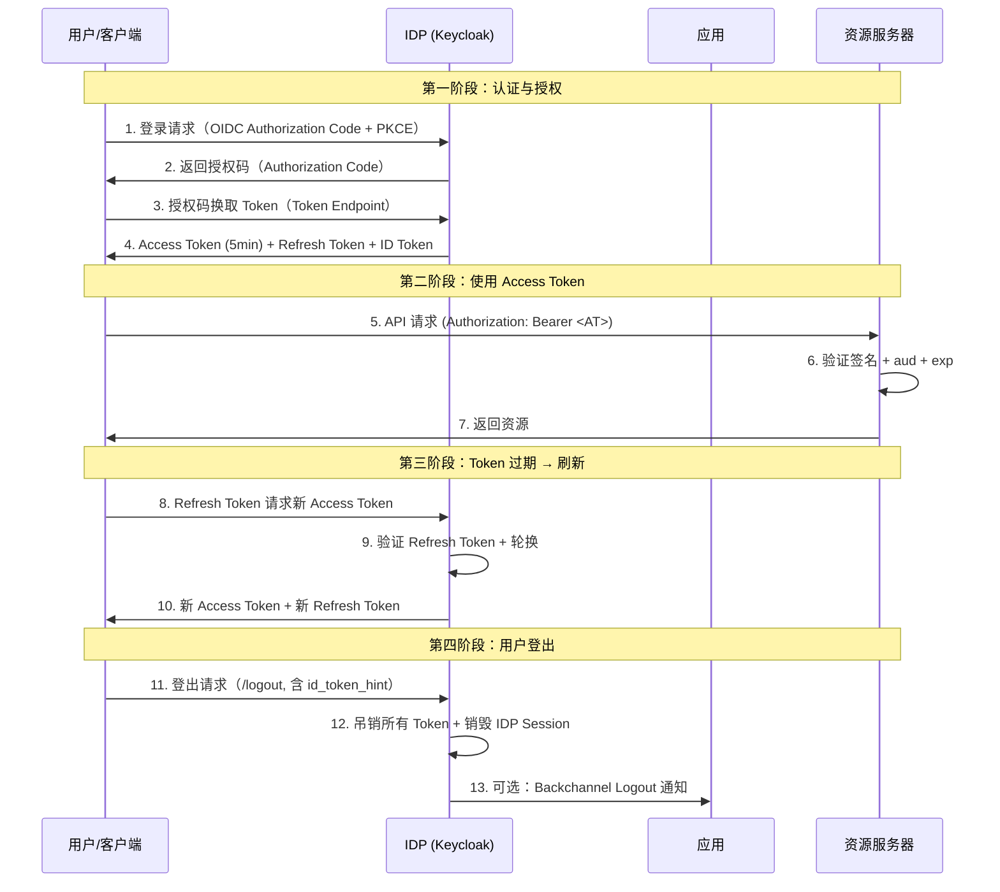

## IAM 会话管理为什么重要

IAM 系统中，"会话" 是连接认证与授权的桥梁。一次登录不只是验证密码——它创建了一个受控的信任窗口，在这个窗口内用户无需重复认证即可访问多个应用。这个窗口的管理——创建、刷新、吊销——决定了系统的安全性和用户体验。

理解 IAM 会话管理需要先澄清三层会话：

| 会话层 | 含义 | 生命周期 |
|--------|------|---------|
| **IDP 会话** | 用户在 IDP（如 Keycloak）的登录状态 | 用户登出或超时 |
| **应用会话** | 用户在某应用内的登录状态 | 应用自身管理 |
| **Token 会话** | Access Token / Refresh Token 的有效期 | Token 过期或吊销 |

三层会话之间通过 SSO 协议（OIDC、SAML）联动，但各层独立管理。这种解耦设计是理解 Token 刷新、会话吊销和登出传播的关键。

## Token 生命周期全景

OAuth 2.0 / OIDC 的会话本质上是 Token 的生命周期管理。三个核心 Token 各司其职：

### Access Token（访问令牌）

Access Token 是访问资源的"通行证"——资源服务器用它来判断"这个请求有没有权限"。

- **格式**：通常是 JWT（自包含），也可以是 Opaque（引用型，需 Introspection）
- **有效期**：5-15 分钟，越短越安全但增加刷新频率
- **验证方式**：资源服务器用 IDP 公钥验证签名（RS256/ES256），不依赖 IDP 在线
- **关键声明**：`sub`（用户）、`iss`（签发者）、`aud`（接收方）、`exp`（过期时间）、`scope`（权限范围）、`iat`（签发时间）

在生产环境中，一个常见的坑是资源服务器没有正确验证 `aud`（audience）。这会导致本来发给应用 A 的 Token 被应用 B 接受——OAuth 2.0 的 audience 约束就是为了防止这种跨应用 Token 复用。在 Keycloak 中，如果没有为 client 配置 audience mapper，Token 的 `aud` 可能默认是 `account`，导致接收方报 `expected audience` 错误。

### Refresh Token（刷新令牌）

Refresh Token 是获取新 Access Token 的凭证——它让用户不必反复登录。

- **核心机制**：Refresh Token Rotation——每次使用后发放新 Token，旧 Token 立即失效
- **Reuse Detection**：如果同一个 Refresh Token 被使用两次，说明可能被盗。此时立即吊销该用户的所有 Token
- **有效期**：通常几小时到几天，比 Access Token 长但不应超过 IDP Session 的绝对超时时间
- **存储**：Web 应用用 HttpOnly Secure Cookie；SPA 用 BFF（Backend For Frontend）模式——SPA 不应直接持有 Refresh Token

Refresh Token Rotation 是 OAuth 2.0 Security BCP（最佳实践）要求的核心防护措施。Keycloak 通过开箱即用地启用了这一机制。

### ID Token（身份令牌）

ID Token 专用于 OIDC 认证流程——它告诉客户端"你是谁"，而不是"你能访问什么"。

- **用途**：客户端验证用户身份后创建本地会话，绝不发送给资源服务器
- **验证项**：签名、`iss`（issuer）、`aud`（client_id）、`exp`（过期）、`iat`（签发）、`nonce`（防重放）
- **有效期**：通常与 Access Token 一致或略短

## SSO 会话架构

单点登录（SSO）的会话管理涉及两个层面的协调。

### IDP-Initiated SSO 中的会话

当用户已登录 IDP（存在有效 IDP Session），访问新应用时：

1. 应用将用户重定向到 IDP 的 `/authorize` 端点
2. IDP 检测到已有有效 Session，跳过认证步骤
3. 直接签发新 Token 给应用
4. 用户无感知登录新应用

这就是 SSO 的核心体验：一次认证，多应用免登。但这也意味着 IDP Session 是所有应用安全的基础——一旦 IDP Session 被劫持（如 Cookie 窃取），攻击者就可以访问所有已授权的应用。

### SP-Initiated 登出与传播

OIDC 定义了三种登出机制：

| 机制 | 说明 | 适用场景 |
|------|------|---------|
| **RP-Initiated Logout** | 用户从应用发起登出，应用重定向到 IDP 的 `/logout`，IDP 销毁 Session 后可选重定向回应用 | 基础场景，需要 `id_token_hint` 参数 |
| **Backchannel Logout** | IDP 通过后端直连通知所有已登录的应用销毁 Session | 敏感应用，需要应用支持 Backchannel Logout URI |
| **Frontchannel Logout** | IDP 通过 iframe 在前端通知应用登出（已基本被 Backchannel 替代） | 遗留场景，受第三方 Cookie 限制影响 |

在生产中，合理的策略是：**RP-Initiated Logout 作为基础 + Backchannel Logout 覆盖敏感应用**。Keycloak 在 Admin Console 的 Client 设置中可配置 Backchannel Logout URL。

实际排查中，登出不完整是常见问题。症状是：用户在应用 A 登出，但应用 B 的 Session 还在，刷新页面后仍然登录状态。根因通常是 Backchannel Logout 未配置或应用 B 的登出端点不可达。

## 会话超时与吊销策略

### Keycloak 的会话超时配置

Keycloak 提供两层超时控制（在 Realm Settings → Tokens 中配置）：

| 配置项 | 默认值 | 建议 |
|--------|--------|------|
| **SSO Session Idle** | 30 分钟 | 普通应用 15-30min，敏感应用 5-10min |
| **SSO Session Max** | 10 小时 | 普通应用 8h，高安全场景 1-2h |
| **Access Token Lifespan** | 5 分钟 | 保持默认，缩短到 3min 可进一步降低泄露风险 |
| **Refresh Token Max** | 30 天 | 生产环境建议 ≤ 24h（需要 Refresh Token Rotation） |

`SSO Session Idle` 是用户无操作后的空闲超时，`SSO Session Max` 是绝对超时——无论用户是否活跃，到达时间后必须重新认证。

### 会话吊销场景

| 场景 | 触发 | 吊销范围 |
|------|------|---------|
| 用户主动登出 | 用户点击登出 | 该用户的 IDP Session + 所有 Token |
| 密码修改 | 用户修改密码 | 该用户的所有 Session（可通过 Realm Settings 启用） |
| 管理员吊销 | Admin Console 中 `Revoke` | 指定 Session |
| 安全事件 | 风险检测触发 | 指定用户或所有用户 |
| Refresh Token 重用 | Refresh Token Rotation 检测 | 该用户的所有 Token |

Keycloak 的 Admin Console → Sessions 中可以看到当前所有活跃 Session，并能手动吊销。API 层面可通过 `DELETE /admin/realms/{realm}/sessions/{session}` 操作。

### 生产环境建议

以下几个配置是很多团队上线后踩过的坑：

1. **不要为了"用户体验好"把 SSO Session Max 设成 30 天**——Token 刷新机制已经解决了反复登录的问题。超长 Session = 长期有效 Cookie = 更长的凭证窃取窗口。

2. **密码修改后立即吊销所有 Session**。Keycloak 的 Realm Settings → Login → "Revoke Refresh Token" 需要在 Authentication Flow 中启用。很多团队漏掉这个配置，导致密码改了但旧 Session 还能用。

3. **Refresh Token 的有效期不应超过 SSO Session Max**。如果 Refresh Token 30 天但 Session Max 10 小时，实际情况是：10 小时后用户重新认证但旧的 Refresh Token 仍然可用——这是个安全漏洞。

4. **SPA 不要直接拿 Refresh Token**。浏览器的本地存储（localStorage/sessionStorage）对 XSS 不安全。SPA 场景应该用 BFF 模式：后端持有 Refresh Token 在 HttpOnly Cookie 中，前端只通过 `/token` 端点间接刷新。

## IAM 会话管理 FAQ

### Q1：SSO Session Idle 和 SSO Session Max 应该设多少？

取决于应用的风险等级。一个实用框架：

| 风险等级 | 示例 | Idle | Max |
|---------|------|------|-----|
| 低 | 内部 Wiki、知识库 | 60min | 24h |
| 中 | 企业内部应用、邮件 | 15-30min | 8h |
| 高 | 财务系统、管理后台 | 5-10min | 1-2h |
| 极高 | 生产环境管理、安全控制台 | 3-5min | 15min |

注意：缩短 Idle 会影响用户频繁被要求重新认证。如果 Idle 时间很短（< 5min），建议配合 Refresh Token 机制减少用户的感知摩擦。

### Q2：Access Token 过期后，前端怎么无感刷新？

标准做法是静默刷新（Silent Refresh）：前端拦截 401 响应，用 Refresh Token 换取新的 Access Token，再重试原请求。关键细节：

1. 用请求队列（Promise queue）避免并发刷新——多个 401 同时触发时只发一次刷新请求
2. 刷新失败（如 Refresh Token 也过期）时跳转登录页
3. SPA 用 BFF 模式，非 SPA 用 HttpOnly Cookie 存储 Refresh Token

### Q3：OIDC 和 SAML 的会话管理有什么区别？

| 方面 | OIDC | SAML |
|------|------|------|
| 会话载体 | Token（JWT 或 Opaque） | XML Assertion |
| 刷新机制 | Refresh Token + Rotation | 无标准刷新，需重新发起 SAML Request |
| 登出 | RP-Initiated + Backchannel | SLO（Single Logout），SOAP 绑定较重 |
| 移动/SPA 支持 | 原生支持 | 困难（重定向 + POST 绑定） |
| 会话状态 | 无状态（Token 自包含） | 通常需要 IDP 端状态 |

简单说：OIDC 的会话模型更现代、更轻量，适合微服务和移动场景；SAML 的会话模型更重但提供了更完整的 SLO 规范——代价是实现复杂度高。

### Q4：Keycloak 的 Session 存在哪里？怎么水平扩展？

Keycloak 的 Session 存储与部署模式相关：

- **单节点**：存储在 Infinispan（内存缓存），重启后 Session 丢失
- **集群模式**：Infinispan 分布式缓存，Session 在节点间复制。需配置 `jgroups` 或使用 Kubernetes `dns.DNS_PING` 做服务发现
- **外部存储**：Keycloak 支持 Infinispan 外部缓存服务器（适用于大规模部署），但 Session 本身仍以内存为主，不建议通过数据库持久化 Session

高可用场景下，建议至少 2 个节点 + Infinispan 分布式缓存。配置细节见 [Keycloak 高可用与灾备方案]()。

## 延伸阅读

- [OAuth 2.0 深度解读]()：理解 Token 的基础——四种 Grant Type 的完整流程
- [OAuth 2.0 攻击面与防护图解]()：Token 泄露、CSRF、重放攻击的 Mermaid 图解
- [OpenID Connect 详解]()：ID Token 和 UserInfo 端点的完整说明
- [IAM 安全最佳实践]()：从安全角度看的 Session Cookie 配置和 Token 保护
- [Keycloak OAuth2-Proxy 配置与排错]()：Token audience 问题实战
- [Keycloak 高可用与灾备方案]()：会话复制和集群架构

## 小结

IAM 会话管理是"信任的窗口管理"——既要保证用户在不反复登录的前提下顺畅使用（Access Token 刷新），又要确保这个窗口不会成为攻击者的入口（短有效期的 Token + Refresh Token Rotation + Reuse Detection）。三层会话（IDP Session / 应用 Session / Token）各有生命周期，通过 OIDC 的 RP-Initiated Logout + Backchannel Logout 实现协调登出。关键原则：**Token 越短越好，刷新越频繁越安全，登出必须传播到所有层**。
