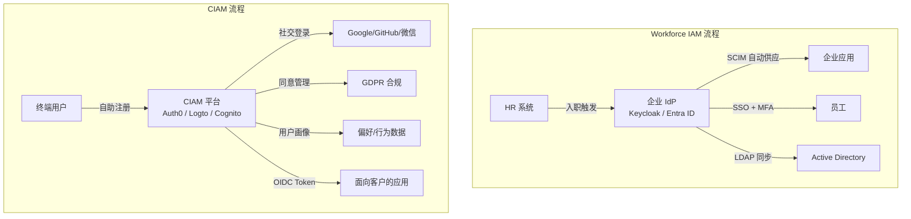
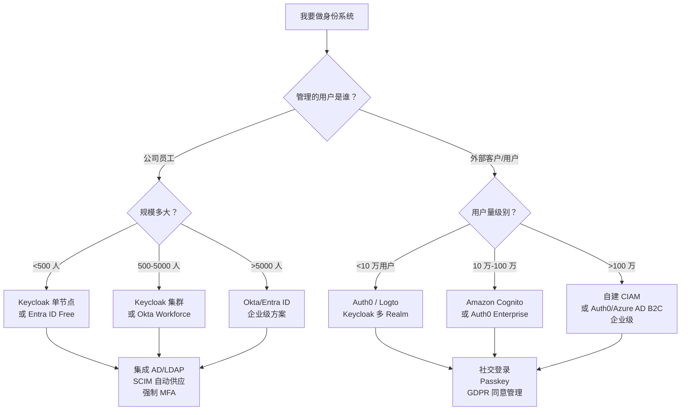

## 为什么需要区分两种 IAM？

很多团队第一次接触身份系统时，会默认「IAM 就是管账号的」——不管这个账号是员工、合作伙伴还是终端用户。但真正上手后很快发现：**员工身份管理（Workforce IAM）和客户身份管理（CIAM，Customer IAM）面对的需求几乎完全不同**。把 CIAM 需求硬塞进为员工设计的 IAM 系统，会踩遍从性能瓶颈到隐私合规的所有坑。

这篇文章把两种 IAM 的差异讲透：它们分别解决什么问题、架构上有什么不同、如何选型和迁移。

## 两种 IAM 的定义

| 维度 | Workforce IAM（员工身份） | CIAM（客户身份） |
|------|--------------------------|-------------------|
| **管理对象** | 员工、承包商、合作伙伴 | 终端用户、消费者、客户 |
| **身份来源** | HR 系统（入职 → 创建账号） | 用户自助注册（注册 → 创建账号） |
| **账号规模** | 通常数百到数万 | 数百万到数亿 |
| **生命周期** | 入职 → 调岗 → 离职（Joiner-Mover-Leaver） | 注册 → 活跃 → 沉默 → 注销 |
| **认证方式** | 企业 SSO + MFA（强制） | 社交登录 + 密码 + Passkey（可选） |
| **权限模型** | RBAC + 组织架构映射 | 自助权限 + 细粒度资源控制 |
| **合规要求** | 等保/SOC2/ISO 27001 审计 | GDPR/CCPA 隐私合规、同意管理 |
| **性能特征** | 低频（早 9 点登录峰值） | 高频（持续的注册登录、Token 刷新） |
| **用户体验** | 功能至上（内部工具，可用就行） | 体验至上（流失 = 收入损失） |
| **典型产品** | Okta Workforce、Azure AD/Entra ID、Keycloak | Auth0、Amazon Cognito、Logto、Keycloak（可配置） |

两种 IAM 的差异根植于一个事实：**员工用 IAM 是因为公司要求的，客户用是因为他们想用你的产品**。这个差异决定了所有设计决策。

## 架构差异



**Workforce IAM 的典型数据流**：HR 系统是权威源 → 自动创建/更新/禁用账号 → 同步到下游应用。流程由公司控制，用户没有选择权。

**CIAM 的典型数据流**：用户自助注册是入口 → 用户可以管理自己的资料、同意偏好、删除账号。流程由用户控制，公司必须遵守隐私法规。

## 功能需求对比

### 注册与入职

| 需求 | Workforce IAM | CIAM |
|------|---------------|------|
| 账号创建方式 | 管理员创建 / HR 系统自动同步 | 用户自助注册（邮箱、手机、社交登录） |
| 邀请机制 | IT 发送临时密码 | 邮箱验证链接 / 魔法链接 |
| 批量导入 | CSV/SCIM 批量导入 | 不需要（用户自己注册） |

### 认证

| 需求 | Workforce IAM | CIAM |
|------|---------------|------|
| SSO | 核心需求，企业应用统一登录 | 不需要（客户不关心你的内部应用） |
| MFA | 强制（TOTP/WebAuthn） | 可选，逐步推进（Passkey 是趋势） |
| 社交登录 | 通常不需要 | 核心需求（降低注册摩擦） |
| 无密码 | WebAuthn + 证书 | Passkey + 魔法链接 + 短信验证码 |

### 授权与权限

| 需求 | Workforce IAM | CIAM |
|------|---------------|------|
| 权限模型 | RBAC + 组织角色映射 | 资源级权限 + 自助共享 |
| 管理员指派 | IT 或部门负责人分配角色 | 用户自行管理（如 Google Drive 分享） |
| 细粒度控制 | 按部门/项目/职能分层 | 按用户/资源/操作（ReBAC 更合适） |

### 目录与用户管理

| 需求 | Workforce IAM | CIAM |
|------|---------------|------|
| 用户画像 | 工号、部门、职位、汇报线 | 偏好、行为、消费记录 |
| 数据量级 | 数千到数十万 | 百万到亿级 |
| 数据模型 | 扁平组织树 | 灵活的自定义属性 + 社交图谱 |

### 合规与隐私

| 需求 | Workforce IAM | CIAM |
|------|---------------|------|
| 核心法规 | 等保 2.0、SOX、ISO 27001 | GDPR、CCPA、PIPL |
| 同意管理 | 不需要（雇佣关系） | 必须（用户明确同意数据处理） |
| 数据删除权 | 离职即删（公司决定） | 用户有权请求删除（被遗忘权） |
| 审计要求 | 管理员操作审计、权限变更记录 | 用户同意记录、数据处理目的 |

## 技术选型差异



关键决策点：
- **员工 <500 人 + 已有 AD**：Keycloak 对接 AD 是最经济的方案
- **员工 >5000 人 + 混合办公**：考虑 Okta/Entra ID 的全托管服务，减轻运维压力
- **客户 <10 万 + 快速上线**：Auth0 或 Logto 的免费 tier 足够用
- **客户 >100 万 + 成本敏感**：自建 Keycloak 多 Realm + 外部数据库，但需要投入运维人力

## 混合场景：同时服务员工和客户

现实中最常见的困境是：**公司既有内部员工系统，又有面向客户的产品，身份需求是两套。**

### 方案 A：两套独立系统（推荐）

```
┌──────────────────┐     ┌──────────────────┐
│  Keycloak        │     │  Auth0 / Logto   │
│  (员工身份)      │     │  (客户身份)      │
│  · 对接 AD/LDAP  │     │  · 社交登录      │
│  · 强制 MFA      │     │  · Passkey       │
│  · SCIM 供应     │     │  · GDPR 合规     │
└────────┬─────────┘     └────────┬─────────┘
         │                        │
         ▼                        ▼
    内部应用                  面向客户的应用
```

**优点**：需求明确分离，不会互相污染；出问题影响范围可控。
**缺点**：两套系统需要独立运维；员工访问客户数据时需要额外集成。

### 方案 B：单套系统 + 多 Realm/多租户

用 Keycloak 的不同 Realm 分别管理员工和客户：

| Realm | 用途 | 配置要点 |
|-------|------|---------|
| `employees` | 企业内部员工 | 对接 AD/LDAP、强制 MFA、关闭自助注册 |
| `customers` | 外部客户 | 开启注册、社交登录、GDPR 合规配置 |
| `partners` | 合作伙伴 | B2B SSO、有限权限、访问时效控制 |

**优点**：一套运维体系，降低运维复杂度。
**缺点**：员工和客户的性能要求不同，共享基础设施可能出现资源竞争；CIAM 规模大到一定程度后独立部署更合理。

### 方案 C：OIDC Federation 桥接

用一套 CIAM 系统（如 Logto）面向客户，通过 OIDC Federation 连接到内部的 Keycloak 做员工认证：

```
客户 ──→ Logto（CIAM）──→ 面向客户的应用
                              │
员工 ──→ Keycloak ──→ 内部应用    │ (OIDC Federation)
                └─────────────────┘
```

这种方式适合需要统一 Token 格式但身份源分离的场景。

## 常见误区

### 误区 1：「用 Keycloak 就能同时搞定员工和客户」

Keycloak 确实可以，但默认设计偏向 Workforce IAM。CIAM 场景需要额外处理：高并发注册流程、GDPR 同意管理、用户自助删除账号、密码强度与客户体验的平衡。如果不做这些适配，直接拿 Keycloak 做 CIAM 会在合规和用户体验上出问题。

### 误区 2：「Auth0 比 Keycloak 更好做 CIAM」

Auth0 的 CIAM 能力确实强，但按 MAU（月活用户）计费——100 万 MAU 的价格足够雇一个团队维护 Keycloak。关键不是谁更好，而是你的用户规模和预算决定选谁。

### 误区 3：「CIAM 就是加个注册页面」

CIAM 的核心不是注册，是**用户生命周期的自主管理**：用户要能改资料、删账号、导出数据、管理同意偏好——这些 GDPR/CCPA 的要求不是「加个注册页面」能解决的。

## 常见问题（FAQ）

### Q1：「CIAM 和 IAM 到底是什么关系？」

**IAM 是总称**（身份与访问管理），包含了 Workforce IAM（管员工）和 CIAM（管客户）。就像「交通工具」包含「卡车」和「轿车」——用途不同，但都属于同一大类。

### Q2：「小公司（<50 人）需要区分这两套吗？」

不需要。直接用一个 IdP（Keycloak/Auth0/Logto）同时管员工和早期用户。等客户量级到 10 万+ 或合规需求出现时再拆分。早期过度设计只会拖慢速度。

### Q3：「B2B SaaS 的身份算哪种 IAM？」

典型混合场景。你的直接客户（购买方 IT 管理员）需要企业 SSO 对接（更像 Workforce IAM 的 SAML/OIDC Federation），而客户公司的终端用户需要自助注册（更像 CIAM）。B2B SaaS 的身份层是 CIAM + Federation 的叠加。

### Q4：「等保 2.0 对 CIAM 有什么要求？」

等保 2.0 主要针对企业内部系统（Workforce IAM）。CIAM 场景（面向公众的服务）适用《个人信息保护法》（PIPL）和《数据安全法》，不强制等保定级。但如果客户数据落入内部系统，整套内部系统需要按等保标准保护。

### Q5：「从自建用户表迁移到 CIAM 平台有什么坑？」

最大坑是**密码哈希迁移**——老系统用 MD5/SHA1 哈希，新系统必须在不要求用户重新设置密码的前提下平滑升级。标准做法是：保留老哈希格式标记 → 用户下次登录时用老算法验证 → 通过后用新算法重新哈希存储。Auth0 的 custom database、Keycloak 的 custom User Storage SPI 都支持这种渐进式迁移。

## 参考资料

- [Okta: CIAM vs IAM](https://www.okta.com/customer-identity/ciam-vs-iam/)
- [Auth0: What is CIAM](https://auth0.com/blog/what-is-ciam/)
- [Gartner: Access Management 魔力象限](https://www.gartner.com/en/documents/4020831)
- [Keycloak 多租户实践]()
- [IDaaS 方案全景对比]()
- [Logto 深度介绍]()
- [IAM 架构设计指南]()
- [IAM 基础概念]()
