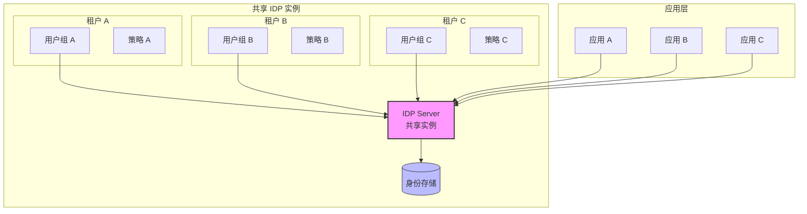
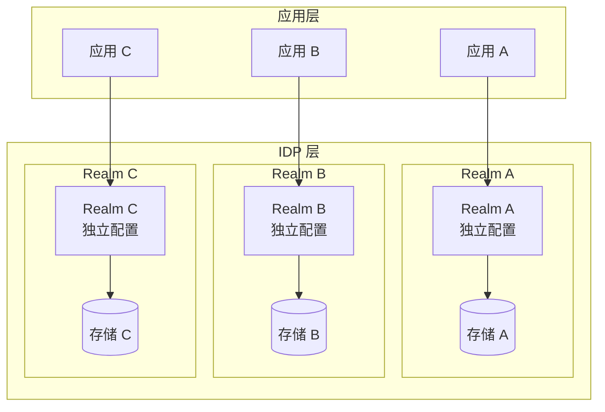
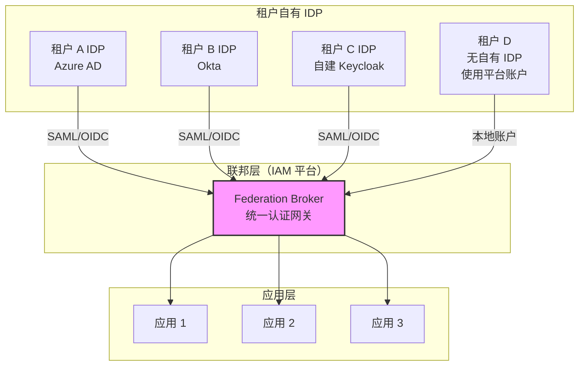
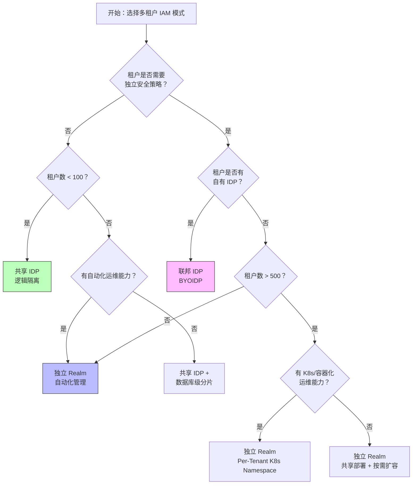

## 多租户 IAM 要解决什么问题

多租户（Multi-Tenancy）是 SaaS 平台和企业 IAM 系统中绕不开的架构命题。核心问题是：

> **在同一个 IAM 系统中，如何安全隔离不同租户（组织/客户/部门）的身份数据，同时保持运维效率和成本可控？**

多租户 IAM 不是简单的"加一个 org_id 字段"，它涉及：
- **数据隔离**：租户 A 的管理员不能看到租户 B 的用户
- **认证隔离**：租户 A 的用户不能登录到租户 B 的应用
- **授权隔离**：租户 A 的权限策略不污染租户 B
- **可观测性隔离**：租户 A 的审计日志不能让租户 B 看到
- **运维效率**：新增一个租户的成本是分钟级还是天级？

关于 IAM 的整体架构设计思路，请参阅 [IAM 架构设计指南]()；IAM 基础概念见 [IAM 基础]()。

## 三种多租户 IAM 隔离模式

### 模式一：共享 IDP + 逻辑隔离

所有租户共享同一个身份提供者（IDP）实例，通过属性/组/组织单元做逻辑区分。



**实现方式**：在 Keycloak 中用同一个 Realm，通过 Group、Role、Attribute 区分租户；在 Auth0/Okta 中用 Organization 特性。

**适用场景**：
- 租户数量和用户规模尚未超过压测、数据库连接池与运维自动化能够稳定承载的范围；“100”只能作为容量评估的起始假设，不能当成产品上限
- 所有租户使用相同的认证策略（同样的 MFA 要求、密码策略、Token 有效期）
- 内部平台或 B2E 场景，不需要面向外部客户的强隔离
- 开发团队规模小，运维自动化程度低

**优点**：
- 运维成本最低，只需维护一套 IDP 实例
- 新增租户是配置操作（创建一个 Group 或 Organization），分钟级完成
- 升级和补丁只需一次操作

**缺点**：
- 隔离强度弱——配置错误可能导致跨租户数据泄漏
- 无法为不同租户定制登录页、MFA 策略、密码复杂度
- 所有租户共享性能资源——一个租户的高负载可能影响其他租户
- 审计日志天然混在一起，需要应用层做过滤

### 模式二：独立 Realm / 独立实例

每个租户拥有独立的 IDP Realm 或完整的 IDP 实例，物理级隔离。



**实现方式**：在 Keycloak 中为每个租户创建一个 Realm；在高隔离要求下，每个 Realm 甚至可以对应独立的数据库 schema 或独立的 Keycloak 实例。

**适用场景**：
- 每个租户需要独立的安全策略，且团队已经能自动化创建、升级、备份和回收 Realm；“100~1000”只是需要专项容量验证的数量级，不是 Keycloak 的通用承诺
- B2B SaaS 平台（一个租户 = 一个外部企业客户）
- 需要为不同租户定制登录页、MFA、密码策略
- 合规要求（如 GDPR 数据驻留）需要物理隔离
- 部分租户有特殊的性能 SLA

**优点**：
- 隔离强度高——一个 Realm 的配置错误不会影响其他 Realm
- 每个租户可以独立定制：登录主题、MFA 策略、Session/Tokens 超时、密码策略
- 性能隔离——一个租户的高负载不会拖垮其他租户
- 可以按租户粒度做备份/恢复/导出

**缺点**：
- 运维成本显著增加——100 个 Realm 意味着 100 套配置要维护
- 新增租户需要创建 Realm、配置客户端、设置策略，自动化要求高
- 升级需要确保所有 Realm 兼容（Keycloak 版本升级可能涉及每个 Realm 的迁移）
- Realm 数量增大后，启动时间、管理操作、缓存占用、数据库连接与配置漂移都可能成为瓶颈；不要把某个 Realm 数字写成通用阈值，应使用目标版本和实际配置做容量测试

> **不要把租户数量表当成产品规格。** Keycloak 的 Realm 共享同一服务进程和数据库，Realm 隔离了配置、用户和会话边界，但不会自动提供独立的计算、数据库或故障域。创建 200 个 Realm 是否可接受，取决于用户量、客户端/身份联邦配置、登录峰值、数据库连接池、缓存和管理自动化，而不是 200 这个数字本身。生产前至少记录：启动/滚动升级耗时、登录 P95/P99、数据库 CPU 与连接数、缓存命中率、单租户噪声对其他租户的影响，以及单 Realm 导出/恢复耗时。

### 模式三：联邦 IDP + 租户自带身份

每个租户可能已有自己的 IDP（企业内部 AD/LDAP、Azure AD、Okta 等），IAM 平台作为联邦层，桥接多个上游 IDP。



**实现方式**：Keycloak Identity Provider Broker、Dex、Pomerium 等作为联邦层，将不同上游 IDP 的认证结果统一转换为下游应用识别的 Token。

**适用场景**：
- 大型企业 / 集团，各子公司已有自己的 IDP
- B2B 平台，客户希望使用自己企业的 SSO（"Bring Your Own IDP"）
- 并购场景——需要快速整合被收购公司的身份系统
- 政府 / 跨组织协作，各方坚持使用自己的身份源

**优点**：
- 最大灵活性——租户保留对自己 IDP 的完全控制权
- 符合企业安全策略——租户不需要在外部平台创建账户
- 减少用户管理摩擦——租户用自己熟悉的账号密码登录

**缺点**：
- 联邦层成了新的单点——联邦网关不可用时所有租户都无法登录
- 调试复杂度高——一个登录失败可能涉及用户→上游IDP→联邦层→下游应用四跳
- 租户 IDP 的配置变更可能导致集成断裂（例如证书过期、端点变更）
- Token 转换可能丢失信息——上游 IDP 的 claims 不一定完整映射到下游

## 三模式对比一览

| 维度 | 共享 IDP | 独立 Realm | 联邦 IDP |
|------|---------|-----------|---------|
| **隔离强度** | 低（逻辑隔离） | 高（物理/逻辑隔离） | 高（各自独立 IDP） |
| **运维成本** | 低 | 中-高 | 中（联邦层需维护） |
| **新增租户速度** | 分钟级 | 分钟-小时级（自动化） | 天级（需协调客户 IDP） |
| **策略定制** | 受限 | 完全灵活 | 依赖上游 IDP 能力 |
| **性能隔离** | 无 | 可配置 | 天然隔离 |
| **合规支持** | 弱 | 强（可按 Realm 部署） | 强（数据不经过平台） |
| **适合租户数** | 由隔离需求和压测决定 | 由 Realm 运维自动化和容量测试决定 | 由上游 IdP 数量、联邦运维能力和故障预算决定 |
| **典型场景** | 内部平台、B2E | B2B SaaS、多客户 | 企业集团、BYOIDP |

## 多租户 IAM 选型决策树



**关键决策因素**：

1. **租户数量是最重要的分水岭**：< 100 个租户，共享 IDP 通常够用；100~1000 个，独立 Realm 是主流；> 1000 个，需要考虑 Realm 的管理自动化甚至自研路由层
2. **安全/合规要求是硬约束**：只要有一个租户有 GDPR 数据驻留要求，就必须走独立 Realm 或联邦模式
3. **运维能力决定天花板**：独立 Realm 模式的"自动化新增 Realm"流程如果没做好，新增租户的周期会从分钟级变成天级

## Keycloak 多租户实战要点

Keycloak 原生支持上述三种模式，以下是生产实践中的关键经验。

### 模式一落地：共享 Realm + Group 隔离

```yaml
# 租户通过 Group 区分
# /Tenant-A/users/  → 租户 A 的用户
# /Tenant-B/users/  → 租户 B 的用户
# 每个租户的 Client 可以配置不同的 Scope 和 Mapper

# 关键配置：Client Scope 中的 Group Membership Mapper
# 确保 Token 中包含 group 信息，下游应用据此做权限判断
```

**注意事项**：
- 必须严格限制租户管理员的 Group 管理权限，防止越权
- 审计日志中必须带上 group/tenant 维度，否则排查问题会非常痛苦
- 不要用 Realm Role 做租户隔离——Role 是跨 Group 的

### 模式二落地：Per-Tenant Realm

Keycloak 26 中，每个 Realm 是独立的配置域。自动化新增 Realm 的典型流程：

1. 通过 Keycloak Admin REST API 创建 Realm（`POST /admin/realms`）
2. 复制一份基础配置（Base Realm Partial Import）：必需的 Client、Scope、Mapper
3. 配置租户特定的 IdP（如果租户用 LDAP/AD）、自定义登录主题
4. 创建初始管理员账户，发送激活邮件

```bash
# 获取 Master Realm 的 admin token
ADMIN_TOKEN=$(curl -s -X POST "https://idp.example.com/realms/master/protocol/openid-connect/token" \
  -d "client_id=admin-cli" -d "username=admin" -d "password=$ADMIN_PWD" \
  -d "grant_type=password" | jq -r '.access_token')

# 创建新 Realm
curl -X POST "https://idp.example.com/admin/realms" \
  -H "Authorization: Bearer $ADMIN_TOKEN" \
  -H "Content-Type: application/json" \
  -d '{"realm": "tenant-acme-corp", "enabled": true}'
```

**生产注意事项**：
- Keycloak 在 1000+ Realm 时需注意 JVM 堆内存和 Infinispan 缓存配置，参见 [Keycloak 集群缓存调优]()
- 定期清理不再使用的 Realm，避免配置膨胀
- 考虑 Realm 的数据库连接池独立配置（Keycloak 默认按 Realm 分配连接）

### 模式三落地：Keycloak Identity Provider Broker

在 Keycloak 中为每个租户创建一个 Identity Provider：

1. `Identity Providers` → `Add provider` → 选择 `SAML v2.0` 或 `OpenID Connect v1.0`
2. 配置租户的 IDP metadata URL 或手动输入端点
3. 配置 `mappers` 做属性映射（租户 IDP 的 group → Keycloak 的 group）
4. 在 Client 的 Authentication Flow 中把该 IdP 设为可选项

关于 OIDC 协议实现的详细原理，参见 [OpenID Connect 深入解析]()。

## 常见误区

**误区 1：「共享 IDP 不安全，必须独立 Realm」**
事实：10 个以内租户的 B2B SaaS，共享 IDP + 严格的 Group 权限控制完全可以满足安全需求。过度隔离带来的运维成本可能远超安全收益。

**误区 2：「多租户 = 多 Realm，一个租户一个 Realm」**
事实：如果 80% 的租户都是 50 人以下的小团队，每个都建 Realm 是资源浪费。可以考虑混合模式——大客户独立 Realm，小客户共享 Realm+Group 隔离。

**误区 3：「联邦 IDP 是万能解」**
事实：BYOIDP 的调试成本极高。租户 IDP 配置错误、证书过期、SAML metadata 变更、OIDC discovery endpoint 不可达，每一个都会导致该租户所有用户无法登录。联邦层需要做好超时、降级和告警。

## 多租户 IAM FAQ

**Q: 多租户 IAM 和 RBAC 是什么关系？**
A: RBAC（基于角色的访问控制）是授权模型，决定"谁能访问什么"；多租户是架构模式，决定"谁的数据和谁隔离"。多租户 IAM 架构内部仍然使用 RBAC（或 ABAC/ReBAC）做权限管理。详请见 [IAM RBAC、ABAC、ReBAC 授权模型对比]()。

**Q: Keycloak 每个 Realm 的资源开销有多大？**
A: 一个空 Realm 约占用 5-10MB 内存和少量数据库记录。主要开销来自 Realm 内的 User/Session/Client 数量。1000 个轻度使用的 Realm 和一个有 10 万用户的单 Realm 相比，前者在 Infinispan 缓存上的开销更大。Keycloak 26 的 Infinispan 15 对此有明显改善，详见 [Keycloak 高可用集群部署]()。

**Q: 如何实现多租户的审计日志隔离？**
A: 在 Keycloak 中，审计事件（`Event`）天然包含 `realmId`，如果使用共享 Realm+Group 模式，需要通过自定义 Event Listener 在事件中注入 group/tenant 信息。下游日志系统（如 ELK/Loki）按 tenantId 做索引分区。

**Q: 多租户 SSO 如何实现？不同租户的用户可以互访吗？**
A: 标准做法是**不允许**跨租户 SSO——每个租户的 session 绑定在自己的 Realm/Group 内。但如果业务上需要（例如集团内跨子公司访问），可以通过身份联邦 + Token Exchange 实现，详见 [身份联邦与代理]()。

**Q: 多租户 IAM 的数据库应该怎么设计？**
A: 三种方式：(1) 共享数据库 + 共享表（tenant_id 字段过滤）——最低成本，最低隔离；(2) 共享数据库 + 独立 schema（每个租户一个 schema）——中等成本，中等隔离；(3) 独立数据库——最高成本，最高隔离。Keycloak 支持共享数据库 + 共享表（默认模式），也支持通过配置 JDBC 连接实现 schema 级隔离。生产环境数据库配置见 [Keycloak PostgreSQL 生产数据库配置]()。

## 总结

多租户 IAM 没有银弹。选择取决于三个核心约束：
1. **租户规模**决定了隔离的最低要求
2. **合规需求**决定了隔离的上限
3. **运维能力**决定了你能驾驭的复杂度上限

从共享 IDP 起步，在租户数突破 100、出现差异化策略需求时切换到独立 Realm，在遇到 BYOIDP 客户时引入联邦层——这是最常见的安全增长路径。
