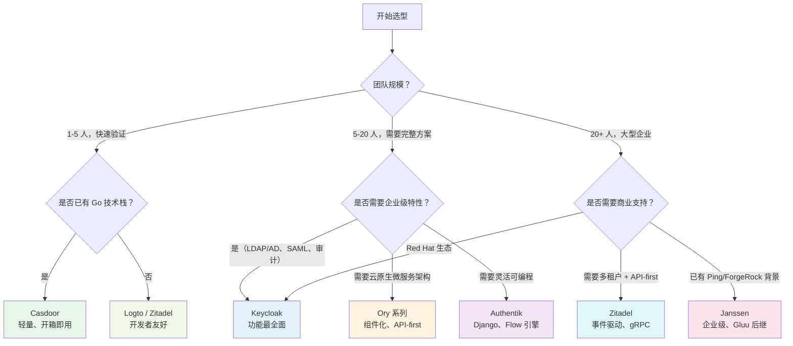

## 开源 IAM 选型为什么难

开源 IAM 生态在过去五年爆发式增长：Keycloak 被 Red Hat 收购后持续迭代，Casdoor 在中文社区快速崛起，Zitadel 和 Authentik 以现代架构吸引新一代团队，Ory 则以云原生组件化思路切入。但选择越多，决策越难。

选错 IAM 的代价比选错一个普通中间件大得多——IAM 是**所有应用的入口**，换 IAM 意味着所有应用重新对接、用户重新迁移、Token 格式重新适配。这不是换个库、改几行代码的事。

本章不重复每个 IAM 产品的功能细节（这些在[第四部分：实现与实践]()的各产品深度解读中有完整阐述），而是聚焦于**决策框架**：你的团队规模、技术栈、合规要求和业务场景下，哪个开源 IAM 最合适。

> **阅读建议**：如果你刚接触 IAM 选型，建议先阅读 [IAM 架构设计指南]() 了解整体架构考量，再回来看具体产品对比。如果你关注的是认证协议层面（OAuth 2.0 vs OIDC vs SAML）的选择，请参阅 [IAM 认证协议选型指南]()。

## 选型决策树



> 这个决策树是**起点而非终点**。每个团队的具体约束——现有技术栈、合规要求、运维能力、预算——都会影响最终选择。下面展开每个维度的详细对比。

## 核心产品对比矩阵

| 维度 | Keycloak | Casdoor | Zitadel | Authentik | Ory | Dex | CAS |
|------|----------|---------|---------|-----------|-----|-----|-----|
| **语言** | Java (Quarkus) | Go + React | Go + Angular | Python (Django) | Go | Go | Java |
| **许可证** | Apache 2.0 | Apache 2.0 | Apache 2.0 | MIT | Apache 2.0 | Apache 2.0 | Apache 2.0 |
| **OIDC** | ✅ 完整 | ✅ | ✅ | ✅ | ✅ (Hydra) | ✅ 核心能力 | ✅ (via plugin) |
| **SAML 2.0** | ✅ | ✅ | ❌ | ✅ | ❌ | ✅ (核心能力) | ✅ 核心 |
| **LDAP/AD** | ✅ 内置 | ✅ | ❌ | ✅ | ❌ | ✅ (LDAP connector) | ✅ 内置 |
| **SCIM** | ✅ (插件) | ✅ | ❌ | ✅ | ❌ | ❌ | ❌ |
| **多租户** | ✅ (Realm) | ✅ (Organization) | ✅ 一等公民 | ✅ (Tenant) | ❌ (需自建) | ❌ | ❌ |
| **Passkey/WebAuthn** | ✅ | ✅ | ✅ | ✅ | ❌ (Kratos 支持) | ❌ | ✅ (via plugin) |
| **授权模型** | RBAC + ABAC + UMA | RBAC + Casbin | RBAC + IAM Policy | RBAC + 表达式 | RBAC + ReBAC (Keto) | ❌ (纯认证) | RBAC + ABAC |
| **部署复杂度** | 中（需 JVM） | 低（单二进制） | 中（PostgreSQL + CockroachDB 可选） | 中（Django 栈） | 高（多组件协同） | 低（单二进制） | 中-高 |
| **中文支持** | ⚠️ 翻译生硬 | ✅ 原生中文 | ❌ 英文为主 | ⚠️ 社区翻译 | ❌ 英文 | ❌ 英文 | ❌ 英文 |
| **社区活跃度** | ⭐⭐⭐⭐⭐ | ⭐⭐⭐ | ⭐⭐⭐⭐ | ⭐⭐⭐ | ⭐⭐⭐⭐ | ⭐⭐⭐ | ⭐⭐⭐⭐ |
| **生产成熟度** | ⭐⭐⭐⭐⭐ | ⭐⭐⭐ | ⭐⭐⭐ | ⭐⭐⭐ | ⭐⭐⭐⭐ | ⭐⭐⭐⭐ | ⭐⭐⭐⭐⭐ |
| **学习曲线** | 陡峭 | 平缓 | 中等 | 中等 | 陡峭 | 平缓 | 陡峭 |
| **典型用户规模** | 中大型企业 | 中小团队 | 中型企业 | 中型企业 | 中大型企业 | 中型企业 | 大型企业/高校 |

> 📖 每个产品的架构细节与部署方案参见各自的深度解读页：
> [Keycloak 架构深度解析]() ·
> [Casdoor 深度解读]() ·
> [Zitadel 深度解读]() ·
> [Authentik 深度解读]() ·
> [Ory 开源身份栈]() ·
> [Dex 联合身份]() ·
> [Apereo CAS]()

## 场景推荐

### 场景一：「我要给内部系统加 SSO，技术栈是 Go/K8s」

**首选 Casdoor**。单二进制部署、原生中文、OIDC + SAML 双协议、内置 Web UI 管理后台。如果你的应用已经用 Go 写，Casdoor 的 Go SDK 集成最自然。如果团队不喜欢 Casdoor 的 UI 风格，备选 **Zitadel**（更现代的 API-first 设计，但无 SAML）。

### 场景二：「公司有 AD/LDAP，需要对接后统一做 SSO」

**首选 Keycloak**。Keycloak 的 User Federation 机制可以对接任意 LDAP/AD，支持双向同步、密码策略继承、Kerberos 票据。Apereo CAS 也支持 LDAP/AD，但配置复杂度高出一个量级——除非你已经在用 CAS 生态，否则不推荐为此专门引入。

### 场景三：「我们是 SaaS 多租户，每个租户需要独立登录页和品牌」

**首选 Zitadel**。多租户（Organization）是 Zitadel 的一等公民——每个 Organization 可以有独立的域名、SSO 配置、登录页品牌（Logo、颜色、自定义 CSS），且通过 gRPC API 完全自动化。Keycloak 的 Realm 也支持多租户，但 Realm 之间的隔离天然是「硬隔离」，管理大量租户时运维成本更高。详见 [多租户 IAM 架构设计]() 中的三种隔离模式对比。

### 场景四：「我们需要极端灵活的策略引擎——不只是 RBAC」

**首选 Ory Keto + Hydra + Kratos 组合**。Ory 的 ReBAC（基于关系的访问控制）是 Google Zanzibar 的开源实现，适合社交图谱、文档协作、多层级组织等关系密集的授权场景。但代价是部署和运维复杂度高——三个组件需要独立部署、配置和监控。如果你只需要 RBAC + 表达式策略，**Authentik** 的 Flow 引擎更易上手。更多授权模型对比见 [IAM RBAC、ABAC、ReBAC 授权模型对比]()。

### 场景五：「我们只有认证需求，不需要授权和用户管理——只做身份联邦」

**首选 Dex**。Dex 的设计哲学是「只做一件事」——作为 OpenID Connect Identity Provider，连接上游 IdP（LDAP、SAML、GitHub、GitLab、Microsoft、Google 等），向下游应用提供统一的 OIDC 身份。如果你已经有 Kubernetes 集群，Dex + Kubernetes API Server OIDC 是最常见的组合。Keycloak 当然也能做身份联邦，但如果你不需要用户自注册、角色管理、管理控制台这些功能，Dex 的单二进制 + 静态 YAML 配置更轻。

### 场景六：「我是高校/科研机构，需要 SAML 联邦 + CAS 协议」

**首选 Apereo CAS**。CAS 协议在高校/学术网络中拥有最广泛的部署基础，Apereo CAS 同时支持 CAS、SAML 2.0、OIDC、OAuth 2.0 四种协议，且有 Apereo 基金会背书。但要注意：CAS 是现存最复杂的 IAM 项目之一（配置项数量不亚于 Keycloak），不建议团队少于 5 人时自建。

### 如果还是拿不定主意

| 你的情况 | 建议 |
|---------|------|
| 不确定选哪个，想先试试 | **Keycloak**——功能最全、文档最多、社区最活跃，即使最终不用，学到的 IAM 概念也都通用 |
| 要快速出活、中文社区支持 | **Casdoor**——部署 5 分钟、原生中文、中文 Discord/微信群活跃 |
| 追求技术先进性、API 驱动 | **Zitadel**——事件溯源架构、gRPC API、多租户一等公民 |
| 已有 Kubernetes 且只做身份联邦 | **Dex**——配置一个 YAML 就是生产就绪的 OIDC Provider |

## 快速部署体验

如果你只是想快速体验各产品的功能，以下是 Docker 一键启动命令（不要用于生产）：

```bash
# Keycloak
docker run -p 8080:8080 -e KC_BOOTSTRAP_ADMIN_USERNAME=admin -e KC_BOOTSTRAP_ADMIN_PASSWORD=admin \
  quay.io/keycloak/keycloak:26.1 start-dev

# Casdoor
docker run -p 8000:8000 casbin/casdoor:latest

# Zitadel
docker run -p 8080:8080 ghcr.io/zitadel/zitadel:latest start --masterkey=MasterkeyNeedsToBe32Characters

# Authentik
# 需要 docker-compose，建议参考官方文档: https://goauthentik.io/docs/installation/docker-compose

# Dex (示例配置见官方仓库 examples/)
docker run -p 5556:5556 dexidp/dex:latest dex serve /etc/dex/config.yaml
```

> ⚠️ 以上命令仅用于本地体验。生产环境部署请参考各产品的深度解读页或 [Kubernetes 生产部署]()。

## 常见误区

| 误区 | 事实 |
|------|------|
| 「OIDC 就够，不需要 SAML」 | 如果你的用户来自传统企业（银行、保险、政府），他们 90% 会要求 SAML。OIDC 在现代应用中是主流，但 SAML 在企业端短期内不会消失 |
| 「Keycloak 太重了，用轻量方案更好」 | Keycloak 的「重」在于功能全面——如果这些功能你确实用不到，选轻量方案合理。但很多团队初期觉得「我们只需要 SSO」，半年后开始要 RBAC、要 LDAP、要审计日志——这时候再迁到 Keycloak 的成本远高于一开始就用它 |
| 「开源 IAM 没有商业支持就可以」 | 如果你的公司有等保/ISO 27001/SOC 2 合规要求，先确认 IAM 方案是否在审计范围内、是否有对应的合规文档。部分场景下，开源 + 内部运维的合规成本可能高于购买 SaaS（如 Okta/Auth0） |
| 「多租户 = 多 Realm」 | Keycloak 的 Realm 之间是硬隔离——每个 Realm 有独立的用户、角色、Client、Session。但如果租户数量达到几百甚至上千，Realm 的运维成本（升级、备份、监控）会线性增长。此时 Zitadel 的单实例多 Organization 模式或自建租户路由层可能更合适 |

## IAM 开源方案 FAQ

### Q1：开源 IAM 和商业 IAM 到底差在哪？

商业 IAM（Okta、Auth0、Entra ID）的核心价值不是协议支持——OAuth 2.0 和 OIDC 开源实现已经非常成熟——而是**运维托管 + 合规认证 + SLA**。你不会因为 Keycloak 不支持 OIDC 而选 Okta，而是因为你不想维护 Keycloak 集群、不想自己做等保审计、不想半夜接到「SSO 挂了」的电话。如果你的团队有 2 名以上 SRE 可以投入 IAM 运维，开源方案完全可行；如果你只有一个全栈工程师同时写业务代码和管 IAM，商业 SaaS 可能更划算。

### Q2：Keycloak、Casdoor、Zitadel、Authentik 到底怎么选？

没有最好的 IAM，只有最合适的 IAM。参见上方的[决策树](#选型决策树)和[对比矩阵](#核心产品对比矩阵)。最推荐的验证方法：用 Docker 把两个候选方案都跑起来，分别对接你业务的第一个应用，看谁的配置更直观、文档更清晰、问题更少。花一天时间做 POC，比花一周看文档更有价值。

### Q3：我用的开源 IAM 停更了怎么办？

IAM 的迁移成本和数据库迁移不是一个量级——因为涉及所有下游应用的重新对接和用户密码哈希/Token 格式的转换。如果你当前用的方案已经明显停更或社区萎缩，**不要在同一个方案上继续投入**。建议的迁移策略：
1. 先在新 IAM 上完成配置（Realm/Client/Role/用户来源对接）
2. 新应用直接对接新 IAM
3. 旧应用逐个迁移，通过[身份联邦]()让旧 IAM 作为新 IAM 的上游 IdP，降低割接风险
4. 所有应用迁移完毕后下线旧 IAM

### Q4：多团队共用 IAM，怎么避免互相影响？

这取决于你选的 IAM 方案的多租户能力。Keycloak 用 Realm 做硬隔离——每个团队一个 Realm，互不干扰。Zitadel 用 Organization 做逻辑隔离——单实例多租户。如果你选的是 Dex（无多租户能力），需要部署多个 Dex 实例。无论哪种方案，都建议：**每个团队/业务的 Client 凭证和应用配置独立管理**，避免一个团队的配置变更影响其他团队。

### Q5：IAM 的性能瓶颈在哪？

不同 IAM 方案的瓶颈点不同：
- **Keycloak**：数据库连接池和 Infinispan 缓存配置。高并发下 Session 写入是主要瓶颈——部署 User Session 持久化（JDBC-PING）或 Infinispan 集群方案可缓解
- **Casdoor**：单机 MySQL/PostgreSQL 是天花板。Casdoor 无内置分布式缓存，高并发下需在 IDP 前加负载均衡 + 多副本 + 共享数据库
- **Ory Hydra**：OAuth 2.0 Token 签发是 CPU 密集型，但 Hydra 本身是无状态的——瓶颈通常在背后数据库（PostgreSQL/CockroachDB）

性能优化不在本章重点展开，详见各产品深度解读页和 [IAM 高可用与性能扩展]()。

## 下一步

- 选定方案后，先读对应产品的深度解读页（上方已列出）
- 如果涉及 Kubernetes 部署，见 [Kubernetes 生产部署]()
- 如果你需要 Keycloak 的具体落地实践，见 [Keycloak 实战指南]()和[解决方案博客]()
- 如果你关注的是认证协议选型，见 [IAM 认证协议选型指南]()
