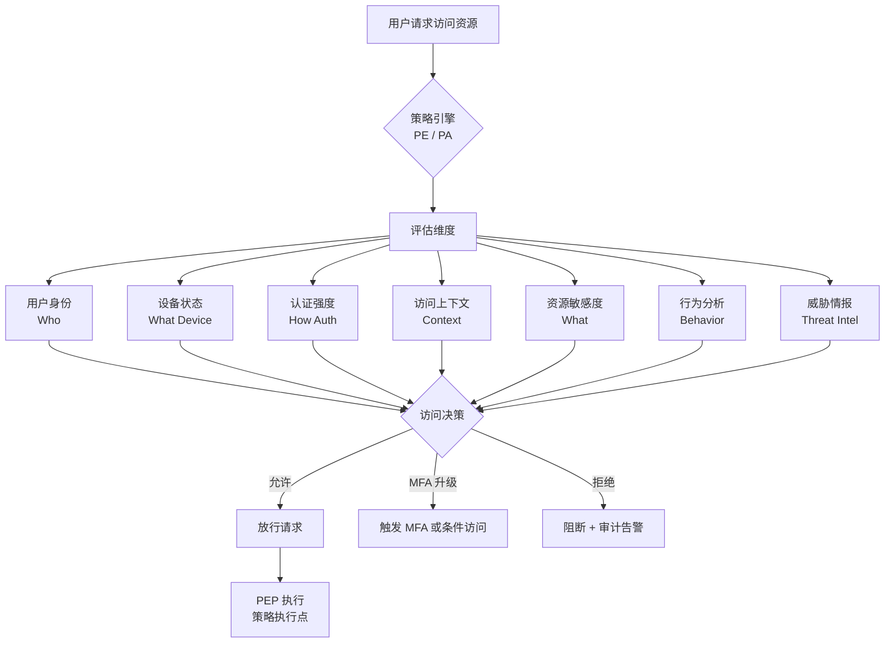
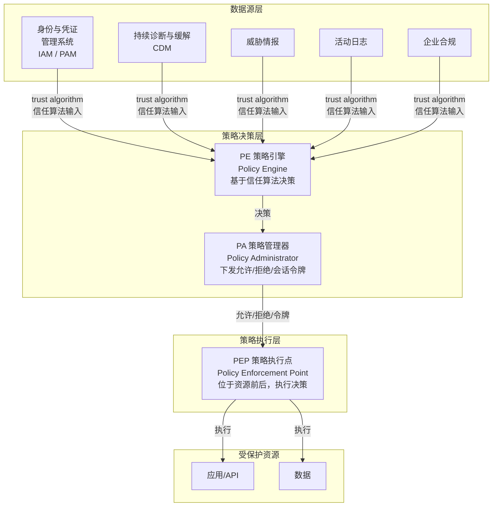
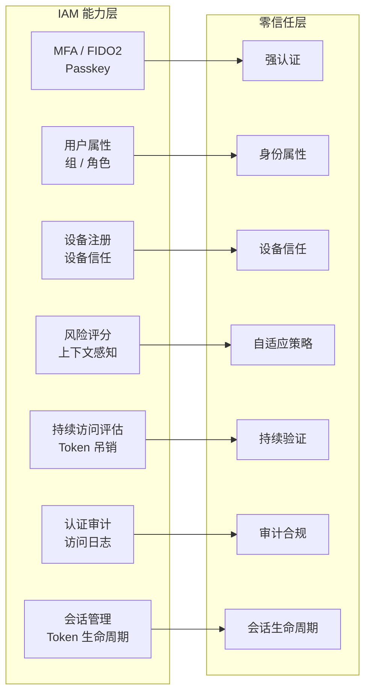

## 24.1 从城堡到零信任

### 传统安全模型：城堡与护城河

```
                      防火墙
           ┌───────────────────────┐
           │     内网（安全）       │
           │  [应用] [数据库] [文件] │
  ┌───┐   │                       │
  │员工│──→│  VPN 接入              │
  └───┘   └───────────────────────┘
                      ×
                 外网 = 不安全

问题：
- 一旦进入内网，几乎可以为所欲为
- VPN 凭据泄露 = 整个网络沦陷
- 边界越来越模糊（SaaS、远程办公、多云）
```

### 零信任核心原则

> "永远不信任，始终验证"（Never Trust, Always Verify）
>
> （这一口号源自 John Kindervag / Forrester 2010 的零信任早期表述；NIST SP 800-207 将其具化为：不基于网络位置给予隐式信任、显式验证、最小权限、假设已沦陷等原则。）

零信任不是一种产品，而是一种安全架构理念。在 IAM（身份与访问管理）体系中，零信任将"身份"提升为安全决策的核心依据——这与传统 IAM 以"认证通过后放行"的模式有根本区别。IAM 架构的整体设计思路可参考 [IAM 架构设计指南]()。

| 传统安全 | 零信任安全 |
|---------|-----------|
| 信任但验证 | 从不信任，始终验证 |
| 基于位置（内网=安全） | 基于身份和上下文 |
| 一次性认证 | 持续评估 |
| 网络分段 | 微隔离 |
| 边界防御 | 假设边界已被攻破 |

## 24.2 身份：零信任 IAM 的基石

在零信任架构中，身份取代 IP 地址成为新的安全边界。IAM 系统不再是"登录后就完成任务"的旁路组件，而是持续参与每一次访问决策的核心引擎：

```
传统访问决策：                    零信任访问决策：

请求来自 10.0.0.5？             请求者是谁？
↓ Yes → 允许                     ↓ 张三，工程师，Android设备
                                状态：通过 MFA，设备合规
                                ↓ 访问策略：允许读取，拒绝写入
                                ↓ 允许
```

### 身份驱动的零信任决策流



图中每个评估维度都对应 IAM 系统中的具体能力：
- **用户身份**：IAM 用户生命周期、身份联邦
- **设备状态**：MDM/UEM 集成、设备合规检查
- **认证强度**：MFA、FIDO2/Passkey、自适应认证
- **访问上下文**：时间、地理位置、网络环境
- **行为分析**：UEBA、异常登录检测

## 24.3 零信任的核心技术支柱

### 支柱一：强身份认证

- MFA 是基线（不是可选项）
- 优先使用 FIDO2/WebAuthn（抗钓鱼）
- 自适应认证根据风险调整强度
- 设备健康认证（设备指纹 + MDM 状态）

### 支柱二：最小权限访问

- 默认拒绝
- 即时访问（JIT）：需要时临时授予，用完即回收
- 权限定期审查
- 网络微隔离（应用间也做认证）

权限模型的选择直接影响零信任的落地效果，RBAC、ABAC、ReBAC 各有适用场景，详见 [IAM 授权模型对比]()。

### 支柱三：持续验证

- 不是"登录一次，永远信任"
- 持续评估访问会话的安全性
- 风险变化时主动吊销 Session/Token
- 异常行为检测

IAM 会话管理是实现持续验证的关键机制，包括 Token 刷新、吊销和会话生命周期控制，详见 [IAM 会话管理]()。

### 支柱四：加密无处不在

- 数据在任何地方都加密（传输中、存储中、使用中）
- mTLS 用于服务间通信
- 密钥管理和轮换自动化

## 24.4 零信任 IAM 架构参考模型

### NIST SP 800-207 架构模型

NIST SP 800-207（2020-08）定义的零信任架构（ZTA）核心逻辑组件为 **PE / PA / PEP**（注意：NIST 用的是 PE/PA/PEP，而非 XACML 的 PDP/PEP/PIP 术语，二者概念相通但术语不同，不应混用）：



- **PE**（Policy Engine，策略引擎）：基于信任算法与各数据源做出访问决策
- **PA**（Policy Administrator，策略管理器）：依据 PE 的决策向 PEP 下发允许/拒绝命令或会话令牌
- **PEP**（Policy Enforcement Point，策略执行点）：位于资源前后，执行访问决策
- **数据源**：身份与凭证管理系统、CDM（持续诊断与缓解）、威胁情报、活动日志、企业合规等（承担 XACML 中 PIP 的角色）

### Google BeyondCorp

Google 的零信任实现（BeyondCorp，2014–2017 系列论文）：

- 不再依赖内网 VPN
- 通过访问代理（Access Proxy，PEP）在公共网络上以用户与设备身份做访问决策，全程加密
- 基于设备和用户身份的访问控制

### 云原生零信任

在 Kubernetes 环境中的零信任实践：

```
[Ingress Gateway]
       │
       ▼
[Service Mesh (Istio/Linkerd)]
  ├── mTLS 自动加密
  ├── 基于身份的授权策略
  └── 流量监控
       │
       ▼
[工作负载（Pod）]
```

## 24.5 IAM 与零信任的交汇

IDaaS / IAM 是零信任架构中的核心"身份系统"。以下是 IAM 各能力在零信任各环节中的映射：



| 零信任需求 | IDaaS / IAM 提供的能力 | 典型实现 |
|-----------|----------------------|---------|
| 强认证 | MFA、FIDO2、Passkey | Keycloak WebAuthn / 自定义 SPI |
| 身份属性 | 用户属性、组、角色 | LDAP Federation / SCIM 同步 |
| 设备信任 | 设备注册、设备属性 | Keycloak Device Representation |
| 自适应策略 | 风险评分、上下文感知 | Keycloak Authenticator SPI / 外部 CIEM |
| 持续验证 | CAE、Token 吊销 | Session 管理 / Token Introspection |
| 审计追踪 | 认证审计、访问日志 | Event Listener SPI / SIEM 对接 |

## 24.6 实施路线图

零信任是一个旅程，不是一次项目：

### 阶段 1：基础（0-6 个月）

- 部署 MFA（所有用户，优先管理员）
- 盘点所有身份和资产
- 建立基础的设备清单

### 阶段 2：增强（6-18 个月）

- 实现 SSO，减少密码使用
- 部署设备信任（MDM 集成）
- 网络微隔离
- 开始身份审计

### 阶段 3：成熟（18-36 个月）

- 实现自适应认证
- 持续访问评估
- 自动化权限管理（JIT Access）
- 全面的审计和异常检测
- 数据分类和标签

### 阶段 4：优化（36 个月+）

- AI/ML 驱动的异常检测
- 自动化的策略优化
- 无密码认证
- 全链路身份可视化

## 24.7 常见误区

1. **买一个"零信任产品"就实现了零信任**：零信任是架构理念，不是单一产品。IAM 系统是零信任的核心组件，但零信任还需要网络、端点、数据等多个层面的配合。
2. **实现零信任就不需要边界安全**：纵深防御仍有价值，零信任是增强而非替代。
3. **零信任 = 取消 VPN**：VPN 可以被零信任方案替代，但这是结果而非定义。
4. **零信任会让用户体验变差**：好的实现通过 SSO + 自适应 MFA 实际上改善了体验。
5. **小型企业不需要零信任**：小型企业也是攻击目标，MFA + 最小权限应该普遍采用。
6. **IAM 系统部署完就等于零信任**：IAM 提供了零信任的"身份层"，但还需要策略引擎（PEP/PDP）的集成和持续验证机制的落地。

## 24.8 IAM 零信任 FAQ

**Q1: 零信任 IAM 架构和传统 IAM 架构的核心区别是什么？**

传统 IAM 架构以"一次认证，全程信任"为默认假设——用户登录后获得 Session/Token，在过期前可以持续访问。零信任 IAM 架构要求每次访问都重新评估：即使用户已经登录，如果设备合规状态变化、地理位置异常或行为出现偏差，策略引擎可以要求重新认证或直接阻断访问。简单说：传统 IAM 管"谁能进来"，零信任 IAM 管"每次请求是否还值得信任"。详细架构设计参见 [IAM 架构设计指南]()。

**Q2: 企业 IAM 系统如何落地零信任的持续验证？**

核心机制是缩短信任评估周期。传统模式下 Token 有效期可能设 8 小时，零信任模式下建议：
- Token 有效期缩短到 15-30 分钟，配合 Refresh Token 轮换
- 在 PEP（如 oauth2-proxy、Pomerium、Nginx auth_request）层对每个请求做 Token Introspection
- 集成风险信号（登录地点跳跃、异常设备、暴力破解检测）触发强制 MFA 或会话吊销
- 通过 IAM 审计日志 + SIEM 做行为基线分析，异常时自动干预

**Q3: 零信任 IAM 架构中 Keycloak 能扮演什么角色？**

Keycloak 在零信任 IAM 架构中承担三个核心角色：
1. **身份提供者（IDP）**：提供 OIDC/SAML 认证、MFA、身份联邦——这是零信任架构中"身份数据源"的核心
2. **策略信息点（PIP）**：通过 Token Introspection Endpoint、UserInfo Endpoint 向 PEP/策略引擎提供用户属性、角色、组信息
3. **会话与 Token 管控**：通过 Admin API 实现 Token 吊销、Session 失效、强制重新认证——支撑持续验证机制

Keycloak 不做 PEP（策略执行点），这一层通常由网关/代理（如 oauth2-proxy、Pomerium、Nginx auth_request、Traefik ForwardAuth）或 Service Mesh（Istio AuthorizationPolicy）承担。

**Q4: 零信任 IAM 和等保 2.0 的关系是什么？**

等保 2.0 对身份鉴别、访问控制、安全审计的要求与零信任 IAM 高度契合。例如等保三级要求"采用两种或两种以上组合的鉴别技术"（对应零信任的 MFA）、"对主体、客体进行安全标记"（对应身份属性驱动决策）、"对系统资源访问的申请和授予应进行持续跟踪和监控"（对应持续验证与审计）。将 IAM 系统从"合规需要的认证模块"提升为"零信任架构的核心引擎"，是满足等保要求同时提升安全实质的有效路径。详见 [IAM 等保合规指南]()。

**Q5: 中小企业如何以最低成本启动零信任 IAM？**

不需要一次性购买全部组件。推荐最小可行路径：
1. 部署开源 IAM（如 Keycloak）启用 MFA（TOTP 免费，FIDO2/Passkey 也免费）
2. 将关键应用接入 OIDC SSO，消除独立密码
3. 在应用前放置 oauth2-proxy 或 Nginx auth_request，实现统一认证网关（即简易 PEP）
4. 配置短期 Token + 关键事件审计日志
5. 以此为基线逐步叠加设备信任、自适应策略、SIEM 集成等能力

## 24.9 小结

身份是零信任架构的核心。"不再通过 IP 地址信任一个设备或用户，而是通过强身份认证、最小权限访问、持续验证来确保每一次访问的安全"——这就是从边界安全到身份驱动安全的范式转变。IDaaS 和 IAM 是实现这一转变的关键基础设施：IAM 系统从"认证登录的工具"升级为"每次访问决策的核心输入"。零信任的实施是一场马拉松，不是短跑，但每一步前进都在提升整体安全水位。
