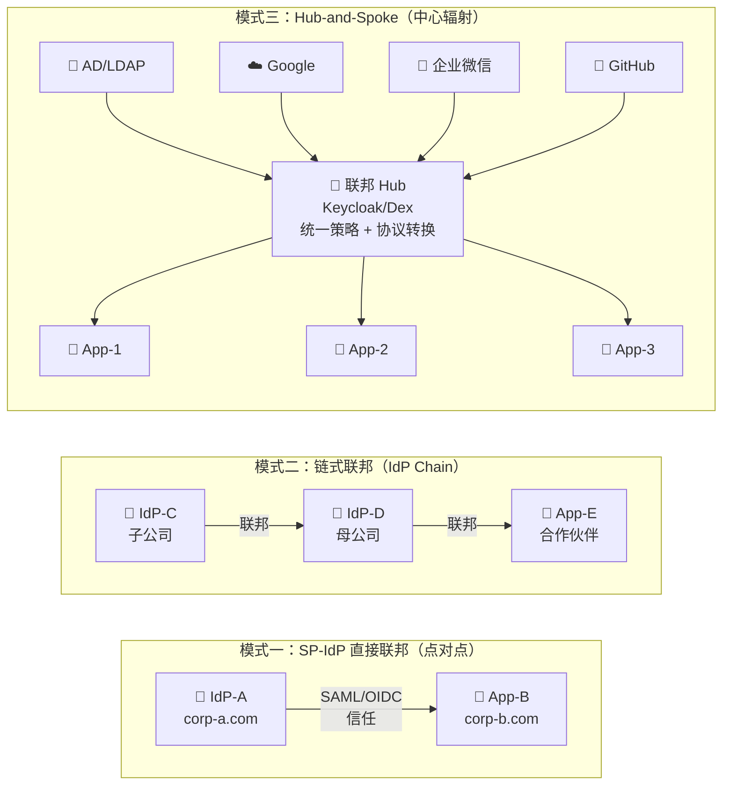

## 12.1 概念辨析

### 身份联邦（Identity Federation）

多个组织或域之间建立信任关系，允许用户在各自的身份域中认证，但可以访问信任域中的资源。

关键特征：**跨组织边界**，**通过信任建立**，**身份数据源分布在多个组织**。

### 身份代理（Identity Broker）

一个中心服务（Broker）作为多个外部 IdP 的前端代理，统一对外提供服务。

关键特征：**中心化**，**一对多**，**身份数据仍在外部 IdP**。

### 身份联合（User Federation）

IDaaS 系统从外部身份源（如 LDAP）导入或实时查询用户。

关键特征：**IDaaS 拉取外部数据**，**用户在外部系统管理**。

## 12.2 身份联邦详解

### IAM 联邦拓扑模式

在企业 IAM 实践中，联邦拓扑决定了身份信任如何在组织间传递。以下是三种核心拓扑及其适用场景：



| 模式 | 结构 | 信任管理 | 适合场景 | 不适合 |
|------|------|---------|---------|--------|
| **点对点** | 两两建立信任关系 | 每对关系独立维护，N 方需 N×(N-1) 条信任链 | 2-3 个组织间的双边合作 | 组织超过 5 个时维护成本爆炸 |
| **链式** | IdP 逐级传递信任 | 沿链路逐级验证，任一环节断裂则下游全部失效 | 母子公司、多层级组织架构 | 需要高可用性的跨域场景 |
| **Hub-and-Spoke** | 所有 IdP/SP 对接中心 Hub | 信任集中在 Hub，Hub 做协议转换和策略统一 | 多 IdP 多应用的企业 IAM，是最常用的生产模式 | Hub 成为单点——需要高可用部署 |

**联邦的信任模型（以点对点为例）：**

```
企业A                               企业B
┌─────────────┐                   ┌─────────────┐
│  员工目录    │                   │  员工目录    │
│  IdP-A      │←─── 信任关系 ────→│  IdP-B      │
│             │                   │             │
│  [App-A1]   │                   │  [App-B1]   │
│  [App-A2]   │                   │  [App-B2]   │
└─────────────┘                   └─────────────┘

企业 A 的员工访问企业 B 的应用时：
1. 用户通过 IdP-A 认证（自己的企业）
2. IdP-A 和 IdP-B 之间存在信任
3. IdP-B 接受 IdP-A 的断言
4. 用户无缝访问 App-B1
```

### SAML 联邦

SAML 是联邦的"第一语言"：

- 多边联邦：如 InCommon（研究教育）、eduGAIN（全球教育联邦）
- 双边联邦：两家公司之间建立 SAML 信任
- 需要交换元数据（Metadata）来建立信任

### OIDC 联邦

**OpenID Federation 1.0 已于 2024 年 12 月由 OpenID Foundation 发布为最终规范（Final Specification）**，定义了通过信任锚（Trust Anchor）与实体声明（Entity Statements）实现的自动化联邦信任模型。其核心机制包括：

- **联邦级发现**（`.well-known/openid-federation`）与**实体声明**、信任链验证（区别于普通 OIDC 单 IdP 发现的 `.well-known/openid-configuration`）
- **显式注册**（手动或动态客户端注册）
- **信任框架**（Trust Framework）——如 Open Banking Brazil、eduGAIN 的 OIDC 化方案

## 12.3 身份代理详解

### 代理架构

```
      ┌──────────────────────────────────┐
      │       Identity Broker            │
      │       (Keycloak / Dex)           │
      │                                  │
      │  ┌────────┐ ┌────────┐ ┌──────┐ │
      │  │AD/LDAP │ │ Google │ │ 微信  │ │
      │  │Provider│ │Provider│ │Provider│ │
      │  └────────┘ └────────┘ └──────┘ │
      │                                  │
      │  统一输出：OIDC / SAML / LDAP     │
      └──────────┬───────────────────────┘
                 │
     ┌───────────┼───────────┐
     ▼           ▼           ▼
  [App1]      [App2]      [App3]
```

身份代理的核心价值：
1. **单一集成点**：应用只需对接代理，代理解耦了复杂的多 IdP 对接
2. **协议转换**：输入是社交登录（OAuth），输出可以是 SAML（给遗留应用）
3. **统一策略**：在代理层实施统一的认证和授权策略

### 用户关联（Account Linking）

当一个用户通过多个 IdP 登录时，代理需要知道这些身份属于同一个人：

```
用户张三：
├── AD 账户：zhangsan@company.com
├── GitHub：github.com/zhangsan
└── 微信：wxid_abc123

代理需要将这些身份关联到一个统一的用户记录。
```

关联策略：
- **自动关联**：通过相同的属性（如邮箱）自动匹配
- **用户确认**：首次使用新 IdP 登录时，要求用户先以现有身份登录进行确认
- **管理员关联**：管理员手动建立关联

### 属性映射

不同 IdP 返回的用户属性千差万别：

| AD/LDAP | Google | GitHub | 统一属性 |
|---------|--------|--------|---------|
| sAMAccountName | name | login | username |
| mail | email | email | email |
| displayName | name | name | fullName |
| memberOf | — | — | groups |
| employeeNumber | — | — | employeeId |

代理需要将每个 IdP 的属性映射到统一的用户模型。好的属性映射设计：
1. 定义清晰的内部属性模型
2. 为每个 IdP 配置映射规则
3. 处理属性冲突（多个 IdP 提供同一属性时用哪个？）
4. 支持表达式/脚本进行复杂转换

## 12.4 Keycloak 中的联邦实现

Keycloak 使用 **Identity Provider** 的概念统一处理联邦和代理。

### 添加 Identity Provider

Keycloak 内置支持多种 IdP：

| 类型 | 说明 |
|-----|------|
| OpenID Connect v1.0 | 通用 OIDC 提供方 |
| SAML v2.0 | 通用 SAML 提供方 |
| Keycloak OIDC | 另一个 Keycloak 实例 |
| GitHub | 社交登录 |
| Google | 社交登录 |
| Facebook | 社交登录 |
| Microsoft | Azure AD / Microsoft 365 |
| Twitter/X | 社交登录 |
| LinkedIn | 社交登录 |

### 配置要点

创建 IdP 后需要在 Browser Flow 中添加 `Identity Provider Redirector`，用户才能在登录页面看到社交登录按钮。

### First Login Flow

首次通过外部 IdP 登录时的处理流程：

```
1. 用户选择通过 Google 登录
2. Google 认证用户，返回用户信息
3. Keycloak 查找是否已有与此 Google 账户关联的本地用户
   ├── 有 → 直接登录
   └── 没有 → 创建新用户或要求与现有用户关联
4. 完成登录，返回应用
```

### Mappers（属性映射器）

Keycloak 使用 Mappers 将 IdP 的属性映射到本地用户属性：

- Attribute Importer：直接导入属性
- Attribute to Role：根据属性值分配角色
- Username Template Importer：根据模板生成用户名
- Hardcoded Attribute：设置固定值
- Group Importer：导入组信息

## 12.5 Dex 身份代理

Dex 是 CoreOS（现 Red Hat）开发的身份代理，专为 Kubernetes 生态设计，使用 OIDC 连接各种上游 IdP。

相比 Keycloak，Dex 更轻量、更专注。如果只需要一个简单的 OIDC 代理，而不需要完整的 IAM 功能，Dex 是很好的选择。

典型场景：Kubernetes 集群通过 Dex 使用企业的 LDAP/AD 进行认证。

我们在[第16章]()详细讨论 Dex 的配置和最佳实践。

## 12.6 社会身份与隐私

### CIAM 场景的身份联邦

消费者身份场景中（B2C），用户通常通过社交账户登录（微信、Google、Apple ID）。需要特别注意：

- Apple 的 Hide My Email 功能会生成临时邮件地址
- 微信登录不返回真实手机号（需要额外授权）
- GDPR / 个人信息保护法的要求

### 隐私考量

- 向 IdP 暴露了用户的访问记录（IdP 知道用户访问了哪些 SP）
- 用户可能不希望个人社交账户与企业账户关联
- 遵守数据最小化原则，只请求必需的属性

## 12.7 故障排查

### 常见问题

1. **重定向 URI 不匹配**：IdP 注册的回调 URL 与代理配置的不一致
2. **证书问题**：SAML 签名证书过期或不被信任
3. **NameID 格式不匹配**：IdP 发送的 NameID 格式与 SP 预期的不一致
4. **属性缺失**：IdP 没有返回必需的属性
5. **时钟不同步**：SAML 断言的时间窗口验证失败
6. **IdP 不可用**：外部 IdP 宕机导致登录失败

### 调试方法

- 查看代理的日志（通常会记录 IdP 的原始响应）
- 使用浏览器开发者工具查看重定向链路
- SAML Tracer 浏览器插件（查看 SAML 消息）
- OIDC Debugger（查看 OIDC 流程）

## 12.8 IAM 身份联邦常见问题

### Q1：IAM 身份联邦和 SSO 是什么关系？

SSO（单点登录）是联邦实现的效果之一，但二者不是同一个概念：

- **SSO** 关心的是「用户一次登录，访问多个应用」——可以在同一个组织内实现（如 Keycloak 保护多个内部应用），不一定涉及跨组织
- **身份联邦** 关心的是「跨组织的身份互信」——必然涉及多个身份域之间的信任关系

一个企业 IAM 系统可以同时实现内部 SSO（如 Keycloak 管理内部应用的单点登录）和外部联邦（如与合作伙伴的 SAML 联邦）。SSO 是用户体验目标，联邦是实现跨域 SSO 的技术手段。

### Q2：IAM 项目中，什么时候该用身份联邦而不是直接同步用户？

| 场景 | 推荐方案 | 原因 |
|------|---------|------|
| 合作伙伴访问我方应用 | 身份联邦（SAML/OIDC） | 对方维护自己的用户，我方只需要信任断言 |
| 子公司并入母公司 IT | 身份联邦 + 属性映射 | 子公司保留 IdP 自主权，母公司在 Hub 层统一策略 |
| HR 系统同步到 IDP | SCIM 用户同步（非联邦） | 用户生命周期由 HR 驱动，IDP 是被动接收方 |
| 并购后统一 IT 系统 | 短期用联邦桥接，长期迁移用户 | 先用联邦保证业务不中断，再逐步迁移到统一目录 |

**简单判断法则**：如果用户的管理权在对方组织手中，用联邦；如果用户的管理权在我方手中，用同步（SCIM/LDAP）。

### Q3：IAM 身份联邦的安全性如何保证？

联邦的安全性取决于信任链的每个环节。关键控制点：

1. **元数据交换是信任的起点**：SAML 联邦中，元数据文件包含 IdP/SP 的公钥和端点 URL——这个交换过程必须是带外验证的（不能仅通过不安全的 URL 拉取）。Keycloak 支持通过 metadata URL 导入，但首次导入时应人工确认证书指纹。
2. **断言加密与签名**：SAML 断言必须同时加密和签名——签名的缺失允许中间人篡改属性（如提升权限），加密的缺失暴露用户身份信息。
3. **NameID 格式约束**：与外部 IdP 联邦时，NameID 格式必须在合同中明确约定（如 `emailAddress` 或 `persistent`），不匹配的格式可能导致用户关联错误——一个不常见的实际生产事故。
4. **联邦会话超时对齐**：我方 SP 的会话超时应 ≤ 对方 IdP 的会话超时——如果 SP 的会话比 IdP 还长，用户可能在 IdP 已登出后仍能访问资源。

### Q4：IAM 身份联邦中的「协议桥接」是什么？什么时候需要？

协议桥接是指在 Hub-and-Spoke 模式中，Hub 接收一种协议（如 OIDC）的身份断言，再以另一种协议（如 SAML）向目标应用发出。这在企业 IAM 迁移场景中非常常见：

- 现代 SaaS 应用只支持 OIDC，但遗留系统仅支持 SAML
- 企业正在从 ADFS（SAML）迁移到 Entra ID（OIDC），过渡期需要双向兼容
- Keycloak 的 Identity Broker 原生支持这个能力：输入侧配置上游 IdP（OIDC/SAML），输出侧通过 Client 配置（OIDC/SAML）自动完成协议转换

不需要写任何桥接代码——只需要在 Keycloak 中配置 Identity Provider（接收侧）和 Client（输出侧），Keycloak 会在内部完成断言格式转换和令牌签发。关于多协议共存时的用户身份统一、会话传播和属性映射等实操细节，参见 [IAM 多协议集成实战]()。

身份联邦和身份代理是 IDaaS "连接一切"的核心机制。联邦让跨组织边界的身份互信成为可能，代理让用户可以选择自己喜欢的方式登录。在实际架构中，Keycloak 作为身份代理是最常见的选择之一，它能在复杂的企业环境中充当"身份路由器"，将不同的身份源聚合为统一的、标准化的身份服务。
