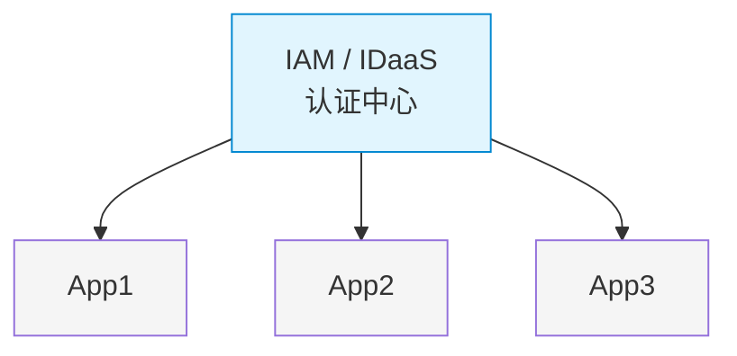
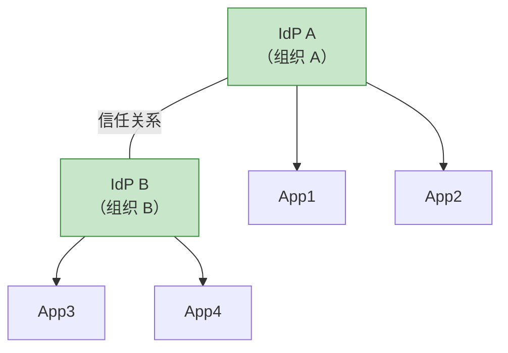
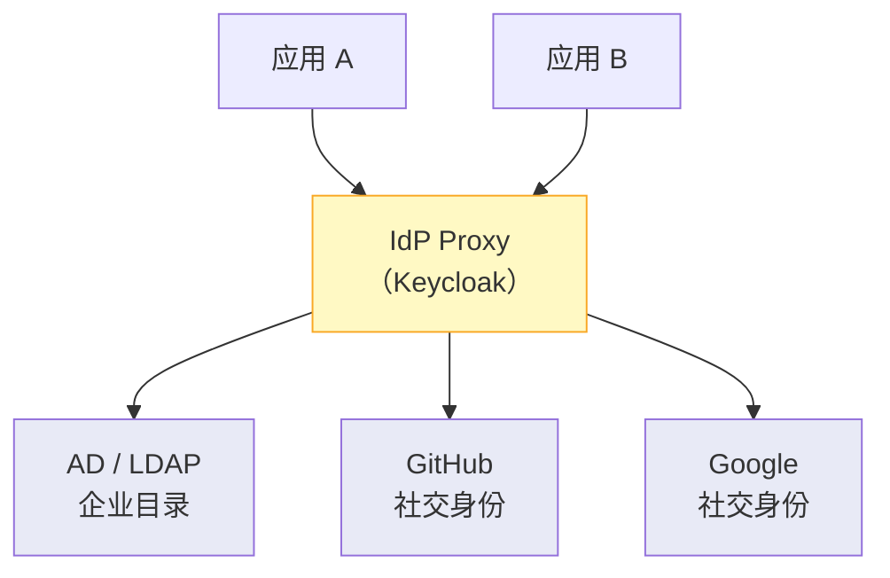
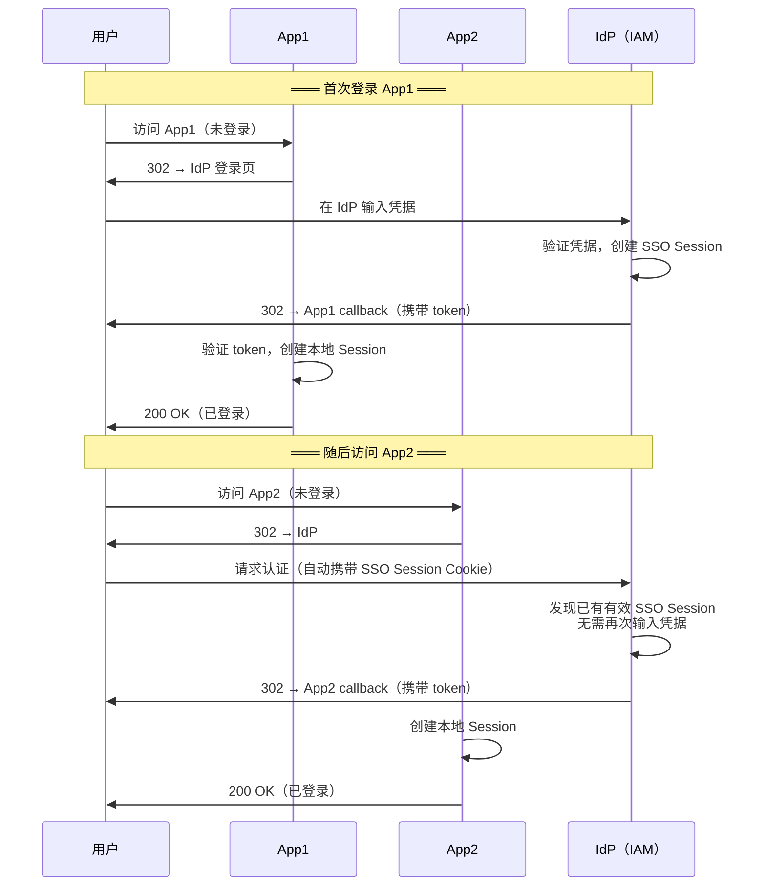

## 10.1 IAM SSO 的核心理念

在企业 IAM（身份与访问管理）体系中，单点登录（Single Sign-On, SSO）的核心承诺：**用户只需认证一次，即可访问所有被授权的应用。** 这是 IAM 体系中最直观的用户价值——也是 IAM 项目的典型起点。

这不仅是用户体验的改善，更是 IAM 安全性提升。原因很简单：

- 用户只需要记住一个强密码（而不是 N 个弱密码或同一个密码用 N 遍）
- 认证策略集中管理（强制 MFA、密码策略统一执行）
- 会话可以集中管理和吊销——这对于 IAM 合规审计至关重要

关于 IAM 整体概念，可先阅读 [IAM 是什么]()；关于 SSO 依赖的协议细节见 [OAuth 2.0 与 OIDC]() 和 [SAML 2.0]()。

## 10.2 IAM SSO 的三种实现模式

### 模式一：中心化 SSO

所有用户和应用都注册在同一个中心 IAM 系统中。这是最常见的 IAM 部署形态。

实现方式：通常通过 OIDC 或 SAML 2.0。
代表：Keycloak 单域部署。

### 模式二：联邦 SSO（Federated SSO）

多个 IAM 域之间建立信任关系，跨组织共享身份：

用户无论在哪个 IdP 认证，都能访问信任域中的任何应用。这是跨企业 IAM 协作的基础。

实现方式：SAML Federation、OIDC Federation。
代表：教育领域的 Shibboleth 联邦、企业间的 Azure AD B2B、企业微信/飞书/钉钉 SAML 集成。

### 模式三：身份代理（Identity Broker / IdP-Proxy）

用一个中心 IdP 作为"代理"，后端对接多个不同的身份源——这是 IAM 多源身份整合的核心模式：

用户可以使用不同的身份登录（域账号、GitHub 账号、Google 账号），但应用只需要对接一个 IdP。这是降低应用侧集成复杂度的关键 IAM 策略。

## 10.3 SSO 的会话管理

### Cookie-Based Session（传统 Web SSO）

关键设计：
- IdP 有一个全局的 SSO Session（Cookie，建议设置 `HttpOnly; Secure; SameSite=Lax`，跨站点 SSO 场景下用 `SameSite=None; Secure`）
- 每个应用有自己的本地 Session
- 登出时需要同时清除应用本地 Session 和 IdP 的 SSO Session

### Token-Based Session（SPA / 移动端）

基于 Token 的 SSO 不依赖 Cookie：

- 用户认证后获得 Access Token 和 Refresh Token
- 将 Token 安全地存储在客户端（移动端的 Keychain/Keystore，Web 端的 BFF 模式）
- 多个应用可以共享同一个 IdP 签发的 Token

## 10.4 单点登出（Single Logout, SLO）

SSO 的"另一面"：如何处理登出？

### 理想模式

用户在一个应用中登出 → IdP 通知所有已登录的应用 → 全部清除会话。

### 现实挑战

并非所有应用都支持 Back-Channel Logout（后端登出通知）。实际中常见的是混合方案：

1. **被动登出**：各应用的 Session 设置为短有效期，过期后需要重新到 IdP 认证（这时发现 SSO Session 也已过期，要求重新登录）。
2. **主动登出**：支持 Logout 协议的应用，IdP 主动清除其 Session。

### IAM 登出最佳实践

- IdP Session 和 App Session 都要设有效期
- Access Token 有效期应较短（如 5–15 分钟），App Session 可较长并通过 Refresh Token 静默续期；Refresh Token 有效期应长于 Access Token 但不超过 IdP SSO Session 有效期
- 使用 Refresh Token 的静默刷新，减少用户感知
- 重要操作前重新评估认证状态（Step-up Auth），参考 [Keycloak 条件认证与 Step-up 实践]()

## 10.5 SSO 的安全性增强

### 重新认证（Re-authentication / Step-up Auth）

- 访问高价值资源时，即使已有 SSO Session，也要求重新认证。
- 例如：查看普通数据只需 SSO Session，修改支付设置需要重新输入密码 + MFA。

### 连续访问评估（Continuous Access Evaluation, CAE）

新一代 SSO 不再只验证"登录时"的认证状态，而是持续评估：

- 用户 IP 地址是否发生了变化？
- 设备是否符合安全策略？
- 用户行为是否正常？

任何一个条件不满足，立即吊销 Access Token，中断访问。这是零信任 IAM 架构的核心机制，详见 [零信任 IAM 架构]()。

### 设备信任

将 SSO 与设备管理（MDM/UEM）集成：

- 只允许公司管理的设备访问企业应用
- 检查 OS 版本、安全补丁状态、是否越狱等

## 10.6 SSO 的常见陷阱

1. **SSO 不等于免密**：SSO 只是减少密码输入的次数，认证强度不能降低。弱密码 + SSO 只会让攻击者更容易获得"万能钥匙"。

2. **SSO Session 过长**：设置过长的 SSO Session（如 30 天），等于 30 天内任何人都可以在用户离开后使用其设备访问所有应用。

3. **登出不完整**：用户登出了应用 A，但应用 B 的 Session 仍然活跃。

4. **Refresh Token 滥用**：将 Refresh Token 存放在不安全的地方（如 localStorage），且不设 Rotation。

5. **忽略网络分区**：SSO 依赖 IdP 的可用性。如果 IdP 不可用，所有应用都无法登录。生产环境需注意 IdP 高可用设计，参考 [Keycloak 高可用与灾备方案]()。

6. **过度信任 SSO**：应用只检查"用户是否从 IdP 来"，而不验证 token 的具体内容（过期时间、scope、audience）。

## 10.7 SSO 高可用设计

SSO 是 IAM 基础设施中的关键路径，其可用性设计尤为重要：

- IdP 集群化部署，多节点
- IdP 自身状态外置（如使用外部数据库/Session 存储）
- 跨可用区 / 跨区域部署
- 缓存关键数据（如用户属性），减少数据库依赖
- 监控 IdP 健康状态、延迟和错误率

具体落地可参考 [Keycloak 生产运维检查清单]()。

## 10.8 小结

SSO 是 IAM 体系中最直观的入口功能，也是最核心的能力之一。好的 IAM SSO 设计是安全性和便利性的平衡：认证强度不能削弱，会话管理需要精细化，单点登出要重视，IdP 自身的高可用是基础前提。

从 IAM 架构演进的角度看，SSO 正从"一次认证、长期有效"向"持续评估、动态信任"演进——这与零信任 IAM 的理念一脉相承。理解 SSO 的三种模式（中心化/联邦/代理）及其会话管理机制，是设计任何 IAM 方案的前提。

## 10.9 常见问题（FAQ）

### Q1：企业 IAM SSO 和社交登录（"用 Google/GitHub 登录"）是一回事吗？

不是，但它们可以配合使用。

- **企业 IAM SSO**：用户在组织内部的 IdP（如 Keycloak、Azure AD）认证一次，访问所有内部应用。身份由企业内部管理，认证策略由企业控制。
- **社交登录**：用户用第三方身份提供者（Google、GitHub、微信）的账号登录你的应用。你的应用是 SP，Google 是 IdP——身份在第三方手里，你只能信任他们的认证结论。

在企业 IAM 实践中，常见做法是用身份代理（Identity Broker）模式把两者整合：Keycloak 作为中心 IdP，后端同时接入 AD/LDAP（企业身份）和 Google/GitHub/微信（社交身份），前端应用只需要对接 Keycloak 一种协议。这就是本章 10.2 的"模式三"。

### Q2：SSO 选了 OIDC 还是 SAML？哪个更适合企业 IAM？

对比如下：

| 维度 | OIDC SSO | SAML SSO |
|------|---------|----------|
| 适合场景 | 现代 Web/SPA/移动端 | 传统企业应用、跨组织联邦 |
| Token 格式 | JWT (JSON) | XML 断言 |
| 复杂度 | 低（REST API） | 中高（XML 签名与加密） |
| 移动端支持 | 原生支持 | 体验差 |
| 登出 | RP-Initiated Logout | SLO Profile（实现参差不齐） |
| 跨企业联邦 | 较新（OIDC Federation 草案） | 成熟（教育/政府领域广泛使用） |

**企业 IAM 选型建议**：
- 新项目优先 OIDC SSO（生态更好，开发体验更佳）
- 已有大量 SAML 基础设施（如 Shibboleth IDP、AD FS），保持 SAML 并逐步迁移
- 需要对接学校/政府 SAML 联邦，必须支持 SAML

更多协议选型内容见 [IAM 认证协议选型指南]()。

### Q3：为什么 SSO 登出后，有些应用还能访问？

这是 SSO 最常见的坑之一——**单点登出不完整**。原因通常有三个：

1. **Back-Channel Logout 未配置**：IdP 无法主动通知应用清除 Session。用户退出 IdP 后，各应用的本地 Session 仍然有效，直到自然过期。
2. **应用未实现 Logout Endpoint**：老旧应用没有处理 IdP 登出通知的能力。
3. **Token 未吊销**：即使 SSO Session 被清除，已签发的 JWT Access Token 在有效期内仍然可用（JWT 是无状态的）。

**缓解措施**：
- 将应用本地 Session 有效期设短（15-30 分钟），依赖 Refresh Token 续期
- 在 IdP 端实施 Token Revocation——登出时吊销所有 Refresh Token
- 对于高安全场景，使用 Token Introspection（opaque token）而非 JWT——每次请求都实时校验

### Q4：IAM SSO 方案中，多个应用是共用一套 oauth2-proxy 还是各自独立部署？

看场景：

| 场景 | 推荐 | 原因 |
|------|------|------|
| 同一主域名下的内部工具（grafana.example.com, kibana.example.com） | 共用一个 oauth2-proxy | Cookie 可跨子域共享，减少运维成本 |
| 不同域名（app-a.com, app-b.io） | 各自独立 | Cookie 无法跨域 |
| 不同用户组/角色要求不同 | 各自独立（或用 `--allowed-group` 分流） | 避免权限混淆 |
| 都在 K8s 集群内、同一 Keycloak Realm | 可共用 | 降低部署复杂度 |

共用时的注意事项：`--cookie-domain` 设置为 `.example.com`（前面带点号），`--cookie-secret` 保持一致。具体配置参考 [Keycloak + oauth2-proxy 集成实战]()。

### Q5：SSO 和零信任 IAM 矛盾吗？

不矛盾，它们是互补关系。SSO 解决的是"一次认证、多点访问"的便利性，零信任 IAM 在此基础上加上"持续验证":

- SSO Session 存在 ≠ 访问被信任：零信任要求在每个请求中评估设备状态、网络位置、用户行为
- 零信任 IAM 架构中的策略引擎（PDP）和策略执行点（PEP）可以基于 SSO 身份信息做决策，但不依赖 SSO Session 作为唯一的信任凭据

换句话说：SSO 提供"你是谁"的答案，零信任 IAM 决定"基于你是谁+当前上下文，你现在能不能访问这个资源"。详见 [零信任 IAM 架构]()。

### Q6：IAM SSO 的性能瓶颈在哪里？怎么优化？

SSO 的性能瓶颈主要集中在 IdP 端：

| 瓶颈点 | 症状 | 优化手段 |
|--------|------|---------|
| **IdP 登录页响应慢** | 用户打开登录页等 3-5 秒 | 静态资源 CDN、模板缓存、减少自定义主题的复杂度 |
| **Token 签发慢** | OAuth /token 端点延迟高 | 减少 User Federation（LDAP）查询次数、用 Infinispan 缓存用户属性 |
| **数据库连接池耗尽** | 高并发时 500/503 错误 | 增加连接池大小、读写分离、合理配置 `db-pool-initial-size` 和 `db-pool-max-size` |
| **Session 膨胀** | IdP 内存持续增长 | 限制 SSO Session 数量、设置合理的 Session 空闲超时 |
| **Token Introspection 高频** | 资源服务器频繁回调 IdP 验证 Access Token | 用本地 JWT 校验代替 introspection（共享 JWKS）、缓存 JWKS 公钥 |

对于 Keycloak 生产环境，[Keycloak 生产运维检查清单]() 中有更详细的调优参数。
