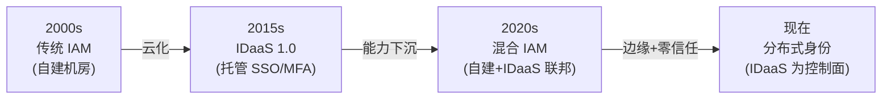

## IAM 和 IDaaS 是什么关系

先说结论：**IDaaS 是 IAM 的一种交付形态，不是 IAM 的替代品**。就像「云数据库」和「数据库」的关系——云数据库还是数据库，只是跑在别人机房、按量付费。

用一句话区分：

- **IAM**：身份与访问管理这个能力域本身（不管跑在哪、谁运维）
- **IDaaS**：把 IAM 能力做成云服务，你只管用，运维和升级由厂商负责

拉一张对比表会更清楚：

| 维度 | IAM（自建） | IDaaS（云服务） |
|------|-----------|---------------|
| **部署位置** | 自己的数据中心或私有云 | SaaS 厂商的云基础设施 |
| **运维责任** | 你的团队：升级、扩容、备份、安全加固 | 厂商：SLA 保障，你只需要配置 |
| **初始成本** | 高——硬件、部署、人员培训 | 低——按月/按用户付费，开箱即用 |
| **定制灵活度** | 完全可控，源码级定制 | 受限于厂商 API 和配置选项 |
| **数据主权** | 数据 100% 在你手里 | 数据在厂商基础设施上，需评估合规 |
| **典型玩家** | Keycloak、Apereo CAS、Dex（自建部署） | Okta/Auth0、Microsoft Entra ID、自建 Keycloak 也被视为私有 IDaaS |
| **适合谁** | 合规要求极高、定制需求深、有专业运维团队 | 希望快速上线、不想养 IAM 运维团队的中小团队 |

关于 IAM 的完整定义和四大核心域（认证、授权、用户管理、审计），见 [IAM 是什么]()；IDaaS 的起源和部署模式，见 [什么是 IDaaS]()。

## 从演进角度看区别

IAM 和 IDaaS 的边界不是一成不变的，它们沿这条线演变：

- **传统 IAM 时代**：Microsoft AD + ADFS 是标配，身份管理绑在 Windows 域控上
- **IDaaS 1.0**：Okta 带火了「SSO as a Service」，企业发现单点登录可以不开 AD
- **混合 IAM**：自建 Keycloak 做核心身份 + Okta/Entra ID 做外部 B2B 联邦，各取所长
- **分布式身份**：零信任架构下，IDaaS 从「登录入口」变成「持续验证的控制面」

所以你问「IAM 和 IDaaS 区别」时，实际上是在问：**你的身份基础设施应该跑在谁的地盘上，以及谁能帮你管到什么程度**。

## 选型决策：什么时候用 IAM，什么时候用 IDaaS

没有一刀切的答案，但可以从这几个维度判断：

### 选自建 IAM 的场景

- **合规强制数据不出境/不出机房**——金融、政务、军工常见
- **需要深度定制认证流程**——比如对接内部工单系统审批后发放临时 Token
- **已有成熟的运维团队**——有人能做 Keycloak 集群运维、InfiniBand 网络调优、数据库高可用
- **用户量巨大且增长稳定**——大规模下自建的单位用户成本可能低于 SaaS 订阅费

### 选 IDaaS 的场景

- **团队不到 50 人，没有专职安全/身份工程师**——别自建，你不缺技术，缺的是凌晨 3 点爬起来修 Keycloak 的人
- **需要快速接入多种社交登录和企业 IdP**——IDaaS 厂商预置了几十个连接器
- **多产品线需要统一登录体验**——SaaS 版 IDaaS 天然多租户，控制台里点几下就行
- **短期项目或 PoC**——按需付费，用完就停

### 混合方案（最常见）

现实中，大多数中大型组织走的是混合路线：

> **核心员工身份跑自建 Keycloak → 合作伙伴/客户身份跑 IDaaS → 两者通过 SAML/OIDC 联邦互信**

这样做的好处：员工身份数据 100% 在自己机房，外部身份接入走云端，不需要给合作伙伴开内网账号。

## 常见误区

### 「上了 IDaaS 就等于有了 IAM」

上了 IDaaS 只解决了「身份服务的交付方式」，IAM 体系的设计（角色怎么建、权限粒度怎么定、审计策略怎么设）仍然需要你自己做。IDaaS 给你的是工具，不是脑子。

### 「自建 IAM 一定更安全」

安全不取决于部署位置，取决于运维水平。一个没人打补丁的自建 Keycloak 比一个配置正确的 Okta 租户危险 100 倍。

### 「IDaaS 就是云版 AD」

AD 强在 Windows 生态和组策略，IDaaS 强在多协议（OIDC/SAML/SCIM）和云原生——它们解决的问题不完全重叠。

## 延伸阅读

- 如果已决定自建，参考 [开源 IAM 方案对比]() 选型
- 如果在看 IDaaS 产品，[其他 IDaaS 解决方案]() 覆盖了主流商业和开源选择
- 关于 IAM 架构层面如何设计，见 [IAM 架构设计指南]()

## 常见问题（FAQ）

**Q: IAM 和 IDaaS 是竞争关系吗？**
A: 不是。IDaaS 是 IAM 的一种交付方式。就像你不会问「云计算和计算是竞争关系吗」——云计算是实现计算的一种方式，IDaaS 是实现 IAM 的一种方式。

**Q: 自建 IAM 选 Keycloak 算不算也算 IDaaS？**
A: 看你从哪个角度。如果你把 Keycloak 部署在自己的 K8s 集群里，技术上你是自建 IAM；但如果你把它作为公司内部统一的身份服务平台、通过 API 对外提供认证服务，那它就是你的「私有 IDaaS」。很多公司的私有 IDaaS 就是这么来的。

**Q: 用 IDaaS 后还能迁移回自建 IAM 吗？**
A: 能，但需要准备。用户的密码 hash 通常能通过 SCIM 或批量导出拿到；OIDC/SAML 的 client 配置需要逐个重建；最大的坑是外部应用的回调 URL——你需要切换域名并通知所有对接方。建议从一开始就规划好迁移路径，不要等到被锁定才想退路。

**Q: IAM 选型应该先看什么？**
A: 先看你的约束条件：合规要求（数据能不能上云）、团队能力（有没有人运维）、用户规模（决定成本结构）、集成复杂度（需要对接多少老旧系统）。然后拿着这些约束去套上面的决策表。不要一上来就比功能——功能大家都差不多，约束才是真瓶颈。
