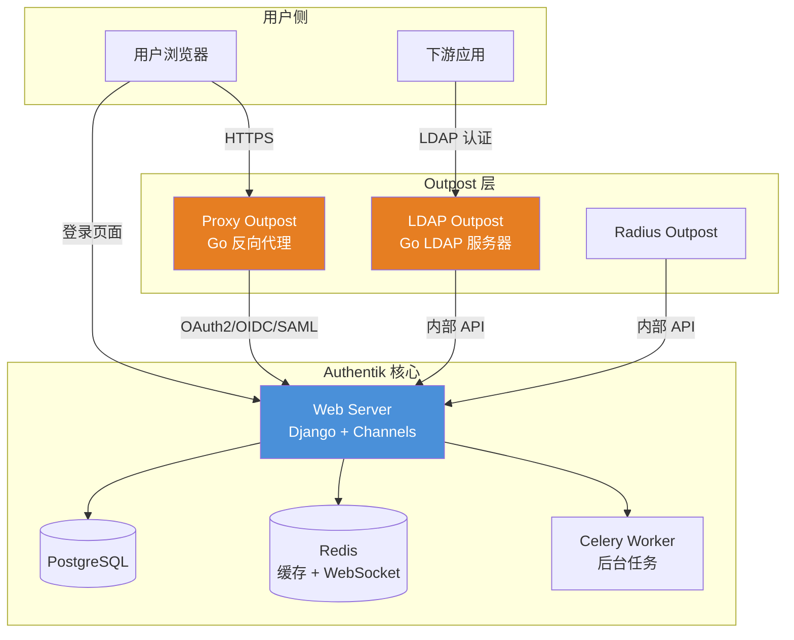
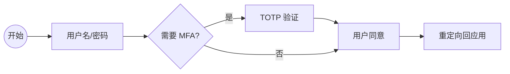

Authentik 是一个用 Python/Django 编写的开源身份验证与授权平台，2020 年由 Jens Langhammer 创建，当前最新稳定版为 **2026.5.3**（2026 年 6 月发布），GitHub 22k+ star。它的核心差异点在于：用**可视化流程构建器（Flow Builder）**替代硬编码的认证逻辑，用 **Outpost 代理** 将认证能力延伸到任意网络边界，同时保持 Python 生态的灵活性和可编程性。

## 核心设计思路

Authentik 的设计围绕三个核心概念展开：

1. **Flow（流程）**：一切认证行为——登录、注册、MFA 验证、密码重置、用户设置——都是可拖拽编排的流程。你可以像搭积木一样组合"用户名密码验证 → TOTP 验证 → 用户信息确认"形成一条完整的登录流水线。
2. **Outpost（前哨）**：Authentik 核心不直接面向外部流量，而是通过 Go 编写的轻量 Outpost 代理（LDAP Outpost、Proxy Outpost、Radius Outpost）部署在目标网络内，作为认证网关。
3. **Policy / Binding（策略与绑定）**：权限控制通过表达式策略实现，支持 Python 表达式、用户属性、IP 范围等条件，策略可绑定到 Flow、应用、属性映射等任何资源上。

## 架构全景



核心（Django + PostgreSQL + Redis）负责策略决策、用户管理和流程编排；Outpost 负责协议转换和流量代理。两者通过内部 API 通信，Outpost 可部署在完全不同的网络区域。

## 关键功能

### 可视化流程构建器（Flow Builder）

这是 Authentik 最突出的差异化能力。每一个认证流程都是一张有向图：



你可以为不同应用绑定不同的认证策略：GitLab 只要求密码登录，而 Kubernetes Dashboard 额外要求 TOTP + WebAuthn。这些不需要改代码，在管理界面拖拽配置即可。

已有内置 Stage 类型：用户名密码、TOTP、WebAuthn/Passkey、Duo、短信、邮箱验证码、验证码（Captcha）、用户信息确认、Prompt（自定义输入）、用户写入/更新等。

### Outpost 代理架构

Outpost 是 Go 语言编写的轻量级代理，负责协议层面的实际工作：

| Outpost 类型 | 作用 | 部署位置 |
|---|---|---|
| **Proxy Outpost** | 反向代理 + 认证网关，支持 OAuth2/OIDC/SAML | 应用前端网络 |
| **LDAP Outpost** | 将 Authentik 用户暴露为 LDAP 服务 | 需要 LDAP 集成的网络 |
| **Radius Outpost** | 支持 RADIUS 协议（网络设备认证） | 网络设备可达区域 |

每个 Outpost 通过 WebSocket + 内部 API 与核心保持连接，核心下发配置和策略更新。Outpost 是无状态的，可水平扩展。

### 协议支持

- **OAuth 2.0 / OpenID Connect**：完整 Provider 实现，支持授权码、PKCE、Client Credentials、Device Code 等流程
- **SAML 2.0**：IdP 角色，支持 SP 元数据导入
- **LDAP**：通过 LDAP Outpost 暴露，兼容 LDAP 客户端和传统应用
- **Proxy**：通过 Proxy Outpost 为任意 HTTP 应用提供认证网关
- **SCIM**：支持用户/组同步到下游应用

### 多租户与 RBAC

Authentik 原生支持多租户，每个租户可以有独立的用户、组、应用和流程。权限模型基于 RBAC + 表达式策略：

- 用户 → 组 → 角色
- 表达式策略可叠加到任何对象上（基于用户属性、IP、时间等）
- 策略可绑定到 Flow、应用、属性映射

## 快速部署（Docker Compose）

官方推荐 Docker Compose 起步，搭配 PostgreSQL 和 Redis：

```yaml
# docker-compose.yml（最小示例）
version: "3.8"
services:
  postgresql:
    image: docker.io/library/postgres:16-alpine
    environment:
      POSTGRES_DB: authentik
      POSTGRES_USER: authentik
      POSTGRES_PASSWORD: changeme
    volumes:
      - pg_data:/var/lib/postgresql/data

  redis:
    image: docker.io/library/redis:alpine

  server:
    image: ghcr.io/goauthentik/server:2026.5.3
    command: server
    environment:
      AUTHENTIK_REDIS__HOST: redis
      AUTHENTIK_POSTGRESQL__HOST: postgresql
      AUTHENTIK_POSTGRESQL__USER: authentik
      AUTHENTIK_POSTGRESQL__PASSWORD: changeme
      AUTHENTIK_POSTGRESQL__NAME: authentik
      AUTHENTIK_SECRET_KEY: "请生成一个长随机字符串"
    ports:
      - "9000:9000"
    depends_on:
      - postgresql
      - redis

  worker:
    image: ghcr.io/goauthentik/server:2026.5.3
    command: worker
    environment:
      AUTHENTIK_REDIS__HOST: redis
      AUTHENTIK_POSTGRESQL__HOST: postgresql
      AUTHENTIK_POSTGRESQL__USER: authentik
      AUTHENTIK_POSTGRESQL__PASSWORD: changeme
      AUTHENTIK_POSTGRESQL__NAME: authentik
      AUTHENTIK_SECRET_KEY: "请生成一个长随机字符串"
    depends_on:
      - postgresql
      - redis

volumes:
  pg_data:
```

启动后访问 `http://localhost:9000/if/flow/initial-setup/` 完成初始化，设置管理员账号和密码。

生产环境建议：PostgreSQL 使用外部托管或主从复制，Redis 使用 Sentinel/Cluster，Server 和 Worker 水平扩展，前置 Nginx/Traefik 处理 TLS 终结。

## Authentik vs Keycloak 对比

| 维度 | Authentik | Keycloak |
|---|---|---|
| **技术栈** | Python/Django + Go Outpost | Java/Quarkus |
| **最新版本** | 2026.5.3（月度发布） | 26.x（社区）/ 28.x（RH SSO） |
| **许可证** | MIT（核心），企业功能需商业许可 | Apache 2.0 |
| **认证流程** | 可视化 Flow Builder，拖拽编排 | 认证流程通过 SPI + Authentication Flow 配置 |
| **协议支持** | OIDC、SAML、LDAP、Proxy、RADIUS | OIDC、SAML、LDAP、Kerberos |
| **用户管理** | Web UI + API + SCIM | Web UI + Admin REST API + SCIM |
| **扩展性** | Python 表达式策略 + Celery 任务 | Java SPI 插件 + Event Listener |
| **部署复杂度** | Docker Compose 起步，K8s 可用 Helm | Operator/Helm，K8s 原生 |
| **多租户** | 原生支持 | 通过 Realm 实现 |
| **资源占用** | 中等（Django + 多个 Outpost） | 较低（Quarkus 单体） |
| **社区生态** | 增长中，22k+ GitHub star | 成熟，Red Hat 背书 |
| **中文体验** | 界面支持中文，文档以英文为主 | 界面支持中文（翻译生硬），中文社区资源更多 |

### 选择建议

**选 Authentik 的场景**：
- 团队以 Python 技术栈为主，需要灵活定制认证流程
- 有大量传统 LDAP 应用需要接入现代 IAM
- 需要可视化流程编排，降低认证逻辑的运维门槛
- 多租户 SaaS 场景需要独立的租户隔离

**选 Keycloak 的场景**：
- 需要最全面的协议支持和最成熟的生态
- 团队熟悉 Java 生态，需要 SPI 级别深度定制
- 已有 Keycloak 运维经验或 Red Hat 技术栈
- 需要支撑 10 万+ 用户的超大规模场景

**两者都选**：可以用 Keycloak 做主 IdP，Authentik 做特定应用的认证网关（通过 OIDC 联合），或在不同业务线按技术栈分开部署。

## 常见问题（FAQ）

### Authentik 的 Flow Builder 会不会有性能问题？

Flow 本质是状态机，每次登录请求按流程定义逐步执行。单步 Stage 的执行开销很小（毫秒级），实际瓶颈通常在数据库和 Redis 上。生产环境通过水平扩展 Worker 和 Server 进程来承载并发。

### 从 Keycloak 迁移到 Authentik 需要多久？

取决于集成复杂度。如果下游应用都走标准 OIDC/SAML，迁移主要是：导出用户 → 重建应用配置 → 切换回调地址 → 并行运行验证。用户密码可以通过兼容哈希格式导入（Authentik 支持 PBKDF2、bcrypt 等常见格式）。激进迁移 2-3 天，保守迁移 1-2 周渐进切换。

### Authentik 支持 Kubernetes 部署吗？

支持。官方提供 Helm Chart：`helm repo add authentik https://charts.goauthentik.io`，可以在 K8s 上部署 Server、Worker 和 Outpost。Outpost 支持以 Sidecar 或独立 Deployment 方式运行。

### Outpost 挂了会影响核心认证吗？

LDAP/Proxy Outpost 挂了只影响通过该 Outpost 接入的应用，核心的 OIDC/SAML 端点不受影响（这些由 Server 直接处理，不经过 Outpost）。Outpost 本身是无状态的，重启会自动从核心拉取最新配置，恢复时间通常在秒级。

### Authentik 能替换 Okta/Auth0 吗？

对中小规模团队可以。Authentik 覆盖了 SSO、MFA、用户生命周期管理等核心 IDaaS 能力，成本几乎为零（自建基础设施）。但缺少 Okta 的数千个预置应用集成、自适应 MFA、Workflows 编排等企业特性。对于需要企业 SLA 和数据合规认证的场景，商业 IDaaS 仍然是更稳妥的选择。

## 小结

Authentik 用 Python 技术栈 + 可视化流程 + Outpost 代理的组合，在开源 IAM 领域提供了一个与 Keycloak 有足够差异化的选择。它的 Flow Builder 降低了认证流程的运维门槛，Outpost 架构让身份能力可以延伸到网络边界之外。如果你的团队以 Python/Go 为主，或者需要快速搭建一个灵活、可编排的中等规模 IAM 系统，Authentik 值得认真评估。

更多源码和文档参见 [Authentik GitHub](https://github.com/goauthentik/authentik)，部署示例参考 [官方文档](https://docs.goauthentik.io)。如需对比其他方案，参见本书 [第17章：IDaaS 方案全景对比]()。
