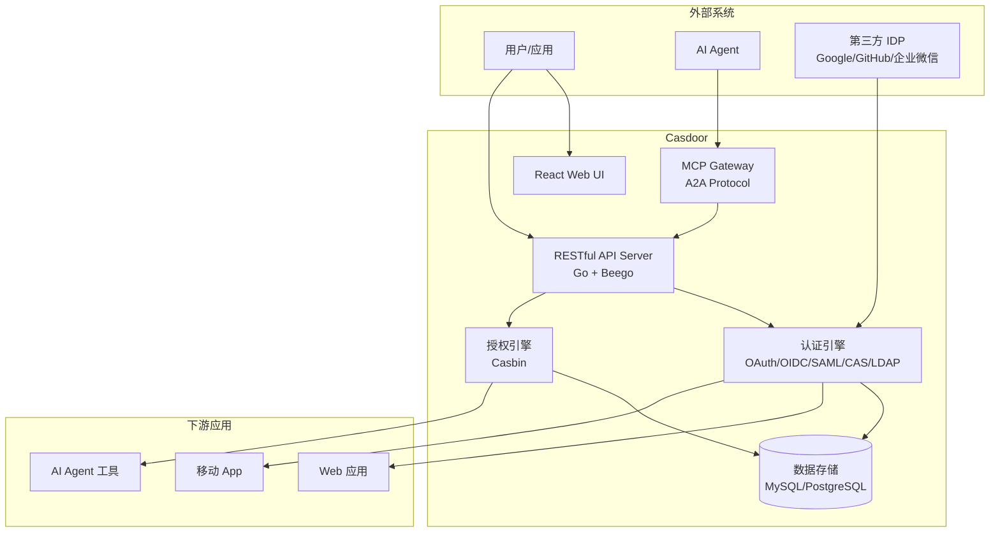

## Casdoor 简介

Casdoor 是 [Casbin](https://casbin.org/) 社区推出的开源身份与访问管理（IAM）平台，截至 2026 年 7 月最新稳定版为 **v3.108.0**（Apache 2.0 许可证），GitHub 约 13,900 星。

一句话定位：**UI-first、支持多协议、内置 Casbin 授权的轻量级 IAM 服务器**。它在 2025-2026 年逐步引入 MCP Gateway 和 A2A 协议支持，转向 "AI-First" 路线——这意味着 Casdoor 不仅能做人应用的认证中心，也在尝试成为 AI Agent 之间的身份与授权网关。

| 维度 | 信息 |
|------|------|
| 项目 | [github.com/casdoor/casdoor](https://github.com/casdoor/casdoor) |
| 语言 | Go (后端) + React (前端) |
| 数据库 | MySQL、PostgreSQL、SQLite（快速试用） |
| 缓存 | 可选 Redis |
| 许可证 | Apache 2.0 |
| 文档 | [casdoor.ai](https://casdoor.ai) |
| 在线 Demo | [door.casdoor.com](https://door.casdoor.com)（只读）/ [demo.casdoor.com](https://demo.casdoor.com)（可写，约 5 分钟重置） |

## 核心架构



Casdoor 采用前后端分离架构：
- **前端**：React 构建的 Web 管理控制台，支持品牌主题定制
- **后端**：Go 语言 Beego 框架，提供完整 RESTful API
- **认证层**：多协议支持，可同时作为 SP 和 IDP
- **授权层**：内置 Casbin 引擎，支持 ACL、RBAC、ABAC 多种模型
- **AI 层**（v3.x 新增）：MCP Gateway + A2A 协议，面向 AI Agent 的身份网关

> Casdoor **不是**反向代理或网关，它是独立的认证授权服务器——这一点和 oauth2-proxy、Authelia、Pomerium 定位不同。它需要应用主动对接 OIDC/OAuth/SAML 协议，而不是在反向代理层拦截未认证请求。

## 功能特性

### 认证协议

| 协议 | 支持程度 | 说明 |
|------|----------|------|
| OAuth 2.0 / OIDC | 完整支持 | 可作为 Provider，支持授权码、PKCE、Client Credentials 等 |
| SAML 2.0 | 支持 | 企业 SSO 集成 |
| CAS | 支持 | 兼容 Apereo CAS 协议 |
| LDAP | 支持 | 可作为 LDAP 目录服务 |
| SCIM 2.0 | 支持 | 用户自动同步/生命周期管理 |
| WebAuthn / Passkeys | 支持 | 无密码认证 |
| TOTP / MFA | 支持 | 多因素认证 |
| Face ID | 支持 | 人脸识别认证 |

### 身份源集成

Casdoor 支持对接多种第三方身份提供商（IDP），包括 Google、GitHub、Azure AD、企业微信、飞书、钉钉等，也支持自定义 OAuth/OIDC Provider 接入。

### 用户与组织管理

- 多租户（Organization）能力：不同组织的用户、应用、角色隔离
- Web UI 管理控制台，非技术人员也可操作
- 支持批量导入用户、自定义用户属性

### 授权（Casbin 集成）

这是 Casdoor 区别于其他 IAM 的最大特点——它和 Casbin 同出一源，深度集成：

- 支持 ACL、RBAC、ABAC、RESTful 等多种策略模型
- 授权策略使用 Casbin 的 PERM 模型（Policy、Effect、Request、Matchers），用 `.conf` 文件定义
- 支持动态策略加载、角色继承、资源层级
- 可以通过 Casdoor 的 API 在运行时更新策略

### AI-First 能力（v3.x）

- **MCP Gateway**：将 Casdoor 作为 MCP（Model Context Protocol）网关，AI Agent 通过标准接口获取身份和授权信息
- **A2A Protocol**：Agent-to-Agent 通信协议支持

> 这些是「加分项」而非核心需求。如果你的场景只是传统 Web SSO，Casdoor 的 AI 特性暂时不是选型关键因素。但对于正在构建 AI Agent 系统的团队，Casdoor 是目前唯一同时覆盖传统 IAM + MCP 网关的开源方案。

## 快速部署

### SQLite 试用（1 分钟）

```bash
# 下载并运行（自带 SQLite，无需外部数据库）
docker run -p 8000:8000 casbin/casdoor:latest
# 访问 http://localhost:8000
# 默认管理员: admin / 123
```

> ⚠️ SQLite 模式仅用于快速体验和开发测试，生产环境请使用 MySQL 或 PostgreSQL。

### Docker Compose 生产部署

```yaml
version: '3'
services:
  casdoor:
    image: casbin/casdoor:v3.108.0
    ports:
      - "8000:8000"
    volumes:
      - ./conf:/conf
    depends_on:
      - postgres
    environment:
      RUNNING_IN_DOCKER: "true"

  postgres:
    image: postgres:16
    environment:
      POSTGRES_DB: casdoor
      POSTGRES_USER: casdoor
      POSTGRES_PASSWORD: <强密码>
    volumes:
      - pgdata:/var/lib/postgresql/data

volumes:
  pgdata:
```

配置文件 `conf/app.conf` 中指定数据库连接：

```ini
driverName = postgres
dataSourceName = "user=casdoor password=<密码> host=postgres port=5432 sslmode=disable dbname=casdoor"
```

### Kubernetes Helm 部署

```bash
helm repo add casdoor https://casdoor.github.io/helm-charts
helm install casdoor casdoor/casdoor \
  --set database.driver=postgres \
  --set database.dataSourceName="user=casdoor password=<密码> host=<pg-host> port=5432 sslmode=disable dbname=casdoor"
```

## 与 Keycloak 对比

| 维度 | Casdoor | Keycloak |
|------|---------|----------|
| **语言/栈** | Go + React + Beego | Java + Quarkus + Angular |
| **部署复杂度** | 低 — 单二进制，配置简单 | 中 — JVM 调优，需理解 Realm/Client 模型 |
| **前端体验** | 优秀 — 现代 React UI，原生中文 | 一般 — Angular，中文翻译生硬 |
| **授权模型** | Casbin（ACL/RBAC/ABAC/RESTful）灵活但需手写模型文件 | 自有 RBAC + ABAC + 细粒度权限 |
| **协议覆盖** | OAuth/OIDC/SAML/CAS/LDAP/SCIM | OAuth/OIDC/SAML/LDAP（无 CAS 原生支持） |
| **身份联合** | 第三方 IDP 接入 | 内置 Identity Brokering + User Federation |
| **多租户** | Organization 模型 | Realm 隔离 |
| **集群/高可用** | 无状态 + 共享数据库，水平扩展 | 支持 Infinispan 集群缓存、多站点 |
| **社区规模** | ~14k Star，中文社区活跃 | ~25k Star，Red Hat 背书，国际社区 |
| **SPI/扩展** | 有限 — 主要通过配置和 Casbin 模型扩展 | 丰富 — 17 个 SPI 接口 |
| **AI 集成** | MCP Gateway + A2A 支持 | 无原生 AI 功能 |
| **适合团队** | 小型-中型，Go 技术栈，国内场景 | 中大型企业，Java 生态，合规要求高 |

### 选型建议

**选 Casdoor，如果：**
- 团队主要使用 Go 技术栈
- 需要现代化 UI，对中文体验要求高
- 已有或希望使用 Casbin 做细粒度授权
- 部署规模在中小型（数百个应用、数万用户）
- 想要简单、快速的部署体验（单二进制即跑）

**选 Keycloak，如果：**
- 需要完整的企业级 IAM 功能（Identity Brokering、User Federation、Kerberos）
- 团队是 Java 生态，有 JVM 运维经验
- 需要丰富的扩展点（SPI）
- 部署规模大，需要多站点/跨数据中心高可用
- 合规要求严格，需要 Red Hat SSO 商业支持

> Casdoor 和 Keycloak **不是互斥的**。可以用 Keycloak 做主 IDP，Casdoor 做面向 AI Agent 的身份网关，或反之用 Casdoor 做主 IDP、Keycloak 做特定场景的身份联邦节点。

## 适用与不适用

| 适用场景 | 不适用场景 |
|----------|------------|
| 中小团队快速搭建 SSO | 已有深度定制的 Keycloak SPI（迁移成本高） |
| Go 技术栈项目需要身份服务 | 需要 Kerberos/SPNEGO 集成（Keycloak 更合适） |
| 需要灵活授权（Casbin ACL/RBAC/ABAC） | 仅需反向代理级认证拦截（用 oauth2-proxy 更轻） |
| 国内场景，需要原生中文支持 | 多数据中心/跨区域高可用（Keycloak 更成熟） |
| AI Agent 系统需要身份网关 | 仅需简单 LDAP 目录（直接用 OpenLDAP） |

## 实践建议

1. **从 SQLite 开始体验**：docker run 一条命令即可跑起来，10 分钟了解核心功能
2. **生产环境用 PostgreSQL**：SQLite 不适合并发，MySQL/PostgreSQL 都支持良好
3. **Casbin 模型需要学习成本**：如果不是确实需要灵活的授权策略，先用 Casdoor 内置的 RBAC 功能
4. **关注版本更新**：Casdoor 更新较快（月级发布），升级前务必查看 Changelog 和数据库迁移说明
5. **监控和日志**：Casdoor 自身提供审计日志，可以使用 Prometheus 拉取应用指标
6. **备份策略**：定期备份数据库即可（Casdoor 是无状态服务，状态全在数据库中）

---

## 延伸阅读

- [第14章：Keycloak 架构与部署]()：与 Casdoor 的功能对比伴侣
- [第17章：IDaaS 方案全景对比]()：开源与商业方案的完整选型框架
- [第8章：SAML 2.0 协议]()：Casdoor 支持的 SAML 企业 SSO 协议详解
- [Casdoor 官方文档](https://casdoor.ai/docs/overview)
- [Casbin 授权模型](https://casbin.org/docs/overview)
