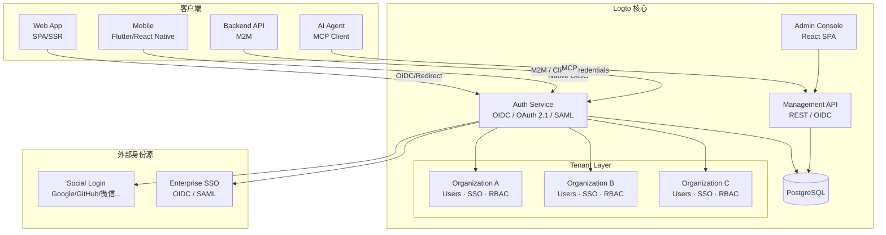
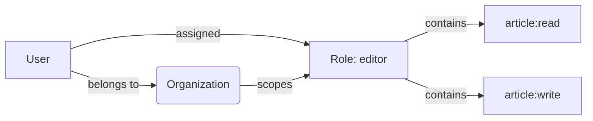

Logto 是一个用 TypeScript 编写的现代开源身份基础设施，2022 年由 Silverhand 团队创建，当前最新稳定版为 **v1.41.0**（2026 年 6 月发布），GitHub 14k+ star，MPL-2.0 协议。它的定位非常明确：**为 SaaS 和 AI 应用提供开箱即用的 CIAM（客户身份与访问管理）**，而不是通用的企业 IAM。

Logto 的核心差异点在于：把 OIDC / OAuth 2.1 的复杂性封装成开发者只需三步就能接入的 SDK，同时提供多租户（Organization）、企业 SSO、RBAC 和管理控制台，让你不必从头拼 Ory Hydra + Kratos + Keto 的组合。

## 核心设计思路

1. **协议封装而非暴露**：开发者不需要理解 OAuth 2.0 的 grant type、PKCE 或 ID Token 结构就能接入。SDK 提供 `signIn()` 一个 API，由 Logto 处理背后的协议细节。
2. **多租户一等公民**：Organization 模板不是后期补丁，而是从第一天就设计的数据隔离层，每个租户可以有独立的 SSO 连接器、用户池和 RBAC 策略。
3. **AI Agent 原生支持**：Logto 通过 MCP（Model Context Protocol）将身份能力暴露给 AI Agent，让 agent 能够代替用户登录、管理资源和执行授权操作——这是目前主流开源 IDP 中独有的能力。
4. **Cloud + OSS 统一代码库**：Logto Cloud 和开源版共用同一代码库，不会出现「开源版功能阉割」的问题。Cloud 版额外提供托管、自动扩缩容和 SLA 保障。

## 架构全景



Logto 的核心服务拆分为两块：**Auth Service**（处理 OIDC/OAuth 2.1/SAML 协议流）和 **Management API**（管理用户、角色、组织、连接器等资源）。两者共用 PostgreSQL 数据库。管理控制台本身是一个 React SPA，通过 Management API 与后端通信。

与传统 IDP 的一个关键架构差异：Logto 没有像 Keycloak 的 Infinispan 那样引入分布式缓存层，而是将状态完全托管给 PostgreSQL，适合中小规模部署（单实例可支撑 100 万+ 用户），大流量场景可通过读写分离和连接池扩展。

## 核心功能模块

### 1. 登录体验（Sign-in Experience）

Logto 最打动开发者的一点是它的登录 UI 完全可定制：

- **可视化配置**：在 Admin Console 中拖拽调整登录页的颜色、Logo、字段顺序，无需改一行代码
- **多种登录方式**：用户名密码、手机验证码、邮箱验证码、Social Login（Google、GitHub、微信等 20+ 连接器）、Enterprise SSO（OIDC/SAML）
- **MFA**：支持 TOTP、WebAuthn（Passkey）、备用恢复码
- **自定义品牌**：按租户（Organization）配置不同的登录页外观——SaaS 场景下，A 客户的用户看到 A 品牌的登录页，B 客户看到 B 品牌

### 2. 多租户与组织管理

Logto 的 Organization 是真正的一等公民，而非 RBAC 的简单变体：

- **用户隔离**：同一用户可以属于多个 Organization，每个 Organization 内的角色、权限完全独立
- **自动配置（JIT Provisioning）**：用户通过 Enterprise SSO 首次登录时自动创建账号并加入对应 Organization
- **成员邀请**：管理员可以发送邀请链接，被邀请者加入后自动获得预设角色
- **品牌定制**：每个 Organization 可以使用独立的登录页外观、域名（custom domain）和邮件模板

多租户场景下的典型用法：

| 场景 | Logto 的组织模式 |
|------|-----------------|
| B2B SaaS 平台 | 每个企业客户 = 一个 Organization，有独立的 SSO 配置和用户池 |
| 多产品线 | 每个产品 = 一个 Organization，共享底层用户身份 |
| 渠道/经销商体系 | 每个渠道 = 一个 Organization，通过 RBAC 限制数据可见范围 |

### 3. RBAC 权限模型

Logto 的 RBAC 采用经典的「角色 ← 权限」两层模型：

- **API Resource**：定义一组可管理的权限点（如 `article:read`、`article:write`）
- **Role**：绑定一组权限（如 `editor` = `article:read` + `article:write` + `comment:create`）
- **User ↔ Role**：通过 Organization 作用域绑定——用户的角色只在特定 Organization 内生效



特点：Role 始终在 Organization 上下文内生效。一个用户的 `editor` 角色只在 Organization A 内有效，不会泄露到 Organization B。这对 B2B SaaS 的正确授权隔离至关重要。

与 Keycloak 的对比——Keycloak 的 RBAC 通过 Realm Role / Client Role / Group / Composite Role 实现，功能更强但概念更多。Logto 的 RBAC 更靠近 SaaS 场景：角色依附于组织、权限依附于 API 资源，避免过度设计。

### 4. MCP（Model Context Protocol）集成

这是 Logto 在 2026 年的差异化能力。通过 MCP Server，AI Agent 可以直接调用 Logto 的身份能力：

- Agent 代替用户登录 API，获取 access token 后调用下游服务
- Agent 查询用户列表、角色、权限，辅助运维和审计
- Agent 在组织内自动创建/管理用户，实现 JIT 式用户生命周期

对于正在构建 AI Agent 平台或 AI 驱动的 SaaS 产品的团队，Logto 的 MCP 原生化省去了大量中间层开发。

## 部署方式

### Docker Compose（推荐）

```bash
# 下载官方 docker-compose.yml
curl -fsSL https://raw.githubusercontent.com/logto-io/logto/HEAD/docker-compose.yml | \
  docker compose -p logto -f - up
```

这会启动三个容器：
- **Logto**：核心服务，监听 `3001`（Admin Console）和 `3002`（Auth API）
- **PostgreSQL**：数据存储，默认端口 5432
- **Logto Connector Kit**：可选，用于自定义连接器开发

生产部署时建议将 PostgreSQL 替换为外部高可用实例（如 AWS RDS / 阿里云 RDS），并配置反向代理（Nginx / Caddy）处理 TLS。

### Kubernetes

Logto 官方目前没有提供 Helm Chart，但社区有 [logto-helm](https://github.com/logto-io/logto/issues?q=helm) 的讨论。Kubernetes 部署需要自行编写 Deployment + Service + Ingress 配置，核心注意点：

- Logto 无状态，可水平扩缩容
- PostgreSQL 作为唯一有状态依赖，需要 PVC 或外部数据库
- Admin Console 和 Auth API 需要两个独立的 Ingress 路由

## 与 Keycloak 的关键对比

| 维度 | Logto | Keycloak |
|------|-------|----------|
| **定位** | CIAM（客户身份），面向 SaaS/AI 应用 | 企业 IAM，面向内部员工 |
| **技术栈** | TypeScript (Node.js) | Java (Quarkus/WildFly) |
| **协议** | OIDC、OAuth 2.1、SAML | OIDC、OAuth 2.0、SAML、LDAP |
| **多租户** | Organization（一等公民） | Realm（物理级隔离）、Group 变通 |
| **部署复杂度** | Docker Compose 三容器，零配置启动 | 需要了解 Realm/Client/User Federation 模型 |
| **SDK 生态** | 30+ 框架官方 SDK，三行代码接入 | 依赖标准 OIDC 客户端（keycloak-js 不推荐新项目） |
| **用户管理 UI** | 开箱即用的 Admin Console + 可定制登录页 | Admin Console 功能强大但 UI 偏重；登录页需模板定制 |
| **AI Agent 集成** | MCP 原生支持 | 无原生支持，需自建 API 层 |
| **社区 & 生态** | 14k star，快速增长中 | 27k star，社区成熟，企业部署案例丰富 |
| **适用团队** | 全栈/前端团队，SaaS 创业公司 | 企业 IT / DevOps 团队，大型组织 |
| **开源协议** | MPL-2.0 | Apache 2.0 |

**选型建议**：
- 如果团队以前端/全栈为主、在做 SaaS 产品、需要多租户隔离和开箱即用的登录 UI → **选 Logto**
- 如果团队以 Java/DevOps 为主、做内部企业 IAM、需要 LDAP/AD 用户联邦和复杂的身份代理 → **选 Keycloak**
- 如果需要同时服务客户和员工，可考虑 Logto（客户侧 CIAM）+ Keycloak（员工侧 IAM）的组合，两者通过 OIDC Federation 联合

## 常见问题（FAQ）

### Logto 和 Auth0 有什么区别？
两者都面向 CIAM 场景，但 Logto 是开源的（MPL-2.0），可以自部署，没有按 MAU 收费的账单焦虑。Auth0 的规则（Rules）和 Hooks 更灵活，但相应也更复杂。Logto 适合想快速上线、不想为身份层付费的团队；Auth0 适合预算充裕、不想运维身份服务的团队。

### Logto 支持 LDAP 吗？
截至 v1.41.0，Logto 不原生支持 LDAP 用户联邦。如果企业有 AD/LDAP 目录服务，可以通过 LDAP → OIDC 的桥接方案（如 Dex、LemonLDAP）将 LDAP 转为 OIDC 后接入 Logto 的 Enterprise SSO 连接器。Keycloak 在这方面更成熟。

### Logto 的 PostgreSQL 需要多大规格？
对于中小规模（10 万用户以下），2 vCPU + 4 GB RAM 的 PostgreSQL 实例足够。Logto 的表结构相对精简，没有复杂的缓存写入压力，IOPS 是主要瓶颈。建议开启 `pg_stat_statements` 监控慢查询。

### Logto 能处理多少并发登录？
单实例 Logto 在 2 vCPU / 4 GB RAM 配置下，可稳定处理约 200-500 QPS 的 OIDC 认证请求。峰值场景可通过水平扩展 Logto 实例 + 外部 PostgreSQL 连接池（如 PgBouncer）线性提升。

## 进一步阅读

- [Logto 官方文档](https://docs.logto.io) —— 包含快速开始、SDK 指南和 API 参考
- [Logto Auth Wiki](https://auth-wiki.logto.io) —— Logto 团队维护的身份认证知识库
- [IAM 架构设计指南]() —— 了解 IAM 架构的整体决策框架
- [IAM 协议选型指南]() —— OAuth 2.0、OIDC、SAML 的对比与决策树
- [Keycloak 架构深度解析]() —— Keycloak 的内部机制与 Realm 模型
- [Ory 深度介绍]() —— Ory Hydra/Kratos/Keto 云原生身份栈
