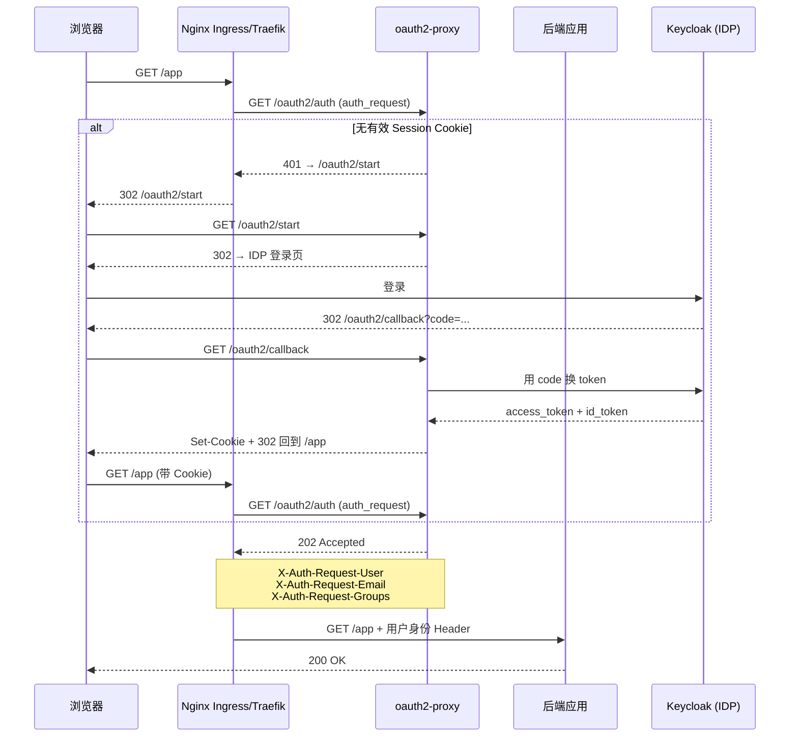

## 什么是 oauth2-proxy？

[oauth2-proxy](https://oauth2-proxy.github.io/oauth2-proxy/) 是一个开源的、轻量级的**身份感知反向代理**。它的工作很简单：拦在应用前面，检查每个 HTTP 请求是否带着有效会话；没有的话，把用户导向 OAuth2/OIDC Provider（比如 Keycloak、GitHub、Google、Dex）去登录，登录成功后再放行。

它不存储用户、不管理密码、不签发 Token——这些都是 Provider 的事。oauth2-proxy 只做一件事：**把没有身份的人挡在门外，把有身份的人放进来，并把用户信息（邮箱、用户名、组）通过 HTTP Header 传给后端应用**。

## 为什么需要它？

在 IDaaS 体系里，认证和授权是 IDP 的事，但你的应用可能根本没写登录逻辑。oauth2-proxy 的价值在于：

- **零代码改造**：给老应用、静态站点、容器化服务加 OIDC 登录，不用改一行业务代码。
- **入口层统一**：Ingress/反向代理层统一拦截，不用每个服务自己实现 OAuth 回调、Token 刷新、Session 管理。
- **Provider 无关**：同一个 oauth2-proxy 可以对接 Keycloak、Azure AD、GitHub、Google、Dex 等几十种 Provider，切换 Provider 不影响后端。

## 架构概览



**流程要点：**

1. 所有请求先经过 oauth2-proxy 的 `/oauth2/auth` 端点校验 Session Cookie。
2. 没有有效 Cookie → 302 跳 `/oauth2/start` → 302 跳 IDP 登录页。
3. 登录成功后回到 `/oauth2/callback`，oauth2-proxy 用授权码换 Token，写入 Session Cookie。
4. 后续请求携带 Cookie，oauth2-proxy 校验通过后返回 202，并在响应头中注入 `X-Auth-Request-User`、`X-Auth-Request-Email`、`X-Auth-Request-Groups` 等身份信息。
5. Nginx Ingress（通过 `auth_request`）或 Traefik（通过 `ForwardAuth`）透传这些响应头到后端。

## 核心概念

### Provider

oauth2-proxy 不自己实现认证，而是委托给上游 Provider。它支持的 Provider 包括：

| 类别 | Provider | 关键参数 |
|------|----------|---------|
| 企业 IDP | Keycloak OIDC、Azure AD、Okta、GitLab | `--provider=keycloak-oidc`，需配置 issuer、client-id、client-secret |
| 社交登录 | Google、GitHub、Facebook、LinkedIn | `--provider=google`，OAuth 2.0 授权码流程 |
| 通用 OIDC | 任意 OIDC Provider | `--provider=oidc`，需提供 `--oidc-issuer-url` |
| 轻量 IDP | Dex（带 OIDC connector） | `--provider=oidc`，issuer 指向 Dex 的 discovery URL |

### Session 与 Cookie

oauth2-proxy 的会话管理完全基于 Cookie：

- **Session Cookie**（默认 `_oauth2_proxy`）：存储加密后的 access token、ID token、refresh token 和过期时间。
- **CSRF Cookie**（默认 `_oauth2_proxy_csrf`）：防止跨站请求伪造，登录流程中校验 state 与 CSRF token 的一致性。

Cookie 关键配置项：

| 参数 | 作用 | 生产建议 |
|------|------|---------|
| `--cookie-secret` | AES 加密密钥（16/24/32 字节） | 生成随机串，所有 oauth2-proxy 实例共用同一值 |
| `--cookie-secure=true` | 仅 HTTPS 传 Cookie | 生产必须开 |
| `--cookie-httponly=true` | 禁止 JS 读取 Cookie | 必须开 |
| `--cookie-samesite=lax` | SameSite 策略 | `lax` 平衡安全与可用性；纯 API 场景可用 `strict` |
| `--cookie-domain` | Cookie 作用域 | 跨子域共享 Cookie 时设置，如 `.example.com` |
| `--cookie-expire=24h` | Cookie 有效期 | 内部工具设 8-24h；敏感系统设 1-4h |

默认 `cookie` Session Store 并不要求单副本或会话亲和性：多副本只要共享相同的 `--cookie-secret` 即可解密会话。切换到 `redis` 后，Cookie 通常只携带服务端 Session ID，但 Redis 的 TLS、凭据、容量、故障切换和恢复演练就成为 IAM 网关的生产前置条件。选择 Redis 的理由应是 Cookie 体积、服务端撤销或集中会话管理，而不是“副本多了就必须上 Redis”。详见 [IAM 网关 oauth2-proxy 常见错误排错]()。

### Upstream

oauth2-proxy 本身不处理业务流量，它有两个端口：

| 端口 | 职责 |
|------|------|
| 4180（默认） | HTTP 代理端口：接收 `/oauth2/auth`、`/oauth2/callback`、`/oauth2/start`、`/oauth2/sign_out` |
| 无（auth_request 模式） | 作为 Nginx Ingress 的 `auth_request` 后端或 Traefik `ForwardAuth` 后端时，只接受内网调用 |

## 部署模式

### 模式 1：Sidecar（推荐）

每个应用 Pod 旁挂一个 oauth2-proxy sidecar 容器，与业务容器共享 localhost 网络：

```yaml
# Deployment 摘录
spec:
  containers:
  - name: app
    image: my-app:latest
    ports:
    - containerPort: 8080
  - name: oauth2-proxy
    image: quay.io/oauth2-proxy/oauth2-proxy:v7.8.2
    args:
    - --http-address=0.0.0.0:4180
    - --upstream=http://localhost:8080
    - --provider=keycloak-oidc
    - --oidc-issuer-url=https://sso.example.test/realms/internal
    - --client-id=my-app
    - --client-secret=***  # 建议通过 Secret 环境变量注入
    - --cookie-secret=***  # 同上
    - --email-domain=*
    - --cookie-secure=true
    - --reverse-proxy=true
    ports:
    - containerPort: 4180
```

优点：生命周期与应用一致，端口不暴露到集群外。缺点：每个应用一个 oauth2-proxy，资源碎片化。

### 模式 2：独立 Service（多应用共享）

一个 oauth2-proxy Deployment/Service 保护多个应用：

```yaml
# oauth2-proxy 配置片段
--upstream=static://200  # 不代理具体 upstream，仅做 auth_request 校验
--skip-auth-route=GET=^/healthz  # 健康检查跳过认证
```

多个 Ingress 都指向同一个 `auth-url: http://oauth2-proxy.platform.svc/oauth2/auth`。

优点：资源集中，管理方便。缺点：所有应用复用同一个 Provider 和 Client，授权粒度受限；需要按应用设置 `--allowed-group` 时必须用不同实例。

### 模式 3：全代理模式（不推荐生产）

oauth2-proxy 同时做认证**和**流量代理：用户浏览器 → oauth2-proxy:4180 → 后端应用。适合测试环境，生产环境缺少 Ingress 的 TLS 终结、限流、WAF 等能力。

## 与 Keycloak 对接的关键细节

oauth2-proxy 和 Keycloak 是最常见组合，但有几个容易踩坑的点：

### Audience（aud claim）

Keycloak 默认不把 Client ID 写入 access token 的 `aud` 字段。oauth2-proxy v7.4+ 默认验证 audience，不匹配时返回：

```
{"error": "invalid_token", "error_description": "expected audience \"oauth2-proxy\" got [\"account\"]"}
```

**解决方案**：在 Keycloak Client 的 Client Scopes 里添加 **Audience mapper**，把 `Included Client Audience` 设为目标 Client ID。

### Issuer URL（iss claim）

oauth2-proxy 的 `--oidc-issuer-url` 必须与 Keycloak 实际签发 Token 的 `iss` 完全一致：

| Keycloak 版本 | 典型 issuer URL |
|--------------|----------------|
| 17+ 新部署 | `https://sso.example.test/realms/internal` |
| 旧版（16-） | `https://sso.example.test/auth/realms/internal` |
| 配置了 `--hostname-url` | 与 `hostname-url` 一致 |

不一致时，oauth2-proxy 会拒绝 Token：`"issuer mismatch"`。

### Groups vs Roles

oauth2-proxy 的 `--allowed-group` 可以限制哪些用户组能访问应用。Keycloak 端的组信息需要通过 **Group Membership mapper**（放在 Client Scope 或 Client 的 Dedicated Scope）写入 Token 的 `groups` claim。

如果使用 realm roles 控制访问，可以用 `--allowed-role`，但这种方式在跨 Client 共享时容易混淆，推荐优先用 groups。

### Redirect URL 与 Cookie Domain

- **redirect URL**：`--redirect-url` 必须与 Keycloak Client 的 `Valid Redirect URIs` 完全一致，通常不显式设置，让 oauth2-proxy 自动推导。
- **Cookie domain**：如果 Keycloak 和业务应用不在同一个子域，注意 Cookie 作用域。`--cookie-domain=.example.test` 可以让 `app.example.test` 和 `sso.example.test` 共享 Cookie（安全严格环境中不推荐）。

## 安全加固

### Cookie Secret 管理

Cookie 内容用 AES 加密，密钥通过 `--cookie-secret` 传入。生产环境：

- 至少 32 字节随机值：`openssl rand -base64 32`
- 所有 oauth2-proxy 实例共用同一个 secret（否则无法解密彼此的 Cookie）
- 通过 Kubernetes Secret 挂载环境变量，不写入配置文件
- 轮换流程：生成新 secret → 同时用新 secret 重启所有实例 → 所有用户需重新登录

### 超时与刷新

```bash
--cookie-expire=8h          # Session Cookie 有效期
--cookie-refresh=1h         # Token 刷新间隔
--session-store-type=cookie # Session 存储在 Cookie 中（默认，无需 Redis）
```

`cookie-refresh` 小于 `cookie-expire` 时，oauth2-proxy 会在接近过期时自动用 refresh token 续期，用户无感。

### 白名单路径

健康检查、静态资源、公开页面需要跳过认证：

```bash
--skip-auth-route=GET=^/healthz
--skip-auth-route=GET=^/metrics
--skip-auth-route=GET=^/public/.*
```

### `GAP-Signature` 请求签名

当前 oauth2-proxy 配置文档把 `--signature-key` 定义为 **GAP-Signature request signature key**，参数格式为 `algorithm:secretkey`。它不是“给所有 `X-Auth-Request-*` Header 自动加 HMAC”的通用开关；后端是否能验证签名，必须按实际使用的 GAP 接入协议实现并做联调。不要把它当成替代网络隔离、Ingress 清理客户端同名 Header 或后端授权校验的捷径。

```bash
--set-authorization-header=true    # 把 Bearer token 透传到后端；仅在确有需要时开启
--set-xauthrequest=true            # 注入 X-Auth-Request-* 响应 Header
--signature-key=sha256:<secret>    # GAP-Signature 密钥；算法和格式按版本文档确认
```

`--set-xauthrequest` 的职责只是生成认证响应头；`--pass-access-token` 会额外产生 `X-Auth-Request-Access-Token`。如果后端不需要 Token，就不要打开透传，减少凭据传播面。后端仍必须只接受来自受信任 Ingress 的请求，并独立验证自己消费的 Token 的 `iss`、`aud`、签名、过期时间和权限。

## 与替代方案对比

| 方案 | 定位 | 适合 | 不适合 |
|------|------|------|--------|
| **oauth2-proxy** | 轻量 OAuth2 反向代理 | 内部工具统一登录，Ingress 层拦截，快速集成 | 需要细粒度 RBAC/策略引擎的场景 |
| [Pomerium](https://www.pomerium.com/) | 企业级零信任接入代理 | 需要细粒度策略、设备信任、多 IDP 联合 | 小团队快速上手（配置复杂度高） |
| Traefik ForwardAuth | 内置中间件 | 已用 Traefik 的 K8s 集群 | 需要单独部署一个 ForwardAuth 后端（可以是 oauth2-proxy） |
| Nginx `auth_request` | 内置模块 | 已用 Nginx Ingress 的 K8s 集群 | 需要单独部署一个 auth 后端（可以是 oauth2-proxy） |
| Nginx `ngx_http_auth_jwt_module` | JWT 本地校验 | API 网关，高性能 JWT 验证 | 需要 OAuth2 回调流程的场景（模块只管校验，不管登录） |
|| [Ory Oathkeeper]() | API 优先的认证鉴权网关 | 微服务架构，需要 Zero Trust 策略引擎 | 小团队快速上手（配置复杂度较高，需搭配 Ory 生态其他组件） |

> **关键区别**：Traefik ForwardAuth 和 Nginx `auth_request` 是**协议**（不是产品），它们本身不做认证，需要指向一个认证后端——而 oauth2-proxy 正好是最常用的认证后端实现。

## 生产上线检查清单

- [ ] `--cookie-secret` 已配置，值 ≥ 32 字节随机串，所有实例一致。
- [ ] `--cookie-secure=true`（HTTPS 环境）。
- [ ] `--cookie-httponly=true`，未关闭。
- [ ] `--cookie-samesite` 已根据部署拓扑设置（子域共享 Cookie 时注意）。
- [ ] Keycloak Client 已配置 Audience mapper，Token `aud` 包含 oauth2-proxy Client ID。
- [ ] `--oidc-issuer-url` 与实际 Token `iss` 完全一致（无尾斜杠，无 `/auth` 差异）。
- [ ] groups/roles claim 已映射，`--allowed-group` 按应用粒度生效。
- [ ] `--skip-auth-route` 已配置健康检查和白名单路径。
- [ ] `/oauth2` 路径已路由到 oauth2-proxy（不是只配了 `/oauth2/auth`）。
- [ ] 若启用 `--signature-key`，已按实际 GAP-Signature 协议完成后端验签联调；没有该需求时不启用。
- [ ] 回滚方案：删除 Ingress 上的 `auth-url`/`auth-signin` 注解或 Traefik ForwardAuth middleware 引用，保留 oauth2-proxy 实例以便事后复盘。

## IAM FAQ

### oauth2-proxy 是 IAM 还是应用网关？

它是 IAM 链路中的入口认证代理，不是完整 IAM 平台。Keycloak、Dex 等 Provider 负责身份认证和 Token 签发；oauth2-proxy 负责浏览器会话、入口放行和认证结果传递。用户、组、MFA、生命周期和审计策略不能只靠 oauth2-proxy 管理。

### `X-Auth-Request-User` 能直接当授权依据吗？

不能。它是认证代理输出的 Header，不是后端资源授权证明。Ingress 必须清理客户端伪造的同名 Header，后端还要根据自身的 Token、scope、role 或资源关系做授权；高风险操作还要单独判断认证强度和实时会话状态。

### 多副本 oauth2-proxy 是否必须使用 Redis？

不必须。默认 Cookie Session Store 下，多副本共享同一个 `--cookie-secret` 即可读取会话。只有 Cookie 过大、需要服务端集中撤销或不希望 Token 留在 Cookie 中时，再引入 Redis；引入后要增加 TLS、凭据、容量、监控、故障和回滚验证。

## 参考与延伸阅读

- oauth2-proxy 配置总览（`trusted-proxy-ip`、Header、Session Store、`signature-key`）：<https://oauth2-proxy.github.io/oauth2-proxy/configuration/overview/>
- oauth2-proxy 源码配置定义（`signature-key`）：<https://github.com/oauth2-proxy/oauth2-proxy/blob/master/pkg/apis/options/options.go>
- Keycloak OIDC Provider 配置：<https://oauth2-proxy.github.io/oauth2-proxy/configuration/providers/keycloak_oidc/>
- 本站解决方案博客：[Keycloak + oauth2-proxy 集成指南]()
- 本站 Traefik 方案：[Traefik ForwardAuth + Keycloak + oauth2-proxy]()
- 本站排错指南：[Keycloak 重定向循环与 401 排错]()
- 本站排错速查：[IAM 网关 oauth2-proxy 常见错误排错]()
- 本站 Keycloak 架构：[Keycloak 架构深度解析]()
- 本站 K8s 生产部署：[Keycloak Kubernetes 生产环境部署]()
