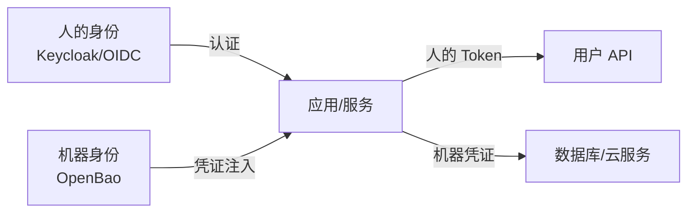
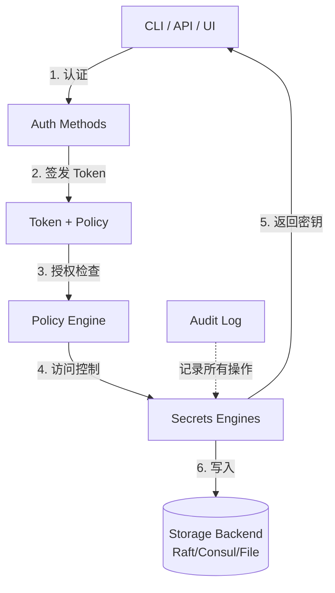
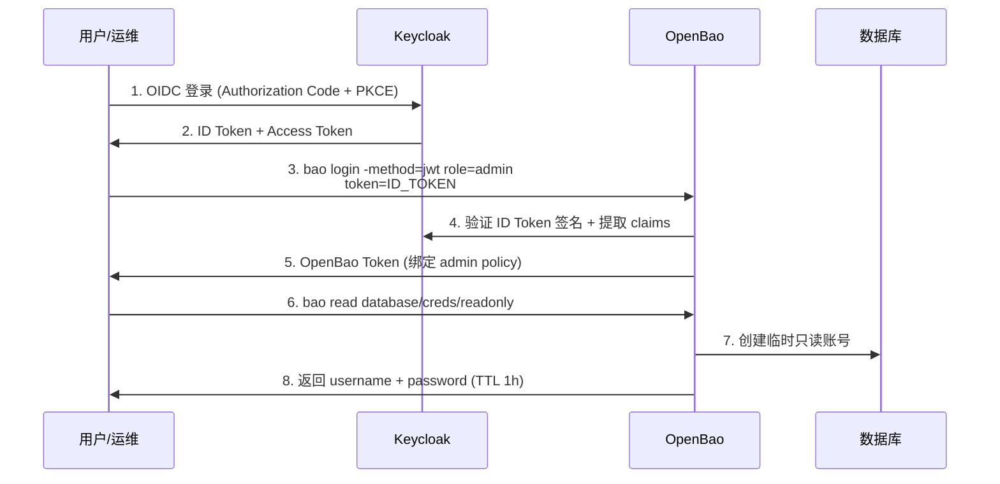
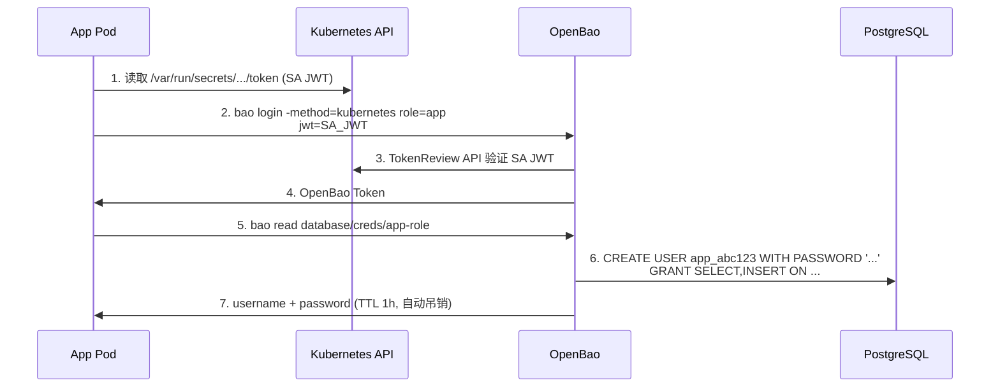

## OpenBao 是什么

OpenBao 是一个**身份驱动的密钥管理与加密引擎**，前身是 HashiCorp Vault 的开源社区分支。2023 年 8 月，HashiCorp 将 Vault 的许可证从 MPL-2.0 改为 BSL（Business Source License），引发社区广泛担忧——BSL 限制了商业竞争性使用，与开源生态的核心理念冲突。Linux Foundation 于 2023 年 12 月接纳了社区发起的 OpenBao 项目（当时名为 OpenBao），2024 年正式更名为 OpenBao 并以 OpenSSF Sandbox 项目运行。

OpenBao 的核心价值主张与 Vault 一脉相承：**集中管理所有密钥、证书、密码和加密操作，通过身份验证和策略控制访问，全程审计**。在 IAM 体系中，OpenBao 解决的是**机器身份（Machine Identity）管理**这个关键问题——不是人的账号密码，而是服务之间通信所需的 API Key、数据库凭证、TLS 证书、云服务密钥。

- **语言**：Go
- **许可证**：MPL-2.0
- **治理**：Linux Foundation / OpenSSF Sandbox
- **最新稳定版**：2.5.x（2026 年 7 月）
- **GitHub**：[openbao/openbao](https://github.com/openbao/openbao)

## 为什么需要 OpenBao：IAM 视角

传统 IAM 关注**人的身份**——员工、合作伙伴、客户。但现代架构中，**机器之间的调用远远多于人的操作**：微服务 A 调微服务 B、CI/CD Pipeline 发布镜像、监控系统抓取指标、Kubernetes Pod 访问数据库……每个交互都需要凭证。这些凭证散落在配置文件、环境变量、CI Secret、K8s Secret 中，管理起来是噩梦。

OpenBao 在 IAM 体系中的位置：



Keycloak 管「人能不能登录这个应用」，OpenBao 管「这个服务能不能拿到数据库密码」。两者互补——OIDC Access Token 和 OpenBao Token 各司其职，共同构成完整的 IAM 身份层。

## 核心架构

OpenBao 的架构围绕五个核心概念展开：



### Secrets Engines（密钥引擎）

密钥引擎是 OpenBao 的「功能插件」，负责生成、存储和管理特定类型的密钥。每个引擎挂载在一个路径下（如 `secret/`、`pki/`、`database/`），独立配置和访问控制。

常用引擎：

| 引擎 | 用途 | IAM 关联 |
|------|------|---------|
| **KV (Key-Value)** | 存储静态密钥（API Key、密码） | 替代 .env 文件和 K8s Secret |
| **PKI** | 签发和管理 X.509 证书 | 机器身份的 mTLS 证书自动化 |
| **SSH** | 签发一次性 SSH 证书 | 服务器的短效访问凭证 |
| **Database** | 动态生成数据库账号 | 应用无需硬编码数据库密码 |
| **Transit** | 加密即服务（不存储数据） | 应用层加密，密钥不落地 |
| **Kubernetes** | 动态生成 K8s ServiceAccount Token | Pod 的服务身份 |
| **JWT/OIDC** | 签发和验证 JWT Token | 与 Keycloak 配合的 Token 管理 |

### Auth Methods（认证方法）

认证方法定义了「谁」可以访问 OpenBao。支持：

| 方法 | 适用场景 | IAM 角色 |
|------|---------|---------|
| **AppRole** | 机器/服务认证（推荐） | CI/CD、微服务 |
| **Kubernetes** | K8s ServiceAccount 认证 | Pod 自动获取身份 |
| **JWT/OIDC** | 通过 JWT Token 登录 | 与 Keycloak/任何 OIDC Provider 集成 |
| **LDAP** | 通过 LDAP/AD 认证 | 企业目录服务集成 |
| **TLS Certificate** | 客户端证书认证 | 高安全机器认证 |
| **Token** | 静态 Token 认证 | 初始引导/紧急访问 |

### Policies（策略）

策略用 HCL（HashiCorp Configuration Language）或 JSON 定义，控制「谁可以访问哪些路径、执行哪些操作」：

```hcl
# 允许读取 secret/data/myapp/* 下的密钥
path "secret/data/myapp/*" {
  capabilities = ["read"]
}

# 允许签发 PKI 证书，但只允许特定域名
path "pki/issue/example-dot-com" {
  capabilities = ["create", "update"]
}

# 显式拒绝访问 secret/data/admin
path "secret/data/admin" {
  capabilities = ["deny"]
}
```

OpenBao 的授权模型是**基于路径的 RBAC**：Token 绑定策略，策略定义路径权限。与 IAM 授权模型（[RBAC/ABAC/ReBAC]()）相比，OpenBao 的策略模型更偏向工程化——没有角色层级，没有属性条件，但足够应对密钥管理的访问控制需求。

### Leases（租约）

OpenBao 中几乎所有动态生成的密钥都有租约。租约到期后密钥自动吊销——这是 OpenBao 区别于「静态配置文件存密码」的核心能力。

租约的生命周期：

```
创建密钥 → 分配 Lease ID + TTL → 客户端定期 Renew → TTL 到期 → 自动吊销
                                                ↓
                                          客户端主动 Revoke
```

典型 TTL 建议：数据库凭证 1-24h、PKI 证书 30-90d、SSH 证书 5min-1h。

## OpenBao 与 IAM 的集成场景

### 场景一：OpenBao + Keycloak OIDC 认证

这是最自然的集成方式——Keycloak 做人的身份认证，OpenBao 通过 JWT Auth Method 接受 Keycloak 签发的 ID Token，实现「人→OpenBao」的认证链路：



配置要点：

1. **Keycloak 侧**：创建一个专用 Client（`openbao`），启用 OIDC，生成 Client Secret
2. **OpenBao 侧**：
   ```bash
   # 启用 JWT Auth Method
   bao auth enable jwt

   # 配置 Keycloak 的 OIDC Discovery URL
   bao write auth/jwt/config \
     oidc_discovery_url="https://keycloak.example.com/realms/myrealm" \
     default_role="readonly"

   # 创建角色，映射 JWT claims 到 OpenBao 策略
   bao write auth/jwt/role/admin \
     role_type="jwt" \
     user_claim="sub" \
     bound_audiences="openbao" \
     policies="admin"
   ```

3. **验证**：
   ```bash
   # 获取 Keycloak Token 后用其登录 OpenBao
   bao login -method=jwt role=admin jwt=$KC_TOKEN
   bao read secret/data/myapp/config
   ```

### 场景二：Kubernetes Pod 自动获取数据库凭据

这是 OpenBao 在云原生 IAM 中的杀手级应用——Pod 无需硬编码任何密码，通过 Kubernetes Auth Method 自动认证并获取动态凭据：



这个场景体现了 IAM 的完整链路：Kubernetes 提供 Pod 身份（SA Token），OpenBao 验证身份并授权（Policy），数据库接受动态凭据。整个过程中没有硬编码密码，所有凭据都有租约和审计日志。

### 场景三：PKI 证书自动化（机器身份 mTLS）

在零信任 IAM 架构（参见[零信任身份架构]()）中，服务间通信需要 mTLS——每个服务都要有自己的 TLS 证书。OpenBao 的 PKI Secrets Engine 可以充当内部 CA，按需签发短有效期证书：

```bash
# 配置 PKI 引擎作为内部 CA
bao secrets enable pki
bao write pki/root/generate/internal \
  common_name="internal.example.com" \
  ttl=87600h  # 根 CA 有效期 10 年

# 创建角色，限制可签发的域名和 TTL
bao write pki/roles/internal-service \
  allowed_domains="internal.example.com" \
  allow_subdomains=true \
  max_ttl="720h"  # 证书最长 30 天

# 服务请求证书
bao write pki/issue/internal-service \
  common_name="auth-service.internal.example.com" \
  ttl="24h"
```

配合 [Vault Agent / OpenBao Agent](https://openbao.org/docs/agent-and-proxy/) 的自动续签能力，服务可以将证书文件写入共享卷，由 Sidecar 或 Init Container 自动刷新，实现零人工干预的证书轮换。

## 与 HashiCorp Vault 的对比

| 维度 | HashiCorp Vault | OpenBao |
|------|----------------|---------|
| 许可证 | BSL 1.1（2023.8 起） | MPL-2.0 |
| 治理 | HashiCorp 公司 | Linux Foundation / OpenSSF |
| 功能核心 | Secrets、PKI、Transit、Auth | 同 Vault（分叉时功能一致） |
| UI | Vault UI | 同 Vault（维护中） |
| 社区 | 原有社区部分流失 | 社区独立发展 |
| 企业特性 | 需 Vault Enterprise | 社区开发中（HSM Auto-Unseal 等） |
| K8s 集成 | Vault Helm Chart | 兼容原 Helm Chart（社区维护） |
| API 兼容 | - | 与 Vault 1.x API 兼容（bao CLI 替换 vault CLI） |

**选型建议**：
- 如果已经在用 Vault 开源版且对 BSL 许可敏感 → 迁移到 OpenBao（API 兼容，迁移成本低）
- 如果是新项目且对 MPL-2.0 许可可接受 → OpenBao 是社区治理、长期可靠的选项
- 如果需要 Vault Enterprise 功能（HSM、DR Replication、MFA）且预算允许 → 继续用 Vault
- 如果只是简单的密钥管理且已有 Kubernetes → 也考虑 [Kubernetes External Secrets Operator](https://external-secrets.io/) 作为轻量替代

## 部署方式

### Docker 快速体验

```bash
docker run -d --cap-add=IPC_LOCK \
  -e 'BAO_LOCAL_CONFIG={"storage":{"file":{"path":"/data"}},"listener":{"tcp":{"address":"0.0.0.0:8200","tls_disable":true}},"default_lease_ttl":"168h","max_lease_ttl":"720h","ui":true}' \
  -p 8200:8200 \
  openbao/openbao server

# 初始化（仅首次）
export BAO_ADDR='http://127.0.0.1:8200'
bao operator init -key-shares=3 -key-threshold=2

# 解封（每次重启后需要，使用 init 输出的 Unseal Key）
bao operator unseal <KEY1>
bao operator unseal <KEY2>
```

### Kubernetes（Helm）

```bash
helm repo add openbao https://openbao.github.io/openbao-helm
helm install openbao openbao/openbao \
  --set server.dev.enabled=false \
  --set server.ha.enabled=true \
  --set server.ha.raft.enabled=true
```

> 生产环境建议使用 Raft 集成存储（无需外部 Consul）、启用 TLS、配置 Auto-Unseal（通过云 KMS 或 HSM）。

## 常见问题（FAQ）

### Q1：OpenBao 和 Keycloak 是什么关系？需要两个都部署吗？

OpenBao 管理**机器凭证**（数据库密码、API Key、TLS 证书），Keycloak 管理**人的身份**（SSO、OIDC、SAML）。两者解决的问题不同，但可以集成——Keycloak 认证人，OpenBao 接受 Keycloak 签发的 Token 来识别操作者身份。如果你只需要「人登录系统」，Keycloak 足够；如果你的应用需要动态获取数据库密码或管理 TLS 证书，才需要 OpenBao。

### Q2：已经有 Kubernetes Secrets 了，为什么还要 OpenBao？

K8s Secret 是 etcd 中的静态 Base64 编码值——没有自动轮换、没有审计、没有动态生成。OpenBao 提供：
- **动态密钥**：每次读取生成新凭据，用完自动吊销
- **租约管理**：凭据到期自动清理，不存在「忘记删除」的情况
- **审计日志**：谁在什么时间读了什么密钥，有完整记录
- **加密存储**：静态数据加密，etcd 中的 K8s Secret 默认不加密

### Q3：OpenBao 的「解封（Unseal）」机制是怎么回事？影响 IAM 高可用吗？

OpenBao 启动后处于「封印」状态——主加密密钥被拆分为多个分片（Shamir's Secret Sharing），需要足够数量的分片才能解封。这是安全设计：即使攻击者拿到存储后端的全部数据，没有解封密钥也无法解密。

对 IAM 高可用的影响：
- 每次重启都需要手动/自动解封——生产环境必须配置 **Auto-Unseal**（通过云 KMS 或 HSM），否则重启后服务不可用
- Kubernetes 中推荐使用云厂商 KMS（AWS KMS、Azure Key Vault、GCP KMS）自动解封
- OpenSSF 社区正在为 OpenBao 开发 HSM 自动解封支持

### Q4：从 Vault 迁移到 OpenBao 需要做什么？

因为 OpenBao 与 Vault API 兼容，迁移是直接的数据升级：

1. 停止 Vault 服务
2. 将存储后端数据（Raft/Consul/File）复制到 OpenBao 可访问的位置
3. 用 OpenBao 二进制替换 Vault 二进制
4. 以相同配置启动 OpenBao（配置文件路径和监听端口不变）
5. 解封后验证数据完整性

CLI 方面，`bao` 命令是 `vault` 的 drop-in 替换，脚本中的 `vault` 改为 `bao` 即可。部分 Vault Enterprise 功能（Namespaces、Performance Replication）在 OpenBao 中不可用，迁移前需要确认没有依赖这些特性。

## 延伸阅读

- [OpenBao 官方文档](https://openbao.org/docs/)
- [IAM 架构设计指南]()：OpenBao 在 IAM 架构中的位置
- [零信任身份架构]()：机器身份与 mTLS 证书自动化
- [IAM 安全最佳实践]()：密钥管理与凭证轮换
- [Kubernetes 生产部署]()：OpenBao on K8s 部署考量
- [Keycloak 架构与部署]()：人的身份管理
