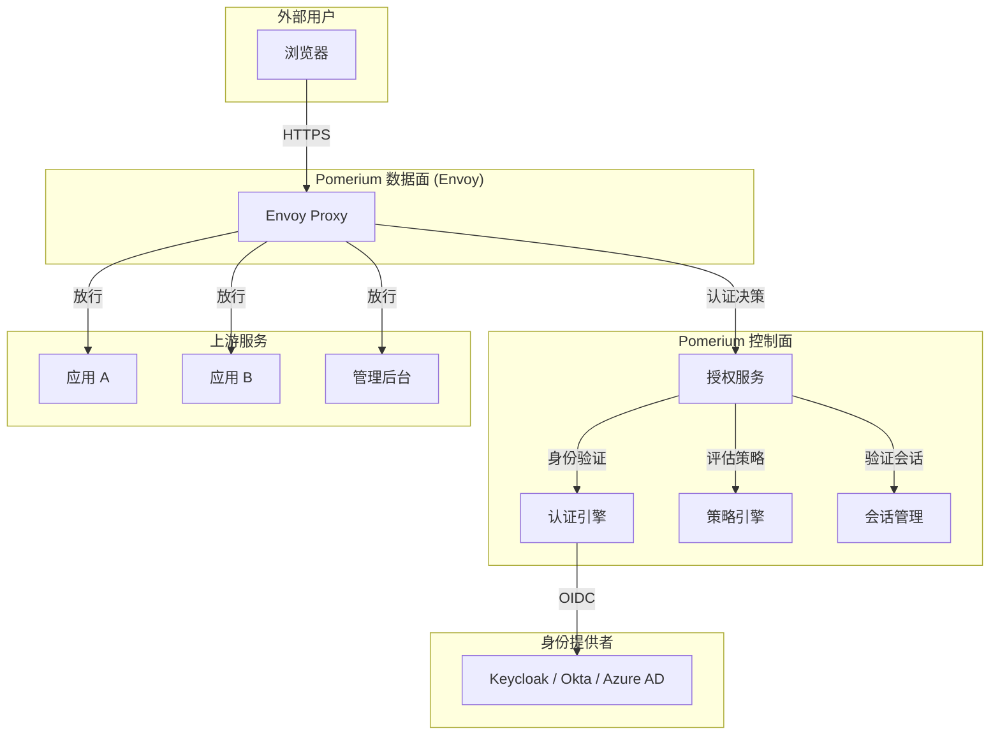
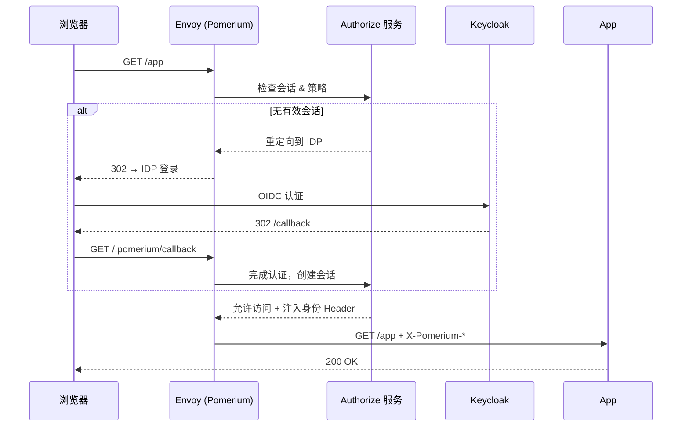

## 什么是 Pomerium？

[Pomerium](https://www.pomerium.com/) 是一个开源的、基于身份的**零信任接入代理**。与 oauth2-proxy 的"每个请求检查一次"不同，Pomerium 在反向代理层实现完整的**策略引擎**：谁（用户/设备/组）、在什么条件下（设备状态、地理位置、时间）、可以访问什么（路由/路径）——全部在代理层用声明式策略完成，不依赖应用自身实现授权。

它的核心思路是：**反向代理 = 策略执行点（PEP）**。应用不需要知道身份验证和授权；Pomerium 替它做完，只把合法的请求转发进去。

Pomerium 使用 [Envoy](https://www.envoyproxy.io/) 作为数据面代理引擎，控制面负责策略决策和会话管理。开源版（Apache 2.0）覆盖核心身份代理和策略能力；企业版增加了设备信任、报告和高级管理功能。

## 为什么选择 Pomerium？

| 场景 | oauth2-proxy 够用吗？ | Pomerium 更合适吗？ |
|------|----------------------|-------------------|
| 内部工具统一登录，不需要细粒度权限 | ✅ 够用 | 过重 |
| 需要"只有这群人能访问这个路径" | ⚠️ 需要多个实例 | ✅ 原生支持路由级策略 |
| 需要基于设备状态的访问控制 | ❌ 不支持 | ✅ 企业版支持设备信任 |
| 需要多 IDP 联合，不同路由用不同 IDP | ❌ 不支持 | ✅ 原生支持多 IDP |
| 需要审计日志和访问报告 | ❌ 需自行采集 | ✅ 内置 |
| 团队 <10 人，快速上手 | ✅ | ⚠️ 配置复杂度高 |

一句话总结：如果只是"登录后才能访问"，oauth2-proxy 更轻。如果需要"哪些人、什么条件、访问什么"的细粒度策略，Pomerium 是更合适的工具。

## 架构概览



Pomerium 的架构分为**控制面**和**数据面**两层：

- **数据面**：基于 Envoy，负责 TLS 终结、请求路由、Header 注入，执行控制面的决策。
- **控制面**：包含认证、授权、策略评估和会话管理四个子组件，每个请求到 Authorize 服务做一次决策。

### 请求处理流程



## 核心概念

### Routes（路由）

Pomerium 以路由为单位定义保护策略。每个路由包括：

```yaml
routes:
  - from: https://app.example.com
    to: http://app.internal:8080
    policy:
      - allow:
          or:
            - domain:
                is: example.com
            - email:
                is: admin@example.com
    pass_identity_headers: true
```

关键属性：
- `from`：外部可访问的域名（Pomerium 在此终结 TLS）。
- `to`：内部上游地址。
- `policy`：声明式访问控制规则（PPL — Pomerium Policy Language）。
- `pass_identity_headers`：是否注入 `X-Pomerium-Jwt-Assertion` 等身份 Header 到后端。

### Policy Language（PPL）

Pomerium 的策略语言是声明式的 YAML/JSON 规则，支持：

| 条件类型 | 示例 | 说明 |
|---------|------|------|
| `domain` | `domain.is: example.com` | 邮箱域匹配 |
| `email` | `email.is: alice@example.com` | 精确邮箱 |
| `groups` | `groups.has: engineering` | 组名匹配（从 IDP groups claim 获取） |
| `user` | `user.is: alice` | 用户名匹配 |
| `claims` | `claims.department: engineering` | 自定义 OIDC claim 匹配 |
| `device` | `device.is_authenticated: true` | 设备信任（企业版） |

规则通过 `and`/`or`/`not` 组合成复杂条件：

```yaml
policy:
  - allow:
      and:
        - domain:
            is: example.com
        - groups:
            has: engineering
  - allow:
      and:
        - email:
            is: admin@example.com
```

上例：允许 `example.com` 域内 `engineering` 组的成员，或 `admin@example.com` 访问。

### Identity Providers

Pomerium 支持多 IDP，不同路由可以使用不同的 IDP：

```yaml
idp_providers:
  - id: keycloak-internal
    provider: oidc
    client_id: pomerium
    client_secret: "${KEYCLOAK_SECRET}"
    url: https://sso.internal.example.com/realms/internal
    scopes:
      - openid
      - email
      - profile
      - groups

  - id: github
    provider: github
    client_id: "${GITHUB_CLIENT_ID}"
    client_secret: "${GITHUB_CLIENT_SECRET}"
```

然后在路由级别指定 IDP：

```yaml
routes:
  - from: https://internal.example.com
    to: http://internal:3000
    idp_provider_id: keycloak-internal
    policy:
      - allow:
          or:
            - domain:
                is: example.com

  - from: https://opensource.example.com
    to: http://opensource:3000
    idp_provider_id: github
    policy:
      - allow:
          or:
            - domain:
                is: "*"
```

## 与 Keycloak 对接

### 1. Keycloak 端配置

在 Keycloak 中创建 OIDC Client：

| 配置项 | 值 |
|--------|---|
| Client ID | `pomerium` |
| Client Protocol | `openid-connect` |
| Access Type | `confidential` |
| Valid Redirect URIs | `https://your-app.example.com/.pomerium/callback` |
| Client Authentication | `Client ID and Secret` |

**关键**：Pomerium 的回调路径是 `/.pomerium/callback`，不是传统的 `/callback` 或 `/oauth2/callback`，务必在 Keycloak 中配置正确。

需要在 Client Scope 中添加 **Group Membership mapper**，将用户组写入 `groups` claim，才能在 PPL 中使用 `groups.has`。

### 2. Pomerium 端配置

最小配置：

```yaml
# config.yaml
authenticate_service_url: https://authenticate.example.com

idp_providers:
  - id: keycloak
    provider: oidc
    client_id: pomerium
    client_secret: "${KEYCLOAK_CLIENT_SECRET}"
    url: https://sso.example.com/realms/internal
    scopes:
      - openid
      - email
      - profile
      - groups

routes:
  - from: https://app.example.com
    to: http://app.internal:8080
    idp_provider_id: keycloak
    policy:
      - allow:
          or:
            - domain:
                is: example.com
    pass_identity_headers: true
```

### 3. 环境变量注入

生产环境通过环境变量传递敏感信息：

```bash
export KEYCLOAK_CLIENT_SECRET="your-client-secret"
export SHARED_SECRET=$(openssl rand -base64 32)  # Cookie 加密密钥
export COOKIE_SECRET=$(openssl rand -base64 32)
```

## 部署模式

### Kubernetes（推荐）

Pomerium 提供官方 Helm Chart：

```bash
helm repo add pomerium https://helm.pomerium.io
helm install pomerium pomerium/pomerium \
  --set config.rootDomain=example.com \
  --set config.existingSecret=pomerium-secrets \
  --set config.policy="$(cat policy.yaml | base64 -w0)"
```

典型 K8s 拓扑：

```
Internet → LoadBalancer → Pomerium (Ingress Controller 模式) → 各 Service
                              │
                              ├── Authenticate Service (认证)
                              ├── Authorize Service (授权)
                              ├── Proxy Service (Envoy)
                              └── Cache Service (会话缓存)
```

### Docker Compose

适合测试和小规模部署：

```yaml
# docker-compose.yml
version: "3"
services:
  pomerium:
    image: pomerium/pomerium:latest
    volumes:
      - ./config.yaml:/pomerium/config.yaml:ro
    environment:
      - KEYCLOAK_CLIENT_SECRET=${KEYCLOAK_CLIENT_SECRET}
      - SHARED_SECRET=${SHARED_SECRET}
      - COOKIE_SECRET=${COOKIE_SECRET}
    ports:
      - "443:443"
```

## 安全加固

### 1. Cookie 安全

```yaml
cookie_secret: "${COOKIE_SECRET}"          # 32+ 字节随机值
cookie_secure: true                         # 仅 HTTPS
cookie_http_only: true                      # 禁止 JS 读取
cookie_same_site: lax                       # 防 CSRF
cookie_expire: 14h                          # 会话有效期
```

### 2. TLS 配置

Pomerium 支持自动证书（通过 Let's Encrypt）和自定义证书：

```yaml
# 自动证书
autocert: true
autocert_dir: /pomerium/certs

# 或自定义证书
certificates:
  - cert_file: /etc/certs/app.example.com.pem
    key_file: /etc/certs/app.example.com-key.pem
```

### 3. JWT 断言验证

开启 `pass_identity_headers` 后，Pomerium 向后端注入 `X-Pomerium-Jwt-Assertion` Header，包含签名的 JWT。后端可验证该 JWT 的签名（使用 Pomerium 的公钥）来确认请求确实来自 Pomerium，防止 Header 伪造。

```bash
# 获取签名公钥
curl https://authenticate.example.com/.well-known/pomerium/jwks.json | jq
```

### 4. 网络隔离

```
Internet → LB (443) → Pomerium (443) → 内网 Service
                            ↓
                    IDP (外网可达，用于 OIDC 回调)
```

Pomerium 只需与 IDP 通信用于认证；上游服务可以是纯粹的内网地址，不需要公网可达。

## 与 oauth2-proxy 对比

| 维度 | Pomerium | oauth2-proxy |
|------|----------|-------------|
| **定位** | 企业零信任接入代理 | 轻量 OAuth2 反向代理 |
| **策略模型** | 声明式 PPL，路由级细粒度 | 全局 `--allowed-group`，粒度有限 |
| **多 IDP** | 原生支持，不同路由不同 IDP | 单实例单 Provider |
| **数据面** | Envoy（高性能 C++） | Go net/http |
| **设备信任** | 企业版支持 | 不支持 |
| **审计日志** | 内置 | 需自行采集 |
| **配置复杂度** | 高（YAML 配置文件 + 环境变量） | 低（命令行参数为主） |
| **资源消耗** | 中等（多个服务组件） | 极低（单二进制） |
| **社区规模** | 中等 | 大（K8s 生态标配） |
| **适用团队** | 20+人团队，多应用，需要策略 | <20人，快速统一登录 |

## 常见问题与排错

### 1. 回调后 403 Forbidden

**症状**：登录成功后回调到 `/.pomerium/callback`，返回 403。

**原因**：`authenticate_service_url` 与实际访问域名不一致。Pomerium 校验回调请求的 Host 头，不匹配时拒绝。

**解决**：确保 `authenticate_service_url` 的值与用户浏览器中看到的域名完全一致（协议 + 域名 + 端口）。

### 2. groups.has 不生效

**症状**：`groups.has: engineering` 不匹配，但用户确实在该组中。

**原因**：IDP 的 Token 中没有 `groups` claim。

**解决**：在 Keycloak 的 Client Scope 中添加 Group Membership mapper，将 `groups` claim 映射到 Token。验证：

```bash
curl -s -H "Authorization: Bearer <token>" \
  https://sso.example.com/realms/internal/protocol/openid-connect/userinfo | jq '.groups'
```

### 3. Envoy 启动后上游 503

**症状**：浏览器显示 503 Service Unavailable。

**原因**：Pomerium 的 `to` 地址在 Envoy 的网络命名空间中不可达。

**解决**：
- K8s 环境使用 Service FQDN：`http://app.namespace.svc.cluster.local:8080`
- Docker Compose 使用服务名：`http://app:8080`
- 检查网络策略是否允许 Pomerium Pod → 上游 Pod 的流量

### 4. Cookie Domain 配置错误

**症状**：登录成功后刷新页面又被踢回登录。

**原因**：`cookie_domain` 配置了与 `from` 域名不一致的值，浏览器未发送 Cookie。

**解决**：除非跨子域共享会话，否则不要设置 `cookie_domain`。让 Pomerium 自动推导。

## 生产上线检查清单

- [ ] `shared_secret` 和 `cookie_secret` 已生成（≥32 字节），所有实例一致。
- [ ] `cookie_secure: true`（仅 HTTPS 环境）。
- [ ] TLS 证书已配置（自动或手动），`https` 而非 `http`。
- [ ] 每个路由的 `from` 域名 DNS 已正确解析到 Pomerium 的 LB。
- [ ] Keycloak Client 的 Valid Redirect URIs 包含所有 `/.pomerium/callback` 路径。
- [ ] `groups` claim 已在 IDP 中正确映射（如需 PPL 的 `groups.has`）。
- [ ] `pass_identity_headers: true` 已开启（如需后端获取用户身份）。
- [ ] 后端已做 JWT 签名验证（防止 Header 伪造）。
- [ ] 健康检查端点 `/.pomerium/health` 已配置监控。
- [ ] 回滚方案：调整 DNS 指向旧的 Ingress/LB，或禁用 Pomerium 的 Ingress 注解/路由规则。

## 参考与延伸阅读

- Pomerium 官方文档：<https://www.pomerium.com/docs>
- Pomerium GitHub：<https://github.com/pomerium/pomerium>
- oauth2-proxy 深度介绍：[oauth2-proxy — 轻量 OAuth2/OIDC 反向代理]()
- Keycloak 架构：[Keycloak 架构深度解析]()
- 解决方案博客：[Keycloak + oauth2-proxy 集成指南]()
- IDaaS 方案对比：[IDaaS 方案全景对比]()
- 零信任相关：[零信任身份架构 — 概念与落地]()
