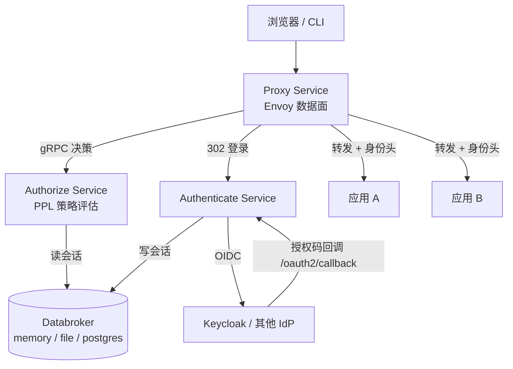
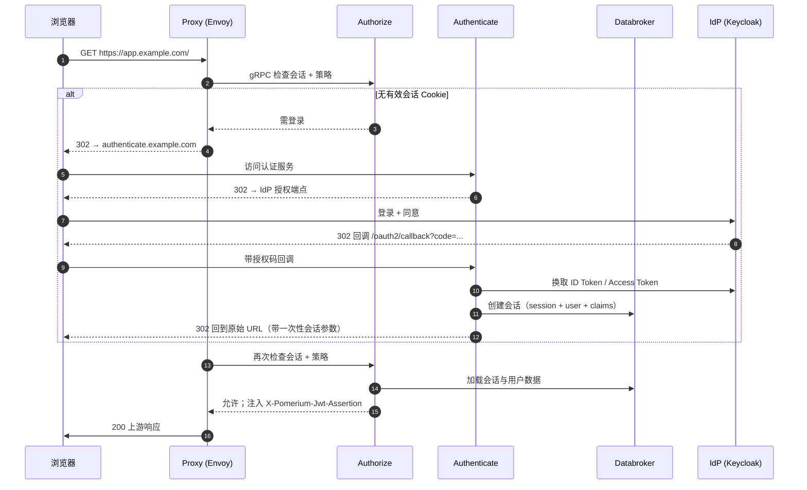

## 这篇讲什么

[Pomerium](https://www.pomerium.com/) 是一个把**认证与授权做进反向代理**的身份感知代理（Identity-Aware Proxy，IAP）。应用不需要写一行登录代码，也不需要通过 `auth_request` 之类的协议把判断权外挂给别的组件：请求先到 Pomerium，Pomerium 完成「你是谁、你能不能进、进哪个上游」，再把请求转发进去。

本文以**开源版 Pomerium Core**（Apache 2.0）为主，核心是 **proxy auth** 这条能力线：

- 代理式认证的请求链路和四个服务的分工；
- Core 能配什么、配不了什么（含 PPL 判据的开源/企业边界）；
- 上游应用如何**验证**身份（`X-Pomerium-Jwt-Assertion` + JWKS 验签），而不是盲信请求头；
- 部署形态（all-in-one / split、Docker、K8s Ingress Controller）与生产加固；
- 以及最重要的一点：**老教程里的 forward auth 配置在今天的 Pomerium 上已经不成立**。

**版本基线**：截至 2026-09，Pomerium 最新发布为 `v0.33.3`。下文所有配置键名与行为均以 v0.30+ 的配置格式为准（`routes:` 数组 + `idp_provider` 系列键）。

## proxy auth 的三种形态，先分清楚

「让代理替应用做认证」有三种流传很广的实现，语义完全不同，选错会直接决定后面能不能排错：

| 形态 | 代表 | 谁做策略执行 | 认证状态存在哪 | 应用是否改造 |
|------|------|--------------|----------------|--------------|
| **外挂式 Forward Auth** | Nginx `auth_request` + oauth2-proxy、Traefik ForwardAuth | 前置代理（Nginx/Traefik） | 认证服务的 Cookie | 不改，但依赖前置代理的插件协议 |
| **代理式 IAP** | **Pomerium**、Google IAP、Cloudflare Access | **身份代理自身**（数据面 + 控制面） | 代理的会话 Cookie + 内部 Databroker | 不改；需要身份时验签 JWT |
| **应用内 OIDC** | Spring Security、openid-client、authlib | 应用自己 | 应用自己的 Session | 每个应用都要改 |

关键区别在**策略执行点（PEP）和控制决策点（PDP）是否在同一个组件里**。Forward Auth 把「认证」外挂到前置代理，认证结果以子请求（`auth_request`）的 HTTP 状态码回传；Pomerium 则是自己就是数据面（基于 Envoy），路由级的策略在代理内部评估，认证、授权、会话是同一套模型。

> ⚠️ **本文写作时最重要的一个事实**：Pomerium 从 **v0.21 起移除了 forward auth 能力**，官方给出的理由直白到有点刺："Forward auth is removed (subpar security)"。配置里的 `forward_auth_url` 字段已在 protobuf 中标记为 `reserved`。也就是说，**网上大量「Pomerium + Nginx auth_request」的教程对当前版本无效**，本文后面专门有一节讲迁移路线。

## 架构：四个服务，一张决策链

Pomerium 由四个逻辑服务组成，可以一起跑，也可以拆开跑：

| 服务 | 职责 | 关键交互 |
|------|------|----------|
| **Proxy** | 数据面，基于 Envoy：TLS 终结、路由、注入身份头、转发到上游 | 每个请求向 Authorize 发 gRPC 决策请求 |
| **Authenticate** | 认证面：与 IdP 走 OIDC 登录，建立 Pomerium 会话 | 回调路径固定为 `/oauth2/callback` |
| **Authorize** | 决策面：读取会话 Cookie，评估路由的 PPL 策略 | 从 Databroker 加载会话数据 |
| **Databroker** | 状态面：存储会话、用户、目录数据（多副本时必须用 PostgreSQL） | 被 Authorize / Proxy 查询 |


```mermaid
graph TB
    Browser[浏览器 / CLI] --> Proxy[Proxy Service<br/>Envoy 数据面]
    Proxy -->|gRPC 决策| Authorize[Authorize Service<br/>PPL 策略评估]
    Authorize -->|读会话| Databroker[(Databroker<br/>memory / file / postgres)]
    Proxy -->|302 登录| AuthN[Authenticate Service]
    AuthN -->|OIDC| IDP[Keycloak / 其他 IdP]
    IDP -->|授权码回调 /oauth2/callback| AuthN
    AuthN -->|写会话| Databroker
    Proxy -->|转发 + 身份头| App1[应用 A]
    Proxy -->|转发 + 身份头| App2[应用 B]
```

### 一次代理认证请求的完整时序


```mermaid
sequenceDiagram
    autonumber
    participant U as 浏览器
    participant P as Proxy (Envoy)
    participant A as Authorize
    participant N as Authenticate
    participant D as Databroker
    participant I as IdP (Keycloak)

    U->>P: GET https://app.example.com/
    P->>A: gRPC 检查会话 + 策略
    alt 无有效会话 Cookie
        A-->>P: 需登录
        P-->>U: 302 → authenticate.example.com
        U->>N: 访问认证服务
        N-->>U: 302 → IdP 授权端点
        U->>I: 登录 + 同意
        I-->>U: 302 回调 /oauth2/callback?code=...
        U->>N: 带授权码回调
        N->>I: 换取 ID Token / Access Token
        N->>D: 创建会话（session + user + claims）
        N-->>U: 302 回到原始 URL（带一次性会话参数）
    end
    P->>A: 再次检查会话 + 策略
    A->>D: 加载会话与用户数据
    A-->>P: 允许；注入 X-Pomerium-Jwt-Assertion
    P->>U: 200 上游响应
```

几个容易踩的细节，都有版本含义：

- **回调路径**：v0.31 移除了 `authenticate_callback_path` 设置，现在**固定为 `/oauth2/callback`**，且挂在*认证服务域名*上（例如 `https://authenticate.example.com/oauth2/callback`），不是路由域名、也不是 `/.pomerium/callback`。IdP 侧 `redirect_uri` 必须与之一致，否则登录直接失败在 IdP 报 `redirect_uri_mismatch` 或回调 400/403。
- **JWT 有效期只有 5 分钟**：Pomerium 为每个被授权请求签发的 JWT，`exp = iat + 5min`。它是「请求级断言」，不是会话凭证——会话的生命周期由 Cookie 决定（默认 14h）。上游验签必须校验 `exp`，但不能把「JWT 还有效」理解成「会话没过期」。
- **Databroker 存储**：可选 `memory` / `file` / `postgres`。单副本用内存足够；**多副本必须 PostgreSQL**，否则各副本看到的会话状态不一致（Redis 后端自 v0.18 弃用、现已移除，老配置里的 Redis 存储设置会直接被拒绝）。

## 部署形态：all-in-one 还是 split

`services` 决定当前进程跑哪几个服务，默认 `all`：

```yaml
# 单进程：开发、测试、单机小规模
services: all
```

```yaml
# 拆分：生产常用「Proxy 多副本 + Authenticate/Authorize/Databroker 单点或独立扩缩」
services: proxy        # 另一个进程跑 authenticate,authorize,databroker
```

可选值：`all`、`authenticate`、`authorize`、`proxy`、`databroker`（`cache` 是 `databroker` 的历史别名）。

拆分时的端口与地址语义：

| 设置 | 说明 |
|------|------|
| `address` | HTTPS 监听地址，默认 `:443` |
| `http_redirect_addr` | 可选，把 80 端口重定向到 HTTPS |
| `authenticate_service_url` | 认证服务对外 URL，**自建 IdP 时必须设置** |
| `shared_secret` | 服务间互认证密钥（未设 `shared_secret_file` 时为必填） |

> 不设置 `authenticate_service_url` 和 IdP 时，Pomerium 默认使用官方的 Hosted Authenticate Service（`authenticate.pomerium.app`，内置 Cognito）。试验可以这样起步，但企业内部应用应自建认证服务并把 IdP 换成自己的 Keycloak/Entra ID 等。

## 代理认证的配置面（Core）

### 一条路由就是一整套策略

```yaml
routes:
  - from: https://grafana.internal.example.com
    to: http://grafana.monitoring.svc.cluster.local:3000
    pass_identity_headers: true
    idle_timeout: 5m
    timeout: 30s
    policy:
      - allow:
          and:
            - domain:
                is: example.com
            - claim/department:
                is: platform
      - deny:
          or:
            - email:
                is: ex-employee@example.com
```

`from` / `to` / `policy` 是骨架，其余是可选能力，常用的一组：

| 类别 | 设置 | 用途 |
|------|------|------|
| 身份透传 | `pass_identity_headers` | 向上游注入 `X-Pomerium-Jwt-Assertion`（全局或路由级，默认 `false`） |
| 身份透传 | `jwt_claims_headers` | 把指定 claim 复制成 `X-Pomerium-Claim-*` 明文头（**未签名**） |
| 路径处理 | `prefix_rewrite`、`regex_rewrite_pattern/substitution`、`host_path_regex_rewrite_*` | 上游路径与外部路径不一致时的改写 |
| 主机头 | `preserve_host_header`、`host_rewrite`、`host_rewrite_header` | 上游按 Host 分流/校验时的处理 |
| 请求头 | `set_request_headers`、`remove_request_headers`、`set_response_headers`、`rewrite_response_headers` | 头改写；**不要用它伪造身份头**（见下文验签部分） |
| 超时与韧性 | `idle_timeout`、`timeout`、`load_balancing_policy`、`outlier_detection`、`circuit_breaker_thresholds`、`health_checks` | 上游慢、抖动、雪崩时的保护 |
| 协议 | `cors_allow_preflight`、`allow_websockets`、`allow_spdy` | 预检与长连接 |
| 旁路 | `allow_public_unauthenticated_access`、`allow_any_authenticated_user` | 公开页面、仅要求登录 |
| 机器身份 | `bearer_token_format`、`identity_providers` | 让 CI/CD、Pod 用 Bearer Token 而不是浏览器登录 |
| 客户端覆盖 | `identity_provider_client_id` / `identity_provider_client_secret` | 路由级覆盖全局 OAuth 客户端（Core 支持） |

### PPL：策略语言本身是 Core 能力，判据有边界

Pomerium Policy Language（PPL）是 YAML 声明式策略，一条策略由「动作 + 逻辑操作符 + 判据 + 匹配器」组成：

- **动作**：`allow` / `deny`，`deny` 优先于 `allow`；至少一条 `allow` 命中且没有 `deny` 命中才放行。
- **逻辑操作符**：`and` / `or` / `not` / `nor`，可组合。
- **匹配器**：`is`、`is_not`、`in`、`not_in`、`starts_with`、`ends_with`、`contains`、`exists`。

**Core（开源版）可用的判据**（官方 PPL 判据表中列在开源范围内的全部）：

| 判据 | 说明 |
|------|------|
| `accept` / `reject` | 恒真 / 恒假，用于兜底规则 |
| `authenticated_user` | 只要已登录即命中 |
| `claim/<name>` | 匹配任意 IdP claim，例如 `claim/department`、`claim/family_name` |
| `domain` | 邮箱域匹配（`@` 之后部分） |
| `email` | 邮箱精确匹配 |
| `user` | IdP 侧用户 ID 匹配 |
| `source_ip` | 客户端 IP / CIDR 匹配 |
| `client_certificate` / `invalid_client_certificate` | 下游 mTLS 客户证书判断 |
| `device` | 设备身份（WebAuthn 注册后可用） |
| `http_method` / `http_path` | 方法与路径 |
| `cors_preflight` | 放行 CORS 预检 |
| `mcp_tool` | MCP 路由的工具名（建议写在 `deny` 里做工具黑名单） |
| `pomerium_routes` | 内部 `/.pomerium` 特殊路由（默认会加一条 allow） |

**企业版边界**（不是"配置写错了"，是版本能力差异）：

| 判据 | 可用范围 |
|------|----------|
| `date`、`day_of_week`、`time_of_day` | Pomerium Zero 或 Enterprise Console |
| `groups` | **仅 Enterprise**，且需要目录同步（Directory Sync） |
| `record` | **仅 Enterprise**，依赖外部数据源（External Data Sources） |

> 🔴 **开源版没有 `groups` 判据**。v0.20 起，`allowed_groups` 和 `groups` 判据对开源版被移除，官方建议**改用 IdP claims**。等价写法是把组信息放进 claim 再匹配：`claim/groups`（或 Keycloak 里自定义 claim 名，如 `claim/realm_roles`）。同名的 `jwt_groups_filter` 也是 Enterprise 特性。
>
> 这一点直接推翻了很多存量配置和文章里的 `groups.has: engineering` 示例——在 Core 上写 `groups` 会直接报配置错误，而不是静默失效。

## proxy auth 的关键接缝：上游如何信任身份

代理认证最容易被做错的一步在这里。Pomerium 认证完成后会把身份信息作为请求头注入上游，上游**必须验证签名**，否则任何能直连上游的进程都能伪造身份。

### 注入了哪些头

| 头 | 是否签名 | 产生条件 |
|----|----------|----------|
| `X-Pomerium-Jwt-Assertion` | ✅ 用 `signing_key` 私钥签名 | 路由开启 `pass_identity_headers: true` |
| `X-Pomerium-Claim-*` | ❌ 明文（如 `X-Pomerium-Claim-Email`） | 显式配置 `jwt_claims_headers` 后才有 |

签名 JWT 的标准 claim：

| claim | 值 |
|-------|-----|
| `iss` | 默认是路由主机名；设置 `jwt_issuer_format: uri` 时是 `https://<host>/` |
| `aud` | 路由主机名 |
| `iat` / `exp` | 签发时间 / 过期时间，`exp = iat + 5 分钟` |
| `sub` / `user` | IdP 侧的用户 ID |
| `email` | 用户邮箱 |
| `sid` | 会话 ID |
| `name` | 用户名（若 IdP 提供） |

**原始 IdP 的 ID Token 永远不会被转发**：Pomerium 用 IdP 的 claims 重新签发一枚自己的 JWT，签名密钥是 Pomerium 自己的 `signing_key`。所以上游验证的是 Pomerium 的签名，而不是 Keycloak 的。

### 上游验签的最小清单

```bash
# 1) 生成签名密钥（EC P-256 即可）
openssl ecparam -genkey -name prime256v1 -noout -out ec_private.pem
openssl ec -in ec_private.pem -pubout -out ec_public.pem
```

```yaml
# 2) 配置为全局设置，并给路由开启身份头
signing_key_file: /pomerium/ec_private.pem
routes:
  - from: https://app.example.com
    to: http://app.internal:8080
    pass_identity_headers: true
```

```bash
# 3) 公钥可以从 JWKS 端点取（上游应缓存并按 kid 轮换）
curl -s https://app.example.com/.well-known/pomerium/jwks.json | jq
```

上游校验四件事，缺一不可：

1. **签名**：从 `/.well-known/pomerium/jwks.json` 取 JWKS 验签（按 `kid` 选公钥，缓存但要有刷新路径）。
2. **`iss`**：与路由主机名一致（或 `uri` 格式下的 `https://<host>/`）。
3. **`aud`**：等于本路由主机名。**这一步在多路由共用一个 Pomerium 部署时是安全边界**——不做 `aud` 校验，A 应用就会接受为 B 应用签发的合法 JWT。
4. **`exp`**：5 分钟窗口，必须校验；同时注意时钟偏移容差不要开得过大。

Go（`github.com/golang-jwt/jwt/v5` + `github.com/MicahParks/keyfunc`）与 Python（`PyJWT[crypto]`）的典型实现：

```python
# Python：Flask + PyJWT，JWKS 缓存在进程内
import jwt
from jwt import PyJWKClient

JWKS_URL = "https://app.example.com/.well-known/pomerium/jwks.json"
jwks_client = PyJWKClient(JWKS_URL, cache_keys=True)

def require_identity(f):
    def wrapper(*args, **kwargs):
        token = request.headers.get("X-Pomerium-Jwt-Assertion")
        if not token:
            return jsonify({"error": "missing identity header"}), 401
        try:
            signing_key = jwks_client.get_signing_key_from_jwt(token)
            claims = jwt.decode(
                token,
                signing_key.key,
                algorithms=["ES256", "RS256"],
                audience="app.example.com",      # 必须校验 aud
                issuer="app.example.com",        # 与 jwt_issuer_format 保持一致
            )
        except jwt.PyJWTError as exc:
            return jsonify({"error": f"invalid identity: {exc}"}), 401
        request.identity = claims
        return f(*args, **kwargs)
    return wrapper
```

```go
// Go：手动校验 aud/iss，谨慎处理 MapClaims
claims := jwt.MapClaims{}
token, err := jwt.ParseWithClaims(raw, claims, func(t *jwt.Token) (any, error) {
    if _, ok := t.Method.(*jwt.SigningMethodECDSA); !ok {
        return nil, fmt.Errorf("unexpected alg: %v", t.Header["alg"])
    }
    return keyfunc.Keyfunc.Keyfunc() // 由 JWKS keyfunc 提供
}, jwt.WithAudience("app.example.com"), jwt.WithIssuer("app.example.com"))
if err != nil || !token.Valid {
    return http.StatusUnauthorized, nil
}
```

Nginx 做**上游**（不是前置）时，可以用子请求把断言交给一个验签侧车，或者在应用层验签；不要在 Nginx 里用 `set_header` 直接信任 `X-Pomerium-Claim-*`。

### 明文头只能用在内网隔离的前提上

`X-Pomerium-Claim-*` 是**未签名**的副本，转发规则也很朴素：多值 claim 会以逗号连接成单个字符串，嵌套 claim 会展平成点号命名（`resource_access.app.roles`），对象值直接跳过。

因此：

- 需要授权决策时，**永远用签名断言**（或自己解 claim），不要用明文头；
- 如果确实只想图省事读明文头，前提是上游**只能被 Pomerium 访问**（网络策略/安全组/Service 只暴露给 Proxy），并且显式 `remove_request_headers` 掉来自客户端的同名头，防止外部请求自带伪造头。

## 两条身份路径：浏览器登录与机器身份

Core 同时支持两类调用方：

| 调用方 | 凭据 | 配置 |
|--------|------|------|
| 人（浏览器） | 会话 Cookie（`_pomerium`，默认 14h） | IdP + `authenticate_service_url` |
| 机器（CI、Job、Pod、脚本） | `Authorization: Bearer <token>` | 路由级 `bearer_token_format` + 全局 `identity_providers` |

`bearer_token_format` 有四个取值：

- `default`：由 IdP 侧的 token 配置决定；
- `idp_access_token` / `idp_identity_token`：透传/校验登录 IdP 签发的 token（可用 `idp_access_token_allowed_audiences` 限制受众）；
- `jwt`：接受**任何你信任的签发方**签发的可验证 JWT，机器身份不必走浏览器登录：

```yaml
identity_providers:
  example:
    issuer: https://issuer.example.com
    audiences:
      - pomerium.example.com

routes:
  - from: https://api.internal.example.com
    to: http://api-backend
    bearer_token_format: jwt
    identity_providers: [example]      # 可选白名单；不写=接受所有已配置签发方
    policy:
      - allow:
          and:
            - claim/sub:
                is: system:serviceaccount:default:pom-tester
```

注意 `identity_providers` 这个复数映射**服务的是机器身份的签发方白名单**，不是「交互式登录可以配多个 IdP」。Core 的浏览器登录仍然只有一套 `idp_provider`（内置 `google/github/gitlab/azure/okta/oidc/...` 或任意 OIDC），要让不同人群走不同 IdP，需要 IdP 侧做联合（Keycloak IdP brokering），或使用 Enterprise Console 的多 IdP 管理面。

## 部署：Core 的三种落地方式

### 1）Docker Compose（可跑的完整最小环境）

下面这份 compose 用 Keycloak 做 IdP、`pomerium/verify` 做「会自己验签的上游示例」，适合把链路先跑通：

```yaml
services:
  keycloak:
    image: quay.io/keycloak/keycloak:26.3
    command: ["start-dev", "--http-port=8080"]
    environment:
      KC_BOOTSTRAP_ADMIN_USERNAME: admin
      KC_BOOTSTRAP_ADMIN_PASSWORD: admin
    ports:
      - "8080:8080"
    networks:
      default:
        aliases:
          - keycloak.localhost.pomerium.io

  pomerium:
    image: pomerium/pomerium:v0.33.3
    volumes:
      - ./config.yaml:/pomerium/config.yaml:ro
      - ./ec_private.pem:/pomerium/ec_private.pem:ro
    ports:
      - "443:443"
    networks:
      default:
        aliases:
          - authenticate.localhost.pomerium.io
          - verify.localhost.pomerium.io

  verify:
    image: pomerium/verify:latest
    environment:
      JWKS_ENDPOINT: https://pomerium/.well-known/pomerium/jwks.json
    expose:
      - "8000"
```

```yaml
# config.yaml
address: :443
authenticate_service_url: https://authenticate.localhost.pomerium.io

idp_provider: oidc
idp_client_id: pomerium-core
idp_client_secret: "<Keycloak 客户端密钥>"
idp_provider_url: http://keycloak.localhost.pomerium.io:8080/realms/internal
idp_scopes: [openid, email, profile, groups]

signing_key_file: /pomerium/ec_private.pem
cookie_secret: "<head -c32 /dev/urandom | base64 的 32 字节值>"
shared_secret: "<同样方式生成的另一个 32 字节值>"

routes:
  - from: https://verify.localhost.pomerium.io
    to: http://verify:8000
    pass_identity_headers: true
    policy:
      - allow:
          or:
            - domain:
                is: example.com
```

Keycloak 侧只需要三件事：建 realm、建用户、建一个 **Client**（Client authentication 打开，`Valid redirect URIs` 填 `https://authenticate.localhost.pomerium.io/oauth2/callback`）。

> 注意镜像 tag：`pomerium/pomerium:latest` 在升级时会静默跳版本，生产环境请固定到具体 patch 版本（如 `v0.33.3`），升级走灰度。

### 2）二进制 / 系统包（VM 单机）

Debian 系可以直接用 Cloudsmith 仓库：

```bash
curl -1sLf 'https://dl.cloudsmith.io/public/pomerium/pomerium/setup.deb.sh' | sudo -E bash
sudo apt install pomerium
sudo systemctl edit pomerium.service   # 追加 AmbientCapabilities=CAP_NET_BIND_SERVICE 以便绑定 443
```

配置放在 `/etc/pomerium/config.yaml`，`address: :443` + `http_redirect_addr: :80`，证书用 Autocert 自动签发（见下一节）。

### 3）Kubernetes（Ingress Controller 模式）

Pomerium 提供官方开源的 Ingress Controller，把 Ingress 资源直接翻译成路由，策略用注解表达：

```yaml
apiVersion: networking.k8s.io/v1
kind: Ingress
metadata:
  name: grafana
  annotations:
    ingress.pomerium.io/pass_identity_headers: "true"
    ingress.pomerium.io/policy: |
      allow:
        and:
          - domain:
              is: example.com
          - claim/department:
              is: platform
spec:
  ingressClassName: pomerium
  rules:
    - host: grafana.internal.example.com
      http:
        paths:
          - path: /
            pathType: Prefix
            backend:
              service:
                name: grafana
                port:
                  number: 3000
```

常用注解与路由设置一一对应：`policy`、`pass_identity_headers`、`allow_any_authenticated_user`、`allow_public_unauthenticated_access`、`bearer_token_format`、`timeout`、`idle_timeout`、`set_request_headers`、`remove_request_headers`、`rewrite_response_headers`、`prefix_rewrite`、`regex_rewrite_*`、`host_path_regex_rewrite_*`、`tls_skip_verify`、`tls_server_name`、`health_checks`、`load_balancing_policy`、`outlier_detection`、`circuit_breaker_thresholds`、`cors_allow_preflight`、`allow_websockets`、`allow_spdy`、`logo_url`、`description`、`depends_on`。Gateway API 也是官方支持的接入方式。

### 证书：Autocert 只在 Core 配置里生效

- **Autocert（ACME / Let's Encrypt）**：适合 Pomerium 直接暴露在公网、前面没有终止 TLS 的 LB 的场景，需要在 Core 的配置文件或环境变量里配置（Autocert 是 bootstrap 设置，Enterprise Console 里配不了），并用 Autocert Directory 在多服务间共享证书数据。
- **手动证书 / cert-manager**：Pomerium 在 K8s 里通常由 cert-manager 或 Ingress 层提供证书，配置里显式声明的证书优先于自动签发的证书。
- **网关模式**：如果前面有 LB 终止 TLS，Pomerium 只处理明文 HTTP 时务必保证上游网络不可直接访问，并正确设置 `x-forwarded-*` 相关选项。

## forward auth 移除后：与既有反向代理怎么共存

这是存量环境最现实的问题。既然 `auth_request` 路线没有了，拓扑只有下面几种选择：

| 拓扑 | 做法 | 适用 |
|------|------|------|
| **A. Pomerium 做最外层入口**（推荐） | DNS/负载均衡指向 Pomerium；上游是纯内网服务 | 新建、可迁移的入口层 |
| **B. Pomerium 在最外层，Nginx 退到第二层** | Pomerium `to:` 指向 Nginx（Nginx 再按 host/path 分发），Nginx 视为上游 | 已有大量 Nginx 路由规则，不想重写 |
| **C. K8s 内由 Pomerium Ingress Controller 接管** | Ingress 资源 + 注解策略；原有 Nginx Ingress 逐步下线 | 集群内应用，希望声明式管理 |
| **D. 保留 Nginx 在最外层，整站反代给 Pomerium** | Nginx 只做 L4/纯转发（`proxy_pass` 到 Pomerium，保留 Host 与 `X-Forwarded-*`），**认证仍由 Pomerium 做** | 需要 Nginx 承载 WAF/限流等横切能力 |

明确不要做的两件事：

- ❌ 不要再按老教程配 `forward_auth_url` + Nginx `auth_request` 这套组合——v0.21 起该能力不存在，配置会直接被拒或行为未定义；`/verify` 之类的端点也不再是受支持的对外接口。
- ❌ 不要在 Nginx 里把一个「认证子请求」的结果当成授权结论，再把请求直接转发给上游（绕过 Pomerium 的数据面）。这正是官方判定 forward auth"安全性欠佳"的场景：认证与策略执行被拆到了两个组件，Cookie/重定向/CSRF 语义在子请求里会失真。

## 生产加固与上线检查清单

- [ ] `signing_key_file` 已配置且私钥不入库；轮换有流程（JWKS 支持多 key，上游按 `kid` 选）。
- [ ] 上游对 `X-Pomerium-Jwt-Assertion` **验签**，并校验 `aud`、`iss`、`exp`。
- [ ] `shared_secret` / `shared_secret_file` 已设置；多服务部署（split 模式）所有实例一致。
- [ ] `cookie_secret` 为随机 32 字节；HTTPS 下 Cookie 不可被明文窃取；`cookie_http_only` 保持默认 `true`。
- [ ] 除非跨子域共享会话，不要设置 `cookie_domain`；设置即扩大会话暴露面。
- [ ] 多副本部署使用 PostgreSQL 作为 Databroker 存储（Redis 后端已移除）。
- [ ] 策略里没有使用本版本不支持的判据（`groups`、`record`、时间类判据属 Enterprise/Zero）。
- [ ] 健康检查打 `/ping` 或 `/healthz`；`/.pomerium/` 用户信息页与 `/.pomerium/sign_out` 可正常访问。
- [ ] 上游服务仅允许 Pomerium 的 Proxy 访问（NetworkPolicy / 安全组），并显式 `remove_request_headers` 掉客户端自带的身份头。
- [ ] 关键路由有回滚方案：DNS 指回旧入口，或暂时 `allow_public_unauthenticated_access` 只用于紧急止血（并立刻恢复）。

## 排错对照表

| 症状 | 根因 | 排查命令 / 修法 |
|------|------|-----------------|
| IdP 报 `redirect_uri_mismatch` | IdP 侧回调地址没填 `https://authenticate.<domain>/oauth2/callback` | 对照 IdP client 的 Valid redirect URIs；v0.31 起路径不可改 |
| 登录成功后回跳又要求登录（循环） | `authenticate_service_url` 与实际访问域名不一致，或 Cookie 域/HTTPS 不匹配 | `curl -I https://<app>/`；检查 Set-Cookie 的 Domain/Secure；不要在不需要时设置 `cookie_domain` |
| `claim/groups` 不命中 | IdP token 里没有该 claim；或查询的是 `groups` 判据（Core 不支持） | `curl -H "Authorization: Bearer ..." <idp>/.../userinfo \| jq .groups`；改用 `claim/...` |
| 上游返回 401/403（验签失败） | `aud` 校验用了错的域名、`exp` 超过 5 分钟窗口、JWKS 未刷新 | 解 JWT 看 `aud`/`iss`/`exp`；确认 JWKS 缓存有刷新 |
| 上游 502/503 | `to:` 地址在 Pomerium 网络命名空间不可达 | K8s 用 `svc.cluster.local` FQDN；Compose 用服务名；检查 NetworkPolicy |
| 身份头全是空的 | 路由没开 `pass_identity_headers`，或没配 `signing_key` | 两个一起检查；`jwt_claims_headers` 只影响 `X-Pomerium-Claim-*` |
| 配置启动即失败，提示未知字段 | 用了已移除的设置（`forward_auth_url`、Redis 存储、`authenticate_callback_path`、`allowed_groups`） | 按官方 upgrading 文档逐项替换（`groups`→`claim/*`，Redis→Postgres） |

## 与同类方案的定位对比

| 维度 | Pomerium Core | oauth2-proxy | Traefik ForwardAuth | Ory Oathkeeper |
|------|---------------|--------------|---------------------|----------------|
| 形态 | 代理式 IAP（自带数据面） | 外挂式 forward auth | 外挂式中间件 | 独立授权网关 |
| 策略粒度 | 路由级 PPL，判据丰富 | 全局白名单 + 少量头 | 中间件级 | Access Rules |
| 多 IdP（交互登录） | 单 provider（多 IdP 走 IdP 联邦或企业版） | 单实例单 provider | 取决于认证服务 | 取决于规则 |
| 上游身份信任 | 签名 JWT + JWKS | 明文头（需自行加固） | 明文头（需自行加固） | 明文头 / 转发 JWT |
| 机器身份 | `bearer_token_format: jwt` 等四种 | 无内建 | 无 | 有 |
| 运算符成本 | 中（Envoy + 四服务心智） | 低 | 中 | 中 |
| 适合 | 需要零信任接入、细粒度策略、多协议（HTTP/TCP） | 「登录后才能访问」的轻量统一入口 | 已有 Traefik 的集群 | API 优先的授权决策 |

一句话：**oauth2-proxy 解决「有没有登录」，Pomerium 解决「谁、在什么条件下、能访问哪条路由、上游凭什么信」**。

## 参考

- Pomerium 文档总入口：<https://www.pomerium.com/docs>
- 架构：<https://www.pomerium.com/docs/internals/architecture>
- 特殊路由与内部端点：<https://www.pomerium.com/docs/internals/special-routes>
- 身份验证到应用层（JWT 验签）：<https://www.pomerium.com/docs/capabilities/getting-users-identity>
- PPL 判据与匹配器：<https://www.pomerium.com/docs/internals/ppl>
- 机器身份 Bearer Token：<https://www.pomerium.com/docs/capabilities/bearer-token-access>
- 会话模型：<https://www.pomerium.com/docs/internals/sessions>
- Core 部署：<https://www.pomerium.com/docs/deploy/core>；K8s Ingress：<https://www.pomerium.com/docs/deploy/k8s/ingress>
- 升级与移除项：<https://www.pomerium.com/docs/deploy/upgrading>
- GitHub 仓库与 Release：<https://github.com/pomerium/pomerium>
- 上游验签示例应用：<https://github.com/pomerium/verify>
- 相关主题：[Pomerium Core 代理认证实战：Keycloak + JWT 验签]()、[oauth2-proxy 深度介绍]()、[Traefik ForwardAuth + Keycloak]()、[零信任身份架构]()、[JWT 深度解析]()
