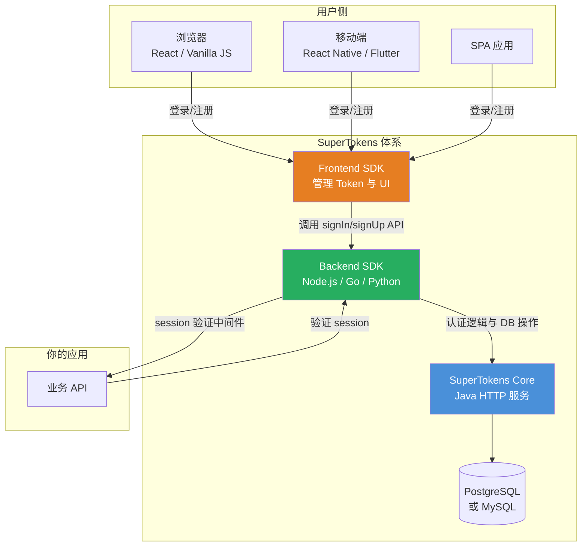

SuperTokens 是一个开源的、面向开发者的用户认证与会话管理方案，由 SuperTokens 团队于 2020 年创建，当前最新稳定版为 **v11.4.5**（2026 年 6 月发布），GitHub 15k+ star。核心用 Java 编写，提供 Node.js、Go、Python、React、React Native、Vanilla JS 等前端/后端 SDK，定位是 **Auth0 / Firebase Auth / AWS Cognito 的开源替代品**。

SuperTokens 的核心理念：**把认证做得像你自己写的一样可控，但省掉从头搭建的时间和安全风险。** 和 Keycloak 这类完整 IAM 平台不同，SuperTokens 选择做减法——只关注用户认证和会话管理，不涉及用户联邦、复杂协议代理或企业级身份编排。

## 核心设计思路

1. **三层架构抽象**：Frontend SDK（管理 session token + 渲染登录 UI）→ Backend SDK（提供 sign-up/sign-in/session refresh API）→ Core HTTP 服务（核心认证逻辑 + 数据库操作）。每一层都可以独立替换。
2. **协议隐藏而非暴露**：开发者不需要理解 OAuth 2.0 的 grant type、PKCE 或 Token 结构。调用 `signUp()`/`signIn()` 即可，SuperTokens 在后端 SDK 中处理所有协议细节。
3. **最小供应商锁定**：用户数据存在你自己的数据库中，切换 SuperTokens 不需要强制用户重新登录、重置密码或重新注册。
4. **功能解耦**：你可以只使用 SuperTokens 的登录功能，或只使用会话管理，甚至可以将会话管理与 Auth0 等其他登录提供商组合使用。

## 架构全景



**三层各自职责：**

- **Frontend SDK**：在浏览器/客户端管理 access token 和 refresh token 的生命周期——自动刷新、防 CSRF、XSS 防护、管理登录 UI 组件。React SDK 提供 `<SignInAndUp />` 等开箱即用的组件。
- **Backend SDK**：在你的 API 服务中运行，提供 `signUp()`、`signIn()`、`signOut()`、`verifySession()` 等函数。它通过 HTTP 与 Core 通信，同时暴露 REST 端点供前端 SDK 调用。
- **Core**：独立 Java 服务，运行核心认证逻辑、密码哈希（bcrypt/argon2）、数据库模式迁移和 API。Core 是 SuperTokens 唯一必须持久化运行的服务，通常以 Docker 容器部署。

## 核心功能

### 登录方式

| 方式 | 说明 | 适用场景 |
|------|------|---------|
| Email + Password | 邮箱密码登录 | Web / 移动端常规登录 |
| Phone + Password | 手机号密码登录 | 移动端优先应用 |
| Passwordless | 无密码登录（Magic Link / OTP） | 追求用户体验和安全性 |
| Social Login | Google、GitHub、Apple、Facebook 等 | B2C / SaaS 应用 |
| Custom Provider | 自定义 OAuth 2.0 / OIDC 提供商 | 企业 SSO |

### 会话管理

SuperTokens 的会话管理是其核心竞争力之一。与简单 JWT 方案不同，它内置了：

- **Access Token + Refresh Token 双 Token 机制**：access token 短期有效（默认 1 小时），refresh token 长期有效（默认 100 天），降低泄露风险。
- **自动 Token 刷新**：Frontend SDK 在 access token 过期时自动调用 refresh API，用户无感知。
- **Token 撤销**：支持单设备登出、全设备登出和基于时间的会话过期。
- **防 CSRF**：通过 `sAccessToken` cookie 的 `SameSite=Lax` 和自定义 header token 的双重防护机制。
- **防 XSS**：access token 默认不存储在 localStorage，而是存储在 HttpOnly cookie 中（可选 `antiCsrf: "VIA_TOKEN"` 时使用 header 方式）。

### 多租户与组织

从 v9.0 起，SuperTokens 支持多租户架构：

- 每个租户可以有独立的登录方式配置（如租户 A 用 Google SSO，租户 B 用 Email/Password）
- 租户级别的用户隔离
- 支持组织（Organization）级别的企业 SSO

### 多因素认证（MFA）

支持 TOTP（基于时间的一次性密码）和 SMS/Email OTP 作为第二因素。

### 用户角色

基于 RBAC 的简单角色和权限模型——用户可以被分配角色，角色对应一组权限。

## Docker 快速部署

```yaml
# docker-compose.yml
version: "3.8"
services:
  db:
    image: postgres:16-alpine
    environment:
      POSTGRES_USER: supertokens
      POSTGRES_PASSWORD: supertokens
      POSTGRES_DB: supertokens
    ports:
      - "5432:5432"
    volumes:
      - pgdata:/var/lib/postgresql/data
    healthcheck:
      test: ["CMD-SHELL", "pg_isready -U supertokens -d supertokens"]
      interval: 5s
      timeout: 5s
      retries: 5

  supertokens:
    image: registry.supertokens.io/supertokens/supertokens-postgresql:v11.4.5
    depends_on:
      db:
        condition: service_healthy
    ports:
      - "3567:3567"
    environment:
      POSTGRESQL_CONNECTION_URI: "postgresql://supertokens:supertokens@db:5432/supertokens"
      API_KEYS: "your-api-key-change-me"

volumes:
  pgdata:
```

启动后 Core 服务监听 `http://localhost:3567`，可以通过 Backend SDK 连接使用。

## SuperTokens vs Keycloak 对比

| 维度 | SuperTokens | Keycloak |
|------|-----------|----------|
| **定位** | 用户认证 + 会话管理 | 完整 IAM / IDaaS 平台 |
| **核心语言** | Java（Core） | Java（Quarkus） |
| **许可证** | 核心开源（有限制商业许可） | Apache 2.0 |
| **部署复杂度** | 低，Docker 单容器即可 | 中高，需 PostgreSQL + 可选的 Infinispan |
| **协议支持** | OAuth 2.0 / OIDC（通过第三方 IDP） | OIDC / SAML / OAuth 2.0 原生 |
| **用户联邦** | 不支持 | LDAP / AD / Kerberos |
| **身份代理** | 不支持 | 内置 Identity Broker |
| **开发者体验** | 极佳，SDK 封装层次高 | 中等，需理解 OAuth/OIDC 概念 |
| **前端 UI** | 内置 React 组件，可深度定制 | 需自行适配 Keycloak 主题 |
| **多租户** | v9.0+ 支持 | Realm 原生支持 |
| **生产验证** | 中小规模为主 | 大规模企业级验证 |
| **适用场景** | 应用嵌入认证、SaaS 多租户登录 | 企业 IAM、身份联邦、复杂协议对接 |

**一句话选型：** 如果你的需求是「给我的应用加上登录和会话管理，不想折腾 OAuth 协议」，选 SuperTokens；如果你需要「企业级身份联邦、LDAP 对接、SAML 或完整的 IAM 生命周期管理」，选 Keycloak。

## 常见问题（FAQ）

### Q1：SuperTokens 和 Auth0 有什么区别？

Auth0 是 SaaS 产品，你的用户数据存在 Auth0 的服务器上，按 MAU（月活用户）收费。SuperTokens 是自托管方案，用户数据存在你自己的数据库里，免费使用核心功能。如果你的团队对数据主权敏感、或用户量大到 Auth0 的计费模型不划算，SuperTokens 是更合适的替代。

### Q2：SuperTokens 能替换 Keycloak 吗？

取决于场景。如果你用的是 Keycloak 的用户登录和会话管理功能，SuperTokens 可以提供更简洁的替代方案。但如果你依赖 Keycloak 的 LDAP/AD 联邦、SAML 协议代理、自定义 SPI 或 Realm 多租户隔离，SuperTokens 无法替代——它的定位就不是一个完整的 IAM 平台。

### Q3：SuperTokens 支持 OIDC / SAML 吗？

SuperTokens Core 本身不充当 OIDC Provider 或 SAML IdP，但它可以对接第三方 OAuth 2.0 / OIDC 提供商作为企业 SSO。如果你需要对外提供 OIDC Provider 能力，需要配合 Keycloak 或在 SuperTokens 前面自行搭建 OIDC 层。

### Q4：SuperTokens 的许可证有什么限制？

SuperTokens Core 使用了一种自定义开源许可，允许免费自托管使用。存在商业版功能（如企业 SSO、高级 MFA）需要付费。在正式用于商业项目前，建议仔细阅读 [SuperTokens 官网许可页](https://supertokens.com/pricing)。

更多源码和文档参见 [SuperTokens GitHub](https://github.com/supertokens/supertokens-core)，部署指南参考 [官方文档](https://supertokens.com/docs)。如需对比其他方案，参见本书 [第17章：IDaaS 方案全景对比]()。
