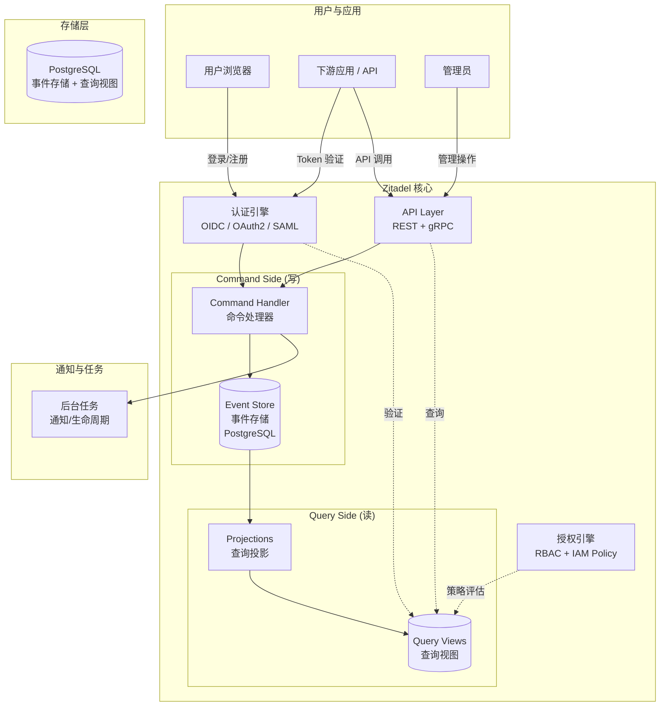

## Zitadel 简介

Zitadel 是一个用 Go 编写的开源身份与访问管理平台，截至 2026 年 7 月最新稳定版为 **v4.15.3**（AGPL-3.0 许可证），GitHub 约 14,300 星。项目的核心理念是"Identity infrastructure, simplified for you"——通过事件驱动架构和原生多租户设计，把身份基础设施的复杂性封装成简洁的 API 和管理界面。

一句话定位：**事件溯源架构 + CQRS + 原生多租户的开源 IAM，适合需要完整审计追踪和多租户隔离的服务型平台**。

| 维度 | 信息 |
|------|------|
| 项目 | [github.com/zitadel/zitadel](https://github.com/zitadel/zitadel) |
| 语言 | Go (后端) + TypeScript/Angular (前端) |
| 数据库 | PostgreSQL（推荐）或 CockroachDB |
| 许可证 | AGPL-3.0 |
| 文档 | [zitadel.com/docs](https://zitadel.com/docs) |
| 在线 SaaS | [zitadel.cloud](https://zitadel.cloud) |

## 核心设计哲学

Zitadel 的设计和其他 IAM 有一个根本性的不同：**它把"发生了什么"当作一等公民存储，而不是只存"当前状态是什么"**。这来自于三个核心选择：

1. **Event Sourcing（事件溯源）**：不存储用户/项目的"当前快照"。每个操作——创建用户、修改密码、变更角色——都记录为不可变事件。当前状态是重放所有事件计算出来的。这意味着任何时间点的状态都可以追溯，任何变更都有完整审计线索。

2. **CQRS（命令查询职责分离）**：写操作（命令）和读操作（查询）走不同的数据路径。命令生成事件，事件被投影到查询优化的视图。这让 Zitadel 可以独立扩展读写能力，尤其适合读多写少的身份场景。

3. **原生多租户**：从数据库 Schema 到 API 路由，多租户不是后加的特性，而是骨子里的设计。每个"Instance"（实例）可以有多个"Organization"（组织），每个 Organization 有独立的用户、项目、应用、授权策略。

## 架构全景



这个架构有几个值得展开的要点：

**写路径（Command Side）**：管理员创建用户、修改 OIDC 应用配置、设置授权策略——这些操作通过 gRPC/REST API 进入 Command Handler，校验后写入 Event Store。Event Store 中的事件是只追加（append-only）、不可变的。每个事件都带有序号和时间戳，形成完整的变更链。

**读路径（Query Side）**：Event Store 中的事件通过 Projection 机制转换为查询优化的视图。例如，"用户列表"视图是 `user.added`、`user.changed`、`user.deactivated` 等事件的重放结果。API 查询用户时，走的是查询视图而不是回放事件，保证响应速度。

**认证路径**：OIDC/OAuth2/SAML 认证流程由认证引擎处理，它需要读用户状态（查询视图）和写登录事件（命令）。Zitadel 同时实现了 OpenID Provider、OAuth 2.0 Authorization Server 和 SAML 2.0 IdP 角色，支持 Authorization Code Flow + PKCE、Client Credentials、Device Code、Token Exchange、JWT Profile 等。

## 协议支持

Zitadel 的协议支持全面且现代化：

| 协议 | 支持程度 | 说明 |
|------|----------|------|
| OIDC | 完整支持 | 包括 Discovery、Dynamic Client Registration、RP-Initiated Logout |
| OAuth 2.0 | 完整支持 | 支持 Authorization Code + PKCE、Client Credentials、Device Code、Token Exchange、JWT Profile、mTLS |
| SAML 2.0 | 支持 | SP-initiated 和 IdP-initiated SSO |
| SCIM | 实验性 | 用户/组生命周期管理 |
| LDAP | 通过 LDAP 服务组件 | 为传统应用提供 LDAP 绑定认证 |

FIDO2/WebAuthn 支持是 Zitadel 从早期版本就内置的能力，支持平台认证器（如 Touch ID、Windows Hello）和跨平台认证器（如 YubiKey）。Passkeys 作为 FIDO2 的演进，也被完整支持。

## 多租户模型

Zitadel 的多租户模型分三层，这是它区别于 Keycloak 等单 Realm 多 Client 模型的关键差异：

```
Instance（实例）
 └── Organization（组织）
      ├── Project（项目）
      │    ├── Application（OIDC/SAML/API）
      │    └── Roles（项目级角色）
      ├── Users（用户，可跨组织共享）
      └── Grants（授权，跨组织资源访问）
```

- **Instance**：Zitadel 部署的顶级容器。一个 Instance 有独立的域名、品牌、安全策略和数据库。如果你运营一个多租户 SaaS Zitadel，每个客户可以有自己的 Instance。
- **Organization**：Instance 内的租户。组织之间的用户数据默认隔离。一个组织内可以有多个 Project，每个 Project 可以有多个 Application（OIDC Client、SAML SP、API）。
- **Grants**：跨组织的授权机制。例如，组织 A 的用户可以被授予访问组织 B 的某个 Project 的权限。

对比 Keycloak：Keycloak 用 Realm 实现租户隔离，每个 Realm 完全独立。Zitadel 的 Organization 更轻量，创建成本更低，Grant 机制让跨租户授权比 Keycloak 的 Identity Brokering 更直接。

## 授权模型

Zitadel 的授权分两层：

**RBAC 层**：标准的角色-权限映射。Role 可以定义在 Organization 级别或 Project 级别。用户通过授权（Authorization/Grant）获得角色。

**IAM Policy 层**：使用一种称为"ZITADEL Manager Role"的管理角色体系，细粒度控制谁能管理 Instance、Organization、Project 等资源。IAM Policy 本身也是事件溯源的一部分——谁在何时创建/修改了某条策略，都有完整记录。

这比很多 IAM 的"超级管理员一把梭"要精细得多，但配置复杂度也更高。对于中小企业场景，Zitadel 的默认角色（Org Owner、Project Owner）通常就够了。

## 快速部署（Docker）

```yaml
# docker-compose.yml
services:
  zitadel:
    restart: always
    image: ghcr.io/zitadel/zitadel:v4.15.3
    command: start-from-init --masterkey "MasterkeyNeedsToHave32Characters" --tlsMode disabled
    ports:
      - "8080:8080"
    depends_on:
      db:
        condition: service_healthy

  db:
    restart: always
    image: postgres:16-alpine
    environment:
      POSTGRES_USER: zitadel
      POSTGRES_PASSWORD: zitadel
      POSTGRES_DB: zitadel
    healthcheck:
      test: ["CMD-SHELL", "pg_isready -U zitadel -d zitadel"]
      interval: 5s
      timeout: 5s
      retries: 5
    volumes:
      - pg_data:/var/lib/postgresql/data

volumes:
  pg_data:
```

启动后访问 `http://localhost:8080/ui/console`，使用默认管理员登录（用户名 `zitadel-admin@zitadel.localhost`，密码 `Password1!`）完成初始化。

**生产环境要点**：
- 使用外部 PostgreSQL（高可用）而非 Docker 内置
- 配置 TLS 证书（生产环境不要用 `tlsMode disabled`）
- Masterkey 必须安全存储，它是加密事件存储和敏感数据的根密钥
- 开启审计日志导出到外部系统（如 ELK/Loki）
- 对于 Kubernetes 部署，官方提供 Helm Chart

## Zitadel vs Keycloak 对比

| 维度 | Zitadel | Keycloak |
|---|---|---|
| **技术栈** | Go + Angular | Java/Quarkus |
| **最新版本** | v4.15.3 | 26.x（社区） |
| **许可证** | AGPL-3.0 | Apache 2.0 |
| **数据模型** | 事件溯源 + CQRS | 传统 ORM（JPA/Hibernate） |
| **审计能力** | 天然完整审计（所有操作都是事件） | 依赖 Event Listener 扩展 |
| **多租户** | 原生三层模型（Instance/Org/Project） | Realm 隔离，较重量级 |
| **协议支持** | OIDC、OAuth2、SAML、SCIM(实验)、LDAP | OIDC、OAuth2、SAML、LDAP、Kerberos |
| **Passkeys** | 原生支持，集成度高 | 支持，需配置 WebAuthn |
| **部署** | 单二进制/Docker/K8s Helm | Operator/Helm/Docker |
| **资源占用** | 较低（Go 单二进制 ~50MB） | 中等（JVM，~500MB 起步） |
| **扩展性** | 读写分离可独立扩展 | 水平扩展（Infinispan 缓存同步） |
| **社区成熟度** | 增长中，14k+ star | 成熟，Red Hat 背书 |
| **中文体验** | 界面不支持中文（英文为主） | 界面支持中文（翻译偏生硬） |
| **备份恢复** | 事件重放机制，PostgreSQL 级别备份 | 数据库导出/导入 + 文件备份 |
| **企业功能** | 审计日志导出、SAML、LDAP 等在开源版中 | 集群、跨 DC 复制、令牌撤销等 |

### 选择建议

**选 Zitadel 的场景**：
- 需要完整审计追踪（金融、医疗等合规行业）
- 多租户 SaaS 平台，需要轻量租户隔离
- 团队以 Go 技术栈为主
- 看重 Passkeys/FIDO2 的原生体验
- 偏好事件驱动架构，愿意承担 CQRS 的学习成本

**选 Keycloak 的场景**：
- 需要最全面的协议支持和最成熟的生态
- 团队熟悉 Java 生态
- 已有 Keycloak 运维经验或 Red Hat 技术栈
- 需要支撑超大规模（10 万+ 用户）场景
- 社区中文资源丰富，问题更容易搜到

**两者结合**：可以用 Zitadel 做面向客户的多租户认证（利用其原生多租户和审计能力），Keycloak 做企业内部应用的 SSO 中心。通过 OIDC 联合可以互相信任。

## 常见误区

| 误区 | 实际情况 |
|------|----------|
| "Zitadel 是 Web 3.0 / 区块链 IAM" | 不是。Zitadel 是传统的中英化 IAM，事件溯源不等于区块链 |
| "事件溯源会让查询变慢" | 不会。CQRS 将查询和写入分离，查询走预构建的投影视图，性能不差于传统 ORM |
| "AGPL-3.0 意味着不能用" | AGPL 对 SaaS 使用有约束（需要开源），但如果你只是部署内部使用、不对外提供认证服务，通常不会有问题。商业 SaaS 场景需评估或联系商业许可 |
| "Go 写的比 Java 快很多" | Go 在启动速度和内存占用上有优势，但 Keycloak 的 Quarkus 版本已大幅优化，稳态性能差距不大 |

## 小结

Zitadel 是一个设计理念先进的开源 IAM：事件溯源提供了天然的审计能力，CQRS 带来了读写分离的弹性，原生多租户让 SaaS 场景的租户管理变得简洁。它的 Go 技术栈和单二进制部署对云原生团队友好，FIDO2/Passkeys 的原生支持也比大部分竞品更到位。

代价是 AGPL-3.0 许可证对商业 SaaS 有约束，社区成熟度和中文资源仍远不及 Keycloak。如果你的团队能够接受事件驱动架构的学习曲线，并且在审计合规和多租户方面有明确需求，Zitadel 值得认真评估。

> 📖 延伸阅读：
> - [Keycloak 核心架构]() — 了解 Keycloak 的 Realm/Client/User Federation 设计
> - [IDaaS 方案全景对比]() — Zitadel、Keycloak、Authentik、Casdoor 等方案的综合选型框架
> - [授权模型深度对比 — RBAC、ABAC 与 ReBAC]() — 为 Zitadel 的 RBAC + Policy 授权模型提供理论背景
