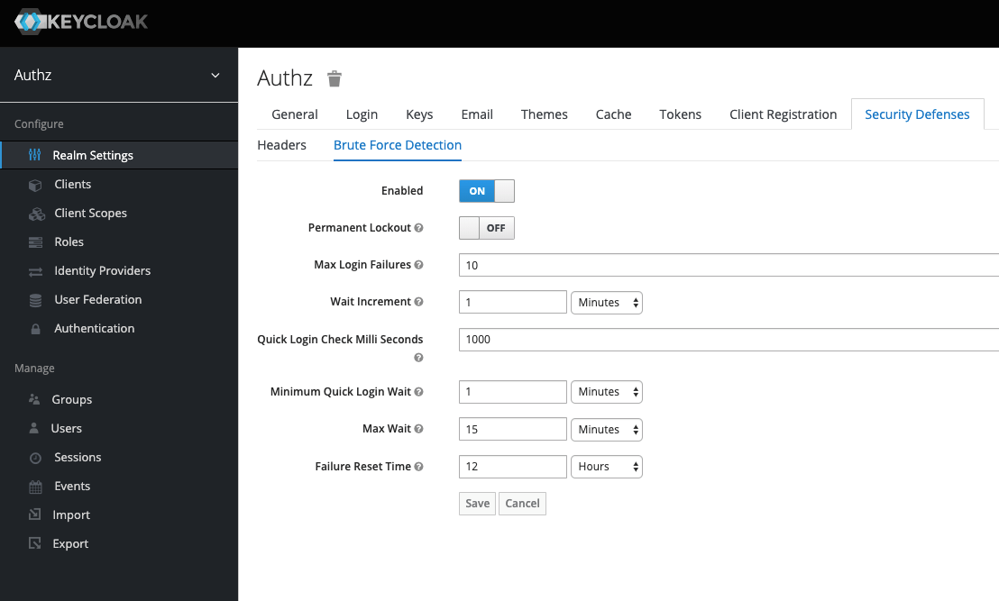
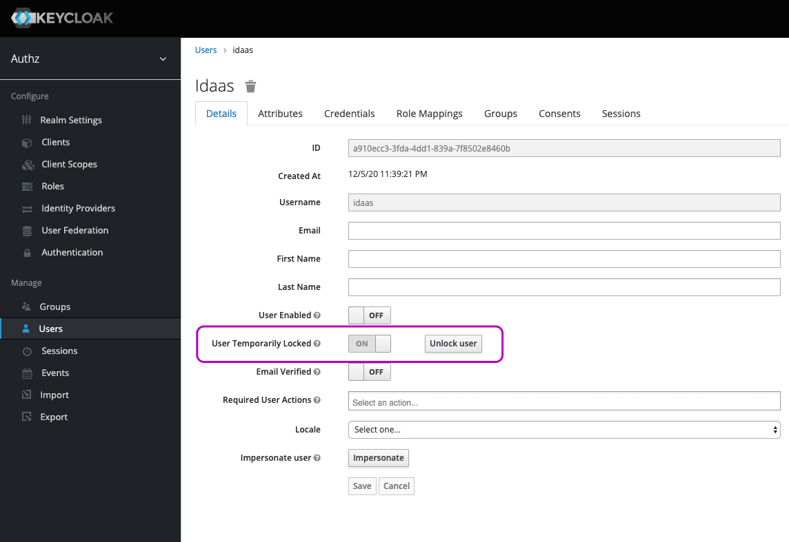
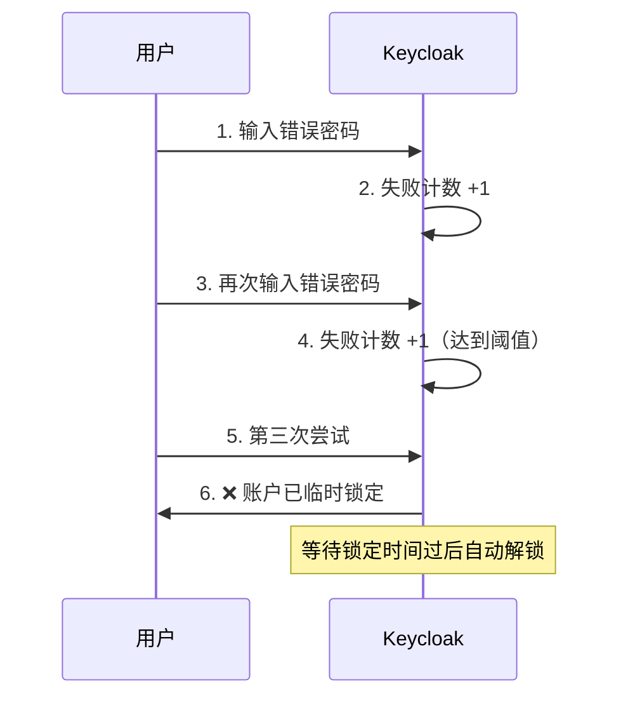

Brute Force Detection 暴力检测，防止密码暴力破解，登录失败 N 次锁定。

## 启用暴力检测

控制台选择 Realm，设置：Realm Settings -> Security Defenses -> Brute Force Detection。

- Permanent Lockout

  ON 表示永久锁定。  
  OFF 表示临时锁定。

- Max Login Failures

  登录失败达到多少次时，锁定账号。

- Quick Login Check Milli Seconds

  快速登录检测，两次登录请求之间的时间间隔（单位毫秒）小于该值时，则认定为快速登录。

- Minimum Quick Login Wait

  一旦被认定为快速登录，该账号将被临时锁定为该配置项配置的时长。

## 解除锁定

1. 临时锁定用户，达到锁定时长后，会自动解锁。
2. 管理员在用户列表或用户详情里可以手动解锁。

   

## 注意事项

1. 失败次数统计仅与登录账号相关，与会话无关，关闭重启浏览器，次数不会重置。
2. 用户锁定后，给出的错误提示还是默认的用户名密码错误，就是不想让攻击者知道用户暂时被禁用了。
## 工作原理

Keycloak 在 Realm 级别维护一个登录失败计数器。当用户在配置的时间窗口内连续登录失败达到阈值时，账户被临时锁定。

## 配置参数

在 Realm Settings > Security Defenses > Brute Force Detection 中配置：

| 参数 | 建议值 | 说明 |
|------|--------|------|
| Minimum Quick Login Wait | 1 秒 | 两次登录最短间隔，阻止自动化攻击 |
| Max Login Failures | 5 次 | 触发锁定的失败次数 |
| Wait Increment | 1 分钟 | 每次触发后锁定时间递增 |
| Quick Login Check | 1 秒 | 检测快速登录的时间窗口 |
| Max Wait | 15 分钟 | 单次锁定最长等待时间 |
| Failure Reset Time | 12 小时 | 失败计数器重置周期 |
| Permanent Lockout | 关闭 | 不建议开启——需管理员手动解锁 |

## 生产环境建议

- **生产环境务必开启**，配合强密码策略使用
- 监控 `keycloak_login_failures` 指标，设置告警
- 白名单内网 IP 段（通过自定义 Authenticator 实现）
- 结合 WAF/API Gateway 做外层速率限制，Keycloak 做内层账户保护
- 定期检查 `EVENT_LOG` 表中的 `LOGIN_ERROR` 事件，识别被攻击的账号
