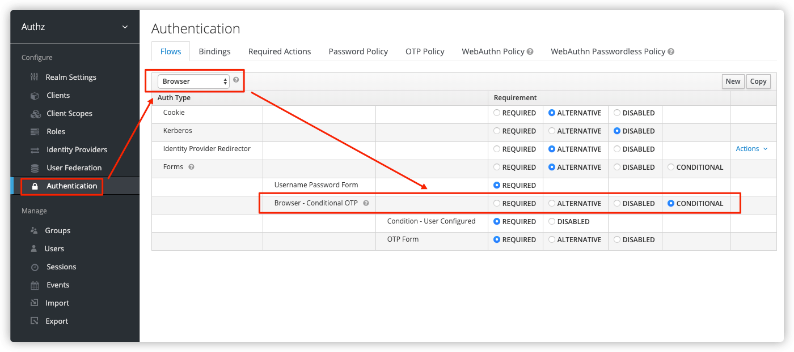
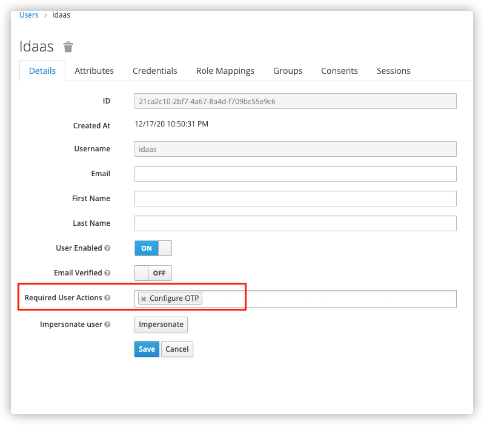
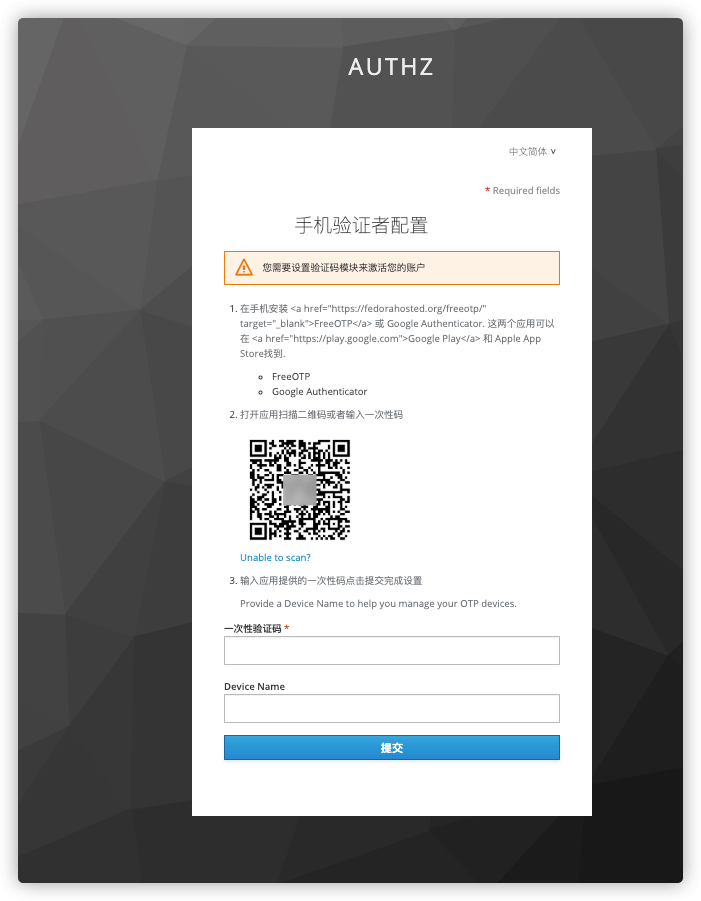
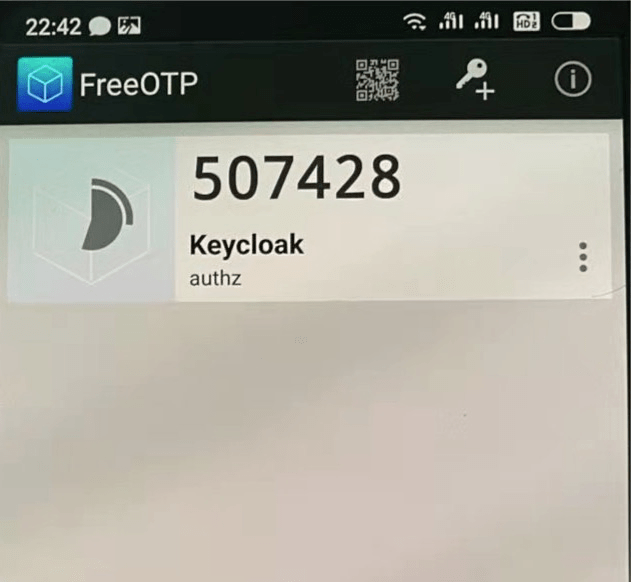
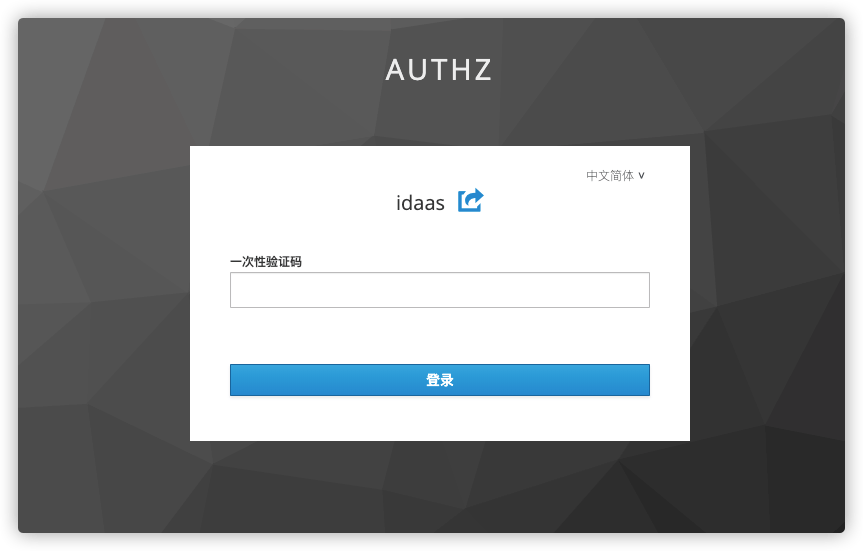
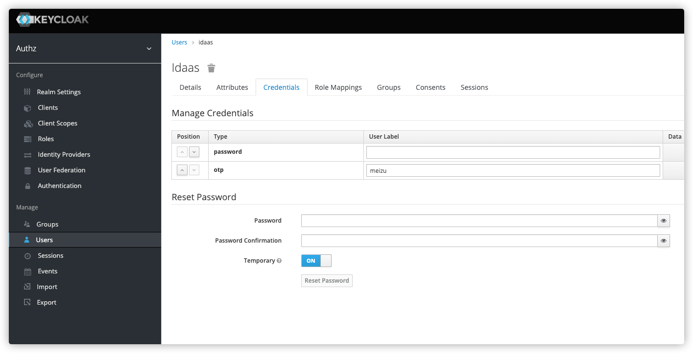
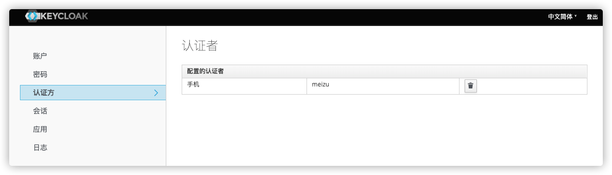

**MFA** 即 Multi-Factor Authentication，多重身份认证，多因子认证，多因素认证。当然也包含等保要求中常说的双因子认证 2FA。

常见的实现如 U 盾、短信、邮件、指纹识别、面部识别等，在账户+密码基础上，进行二次或多次认证，增强数据安全。

Keycloak 提供了基于 OTP（One-Time Password，一次性密码，动态口令）的开箱即用的解决方案。

## 使用步骤

直接上图看效果。

1. 各个 Realm 默认的浏览器认证流中，OTP 是`CONDITIONAL`，是一个条件可选项。
   
2. 为用户配置启用 OTP 认证。
   
3. 用户登录，未注册设备，要求注册设备。
   
4. 手机端下载支持的 OTP 软件，如 FreeOTP，Google Authenticator。扫描注册，注册成功后就能看到已经生成一次性口令。
   
5. 登录时就会要求输入一次性验证码。
   
6. 注册成功后，可以在管理控制台看到用户注册的设备，用户也可以在自己的账户页面看到注册的设备。如果手机丢了想重新注册，把已有的记录删掉就可以，删掉后下次登录会要求重新注册。  
   管理控制台:
   
   自己的账户页面：  
   

## 扩展认证方式

如果想自己实现认证方式，官方也提供了详细的 SPI 开发指导，我们根据指导用一天时间实现了一个短信验证码。待开源。

## WebAuthn / Passkey 无密码认证

Keycloak 自 15.x 版本开始原生支持 **WebAuthn**（W3C Web Authentication），并在后续版本中逐步加入 **Passkey** 支持（包括 Conditional UI / autofill 体验和 Modal UI）。截至 Keycloak 26.x，WebAuthn 已成为生产可用的成熟功能，支持两种使用模式：

### 双因素模式（Two-Factor WebAuthn）

WebAuthn 作为第二因素，在用户输入密码后要求验证——与 TOTP 并列可选。适合需要增强安全但还不准备放弃密码的场景。

**配置步骤：**

1. 进入 **Authentication** → **Flows**，选择要修改的 **Browser** 认证流（建议先复制一份再改）
2. 在 **Browser Flow** 的 **Forms** 子流中，找到 **OTP Form**，点击 **Actions** → **Add step**，添加 **WebAuthn Authenticator**
3. 将 **WebAuthn Authenticator** 设置为 `ALTERNATIVE`（与 OTP Form 同级），这样用户可以选择用 OTP 还是 WebAuthn 作为第二因素
4. 保存后，用户登录时即可选择注册安全密钥或平台认证器（Windows Hello、Touch ID 等）

### 无密码模式（Passwordless WebAuthn）

允许用户完全跳过密码，直接用 WebAuthn 认证器登录。配置方式：

1. 进入 **Authentication** → **Flows**，复制 **Browser** 流，命名为 **Browser - Passwordless**
2. 删除 **Cookie** 之前的所有步骤（包括 Username/Password Form 和 OTP Form）
3. 添加 **WebAuthn Passwordless Authenticator** 作为主要认证步骤，设置为 `REQUIRED`
4. 进入 **Authentication** → **Bindings**，将 **Browser Flow** 绑定到刚创建的 Passwordless 流
5. 用户在账户页面注册 Passkey（安全密钥或平台生物认证）后，即可无密码登录

> **注意**：无密码模式需要 Keycloak 开启 User Registration（注册），且建议配合 **Recovery Codes** 作为备用恢复机制，避免设备丢失后无法登录。

### Passkey Conditional UI（自动填充体验）

从 Keycloak 25.x 开始，支持 Passkey Conditional UI——用户在用户名/密码输入框获得焦点时，浏览器自动弹出 Passkey 选择器，用户选择后一键完成认证，无需先输入用户名。启用方式：

1. 在认证流中添加 **Passkey Authenticator** 步骤，放在 Username Form 之前
2. 设置为 `ALTERNATIVE`，与密码认证并列
3. 浏览器端不需要额外配置，只要用户设备支持（Windows Hello、Apple Touch ID、Android 生物识别），即可自动触发

### 支持的认证器类型

| 类型 | 示例 | 适用场景 |
|------|------|----------|
| **Platform Authenticator**（平台内置） | Windows Hello、Apple Touch ID / Face ID、Android 生物识别 | 日常办公、个人设备 |
| **Cross-Platform Authenticator**（外部硬件） | YubiKey 5 系列、Feitian ePass、Google Titan Key | 管理员、高安全合规（等保/PCI DSS） |

### 常见问题

**Q: WebAuthn 和 Passkey 是什么关系？**  
Passkey 是 WebAuthn 的消费者品牌名称（FIDO Alliance + Apple/Google/Microsoft 联合推广）。技术上 Passkey = FIDO2 可同步凭据（multi-device credential），支持通过平台账户（iCloud、Google 账户）端到端加密跨设备同步。WebAuthn 也包括不可同步的设备绑定凭据（如部分 YubiKey 的本地密钥）。

**Q: 用户换了新手机，Passkey 还能用吗？**  
如果使用平台同步的 Passkey（如 iCloud Keychain 中的），可以在新设备上通过同一平台账户恢复；如果使用硬件安全密钥（YubiKey 等），需要提前注册备用密钥或恢复码。

**Q: Keycloak 中 WebAuthn 的 Attestation 验证需要开启吗？**  
默认 Keycloak 不强制验证认证器的 Attestation（证明认证器型号/安全等级的签名）。如需限制只能使用特定认证器（如仅 FIDO 认证的设备），可在 **WebAuthn Policy** 中将 Attestation Conveyance 设置为 `direct` 或 `indirect`。

更多 WebAuthn/Passkey 协议层面的说明，见 [第 11 章：多因素认证]()。

## 名字解释

**OTP** One-Time Password，一般翻译为一次性密码、动态口令、动态验证码。

**HOTP** HMAC-based One-Time Password，使用计数方式基于 HMAC 算法加密。算法协议为 [RFC 2104](https://tools.ietf.org/html/rfc2104).

**TOTP** Time-based One-Time Password，基于时间戳算法，是时间同步，基于客户端的动态口令和服务器的时间比对，一般每 N 秒产生一个新口令，要求客户端和服务器能够保持正确的时钟，客户端和服务端基于时间计算的动态口令才能一致。算法协议为 [RFC 6238](https://tools.ietf.org/html/rfc6238).

## 进一步阅读

- [Passkey / WebAuthn / FIDO2 IAM 企业落地指南]()：FIDO2 协议 Mermaid 流程图解、Keycloak Passkey Conditional UI 配置、企业恢复策略与常见踩坑

开源实现

- [FreeOTP](https://github.com/freeotp)。
- [Google Authenticator](https://github.com/google/google-authenticator)。
