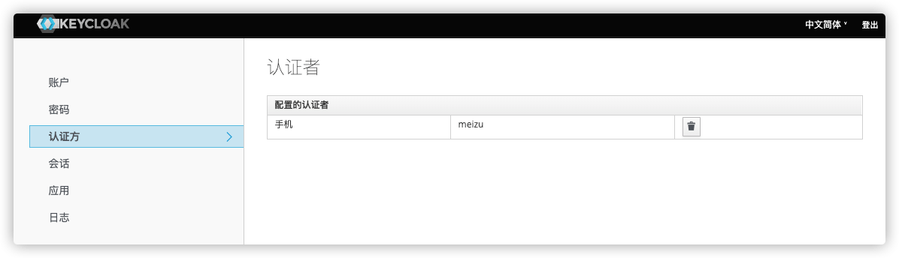

**MFA** 即 Multi-Factor Authentication，多重身份认证，多因子认证，多因素认证。当然也包含等保要求中常说的双因子认证 2FA。

常见的实现如 U 盾、短信、邮件、指纹识别、面部识别等，在账户+密码基础上，进行二次或多次认证，增强数据安全。

Keycloak 提供了基于 OTP（One-Time Password，一次性密码，动态口令）的开箱即用的解决方案。

## 使用步骤

直接上图看效果。

1. 各个 Realm 默认的浏览器认证流中，OTP 是`CONDITIONAL`，是一个条件可选项。
   
2. 为用户配置启用 OTP 认证。
   
3. 用户登录，未注册设备，要求注册设备。
   
4. 手机端下载支持的 OTP 软件，如 FreeOTP，Google Authenticator。扫描注册，注册成功后就能看到已经生成一次性口令。
   
5. 登录时就会要求输入一次性验证码。
   
6. 注册成功后，可以在管理控制台看到用户注册的设备，用户也可以在自己的账户页面看到注册的设备。如果手机丢了想重新注册，把已有的记录删掉就可以，删掉后下次登录会要求重新注册。  
   管理控制台:
   
   自己的账户页面：  
   

## 扩展认证方式

如果想自己实现认证方式，官方也提供了详细的 SPI 开发指导，我们根据指导用一天时间实现了一个短信验证码。待开源。

## 名字解释

**OTP** One-Time Password，一般翻译为一次性密码、动态口令、动态验证码。

**HOTP** HMAC-based One-Time Password，使用计数方式基于 HMAC 算法加密。算法协议为 [RFC 2104](https://tools.ietf.org/html/rfc2104).

**TOTP** Time-based One-Time Password，基于时间戳算法，是时间同步，基于客户端的动态口令和服务器的时间比对，一般每 N 秒产生一个新口令，要求客户端和服务器能够保持正确的时钟，客户端和服务端基于时间计算的动态口令才能一致。算法协议为 [RFC 6238](https://tools.ietf.org/html/rfc6238).

开源实现

- [FreeOTP](https://github.com/freeotp)。
- [Google Authenticator](https://github.com/google/google-authenticator)。
