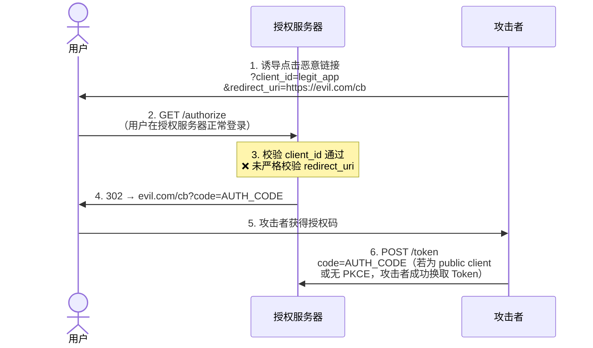
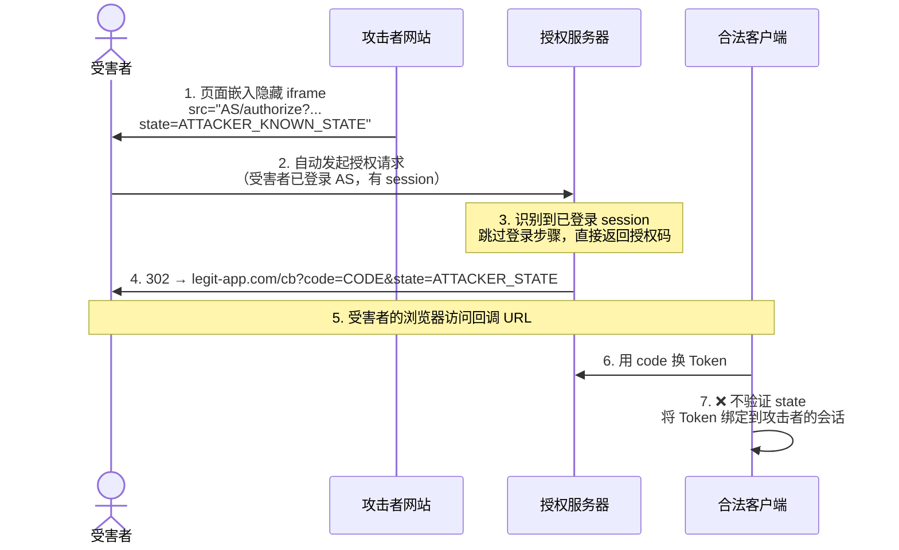
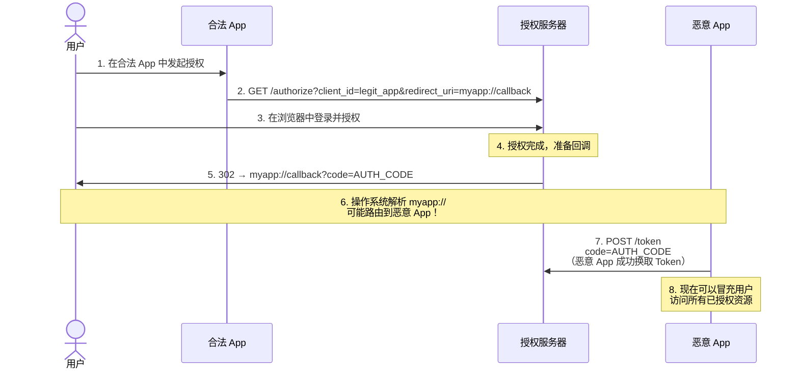
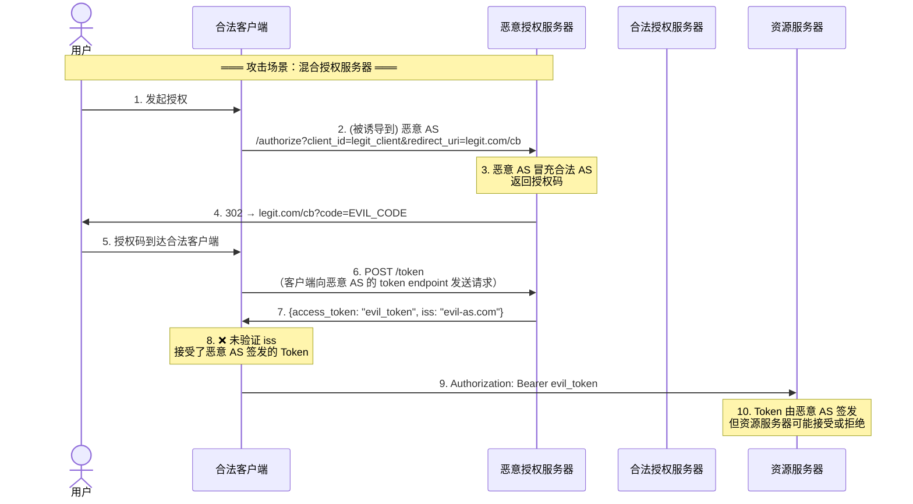
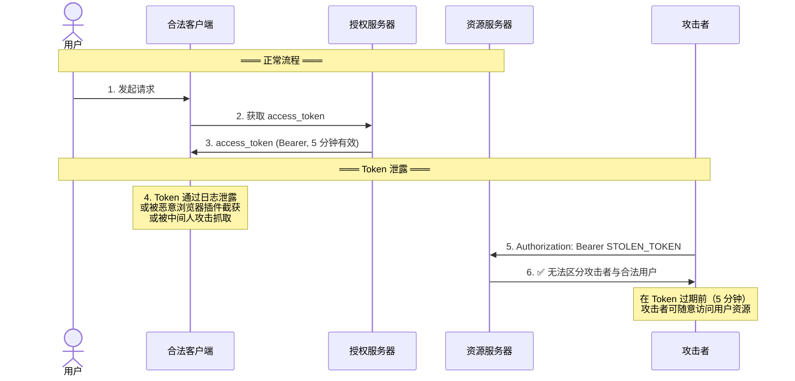
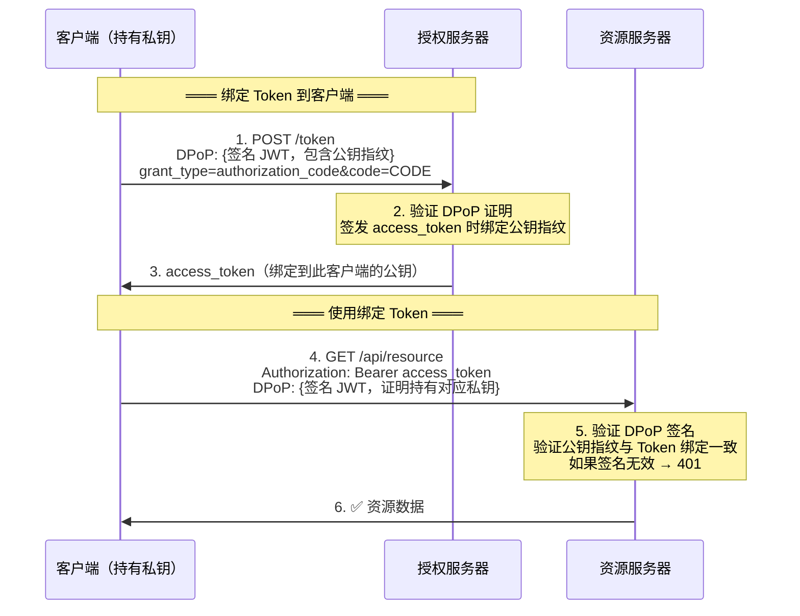
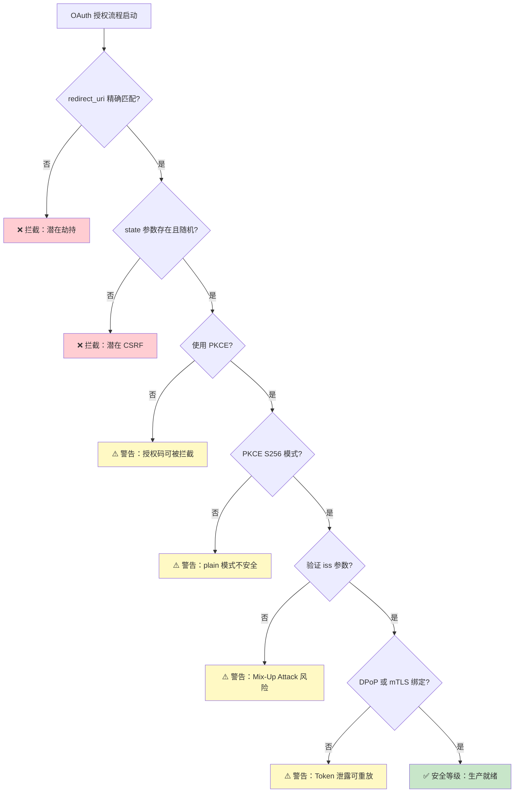

## 为什么需要这份攻击面分析

OAuth 2.0 是 IDaaS 世界的授权语言，但它不是「用了就安全」的银弹。RFC 6749 在 2012 年发布时，某些安全假设（如「机密客户端不会运行在不可信环境」）在移动和 SPA 时代已经被打破。

理解 OAuth 的攻击面不是为了「破解 OAuth」，而是为了**正确地实现它**。以下五个攻击面是过去十年里真实发生过的漏洞模式，每一个都配有攻击流程图和防护措施。

## 五大攻击面总览

| # | 攻击面 | 根本原因 | 关键防护 | 相关规范 |
|---|--------|---------|---------|---------|
| 1 | Redirect URI 劫持 | 授权服务器未严格校验 redirect_uri | 精确匹配白名单 | RFC 6749 §3.1.2 |
| 2 | CSRF / State 参数缺失 | 客户端不验证 state | 生成并验证随机 state | RFC 6749 §10.12 |
| 3 | 授权码拦截 | 无 PKCE 时授权码可被恶意 App 截获 | PKCE（code_challenge + code_verifier） | RFC 7636 |
| 4 | Mix-Up Attack | 客户端未校验 issuer / 端点一致性 | 验证 iss 参数 + redirect_uri 二次校验 | RFC 9207 |
| 5 | Token 泄露与重放 | Bearer Token 持有即有权 | DPoP / mTLS sender-constraining + 短有效期 | RFC 9449 |

---

## 1. Redirect URI 劫持

### 攻击原理

攻击者诱导用户点击一个精心构造的授权链接，其中 `redirect_uri` 被替换为攻击者控制的地址。用户在授权服务器上正常登录后，授权码被重定向到攻击者服务器。



### 为什么这很严重

- 用户看到的是合法授权页面，没有任何异常提示
- 如果客户端是 public client 或未启用 PKCE，攻击者拿到 code 就能换 Token
- 影响范围：所有依赖 redirect_uri 回调的 OAuth 流程

### 防护措施

1. **授权服务器端：精确匹配 redirect_uri**
   - 不允许通配符（`https://*.example.com/callback`）
   - 不允许部分匹配（`https://example.com` 不能匹配 `https://example.com.evil.com`）
   - 如果注册了多个 redirect_uri，必须在授权请求中显式指定且与注册值完全一致

2. **客户端端：始终使用 PKCE**
   - 即使授权码被劫持到攻击者，没有 `code_verifier` 无法换取 Token
   - OAuth 2.1 已将 PKCE 设为所有客户端的强制要求

3. **OAuth 2.1 的强化**：要求 redirect_uri 精确匹配，彻底堵死通配符路径

### 实际攻击案例参考

2020 年前后，多个 OAuth 实现被发现 redirect_uri 校验绕过漏洞：
- 利用 URL parser 差异绕过（`https://example.com@evil.com` 被不同 parser 解析不同）
- 利用开放重定向（先跳转到合法 redirect_uri，再通过开放重定向跳转到攻击者服务器）
- 利用子路径注册绕过（注册 `https://app.example.com/auth/callback`，攻击者注册 `https://app.example.com/auth/callback/../evil`）

---

## 2. CSRF（Cross-Site Request Forgery）与 State 参数

### 攻击原理

攻击者在自己网站上嵌入一个 OAuth 授权请求，用自己已知的 `state` 值。如果受害者已经在授权服务器上登录（存在有效 session），授权服务器会直接返回授权码——而 `state` 是攻击者预设的值。如果受害者的客户端不验证 state，整个绑定关系被破坏。



### 后果

攻击者的浏览器会话被绑定到受害者的 OAuth 授权——后续攻击者在自己的会话中访问应用时，看到的是受害者的数据。

### 防护措施

1. **客户端生成随机 state**：使用 `crypto.randomBytes(32).toString('hex')` 生成不可预测的 state
2. **客户端验证 state**：回调时必须校验 state 与发起授权时存储的一致
3. **state 必须绑定到用户会话**：不要用全局固定的 state
4. **state 有效期**：state 应有合理有效期（通常 5-10 分钟），过期应提示用户重新发起授权

```javascript
// 正确的 state 使用模式
const state = crypto.randomBytes(32).toString('hex');
sessionStorage.setItem('oauth_state', state);
const authUrl = `https://idp.example.com/authorize?...&state=${state}`;

// 回调时验证
const returnedState = new URL(window.location).searchParams.get('state');
const storedState = sessionStorage.getItem('oauth_state');
if (returnedState !== storedState) {
  throw new Error('CSRF detected: state mismatch');
}
sessionStorage.removeItem('oauth_state');
```

---

## 3. 授权码拦截（Authorization Code Interception）

### 攻击原理

这是 PKCE 专门针对的攻击场景。在没有 PKCE 的情况下，恶意 App 可以注册与合法 App 相同的自定义 URL Scheme（例如 `myapp://callback`），在回调时截获授权码。



### 为什么截获如此容易

- 移动操作系统不保证 URL Scheme 的唯一性——多个 App 可以注册相同的 scheme
- 浏览器到 App 的跳转链路没有密码学保护
- 即使是桌面端，本地 HTTP 回调（`http://localhost:PORT/callback`）也可能被同主机上的其他进程监听

### 防护：PKCE

PKCE 的原理已在 [OAuth 2.0 授权码流程与 PKCE 完整图解]() 中详细阐述。核心逻辑：

- 发起授权时附带 `code_challenge = SHA256(code_verifier)`
- 换取 Token 时必须提供原始 `code_verifier`
- 授权服务器验证 `SHA256(code_verifier) == code_challenge`
- 攻击者即使截获 code，也无法反推 code_verifier（SHA256 单向性）

**OAuth 2.1 要求所有客户端使用 PKCE，不再区分 public/confidential client。**

---

## 4. Mix-Up Attack（RFC 9207）

### 攻击原理

Mix-Up Attack 利用了客户端未验证 token endpoint 返回的 `iss`（issuer）参数这一漏洞。攻击者注册一个恶意客户端，当受害者通过正常客户端发起授权时，攻击者通过中间人或其他方式将授权请求路由到攻击者的授权服务器，使合法客户端最终拿到了攻击者服务器签发的 Token。



### Mix-Up Attack 的两种变体

| 变体 | 触发条件 | 影响 |
|------|---------|------|
| **AS Mix-Up** | 客户端同时信任多个授权服务器 | 攻击者的 AS 签发 Token，合法 RS 可能接受 |
| **Client Mix-Up** | 攻击者注册恶意客户端 | 授权码在恶意客户端上换取 Token，但绑定到合法会话 |

### 防护措施

1. **客户端验证 iss 参数**（RFC 9207）：
   - 在 `/authorize` 响应中，授权服务器返回 `iss` 参数
   - 客户端在 `/token` 响应中验证 `iss` 与预期的授权服务器一致
   - 如果不一致，必须中止流程

2. **客户端在 token 请求中发送 redirect_uri**：
   - OAuth 2.0 已要求 token 请求中携带 redirect_uri
   - 恶意 AS 无法伪造合法的 redirect_uri 绑定关系

3. **客户端只信任预先配置的授权服务器**：
   - 不要在运行时动态发现授权服务器
   - 使用 OpenID Connect Discovery 时，验证 `issuer` 与预期一致

```text
// 客户端应实现的 Mix-Up 防护逻辑

1. 发起授权时：
   expected_issuer = "https://idp.example.com/auth/realms/internal"

2. 收到授权码回调后：
   从 /token 响应中提取 iss
   if iss != expected_issuer:
       abort("Mix-Up Attack detected: issuer mismatch")

3. 验证 token endpoint：
   从 OpenID Discovery 获取的 token_endpoint
   必须与请求中使用的 token endpoint 一致
```

---

## 5. Token 泄露与重放

### 攻击原理

Bearer Token 的设计哲学是「持有即有权」——任何人拿到 Token 就能使用它。这意味着 Token 一旦泄露，攻击者可以无限重放直到 Token 过期。



### 泄露途径

| 泄露途径 | 典型场景 | 风险等级 |
|---------|---------|---------|
| 日志泄露 | Token 被打印到应用日志、Nginx 访问日志、审计日志 | 高 |
| 浏览器存储 | Token 存储在 localStorage/sessionStorage 中被 XSS 读取 | 高 |
| URL 参数 | Token 通过 query string 传递，被 Referer 头泄露给第三方 | 中（OAuth 2.1 已禁止） |
| 中间人攻击 | 非 HTTPS 环境下的 Token 传输 | 低（现代部署基本强制 HTTPS） |
| 恶意依赖 | 前端 npm 包窃取 Token | 中 |
| 代理/网关日志 | 反向代理、API 网关、WAF 记录完整请求 | 中 |

### 防护措施

#### 令牌本身的安全措施

1. **短有效期 Access Token**：5-15 分钟，最小化泄露窗口

2. **Refresh Token Rotation**：
   - 每次用 Refresh Token 换取新 Access Token 时，同时发放新的 Refresh Token
   - 旧的 Refresh Token 立即失效
   - 如果检测到已失效的 Refresh Token 被使用（replay），立即吊销该用户的所有 Token

3. **Sender-Constrained Token**：将 Token 绑定到特定客户端，即使泄露也无法在其他客户端使用。两种主流方案：

   | 方案 | 机制 | RFC | 复杂度 |
   |------|------|-----|--------|
   | **DPoP** | 客户端为每个请求生成签名 JWT，证明持有与 Token 绑定的私钥 | RFC 9449 | 中——需要客户端实现 JWT 签名 |
   | **mTLS** | 客户端证书绑定，Token 与 TLS 客户端证书绑定 | RFC 8705 | 高——需要 PKI 基础设施 |

##### DPoP（Demonstration of Proof of Possession）工作原理



DPoP 的核心价值：Token 本身不泄露私钥，攻击者即使拿到 Token，无法生成有效的 DPoP 证明签名。

#### 令牌传输与存储安全

1. **仅通过 HTTPS 传输**：禁止 HTTP 明文传输 Token
2. **禁止 URL 传参**：不在 `?access_token=...` 中传递 Token（OAuth 2.1 已禁止）
3. **后端优先**：Token 存储在后端 Session 中，前端只持有 Session Cookie（HttpOnly, Secure, SameSite=Lax）
4. **BFF 模式对 SPA**：SPA 不直接持有 Refresh Token，通过 Backend-for-Frontend 代理 Token 刷新

---

## 防御措施全景



---

## 生产环境安全检查清单

部署 OAuth/OIDC 前，逐项检查：

- [ ] **redirect_uri 精确匹配**：授权服务器不允许通配符，客户端注册的回调地址与请求中完全一致
- [ ] **state 参数**：每次授权请求使用独立随机 state，回调时验证 state 一致性，state 有有效期
- [ ] **PKCE 强制**：所有客户端（包括 Web 应用）使用 PKCE S256，不允 plain 模式
- [ ] **iss 验证**：客户端验证 token 响应中的 iss 与预期一致
- [ ] **短有效期 Access Token**：Access Token ≤ 15 分钟，Refresh Token 启用轮换
- [ ] **Token 不在 URL**：禁止在 URL query string 中传递 Token
- [ ] **Refresh Token Rotation**：每次刷新返回新 RT，检测 RT 重放并吊销相关 Token
- [ ] **DPoP 或 mTLS**：高安全场景启用 sender-constraining Token
- [ ] **HTTPS 强制**：所有 Token 传输通过 HTTPS，HSTS 头配置
- [ ] **CORS 严格配置**：不开放 `Access-Control-Allow-Origin: *` 的资源返回 Token
- [ ] **Token 不进入日志**：日志中间件脱敏 `Authorization` 头
- [ ] **SPA 使用 BFF**：单页应用不直接持有 Refresh Token，通过 BFF 代理

---

## 常见误区

| 误区 | 真相 |
|------|------|
| "用了 HTTPS 就防住了所有 OAuth 攻击" | HTTPS 只保护传输层。Redirect URI 劫持、CSRF、授权码拦截都是应用层攻击，HTTPS 无法防护 |
| "PKCE 只是给移动 App 用的" | OAuth 2.1 要求所有客户端使用 PKCE——Web 应用、SPA、移动端、CLI 都在范围内 |
| "state 参数可有可无" | 没有 state 就没有 CSRF 防护——攻击者可以让受害者绑定攻击者自己控制的账号 |
| "Bearer Token 不需要额外的绑定机制" | 高安全场景（金融、医疗）必须用 DPoP 或 mTLS 绑定 Token，防止泄露后重放 |
| "OAuth 是认证协议" | OAuth 2.0 是**授权**协议。认证由 OIDC 在 OAuth 之上提供 |
| "客户端验证 iss = 多此一举" | Mix-Up Attack 的入口就是未验证 iss——RFC 9207 将此列为强制要求 |

---

## FAQ

**Q: 最容易被忽略的 OAuth 安全漏洞是什么？**

Redirect URI 校验不严格。很多实现用了「前缀匹配」或「子串匹配」，攻击者利用 URL parser 差异就能绕过。OAuth 2.1 已要求精确匹配，但大量旧实现仍存在此漏洞。

**Q: PKCE 和 state 参数有什么区别？不能只用一个吗？**

不行——它们防御不同的攻击。state 防 CSRF，PKCE 防授权码拦截。state 是 HTTP 层面的一次性令牌，PKCE 是密码学层面的挑战-响应。两个都需要。

**Q: 什么时候必须用 DPoP？**

如果你的 Access Token 可以访问用户敏感数据（金融交易、医疗记录、个人隐私），且 Token 的生命周期内一旦泄露会造成实质性损害，就应该使用 DPoP 或 mTLS。对于只读非敏感数据的内部工具应用，短有效期 + HTTPS 通常足够。

**Q: OAuth 2.1 什么时候成为正式 RFC？**

截至 2026 年 7 月，OAuth 2.1（draft-ietf-oauth-v2-1）尚未成为 RFC。但它的安全要求已通过 RFC 9700（OAuth 2.0 Security BCP）落地。建议所有新项目直接采纳 OAuth 2.1 的安全实践。

**Q: 如何验证我的 OAuth 实现是否安全？**

用 BURP Suite 或 OWASP ZAP 的 OAuth 专项扫描插件，配合手动检查本页的安全清单逐项验证。重点测试：redirect_uri 绕过、state 缺失、PKCE 缺失、Token URL 传递、iss 缺失场景。

---

## 延伸阅读

- [OAuth 2.0 深度解读]()：OAuth 2.0 授权框架的完整剖析
- [OAuth 2.0 授权码流程与 PKCE]()：授权码流程详解和 PKCE 密码学原理
- [Keycloak 重定向循环与 401 排错指南]()：Redirect URI 配置错误是 OAuth 重定向循环最常见的根因
- [OAuth 2.0 for Browser-Based Apps](https://datatracker.ietf.org/doc/html/draft-ietf-oauth-browser-based-apps)：IETF 浏览器应用安全最佳实践
- [OAuth 2.0 Security BCP (RFC 9700)](https://datatracker.ietf.org/doc/html/rfc9700)：OAuth 2.0 安全最佳当前实践
- [DPoP (RFC 9449)](https://datatracker.ietf.org/doc/html/rfc9449)：Token 持有证明机制
- [OAuth 2.0 Mix-Up Mitigation (RFC 9207)](https://datatracker.ietf.org/doc/html/rfc9207)：Mix-Up Attack 防护规范
