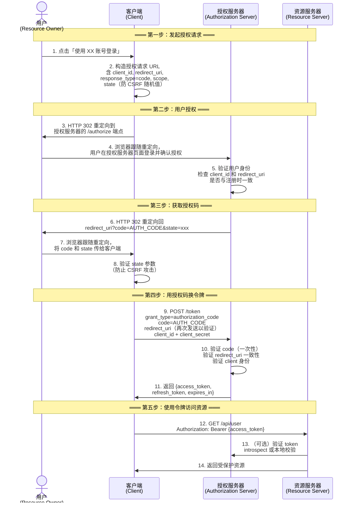
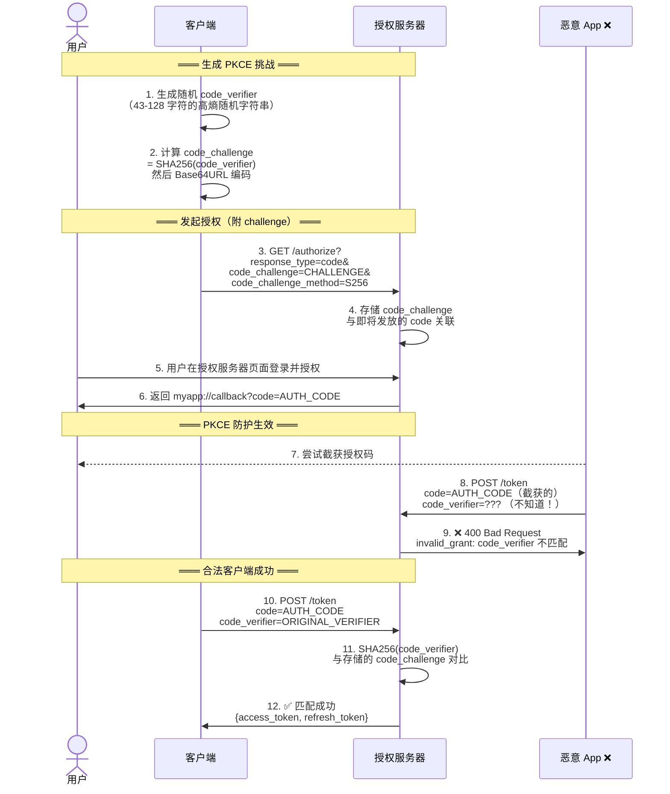
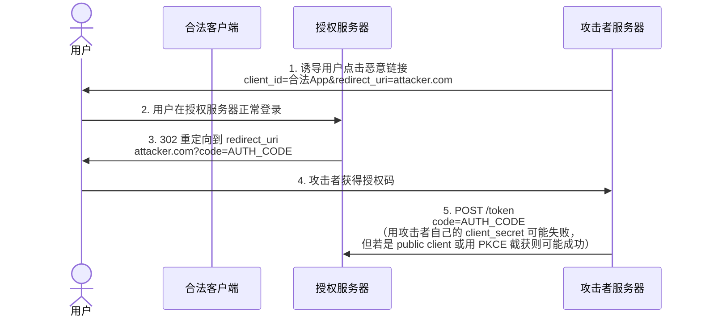
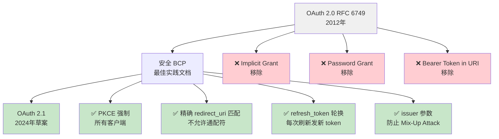

## 为什么需要这份图解

OAuth 2.0 授权码流程（Authorization Code Flow）是所有现代身份协议的基础。OIDC 基于它、单页应用靠它、移动 App 也用它——但大部分资料要么只有文字描述，要么跳过了关键的安全细节。

这份图解的目标是：**一图看懂完整交互，然后逐帧理解每个参数的设计意图和攻击面。**

## 授权码流程完整时序图

下面是 OAuth 2.0 Authorization Code Flow 的标准交互，包含四个角色：用户（Resource Owner）、客户端（Client）、授权服务器（Authorization Server）和资源服务器（Resource Server）。



### 每一步的设计意图

| 步骤 | 关键参数 | 为什么这么设计 |
|------|----------|---------------|
| 2 | `response_type=code` | 指定使用授权码模式（不是 implicit） |
| 2 | `state` | 随机值，防止 CSRF——客户端在第 8 步验证，攻击者无法伪造 |
| 2 | `redirect_uri` | 必须在授权服务器上预注册，防止令牌被重定向到攻击者控制的地址 |
| 4 | 用户在授权服务器页面上登录 | 客户端永远看不到用户的密码——这是 OAuth 的核心理念 |
| 6 | `code` 通过浏览器返回 | 授权码作为中间凭证，即使被截获也没有用——因为没有 client_secret |
| 9 | `code` + `client_secret` | 授权码 + 客户端密钥双重验证，确保只有合法客户端能换取 token |
| 9 | `redirect_uri` 再次发送 | 防止授权码被注入到其他客户端的回调中（mix-up attack 防护） |
| 12 | `Authorization: Bearer` | Bearer token——持有即有权，所以必须通过 HTTPS 传输 |

## PKCE：授权码流程的安全补丁

**PKCE（Proof Key for Code Exchange，RFC 7636）** 是授权码流程的关键安全扩展。它最初为移动 App 设计（因为移动端无法安全存储 client_secret），但现在 **OAuth 2.1 要求所有客户端都必须使用 PKCE**。

### PKCE 的威胁模型

没有 PKCE 时，授权码流程存在一个致命漏洞：

1. 恶意 App 在手机上注册了与合法 App 相同的自定义 URL Scheme（例如 `myapp://callback`）
2. 用户在自己的 App 中发起授权
3. 授权服务器返回 `myapp://callback?code=AUTH_CODE` 时，操作系统可能将 code 路由到恶意 App
4. 恶意 App 截获授权码，用它换取 access_token——**它现在可以冒充用户了**

PKCE 通过一个密码学挑战-响应机制彻底堵死了这条路。

### PKCE 完整时序图



### Code Verifier 和 Code Challenge 的密码学关系

```text
code_verifier = 随机生成的高熵字符串
                （长度 43-128，字符集 A-Z a-z 0-9 - . _ ~）

code_challenge = BASE64URL(SHA256(code_verifier))

验证时：
  授权服务器重新计算 SHA256(code_verifier)
  与授权请求时收到的 code_challenge 对比
  匹配 → 证明请求 token 的就是当初发起授权的同一个客户端
```

**为什么攻击者无法破解？**
- SHA256 是单向哈希——知道 `code_challenge` 无法反推 `code_verifier`
- 暴力穷举 `code_verifier` 在数学上不可行（43 字符的组合空间是 66^43 ≈ 2^260）
- 授权码只有 1 次使用机会 + 通常 30-60 秒有效期

## 常见攻击面与防护

### 1. Redirect URI 劫持



**防护措施：**
- 授权服务器必须严格校验 redirect_uri 与注册值完全匹配（不允许通配符、不允许部分匹配）
- 客户端使用 PKCE——即使攻击者截获 code，没有 code_verifier 也无法换 token
- 使用 `state` 参数防止 CSRF

### 2. CSRF 与 State 参数

**场景**：攻击者在自己网站上嵌入一个隐藏的 iframe，指向：
```
https://auth-server.com/authorize?client_id=victim_app&redirect_uri=victim_app.com/callback&response_type=code&state=ATTACKER_STATE
```

如果受害者在 victim_app 已经登录授权服务器，授权服务器会直接返回授权码到 `victim_app.com/callback?code=CODE&state=ATTACKER_STATE`。虽然攻击者在不同源无法读取 iframe 内容，但如果 victim_app 不验证 state，攻击者可以用自己已知的 state 去预测整个流程。

**防护**：客户端生成随机 `state`，在回调中验证 `state` 与自己存储的一致。攻击者无法预测合法的 `state` 值。

### 3. Mix-Up Attack（RFC 9207）

攻击者注册一个恶意客户端，其 `iss`（issuer）指向一个伪造的授权服务器。当用户通过正常客户端发起授权时，攻击者构造请求使授权码从恶意授权服务器发放——但 code 最终会被送到合法客户端。

**防护**：
- 客户端在 `/token` 请求中发送 `redirect_uri`（已在标准中强制）
- 授权服务器在 token 响应中返回 `iss` 参数（OAuth 2.1 / RFC 9207）
- 客户端验证返回的 `iss` 与预期的授权服务器一致

## OAuth 2.0 → 2.1 的关键变更

OAuth 2.1 不是新协议，而是对 2.0 的**安全整合**——把实践社区公认的最佳安全措施变成强制要求：



| 变更 | 2.0 状态 | 2.1 要求 |
|------|---------|---------|
| Implicit Grant | 可用 | **移除**（用 Authorization Code + PKCE 替代） |
| Resource Owner Password Grant | 可用 | **移除**（不安全，用户密码暴露给客户端） |
| PKCE | 可选，推荐给 public client | **强制**（所有客户端必须使用） |
| redirect_uri 匹配 | 允许宽松匹配 | **精确匹配**（不允许通配符） |
| Refresh Token | 无轮换要求 | **必须轮换**（sender-constrained 或一次性） |
| Bearer Token in URI | 允许（`?access_token=...`） | **禁止**（仅允许 POST body 或 Header） |
| issuer 验证 | 无要求 | **强制**（防止 Mix-Up Attack） |

## 实际配置示例

### Keycloak 中启用 PKCE

Keycloak 默认对 public client 启用 PKCE。对于 confidential client，可以在客户端设置中强制启用：

```bash
# Keycloak Admin CLI 强制 PKCE
kcadm.sh update clients/CLIENT_ID \
  -s attributes.pkce.code.challenge.method=S256
```

### oauth2-proxy 中的 PKCE 配置

```yaml
# oauth2-proxy.cfg
provider = "keycloak-oidc"
code_challenge_method = "S256"
# 确保 Auth URL 中包含 PKCE 参数
```

### 验证 PKCE 是否生效

```bash
# 1. 抓取授权请求 URL，确认包含 code_challenge
# /authorize?...&code_challenge=xxx&code_challenge_method=S256

# 2. 确认 token 请求中包含 code_verifier
# POST /token  body: code=xxx&code_verifier=xxx&grant_type=authorization_code

# 3. 尝试用无效的 code_verifier 请求 token——应返回 400
```

## 常见误区

| 误区 | 真相 |
|------|------|
| "PKCE 只是给移动 App 用的" | OAuth 2.1 强制所有客户端使用 PKCE，单页应用和服务端应用都在范围内 |
| "用了 HTTPS 就不需要 PKCE 了" | HTTPS 保护传输层，但无法防止授权码被截获后转发——PKCE 保护的是应用层 |
| "state 参数是可有可无的" | state 是防止 CSRF 的唯一机制——没有 state，攻击者可以让受害者绑定攻击者的账号 |
| "OAuth 是认证协议" | OAuth 2.0 是**授权**协议，不负责认证。认证是 OIDC（基于 OAuth 2.0 构建）的职责 |
| "响应类型是 code 就一定安全" | 不加 PKCE 的授权码流程仍然存在授权码拦截风险 |

## 下一步

- 理解授权码流程后，看 [OpenID Connect]() ——它在此之上添加了身份认证层
- 了解 [SAML 2.0]() 的另一种 SSO 实现方式
- 动手实践：[Keycloak 入门]() 中的 OIDC 客户端配置
