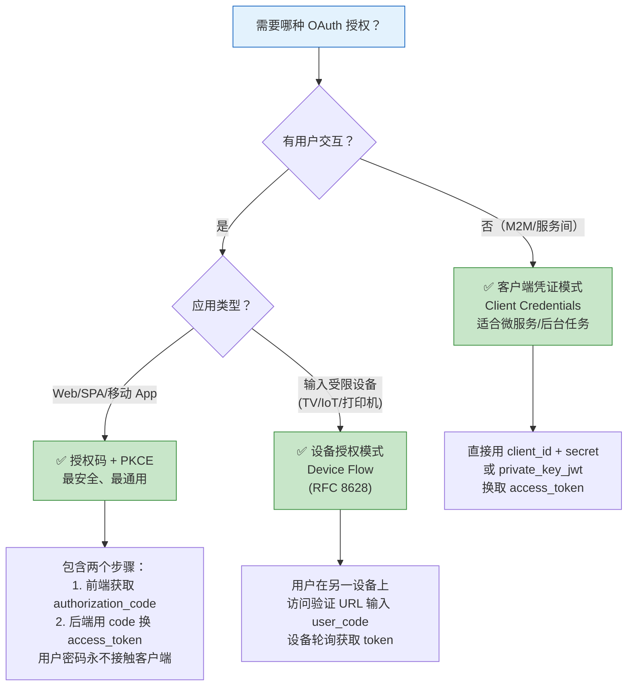

## 5.1 设计哲学

OAuth 2.0（RFC 6749）是由 IETF 制定的授权框架，它的核心使命简单而明确：**让用户可以在不向第三方应用暴露自己密码的情况下，授权该应用访问自己在服务提供商处的受保护资源。**

### OAuth 2.0 解决的真实问题

想象一个场景：你想让一个照片冲印应用访问你存在云盘上的照片。

**没有 OAuth 的糟糕做法**：你给冲印应用你的云盘用户名和密码。
- 冲印应用可以冒充你做任何事（不是只读照片，还能删除文件、修改设置）
- 你无法限制冲印应用的权限范围
- 你改密码后，冲印应用就失效了，但你得在所有第三方应用上重设
- 冲印应用的服务器被黑，你的密码就泄露了

**OAuth 2.0 的做法**：
- 冲印应用重定向你到云盘的授权页面
- 你（在云盘的页面上）登录并确认"允许冲印应用读取照片"
- 云盘给冲印应用发一个访问令牌（Access Token），只能读照片，有效期 1 小时
- 冲印应用用这个令牌访问你的照片
- 你随时可以在云盘上撤销这个授权

## 5.2 核心角色

OAuth 2.0 定义了四个核心角色：

```
资源所有者（Resource Owner）
    │  通常是终端用户
    │  拥有受保护资源的数据
    ▼
客户端（Client）
    │  第三方应用，想访问资源
    │  
    ▼
授权服务器（Authorization Server）
    │  认证资源所有者，发放令牌
    │  
    ▼
资源服务器（Resource Server）
    托管受保护资源的服务
```

## 5.3 授权模式（Grant Types）

OAuth 2.0 定义了四种核心授权模式，加上 PKCE 扩展和 Device Flow：

### 5.3.1 授权码模式（Authorization Code）

**这是最安全、最广泛使用的模式**。核心特征是用户浏览器不直接接触 Access Token。

```
用户             客户端         授权服务器       资源服务器
 │                │               │                │
 │──访问应用─────→│               │                │
 │                │──重定向────→  │                │
 │←──登录页面─────│  用户到授权服务器认证         │
 │──认证──────────│──────────────→│                │
 │←──授权确认─────│               │                │
 │──确认授权──────│──────────────→│                │
 │←──重定向回客户端(携带code)─────│                │
 │──携带code─────→│               │                │
 │                │──用code换token→│                │
 │                │←──返回access_token+refresh_token│
 │                │──用token访问────────────────→│
 │                │←──返回资源────────────────────│
```

关键步骤：
1. 客户端重定向用户到 `/authorize?response_type=code&client_id=xxx&redirect_uri=yyy&scope=zzz&state=random`
2. 用户认证并授权
3. 授权服务器通过重定向返回授权码 code
4. 客户端用 code 在服务器端交换 token（`POST /token`）
5. 返回 access_token 和可选的 refresh_token

### 5.3.2 PKCE 增强的授权码模式

PKCE（Proof Key for Code Exchange，RFC 7636）是授权码模式的增强版，主要针对**公开客户端**（如移动 App、SPA 单页应用）无法安全存储 client_secret 的问题。

PKCE 的核心思想：客户端在授权请求时提供一个 `code_challenge`（由 `code_verifier` 生成的 SHA-256 哈希），在交换 token 时提供 `code_verifier`，授权服务器验证两者的匹配关系。

```
步骤 1：授权请求
/authorize?response_type=code&...&code_challenge=xxx&code_challenge_method=S256

步骤 2：Token 交换
POST /token
code=yyy&code_verifier=zzz&...
```

**目前的标准推荐：所有应用都使用 PKCE 增强的授权码模式**，无论是否是公开客户端。OAuth 2.1 草案已将其设为强制要求。

### 5.3.3 客户端凭证模式（Client Credentials）

用于**机器对机器（M2M）**通信的场景。客户端用自己的凭证（client_id + client_secret 或 private key）直接换取 token。

```
客户端         授权服务器
 │                │
 │──client_id+secret→│
 │←──access_token───│
 │                │
 │──用token调用─→ 资源服务器
```

适用场景：微服务间通信、API 调用、后台任务。

注意：这个模式没有用户参与，`sub` claim 一般是 client_id。

### 5.3.4 隐式模式（Implicit Flow）

**已不推荐使用**。历史上为纯前端应用设计，token 直接在 URL 片段中返回。

OAuth 2.1 已明确淘汰了隐式模式。如果你在维护使用隐式模式的旧系统，建议尽快迁移到 PKCE 增强的授权码模式。

### 5.3.5 密码模式（Resource Owner Password Credentials）

**已不推荐使用**。用户直接将密码交给客户端，客户端用密码换 token。

OAuth 2.1 同样淘汰了此模式。唯一的例外是遗留系统的过渡方案，且应明确标记为废弃。

### 5.3.6 设备授权模式（Device Flow，RFC 8628）

适用于输入受限的设备（智能电视、打印机、IoT 设备）：

```
设备                     授权服务器              用户（手机/电脑）
 │                        │                      │
 │──请求设备码──────────→│                      │
 │←──device_code+        │                      │
 │   user_code+url────   │                      │
 │                        │                      │
 │                        │←──访问url,输入user_code
 │                        │──认证并授权─────────→│
 │                        │←──授权确认───────────│
 │                        │                      │
 │──轮询/用device_code换token→│                  │
 │←──access_token────────│                      │
```

### 5.3.7 授权模式全景对比



| Grant Type | 适用场景 | 用户参与 | Token 获取方式 | OAuth 2.1 状态 |
|---|---|---|---|---|
| 授权码 + PKCE | Web/SPA/移动 App | ✅ 用户授权 | 前端拿 code → 后端换 token | **唯一推荐** |
| 客户端凭证 | 微服务间、后台任务 | ❌ 无用户 | client_id + secret 直接换 | ✅ 保留 |
| 设备授权 | TV/IoT/CLI | ✅ 用户异地验证 | 设备轮询 + 用户异地确认 | ✅ 保留 |
| 隐式模式 | （历史）纯前端 SPA | ✅ 用户授权 | token 直接在 URL 返回 | ❌ 已移除 |
| ROPC 密码模式 | （历史）遗留系统 | ✅ 用户给密码 | 用用户密码换 token | ❌ 已移除 |

> **决策原则**：新项目一律使用**授权码 + PKCE**。如果有特殊设备场景，用**设备授权模式**。服务间调用用**客户端凭证**。如果在维护使用隐式/ROPC 的旧系统，尽快迁移。

## 5.4 Token 详解

### Access Token

访问令牌，是 OAuth 2.0 的核心产物。可以是：

- **不透明字符串**（Reference Token）：资源服务器需要调用授权服务器的 introspection 端点来验证。
- **JWT 格式**（Self-contained Token）：资源服务器可以自行验证（非对称签名），减少网络调用，但吊销困难。

Access Token 应该具有：

- **短有效期**：通常 5-15 分钟
- **限定 Scope**：只包含本次授权的最小权限
- **绑定 Audience**：指定哪些资源服务器可以接受此 Token

### Refresh Token

刷新令牌，用于在 Access Token 过期后获取新的 Access Token，避免用户重复认证。

Refresh Token 的特点：

- 有效期较长（数小时到数天）
- 启用 Refresh Token Rotation（OAuth 2.0 Security BCP 推荐的最佳实践）：每次使用后发放新 RT、旧 RT 失效；若检测到旧 RT 被重用，应立即吊销该令牌链
- 泄露后可以吊销该令牌链
- 仅在后端（机密客户端）使用，SPA 应使用 BFF 模式

### Token 端点

```
POST /token
Content-Type: application/x-www-form-urlencoded

grant_type=authorization_code
&code=xxx
&redirect_uri=https://client.example/callback
&client_id=xxx
&client_secret=xxx
```

### Token Introspection（RFC 7662）

资源服务器验证 Token 有效性的标准方式。端点地址由授权服务器元数据中的 `introspection_endpoint` 字段给出（路径由实现定义，示例中 `/introspect` 仅为演示），资源服务器以此向授权服务器证明身份：

```
POST /introspect
Authorization: Basic <base64(client_id:client_secret)>   # 认证方式由实现约定，也可用 private_key_jwt 等

token=xxx

响应：
{
  "active": true,
  "scope": "read write",
  "client_id": "my-app",
  "username": "alice",
  "exp": 1600000000,
  "sub": "user-123"
}
```

## 5.5 Scope 与 Consent

### Scope 设计

Scope 是 OAuth 2.0 的权限粒度控制机制。好的 Scope 设计：

```
❌ /api/users/read  （粒度太细，管理成本高）
❌ admin             （粒度太粗，安全性差）
✅ profile:read      （适中，按资源和操作分级）
✅ email:*
✅ admin            （极少数特例）
```

### 用户同意（Consent）

OAuth 2.0 的一个重要特性是用户可以对授权的 Scope 进行确认。好的授权页面应当：

1. 清晰显示什么应用在请求什么权限
2. 明确区分"必需"和"可选"的权限
3. 提供权限的解释说明（为什么需要这个权限）
4. 让用户可以取消某些非必需的权限
5. 记录用户的同意决定

## 5.6 安全最佳实践

### 关键安全措施

1. **始终使用 state 参数**防止 CSRF 攻击。生成随机 state 值并在回调时验证。
2. **严格验证 redirect_uri**：精确匹配，不使用通配符。
3. **使用 PKCE**：所有模式都建议使用。
4. **Refresh Token Rotation**：每次使用 Refresh Token 后发放新 Token。
5. **Sender-Constrained Token**：使用 [DPoP（RFC 9449）]() 或 mTLS 将 Token 绑定到特定客户端。
6. **短生命周期**：Access Token 5-15分钟，通过 Refresh Token 续期。
7. **Token 黑名单**：维护被吊销 Token 的标识列表。

### 常见攻击与防御

详细分析见 [OAuth 2.0 攻击面与防护深度图解]()。

| 攻击类型 | 攻击方式 | 防御措施 |
|---------|---------|---------|
| CSRF | 伪造授权请求 | state 参数 |
| 授权码拦截 | 恶意客户端窃取 code | PKCE + client_secret |
| Token 泄露 | 窃取 access_token | 短有效期 + Token Binding |
| 重定向劫持 | 篡改 redirect_uri | 白名单精确匹配 |
| 混用攻击 | 混合不同客户端/授权服务器的 token | audience 验证 + 校验 iss/端点绑定 |
| Refresh Token 窃取 | 获取长期有效的 RT | RT Rotation + 自动检测重用 |

## 5.7 OAuth 2.1

OAuth 2.1 将上述最佳实践和扩展 RFC 整合成统一规范。详细变化（PKCE 强制、Implicit 废弃、DPoP、iss 参数等）请参阅独立章节：

→ [OAuth 2.1 相比 OAuth 2.0 的变化 — 废弃、新增与迁移指南]()

核心要点速览：

1. **PKCE 对所有客户端强制**——不再区分公共/机密客户端
2. **Implicit Grant 和 ROPC 被移除**——全部改为 Auth Code + PKCE
3. **redirect_uri 必须精确匹配**——杜绝宽松匹配导致的劫持
4. **Refresh Token 必须有发件人约束**——DPoP (RFC 9449) 或 mTLS
5. **iss 参数强制**——防止 Mix-Up Attack (RFC 9207)

## 5.8 小结

OAuth 2.0 是 IDaaS 世界的"授权语言"。理解它不仅仅是记住四种授权模式，而是理解其设计哲学：将授权从密码共享中解耦，通过标准化的令牌机制实现精细化、可撤销、可审计的访问控制。在 IDaaS 选型和实现中，OAuth 2.0 的遵循程度和质量是核心评判标准。

## 5.9 延伸阅读

- [OAuth 2.1 相比 OAuth 2.0 的变化]()：PKCE 强制、Implicit/ROPC 废弃、DPoP、iss 参数等全部变化与迁移指南
- [OAuth 2.0 授权码流程与 PKCE 完整图解]()：完整 Mermaid 时序图、PKCE 的 code_verifier/code_challenge 生命周期、常见攻击面与防护
- [OAuth 2.0 攻击面与防护深度图解]()：五大攻击面的完整分析，含 Mermaid 攻击流程图和防护措施
- [OpenID Connect]()：在 OAuth 2.0 之上构建的身份认证层
- [Keycloak 细粒度权限与授权策略]()：基于 OAuth Scope 的 RBAC/ABAC 实战落地
- [RBAC、ABAC、ReBAC 授权模型对比]()：OAuth Scope 设计与授权模型的协同
