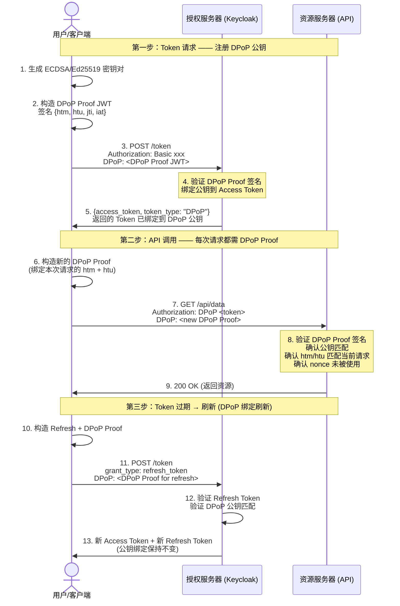

> DPoP 解决的是令牌被窃取后的重放风险，不会替代零信任 IAM 的 `iss`、`aud`、`exp`、权限和会话状态检查。若需要决定普通请求与高风险请求分别采用本地验签还是 introspection，可参考[零信任 IAM 中 JWT 与 Introspection 的边界]()。

## DPoP 要解决什么问题

OAuth 2.0 的 Access Token 默认是 **Bearer Token**——谁持有这个 Token，谁就能用它访问资源。这个设计简单直接，但也留下了一个隐患：**Bearer Token 一旦泄露，任何人都可以冒充合法用户**。

现实中的泄露场景比想象中更常见：

- Access Token 不小心被打印在日志里，日志又被传到第三方服务
- 前端 SPA 把 Token 存在 localStorage，XSS 攻击直接读取
- Token 在 TLS 终止代理和上游应用之间以明文传输（内网并不总是安全的）
- Refresh Token 在移动设备上被恶意 App 提取

DPoP（Demonstration of Proof-of-Possession，RFC 9449）解决的就是这个问题：**把 Token 绑定到一个只有合法客户端持有的私钥上，即使 Token 被窃取，攻击者拿不到对应的私钥就无法使用**。

这是 OAuth 安全模型从"持有即有权"到"持有+证明"的关键演进。它和 PKCE 一起构成了 OAuth 2.1 安全基线的两大支柱——PKCE 保护授权码不被截获，DPoP 保护 Token 不被重放。

## DPoP 核心原理

DPoP 的核心思想是**非对称密钥绑定**：客户端生成一对公私钥，每次发送 Token 请求时附上一个用私钥签名的 JWT（DPoP Proof），资源服务器用公钥验证签名后，确认"这个请求确实来自持有私钥的客户端"。

与之对比，Bearer Token 的工作方式是：

```
客户端 ─── Bearer Token ───→ 资源服务器
           ↑
      持有 = 有权
      不需要额外证明
```

DPoP 的工作方式则是：

```
客户端 ─── Access Token + DPoP Proof ───→ 资源服务器
                  ↑                  ↑
           需要有效 Token     需要私钥签名证明持有权
           缺一不可
```

关键约束：
- **DPoP Proof 绑定了 HTTP 请求的细节**（URI、方法），即使同一个 Token，请求不同的 URL 也需要重新签名——防止 Token 被截获后用于其他请求
- **DPoP Proof 包含时间戳和唯一 nonce**，防止重放
- **DPoP 公钥在 Token 请求时注册**，后续每次使用 Token 都必须用对应的私钥签名

## DPoP 完整流程（Mermaid 时序图）



关键点看图：

- **步骤 1-2**：客户端在第一次 Token 请求前生成密钥对，公钥通过 DPoP Proof JWT 传递给授权服务器
- **步骤 4**：授权服务器将公钥指纹（`jkt`）嵌入 Access Token，此后这个 Token 只能用对应的私钥使用
- **步骤 6-7**：每次 API 请求都构造新的 DPoP Proof，`htu` 绑定本次请求的完整 URL，`htm` 绑定 HTTP 方法——攻击者即使截获整个 HTTP 请求，也无法把它重放到不同的 URL
- **步骤 10-11**：Refresh Token 同样受 DPoP 保护，刷新请求也需要 DPoP Proof
- **步骤 12-13**：刷新后新 Token 仍然绑定到同一对密钥

## DPoP Proof JWT 结构

一个 DPoP Proof 是一个 JWT，Header 和 Payload 如下：

**JWT Header：**
```json
{
  "typ": "dpop+jwt",
  "alg": "ES256",
  "jwk": {
    "kty": "EC",
    "crv": "P-256",
    "x": "lJtHca...",
    "y": "Q4xCIR..."
  }
}
```

关键字段：
- `typ: "dpop+jwt"`：标识这是一个 DPoP 类型的 JWT
- `alg`：签名算法，必须是 `RS256`/`ES256`/`EdDSA` 等非对称算法，不能用 `HS256`（共享密钥）
- `jwk`：嵌入公钥（可以是完整的 JWK 或引用 `jku`）

**JWT Payload：**
```json
{
  "jti": "d605c9f0-ef6c-431a-8a2e-9c4b24e7c1a2",
  "htm": "GET",
  "htu": "https://api.example.com/users/me",
  "iat": 1750612345,
  "ath": "fUHyO8p..."
}
```

关键字段：
- `jti`：唯一 ID，防止重放（授权服务器验证 nonce 的去重窗口）
- `htm`：HTTP 方法（GET/POST/PUT/DELETE），必须与实际请求一致
- `htu`：HTTP URI，必须与实际请求的完整 URL 一致（不含 fragment）
- `iat`：签发时间戳，必须在合理的时间窗口内
- `ath`：Access Token 的 SHA-256 哈希的 Base64url 编码，把 Proof 和 Token 绑定

## 与 mTLS 的对比

DPoP 和 mTLS 都实现了 sender-constrained token，但适用场景不同：

| 维度 | DPoP (RFC 9449) | mTLS (RFC 8705) |
|------|----------------|-----------------|
| 绑定层 | 应用层（HTTP Header） | 传输层（TLS） |
| 密钥载体 | JWT 中嵌入 JWK 公钥 | X.509 客户端证书 |
| 对基础设施的要求 | 无需额外证书管理 | 需要 PKI 和证书分发 |
| SPA/移动端适用性 | ✅ 好（JS 可生成密钥对） | ❌ 差（需要证书管理） |
| API 网关/反向代理兼容性 | ⚠️ 代理必须透传 DPoP Header | ✅ TLS 在网关终止时需特殊处理 |
| 防重放机制 | nonce（应用层） | TLS 层面（传输层） |
| Keycloak 支持 | Keycloak 26 预览版支持所有 grant type | Keycloak 支持 X.509 客户端认证 |
| 适用场景 | SPA、移动 App、微服务间调用 | 内部微服务间、server-to-server |

**选型建议：**
- SPA / 移动端 / 没有 PKI 的团队 → DPoP
- 内部微服务间（已有 mTLS 基础设施）→ mTLS
- 两者可以共存——但不必同时用，选一种即可实现 sender-constraining

## Keycloak 26 DPoP 配置

Keycloak 26 将 DPoP 作为预览特性，支持所有 grant type（之前仅支持 authorization_code）。

### 启用 DPoP

在 Keycloak Realm 级别启用：

```bash
# 通过 Admin CLI 启用 DPoP preview feature
kcadm.sh update realms/<REALM> -s 'attributes.dpopPreview=true'
```

或在 Realm Settings → General → 勾选 "DPoP Preview"。

### 客户端配置

客户端的 DPoP 绑定类型通过 client metadata 控制：

```bash
# 创建或更新 Client，指定 DPoP 绑定策略
kcadm.sh update clients/<CLIENT_ID> \
  -s 'attributes."dpop.bound.access.tokens"=true'
```

两种绑定模式：
- **仅 DPoP**：Token 只能用 DPoP Proof 使用
- **DPoP + Bearer 混合**：Token 既可以当 DPoP Token 用，也可以当 Bearer Token 用（向后兼容）

### 验证 DPoP 是否生效

```bash
# 1. 生成客户端密钥对
openssl ecparam -genkey -name prime256v1 -noout -out dpop_key.pem
openssl ec -in dpop_key.pem -pubout -out dpop_pub.pem

# 2. 构造 DPoP Proof（需要编程实现，以下是概念示例）
# 3. 请求 Token
curl -s -X POST https://keycloak.example.com/realms/<REALM>/protocol/openid-connect/token \
  -H "Content-Type: application/x-www-form-urlencoded" \
  -H "DPoP: <DPoP Proof JWT>" \
  -d "grant_type=authorization_code" \
  -d "code=<AUTH_CODE>" \
  -d "redirect_uri=https://app.example.com/callback" \
  -d "client_id=<CLIENT_ID>" \
  -d "client_secret=<SECRET>"

# 4. 响应中的 token_type 应为 "DPoP"（而非 "Bearer"）
# 5. 使用 Access Token 调用 API 时附上 DPoP Proof
```

## 常见错误与排错

| 错误症状 | 原因 | 解决方案 |
|---------|------|---------|
| `use_dpop_nonce` 错误 | 资源服务器要求 nonce 但客户端未提供 | 从上一个响应的 `DPoP-Nonce` header 获取 nonce，嵌入 DPoP Proof |
| `invalid_dpop_proof` | DPoP Proof JWT 签名验证失败 | 检查公私钥匹配、alg 是否使用非对称算法、jwk 是否正确嵌入 |
| `dpop_jkt_missing` | Access Token 中缺少 `cnf.jkt`（公钥指纹） | 确认 Token 请求时携带了有效的 DPoP Proof |
| `htm`/`htu` 不匹配 | DPoP Proof 中的 `htu` 与实际请求 URL 不一致 | 确保 `htu` 包含完整的 scheme + host + path（不含 query string 和 fragment） |
| 代理环境下 DPoP 失败 | API 网关/反向代理修改了 URL，但 DPoP Proof 中的 `htu` 基于原始请求 | 配置代理透传原始 URL（如 Nginx 的 `X-Forwarded-Proto` / `X-Forwarded-Host`） |
| Token 刷新后旧 DPOP Proof 失败 | 刷新后的 Access Token 有新的 `ath` 值，DPoP Proof 需更新 `ath` | 每次获取新 Token 后重新构造 DPoP Proof |

## 生产环境注意事项

1. **Nonce 管理**：DPoP 使用服务器下发的 nonce 防重放，客户端必须在 nonce 有效期内（通常几分钟）使用它。实现时要处理 nonce 过期重试的逻辑。
2. **密钥轮换**：客户端密钥对建议定期轮换（如每 30 天）。轮换后需要重新获取 Token（新 Token 绑定新公钥）。
3. **时钟偏差**：`iat` 允许 ±5 秒的时钟偏差。如果客户端和服务端时钟偏差过大，DPoP Proof 会被拒绝。
4. **DPoP + PKCE 组合**：SPA 场景中 DPoP 和 PKCE 互补——PKCE 保护授权码交换阶段，DPoP 保护 Token 使用阶段。两者应同时启用。
5. **与 OAuth 2.1 的关系**：OAuth 2.1 草稿中 DPoP 是推荐但非强制的（与 PKCE 不同，PKCE 在 OAuth 2.1 中是强制的）。

## FAQ

### Q1: DPoP 能替代 PKCE 吗？

不能。PKCE 保护的是授权码（Authorization Code）不被截获后的重放；DPoP 保护的是 Access Token 不被泄露后的重放。两者攻击面不同，互为补充而非替代。在 OAuth 2.1 中，PKCE 对所有客户端强制，DPoP 推荐但可选用。

### Q2: DPoP Proof 每次 API 请求都要重新签名，性能开销大吗？

ECDSA 签名操作在毫秒级（P-256 曲线约 1-2ms），对绝大多数应用来说开销可忽略。真正需要关注的是移动端电池消耗和 IoT 设备的计算能力。在极端高并发场景（>10万 QPS），可以考虑在客户端侧缓存短时效的 DPoP Proof（但需要注意 `htu` 绑定）。

### Q3: 多个 API 调用能共用一个 DPoP Proof 吗？

不能。DPoP Proof 中的 `htu` 绑定到具体 URL、`htm` 绑定到 HTTP 方法、`jti` 防止重放。请求不同的 API endpoint 或使用不同的 HTTP 方法时，必须构造新的 DPoP Proof。这是设计意图——防止截获的 Token+Proof 组合被用于其他请求。

### Q4: DPoP 和 OAuth 2.0 Token Binding 是什么关系？

IETF 废弃了 TLS Token Binding（RFC 8471），DPoP 是它的应用层替代方案。与 TLS Token Binding 需要浏览器和反向代理都支持不同，DPoP 是纯 HTTP 层方案，不依赖传输层特性。

## 小结

DPoP 将 OAuth 2.0 的安全性从"持有 Token 即有权"提升到"持有 Token + 证明密钥持有权"。在 SPA、移动端、API-first 架构越来越普遍的今天，Sender-Constrained Token 不再是可选项——它是 OAuth 2.1 安全基线的重要组成部分。

部署 DPoP 的关键决策点：
- SPA / 移动 App → 用 DPoP（生成密钥对即可，无证书管理负担）
- 内部微服务 → 可用 mTLS（如果已有证书基础设施）
- 需要同时兼容 Bearer 和 DPoP → 使用混合绑定模式

## 延伸阅读

- [RFC 9449 — OAuth 2.0 Demonstrating Proof of Possession (DPoP)](https://datatracker.ietf.org/doc/rfc9449/)：DPoP 规范原文
- [OAuth 2.0 攻击面与防护深度图解]()：Token 泄露攻击面分析与 DPoP 防护
- [OAuth 2.1 相比 OAuth 2.0 的变化]()：DPoP 在 OAuth 2.1 中的定位
- [OAuth 2.0 深度解读]()：OAuth 2.0 完整流程
- [IAM 协议选型指南]()：协议选型决策框架
