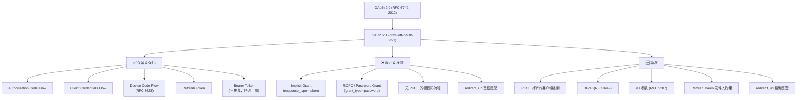

## 为什么需要 OAuth 2.1

OAuth 2.0（RFC 6749）发布于 2012 年。在接下来近十年里，安全研究者发现了若干严重攻击面——Redirect URI 劫持、授权码拦截、CSRF、Mix-Up Attack、Token 泄露重放。社区通过一系列补充 RFC 逐个修补：

- **RFC 7636 (PKCE)**：防止授权码拦截（2015）
- **RFC 6819 / Security BCP**：安全威胁模型与缓解措施
- **RFC 9207 (iss 参数)**：防止 Mix-Up Attack（2022）
- **RFC 9449 (DPoP)**：Token 发件人约束（2024）

OAuth 2.1 不是全新协议，而是把这些分散的最佳实践整合成一份统一规范。它同时移除了已被证明不安全的流程，并强化了默认安全配置。

如果你现在在写一个新的 OAuth 客户端或授权服务器，应该直接以 OAuth 2.1 为目标——2.0 的安全模型已经过期。

## 变化总览



## 七大核心变化

### 1. PKCE 对所有客户端强制

**OAuth 2.0**：PKCE（Proof Key for Code Exchange）只推荐给公共客户端（SPA、移动 App），机密客户端可以不用。

**OAuth 2.1**：所有使用授权码流程的客户端——不管是 SPA、移动 App 还是后端 Web 应用——都必须使用 PKCE。没有例外。

```
# OAuth 2.1 授权请求（注意 code_challenge 参数）
GET /authorize?
  response_type=code&
  client_id=s6BhdRkqt3&
  redirect_uri=https://client.example.com/callback&
  code_challenge=E9Melhoa2OwvFrEMTJguCHaoeK1t8URWbuGJSstw-cM&
  code_challenge_method=S256&
  state=xcoVv98y2kd44vuquye3
```

修改原因：即使后端 Web 应用在 `/token` 端点发送 `client_secret`，授权码仍然可能在前端被拦截（中间件日志、浏览器扩展、JS 注入等）。PKCE 确保即使授权码泄露，攻击者也无法用它换令牌。

### 2. Implicit Grant 被移除

**OAuth 2.0**：Implicit Grant（`response_type=token`）设计给纯前端 SPA——省略了授权码交换步骤，Access Token 直接从重定向 URL 的 fragment 中返回。

**OAuth 2.1**：Implicit 完全移除，不推荐也不保留。

原因：
- Token 暴露在浏览器 URL fragment 中，可被历史记录、referer header、第三方脚本窃取
- 无法使用 Refresh Token（因为 Refresh Token 不可暴露给前端），用户体验差
- 授权码流程 + PKCE 在安全性上完全替代了 Implicit，且现代浏览器 CORS 已足够成熟支持 `/token` 端点跨域调用

迁移路径：将所有 Implicit 客户端改为 Authorization Code + PKCE。

### 3. ROPC 密码流程被移除

**OAuth 2.0**：Resource Owner Password Credentials Grant（`grant_type=password`）允许客户端直接收集用户名和密码，换取 Access Token。

**OAuth 2.1**：ROPC 完全移除。

原因：这个流程违背了 OAuth 的初衷——让用户**不**把密码给第三方应用。ROPC 在实际使用中几乎都是反模式：
- 第三方应用获取了用户的明文密码
- 无法支持 MFA——用户有 TOTP/Passkey 时 ROPC 无法处理
- 违反 OWASP 和 GDPR 对密码处理的建议

迁移路径：改用 Authorization Code Flow + PKCE。如果必须使用非交互式服务账户访问，用 Client Credentials Grant。

### 4. redirect_uri 必须精确匹配

**OAuth 2.0**：RFC 6749 允许授权服务器对 redirect_uri 做"宽松匹配"，例如注册了 `https://app.example.com/callback`，请求中带 `https://app.example.com/callback/sub/path` 也可能被接受。

**OAuth 2.1**：redirect_uri 必须逐字符精确匹配。不再允许子路径、尾部斜杠差异、协议差异。

修改原因：宽松匹配是 Redirect URI 劫持漏洞的根本原因。攻击者可以注册 `https://app.example.com/callback/attacker-path`，或利用开放重定向漏洞构造恶意 redirect_uri。精确匹配消除了这一整类攻击面。

### 5. Refresh Token 必须有发件人约束

**OAuth 2.0**：Refresh Token 是 Bearer Token——谁拿到都能用。如果 Refresh Token 泄露，攻击者可以持续刷新获取新的 Access Token。

**OAuth 2.1**：Refresh Token 必须使用发件人约束（Sender-Constrained）或一次性使用机制。两种方式：

| 约束方式 | 机制 | 标准 |
|---------|------|------|
| DPoP | 客户端对每个请求生成签名 JWT，绑定到特定密钥对 | RFC 9449 |
| mTLS | 客户端证书绑定，Token 只能在持有对应私钥的连接上使用 | RFC 8705 |
| 一次性 Refresh Token | 每次使用 Refresh Token 后，AS 发一个新的 Refresh Token 并撤销旧的 | Security BCP |

修改原因：Bearer Refresh Token 的长期有效性使得泄露后的影响极为严重。发件人约束确保即使 Token 被窃取，攻击者也无法在不同设备上使用。

### 6. iss 参数防 Mix-Up Attack

**OAuth 2.0**：授权服务器返回的响应中没有明确的 issuer 标识，客户端可能无法区分响应来自哪个 AS。

**OAuth 2.1**：强制使用 `iss` 参数（RFC 9207），授权服务器在授权响应中返回自己的 issuer URL。

```
# 授权服务器在重定向时附带 iss 参数
HTTP 302 https://client.example.com/callback?
  code=SplxlOBeZQQYbYS6WxSbIA&
  state=xcoVv98y2kd44vuquye3&
  iss=https://auth.example.com    ← OAuth 2.1 新增
```

客户端验证 `iss` 确保响应确实来自预期的授权服务器，防止前端被诱导到恶意 AS 完成授权（Mix-Up Attack）。

### 7. DPoP：Token 证明持有

DPoP（Demonstration of Proof-of-Possession，RFC 9449）不是 OAuth 2.1 规范本身的一部分，但它是 OAuth 2.1 安全模型中推荐的发件人约束实现方式。

核心思路：客户端生成一个非对称密钥对，每次请求都附带一个 DPoP Proof JWT（用私钥签名）：

```http
POST /token HTTP/1.1
DPoP: eyJhbGciOiJFUzI1NiIsInR5cCI6ImRwb3Arand0In0.eyJodG0iOiJQT1NUIiwiaHR1IjoiL3Rva2VuIiwiaWF0IjoxNjA2MjAwMDAwLCJqdGkiOiIxMjM0NTY3ODkwIn0....

grant_type=authorization_code&code=xxx&...
```

授权服务器将 DPoP 公钥绑定到颁发的 Access Token 和 Refresh Token 中。后续使用这些 Token 的请求也必须附带 DPoP Proof，服务器验证 Proof 中的公钥与绑定的公钥一致。

完整的 DPoP 流程（含 Mermaid 时序图）、DPoP Proof JWT 结构详解、Keycloak 26 DPoP 配置和排错指南见独立章节：[OAuth 2.0 DPoP 深度解析]()。

## OAuth 2.0 → 2.1 迁移对照表

| 项目 | OAuth 2.0 (RFC 6749) | OAuth 2.1 | 迁移动作 |
|------|---------------------|-----------|---------|
| 授权码流程 (Auth Code) | PKCE 可选 | PKCE 强制 | 所有客户端添加 PKCE |
| Implicit Grant | 可用 | **移除** | 改为 Auth Code + PKCE |
| ROPC (Password Grant) | 可用 | **移除** | 改为 Auth Code + PKCE 或 Client Credentials |
| redirect_uri 匹配 | 宽松匹配允许 | **精确匹配** | 检查 AS 配置，确保精确匹配 |
| Refresh Token | Bearer（无约束） | **必须有发件人约束** | 实现 DPoP 或 mTLS 或一次性 RT |
| iss 参数 | 不存在 | **必须** | AS 返回 iss，客户端验证 |
| response_type | code, token, id_token 等 | **仅 code** | 移除 token/id_token 响应类型 |
| 公共客户端 secret | 不可用 | **不推荐使用** | 改用 PKCE，不再依赖 client_secret |

## 对 IDP 开发者和运维意味着什么

### 如果你在维护授权服务器（Keycloak、CAS、Dex 等）

- **Keycloak**：从 17.0 起支持 PKCE、DPoP（实验性），24.x+ 建议全面启用 PKCE；在 Realm Settings → Security Defenses 中启用 PKCE 强制策略
- **Apereo CAS**：6.6+ 支持 PKCE，7.x 增加了 DPoP 支持
- **Dex**：默认使用 PKCE，但 ROPC 从未实现过（设计上就已排除）

### 如果你在写客户端应用

1. **新建项目**：直接按 OAuth 2.1 规范实现——Auth Code + PKCE + DPoP
2. **SPA/移动 App**：如果还在用 Implicit，立刻迁移到 Auth Code + PKCE
3. **后端 API**：检查 Refresh Token 是否可以在泄露后被撤销和替换
4. **所有客户端**：验证授权服务器在响应中返回 `iss` 参数

## 常见问题

### OAuth 2.1 已经是 RFC 了吗？

截至 2026 年中，OAuth 2.1 仍处于 IETF 草案阶段（draft-ietf-oauth-v2-1），尚未正式发布为 RFC。但草案已非常成熟，主流实现（Keycloak、Auth0、Okta、Google Identity）早已按 2.1 的方向演进。在实践层面，OAuth 2.1 的安全模型已经是事实标准。

### Device Code Flow 还在吗？

在。Device Authorization Grant（RFC 8628）——给电视、IoT 等无浏览器设备用的流程——在 OAuth 2.1 中保留且推荐。

### Client Credentials Flow 还需要 PKCE 吗？

不需要。Client Credentials Grant 是服务器对服务器的交互，没有前端（没有授权码交换），PKCE 不适用。但建议仍然使用 mTLS 或 DPoP 做发件人约束。

### DPoP 和 mTLS 怎么选？

- DPoP：应用层实现，不需要 PKI 基础设施，适合大多数场景
- mTLS：传输层绑定，需要维护客户端证书，适合已有 mTLS 基础设施的内部服务网格

## 相关章节

- [OAuth 2.0 深度解读]()：OAuth 2.0 授权框架的基础概念和四种角色
- [OAuth 2.0 授权码流程与 PKCE 完整图解]()：授权码流程和 PKCE 的 Mermaid 时序图
- [OAuth 2.0 攻击面与防护深度图解]()：OAuth 2.1 解决了哪些攻击面
- [OpenID Connect 深度解读]()：OAuth 2.1 是 OIDC 的授权层基础

## 参考来源

- [OAuth 2.1 draft-ietf-oauth-v2-1](https://datatracker.ietf.org/doc/draft-ietf-oauth-v2-1/)
- [RFC 7636 — Proof Key for Code Exchange (PKCE)](https://datatracker.ietf.org/doc/rfc7636/)
- [RFC 9207 — OAuth 2.0 Authorization Server Issuer Identification](https://datatracker.ietf.org/doc/rfc9207/)
- [RFC 9449 — OAuth 2.0 Demonstrating Proof of Possession (DPoP)](https://datatracker.ietf.org/doc/rfc9449/)
- [OAuth 2.0 Security Best Current Practice](https://datatracker.ietf.org/doc/html/draft-ietf-oauth-security-topics)
- [OAuth 2.1 Migration Guide — Auth0](https://auth0.com/docs/authenticate/protocols/oauth-2-1-migration-guide)
