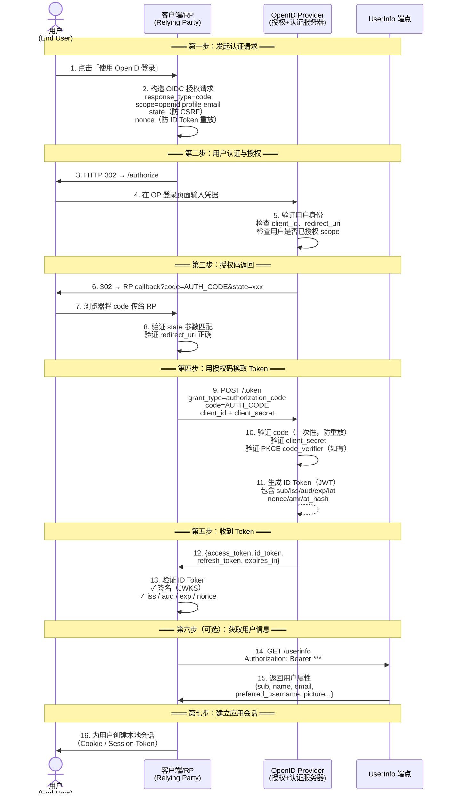

## 6.1 OAuth 2.0 缺了什么？

OAuth 2.0 解决的是**授权**问题——我允许这个应用访问我的资源。但它没有解决**认证**问题——这个用户是谁？

在企业 IAM（身份与访问管理）体系中，认证是授权的前提。一个完整的 IAM 平台不仅要能发 Token，还要能标准地回答「这个 Token 代表谁」。这就是 OIDC 在 IAM 栈中的位置——它是 OAuth 2.0 之上专门解决**身份认证**的标准化层。

很多开发者早期犯的错误是用 OAuth 2.0 来做认证：

```
"用户通过 OAuth 登录了，所以我知道他是谁"
```

但这不安全，因为：
- OAuth 2.0 没有定义用户身份的标准化传递方式
- Access Token 不包含用户身份信息（或者每个实现各不相同）
- 没有标准化的发现机制
- 没有会话管理

**OpenID Connect（OIDC）** 就是 OAuth 2.0 之上的一个薄层，专门解决认证问题。

## 6.2 OIDC 的核心概念

OIDC = OAuth 2.0 + 身份认证 + JWT

OIDC 在 OAuth 2.0 基础上增加了：

- **ID Token**（JWT 格式）：携带用户身份信息的安全令牌
- **UserInfo 端点**：获取用户额外属性的标准接口
- **发现文档**：自动发现服务器配置的标准机制
- **会话管理**：登录、登出、会话状态

### ID Token vs Access Token

| 特性 | ID Token | Access Token |
|-----|----------|--------------|
| 用途 | 认证（这是谁） | 授权（能做什么） |
| 受众 | 客户端应用 | 资源服务器 |
| 格式 | JWT | JWT 或不透明字符串 |
| 包含用户信息 | 是 | 不一定 |
| 应该发送给资源服务器？ | 不 | 是 |

## 6.3 ID Token 深度解析

### JWT 结构

JWT（JSON Web Token，RFC 7519）由三部分组成，用 `.` 分隔：

```
Header.Payload.Signature
```

**Header**：
```json
{
  "alg": "RS256",
  "kid": "key-2024",
  "typ": "JWT"
}
```

**Payload（Claims）**：
```json
{
  "iss": "https://idp.example.com",       // 签发者
  "sub": "user-12345",                     // 用户标识
  "aud": "my-client",                      // 受众（客户端 ID）
  "exp": 1600000000,                       // 过期时间
  "iat": 1599990000,                       // 签发时间
  "auth_time": 1599990000,                 // 用户认证时间
  "nonce": "abc123",                       // 防重放（与请求匹配）
  "amr": ["pwd", "otp"],                   // 认证方法引用
  "acr": "urn:mace:incommon:iap:silver",   // 认证上下文类引用
  "azp": "my-client"                       // 授权方（使用此 Token 的客户端）
}
```

### 关键 Claims 说明

**sub（Subject）**：用户的唯一标识符。这个标识符应当是**成对标识符**（Pairwise Subject Identifier），即为每个客户端生成不同的 sub 值，防止跨应用用户追踪。

**iss（Issuer）**：必须与 OIDC 发现文档中的 issuer 完全匹配，包括协议（https）和尾部斜杠的有无。

**aud（Audience）**：必须是接收此 Token 的客户端 ID。验证 ID Token 时，必须检查 aud 包含自己的 client_id。

**nonce**：从授权请求中传入，在 ID Token 中原样返回，用于防止 ID Token **重放攻击**（将 ID Token 绑定到本次授权请求）。注意：防 **CSRF** 的是 `state` 参数，不是 `nonce`，二者职责不同，不可混用。

**amr（Authentication Methods Reference）**：声明本次认证使用了哪些方式，amr 值由 RFC 8176 注册库规范：
- `pwd` — 密码
- `otp` — 一次性密码
- `mfa` — 多因素认证（表示本次认证**已使用多种因素**，是认证强度声明，而非单一认证方法）
- `swk` — 软件加密密钥
- `hwk` — 硬件加密密钥（如 YubiKey）
- `fpt` — 指纹
- `face` — 面部识别

**acr（Authentication Context Class Reference）**：认证的强度级别标识。

## 6.4 OIDC 认证流程

### 授权码模式（最常用）

```
1. 客户端重定向用户到 OpenID Provider（OP）

   GET /authorize?
     response_type=code
     &client_id=myapp
     &redirect_uri=https://myapp.com/callback
     &scope=openid%20profile%20email
     &state=abc123
     &nonce=xyz456

2. 用户认证并授权

3. OP 重定向回客户端（携带授权码）

   https://myapp.com/callback?code=xxx&state=abc123

4. 客户端用授权码交换 Token

   POST /token
   grant_type=authorization_code
   &code=xxx
   &redirect_uri=https://myapp.com/callback
   &client_id=myapp
   &client_secret=...

5. 返回 Token 响应

   {
     "access_token": "eyJ...",
     "id_token": "eyJhbGci...",
     "token_type": "Bearer",
     "expires_in": 3600,
     "refresh_token": "..."
   }

6. 验证 ID Token
   - 验证签名（使用 OP 的公钥）
   - 验证 iss（匹配 OP）
   - 验证 aud（包含自己的 client_id）
   - 验证 exp（未过期）
   - 验证 nonce（匹配请求中的值）
```

### OIDC 认证流程可视化

下面是 OIDC Authorization Code Flow 的完整时序图，展示用户、客户端（RP）、OpenID Provider 和 UserInfo 端点之间的交互。与 OAuth 2.0 纯授权流程的关键区别在于 ID Token 的生成与验证，以及可选的 UserInfo 端点调用。



### 时序图关键节点说明

| 步骤 | OAuth 2.0 中有吗？ | OIDC 新增了什么？ | 安全意义 |
|------|-------------------|-------------------|---------|
| 2 — scope=openid | 没有 | `openid` scope 声明这是 OIDC 认证请求 | 告诉 OP：客户端要认证用户，不只是授权 |
| 2 — nonce | 没有 | 客户端生成随机值，在 ID Token 中回传 | 将 ID Token 绑定到本次请求，防重放 |
| 5 — 用户身份验证 | 授权时不需要验证用户是谁 | 必须验证用户身份并记录认证时间 `auth_time` | OIDC 和 OAuth 的本质区别——认证 vs 授权 |
| 11 — 生成 ID Token | 没有 | OP 生成包含用户身份信息的 ID Token | ID Token 是 OIDC 的核心产出，是认证的证明 |
| 13 — 验证 ID Token | 没有 | RP 必须验证 ID Token 的签名和 claims | 不验证 = 可以伪造任何用户身份 |
| 14-15 — UserInfo | 没有 | 可选的标准化用户属性接口 | ID Token 放不下所有属性时补充使用 |

### OAuth 2.0 与 OIDC 流程对比速查

如果你已经理解 [OAuth 2.0 授权码流程](/docs/protocols/oauth2-authorization-code-pkce/)，OIDC 认证流程只多做了三件事：

1. **请求时加 `scope=openid`**：告诉 OP 这不是纯授权请求，是认证请求
2. **响应中多了 `id_token`**：一个 JWT，包含用户身份信息（sub/name/email 等）
3. **客户端多了 ID Token 验证步骤**：不验证签名和 claims 就等于没认证

```text
OAuth 2.0 流程：
  /authorize → 用户授权 → code → /token → {access_token}

OIDC 流程（在 OAuth 2.0 之上）：
  /authorize (scope=openid+nonce) → 用户认证+授权 → code →
  /token → {access_token + id_token} → 验证 ID Token → 登录完成
```

> ⚠️ 安全提醒：OIDC 的授权码交换环节同样面临 OAuth 2.0 的所有[攻击面](/docs/protocols/oauth2-attack-surface/)——redirect_uri 劫持、CSRF、授权码拦截等。因此 OAuth 2.1 要求所有 OIDC 客户端也必须启用 PKCE。详见 [OAuth 2.0 授权码流程与 PKCE 图解](/docs/protocols/oauth2-authorization-code-pkce/)。

### 关键 Scope

OIDC 的核心 scope：

- `openid`：必须的 scope，表示这是一个 OIDC 请求
- `profile`：用户的基本信息（姓名、昵称、头像、地区等）
- `email`：邮箱地址和邮箱验证状态
- `address`：邮寄地址
- `phone`：电话号码和验证状态
- `offline_access`：请求 Refresh Token（即使用户离线也能刷新）

### 认证与授权分离理解

```
OAuth 2.0 授权请求（仅获取 Access Token，授权码模式）：
  response_type=code
  scope=photos:read          # 不含 openid，token 端点只返回 access_token

OIDC 认证请求（获取 ID Token）：
  response_type=code
  scope=openid

OIDC 认证 + 授权（同时获取 ID Token 和 Access Token）：
  response_type=code
  scope=openid profile email photos:read

注：response_type=token 的隐式流程（Implicit Flow）已被 OAuth 2.0 Security BCP
（RFC 9700）不推荐使用，不应作为新项目的授权示例。
```

## 6.5 UserInfo 端点

用于获取用户更详细的属性信息。

```
GET /userinfo
Authorization: Bearer <access_token>

响应：
{
  "sub": "user-12345",
  "name": "张三",
  "given_name": "三",
  "family_name": "张",
  "preferred_username": "zhangsan",
  "email": "zhangsan@example.com",
  "email_verified": true,
  "picture": "https://idp.example.com/avatars/user-12345"
}
```

## 6.6 发现文档（Discovery）

OIDC 通过 `/.well-known/openid-configuration` 提供自动发现机制：

```
GET https://idp.example.com/.well-known/openid-configuration

{
  "issuer": "https://idp.example.com",
  "authorization_endpoint": "https://idp.example.com/authorize",
  "token_endpoint": "https://idp.example.com/token",
  "userinfo_endpoint": "https://idp.example.com/userinfo",
  "jwks_uri": "https://idp.example.com/jwks",
  "end_session_endpoint": "https://idp.example.com/logout",
  "scopes_supported": ["openid", "profile", "email"],
  "response_types_supported": ["code"],            # 隐式/hybrid 已不推荐，新部署建议仅声明 code
  "grant_types_supported": ["authorization_code", "refresh_token"],
  "subject_types_supported": ["public", "pairwise"],
  "id_token_signing_alg_values_supported": ["RS256", "ES256"],
  "token_endpoint_auth_methods_supported": ["client_secret_basic", "client_secret_post", "private_key_jwt"]
}
```

发现文档让客户端可以：
- 自动发现所有端点地址
- 知道支持哪些算法和模式
- 获取 JWKS（JSON Web Key Set）用于验证 Token 签名

## 6.7 会话管理

### RP-Initiated Logout

由客户端（Relying Party）发起的登出：

```
GET /end_session?
  id_token_hint=<ID Token>
  &post_logout_redirect_uri=https://myapp.com/logged-out
  &state=abc123
```

OP 执行登出后重定向到 `post_logout_redirect_uri`。

### Back-Channel Logout

OP 主动通知所有已登录的 RP 某个用户已登出：

```
POST /backchannel_logout
Content-Type: application/x-www-form-urlencoded

logout_token=<JWT>
```

这在用户从 OP 直接登出时尤其重要，确保所有应用都能及时清除用户的会话。

### Session Management（旧版）

OIDC Session Management 规范（draft-ietf-oauth-session-management，长期处于草案状态、未成为正式 RFC）定义了基于 iframe 的会话状态检测，但由于浏览器的第三方 Cookie 限制（Safari ITP、Firefox ETP），这种方法已基本不可用。建议使用 Back-Channel Logout 和短 Session 作为替代方案。

## 6.8 安全考量

### ID Token 验证清单

```
□ JWT 签名是否有效？（用 JWKS 中的公钥验证）
□ iss 是否匹配预期的 issuer？
□ aud 是否包含自己的 client_id？若 aud 为多值或与 client_id 不一致，必须验证 azp 等于自身 client_id
□ exp 是否未过期？
□ iat 是否在合理范围内（不能是未来时间）？
□ nonce 是否与请求时的一致？（如果请求中使用了）
□ 若响应中同时返回 access_token，验证 at_hash；若为 Hybrid Flow，验证 c_hash
```

### 常见安全错误

1. **不验证签名就信任 ID Token**：允许攻击者伪造任何用户身份。
2. **不验证 aud**：一个客户端收到的 ID Token 被另一个客户端使用。
3. **不验证 nonce**：容易被重放攻击。
4. **将 ID Token 发送给资源服务器**：资源服务器用 ID Token 做授权判断（应该用 Access Token）。
5. **Access Token 泄露后不处理**：应该有令牌吊销机制。

## 6.9 小结

OpenID Connect 是 OAuth 2.0 的自然延伸——用 ID Token（JWT）、UserInfo 端点和发现文档在授权的基础之上标准化了认证的语义。理解 ID Token 的结构、验证流程和 claims 含义，是正确实现 OIDC 的前提。在实际项目中，绝大部分 OIDC 的安全漏洞都来自于对 ID Token 验证的疏忽或不全。

> **延伸**：ID Token 签发后的生命周期管理（刷新、吊销、登出传播）见 [IAM 会话管理与 Token 生命周期]()。

## 6.10 IAM 中的 OIDC 常见问题（FAQ）

**Q1: IAM 系统中 OIDC 和 OAuth 2.0 到底怎么区分？**

OAuth 2.0 回答「你能访问什么」，OIDC 回答「你是谁」。在实践中，IAM 平台用 OAuth 2.0 的授权码流程完成用户认证后会同时返回 Access Token（授权）和 ID Token（认证）。区分两者的关键在于用途：Access Token 发给资源服务器做授权判断，ID Token 发给客户端确认用户身份——**不要把 ID Token 当成 API 的访问凭证**。

**Q2: IAM 架构中，为什么 OIDC 比 SAML 更适合现代应用？**

对终端用户来说 OIDC 和 SAML 的 SSO 体验相同。差异在开发者体验和适用范围：(1) OIDC 用 JSON/JWT，比 SAML 的 XML 轻量得多，移动端和 SPA 直接可用；(2) OIDC 原生支持 API 认证（Access Token → Resource Server），SAML 断言不能直接用于 API；(3) OIDC 有 OpenID Discovery（`.well-known/openid-configuration`）自动发现端点，SAML 需要手动交换元数据。在 IAM 企业架构中，新应用默认选 OIDC，SAML 仅用于兼容遗留系统和商业 SaaS。完整选型对比见 [SAML 2.0 深度解读]() 的选型决策矩阵。

**Q3: IAM 平台验证 ID Token 最容易漏掉什么？**

最容易漏掉三个校验：(1) `aud` 必须包含当前客户端的 `client_id`——漏掉它会导致跨客户端 Token 滥用；(2) `nonce` 必须与授权请求中发出的一致——漏掉它给重放攻击留了门；(3) 如果响应同时包含 `access_token`，必须校验 `at_hash`——漏掉它可能让中间人把 ID Token 和另一个 Access Token 绑定。ID Token 的底层格式是 JWT，完整的结构解析和签名验证流程见 [JWT 深入解读]()。

**Q4: IAM 体系中 OIDC 和 SCIM 分别解决什么问题？**

OIDC 解决「单点登录」——用户如何在多个应用间共享一次登录。SCIM 解决「用户生命周期」——用户从入职到离职，哪些应用自动开通/禁用账号。在 IAM 工程中两者是前后关系：OIDC 处理「用户进来时的认证」，SCIM 处理「用户账号在多个系统中的同步」。两者都是企业 IAM 的必备能力——有 SSO 没 SCIM 的结果是「手动在 20 个 SaaS 中创建用户」，有 SCIM 没 SSO 的结果是「账号同步了但用户还要每个应用单独登录」。

**Q5: 如何判断 IAM 系统的 OIDC 实现是否安全？**

对照本章 6.8 节的验证清单逐项检查。额外注意三点：(1) 生产环境必须用 RS256/ES256 签名算法，不用 `none`；(2) `redirect_uri` 必须精确匹配——OAuth 攻击面的第一条就是 redirect_uri 劫持，详见 [OAuth 2.0 攻击面与防护]()；(3) 如果用的是公共客户端（SPA、移动端），必须启用 PKCE——OAuth 2.1 已将 PKCE 强制化。
