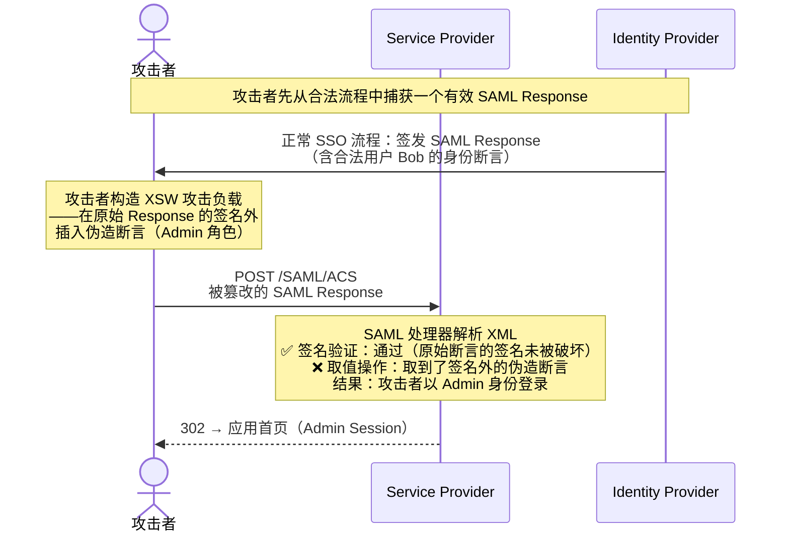
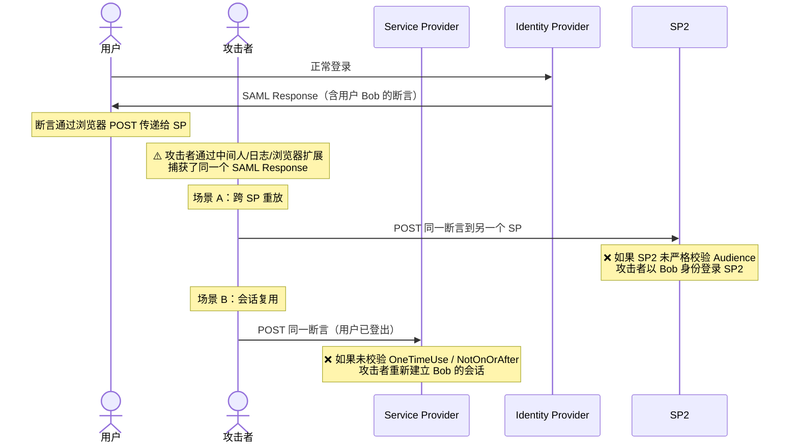
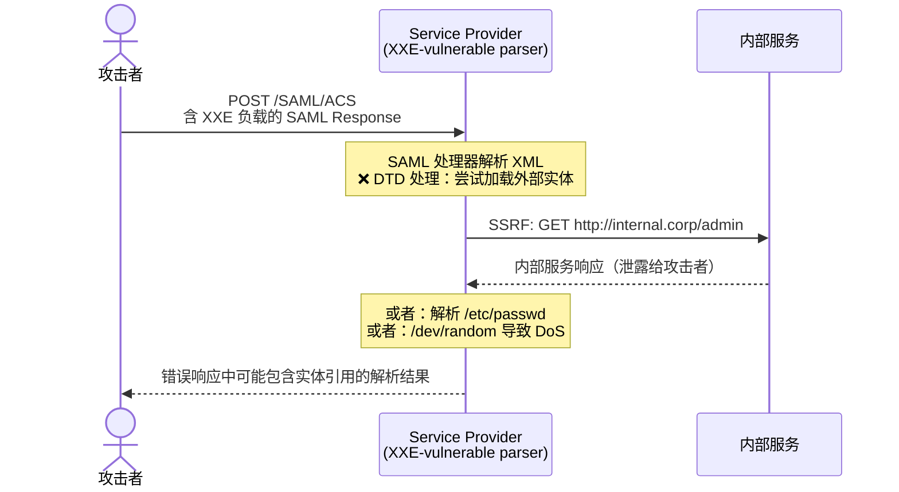
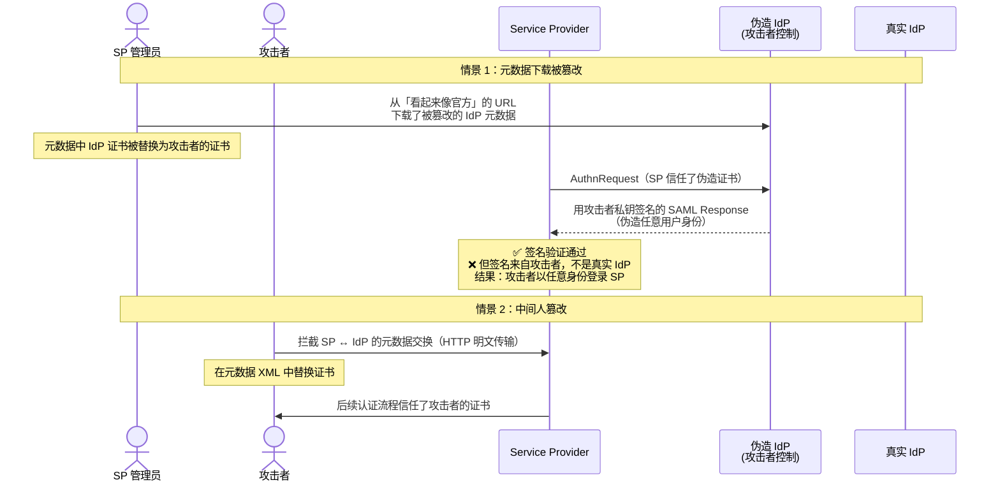

## 为什么需要 SAML 安全分析

上一章 [OAuth 2.0 攻击面与防护]() 分析了 OAuth 的五类攻击——但 IAM 身份联邦的另一大支柱 SAML 2.0 同样拥有自己的攻击面。在企业实践中，SAML 承载着金融、政务、教育等领域的身份联邦流量，一次 SAML 安全漏洞就可能导致跨系统身份伪造。

SAML 的安全挑战与 OAuth 不同：OAuth 的安全问题多集中在 HTTP 重定向和 Token 传递环节，而 SAML 的根因在于 **XML 解析的复杂性**——签名验证、XML Schema、实体引用等 XML 特性给了攻击者更多操作空间。

以下四个攻击面是过去二十年里真实发生过的漏洞模式，每一个都配有攻击流程图、根因分析和防护方案。

## 四大攻击面总览

| # | 攻击面 | 根本原因 | 关键防护 | 相关规范 |
|---|--------|---------|---------|---------|
| 1 | XML 签名包装（XSW） | SAML 处理器在签名校验后取错 XML 节点 | 仅信任签名引用的元素，使用 XPath 白名单 | [SAML 2.0 Security](https://docs.oasis-open.org/security/saml/v2.0/saml-sec-consider-2.0-os.pdf) §3.1 |
| 2 | 断言重放（Replay） | SP 未校验断言的时效性/一次性/受众 | 校验 NotOnOrAfter + InResponseTo + Audience + OneTimeUse | [SAML 2.0 Core](https://docs.oasis-open.org/security/saml/v2.0/saml-core-2.0-os.pdf) §2.5 |
| 3 | XXE 注入 | SAML 处理器解析含外部实体的 XML 断言 | 禁用 DTD 和外部实体（XXE-safe parser config） | OWASP XXE Prevention |
| 4 | 元数据伪造/MITM | 攻击者替换 SP 元数据中的证书 | 证书 pinning、metadata 签名、TLS 双向校验 | [SAML 2.0 Metadata](https://docs.oasis-open.org/security/saml/v2.0/saml-metadata-2.0-os.pdf) |

---

## 1. XML 签名包装（XSW）

### 攻击原理

XSW 是 SAML 历史上最著名也最危险的攻击类别（CVE-2012-0053 等）。核心思路是：**XML 签名覆盖了原始断言，攻击者在签名覆盖之外插入伪造断言，利用 SAML 处理器「只验签不看节点」的缺陷完成身份伪造**。



### 根因：签名覆盖 ≠ 内容可信

SAML 签名验证只回答「被签名的这个 XML 子树没有被篡改」，但不回答「当前处理的这个 XML 文档中，哪个节点才是签名所保护的」。攻击者利用 XML 的树结构灵活性，在同一个文档中同时放置合法签名节点和恶意未签名节点，而 SAML 处理器的取值逻辑（通常是 `//saml:Assertion`）取到了恶意节点。

XSW 攻击的变体：

| 变体 | 手法 | 难度 |
|------|------|------|
| **简单包装** | 在原 Response 外再包一层 Response，内层是签名保护的原始断言，外层是伪造断言 | 低 |
| **同级插入** | 在签名断言同级插入伪造断言，处理器取第一个匹配节点 | 低 |
| **签名移除** | 移除原始签名，用新签名重新签名伪造断言（需要攻击者自己的证书在 SP 信任链中） | 中 |
| **ID 引用偏移** | 修改签名的 Reference URI，使其指向伪造节点而非原始节点 | 中 |

### 防护方案

**核心原则：只信任通过签名验证的具体节点，不通过全局 XPath 取值。**

```java
// ❌ 危险做法——全局 XPath 取值，可能取到签名外的恶意节点
Node assertion = doc.evaluate("//saml:Assertion", ...);

// ✅ 安全做法——从签名校验结果中获取受保护的节点
NodeList signedNodes = signature.getSignedNodes();  // 仅返回签名覆盖的节点
for (Node n : signedNodes) {
    if (isExpectedRootElement(n, "Assertion")) {
        // 只处理签名保护的节点
        processAssertion(n);
    }
}
```

此外，SAML 处理器应配置：

1. **Schema 校验前置**：在签名验证前先用 XML Schema 校验文档结构——拒绝不符合 SAML Schema 的文档（多根、非法嵌套等）
2. **根节点校验**：确认被签名的节点恰为预期的 `saml:Assertion` 或 `saml:Response`，而非更深或更浅的层级
3. **白名单 XPath**：不使用全局 `//` 通配符，限定为签名节点内的相对路径（如 `./saml:AttributeStatement`）

> 参考资料：SAML 2.0 Security Considerations §3.1 明确要求实现者「验证签名覆盖了所有应被保护的元素」，但具体检测逻辑取决于实现——这正是 XSW 能够在不同 SAML 库中反复出现的原因。

---

## 2. 断言重放（Assertion Replay）

### 攻击原理

攻击者捕获一个有效的 SAML Response（如通过中间人、浏览器历史或日志泄露），在断言有效期内在不同 SP 上重放，或等待用户会话结束后复用。



### 防护：多层时效校验

SAML 提供了多个字段来防御重放，但关键在于 **SP 必须全部校验**——一个字段的遗漏就可能被利用：

| 校验字段 | 作用 | 正确配置 |
|----------|------|----------|
| `NotOnOrAfter` | 断言过期时间 | 建议 ≤ 5 分钟；SP 必须强制校验 |
| `NotBefore` | 断言生效起始时间 | 校验当前时间不早于此 |
| `InResponseTo` | 绑定 AuthnRequest | SP-Initiated SSO 时必须校验——断言中的 InResponseTo 与自己发出的 AuthnRequest ID 一致 |
| `Audience` | 目标受众（SP Entity ID） | 校验断言中的 Audience 包含自己的 Entity ID |
| `OneTimeUse` | 一次性使用标记 | SP 应缓存已处理断言的 ID，拒绝重复提交 |
| `Recipient` | 断言目标 URL | 校验 Response 的 Destination 与自己的 ACS URL 一致 |

**特别注意 `InResponseTo` 校验**：如果启用 SP-Initiated SSO，必须校验 InResponseTo。这不仅能防重放，还能防 CSRF——攻击者无法预测合法的 AuthnRequest ID。

> 对于 IdP-Initiated SSO（IdP 主动推送断言），InResponseTo 为空。这是 IdP-Initiated 的固有弱点——SP 无法验证这个断言是否由合法用户的合法请求触发。因此安全实践推荐 **尽量使用 SP-Initiated SSO**，仅在兼容场景保留 IdP-Initiated。

---

## 3. XXE 注入

### 攻击原理

SAML 基于 XML，如果 SAML 处理器在解析时启用了 DTD（Document Type Definition）和外部实体解析，攻击者可以在 SAML 断言中嵌入恶意实体引用：

```xml
<!-- 攻击者提交的恶意 SAML 断言 -->
<?xml version="1.0" encoding="UTF-8"?>
<!DOCTYPE foo [
  <!ENTITY xxe SYSTEM "file:///etc/passwd">
  <!ENTITY xxe2 SYSTEM "http://internal.corp/admin">
  <!ENTITY xxe3 SYSTEM "file:///dev/random">  <!-- DoS 向量 -->
]>
<saml:Assertion ...>
  <saml:Subject>
    <saml:NameID>&xxe;</saml:NameID>  <!-- 攻击者用实体引用填充 NameID -->
  </saml:Subject>
</saml:Assertion>
```



### 防护

**最简单彻底的防护**：在 SAML 处理器中禁用 DTD 和外部实体。

```java
// Java: XXE-safe DocumentBuilderFactory 配置
DocumentBuilderFactory dbf = DocumentBuilderFactory.newInstance();
dbf.setFeature("http://apache.org/xml/features/disallow-doctype-decl", true);
dbf.setFeature("http://xml.org/sax/features/external-general-entities", false);
dbf.setFeature("http://xml.org/sax/features/external-parameter-entities", false);
dbf.setFeature("http://apache.org/xml/features/nonvalidating/load-external-dtd", false);
dbf.setXIncludeAware(false);
dbf.setExpandEntityReferences(false);
```

不同语言的 XXE 防护配置：

| 语言/环境 | 防护方式 |
|-----------|---------|
| Java | 如上，禁用 DOCTYPE + 外部实体 |
| .NET | `XmlReaderSettings.DtdProcessing = DtdProcessing.Prohibit` |
| Python (lxml) | `etree.XMLParser(resolve_entities=False, dtd_validation=False)` |
| Go (`encoding/xml`) | 默认不处理 DTD（安全），但仍建议不启用 TokenReader 的 `Strict=false` |
| OpenSAML (Java) | v3+ 默认禁用了 DTD，但仍建议显式配置 ParserPool |

> XXE 不是 SAML 独有的问题，但 SAML 恰好是 XXE 的高价值目标——因为 SAML 消息通常在身份认证路径上，一旦被利用就能伪造任意身份。OWASP 将其列为 2017 Top 10 #4。

---

## 4. 元数据伪造与 MITM

### 攻击原理

SAML 的信任模型建立在元数据（Metadata）之上——SP 需要通过元数据获取 IdP 的证书，IdP 需要通过元数据了解 SP 的 ACS URL。如果攻击者能够篡改元数据交换过程，就能：

1. 替换 IdP 证书——攻击者用自己的私钥签发伪造断言
2. 替换 SP 的 ACS URL——把 SAML Response 重定向到攻击者控制的端点



### 防护

1. **元数据签名**：要求元数据文件由可信方签名（`<md:EntitiesDescriptor>` 或 `<md:EntityDescriptor>` 的 XML Signature）
2. **证书 Pinning**：SP 在配置中硬编码 IdP 证书指纹，不从元数据中动态获取
3. **HTTPS 强制**：元数据下载 URL 必须是 HTTPS，禁用 HTTP 回退
4. **TLS 双向认证**：在 SP ↔ IdP 的 SOAP/Artifact back-channel 中使用 mTLS
5. **定期证书轮换**：已轮换的旧证书必须从 SP 信任库中删除——否则攻击者拿到泄露的私钥仍可签发断言

---

## 综合防护清单

SAML 安全的本质是 **XML 处理安全 + 协议语义校验**。以下是生产环境的检查清单：

### XML 层
- [ ] 禁用 DTD 和外部实体（XXE 防护）
- [ ] Schema 校验前置（拒绝非法结构）
- [ ] 签名覆盖校验：仅信任通过签名的节点
- [ ] XPath 白名单：不使用全局 `//` 查询
- [ ] 限制 XML 文档大小（防止 DoS/Billion Laughs）

### 协议层
- [ ] 校验 NotOnOrAfter + NotBefore（时间窗口 ≤ 5 分钟）
- [ ] 启用 SP-Initiated SSO；校验 InResponseTo
- [ ] 校验 Audience（包含自己的 Entity ID）
- [ ] 校验 Destination/Recipient
- [ ] 启用 OneTimeUse + 维护已处理断言 ID 缓存

### 元数据与传输层
- [ ] 元数据下载仅通过 HTTPS
- [ ] 元数据签名验证
- [ ] IdP 证书 Pinning（可选但推荐）
- [ ] Artifact Resolution 使用 mTLS
- [ ] 证书轮换后删除旧证书

### 运行监控
- [ ] 对签名验证失败的日志告警
- [ ] 对同一断言 ID 的重复提交告警
- [ ] 对超过合理时间窗口的断言告警

---

## IAM 中的 SAML 安全 FAQ

**Q1: IAM 系统中 SAML 和 OAuth 谁更安全？**

两者在各自领域都有成熟的安全模型——OAuth 的安全重点在 Token 管理和重定向校验，SAML 的安全重点在 XML 处理和断言校验。真正的风险不在于选哪种协议，而在于 **实现是否正确**。在 IAM 实践中，两者都需要严格的安全配置。OAuth 的攻击面分析见 [OAuth 2.0 攻击面与防护]()。

**Q2: XSW 攻击在 2026 年还有威胁吗？**

OpenSAML v3+ 和 Shibboleth IdP v4+ 已经在默认配置中修复了大多数 XSW 变体，但以下几点仍需警惕：(1) 自研 SAML 实现仍然容易中招，(2) 老版本库（如 OpenSAML v2）仍有已知漏洞，(3) 部分商业产品的 SAML 模块可能未及时更新。只要你的 SAML 基础设施中有自研代码或老版本组件，XSW 就依旧是需要主动防御的威胁。

**Q3: IdP-Initiated SSO 到底安不安全？**

IdP-Initiated SSO 的本质问题是 SP 无法验证「这个断言是由合法用户主动发起的认证流程产生的」——因为 `InResponseTo` 为空。如果 IdP 被攻破（或配置错误），SP 会接受任意未请求的断言。安全建议：(1) 默认使用 SP-Initiated，(2) 如需保留 IdP-Initiated，在 SP 端增加额外校验（如 IP 白名单、设备指纹），(3) 限制 IdP-Initiated 的来源网络范围。

**Q4: 如何判断现有 IAM 系统的 SAML 实现是否有 XSW 漏洞？**

最简单的方法是检查 SAML 处理库的版本和配置：(1) 确认用的是最新稳定版 OpenSAML/Shibboleth/其他库，(2) 检查 XML Parser 配置中是否禁用了外部实体，(3) 确认取值逻辑是从签名验证结果中获取节点，而非全局 XPath。如果你不确定，可以用 [SAML Raider](https://github.com/SAMLRaider/SAMLRaider)（Burp Suite 插件）或 [ESPRESSO](https://github.com/portswigger/espresso) 进行渗透测试。

---

## 参考来源

1. [SAML 2.0 Security and Privacy Considerations](https://docs.oasis-open.org/security/saml/v2.0/saml-sec-consider-2.0-os.pdf) — OASIS 官方安全指南
2. [SAML 2.0 Core Specification](https://docs.oasis-open.org/security/saml/v2.0/saml-core-2.0-os.pdf) — 断言和协议核心规范
3. [On Breaking SAML: Be Whoever You Want to Be](https://www.usenix.org/conference/usenixsecurity12/technical-sessions/presentation/somorovsky) — USENIX Security 2012，XSW 的经典论文
4. [OWASP XXE Prevention Cheat Sheet](https://cheatsheetseries.owasp.org/cheatsheets/XML_External_Entity_Prevention_Cheat_Sheet.html)
5. [SAML Raider — Burp Suite Extension](https://github.com/SAMLRaider/SAMLRaider)
6. [NIST SP 800-63C — Federation and Assertions](https://pages.nist.gov/800-63-3/sp800-63c.html)
