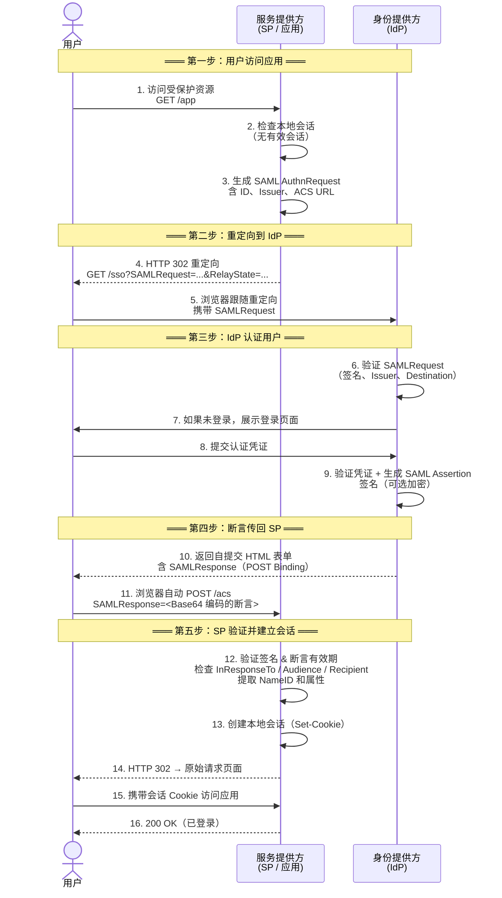
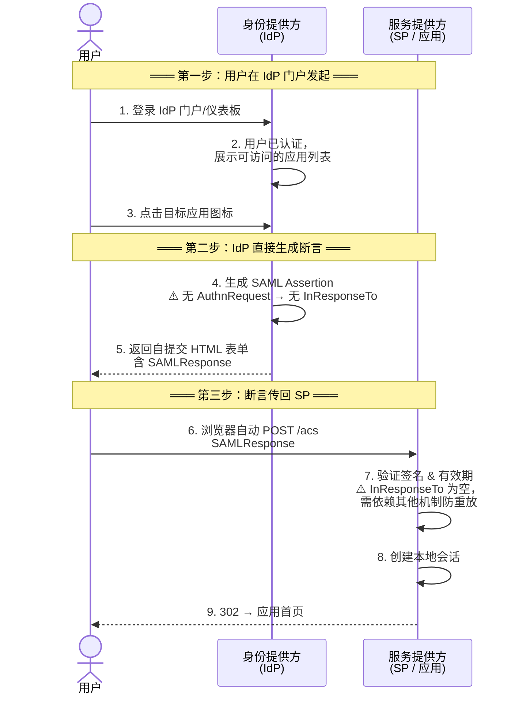

## 7.1 历史与现状

在企业 IAM（身份与访问管理）体系中，SAML（Security Assertion Markup Language）是由 OASIS 标准组织制定的基于 XML 的身份联邦协议。SAML 2.0 于 2005 年发布，是 Web 浏览器 SSO 的行业先驱，至今仍是 IAM 身份联邦场景中与 OIDC 并列的两大支柱协议之一。

尽管 OIDC 在新应用中的采用率已远超 SAML，但 SAML 2.0 在企业级应用中依然占有重要地位。特别是在以下场景：

- 金融、政府、教育等传统行业
- 大型企业的遗留应用
- 需要与 Microsoft AD FS 集成的场景
- 教育和研究联邦（如 eduGAIN、InCommon，基于 Shibboleth）

### SAML vs OIDC 的历史视角

|  | SAML 2.0 | OIDC |
|--|---------|------|
| 发布时间 | 2005 | 2014 |
| 数据格式 | XML | JSON |
| 签名方式 | XML DSig | JWS |
| 加密方式 | XML Enc | JWE |
| 绑定协议 | 重定向、POST、Artifact 等 | HTTP（Redirect/POST，含 form_post/jwt response mode） |
| 移动端支持 | 差 | 好 |
| SPA 支持 | 差 | 好 |
| 复杂度 | 高 | 低 |
| 行业采用 | 传统企业 | 现代应用 |

一句话总结：**遗留系统用 SAML，新系统用 OIDC，作为 IDaaS 平台两者都要支持。**

## 7.2 SAML 的核心概念

### 主体（Subject）

被认证的实体，通常是用户。由 `NameID` 标识。

### 身份提供方（Identity Provider, IdP）

负责认证用户并签发断言的一方。

### 服务提供方（Service Provider, SP）

依赖 IdP 的断言做出授权决定的一方。即用户要访问的应用。

### 断言（Assertion）

SAML 的核心数据单元，是由 IdP 签发的关于用户的安全声明。包含三种语句：

1. **Authentication Statement**：谁在什么时间用什么方式认证了
2. **Attribute Statement**：用户的属性信息
3. **Authorization Decision Statement**：表达授权决策（在 Web SSO 中很少使用，多由 SP 自行做授权决策；规范本身并未废弃）

### 元数据（Metadata）

描述 IdP 或 SP 配置的 XML 文档，包括实体 ID、端点地址、支持的服务、证书等。

### 协议（Protocol）

SAML 定义的标准化请求-响应消息。最常见的协议是 **Web Browser SSO Profile**。

### 绑定（Binding）

协议消息如何传输。主要绑定：

- **HTTP Redirect Binding**：消息通过 URL 参数传输（适用于短消息）
- **HTTP POST Binding**：消息通过 POST 表单传输（适用于长消息，如断言）
- **HTTP Artifact Binding**：通过后端通道获取断言（更安全但更复杂）
- **HTTP SOAP Binding**：后端 SOAP 调用

## 7.3 Web Browser SSO Profile 详解

### SP-Initiated SSO（SP 发起）

由应用（SP）发起的 SSO——这是最常见也最安全的模式：



关键步骤解释：

| 步骤 | 安全要点 | 常见失误 |
|------|---------|---------|
| 3. 生成 AuthnRequest | 必须包含随机 ID 和正确的 ACS URL | ACS URL 配置错误导致 IdP 拒绝 |
| 4. 重定向 | RelayState 用于 SP 记住用户原始请求路径 | RelayState 被忽略导致登录后跳到首页 |
| 6. IdP 验证 | 校验 Destination 与元数据中的端点一致 | Destination 校验缺失 → 可被用于断言转发攻击 |
| 10-11. POST Binding | 断言通过用户浏览器回传，必须 HTTPS + 签名/加密 | 未加密断言中的敏感属性可被用户直接解码看到 |
| 12. SP 验证 | 必须校验 InResponseTo、Audience、有效期、签名 | 跳过了 Audience 校验 → 同一 IdP 下不同 SP 可能互相接受断言 |

### IdP-Initiated SSO（IdP 发起）

用户从 IdP 门户/仪表板发起登录，省去 SP 发 AuthnRequest 的步骤：



**⚠️ IdP-Initiated 的安全风险：**

因为没有 AuthnRequest（无 InResponseTo），SP 无法将断言与一次特定的认证请求绑定。攻击者如果能获取一个有效的 SAML Assertion（例如通过中间人攻击、日志泄露、或浏览器历史），可以在断言有效期内向 SP 重放。

因此安全最佳实践中通常建议：
- **优先使用 SP-Initiated SSO**（有 InResponseTo 防重放）
- 如需支持 IdP-Initiated，必须配合极短的断言有效期（建议 ≤ 2 分钟）
- SP 端启用「禁止未请求的断言」（Unsolicited Response 检测），若配置允许则应记录审计日志

### SP-Initiated vs IdP-Initiated 对比

| 对比维度 | SP-Initiated | IdP-Initiated |
|---------|-------------|---------------|
| 触发方式 | 用户访问应用 → 被重定向到 IdP | 用户在 IdP 门户点击应用 |
| AuthnRequest | 有（含 ID → InResponseTo） | 无 |
| 防重放 | InResponseTo + 时间窗口 | 仅靠时间窗口（弱） |
| 安全性 | ⭐⭐⭐⭐⭐ | ⭐⭐⭐ |
| 用户体验 | 从应用入口进入 | 从 IdP 统一门户进入 |
| 推荐场景 | 所有新部署 | 仅在门户型场景保留，配合短有效期

### SAMLRequest（AuthnRequest）

```xml
<samlp:AuthnRequest
    xmlns:samlp="urn:oasis:names:tc:SAML:2.0:protocol"
    xmlns:saml="urn:oasis:names:tc:SAML:2.0:assertion"
    ID="identifier-1"
    Version="2.0"
    IssueInstant="2024-01-01T00:00:00Z"
    Destination="https://idp.example.com/sso"
    ProtocolBinding="urn:oasis:names:tc:SAML:2.0:bindings:HTTP-POST"
    AssertionConsumerServiceURL="https://sp.example.com/acs">
  <saml:Issuer>https://sp.example.com/metadata</saml:Issuer>
  <samlp:NameIDPolicy Format="urn:oasis:names:tc:SAML:1.1:nameid-format:emailAddress"
                      AllowCreate="true"/>
  <samlp:RequestedAuthnContext Comparison="exact">
    <saml:AuthnContextClassRef>urn:oasis:names:tc:SAML:2.0:ac:classes:PasswordProtectedTransport</saml:AuthnContextClassRef>
  </samlp:RequestedAuthnContext>
</samlp:AuthnRequest>
```

### SAMLResponse（包含 Assertion）

```xml
<samlp:Response
    ID="response-1"
    Version="2.0"
    IssueInstant="2024-01-01T00:01:00Z"
    Destination="https://sp.example.com/acs"
    InResponseTo="identifier-1">
  <saml:Issuer>https://idp.example.com/metadata</saml:Issuer>
  <samlp:Status>
    <samlp:StatusCode Value="urn:oasis:names:tc:SAML:2.0:status:Success"/>
  </samlp:Status>
  <saml:Assertion
      ID="assertion-1"
      Version="2.0"
      IssueInstant="2024-01-01T00:01:00Z">
    <saml:Issuer>https://idp.example.com/metadata</saml:Issuer>
    <ds:Signature>
      <!-- 数字签名 -->
    </ds:Signature>
    <saml:Subject>
      <saml:NameID Format="urn:oasis:names:tc:SAML:1.1:nameid-format:emailAddress">
        zhangsan@example.com
      </saml:NameID>
      <saml:SubjectConfirmation Method="urn:oasis:names:tc:SAML:2.0:cm:bearer">
        <saml:SubjectConfirmationData
            NotOnOrAfter="2024-01-01T00:06:00Z"
            Recipient="https://sp.example.com/acs"
            InResponseTo="identifier-1"/>
      </saml:SubjectConfirmation>
    </saml:Subject>
    <saml:Conditions NotBefore="2024-01-01T00:01:00Z"
                     NotOnOrAfter="2024-01-01T00:06:00Z">
      <saml:AudienceRestriction>
        <saml:Audience>https://sp.example.com/metadata</saml:Audience>
      </saml:AudienceRestriction>
    </saml:Conditions>
    <saml:AuthnStatement AuthnInstant="2024-01-01T00:01:00Z"
                         SessionIndex="session-1">
      <saml:AuthnContext>
        <saml:AuthnContextClassRef>
          urn:oasis:names:tc:SAML:2.0:ac:classes:PasswordProtectedTransport
        </saml:AuthnContextClassRef>
      </saml:AuthnContext>
    </saml:AuthnStatement>
    <saml:AttributeStatement>
      <saml:Attribute Name="email">
        <saml:AttributeValue>zhangsan@example.com</saml:AttributeValue>
      </saml:Attribute>
      <saml:Attribute Name="displayName">
        <saml:AttributeValue>张三</saml:AttributeValue>
      </saml:Attribute>
      <saml:Attribute Name="department">
        <saml:AttributeValue>技术部</saml:AttributeValue>
      </saml:Attribute>
    </saml:AttributeStatement>
  </saml:Assertion>
</samlp:Response>
```

## 7.4 SAML 的安全机制

### 断言签名（Assertion Signing）

IdP 使用自己的私钥对断言进行数字签名，SP 用 IdP 元数据中的公钥验证签名。这确保了断言的完整性和真实性。

### 响应签名（Response Signing）

对整个 SAML Response 签名。建议同时启用 Response 签名和 Assertion 签名。

### 断言加密

使用 SP 的公钥加密整个断言，确保只有目标 SP 能解密。适合通过用户浏览器传输敏感信息时。

### Subject Confirmation

确保断言被正确的 SP 使用：

- **Bearer**：持有者确认，任何人持有此断言即可使用（最常用，但必须配合 TLS）
- **Holder of Key**：需要证明持有指定的私钥

### 安全特性详解

- `InResponseTo`：SAMLResponse 中的值必须与 SAMLRequest 的 ID 匹配，防重放攻击。
- `NotBefore` / `NotOnOrAfter`：断言的时间窗口限制。
- `AudienceRestriction`：限定断言的目标受众（SP Entity ID）。
- `Recipient`：指定接收断言的精确 URL。
- `Destination`：指定消息的精确目标 URL。

## 7.5 元数据交换

元数据是 SAML 集成的基石，描述了 IdP 和 SP 的所有技术细节。

### IdP 元数据

包含的关键信息：
- Entity ID
- SSO 端点（Redirect/POST/Artifact Binding）
- SLO（Single Logout）端点
- 签名和加密证书
- 支持的 NameID 格式
- organization 和联系人信息

### SP 元数据

包含的关键信息：
- Entity ID
- Assertion Consumer Service (ACS) 端点
- SLO 端点
- 加密证书（用于加密断言）
- 请求的属性列表

### 实际集成

集成的标准流程：
1. （SP 提供方）向你提供 SP 元数据 XML 或 URL
2. 你将 SP 元数据导入 IdP，获得 IdP 元数据
3. 将 IdP 元数据提供给 SP 提供方
4. 双方测试 SSO 流程

## 7.6 常见实现场景

### 企业 SSO（AD FS + SaaS 应用）

```
用户 → AD FS（IdP）→ SAML → Salesforce/Workday/Jira（SP）
```

用户使用域账号登录，通过 AD FS 签发 SAML 断言，无缝访问 SaaS 应用。

> 趋势提示：Microsoft 已推荐将 AD FS 迁移至 Microsoft Entra ID（原 Azure AD），AD FS 不再新增功能、仅维护安全更新；新部署优先考虑 Entra ID 作为 SAML/OIDC IdP，已有 AD FS 可经联邦与 Entra ID 共存过渡。

### 教育联邦（Shibboleth）

Shibboleth 是教育和研究领域的 SAML 实现标准。eduGAIN、InCommon 等教育身份联邦使用 Shibboleth 实现跨机构身份认证（注：eduroam 属于基于 RADIUS 的无线网络漫游联邦，与 SAML 协议不同，不应混淆）。近年来 Shibboleth IdP（v4+）也增加了 OIDC 支持，不少教育联邦正在 SAML 与 OIDC 双协议运行。

### 中国场景（CAS + SAML）

Apereo CAS 同时支持 SAML 和 OIDC，在高校和政务场景中广泛使用。我们将在[第15章]()详细讨论 CAS。

## 7.7 SAML vs OIDC 选型指南

第 7.1 节的对比表给出了协议层面的差异，但实际选型需要的不仅是格式对比。下面是一个面向工程决策的对比矩阵和常见问题。

### 选型决策矩阵

| 决策维度 | SAML 2.0 | OIDC | 建议 |
|---|---|---|---|
| 应用类型 | 传统 Web 应用（服务器端渲染） | SPA、移动 App、API 优先应用 | 新项目偏向 OIDC；遗留企业 Web 应用用 SAML |
| 移动端支持 | 无原生支持，需额外适配 | 原生支持（AppAuth SDK 等） | 移动端优先 OIDC |
| SPA / 前端应用 | 不支持（无 JS 友好的 Token 格式） | 原生支持（BFF 模式推荐） | 必须用 OIDC |
| API / 微服务 | 不适用（SAML 断言不是 API Token） | 适用（JWT Access Token） | 必须用 OIDC |
| 企业 SaaS 集成 | 大多数企业 SaaS 首选（Salesforce、Workday、Jira） | 新 SaaS 通常同时提供，但 SAML 仍是企业默认 | 看 SaaS 支持什么；两者都支持时优先 OIDC |
| AD / LDAP 集成 | AD FS 原生支持 SAML；传统企业标准 | 通过 IdP（如 Keycloak）桥接 | 已有 AD FS 可继续 SAML；新部署推荐 OIDC 桥接 |
| 教育/研究联邦 | 主流标准（Shibboleth、eduGAIN、InCommon） | 部分支持（Shibboleth v4+），占比仍在增长 | 教育联邦以 SAML 为主，OIDC 逐渐补充 |
| 用户身份信息传递 | SAML Attribute Statement | ID Token + UserInfo 端点 | OIDC 更灵活，JWT Claims 可直接被应用解析 |
| 单点登出（SLO） | 协议原生支持（但实现复杂、互操作差） | OIDC 有 RP-Initiated Logout + Back-Channel Logout 草案 | SAML SLO 理论更强但落地差；OIDC 逐步完善 |
| 部署复杂度 | 高（XML 配置、证书管理、元数据交换） | 中（JSON 配置、发现文档自动获取） | OIDC 集成成本更低 |
| Token 格式 | XML（SAML Assertion） | JSON（JWT） | 现代技术栈天然倾向 JSON |
| 安全模型 | XML DSig + XML Enc | JWS + JWE + Token Binding（DPoP） | 两者均可安全；OIDC 安全扩展更活跃 |
| 标准活跃度 | 稳定，几乎不再演进 | 活跃演进（OAuth 2.1、FAPI、OpenID Federation） | 长期看 OIDC 生态更健康 |

### 常见问题（FAQ）

**Q1: 新项目应该选 SAML 还是 OIDC？**

如果应用是 SPA、移动 App、或者需要保护 API，只有 OIDC 可选。如果应用是传统服务器端渲染的企业 Web 应用，且需要对接已有 AD FS 或企业 SAML IdP，可以用 SAML。总体趋势是：**新项目默认选 OIDC，只有在集成遗留 SAML 基础设施时使用 SAML**。

**Q2: 已有 SAML 应用要不要迁移到 OIDC？**

不需要为了迁移而迁移。SAML 2.0 是成熟稳定标准，只要 IdP 和 SP 都正常工作，没有安全漏洞，无须强行迁移。迁移时机通常是：
- 应用从服务端渲染改为 SPA/移动端
- 需要支持 API / 微服务认证
- 原 SAML IdP 退役（如 AD FS 迁移到 Microsoft Entra ID）
- 运维团队对 XML 证书管理感到难以维护

迁移策略：IdP 同时暴露 SAML 和 OIDC 端点，逐个应用切换，SAML 和 OIDC 共存过渡期可能持续数年。

**Q3: IDaaS 平台必须同时支持 SAML 和 OIDC 吗？**

作为面向企业客户的 IDaaS 平台，几乎必须同时支持。企业环境中 SAML 应用（Salesforce、Workday、Jira Cloud 等）和 OIDC 应用（自研 SPA、Kubernetes、Grafana 等）会长期共存。只支持一种协议会直接排除大量企业场景。

**Q4: SAML 和 OIDC 的 SSO 体验有区别吗？**

对终端用户来说，SSO 体验基本相同——都是一次登录、多点访问。差异主要在幕后：OIDC 的登录流程通常更快（轻量 JSON，无 XML 解析），移动端体验明显更好（有 AppAuth 等成熟 SDK）。SAML 的 SLO（单点登出）在协议层面定义更完整，但实际落地中双方的 SLO 体验都取决于 IdP 实现质量。

**Q5: SAML 和 OIDC 可以共存于同一个应用吗？**

技术上一个应用通常只对接一种协议。但如果应用前端是多种形态（Web + 移动 App），可以在 IdP 层统一后分别暴露：Web 用 SAML，移动 App 用 OIDC，后端 API 统一用 OIDC/JWT。Keycloak 等 IdP 支持这种多协议同时暴露。

### 迁移路径参考

从 SAML 迁移到 OIDC 的典型路径（以 AD FS → Microsoft Entra ID 为例）：

```
阶段 1：共存期
  用户 → AD FS（SAML）→ 现有 SAML 应用
  用户 → Entra ID（OIDC）→ 新 OIDC 应用
  Entra ID 通过联邦信任 AD FS（用户仍在本地 AD 认证）

阶段 2：迁移期
  - 逐个应用从 SAML 切换到 OIDC
  - 用户身份逐步从 AD FS 迁移到 Entra ID（Azure AD Connect / Entra Connect Sync）
  - SAML 和 OIDC 应用共存

阶段 3：收尾期
  - 所有应用已切换到 OIDC
  - AD FS 仅保留作为备用，不再新增依赖
  - 最终退役 AD FS
```

> 注意：Microsoft 已于 2024 年明确 AD FS 不再新增功能、仅维护安全更新，推荐客户迁移至 Microsoft Entra ID。如果已有 AD FS 基础设施，建议尽早规划迁移，但迁移周期通常以年为单位，关键是开始而不是立刻完成。

## 7.8 SAML 与 OIDC 互操作

作为 IDaaS 平台，经常需要在这两个协议之间进行转换：

- 对 SAML 应用暴露 OIDC 接口（IdP-Proxy 模式）
- 对 OIDC 应用暴露 SAML 接口

Keycloak 的 Identity Brokering 实现中支持这种转换，我们将在[第14章]()详细讨论。

## 7.9 安全最佳实践

1. **始终使用 HTTPS**：SAML 消息通过用户浏览器传输（POST Binding），HTTPS 是基础保护。
2. **启用断言签名和加密**：签名防止篡改，加密防止敏感信息泄露。
3. **验证所有字段**：InResponseTo、Destination、Audience、时间窗口，一个都不能少。
4. **使用短时间窗口**：建议 NotOnOrAfter - NotBefore 不超过 5 分钟。
5. **元数据安全管理**：证书轮换计划，定期更新元数据。
6. **禁止 IdP-Initiated SSO 的滥用**：尽量只使用 SP-Initiated SSO，减少钓鱼风险。
7. **防御 XML 签名包装攻击（XSW）**：XML 签名验证本身需要先解析 XML，正确防御姿势是——解析后必须校验"签名所覆盖的元素恰为 SAML 断言/响应的预期根节点"，并**只信任通过签名验证的节点**，绝不能通过任意 XPath 取值后盲目使用。

## 7.10 IAM 中的 SAML 常见问题（FAQ）

**Q1: IAM 系统中 SAML 和 OIDC 到底怎么选？**

SAML 用于已有企业基础设施（AD FS、Shibboleth、传统 SaaS），OIDC 用于新开发的 Web/移动/SPA 应用。作为 IAM 平台，两者都要支持，但新项目默认用 OIDC。详细对比见 [IAM 协议选型指南]()。

**Q2: IAM 身份联邦中 SAML metadata 多久更新一次？**

metadata 中的证书有过期时间，建议在证书到期前至少 30 天完成轮换，并在 SP 端同步更新 metadata。Keycloak 支持自动生成 metadata endpoint（`/realms/{realm}/protocol/saml/descriptor`），SP 可以配置定时拉取。

**Q3: 为什么很多企业 IAM 架构还离不开 SAML？**

因为大量商业 SaaS（Salesforce、Workday、ServiceNow）和传统企业内部系统（SharePoint、Jira 本地部署）只支持 SAML。对于 IAM 管理员来说，不是「要不要 SAML」的问题，而是「还要维持 SAML 多久」。Microsoft 已宣布 AD FS 不再新增功能，迁移窗口正在收窄，但短期内 SAML 仍是 IAM 必须覆盖的协议。

**Q4: IAM 系统中的 SAML 和 LDAP 有什么关系？**

LDAP 是身份数据的存储和查询协议，SAML 是身份认证的联邦协议。典型 IAM 架构中，用户身份存在 AD/LDAP 中，Keycloak 通过 LDAP Federation 读取用户，然后通过 SAML（或 OIDC）向应用提供 SSO。一个是身份源的「进」，一个是应用认证的「出」。

## 7.11 小结

SAML 2.0 虽然承载着 XML 的"沉重遗产"，但在企业级 IAM 身份联邦中依然不可替代。理解 SAML 的关键是掌握断言、协议、绑定和元数据这四个核心概念，以及它们在实际 SSO 流程中如何协同工作。作为 IAM 实践者，不需要手写 SAML XML，但需要理解 SAML 的工作原理以诊断集成问题、评估安全风险和进行正确的系统设计。
