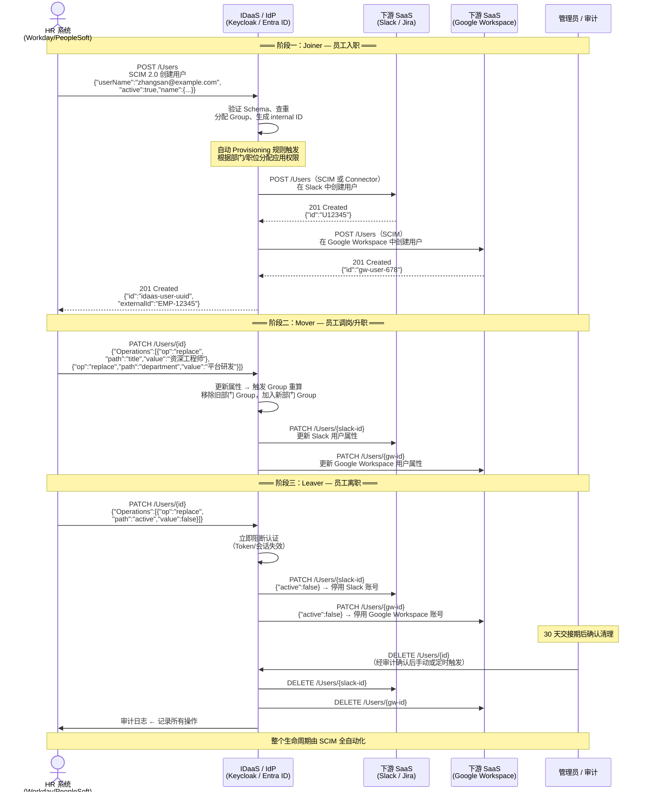

## 9.1 为什么需要 SCIM？

OAuth 2.0 和 OIDC 解决了认证和授权问题，SAML 解决了联邦 SSO 问题，但它们都没有回答一个问题：如何标准化地创建、更新和删除用户？

在 SCIM 出现之前，每个系统都有自己的用户 API：

```
App1: POST /api/v1/users {"name": "..."}     ← 每种格式都不一样
App2: PUT /rest/user/create {"userName": "..."}
App3: SOAP <CreateUser><Name>...</Name></CreateUser>
```

**SCIM（System for Cross-domain Identity Management）** 就是为了结束这种混乱而生的标准。它由 IETF 制定，共三份 RFC：**RFC 7642**（定义、概念与概述）、**RFC 7643**（Core Schema，含 User/Group 资源与 JSON 编码）、**RFC 7644**（Protocol，REST API 与 PATCH 语义）。

## 9.2 SCIM 的核心概念

### 核心数据模型

SCIM 定义了核心资源类型：

#### User 资源

```json
{
  "schemas": ["urn:ietf:params:scim:schemas:core:2.0:User"],
  "id": "2819c223-7f76-453a-919d-413861904646",
  "externalId": "employee-12345",
  "userName": "zhangsan@example.com",
  "name": {
    "formatted": "张三",
    "familyName": "张",
    "givenName": "三"
  },
  "displayName": "张三",
  "nickName": "小张",
  "profileUrl": "https://connect.example.com/zhangsan",
  "title": "高级工程师",
  "userType": "员工",
  "preferredLanguage": "zh-CN",
  "locale": "zh-CN",
  "timezone": "Asia/Shanghai",
  "active": true,
  "emails": [
    {
      "value": "zhangsan@example.com",
      "type": "work",
      "primary": true
    }
  ],
  "phoneNumbers": [
    {
      "value": "+86-13800138000",
      "type": "mobile"
    }
  ],
  "groups": [
    {
      "value": "e9e30dba-f08f-4109-8486-d5c6a331660a",
      "$ref": "/Groups/e9e30dba-f08f-4109-8486-d5c6a331660a",
      "display": "工程师组"
    }
  ],
  "roles": [
    {
      "value": "admin",
      "display": "管理员"
    }
  ],
  "meta": {
    "resourceType": "User",
    "created": "2024-01-01T08:00:00Z",
    "lastModified": "2024-01-15T09:30:00Z",
    "location": "/Users/2819c223-7f76-453a-919d-413861904646",
    "version": "W/\"3694e05e9dff592\""
  }
}
```

#### Group 资源

```json
{
  "schemas": ["urn:ietf:params:scim:schemas:core:2.0:Group"],
  "id": "e9e30dba-f08f-4109-8486-d5c6a331660a",
  "displayName": "工程师组",
  "members": [
    {
      "value": "2819c223-7f76-453a-919d-413861904646",
      "$ref": "/Users/2819c223-7f76-453a-919d-413861904646",
      "display": "张三"
    }
  ],
  "meta": {
    "resourceType": "Group",
    "created": "2024-01-01T08:00:00Z",
    "lastModified": "2024-01-15T09:30:00Z"
  }
}
```

### Schema 扩展

SCIM 支持通过扩展 Schema 添加自定义属性：

```json
{
  "schemas": [
    "urn:ietf:params:scim:schemas:core:2.0:User",
    "urn:ietf:params:scim:schemas:extension:enterprise:2.0:User",
    "urn:example:params:scim:schemas:extension:custom:1.0:User"
  ],
  "userName": "zhangsan@example.com",
  "urn:ietf:params:scim:schemas:extension:enterprise:2.0:User": {
    "employeeNumber": "EMP-12345",
    "costCenter": "CC-Beijing-01",
    "organization": "技术部",
    "division": "平台研发",
    "department": "基础架构",
    "manager": {
      "value": "manager-id",
      "displayName": "李四"
    }
  },
  "urn:example:params:scim:schemas:extension:custom:1.0:User": {
    "accessLevel": "vip",
    "region": "north-china"
  }
}
```

Enterprise User 扩展（`urn:ietf:params:scim:schemas:extension:enterprise:2.0:User`）是预定义的扩展，包含企业常见的属性：`employeeNumber`、`organization`、`department`、`manager` 等。

## 9.3 SCIM 操作

### RESTful API

SCIM 使用标准的 RESTful API 风格：

```
GET    /Users              — 搜索用户（支持过滤、排序、分页）
POST   /Users              — 创建用户
GET    /Users/{id}         — 获取特定用户
PUT    /Users/{id}         — 完整替换用户
PATCH  /Users/{id}         — 部分更新用户
DELETE /Users/{id}         — 删除用户

GET    /Groups             — 搜索组
POST   /Groups             — 创建组
GET    /Groups/{id}        — 获取特定组
PATCH  /Groups/{id}        — 更新组（包括修改组成员）
DELETE /Groups/{id}        — 删除组

GET    /ServiceProviderConfig  — 服务提供方配置
GET    /ResourceTypes          — 可用资源类型
GET    /Schemas                — 可用 Schema
```

### 搜索与过滤

SCIM 支持强大的过滤语法（RFC 7644 §3.4.2），比较运算符包括：`eq`/`ne`/`co`(contains)/`sw`(starts with)/`ew`(ends with)/`pr`(present)/`gt`/`ge`/`lt`/`le`，逻辑运算符 `and`/`or`/`not`，可用括号分组：

```
# 精确匹配
GET /Users?filter=userName eq "zhangsan@example.com"

# 前缀匹配
GET /Users?filter=userName sw "zhang"

# 存在性判断（pr = present）
GET /Users?filter=emails pr

# 包含判断（多值属性子元素过滤）
GET /Users?filter=emails[type eq "work"].value co "example.com"

# 复合条件
GET /Users?filter=userType eq "员工" and active eq true

# 组成员查询（标准写法用点号访问子属性）
GET /Users?filter=groups.value eq "group-id"

# 分页（startIndex 从 1 开始，即 1-based）
GET /Users?startIndex=1&count=100

# 选择性返回属性
GET /Users?attributes=userName,name,emails

# 排除属性
GET /Users?excludedAttributes=password,securityQuestions
```

### PATCH 操作

PATCH 是 SCIM 最精妙的设计之一。**SCIM 定义了自己的 PATCH 操作语义（RFC 7644 §3.5.2），与 RFC 6902 的 JSON Patch 不同**——它支持 `add`/`replace`/`remove` 三个操作，并使用 SCIM 自身的 path 过滤语法（如 `emails[type eq "home"]`），path 用 SCIM 表达式而非 JSON Pointer。约束：`remove` 操作必须提供 `path`；`add`/`replace` 可省略 `path`（此时 value 作用于整个资源或整个扩展对象）。

```json
// 添加新属性
PATCH /Users/user-123
{
  "schemas": ["urn:ietf:params:scim:api:messages:2.0:PatchOp"],
  "Operations": [
    {
      "op": "add",
      "path": "emails",
      "value": [{"value": "zhangsan@personal.com", "type": "home"}]
    }
  ]
}

// 替换属性
{
  "Operations": [
    {
      "op": "replace",
      "path": "title",
      "value": "资深工程师"
    }
  ]
}

// 移除属性（remove 必须带 path）
{
  "Operations": [
    {
      "op": "remove",
      "path": "emails[type eq \"home\"]"
    }
  ]
}
```

## 9.4 实际集成场景

### 场景一：HR 系统 → IDaaS

最常见的 SCIM 应用场景。下面用一张时序图完整展示从员工入职到离职的全生命周期——覆盖 Joiner（入职创建）、Mover（调岗变更）和 Leaver（离职注销）三个阶段：



这张图把 SCIM 的三种核心操作与身份生命周期的三个阶段一一映射：

| 生命周期阶段 | SCIM 操作 | 触发条件 | 下游影响 |
|-------------|-----------|----------|----------|
| **Joiner**（入职） | `POST /Users` | HR 系统录入新员工 | 在所有授权应用中自动创建用户 |
| **Mover**（调岗） | `PATCH /Users` | 职位、部门、组织变更 | 自动更新属性，触发 Group 重算 → 权限重新分配 |
| **Leaver**（离职） | `PATCH active=false` → `DELETE` | 离职审批通过 | 先停用阻断访问 → 交接期后正式删除 |

**关键设计决策：**

1. **为什么先 PATCH active=false，而不是直接 DELETE？** 直接删除不可逆，误删后 `id` 会变，下游 ACL 引用全部断裂。先停用（软删除）保留数据和引用关系，待审计确认后再物理删除是生产环境的标准做法。

2. **为什么用 externalId 而非 userName 做上下游关联？** `userName` 可能随改名/婚变而变化，`externalId`（如工号 `EMP-12345`）在员工生命周期内稳定不变。SCIM 规范建议 `externalId` 作为跨系统主键。

3. **为什么图中展示了管理员介入的步骤？** SCIM 自动化了 90% 的操作，但 DELETE 这种不可逆操作需要人工确认。图中 Leaver 阶段的 `Admin→IDaaS` 步骤可以是手动审批、也可以是"停用 N 天后自动删除"的定时任务。

### 场景二：IDaaS → SaaS 应用

IDaaS 通过 SCIM 向 SaaS 应用提供用户：

```
IDaaS → SCIM → Salesforce (预置用户)
IDaaS → SCIM → Google Workspace (预置用户)
IDaaS → SCIM → Microsoft 365 (预置用户)
```

### 去预置（De-provisioning）

SCIM 同样用于离职用户的清理：

- PATCH `/Users/{id}` `{"active": false}` — 暂停用户
- DELETE `/Users/{id}` — 删除用户

## 9.5 实现 SCIM 服务端

如果要自己实现 SCIM 服务端，核心组件包括：

1. **资源定义**：User、Group 的资源 Schema
2. **过滤解析器**：解析 SCIM filter 语法
3. **排序和分页**：支持 SCIM 风格的排序和分页
4. **PATCH 解释器**：解析和执行 PATCH 操作
5. **ETag 支持**：版本控制，乐观锁
6. **错误处理**：SCIM 标准错误格式

**推荐做法**：使用成熟的库，而不是从头实现。Java 生态中，可以使用 Apache SCIMple 或 WSO2 Charon；Go 生态中可以使用 `github.com/elimity-com/scim`。

## 9.6 安全考量

1. **认证**：SCIM 端点必须认证，通常使用 Bearer Token（OAuth 2.0）。
2. **TLS 必须启用**：所有 SCIM 通信必须通过 HTTPS。
3. **授权**：分离读权限和写权限，不同的 SCIM 使用者应有不同的权限。
4. **速率限制**：防止批量操作导致系统过载。
5. **审计日志**：记录所有 SCIM 操作的审计日志。
6. **敏感属性保护**：不要在 SCIM 响应中返回密码、加密密钥等敏感信息。

## 9.7 SCIM 用户生命周期管理实践

SCIM 的价值不只在于标准化 API，更在于它能够将身份生命周期的关键动作系统化。结合[第 4 章]()的生命周期模型，下面把 SCIM 操作映射到每个阶段。

### 生命周期与 SCIM 操作对照

| 生命周期阶段 | 触发事件 | SCIM 操作 | 典型载荷 |
|-------------|---------|-----------|---------|
| 创建（Joiner） | 员工入职 / 新用户注册 | `POST /Users` | 完整 User 资源（含 `active: true`，分配 Group） |
| 使用（Active） | 日常登录认证 | 不直接涉及 SCIM | 认证走 OIDC/SAML，属性通过 SCIM 按需同步 |
| 变更（Mover） | 调岗、升职、改名 | `PATCH /Users/{id}` | 更新 `title`、`department`、`manager`、Group 成员 |
| 暂停（Leave） | 离职交接期 / 临时停权 | `PATCH /Users/{id}` | `{"active": false}` |
| 注销（Leaver） | 正式离职 | `DELETE /Users/{id}` | 无载荷（或先 PATCH 停用，N 天后 DELETE） |

> SCIM 的 `active` 字段是软开关。建议的离职流程：先 `PATCH active=false` 立即阻断访问，保留数据供审计和交接；确认无误后再 `DELETE`。不要直接从 `active: true` 跳到 `DELETE`。

### 预置（Provisioning）检查清单

SCIM 预置不只是调一个 API，需要把上游数据源和目标系统的 Schema、权限、异常处理都串起来：

- [ ] **Schema 对齐**：源系统字段（如 HR 的 `employeeId`）映射到 SCIM `externalId` 或 Enterprise Extension 的 `employeeNumber`；不在标准 Schema 中的字段用自定义 Extension。
- [ ] **唯一标识策略**：`userName` 和 `externalId` 都必须唯一。建议 `userName` 用企业邮箱（保证全局唯一），`externalId` 用工号。
- [ ] **初始 Group 分配**：创建用户时同步加入组织架构 Group，避免"裸账号"——刚入职就能访问不应该访问的资源。
- [ ] **幂等性**：创建前先 `GET /Users?filter=userName eq "..."` 查重，防止重入造成重复账号。
- [ ] **错误处理**：SCIM 返回 `409 Conflict`（userName 重复）或 `400 Bad Request`（Schema 违规）时，记录日志并通知管理员，不要让同步任务静默失败。
- [ ] **速率控制**：大批量入职（如校招季）时分批推送，遵守 SCIM 服务端的 rate limit，并在失败时按退避策略重试。

### 去预置（Deprovisioning）检查清单

去预置比预置更容易出事故——删错、漏删、删了但下游没同步：

- [ ] **两步执行**：先 `PATCH active=false` 停用，观察确认无异常后再 `DELETE`；对核心系统增加人工确认环节。
- [ ] **级联清理**：确认下游应用也删除了对应用户。如果下游不支持 SCIM，需要手动或通过应用连接器补充清理。
- [ ] **审计记录**：保存 `DELETE` 操作的时间、操作人、对象 `externalId`，用于合规审计。
- [ ] **回滚预案**：如果误删，能否通过 SCIM `POST` 重建？注意 `id` 会变，下游引用（如 ACL 中的 user UUID）可能需要同步调整。
- [ ] **定时检查**：定期扫描 `active=false` 超过 N 天（如 30 天）的账户，确认是否可以正式删除或归档。

### SCIM 生命周期管理常见问题（FAQ）

**Q: SCIM 可以处理"员工转到子公司但保留部分权限"这种场景吗？**

SCIM 本身不包含授权决策逻辑，但可以作为执行层：通过 `PATCH` 更新用户的 `department` 和 Group 成员，由 IDaaS 的授权引擎重新计算权限。SCIM 负责"改属性"，授权引擎负责"改权限"。

**Q: 多个上游系统（如 HR + 考勤）都通过 SCIM 写同一个用户，怎么避免冲突？**

有两种策略：一是确定单一权威源（System of Record），只有 HR 系统有写权限，其他系统只读；二是通过 IDaaS 内部的属性级优先级规则合并。推荐前者——单一权威源是避免数据竞态的根本方案。

**Q: SCIM 同步延迟有多久？实时性够吗？**

SCIM 协议本身不定义同步频率。常见实现中，上游系统在数据变更后立即推送（事件驱动），延迟在秒级。如果上游不支持事件驱动，需要 IDaaS 定时轮询 `GET /Users?filter=meta.lastModified gt "..."`，延迟取决于轮询间隔。

**Q: 下游应用不支持 SCIM，怎么管理用户生命周期？**

这是现实中最常见的情况。方案按优先级：
1. 如果应用有 LDAP 接口，通过 IDaaS 的 LDAP 桥接同步；
2. 如果应用只有 REST API，用 IDaaS 的 workflow/connector 调用自定义 API；
3. 如果应用只能手动管理，至少让 SCIM 创建/停用触发通知（邮件/IM），由管理员手动操作。

**Q: `DELETE` 用户后需不需要通知下游？**

SCIM 规范没有规定，但生产环境应该做。理想方案是 IDaaS 在收到 SCIM `DELETE` 后，通过内部事件总线触发下游应用的用户清理。最低限度也要记录审计日志。

## 9.8 小结

SCIM 2.0 是 IDaaS 世界中"用户配置"的标准语言。它将身份管理从"手工操作"和"定制脚本"升级为标准化、自动化的 API 调用。对于 IDaaS 平台选型，SCIM 支持的质量——尤其对标标准用户 Schema、过滤语法、PATCH 操作——是评估的重要维度。把 SCIM 真正用好，关键在于理解它不是一个孤立的协议，而是身份生命周期自动化流水线上的关键一环。
