说明：此步骤仅仅是为了如何快速搭建起一个测试版 Windows AD 服务，不可用于生产。

## 前置条件

安装 Windows AD 域控服务器，需要提前准备：

1. Windows Server 2008 及更新版本操作系统，如 4 核 8G 内存，60G 硬盘的主机一台。
2. 提前规划好域名，比如本示例为 iam.nxest.local.

Windows Server 不同版本略有差异，但是基本要做的就是下面几项：

1. 启用功能：角色和功能里添加 Windows AD 域服务。
2. 配置：配置 AD 域名、管理员密码等基本信息。

## Windows Server 2012 步骤如下

1. 点击开始菜单，找到“服务器管理器”，打开，显示如下界面。
   [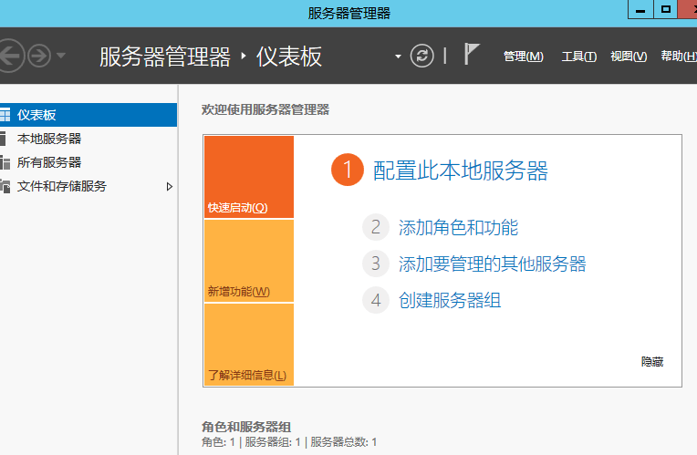](./ad-001.png)

2. 点击右上角 管理>“添加角色和功能”按钮，弹出如下界面。
   [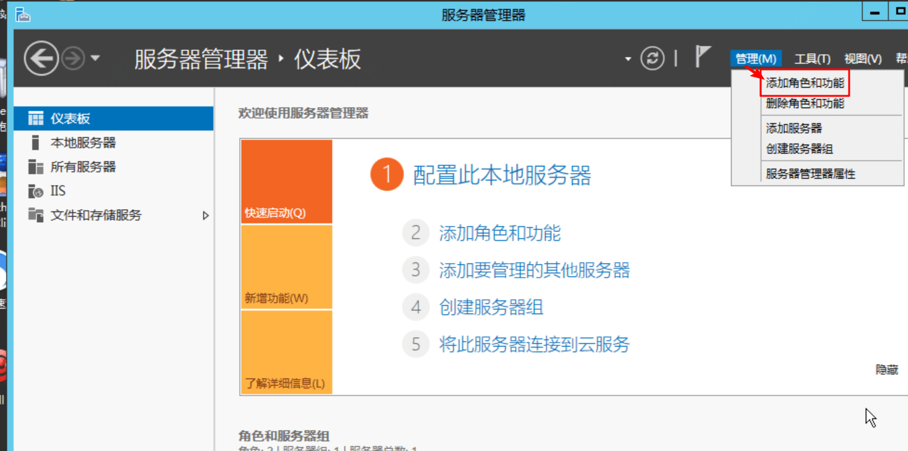](./ad-002.png)

3. 选择“基于角色或基于功能的安装”，然后点“下一步”。
   [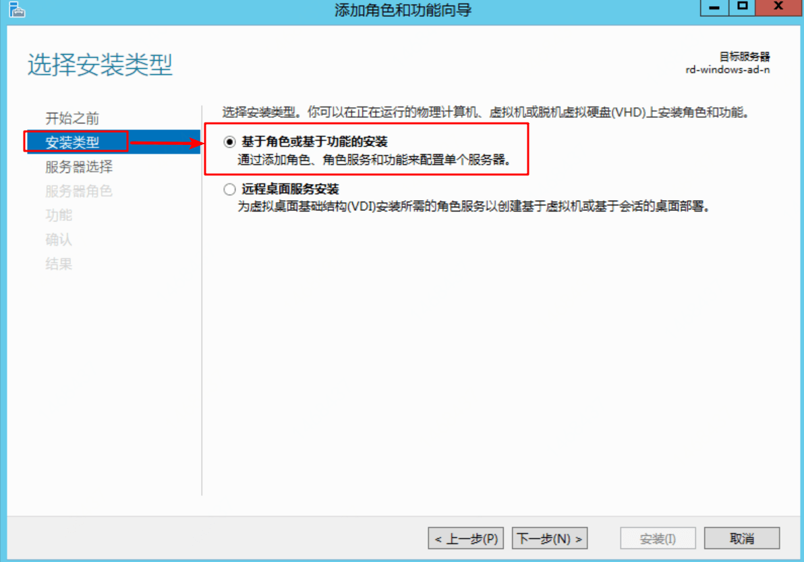](./ad-003.png)

4. 服务器选择这里选择默认的，假如你需要针对其它主机安装 AD 角色，这里可以选择你需要的主机，点击“下一步”。
   [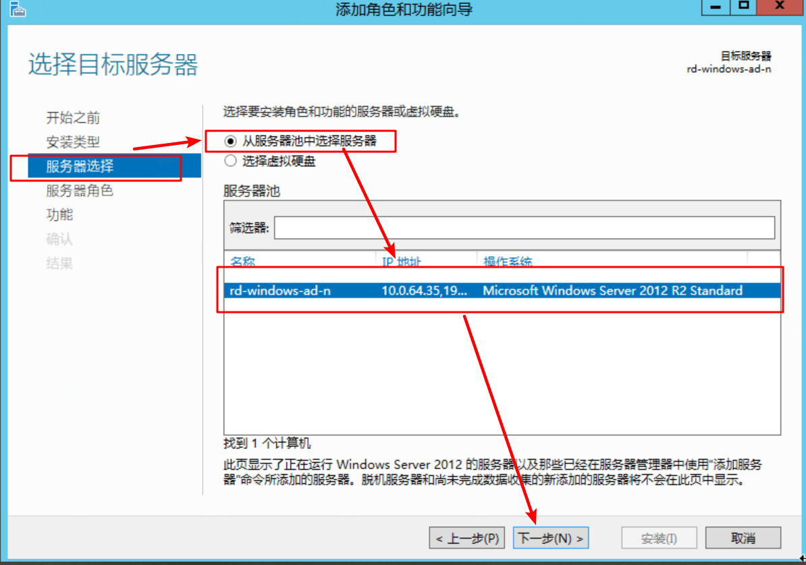](./ad-004.png)
5. 这里勾选“Active Directory 域服务”。
   [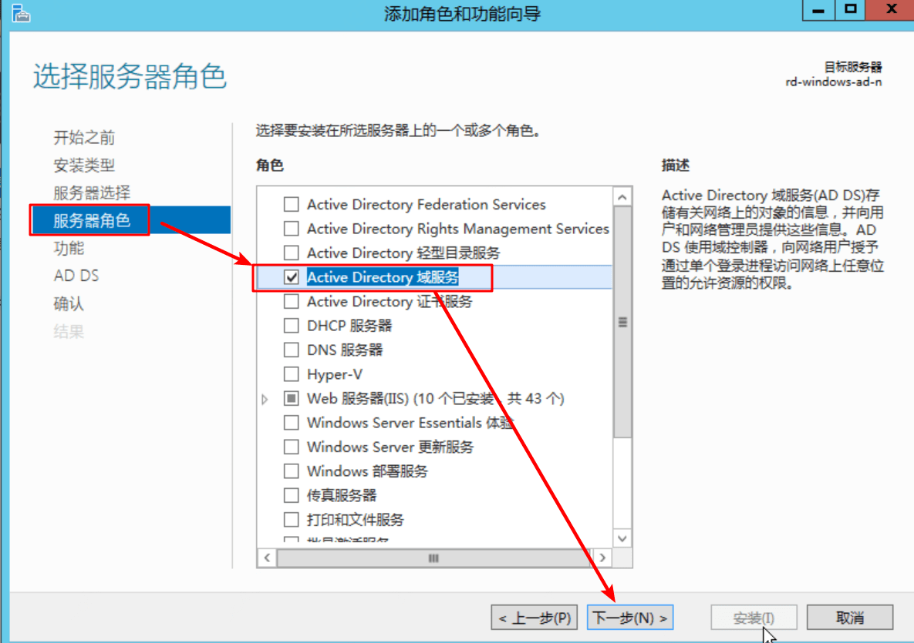](./ad-005.png)
6. 当勾选这个选项时，会弹出对话框，点“添加功能”，在功能这个选项卡直接点下一步，一直下一步直到最后一步点击安装。
   [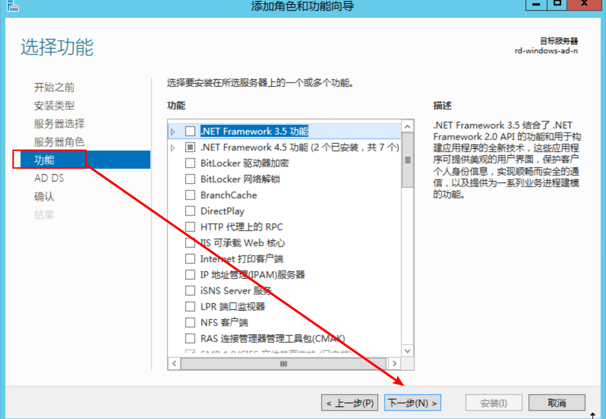](./ad-006.png)

7. 安装成功后我们点击“关闭”，但这还没有完全安装成功，还需要继续配置。点击服务器右上角的“功能按钮”, 弹出继续配置 AD 的对话框。
   [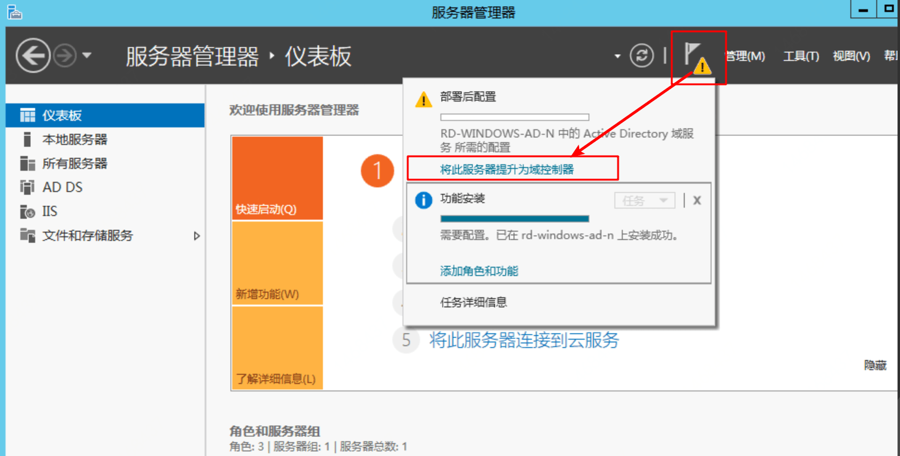](./ad-007.png)

8. 根据提示，添加新林，输入准备好的域名。
   [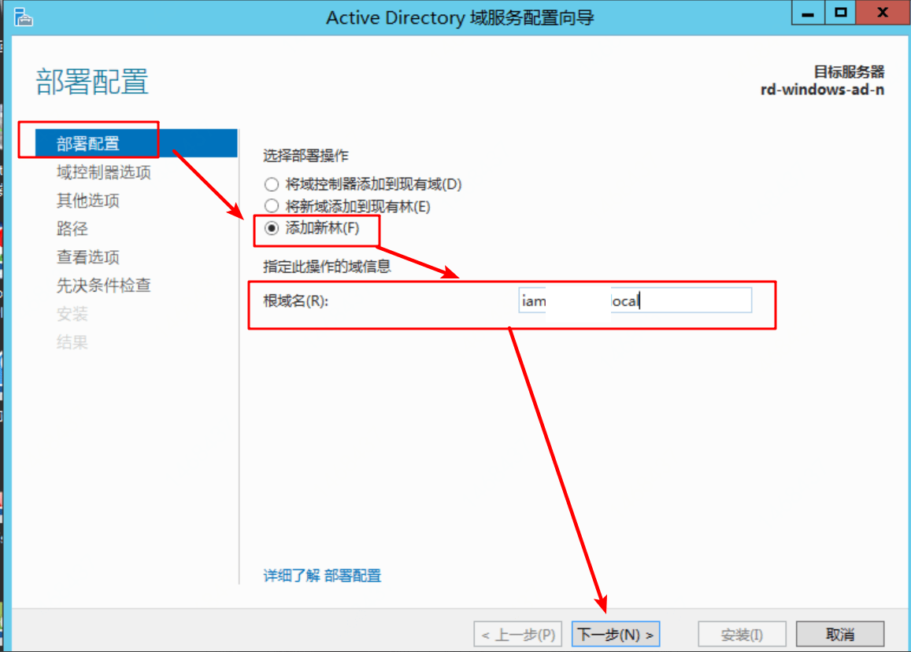](./ad-008.png)

9. 林功能级别选择最高的版本。
   [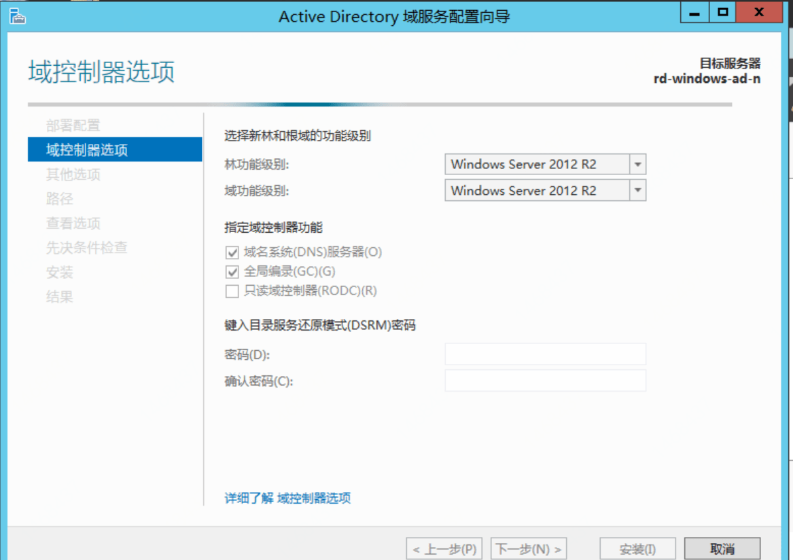](./ad-009.png)

10. 输入 NetBIOS 域名，都是简称，一般是你准备的域名的第一位。
    [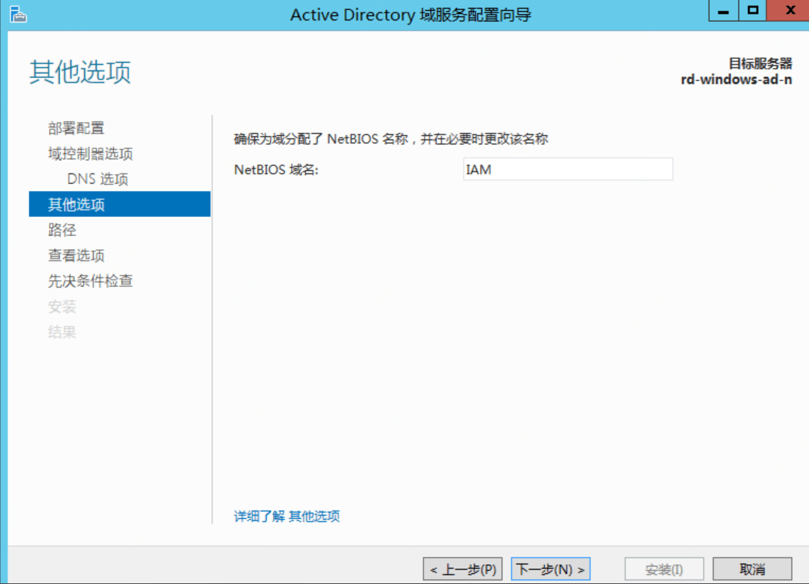](./ad-010.png)
11. 下一步，默认即可。

12. 下一步，先决条件检查，可能花费 10 分钟左右，请耐心等待。
    [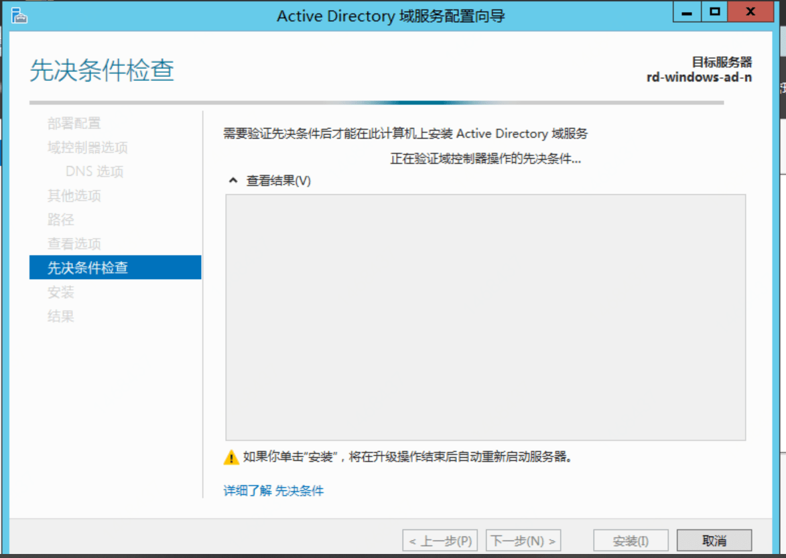](./ad-012.png)

13. 检查通过后才能点击安装。
    [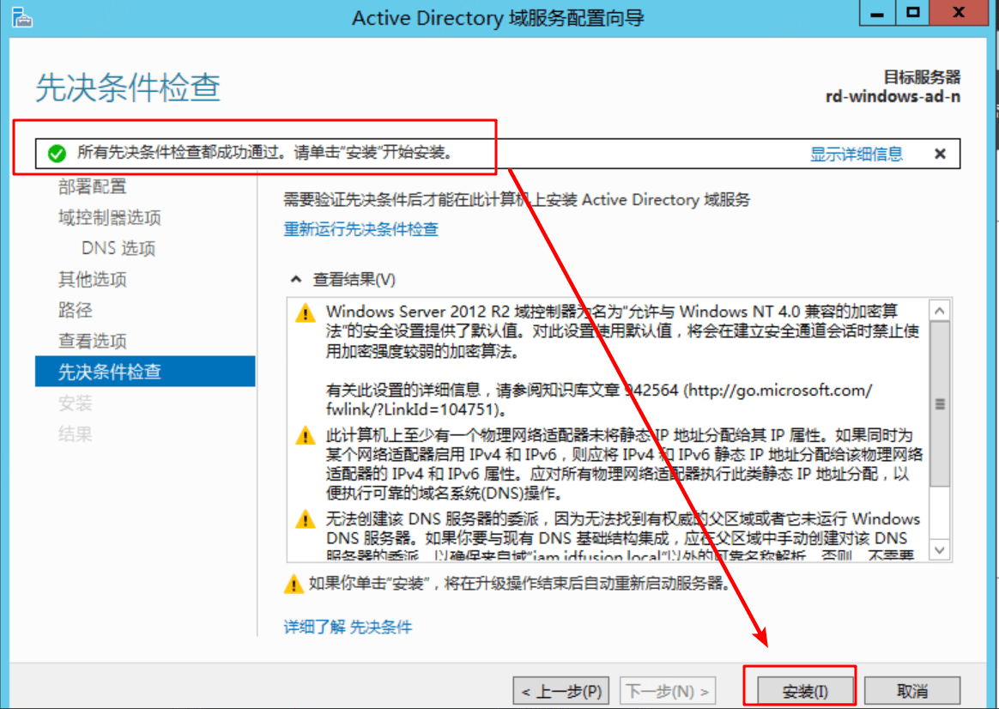](./ad-013.png)

14. 安装完成后，会提示注销重启，如果未提示重启，请手动重启下服务器。
    [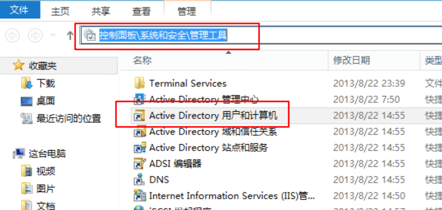](./ad-014.png)

## 用户管理

安装完成后，可通过“Active Directory 用户和计算机”管理用户。此功能可通过控制面板或菜单搜索到。

打开后即可在 Users 下右键创建组和用户，请根据需要提前划分分组，增加用户。
