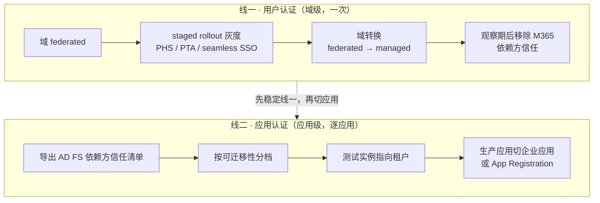

## 场景

你的环境里有一个跑了多年的 AD FS 场：Microsoft 365 通过联邦登录，一批内部系统和 SaaS 应用挂在依赖方信任（Relying Party Trust）下，AD FS 上还有历史积累的自定义声明规则。现在立项要把认证迁到 Microsoft Entra ID。

这类迁移最常见的翻车方式，是把两件互相独立的工作当成一件事：**用户认证在哪发生**（域级的联邦→托管切换）和**每个应用怎么拿到令牌**（应用级的依赖方信任→企业应用迁移）。两者的影响范围、回滚方式和验收标准都不一样，混着做，出问题时连定位方向都分不出来。

## 先分清：两条线的依赖关系



线一改的是"谁来验证密码"，线二改的是"谁签发应用认得的令牌"。线一没稳定就切线二，应用拿到了 Entra 签的令牌，但用户仍被域联邦送回 AD FS，表现出来是登录来回跳转——症状和 Keycloak 侧的重定向循环是同一类，排查思路参考 [Keycloak 重定向循环与 401 排错指南]()。

### 哪些应用不该迁到 Entra

| 应用特征 | 处理方式 |
|---|---|
| Kerberos / IWA / 经 WAP 发布的非声明感知应用 | 用 Entra Application Proxy 或 Secure Hybrid Access 伙伴方案发布，不要改造应用本身 |
| 厂商应用的认证方式不可修改 | 同上，或保留 AD FS 继续承载 |
| 需要私有化部署或数据驻留，且不使用 M365 生态 | 把 SAML/OIDC 依赖方迁到自建 IdP（如 Keycloak），而不是 Entra，见后文 |

## AD FS 的真实状态：别用"已经停更"这种模糊说法

- **AD FS 没有被单方面宣告 EOL。** 它是 Windows Server 的一个角色，支持周期跟随所承载的 Windows Server 版本。所以"AD FS 什么时候停服"的准确答案是"取决于你跑在哪个 Windows Server 上"。
- 但方向是明确的。微软在 AD FS 概述页顶部放了一条 IMPORTANT（include 文件 `adfs-to-azure-ad-upgrade.md`，签发日期 2022-01-23，至今仍在文档中）：**"Instead of upgrading to the latest version of AD FS, Microsoft highly recommends migrating to Microsoft Entra ID."** 即新功能投资已不在 AD FS 上。
- 比"投资方向"更适合写进立项依据的，是三条硬约束：
  1. **MSAL 只支持 AD FS 2019 及以后。** AD FS 2016 及更早版本不受 MSAL 支持；而 ADAL 早已停止新增功能。任何"从 ADAL 迁到 MSAL"的计划，只要后端还是 AD FS 2016，就先被版本卡住。
  2. **WID 已在移除清单上。** Windows 的 removed/deprecated 文档写明 Windows Internal Database (WID) 会在未来的 Windows 版本中移除，而 AD FS 正是使用 WID 的角色之一。用 WID 承载 AD FS 配置库的环境，要么在此之前迁移，要么先把配置库换成 SQL Server。
  3. **签名证书与元数据运维成本固定存在。** 联邦域依赖 Entra ID 侧保存的签名证书/元数据地址；证书轮换、域名调整、多域联邦都会修改联邦配置对象，而这些修改在 Graph cmdlet 下都有容易踩的参数陷阱（见下文）。

结论：AD FS 2016 及更早、或配置库用 WID 的环境，迁移是时间问题；AD FS 2019+ 且配置库已在 SQL Server 上的环境，可以按业务节奏推进，不必为了迁移而迁移。

## 迁移前的清点

**域级设置**先存档，这既是清点也是回滚依据：

```powershell
Connect-MgGraph -Scopes "Domain.Read.All"
Get-MgDomainFederationConfiguration -DomainId contoso.com
```

官方要求重点核对四个字段，它们决定转换托管后行为是否与现状一致：

- `PreferredAuthenticationProtocol`（`wsFed` 或 `saml`）
- `federatedIdpMfaBehavior`
- `SupportsMfa`（仅在 `federatedIdpMfaBehavior` 未设置时才生效）
- `PromptLoginBehavior`

**应用级清单**在 AD FS 侧导出，包含自定义声明规则：

```powershell
Get-AdfsRelyingPartyTrust | Select-Object Name, Identifier, ProtocolProfile

(Get-AdfsRelyingPartyTrust -Name "Microsoft Office 365 Identity Platform") |
  Export-CliXML "C:\temp\O365-RelyingPartyTrust.xml"
```

Entra 侧的 AD FS application activity report 和 Migration assistant 能补上应用清单与可迁移性评估。只导出不分类没有意义，按可迁移性分三档（本书建议的分类方式，微软文档的对应表述是"优先迁移使用现代认证协议的应用"）：

| 档位 | 特征 | 迁移方式 |
|---|---|---|
| 一档 | 标准 SAML / WS-Fed，NameID 简单，无自定义规则 | 直接在库应用里建企业应用 |
| 二档 | 有自定义声明规则、组过滤、角色声明 | 需要 claims mapping policy 与 App Roles，逐条翻译规则 |
| 三档 | Kerberos 委派、自定义属性存储、多林查询 | 不改应用基本不可行，走 Application Proxy / SHA 或保留 AD FS |

## 线一：域从 federated 切到 managed

### staged rollout 能做什么、不能做什么

staged rollout 让你在域仍然联邦的前提下，把指定安全组的用户切到云认证，用来验证 Entra MFA、Conditional Access、Identity Protection 的真实体验。它的边界必须提前知道：

| 边界 | 具体限制 |
|---|---|
| 容量 | 每个特性最多 10 个组（PHS、PTA、seamless SSO 各自 10 个） |
| 组类型 | 不支持嵌套组和动态成员组，必须是 Entra 主控的组 |
| 遗留认证 | POP3/SMTP 等遗留认证不走 staged rollout，仍回落联邦 |
| SSPR | 启用 staged rollout 的安全组不支持本地目录密码写回，官方明确表示不能保证一致 |
| domain_hint | 认证时会携带 `domain_hint` 查询参数的应用不受支持（会被送回联邦 IdP） |
| 定位 | 官方明确：staged rollout 不是永久配置，只用于切换前的验证，不能当成长期共存方案 |

两个容易漏掉的运行时行为：

1. **用户被加入灰度组后，第一次登录仍会被重定向到联邦 IdP 完成一次交互登录**，之后才走托管认证。想避免这次"看起来没生效"的登录，可以在把用户加入灰度组后立即发放 Temporary Access Pass (TAP)——Entra 会先评估 TAP，不再重定向到联邦 IdP。反向操作同理：把用户从灰度组移除后，他会再走一次托管认证，然后回退到联邦。
2. **ID Protection 的风险修复动作会重置灰度状态。** SSPR、风险处置、风险忽略等操作可能清除用户的 staged rollout 状态，导致下一次登录又被送回联邦 IdP。排期与用户沟通时要把这类事件算进去。

### 域转换与那个 60 分钟窗口

灰度验证通过后，把域从 federated 转成 managed：

```powershell
Connect-MgGraph -Scopes "Domain.ReadWrite.All", "Directory.AccessAsUser.All"
Update-MgDomain -DomainId contoso.com -AuthenticationType "Managed"

# 验证
Get-MgDomain -DomainId contoso.com   # AuthenticationType 应为 Managed
```

官方提示：**域从联邦转托管的过程最长可能持续 60 分钟**，期间用户访问基于浏览器的应用可能不会被要求提供凭据。这不是故障，但必须排进维护窗口。现代认证客户端（Office、移动端 App）用 refresh token 换新令牌，因此不会被域转换弹密码框。

如果联邦本来就是 Entra Connect 配置的，也可以在 Entra Connect 的"更改用户登录"流程里切换。判断方法：Entra Connect → Configure → Additional Tasks → Manage Federation → View federation configuration，AD FS 出现在这里说明联邦由 Entra Connect 管理；不在则说明是第三方联邦服务或手工配置的，只能走 PowerShell 转换。

### 回滚：不是改回 Federated，而是重建联邦对象

回滚要用 `New-MgDomainFederationConfiguration` 重建联邦配置：

```powershell
New-MgDomainFederationConfiguration -DomainId contoso.com `
  -ActiveSigninUri "https://sts.contoso.com/adfs/services/trust/2005/usernamemixed" `
  -DisplayName "Contoso" `
  -IssuerUri "http://contoso.com/adfs/services/trust" `
  -MetadataExchangeUri "https://sts.contoso.com/adfs/services/trust/mex" `
  -PassiveSigninUri "https://sts.contoso.com/adfs/ls/" `
  -SignOutUri "https://sts.contoso.com/adfs/ls/" `
  -SigningCertificate <Base64 编码的签名证书> `
  -FederatedIdpMfaBehavior "acceptIfMfaDoneByFederatedIdp" `
  -PreferredAuthenticationProtocol "wsFed"
```

所以迁移前那一步"存档 `Get-MgDomainFederationConfiguration` 输出"不是形式主义：缺 IssuerUri 或签名证书，回滚就不完整。AD FS 侧的准备用 AD FS Rapid Restore Tool，加上依赖方信任的 `Export-CliXML` 备份。

**一个必须显式传的参数**：用 Graph 的 `Update-MgDomainFederationConfiguration` 更新证书或元数据地址时，要带上 `-InternalDomainFederationId`（取自 `Get-MgDomainFederationConfiguration` 的 `Id`）。与老一代 MSOnline cmdlet 不同，Graph 不会自动推断这个对象 ID；漏传时 cmdlet 会进入交互式参数提示，命令实际没有生效。社区里反复出现的"换完签名证书还是登不上"，多数是这个原因——先确认联邦对象真的被更新了，再怀疑 AD FS 侧。

### 共存期的 MFA 边界（这一段涉及安全，别跳）

联邦域上有两个 MFA 相关设置，优先级关系是明确的：

- 一旦设置 `federatedIdpMfaBehavior`，Entra 就忽略 `SupportsMfa`；两者之间**不支持来回切换**。
- 若两者都没设置，默认行为是 `acceptIfMfaDoneByFederatedIdp`——**联邦 IdP 声称做过 MFA，Entra 就接受**。

`federatedIdpMfaBehavior` 的三个取值：

| 值 | 含义 |
|---|---|
| `acceptIfMfaDoneByFederatedIdp` | 接受联邦 IdP 的 MFA 声明；IdP 没做则由 Entra 做 |
| `enforceMfaByFederatedIdp` | 接受联邦 IdP 的 MFA 声明；IdP 没做则重定向回 IdP 要求做 |
| `rejectMfaByFederatedIdp` | Entra 一律自己做 MFA，拒绝联邦 IdP 的 MFA 声明 |

如果你的目标是让 Conditional Access 成为 MFA 的唯一决策点，就应该在共存期就把域设成 `rejectMfaByFederatedIdp`。否则在 AD FS 仍然可用、仍能登录的那段时间里，一个能声明"已完成 MFA"的联邦 IdP 等价于绕过 Entra MFA。使用第三方 MFA 提供方是唯一的例外场景。

## 线二：应用逐个迁移

官方的四阶段模型值得照搬，因为它把测试和生产明确分开：

1. 现状：生产应用认证走 AD FS
2. （可选）应用的测试实例指向测试租户
3. 应用的测试实例指向生产租户
4. 生产应用指向生产租户

一档应用的工作量主要是把 AD FS 的标识符（App identifier / entity ID）、回复 URL（ACS）、登出 URL 搬到企业应用的 SAML 配置里。有一个差异要注意：**Entra ID 不支持直接消费应用的联邦元数据**，只能手工导入；AD FS 时代可以自动拉取 SP 元数据的环境，迁移后这一步会变成手工维护。

二档应用真正耗时间的是声明规则翻译：

| AD FS 侧 | Microsoft Entra ID 侧 |
|---|---|
| 访问控制策略"允许所有用户" | 企业应用"要求分配"设为否，或指派给"所有用户"自动组（需启用动态组） |
| 允许指定组（groupSID 规则） | 把组指派给应用；组需要先由 Entra Connect 同步或重建 |
| 允许指定用户（PrimarySID 规则） | 在应用的 Add Assignment 中添加用户 |
| 用户/组级 MFA 规则 | Conditional Access 策略（如"所有用户要求 MFA"） |
| 未注册设备强制 MFA | Conditional Access：要求合规设备/混合加入设备，或使用设备状态条件 |
| Emit attributes as Claims | 企业应用 → 单一登录 → User Attributes & Claims |
| 内置访问控制"来自特定网络 / 组 / 设备信任级别" | Named Location、Users/Groups 指派、Device State 条件（配合 Exclude 表达"除外"） |
| 请求中携带特定声明 | **无法迁移**，必须重新设计 |

### NameID 是最大的坑

AD FS 里最常见的写法是把 `windowsaccountname`、`primarysid` 或某个自定义 URN 声明发成 `nameidentifier`。搬到 Entra 时会撞上四条硬限制：

1. Entra SAML 有一份**受限声明集**：`windowsaccountname`、`primarysid`、`primarygroupsid`、`sid`、`x500distinguishedname` 等默认受限，只有使用自定义签名密钥时才不受限（且应避免在应用清单里打开 `acceptMappedClaims`）。
2. **自定义声明提供程序里的属性不能作为 Entra SAML 的 NameID 来源。** AD FS 里"先算出中间值、再发成 NameID"的规则链，在 Entra 里没有等价写法。
3. NameID 允许的转换只有两种：`ExtractMailPrefix` 和 `Join`，后者拼接的后缀必须是租户已验证的域。
4. NameID 的可选来源是固定的那几个：UPN、邮箱、mail prefix、employee ID、extension attributes 1–15、以及本地的 **on-premises SamAccountName**。要发 `samAccountName`，前提是它已经通过 Entra Connect 同步到 Entra；AD FS 能发的属性不一定在 Entra 里可见，非标准 schema 的属性要用 extension attributes 承载。

因此**正确做法不是在大海里复刻 SID，而是改 NameID 语义**：把 NameID 源改成 on-premises SamAccountName 或 UPN，同时修改应用侧的账号匹配逻辑。另外，Entra 非库 SAML 应用**默认以 UPN 作为 NameID**，而 AD FS 侧不同应用实际发出的可能是 UPN、邮箱、SAMAccountName 或 ImmutableID，不一致时应用会把它当成新用户——表现为重复建号、权限丢失、"用户不存在"。

**迁移前必做**：用 SAML tracer 或 Fiddler 抓一次 AD FS 当前实际发出的断言，记录 NameID 的**格式和值**，再在 Entra 侧逐项对齐。这一步省了，二档应用必炸。

### 组声明：SID 变 Object ID，还有 150 组上限

AD FS 用 groupSID 做授权，Entra 的 `groups` 声明发的是组的 **Object ID**，应用侧的授权配置必须跟着改。数量上限更关键：**SAML 令牌最多携带 150 个组**，超过就只发一个 overage 声明，应用必须回查 Microsoft Graph 才能拿到完整组列表（OIDC/JWT 的组上限更高，但同样是硬上限，超限行为一致）。AD FS 时代可以无脑把 groupSID 塞进令牌，迁到 Entra 后"权限突然少一半"往往就是这个原因，而不是权限配置写错了。

如果应用不支持回查 Graph，正确解法是改用**应用角色（App Roles）**：在 Entra 侧完成组过滤与角色映射，令牌里只发少量角色声明。

还有一类特殊应用要单独处理：**WS-Federation 应用，尤其是需要 SAML 1.1 令牌的 SharePoint**。Entra 支持的是 SAML 2.0，SAML 1.1 场景要用库里的 SharePoint 模板或手工 PowerShell 配置，不能指望 SAML 2.0 配置项直接生效。

## 常见故障对照

| 症状 | 根因 | 先看什么 |
|---|---|---|
| 迁移后应用把用户当新用户、权限丢失 | NameID 格式或值变了 | 对比 AD FS 历史断言与 Entra 的 NameID 配置 |
| 用户仍被送到旧 AD FS 登录页 | 应用或浏览器书签硬编码了 `whr=` / `domain_hint` | 应用配置、书签、SSO 快捷方式 |
| 域转换后一段时间用户不用输密码 | 域转换最长 60 分钟窗口 | 属预期行为，确认落在维护窗口内 |
| 用户被移出灰度组后又走联邦 | staged rollout 移除后的回退行为 | 灰度组成员变更记录 |
| 更新签名证书后仍然认证失败 | `Update-MgDomainFederationConfiguration` 缺 `-InternalDomainFederationId`，命令进入交互提示未生效 | `Get-MgDomainFederationConfiguration` 的 Id 与当前证书 |
| 联邦用户绕过了 Entra MFA | `federatedIdpMfaBehavior` / `SupportsMfa` 均未设置时的默认值 | 域联邦配置中的两个 MFA 字段 |
| 应用收到的组数量不对 | 触发 SAML 150 组上限的 overage | 令牌里 groups 声明的类型（数组还是 overage 链接） |
| 新增字段在 Entra 里找不到 | 属性没有同步到 Entra | Entra Connect 同步范围，必要时用 extension attributes |
| 想删依赖方信任但仍有登录 | 还有其他应用或客户端在用 AD FS | AD FS 事件日志、Entra Connect Health 的 AD FS 使用量 |

**退场顺序**：官方建议切换完成后至少观察一周，在 AD FS 事件日志和 Entra Connect Health 上确认不再有新的登录请求，再移除 Microsoft 365 的依赖方信任；确认 AD FS 没有其他用途后，按微软的 AD FS decommission guide 下线服务器。

## 如果不想全押 Entra：把依赖方迁到 Keycloak

AD FS 退场不等于所有依赖方信任都必须迁到 Entra。判断其实很直接：

- 应用在 M365 生态里（Exchange Online、Teams、SharePoint）→ 迁 Entra，没有别的选择。
- 应用只是"用 SAML/OIDC 登录的内部系统"，且企业已有或计划自建 IdP，或有数据驻留、私有化要求 → 把 SAML/OIDC 依赖方迁到 Keycloak 更可控，用户源继续用 LDAP/AD 联邦，参考 [Keycloak LDAP / AD 用户联邦]()。
- 混合场景：M365 走 Entra，内部应用走 Keycloak，两者之间用 OIDC/SAML 联邦，避免同一批用户在两个 IdP 各维护一套授权。

多协议共存时的身份映射（sub/NameID 统一、跨协议 SSO 会话）见 [IAM 多协议集成实战]()，协议选型的判断框架见 [IAM 认证协议选型指南]()。SAML 侧的断言、绑定与元数据细节见 [SAML 2.0 身份联邦]()。

## 常见问题（FAQ）

**Q1：AD FS 会停止支持吗？**
AD FS 是 Windows Server 的角色，支持周期随 Windows Server 版本，没有被单方面宣告 EOL。真正的约束来自三处：微软在 AD FS 概述页明确建议迁移而不是升级到新版本；MSAL 只支持 AD FS 2019 及以后（AD FS 2016 及更早不受支持）；WID 已列入未来 Windows 版本移除清单，而 AD FS 是使用 WID 的角色之一。

**Q2：AD FS 迁移 Microsoft Entra ID 时，用户认证和应用认证能同时做吗？**
不建议。域级切换会改变所有用户的认证路径，应用级迁移是逐应用的。先完成域级灰度与切换，稳定后再按档位迁应用。反过来做——应用已指向 Entra 而域仍是联邦时，用户会被域联邦送回 AD FS，表现为登录循环。

**Q3：IAM 迁移后应用认不出用户，通常是什么原因？**
NameID。Entra SAML 对 NameID 的来源和转换都有硬限制：受限于受限声明集、不允许自定义声明提供程序属性作为 NameID 源、只允许 `ExtractMailPrefix` 与 `Join` 两种转换。AD FS 里把 SID 或自定义 URN 当 NameID 的应用无法一比一搬运，需要改成 on-premises SamAccountName 或 UPN，并同步修改应用侧的账号匹配逻辑。

**Q4：迁移过程中能回滚吗？**
能，但代价取决于准备程度。回滚用 `New-MgDomainFederationConfiguration` 重建联邦配置，因此迁移前必须完整存档 `Get-MgDomainFederationConfiguration` 的输出（IssuerUri、签名证书、各端点 URL），并用 AD FS Rapid Restore Tool 加 `Export-CliXML` 备份依赖方信任。缺项的回滚等于重新搭一次联邦。

**Q5：AD FS 上的自定义声明规则在 Entra ID 里怎么实现？**
分三类：授权类规则映射到企业应用的指派（要求分配 / 用户组）；MFA 类规则映射到 Conditional Access；属性输出（Emit attributes as Claims）映射到企业应用的 User Attributes & Claims，必要时用 claims mapping policy 补充。有一类除外——"请求中携带特定声明"这类条件在 Entra ID 里没有等价物，必须重新设计。

**Q6：IAM 域转换后用户组权限变少，是配置错了吗？**
先看令牌里的 groups 声明形态。Entra SAML 令牌的组数量上限是 150，超过就改发 overage 声明，应用必须回查 Microsoft Graph。如果应用不支持回查，改用 App Roles 在 Entra 侧完成组到角色的映射。

## 参考来源

- Microsoft Learn — Migrate from federation to cloud authentication in Microsoft Entra ID（域转换、60 分钟窗口、`federatedIdpMfaBehavior`、回滚）：https://learn.microsoft.com/en-us/entra/identity/hybrid/connect/migrate-from-federation-to-cloud-authentication
- Microsoft Learn — Migrate to cloud authentication using Staged Rollout（10 组上限、不支持场景、TAP 绕行、移除后的回退）：https://learn.microsoft.com/en-us/entra/identity/hybrid/connect/how-to-connect-staged-rollout
- Microsoft Learn — Understand the stages of migrating application authentication from AD FS to Microsoft Entra ID（四阶段模型）：https://learn.microsoft.com/en-us/entra/identity/enterprise-apps/migrate-adfs-apps-stages
- Microsoft Learn — Represent AD FS security policies in Microsoft Entra ID: Mappings and examples：https://learn.microsoft.com/en-us/entra/identity/enterprise-apps/migrate-adfs-represent-security-policies
- Microsoft Learn — Migrate AD FS SAML-based single sign-on（属性映射限制、NameID 默认 UPN、不支持消费 SP 元数据）：https://learn.microsoft.com/en-us/entra/identity/enterprise-apps/migrate-adfs-saml-based-sso
- Microsoft Learn — Claims customization using a policy（SAML 受限声明集、NameID 来源与转换限制）：https://learn.microsoft.com/en-us/entra/identity-platform/reference-claims-mapping-policy-type
- Microsoft Learn — Configure group claims and app roles in tokens（SAML 150 组上限与 overage）：https://learn.microsoft.com/en-us/security/zero-trust/develop/configure-tokens-group-claims-app-roles
- Microsoft Learn — Manage AD FS trust with Microsoft Entra ID using Microsoft Entra Connect（`Update-MgDomainFederationConfiguration` 与 `-InternalDomainFederationId` 用法）：https://learn.microsoft.com/en-us/entra/identity/hybrid/connect/how-to-connect-fed-management
- Microsoft Docs (windowsserverdocs) — AD FS Overview 中的 `adfs-to-azure-ad-upgrade.md` include；Features Removed or No Longer Developed in Windows Server（WID）：https://learn.microsoft.com/en-us/windows-server/get-started/removed-deprecated-features-windows-server
- Microsoft Docs (entra-docs) — Migrate to the Microsoft Authentication Library (MSAL)（AD FS 2019 之前的版本不受 MSAL 支持）：https://learn.microsoft.com/en-us/entra/identity-platform/msal-migration
- Microsoft Learn — Microsoft Entra Connect: Cloud authentication via Staged Rollout / AD FS decommission guide：https://learn.microsoft.com/en-us/windows-server/identity/ad-fs/decommission/adfs-decommission-guide
