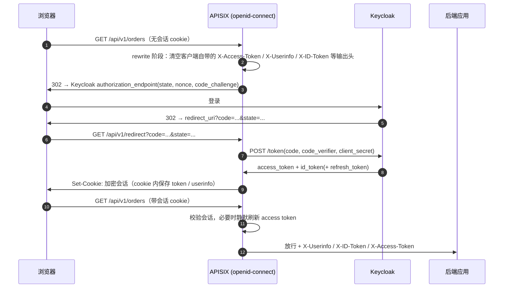

## 场景

- 入口网关已经从 Nginx 换成 APISIX，Keycloak 作为唯一 IdP；要保护的是一批内部应用，后端改不动，只能读网关注入的头。
- 你照着 APISIX 的 Keycloak 教程把 `openid-connect` 插件配好，登录能跑通；但一上生产就陆续撞到 redirect URI 约束、自签证书升级后连不上、会话 cookie 变大、滚动发布时用户随机掉线。
- 再往下走还会发现：APISIX 里做「认证」和做「授权」是两个插件、两套 discovery 文档、两种 token 传递位置，混在一起配的结果是某一层静默失效而不是报错。

本文基线：**APISIX 3.19.0**（2026-09-28 发布，行为与源码核对自 `release/3.19` 分支的 `apisix/plugins/openid-connect.lua` 与 `authz-keycloak.lua`）、**Keycloak 26.7.4**（2026-09-16）。官方网站插件页当前对应 `release/3.18`，个别选项以源码为准。OAuth 2.0 授权码流程和 OIDC 的机制本身不在这里重复，见文末相关章节。

## 适用与不适用

| 适用 | 不适用 |
|------|--------|
| 已经在跑 APISIX，希望入口认证零额外组件（不再部署 oauth2-proxy） | 需要完整的 `X-Auth-Request-*` 语义或 oauth2-proxy 的 provider 特性，且已有一套在跑 |
| 后端无法改造，只能消费网关注入的 `X-Userinfo` / `X-ID-Token` | 后端需要细粒度资源授权（资源级策略仍应放后端或独立的授权服务） |
| 有纯 API 场景，只需要校验 Bearer Token（`bearer_only`） | 客户端是移动 App / 桌面端（网关会话 cookie 模型对这类客户端并不合适） |
| 已用 Keycloak Authorization Services（UMA），想在入口做一次粗粒度判定 | 只想要登录、不需要 Keycloak 的授权服务（这时启用 `authz-keycloak` 只是多一次网络往返） |

## 认证和授权是两个插件

APISIX 没有「一个 OIDC 插件搞定全部」的设计，网关层的职责被拆成两半：

| | `openid-connect`（插件优先级 2599） | `authz-keycloak`（插件优先级 2000） |
|---|---|---|
| 角色 | OIDC Relying Party + OAuth 2.0 Resource Server | OAuth 2.0 Resource Server（UMA 客户端） |
| discovery 文档 | `/.well-known/openid-configuration` | `/.well-known/uma2-configuration` |
| 会不会跳登录页 | 会（会话缺失时 302 到 Keycloak 授权端点） | **不会**，没有 token 直接返回 401 |
| 靠什么判定 | ID Token / access token 验签、introspection、scope | 把请求里的 token 当 UMA ticket 发给 Keycloak token endpoint 换权限判定（`grant_type=urn:ietf:params:oauth:grant-type:uma-ticket`） |
| 前端拿到什么 | `X-Access-Token` + `X-Userinfo`（+ 可选 `X-ID-Token` / 原始 JWT） | 什么都不注入，只决定放行或 403 |

把 `authz-keycloak` 单独挂上去当「登录 + 授权」用是最常见的误配：它不做浏览器跳转，所以用户看到的永远是 401；另外它的 `discovery` 必须指向 `uma2-configuration`——`lazy_load_paths` 依赖其中的 `resource_registration_endpoint`，而 OIDC 的 well-known 文档里没有这个字段。

### 一次完整的授权码流程，网关在做什么



图里三个容易被忽略的点：

- **会话在浏览器 cookie 里，网关不落库**。所以数据面重启/滚动升级不会让用户掉线；反过来说，cookie 加解密密钥（`session.secret`）一换，全部在线会话立刻失效——这一点在后面「版本与运维约束」里会展开。
- **`X-Userinfo` 和 `X-ID-Token` 都是 base64(JSON)，不是 JSON 也不是 JWT**。源码里两个头都是 `ngx.encode_base64(core.json.encode(...))`：`X-ID-Token` 装的是解码后的 claims，**没有签名**；要能被后端验签的原始 JWT，必须显式打开 `set_raw_id_token_header`（`X-Raw-ID-Token`）。直接当 JWT 解析是排错时最常见的自学弯路。
- **客户端传入的身份头是被清掉的**。源码在 `rewrite` 阶段先把客户端带来的 `X-Access-Token`、`X-Userinfo`、`X-ID-Token`、`X-Refresh-Token`、`X-Raw-ID-Token` 全部置空再自行注入，所以「伪造身份头绕过认证」这条路在挂了插件的 route 上不成立。**前提是请求确实经过这条 route**——同一网关里未被插件覆盖的路径仍会把客户端原样头转给上游，这也是 [IAM 集成模式与实践]() 里反复强调的「头只在网关覆盖范围内可信」。

## 最小可运行配置

### Keycloak 侧

| 设置 | 值 | 说明 |
|------|----|------|
| Client authentication | On | confidential client，网关要拿 client_secret 换 token |
| Standard flow | On | 授权码流程 |
| Valid redirect URIs | `https://gw.example.com/api/v1/redirect` | 必须与插件里的 `redirect_uri` **逐字符一致**（含 scheme） |
| Proof Key for Code Exchange Code Challenge Method | `S256` | 打开 `use_pkce` 时必须与这里匹配，否则授权请求被拒 |

先确认 discovery 与 issuer 的形态，这一步能排除掉一半的「连不通」：

```bash
curl -sS https://sso.example.com/realms/acme/.well-known/openid-configuration \
  | jq '{issuer, authorization_endpoint, token_endpoint, end_session_endpoint}'
```

### APISIX 侧（Admin API）

```bash
curl -sS "http://127.0.0.1:9180/apisix/admin/routes/protected-app" -X PUT \
  -H "X-API-KEY: ${admin_key}" -d '{
  "uri": "/api/v1/*",
  "plugins": {
    "openid-connect": {
      "client_id": "apisix-gateway",
      "client_secret": "<KEYCLOAK_CLIENT_SECRET>",
      "discovery": "https://sso.example.com/realms/acme/.well-known/openid-configuration",
      "scope": "openid profile email",
      "redirect_uri": "https://gw.example.com/api/v1/redirect",
      "use_pkce": true,
      "logout_path": "/api/v1/logout",
      "post_logout_redirect_uri": "https://gw.example.com/api/v1/",
      "session": {
        "secret": "<RANDOM_32_CHARS>",
        "cookie_secure": true,
        "cookie_http_only": true,
        "cookie_same_site": "Lax",
        "absolute_timeout": 28800
      }
    }
  },
  "upstream": { "type": "roundrobin", "nodes": { "orders:8080": 1 } }
}'
```

`redirect_uri` 是**子路径**而不是 route 的 `uri` 本身，这是插件层硬约束：`lua-resty-openidc` 要求两者不同，所以不配 `redirect_uri` 时插件会拿**当次请求的路径**追加 `/.apisix/redirect`（源码里是 `ctx.var.uri .. "/.apisix/redirect"`）。用通配 URI（`/api/v1/*`）时不显式指定它，回调地址就会随请求路径变化，Keycloak 侧只能靠 `*` 通配兜底，属于把可控的东西做成了不可控。

### 独立部署模式（无 etcd）必须显式配 secret

`session.secret` 在 etcd 模式下可以不配——插件会自动生成并写回 etcd；但 **standalone 模式（`config_provider: yaml`）没有 etcd 作为配置中心，必须显式写死**，否则多个数据面实例各自生成不同的 secret，会话在实例之间无法解密，现象是「登录成功后随机跳回登录页」。这个 secret 属于 `encrypt_fields`，落在 etcd 里是加密存储的。

## 版本与运维约束（升级前必看）

| 变更 | 影响 | 依据 |
|------|------|------|
| `ssl_verify` 默认值从 `false` 改为 `true`（3.16.0 起） | Keycloak 用自签证书/内部 CA 时，升级后 discovery 直接失败。要么补 CA，要么显式 `"ssl_verify": false`（生产不建议） | 插件文档的 breaking change 说明 + 源码 schema `default = true` |
| introspection 凭据位置变化（插件内 lua-resty-openidc 升级到 1.9.0） | `introspection_endpoint_auth_method` 默认 `client_secret_basic`，凭据**只**放 `Authorization` 头；如果对方的 introspection 实现只读请求体，就会 401，需要显式设为 `client_secret_post` | 插件文档 NOTE + 上游 issue #13085（已关闭） |
| 3.14.0 起的回调丢端口回归（3.13.0 正常） | APISIX 暴露在非 80/443 端口时，重定向 URL 丢掉端口，浏览器回调打到错误地址 | 上游 issue #12970（2026-04-03 已关闭修复） |
| `session.secret` 目前不支持优雅轮换 | schema 只暴露单个 `secret`；换值会让所有在线 cookie 立即失效；HA 逐实例升级期间新旧实例无法解密彼此的 cookie，请求按落到哪个实例随机失败 | 上游 issue #13718（仍 open） |
| 插件暂不支持 `hide_credentials` | 校验通过的 **Bearer `Authorization` 头会原样转发给上游**（插件只清理 X-* 输出头，不动 `Authorization`）。不需要 token 的后端要么自行忽略，要么在网络层限制来源 | 上游 issue #13279（仍 open） |

最后两条是排期时要写进变更方案的内容：`session.secret` 的一次轮换等价于一次全员强制重新登录；而 token 会到达上游意味着后端日志、链路追踪里可能出现 access token，属于需要治理的暴露面。

### 会话体积：`session_contents` 的两个反向作用

cookie 被塞满时，第一反应是裁剪 `session_contents`。注意源码里有两条自动补回逻辑，裁剪不总是生效：

- 启用 `required_scopes` 时，插件会把 `session_contents.access_token` 强制置为 `true`——因为「已授权 scope」要从 access token 里读（access token 没有 `scope` claim 时回落到 ID Token，两者都读不到则直接拒绝会话）。
- 启用 `set_raw_id_token_header` 时，`session_contents.enc_id_token` 会被强制加回。

也就是说：既要原始 ID Token、又要按 scope 判定，就不可能同时把会话压到最小。真要压体积，先看 [IAM Token 体积治理：Keycloak claims 裁剪与 oauth2-proxy Cookie 膨胀]() 里那套从 claim 源头裁剪的做法。

## 需要独立授权判定时：`authz-keycloak`

它和 `openid-connect` 是**两套独立的配置语义**，同时启用时的关键约束是 token 的位置：

- `authz-keycloak` 只读请求的 `Authorization` 头（源码 `core.request.header(ctx, "Authorization")`，没有 `X-Access-Token` 兜底）。
- `openid-connect` 默认把 access token 写在 `X-Access-Token`，并且 `access_token_in_authorization_header` 默认为 `false`。

结论：同一条 route 上想让它俩串起来，必须把 `openid-connect` 的 `access_token_in_authorization_header` 设为 `true`，否则 `authz-keycloak` 永远拿不到 token，表现为「登录成功但接口 401」。又因为插件按优先级降序执行（`openid-connect` 2599 先于 `authz-keycloak` 2000），登录态一定在授权判定之前建立。

```yaml
# 片段：在已配好 openid-connect 的 route 上追加授权判定
openid-connect:
  # ...其余不变
  access_token_in_authorization_header: true
authz-keycloak:
  discovery: https://sso.example.com/realms/acme/.well-known/uma2-configuration
  client_id: <KEYCLOAK_RESOURCE_SERVER_CLIENT>
  client_secret: <SECRET>
  lazy_load_paths: true            # 用 resource_registration_endpoint 按 URI 解析资源
  http_method_as_scope: true       # GET/POST 映射成同名 scope
  policy_enforcement_mode: PERMISSIVE
```

三个必知事实：

1. **`discovery` 必须是 `uma2-configuration`**，不是 OIDC 的 `openid-configuration`。
2. **`lazy_load_paths: true` 需要 Keycloak 客户端的 Service Accounts 打开**，且签发的 token 里要带 `resource_access` 中的 `uma_protection` 角色——插件要用它去查 Protection API。Keycloak 里打开该客户端的 Authorization 后通常会一并配好，如果只手工建了 client 而没开 Authorization，这里会静默 401。
3. **`policy_enforcement_mode` 默认 `ENFORCING`，没有策略的资源一律拒绝**。为了灰度先上 `PERMISSIVE`，只对已定义策略的资源生效，这是它唯一的正确用法；长期停在 `PERMISSIVE` 等于授权形同虚设。

历史上还有一个坑：资源匹配曾经用 `ctx.var.request_uri`（**含查询串**）去问 Keycloak 的 `resource_set?matchingUri=true`，带参数的请求匹配不到资源，返回 `invalid_resource`——这与 Keycloak 官方 Policy Enforcer 用 `getRelativePath()`（不含查询串）的行为不一致。上游 issue #12785 已修复，`release/3.19` 源码里解析资源用的是 `ctx.var.uri`。若你的版本停在这条修复之前，带查询参数的接口会莫名 403。

### 顺带分清网关选型里的一个事实

同样想做「网关做 OIDC RP」这件事，Kong 侧的路完全不同：**Kong Gateway OSS 的插件目录里只有 `jwt` / `oauth2` / `session`，官方 `openid-connect` 插件属 Enterprise tier**；社区那条线（Nokia 起源的 `kong-oidc`）仓库已归档。所以「Kong 开源版 + OIDC 登录」在 2026 年不是一个可以直接落地的组合，除非接受第三方插件的维护风险或走商业版。如果你在 APISIX 与 Kong 之间选，这是比性能数据更硬的一条约束。对照实现见 [IAM 网关：Keycloak + oauth2-proxy 集成指南]()（Nginx Ingress auth-url）、[Envoy Gateway 原生 OIDC + Keycloak]()（Gateway API）、[Traefik ForwardAuth + Keycloak]()（ForwardAuth）。

## 验证

```bash
# 1. 未登录访问被保护路径：应 302 到 Keycloak，且带 state 与 code_challenge
curl -sS -o /dev/null -D - "https://gw.example.com/api/v1/orders" | grep -i '^location'

# 2. 走完浏览器登录后，确认会话 cookie 已建立、且请求能到达上游
curl -sS -b cookies.txt -D - "https://gw.example.com/api/v1/orders" | head -20

# 3. 后端确认注入了什么：X-Userinfo / X-ID-Token 都是 base64，需要解码
echo '<X-Userinfo 的值>' | base64 -d | jq '{sub, email, preferred_username}'

# 4. 登出：logout_path 命中后清会话并（有 end_session_endpoint 时）跳 Keycloak 登出
curl -sS -o /dev/null -D - -b cookies.txt "https://gw.example.com/api/v1/logout" | grep -i '^location'
```

第 4 步有个容易误判的细节：插件比较的是 `ctx.var.request_uri`，**带查询串的登出地址不会命中**。`/api/v1/logout` 会走网关登出，`/api/v1/logout?from=app` 会被当成普通受保护请求转给上游。如果你的应用自己也提供 `/logout`，要么把 `logout_path` 改成不冲突的路径（本文示例用 `/api/v1/logout` 并保证应用不走这个地址），要么明确接受「应用自己的登出只清应用会话、网关会话还在」的结果。

## 常见错误表

| 症状 | 根因 | 处理 |
|------|------|------|
| `500`，日志 `no session state found` | `redirect_uri` 与 route 的 `uri` 相同，首次访问直接打到了回调地址而没有会话；或 `redirect_uri` 漏了 scheme | 回调配成 route URI 的子路径（如 `/api/v1/*` → `/api/v1/redirect`），并补全 `https://` |
| `state from argument does not match state restored from session` | 同一浏览器并发发起了两条登录流（第二个标签页覆盖了会话里的 state）。GET 回调会自动重启流程，其他方法或完全没有会话时仍是 500 | 把静态资源、回调与其他受保护路径拆到不同 route，避免一次页面加载触发多条流 |
| 升级后连不上 Keycloak，discovery 报 TLS 错 | 3.16.0 起 `ssl_verify` 默认 `true`，自签证书场景行为反转 | 给系统信任链补 CA；确认无误后再考虑显式关闭校验 |
| 本地能登录，非 80/443 端口环境回调丢失端口 | 3.14.0 引入、后续版本修复的回归 | 升级到含修复的版本，不要靠反向代理改 Host 绕过 |
| `X-ID-Token` 用 JWT 解析器打不开 | 该头是 base64 编码的 claims JSON，不是签名 JWT | 需要可验签的 token 时打开 `set_raw_id_token_header`，用 `X-Raw-ID-Token` |
| 上游偶发 `upstream sent too big header` / cookie 超限 | 会话把 token、userinfo 全带上，超出 header 缓冲区 | 先裁剪 Keycloak 侧 claims，再用 `session_contents` 收窄；注意 `required_scopes` / `set_raw_id_token_header` 会强制加回 |
| 滚动升级期间用户随机被要求重新登录 | 各实例 `session.secret` 不一致（standalone 未显式配置），或刚轮换过 secret | 显式固定 secret 并纳入配置管理；把轮换当作一次全员重登来排期 |
| 接口 401 但登录明明成功（同路由启用 `authz-keycloak`） | token 在 `X-Access-Token`，而 `authz-keycloak` 只读 `Authorization` | `openid-connect.access_token_in_authorization_header: true` |
| 带查询参数的接口 403 / `invalid_resource` | 旧版本用含查询串的请求 URI 匹配资源 | 升级到含 #12785 修复的版本 |
| 未登录也能拿到 200 | `unauth_action: pass` | 只在确有需要的路径上使用；默认 `auth` 才会跳登录 |

## 回滚

按影响面从小到大：

```bash
# 1. 只摘掉认证，不动 Keycloak 侧配置：删掉该 route 的插件配置
curl -sS "http://127.0.0.1:9180/apisix/admin/routes/protected-app" -X PATCH \
  -H "X-API-KEY: ${admin_key}" -d '{"plugins": {"openid-connect": null, "authz-keycloak": null}}'

# 2. 想要更细的灰度：把授权判定从强制降为宽松（仅当确实在跑灰度）
#    policy_enforcement_mode: PERMISSIVE
```

三条边界要写进变更单：

- **删除插件是即时生效的**，但浏览器里已签发的会话 cookie 仍在；若新旧方案复用同一 cookie 名与作用域，可能出现旧 cookie 干扰新流程，稳妥做法是同时改 `session.cookie_name`。
- **`session.secret` 的变更是单向的**：新 secret 写下的 cookie 一律无法被旧配置解密。所以「换 secret → 出问题 → 回滚 secret」这条路上，用户会经历两次强制重新登录。
- **Keycloak 客户端上的 Valid redirect URIs 建议在灰度期同时保留新旧两个回调地址**，否则回滚时前端会先撞上 `Invalid parameter: redirect_uri`，把问题误判成网关故障。

## FAQ

### Q1：APISIX 的 IAM 网关里，`openid-connect` 和 `authz-keycloak` 到底该用哪个？

按「是谁的职责」分：需要浏览器登录、需要读用户身份 → `openid-connect`；需要按 Keycloak Authorization Services 里的资源与策略做一次入口判定 → 再加 `authz-keycloak`。只做前者是完全正常的部署，不要因为「功能没用全」而多挂一个插件。判定需要在资源级、依赖业务语义时，仍应放到后端，网关的头只是传输通道，边界划分见 [零信任与身份驱动安全]()。

### Q2：`bearer_only: true` 就等于每个请求都做 Introspection 吗？

不完全是。源码里触发「取 Bearer 并校验」的条件是 `bearer_only`、`introspection_endpoint`、`public_key`、`use_jwks` 任一为真；也就是说配了 `use_jwks` 或 `public_key` 时走的是 JWKS 本地验签，introspection 并不发生。除此之外，无论哪种方式都要注意 introspection 结果的缓存（`introspection_interval` / `introspection_expiry_claim`）决定了 token 被吊销后多久才真正失效。细节对照见 [OAuth 2.0 Token Introspection 实践]()。

### Q3：网关已经验过 token 了，后端还要不要再验一次？

要，前提是「后端可能被绕过网关访问」这一条成立——Kubernetes 里 Pod 到 Pod 是平网络，拿到 Service 名就能直达后端。所以后端至少做一件：校验网关转发的 token 签名与 `aud`/`iss`，或依赖 NetworkPolicy / mTLS 保证流量只能从网关进来。只信任 `X-Userinfo` 头而不做任何来源约束，等于把认证结论交给网络可达性。

### Q4：为什么不能用 `X-ID-Token` 里的 claims 给后端做权限判断？

它没有签名，只保证「由网关生成」。如果网关是唯一入口且头被清理过，用它读取展示型信息（用户名、邮箱）没问题；但要做授权决策，必须使用可验证的凭证：网关注入的 `X-Raw-ID-Token`（后端验签）、或后端自己拿 `X-Access-Token` 走一次 introspection。这也是 [OAuth 2.0 攻击面与防护]() 里「不要把不可验证的断言当授权依据」在网关场景下的具体形态。

## 相关章节

- [OAuth 2.0 授权码流程与 PKCE]()：`state` 覆盖与 PKCE verifier 的机制基础
- [OAuth 2.0 Token Introspection 实践]()：JWT 本地验签与 introspection 的取舍、缓存策略
- [IAM 网关：Keycloak + oauth2-proxy 集成指南]()：auth-url / ForwardAuth 路线的对照实现
- [Envoy Gateway 原生 OIDC + Keycloak]()：Gateway API 控制器内置 OIDC 的对照实现
- [Keycloak 细粒度权限与授权策略实战]()：Keycloak 授权服务的资源、策略与权限模型
- [IAM 集成模式与实践]()：网关模式在整体架构里的位置与取舍

## 来源

- [APISIX — openid-connect 插件文档](https://apisix.apache.org/docs/apisix/plugins/openid-connect/)：全部选项与默认值、`redirect_uri` 子路径约束、`session.secret` 在 standalone 模式必须显式配置、`ssl_verify` 自 3.16.0 起默认 `true` 的破坏性变更、introspection 凭据只走 `Authorization` 头的 NOTE、`X-ID-Token` 是无签名 base64 claims、多标签页 state 覆盖与 `no session state found` 排错清单
- [APISIX — authz-keycloak 插件文档](https://apisix.apache.org/docs/apisix/plugins/authz-keycloak/)：`uma2-configuration` discovery、`lazy_load_paths` 需要 Service Accounts 与 `uma_protection`、`ENFORCING` 为默认策略模式、`policy_enforcement_mode` 语义
- `apache/apisix` `release/3.19` 源码：[`apisix/plugins/openid-connect.lua`](https://github.com/apache/apisix/blob/release/3.19/apisix/plugins/openid-connect.lua)（`rewrite` 阶段清空五个输出头、`get_bearer_access_token` 的 Authorization → X-Access-Token 回退、`X-Userinfo`/`X-ID-Token` 的 base64 编码、`required_scopes` 强制回填 `session_contents.access_token`、`redirect_uri` 自动追加 `/.apisix/redirect`、`logout_path` 与 `request_uri` 比较、插件优先级 2599）、[`apisix/plugins/authz-keycloak.lua`](https://github.com/apache/apisix/blob/release/3.19/apisix/plugins/authz-keycloak.lua)（只读 `Authorization`、`ctx.var.uri` 解析资源、插件优先级 2000）
- [apache/apisix#13718](https://github.com/apache/apisix/issues/13718)（open）：`session.secret` 无优雅轮换，轮换即全员重登，HA 逐实例更新期新旧 secret 并存导致随机失败
- [apache/apisix#13279](https://github.com/apache/apisix/issues/13279)（open）：当前版本会把校验通过的 `Authorization` / `X-Access-Token` 转发给上游，`hide_credentials` 尚未实现
- [apache/apisix#12970](https://github.com/apache/apisix/issues/12970)（2026-04-03 关闭）：3.14.0 起重定向 URL 丢失请求端口的回归，3.13.0 正常
- [apache/apisix#12785](https://github.com/apache/apisix/issues/12785)（2026-01-29 关闭）：`authz-keycloak` 曾用含查询串的 `request_uri` 匹配 UMA 资源导致 `invalid_resource`，官方 Policy Enforcer 用的是不含查询串的相对路径
- [apache/apisix#13085](https://github.com/apache/apisix/issues/13085)（已关闭）：introspection 的 `client_secret_basic` 凭据位置变化引发的失败
- [Kong — OpenID Connect 插件文档](https://developer.konghq.com/plugins/openid-connect/)：该插件 tier 为 Enterprise；对照 `kong/kong` OSS 仓库 `kong/plugins` 目录中只有 `jwt` / `oauth2` / `session`
- [nokia/kong-oidc](https://github.com/nokia/kong-oidc)：社区 OIDC 插件，仓库已归档
- [Keycloak 下载页](https://www.keycloak.org/downloads) / [keycloak/keycloak 26.7.4 release](https://github.com/keycloak/keycloak/releases/tag/26.7.4)（2026-09-16）：本文 Keycloak 基线版本
