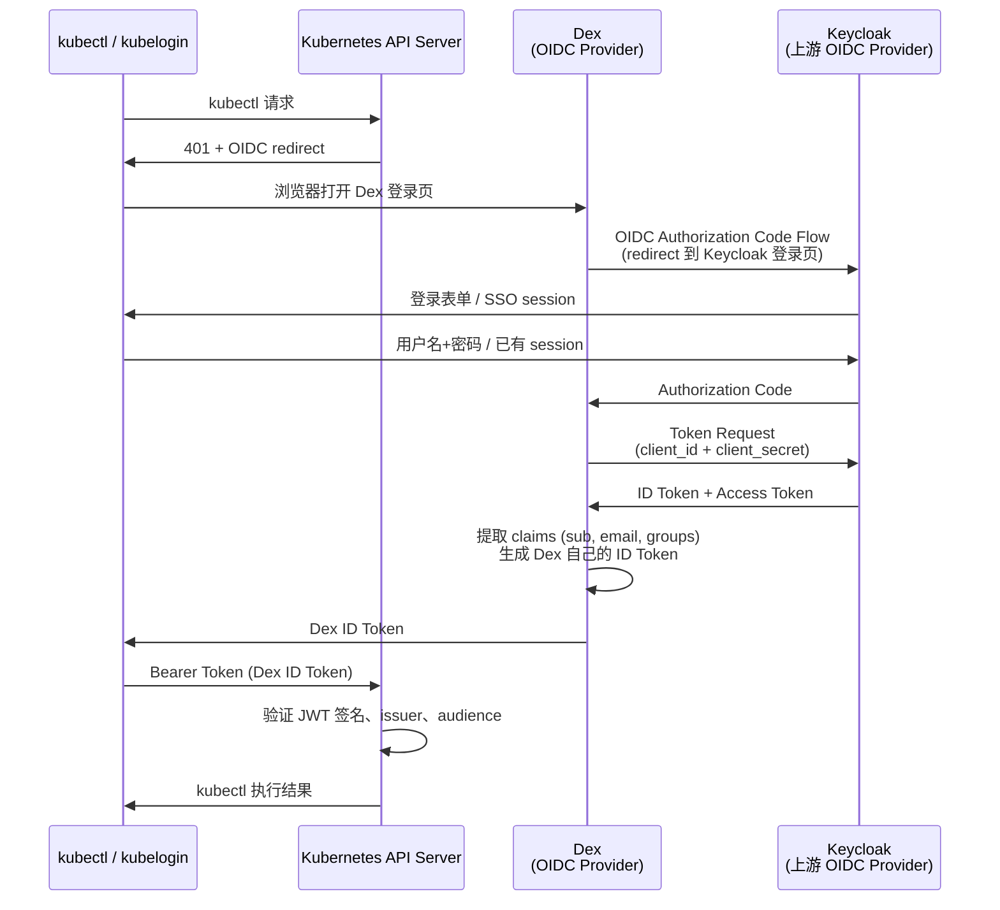

## 场景

组织用 Keycloak 管理全部用户和组（对接 AD/LDAP 或本地用户），同时需要为多个 Kubernetes 集群提供统一身份认证。直接在 Kubernetes API Server 挂 Keycloak 做 OIDC 可行，但有两个常见痛点：

1. **多集群管理**：每个集群的 API Server 需要指向同一个 issuer URL，Keycloak 的 realm 级别 issuer 不够灵活
2. **上游身份源复用**：Keycloak 本身对接了 AD、LDAP、GitHub 等多个 IdP，Kubernetes 还想同时接受这些来源的用户

这时 Dex 作为 OIDC 代理层，Keycloak 作为上游身份源，是最成熟的生产组合。

一句话：**Keycloak 管你是谁，Dex 把你的身份转换成 Kubernetes 认识的 OIDC**。

## 适用场景

- 已有 Keycloak 部署，需要给 Kubernetes 加 OIDC 认证
- 多个 Kubernetes 集群需要共享同一套身份
- 需要 Keycloak 的用户组映射到 Kubernetes RBAC 的 groups claim

## 不适用场景

- 没有 Keycloak，只想用 Dex 直连 LDAP/AD —— 直接在 Dex 配 LDAP connector 即可
- 只有一个小集群且用户都在 Keycloak 本地 —— 可以考虑直接对接 Keycloak OIDC
- 需要 Kubernetes 之外的完整 IAM 能力——直接用 Keycloak，不需要 Dex

## 架构



核心链路：**kubectl/kubelogin → Dex（OIDC Provider）→ Keycloak（上游 OIDC 源）→ AD/LDAP/本地用户**。

Dex 在中间做了一次身份转换——从 Keycloak 拿到用户信息后，生成自己的 ID Token 发给 Kubernetes。Kubernetes 只信任 Dex 签发的 JWT。

## 配置

### 第一步：在 Keycloak 创建 Dex 客户端

进入 Keycloak Admin Console，在目标 Realm 下创建 OIDC Client：

| 字段 | 值 | 说明 |
|------|---|------|
| Client ID | `dex` | 可自定义 |
| Client type | `confidential` | Dex 需要 client_secret |
| Valid Redirect URIs | `https://dex.example.com/callback` | Dex 的回调地址 |
| Access Type | `confidential` | 同上 |

**关键：Groups Claim 必须配 Mapper**。Dex 需要从 Keycloak 的 ID Token 中拿到用户所属组，才能传递给 Kubernetes RBAC。在 Keycloak Client 的 Mappers 中创建一个：

```
Mapper Type: Group Membership
Token Claim Name: groups
Add to ID token: ON
Add to access token: ON
Add to userinfo: ON
```

如果不配这个，Kubernetes 端看不到 groups，只能用 username 做 RBAC——等于废了组级权限控制。

### 第二步：Dex 配置文件

```yaml
# dex-config.yaml
issuer: https://dex.example.com

storage:
  type: kubernetes
  config:
    inCluster: true

web:
  http: 0.0.0.0:5556

staticClients:
  - id: kubernetes
    name: Kubernetes
    secret: dex-kubernetes-client-secret
    redirectURIs:
      - http://localhost:8000
      - http://localhost:18000
      - urn:ietf:wg:oauth:2.0:oob

connectors:
  - type: oidc
    id: keycloak
    name: Keycloak
    config:
      # Keycloak realm 的 issuer URL
      # 格式：https://<keycloak-host>/realms/<realm-name>
      issuer: https://keycloak.example.com/realms/enterprise

      clientID: dex
      clientSecret: <从 Keycloak 复制的 secret>

      # Dex 的回调地址（必须与 Keycloak 中配置的 redirectURIs 一致）
      redirectURI: https://dex.example.com/callback

      # 以下配置影响 Kubernetes 收到的 claims
      userNameKey: preferred_username   # 用什么字段作为 Kubernetes username
      userIDKey: sub                    # 用户唯一标识

      # ⚠️ 重要：允许传递 groups claim（默认关闭）
      insecureEnableGroups: true

      # 如果不希望 Keycloak 所有用户都能登录 K8s，可以在这里限制组
      # allowedGroups:
      #   - k8s-users
      #   - platform-team

      # Keycloak 的 email_verified 默认不存在或为 false
      # 如果不跳过，Dex 会拒绝没有验证邮箱的用户
      insecureSkipEmailVerified: true

      # 可选：scopes 声明，确保拿到 profile 和 groups
      scopes:
        - openid
        - profile
        - email
        - groups

oauth2:
  # 跳过 PKCE（Keycloak 支持 PKCE，但 Dex OIDC connector 走传统 Authorization Code）
  skipApprovalScreen: true
```

### 第三步：Kubernetes API Server 配置

在 kube-apiserver 的启动参数中配置 OIDC（所有 control plane 节点都需要）：

```
--oidc-issuer-url=https://dex.example.com
--oidc-client-id=kubernetes
--oidc-username-claim=preferred_username
--oidc-username-prefix=oidc:
--oidc-groups-claim=groups
--oidc-groups-prefix=oidc:
--oidc-ca-file=/etc/kubernetes/pki/dex-ca.crt
```

> 注意：Kubernetes API Server 的 `--oidc-*` 参数要求 Dex 的 TLS 证书被信任。如果 Dex 用自签名证书，把 CA 证书挂到 API Server 上。用 cert-manager + Let's Encrypt 会更省心。

### 第四步：kubectl 接入（kubelogin）

```bash
# 安装 kubelogin
# 参考: https://github.com/int128/kubelogin

kubectl oidc-login setup \
  --oidc-issuer-url=https://dex.example.com \
  --oidc-client-id=kubernetes \
  --oidc-client-secret=dex-kubernetes-client-secret
```

执行后 kubelogin 会打开浏览器，跳转到 Dex 登录页，Dex 再 redirect 到 Keycloak。登录成功后 kubectl 就能正常使用了。

生成的 `~/.kube/config` 类似：

```yaml
users:
  - name: oidc
    user:
      exec:
        apiVersion: client.authentication.k8s.io/v1
        command: kubelogin
        args:
          - get-token
          - --oidc-issuer-url=https://dex.example.com
          - --oidc-client-id=kubernetes
```

## 验证

### 1. 验证 Dex 能拿到 Keycloak 的用户信息

```bash
# 在 Dex 所在节点查看日志，确认 OIDC callback 成功
kubectl logs -n dex deployment/dex | grep "login successful"

# 预期输出类似：
# login successful: connector "keycloak", preferred_username="zhangsan", email="zhangsan@example.com", groups=["k8s-users","platform-team"]
```

### 2. 验证 kubectl 能认证

```bash
kubectl get pods --user=oidc -n default
# 应该返回 pod 列表而不是 401

# 查看当前认证用户的 claims
kubectl get --raw /apis/authentication.k8s.io/v1/selfsubjectreviews \
  --user=oidc | jq .
```

### 3. 验证 RBAC groups

在 Kubernetes 中创建一个 ClusterRoleBinding 绑定到 Keycloak 的组：

```yaml
apiVersion: rbac.authorization.k8s.io/v1
kind: ClusterRoleBinding
metadata:
  name: k8s-users-view
roleRef:
  apiGroup: rbac.authorization.k8s.io
  kind: ClusterRole
  name: view
subjects:
  - kind: Group
    name: oidc:k8s-users   # 注意前缀 oidc: 来自 --oidc-groups-prefix
    apiGroup: rbac.authorization.k8s.io
```

然后在 Keycloak 中把测试用户加入 `k8s-users` 组后，该用户就能看到集群资源但无法修改。

## 常见错误

| 症状 | 可能原因 | 检查点 |
|------|---------|--------|
| Dex 回调报 `invalid_grant` | Keycloak client secret 不匹配 | 确认 Dex config 中的 clientSecret 与 Keycloak client 的 secret 一致 |
| Dex 登录后 `login failed: no email` | Keycloak 没返回 email claim 或未验证 | 加 `insecureSkipEmailVerified: true`；检查 Keycloak 用户有没有配 email |
| kubectl 报 `invalid_token` | Kubernetes API Server 的 `--oidc-issuer-url` 与 Dex issuer 不一致 | `kubectl oidc-login setup` 的 issuer 必须与 API Server 配置完全一致（包括末尾 `/`） |
| RBAC 绑定后仍 403 | groups claim 没传过来 | 检查 Keycloak Client 的 Group Membership mapper；检查 Dex 配置中的 `insecureEnableGroups: true` |
| Dex 日志 `failed to verify token: oidc: expected audience` | Keycloak client 的 audience 与 Dex connector 的 clientID 不匹配 | 不必在 Keycloak 额外配 audience mapper，Dex OIDC connector 会自动使用自身 clientID |
| kubelogin 打不开浏览器 | 在无图形环境的服务器上操作 | 用 `kubelogin --grant-type=authcode-keyboard` 或在有浏览器的机器上操作 |
| Dex pods 重启后状态丢失 | 使用了 memory 存储 | 生产环境改用 Kubernetes CRD / PostgreSQL / MySQL 存储 |

### 排错命令速查

```bash
# 检查 Dex OIDC discovery
curl -s https://dex.example.com/.well-known/openid-configuration | jq .

# 获取 Dex 的 JWKS（验证 JWT 签名用）
curl -s https://dex.example.com/keys | jq .

# 手动解码 ID Token（不验证签名）
kubectl oidc-login setup ... && kubectl get --raw /apis/authentication.k8s.io/v1/selfsubjectreviews | jq .

# 在 Keycloak 端验证 client 配置
curl -s https://keycloak.example.com/realms/enterprise/.well-known/openid-configuration | jq .
```

## 生产环境注意事项

1. **TLS 是硬要求**：Dex 和 Keycloak 之间的通信、Kubernetes API Server 与 Dex 之间的通信必须走 HTTPS。用 cert-manager + Let's Encrypt 自动化证书管理。

2. **存储选择**：Dex 至少要用 `kubernetes` CRD 存储，不要用 `memory`。如果担心 CRD 性能，选择 PostgreSQL 存储后端。

3. **高可用**：Dex 无状态，直接多副本部署即可。Keycloak 高可用需要集群部署（参考 [Keycloak 高可用集群部署与灾难恢复]()）。

4. **Token 生命周期**：Dex ID Token 默认有效期较短（约 30 分钟），这是预期行为。kubelogin 会自动刷新 Token。如果觉得太短，调整 Dex 的 `expiry` 配置。

5. **审计**：Keycloak 和 Dex 都输出登录审计事件。生产环境建议把这些日志接入集中式日志平台（如 ELK/Loki）。

## 回滚方案

如果集成出问题，回滚分两步：

1. **回滚 Kubernetes API Server 配置**：去掉 `--oidc-*` 参数，重启 API Server。此时 kubeconfig 中的 `exec` 用户无法认证，集群退回凭据模式（client certificate/kubeconfig token）。

2. **回滚 Dex 部署**：如果 Dex 本身出问题但 Keycloak 正常，可以直接停 Dex，用户退回到原有的认证方式。

恢复后验证：`kubectl get pods` 用原有凭据能正常访问。

## 相关阅读

- [第16章：Dex 身份代理 — Kubernetes 原生 OIDC 联邦方案]()
- [第14章：Keycloak 架构与集群部署]()
- [Keycloak + oauth2-proxy 集成实战指南]()
- [Dex 官方文档：OIDC Connector](https://dexidp.io/docs/connectors/oidc/)
- [Keycloak 直连 K8s OIDC — 无需 Dex 的方案]()：如果只有单集群且不需要多源认证，Keycloak 直连更简单
- [kubelogin 项目](https://github.com/int128/kubelogin)
