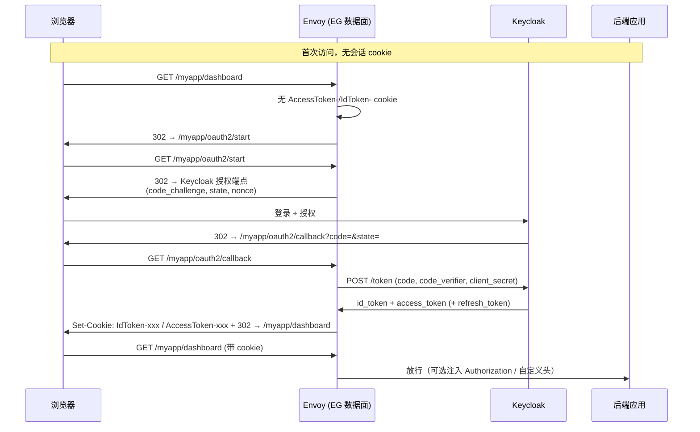

## 场景

- 集群入口已经从 Ingress 迁到 Gateway API，控制器选的是 Envoy Gateway（下文简称 EG）。现在有一组内部应用要加统一登录，Keycloak 已经在跑。
- 你面前有两条路：沿用 `oauth2-proxy` 走 external authorization，或者直接用 `SecurityPolicy` 的 `oidc` 字段——后者由 Envoy 的 OAuth2 filter 自己完成授权码流程，网关侧不再多一个组件。
- 你按官方 OIDC 任务页把 YAML 抄完，会撞上三个官方文档没细讲的点：`redirectURL` 必须落在被保护路由的 host + path 前缀内；同一时刻并发发起多条授权流会互相覆盖 PKCE verifier，在 Keycloak 侧表现为 `pkce_verification_failed`；以及升级 EG 会强制所有在线用户重新登录一次。

本文的基线：**Envoy Gateway v1.9.1**（2026-08-28 发布，字段语义核对自 `api/v1alpha1/oidc_types.go` 的 v1.9.1 标签）、**Keycloak 26.7.x**。OAuth 2.0 授权码流程与 PKCE 的基础机制不在这里重复，见文末相关章节。

## 适用与不适用

| 适用 | 不适用 |
|------|--------|
| 已用 Gateway API + Envoy Gateway，希望入口认证零额外组件 | 需要在入口做细粒度资源级授权（EG 的授权规则只到 claims / CEL 级别，资源级仍在后端） |
| 后端应用无法改造、只能读到网关注入的头 | 后端需要完整的 `X-Auth-Request-*` 语义或 oauth2-proxy 的 provider 特性，已有一套在跑 |
| 希望网关统一维护会话与 token 刷新（`refreshToken` 默认开启） | 需要纯 public client + 无秘钥的部署（EG 的 `clientSecret` 是必填字段） |
| 多子域共享登录态（`cookieDomain`） | 应用本身要按自己的规则做登出与本地会话（网关 cookie 与应用会话是两层） |

## 网关原生 OIDC 到底是谁在做认证

`SecurityPolicy` 里配的 OIDC 最终被翻译成 Envoy 的 OAuth2 HTTP filter，授权码交换、`state`/CSRF 校验、PKCE、token 刷新都在 Envoy 侧完成，应用只看到已经通过认证的请求：



三个看图容易误解的点：

- **`/oauth2/callback` 和 `/oauth2/start` 不是独立服务**，是 Envoy filter 在**被保护路由上**截获的路径。所以回调路径必须落在那条 HTTPRoute 的匹配范围内——这就是官方那句「`redirectURL` 和 `logoutPath` 必须匹配目标 HTTPRoute」的实际含义。
- **PKCE 是 Envoy 自己发起的**，不是你配的：Envoy 每开始一条授权流都会生成 nonce（CSRF）和 code verifier 并写进 cookie，回调时用它们校验。Keycloak 客户端上开着 PKCE 不影响，反之亦然。
- **会话状态全在浏览器 cookie 里**（`IdToken-<随机后缀>`、`AccessToken-<随机后缀>`，加密存储）。网关不落库，所以「网关重启后用户还在线」是正常的；反过来，「用户清了 cookie 就等于登出」。

### 和后端拿令牌是两件事

网关放行只代表「请求来自一个已登录用户」，不代表这个用户有权限做某件事。需要细粒度授权时仍按 [零信任 IAM 中 JWT 与 Introspection 的边界]() 的做法，让后端自己验签、验 `aud`、验权限；网关注入的头只是传输通道，跨信任边界时不能当结论用。

## Keycloak 端：先建一个 confidential client

EG 的 OIDC 配置里 `clientSecret` 是**必填**字段（源码里 `ClientSecret` 带 `+kubebuilder:validation:Required`，密钥名固定为 `client-secret`），这意味着它只支持 confidential client——把 Keycloak 客户端配成 public client + 纯 PKCE 是走不通的。

Admin Console → Clients → Create client 的关键项：

| 设置 | 值 | 说明 |
|------|----|------|
| Client authentication | **On** | 变 confidential client，Credentials 页才有 Client secret |
| Standard flow | On | 授权码流程 |
| Valid redirect URIs | `https://app.example.com/myapp/oauth2/callback` | 必须和 `redirectURL` **逐字符一致**，且以路由的 host + path 为前缀 |
| Web origins | 可留空 | 授权码 + 重定向流程不依赖 CORS |
| Proof Key for Code Exchange Code Challenge Method | `S256` | 保持开启；Envoy 每条流都会带 `code_verifier` |

验证客户端配置是否可用，先不用碰集群，直接对 Keycloak 的 discovery 端点确认 issuer 形态（EG 的 `issuer` 必须与它一致，且必须是 HTTPS）：

```bash
curl -sS https://sso.example.com/realms/acme/.well-known/openid-configuration \
  | jq '{issuer, authorization_endpoint, token_endpoint, end_session_endpoint}'
```

## 最小可运行配置

### 1. 存放 client secret 的 Secret

密钥名必须是 `client-secret`，改名字会得到「SecurityPolicy 不生效」而不是一个明确的报错：

```bash
kubectl create secret generic myapp-oidc-secret \
  --from-literal=client-secret='<KEYCLOAK_CLIENT_SECRET>'
```

### 2. 被保护的路由

```yaml
apiVersion: gateway.networking.k8s.io/v1
kind: HTTPRoute
metadata:
  name: myapp
spec:
  parentRefs:
    - name: eg
      sectionName: https
  hostnames: ["app.example.com"]
  rules:
    - matches:
        - path:
            type: PathPrefix
            value: /myapp
      backendRefs:
        - name: myapp-svc
          port: 8080
```

### 3. SecurityPolicy

```yaml
apiVersion: gateway.envoyproxy.io/v1alpha1
kind: SecurityPolicy
metadata:
  name: myapp-oidc
spec:
  targetRefs:
    - group: gateway.networking.k8s.io
      kind: HTTPRoute
      name: myapp
  oidc:
    provider:
      issuer: "https://sso.example.com/realms/acme"
    clientID: "myapp-gateway"
    clientSecret:
      name: "myapp-oidc-secret"
    redirectURL: "https://app.example.com/myapp/oauth2/callback"
    logoutPath: "/myapp/logout"
    scopes:
      - openid
      - profile
      - email
```

`issuer` 指向 realm 根（`https://sso.example.com/realms/acme`），不是 `/protocol/openid-connect`。EG 会从 discovery 里拿到授权端点、token 端点和 end session 端点。

### 4. 多子域共享登录态（可选）

```yaml
    cookieDomain: "example.com"
```

**已经存在的会话不会自动迁移**：加上 `cookieDomain` 后，浏览器里原本绑在 `app.example.com` 上的旧 cookie 优先级更高，必须先清一次，否则表现为「登录成功又立刻被要求登录」。

### 5. Keycloak 用私有 CA 或想显式钉住端点（可选）

Keycloak 用自签证书、或被 Internal CA 签发时，需要给 EG 一个 Backend 描述怎么连它，并用 BackendTLSPolicy 提供 CA：

```yaml
  oidc:
    provider:
      backendRefs:
        - group: gateway.envoyproxy.io
          kind: Backend
          name: backend-keycloak
          port: 443
      backendSettings:
        retry:
          numRetries: 3
          perRetry:
            backOff:
              baseInterval: 1s
              maxInterval: 5s
          retryOn:
            triggers: ["5xx", "gateway-error", "reset"]
      issuer: "https://sso.internal.example.com/realms/acme"
      authorizationEndpoint: "https://sso.internal.example.com/realms/acme/protocol/openid-connect/auth"
      tokenEndpoint: "https://sso.internal.example.com/realms/acme/protocol/openid-connect/token"
---
apiVersion: gateway.envoyproxy.io/v1alpha1
kind: Backend
metadata:
  name: backend-keycloak
spec:
  endpoints:
    - fqdn:
        hostname: sso.internal.example.com
        port: 443
---
apiVersion: gateway.networking.k8s.io/v1alpha3
kind: BackendTLSPolicy
metadata:
  name: backend-keycloak-tls
spec:
  targetRefs:
    - group: gateway.envoyproxy.io
      kind: Backend
      name: backend-keycloak
  validation:
    caCertificateRefs:
      - name: internal-ca
        group: ""
        kind: ConfigMap
    hostname: sso.internal.example.com
```

`backendSettings.retry` 里 `perRetry.timeout` 和 `retryOn.httpStatusCodes` 会被 CRD 校验直接拒绝，只支持 `numRetries` / `perRetry.backOff` / `retryOn.triggers`。

## 关键字段的默认值

这些默认值在本站其它网关方案里没有对应物，改动前值得逐条确认：

| 字段 | 默认值 | 需要注意 |
|------|--------|----------|
| `redirectURL` | `%REQ(x-forwarded-proto)%://%REQ(:authority)%/oauth2/callback` | 不写就按请求的 host 拼，多域名场景会各自不同；显式写必须落在被保护路由的 host + path 前缀内 |
| `logoutPath` | `/logout` | 同样是路由匹配问题：它必须能被某条关联路由接住 |
| `refreshToken` | `true` | 网关会自动用 refresh token 续期。Keycloak 侧若限制 `refresh_token` 生命周期，会表现为「一段时间后突然要重新登录」 |
| `defaultTokenTTL` | `0` | 为 0 时完全依赖授权响应里的 `expires_in`；provider 不返回该字段则整个流程失败 |
| `csrfTokenTTL` | `10m` | 同时决定 flow-state cookie 的存活时长，见下文升级一节 |
| `forwardAccessToken` | `false` | 开了之后上游会收到 `Authorization: Bearer <access_token>` |
| `passThroughAuthHeader` | `false` | 非浏览器客户端直接带 JWT 时，靠它跳过重定向 |
| `disableTokenEncryption` | `false` | 默认加密存储 token；设成 true 等于把 token 明文放进 cookie |

`scopes` 不用手写 `openid`，EG 会自动补。要按组控制准入时，把用户所在的组通过 `authorization` + JWT provider 校验，注意校验用的 claim 必须真实存在于你让它提取的那个 token 里（见下文验证一节）。

## 后端如何拿到身份

三种做法，按后端改造成本排序：

1. **只做准入**：后端不关心身份，网关只保证「未登录进不来」。适合 Grafana、Kibana 这类自己有账号体系又不需要用户名的场景。
2. **转发 access token**：`forwardAccessToken: true`，上游收到标准的 `Authorization: Bearer`。后端按普通 OIDC 资源服务器验签即可。
3. **转发 ID token 到自定义头**：`forwardIDToken.header` 指定头名（如 `X-Auth-Request-Id-Token`）；指定为 `Authorization` 时 EG 会自动加 `Bearer ` 前缀。注意 API 层面有一条硬约束：`forwardAccessToken: true` 与 `forwardIDToken.header: Authorization` 不能同时设置，会被 CRD 校验拒绝。

不要给同一个应用同时开 `forwardAccessToken` 和 `passThroughAuthHeader` 后又不校验签名——那等于把「谁能进来」的决定权交给了一个可伪造的头。

## 验证

```bash
# 1. 策略是否被接受（status.ancestors 里应有 Accepted/Condition）
kubectl get securitypolicy myapp-oidc -o yaml

# 2. 未登录访问应看到 302 到 /myapp/oauth2/start，而不是 403 或 500
curl -sSI -H 'Host: app.example.com' https://<GATEWAY_IP>/myapp/ | head -5

# 3. 完整走一次登录后，cookie 名应形如 IdToken-/AccessToken- 前缀
curl -sS -c /tmp/jar -o /dev/null -L https://app.example.com/myapp/
grep -o 'AccessToken-[A-Za-z0-9_-]*\|IdToken-[A-Za-z0-9_-]*' /tmp/jar | sort -u

# 4. 用 ID token 里的 groups 做准入时，先确认 groups 真的在 ID token 里
kubectl logs -n envoy-gateway-system deploy/envoy-<gateway> --tail=100 | grep -i oauth
```

第 4 步的坑：Keycloak 的组信息默认不保证写进 ID Token。如果 `authorization` 的组校验永远不通过，先在浏览器里解码 ID Token 的 payload 看有没有 `groups`；没有就去 Client scopes → 对应的组 mapper 把 *Add to ID token* 打开，重新登录后再解码确认。

Keycloak 侧对应证据在 Events（或事件表）里：正常流程是 `LOGIN` + `CODE_TO_TOKEN`，异常时优先看 `CODE_TO_TOKEN_ERROR` 的 `error` 字段，它直接告诉你是 PKCE、client 认证还是 redirect_uri 的问题。

## 常见错误表

| 症状 | 根因 | 处理 |
|------|------|------|
| Keycloak 日志 `error="pkce_verification_failed", reason="Code mismatch"` | 同一浏览器同时发起多条授权流，后发的流覆盖了先发的 code verifier cookie。常见触发点是**静态资源也被挂在带 OIDC 的路由上**，页面并发请求各自触发一次跳转 | 把不需要登录的路径（`/assets`、`*.js`、`*.css`）拆成**不带 SecurityPolicy** 的独立路由，只让业务路由承载策略；同时确认 EG 版本已包含并发流的修复 |
| 回调返回 404 / `NOT FOUND` | `/oauth2/callback` 没落进任何被保护路由的匹配范围，或 `redirectURL` 前缀与某条路由的 host + path 不一致 | 让 `redirectURL` 与路由前缀严格对齐；路径级的应用（如只保护 `/dashboard`）要么扩大路由前缀，要么给回调单独留一条路由 |
| SecurityPolicy 建好了但请求完全不被拦 | `targetRefs` 指向了错误的 HTTPRoute（如指向静态资源那条），或 `clientSecret` / Secret 密钥名不对 | 核对 `targetRefs.name` 与 `status.ancestors`；Secret 密钥名必须是 `client-secret` |
| 策略被拒绝，或登录时对外请求失败 | `issuer` 用了 `http://` 或带 query/fragment | `issuer` 只允许 HTTPS 且不带查询串；内网自签场景用 Backend + BackendTLSPolicy 解决信任，不要把 scheme 降级 |
| 升级 EG 后所有在线用户被要求重新登录一次 | OAuth2/OIDC 会话 cookie 从 AES-256-CBC 切到 AES-256-GCM（CVE-2026-47775），旧会话不再能解密 | 属预期行为，留出变更窗口；若你的 `EnvoyProxy` 用了自定义 bootstrap（`spec.bootstrap` 的 type 默认为 `Replace`），默认 bootstrap 里的兼容开关**不会生效**，需要自己在 `layered_runtime` 静态层里加上 `envoy.reloadable_features.oauth2_use_gcm_encryption: true` 与 `envoy.reloadable_features.oauth2_legacy_cbc_decrypt_compat: false` |
| 浏览器 cookie 越堆越多，最终 431 Request Header Fields Too Large | 早期版本把授权流状态 cookie 写在 `path=/`，放弃的流会留下孤儿 cookie，每次请求都带上 | 升级到已把 flow-state cookie 收敛到回调路径的版本，并考虑下调 `csrfTokenTTL`；注意孤儿 cookie 在过期前仍会发给回调端点 |
| 访问 A 子域登录了，跳 B 子域又要登录 | token cookie 默认只绑请求 host，不含子域 | 加 `cookieDomain`，并清一次旧 cookie |
| API 请求收到 302 + HTML 登录页 | 该路由被 OIDC 保护，而调用方是 AJAX / 机器客户端 | 用 `denyRedirect` 按请求头匹配这类请求，让它直接失败而不是被重定向 |

## 升级注意事项

EG 的 minor 版本对 SecurityPolicy 的校验是收紧的，跨版本升级前值得过一遍：

- **v1.8.4 起**：`http://` 不再允许作为 OIDC issuer scheme，并新增了 issuer URL 校验——原本「能跑但不规范」的配置会在升级后变成策略被拒。
- **v1.9.0 起**：`SecurityPolicy` 的 `mergeType` 只能用于 xRoute 目标（`HTTPRoute`/`GRPCRoute`/`TCPRoute` 等），用在 `Gateway`、listener、`ListenerSet` 上的存量策略必须先删掉该字段；`apiKeyAuth.extractFrom` 的校验也变严（至少一项，且每项只能是 headers/params/cookies 之一）。
- **v1.9.0 同时修掉了一个 cookieDomain 校验 bug**：`example.m.com` 这类「首个 label 之后存在单字符 label」的域名曾被校验误拒。
- **v1.9.0 新增 `SecurityPolicy.csrf`**，可用 Origin 校验覆盖写请求，并支持 `additionalOrigins` 与 `shadowFraction` 灰度——网关 cookie 认证 + 有状态写操作的场景值得单独评估。

## 回滚

最快路径，按影响面从小到大：

```bash
# 1. 只放开这一条路由的认证（用户仍可用应用自身的登录）
kubectl delete securitypolicy myapp-oidc

# 2. 需要彻底回退到旧控制器时，先保留 Keycloak 侧配置
#    Valid redirect URIs 里同时保留两套回调地址，灰度期间两套都能用

# 3. 版本回滚的方向性约束
#    GCM 会话 cookie 无法被旧版本解密 —— 回滚同样会强制一次重新登录
```

两个必须知道的边界：

- **删除 SecurityPolicy 是即时生效的**，Envoy 会立刻停止拦截该路由，但已经签发的 cookie 仍在浏览器里；如果新方案复用同一 `cookieDomain` 和 cookie 名，可能出现旧 cookie 干扰新流程，稳妥做法是同时换 cookie 名。
- **会话加密的兼容是单向的**：旧版本（CBC）无法解密新版本（GCM）写下的 cookie。所以「升级 → 出问题 → 回滚」这条路上，用户会经历两次强制登录，做变更窗口时要把它算进去。

## FAQ

### Q1：EG 原生 OIDC 和 oauth2-proxy + ext_authz 怎么选？

先看三条硬约束：**必须 confidential client**（原生 OIDC 的 `clientSecret` 必填）、**授权逻辑只到 claims/CEL 级别**、**不需要 `X-Auth-Request-*` 那套既有语义**。三条都满足、且你已经在用 Gateway API，就没必要多部署一个组件。反过来，已经有一套在跑的 oauth2-proxy、或者依赖它某个 provider 特性时，用 `SecurityPolicy` 的 external authorization 复用现有服务更省事。第三方 SaaS 回调、需要应用自己控制会话的场景则应该留在应用内做 OIDC，参见 [Keycloak + oauth2-proxy 集成指南]() 与 [Traefik ForwardAuth 方案]() 里对适用边界的讨论。

### Q2：为什么 `pkce_verification_failed` 不该先去 Keycloak 关 PKCE？

因为报错来源不是 Keycloak 的 PKCE 实现，而是网关侧多条授权流争夺同一个浏览器 cookie。关掉 Keycloak 的 PKCE 只是把「校验失败」换成「校验缺失」，并发覆盖本身仍在，而且会让你离 OAuth 2.1 的安全基线更远。正确方向是修路由（把静态资源和回调从同一个保护域里拆开），这也是上游 issue #7844 里那个案例最终的结论。

### Q3：后端能直接信任网关注入的身份头吗？

只有当请求确实只能从网关进来时才成立。Kubernetes 里 Pod 到 Pod 是平网络，任何人拿到 Service 名就能绕过网关直接打后端。要做基于头的授权，至少满足两条：后端 Service 不允许集群内任意来源访问（NetworkPolicy / mTLS），且后端对转发的 token 做一次签名校验。

### Q4：加了 `cookieDomain` 之后为什么还是登录不进去？

因为旧 cookie 还在，而且优先级更高。清掉 `app.example.com` 和 `example.com` 两个作用域下的 cookie 再试。这也是把 `cookieDomain` 当成上线后「临时补救」动作的风险所在：它实际是一次需要通告用户的会话重置。

### Q5：网关重启或滚动升级，用户会掉线吗？

不会。会话状态在浏览器 cookie 里（加密），数据面无状态，滚动升级后原 cookie 依然可用。真正会强制重登的只有两类变更：会话加密算法切换（升级版本时一次性），以及 cookie 名/作用域变化。

## 相关章节

- [OAuth 2.0 授权码流程与 PKCE]()：`code_verifier` 与 PKCE 的完整生命周期，理解并发流覆盖问题的前提
- [OAuth 2.0 攻击面与防护]()：`state`/CSRF 与 redirect_uri 约束的威胁模型
- [OAuth 2.1 相比 OAuth 2.0 的变化]()：为什么「关掉 PKCE 救火」是错误方向
- [IAM 网关：Keycloak + oauth2-proxy 集成指南]()：Nginx Ingress auth-url 模式的对照实现
- [IAM 入口认证：Traefik ForwardAuth + Keycloak]()：Traefik 侧的 ForwardAuth 对照实现
- [Pomerium Core 代理认证实战]()：身份感知代理路线的对照实现
- [IAM 集成模式与实践]()：网关模式在整体集成模式里的位置
- [零信任与身份驱动安全]()：入口认证与后端授权的边界划分

## 来源

- [Envoy Gateway — OIDC Authentication 任务页](https://gateway.envoyproxy.io/docs/tasks/security/oidc/)：`redirectURL` / `logoutPath` 必须匹配目标 HTTPRoute（含 host 与 path 前缀）、`clientSecret` Secret 密钥名为 `client-secret`、`cookieDomain` 追加后需清 cookie、自签 CA 场景的 Backend + BackendTLSPolicy + 显式端点写法
- [Envoy Gateway — External Authorization 任务页](https://gateway.envoyproxy.io/docs/tasks/security/ext-auth/)：`SecurityPolicy` 的外部授权配置路径
- [Envoy Gateway v1.8.4 release notes](https://gateway.envoyproxy.io/news/releases/notes/v1.8.4)：HTTP 不再允许作为 OIDC issuer scheme、issuer URL 校验、OAuth2/OIDC 会话 cookie 启用 AES-256-GCM 并关闭 CBC 解密路径（CVE-2026-47775）、自定义 bootstrap 需自行加 `layered_runtime` runtime flag、flow-state cookie 收敛到回调路径、PKCE verifier cookie 更名
- [Envoy Gateway v1.9.0 release notes](https://gateway.envoyproxy.io/news/releases/notes/v1.9.0)：`SecurityPolicy.csrf`（Origin 校验、`additionalOrigins`、`shadowFraction`）、授权规则支持 CEL 与路径匹配、`mergeType` 与 `apiKeyAuth.extractFrom` 校验收紧、cookieDomain 单字符 label 校验修复
- [Envoy Gateway v1.9.1 release](https://github.com/envoyproxy/gateway/releases/tag/v1.9.1)（2026-08-28）：本文基线版本
- `envoyproxy/gateway` v1.9.1 源码 [`api/v1alpha1/oidc_types.go`](https://github.com/envoyproxy/gateway/blob/v1.9.1/api/v1alpha1/oidc_types.go)：`OIDCClientSecretKey` / `OIDCClientIDKey` 常量、`ClientSecret` 必填、`issuer` 的 HTTPS 正则校验、`redirectURL` 默认值、`refreshToken` 默认 true、`defaultTokenTTL` 默认 0、`csrfTokenTTL` 默认 10 分钟、`denyRedirect`、`forwardIDToken` 与 `forwardAccessToken` 的互斥校验、`cookieConfig.sameSite`
- [envoyproxy/gateway#7844 — PKCE verification fails during token exchange with Keycloak](https://github.com/envoyproxy/gateway/issues/7844)（2026-01-17 关闭）：路由优先级导致静态资源被 OIDC 拦截、并发授权流互相覆盖 PKCE 的根因与拆分路由的修复、EG 要求 client secret
- [envoyproxy/gateway#7205 — csrf token validation failed when multiple requests on the same OIDC protected domain are accessed at the same time](https://github.com/envoyproxy/gateway/issues/7205)（2025-12-31 关闭）：并发请求下 CSRF 校验失败的同类问题
