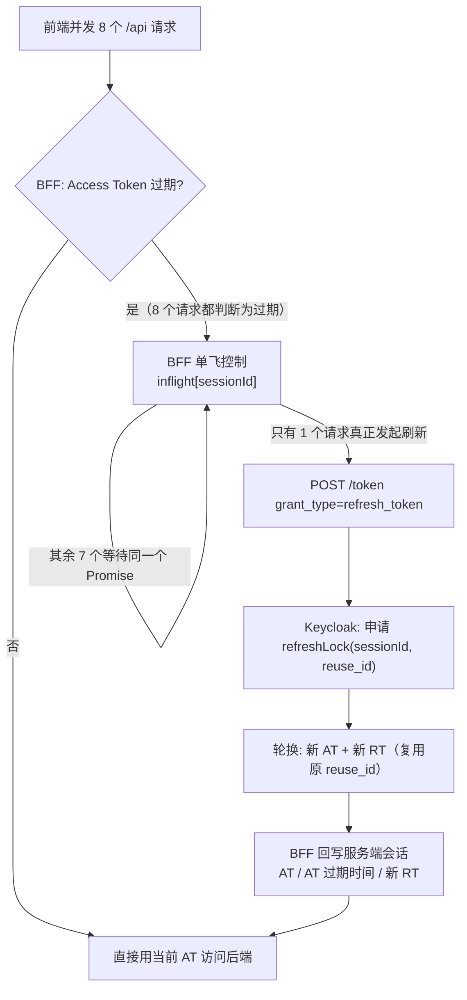

## 场景

三个症状，共同点是「已经按最佳实践用了 PKCE」，问题却出在架构层：

1. SPA 把 Access Token 放在内存里，用户按 F5 就得重新登录一次；退一步想存 `localStorage`，安全评审直接打回。
2. 上了 BFF 之后，一个用户开两个标签页、或一次页面加载并发十几个 XHR，日志里开始零星出现 `invalid_grant`；个别用户被强制下线，重新登录后又正常，无法稳定复现。
3. 后端已经有 `oauth2-proxy` 做认证，被问「这不就是 BFF 吗」，答不上来——结果后端要 Access Token 时拿不到，或者拿到的是一张 audience 指向别处的 Token。

本文回答两件事：**浏览器端应用在 IAM 架构里到底有几种选择、各自的边界在哪**；以及 **BFF 上线后最容易踩的并发刷新故障怎么定位和回滚**。

适用：SPA / 移动端 WebView 前端 + Keycloak（或任何 OIDC Provider）的组合，尤其是正准备从「前端直接持有 Token」迁到服务端会话的团队。

不适用：纯后端服务间调用（用 Client Credentials 就行，与本文无关）；SAML 为主的企业应用（SAML 没有浏览器端公客户端这回事）。

前提：OAuth 2.0 的四种角色、授权码流程与 PKCE 的密码学原理不在本文重复，见 [OAuth 2.0 授权码流程与 PKCE]()；攻击面本身见 [OAuth 2.0 攻击面与防护]()。

## 先确定你在哪条路上

2026 年 8 月，IETF 发布了 **RFC 10017 / BCP 212《OAuth 2.0 for Browser-Based Applications》**——它此前长期以 `draft-ietf-oauth-browser-based-apps` 的形式存在，本站早期页面引用的也是草案链接。这份 BCP 的价值不在于多一条安全建议，而在于它把「浏览器里的 OAuth」正式拆成三种架构模式，并给每种模式配了 MUST 级别的约束。选错模式，后面所有参数调优都是白费。

| | BFF（§6.1） | Token-Mediating Backend（§6.2） | 浏览器 OAuth 客户端（§6.3） |
|---|---|---|---|
| 谁是 OAuth 客户端 | BFF 自己（机密客户端） | 中介后端（机密客户端） | 浏览器代码（公客户端） |
| Token 放在哪 | 只在服务端，绑定 Cookie 会话 | 服务端缓存，前端按需领取 Access Token | 浏览器内存 / Worker |
| 浏览器里有什么 | HttpOnly 会话 Cookie，无 Token | HttpOnly 会话 Cookie + 短期 Access Token | Access Token（+ 可能有的 Refresh Token） |
| 恶意 JS 注入后能拿走什么 | 拿不到 Token；只能借用户的浏览器**代理请求** | 当前 Access Token 可被读走 | Access Token 与 Refresh Token 都可被读走 |
| 典型实现 | Spring Cloud Gateway TokenRelay、自研 Node/Java BFF | 面向多资源服务的 Token 中继、需按 audience 分发 | React/Vue + PKCE，纯前端 |

三点结论：

- **PKCE 和架构选择是两件事。** RFC 10017 §6.3.2.1 要求公客户端必须实现 PKCE，但 PKCE 防的是授权码被拦截后由别的客户端兑换，**不防页面上的恶意 JavaScript**。BCP 第 5 章把后者的攻击路径写得非常直白：`Persistent Token Theft`（持久化存储被读）与 `Acquisition and Extraction of New Tokens`（攻击者代码用同样的方式再要一组新 Token）。这类攻击下，前端持有 Refresh Token 基本等于长期失守。
- **浏览器 OAuth 客户端并没有被废弃**，只是它的安全前提是「Token 只放内存、Access Token 短命、不做长期持久登录」。要让用户关掉浏览器再回来还登录着，就得接受 Refresh Token 落到浏览器存储——这正是 BFF 存在的理由。
- **`oauth2-proxy` 三者都不是。** 它是身份感知反向代理（PEP），职责是「入口认证 + 把身份信息交给上游」，不是 RFC 10017 里的应用架构。它可以在你的部署里充当 BFF 的近似替代（浏览器不持 Token），但边界在于：它不做面向多个资源服务的 Access Token 分发与 audience 隔离。要看这层边界的具体配置，见 [oauth2-proxy 深度介绍]() 与 [Keycloak + oauth2-proxy 集成指南]()。

> 判断方法很简单：**问「谁在调 Token Endpoint」**。是浏览器里的 JavaScript → 第三种模式；是服务端组件 → BFF 或 TMB；根本没人调（只用 Cookie 头做认证）→ 你在用网关模式，不是 BFF。

## BFF 的硬性要求

RFC 10017 §6.1.3 用的是 MUST/SHOULD，不是「建议」：

| 要求 | 级别 | 说明 |
|------|------|------|
| 以机密客户端身份与授权服务器建立凭据 | MUST | 用 Authorization Code + 客户端认证；`client_secret` 或 `private_key_jwt` |
| Cookie 启用 `Secure` | MUST | 没有它，BFF 的会话等于明文传输 |
| Cookie 启用 `HttpOnly` | MUST | 这是「恶意 JS 无法把客户端劫持升级为会话劫持」的唯一依据 |
| Cookie 启用 `SameSite=Strict` | SHOULD | §6.1.3.3 同时要求 MUST 做 CSRF 防护；`SameSite` 是最省事的一层，但同站多应用部署时不够 |
| Cookie `Path=/`、不设 `Domain` | SHOULD | 不设 `Domain` 才能把 Cookie 锁在自身主机 |
| Cookie 名带 `__Host-` 前缀 | SHOULD | 防止 Cookie 被子域共享，挡住子域会话固定攻击 |
| 实现正式的 CSRF 防护 | MUST | `SameSite`、CORS 或自定义头 + 严格 Origin 校验 |

工程上最容易忽略的是最后一条：**BFF 用 Cookie 认证，就重新引入了 CSRF 面**——这是前端直接带 `Authorization: Bearer` 时不存在的问题。反过来，如果 BFF 与前端不同源，就要靠 CORS 预检来兜底，前提是 Origin 白名单严格且响应头只对可信来源开放。

## 最小配置

### Keycloak 侧

客户端用 **Confidential** 类型，其他保持默认：

```
Client authentication: On                  # 机密客户端，BFF 持有 client_secret 或私钥
Standard flow:          Enabled            # 只留 Authorization Code
Implicit flow:          Disabled
Service accounts:       Disabled
Valid redirect URIs:    https://app.example.com/bff/callback    # 精确匹配，不写通配符
Web origins:            https://app.example.com                 # 影响 CORS 预检
PKCE:                   保持 S256          # BFF 也可以继续用 PKCE，两者不冲突
```

关键点：**`Valid redirect URIs` 必须精确到 BFF 的回调路径**，不要为了「方便调试」写 `https://app.example.com/*`——按 RFC 10017 §6.3.2 附近的授权服务器要求，redirect URI 必须精确匹配。

### BFF 侧

最小骨架（Server-side session，Token 只存在服务端）：

```js
// 登录入口：BFF 自己发起授权码流程（浏览器只是被重定向）
app.get('/bff/login', (req, res) => {
  const state = randomId(), verifier = pkce();
  req.session.oauth = { state, verifier };
  res.redirect(buildAuthUrl({ state, codeChallenge: s256(verifier) }));
});

// 回调：用 code + verifier + 客户端认证换 Token，然后写进服务端会话
app.get('/bff/callback', async (req, res) => {
  const { state, verifier } = req.session.oauth ?? {};
  if (req.query.state !== state) return res.status(400).end();   // state 必须校验
  const t = await exchangeCode(req.query.code, verifier);
  Object.assign(req.session, {
    at: t.access_token,
    atExp: Date.now() + t.expires_in * 1000,
    rt: t.refresh_token,      // 轮换开启时，这里每次刷新都会变，必须回写
  });
  res.redirect('/');
});

// API 代理：前端只认 Cookie，BFF 负责加 Authorization 头
app.use('/api', async (req, res) => {
  const at = await getAccessToken(req.session);
  const r = await fetch(`${BACKEND}${req.path}`, { headers: { authorization: `Bearer ${at}` } });
  res.status(r.status).send(await r.text());
});
```

Cookie 用 `__Host-bff=...; Secure; HttpOnly; SameSite=Strict; Path=/`（注意 `__Host-` 前缀要求不设 `Domain`，这两条是绑定的）。所有 Token 存在服务端会话里（Redis / 数据库），**不要把 Token 序列化进 Cookie**：4KB 是硬上限，两个 JWT 加 ID Token 很容易超，超了会得到一个很难和认证问题区分开的 4xx/502。

## 并发刷新：BFF 特有的故障面

这是从「浏览器直连 IdP」换成 BFF 之后**新增**的风险，也是本文最主要的技术增量。

原因在于流量形态变了：以前每个标签页各自刷新自己的 Token；现在所有前端请求都汇聚到 BFF，一次页面加载可能并发 5～10 个 `/api/*`，每个都发现 Access Token 过期 → 如果代码写成「谁发现过期谁去刷新」，就会对同一个 `sessionId` 发出 N 个并发刷新请求，用的是同一条 Refresh Token。

### Keycloak 侧的轮换与串行化机制

先把 Keycloak 的行为看清楚（以当前 `main` 分支源码为准）：

- Realm 开启 **Revoke Refresh Token** 后，签发 Refresh Token 时会在 Token 中写入一个 `reuse_id` claim（`TokenManager`）；刷新时 `reuse_id` 原样复制到新 Token。也就是说，**一次授权码流程产生的整条刷新链共享同一个 `reuse_id`**，多标签页各自走授权码流程则分属不同链，互不干扰。
- 刷新时 Keycloak 会为该 `(userSessionId, reuse_id)` 申请一把临时排他锁：`session.singleUseObjects().putIfAbsent("refreshLock:" + sessionId + ":" + reuseIdKey, 60)`，并在 12 秒窗口内退避重试。所以**同一条刷新链的并发刷新是被串行化的**，不会有两个请求同时消耗同一个 Token。
- 被串行化就意味着有一个请求会「输」：`TokenManager#validateTokenReuse` 发现该链上已经登记了更新的 Refresh Token，就抛出 `invalid_grant` / `Stale token`；如果同一 Token 的使用次数超过 `refreshTokenMaxReuse`（默认 `0`，即严格单次），则抛出 `invalid_grant` / `Maximum allowed refresh token reuse exceeded`。
- 注意一个容易误判的细节：`Refresh Token Max Reuse` 是 **Realm 级**配置，客户端属性覆盖（`revoke.refresh.token`、`refresh.token.max.reuse`）来自 PR #51798，已合入 `main` 并带 26.8 的 release note，**截至当前稳定版 26.7.3 尚未可用**。也就是说，在 26.7.3 上你无法只对某个客户端放宽轮换策略。



### 三条真实故障路径

**路径一：并发刷新 → 部分请求 400（会话还活着）。** 单飞没做的时候，输掉竞争的那个请求拿到 `invalid_grant`（`Stale token`）。此时会话并未失效，但 BFF 若把 400 直接当成「登录态没了」并清 Cookie，用户就会莫名其妙被踢下线——症状是「刷新页面偶尔要重新登录」。

**路径二：刷新失败重试把复用预算吃掉 → 会话被永久撤销（会话真死了）。** Keycloak 的复用计数在事务提交**之前**就递增，事务回滚不回退（keycloak#49213，26.6.2 上报告）。26.0 起用户会话默认持久化到数据库（`persistent-user-sessions`，见 [Keycloak 26.0 发布说明](https://www.keycloak.org/2024/10/keycloak-2600-released)），于是「数据库抖动 / 只读副本 / 连接池打满」这类原本不进会话路径的故障，现在每次刷新失败都可能消耗一次复用预算。报告里的生产案例是：Postgres 短暂切主期间，684 个离线刷新会话中有 678 个被永久撤销，客户端此后只会持续收到 `Maximum allowed refresh token reuse exceeded`，只能人工重新签发。

对 BFF 的直接结论：**不要把刷新写成「失败就重试」**。`invalid_grant` 类失败重试不会自愈，只会加速消耗预算；真正值得重试的只有网络层错误和 5xx。

**路径三：集群内多客户端并发刷新同一 SSO 会话（keycloak#50721）。** 上面的锁键里含 `reuse_id`，因此**不同客户端刷新同一个用户会话时不在同一把锁上**。26.4 + 嵌入式 Infinispan 集群上出现过 `invalid_grant` / `Session doesn't have required client` 的间歇失败，触发条件是同一用户会话下两个客户端几乎同时刷新。如果你的 SPA 和另一个后端应用共享 SSO 会话，这条要留意：客户端侧的串行化只能解决自己这一侧。

**另外两条边界**：CVE-2026-1035（`validateTokenReuse` 的 TOCTOU 竞争，可在 `maxReuse=0` 时用并发请求绕过单次使用限制）已在 **26.4.11 / 26.5.6 / 26.6.0** 修复（keycloak#45647，PR #46054）；抢不到锁时源码会抛 `Unable to acquire serialization lock for token refresh`，在日志里表现为 500，通常意味着刷新已经被打成风暴而不是单个并发。

### 正确做法：单飞 + 只让一个持有者刷新

```js
const inflight = new Map();   // sessionId -> Promise<TokenSet>

async function getAccessToken(session) {
  if (session.at && session.atExp - Date.now() > 30_000) return session.at;

  if (!inflight.has(session.id)) {
    const p = refreshTokens(session).finally(() => inflight.delete(session.id));
    inflight.set(session.id, p);      // 同一 session 的并发请求共享这一个 Promise
  }
  const t = await inflight.get(session.id);
  return t.accessToken;
}

async function refreshTokens(session) {
  const res = await fetch(`${ISSUER}/protocol/openid-connect/token`, {
    method: 'POST',
    headers: {
      'content-type': 'application/x-www-form-urlencoded',
      // 机密客户端认证：优先 private_key_jwt，其次 client_secret_basic
      authorization: 'Basic ' + Buffer.from(`${ID}:${SECRET}`).toString('base64'),
    },
    body: new URLSearchParams({
      grant_type: 'refresh_token',
      refresh_token: session.rt,
      client_id: ID,
    }),
  });

  if (!res.ok) {
    const err = await res.json().catch(() => ({}));
    if (err.error === 'invalid_grant') {
      await sessions.destroy(session.id);        // 这条链已不可救：清会话，走重新登录
      throw Object.assign(new Error('reauth'), { status: 401 });
    }
    throw Object.assign(new Error('retry'), { status: 502 });  // 只有 5xx/网络才允许退避重试
  }

  const t = await res.json();
  session.at = t.access_token;
  session.atExp = Date.now() + t.expires_in * 1000;
  if (t.refresh_token) session.rt = t.refresh_token;   // 轮换开启时必须回写，否则下次必然失败
  await sessions.save(session);
  return { accessToken: session.at };
}
```

配套的三条部署约束：

1. **刷新窗口提前量**：在 `exp - 30s` 就判定为需要刷新，避免大量请求在「刚好过期」的同一瞬间一起进来。
2. **多副本必须收敛到单一刷新者**：进程内 `Map` 只在一个副本内有效。要么用粘性会话，要么把锁放到共享存储（Redis `SET NX PX`），要么让 BFF 定时为每个活跃会话主动刷新（RFC 10017 §6.1.2.2 也提到这种「由服务端观察过期事件」的做法，代价是后台负载）。
3. **刷新成功必须回写新 Refresh Token**：轮换语义下旧 Token 立刻失效，漏写一次，下一次刷新就是 `Stale token`。这也是很多「上线第一周正常、第二周开始掉线」的根因。

## 验证

```bash
# 1. 确认 Keycloak 的轮换配置（Realm 级）
curl -s -H "Authorization: Bearer $ADMIN_TOKEN" \
  "$KC/admin/realms/$REALM" | jq '{revokeRefreshToken, refreshTokenMaxReuse}'

# 2. 在测试 Realm 上复现并发刷新（务必在测试环境，且先用同一用户登录拿到一条 RT）
#    预期：一个 200，另一个 400 invalid_grant
curl -s -o /tmp/r1.json -w "%{http_code}\n" -X POST "$ISSUER/protocol/openid-connect/token" \
  -d "grant_type=refresh_token&refresh_token=$RT&client_id=$ID&client_secret=$SECRET" &
curl -s -o /tmp/r2.json -w "%{http_code}\n" -X POST "$ISSUER/protocol/openid-connect/token" \
  -d "grant_type=refresh_token&refresh_token=$RT&client_id=$ID&client_secret=$SECRET" &
wait; jq -r '.error, .error_description' /tmp/r1.json /tmp/r2.json
```

第 2 步的结果是**按 Keycloak 轮换语义应有的行为**（`Revoke Refresh Token` 开启、`Refresh Token Max Reuse=0`），不是某个版本的 bug；它的作用是让你在受控环境里看到真实报错文本，从而在 BFF 日志里能一眼认出来。

上线后的观察点：

- Keycloak 事件日志里 `REFRESH_TOKEN_ERROR` 的频次；BFF 侧应统计「每个活跃会话每分钟的刷新次数」，正常值应当接近 1，而不是随并发请求数线性增长。
- 确认 Keycloak 版本包含 CVE-2026-1035 的修复（26.4.11 / 26.5.6 / 26.6.0 及以上）。容器镜像 tag 往往滞后于 `main`，直接看镜像 tag 或用 `kc.sh --version` 核对。
- Refresh Token 的有效期由客户端会话到期时刻决定——**刷新不会把它延长到 SSO Session Max 之外**，这正好满足 RFC 10017 §6.3.2.3「轮换不得延长新 Token 生命周期」的要求。会话这一层的取值优先级与生效时机，见 [IAM 会话超时排错]()。

## 常见错误

| 症状 | 直接原因 | 处理 |
|------|---------|------|
| 并发请求中部分返回 `invalid_grant` / `Stale token`，其他正常 | 同一 `reuse_id` 链上并发刷新，输掉竞争的是旧 Token | BFF 做单飞；不要重试同一条 Refresh Token |
| `invalid_grant` / `Maximum allowed refresh token reuse exceeded`，重新登录后才恢复 | 复用次数超过 `maxReuse`（默认 0）；失败事务把计数吃掉（#49213） | 该会话已不可恢复：清 BFF Cookie 重新认证；排查并发与重试路径 |
| `invalid_grant` / `Session doesn't have required client` | 集群内不同客户端并发刷新同一 SSO 会话（#50721） | 升级补丁版；把刷新收敛到单一持有者；重试只会放大问题 |
| BFF 日志 500，`Unable to acquire serialization lock for token refresh` | 同一链的刷新锁在退避窗口内抢不到，通常是刷新风暴 | 关掉「每个请求自行刷新」的逻辑，改成单飞或主动刷新 |
| 用户切标签页就掉登录 | 会话 Cookie 被设成会话级 + `SameSite=Strict` 下跨站跳转不携带 | 明确会话 Cookie 的持久化策略；跨站入口用 top-level 跳转而不是 XHR |
| 后端 401，但浏览器侧认证「看起来正常」 | 网关模式不是 BFF，Access Token 没有传到后端（或传的是 ID Token） | 参见 [oauth2-proxy 常见错误]() 中的 `--pass-access-token` / `auth-response-headers` 组合 |

## 回滚

1. **BFF 故障时的降级路径**：把流量切回「网关认证 + 后端只读 `X-Auth-Request-User/Groups`」模式。前提是后端本来就支持从 Header 取身份——如果后端只认 Access Token，临时改后端比改架构风险更大，不要这么做。
2. **不要用关闭 `Revoke Refresh Token` 来「修」并发问题**：它确实能立刻消除复用超限类故障，但同时失去轮换检测（被盗 Token 可无限续命），而且已经被撤销的会话不会因此复活。只作为明确记录的短时应急手段，并在事后回到单飞主线。
3. **回滚前留档**：`kcadm.sh get realms/<realm> > realm-before.json`；BFF 侧的会话 Key 前缀与 Cookie 名也记录清楚，回滚时两侧要一致。
4. **回滚后验证**：用一个测试账号完成「登录 → 并发 10 个 API 请求 → 静置超过 Access Token 生命周期 → 再并发 10 个」的完整路径，确认没有 `invalid_grant`，且刷新次数符合预期。

## 常见问题（IAM BFF）

### IAM 里 BFF 和 oauth2-proxy 这类网关有什么区别？

BFF 是 RFC 10017 §6.1 定义的**应用架构**，它自己就是 OAuth 客户端，负责持有 Token、按用户会话代理到资源服务并按需要附加 Access Token。oauth2-proxy 是身份感知反向代理，解决的是「入口认证」，把身份信息通过 Header 交给上游。前者解决 Token 分发，后者解决访问控制接入——内部工具用后者足够，SPA 调多个后端 API 需要前者。

### SPA 把 Token 放 localStorage 到底行不行？

只要页面上可能运行第三方或注入的 JavaScript，`localStorage` 就是可读的持久化存储。RFC 10017 第 8 章把「用 JS 读写 Cookie 来存 Token」明确标为 NOT RECOMMENDED，第 5 章的 `Persistent Token Theft` 描述的正是这类存储被读走的完整后果：Access Token 可被重放，Refresh Token 可长期换取新 Token 且不易被发现。

### 已经用了 PKCE，为什么还需要 BFF？

因为两者防的不是同一件事。PKCE 防授权码被第三方客户端拦截兑换；BFF 防的是「页面上的恶意 JS 直接拿走 Token」以及「公客户端无法可靠保管 Refresh Token」。RFC 10017 §6.3.2.1 要求公客户端必须实现 PKCE，这是底线而不是终点。

### BFF 一定要用 Redis 存会话吗？

不必须，但多副本部署时**必须只有一个副本能刷新同一用户的 Token**。单副本 BFF 用进程内会话 + 单飞即可；多副本要么粘性会话，要么把会话与刷新锁放到共享存储。RFC 10017 §6.1.2.3 对服务端会话的评价是「控制力强但影响扩展性，适合小规模场景」，这也解释了为什么生产 BFF 通常配 Redis。

## 关键来源

- RFC 10017 / BCP 212《OAuth 2.0 for Browser-Based Applications》（2026-08 发布，取代此前的 datatracker 草案引用）：<https://www.rfc-editor.org/rfc/rfc10017>
- RFC 9700《OAuth 2.0 Security Best Current Practice》§2.1.1 授权码流程、§4.14 Refresh Token 要求：<https://www.rfc-editor.org/rfc/rfc9700>
- Keycloak `TokenManager#validateTokenReuse`（`Stale token`、`Maximum allowed refresh token reuse exceeded` 两处抛错与 `reuse_id` 生成/复制逻辑）：<https://github.com/keycloak/keycloak/blob/main/services/src/main/java/org/keycloak/protocol/oidc/TokenManager.java>
- Keycloak `AbstractRefreshTokenProvider`（刷新临时排他锁 `refreshLock:<sessionId>:<reuseId>`、12 秒退避）：<https://github.com/keycloak/keycloak/blob/main/services/src/main/java/org/keycloak/protocol/oidc/refresh/AbstractRefreshTokenProvider.java>
- keycloak#49213 — 事务回滚后复用计数不回退，导致会话被永久撤销（26.6.2）：<https://github.com/keycloak/keycloak/issues/49213>
- keycloak#50721 — 集群内多客户端并发刷新同一 SSO 会话出现 `Session doesn't have required client`（26.4）：<https://github.com/keycloak/keycloak/issues/50721>
- keycloak#45647 — CVE-2026-1035 Refresh Token 复用绕过（TOCTOU），修复于 26.4.11 / 26.5.6 / 26.6.0：<https://github.com/keycloak/keycloak/issues/45647>
- keycloak PR #51798 — 按客户端覆盖 `revoke.refresh.token` / `refresh.token.max.reuse`（已合入 main，随 26.8 发布）：<https://github.com/keycloak/keycloak/pull/51798>
- Keycloak Server Administration Guide — Session and token timeouts（`Revoke Refresh Token` 字段语义）：<https://www.keycloak.org/docs/latest/server_admin/index.html#_timeouts>
- oauth2-proxy 配置参考（Header Options，`set-xauthrequest` / `pass-access-token`）：<https://oauth2-proxy.github.io/oauth2-proxy/configuration/overview/>
