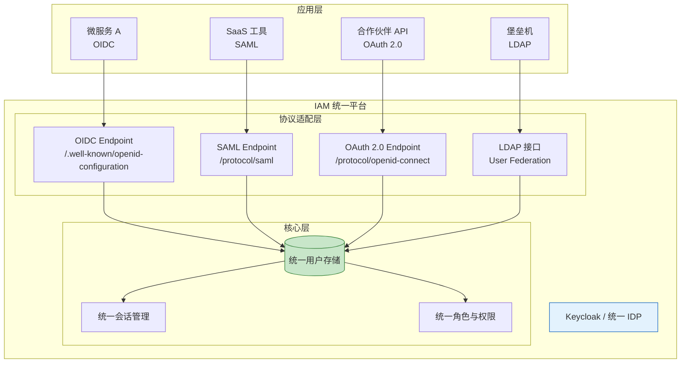
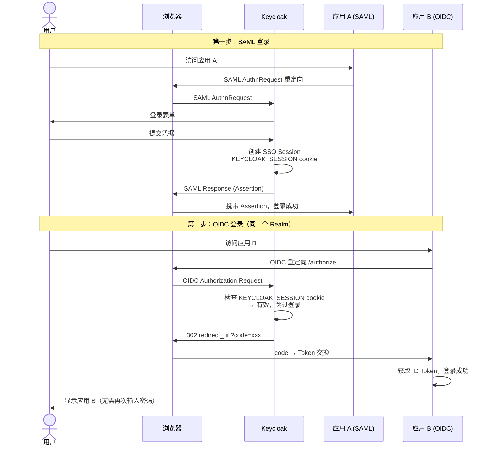
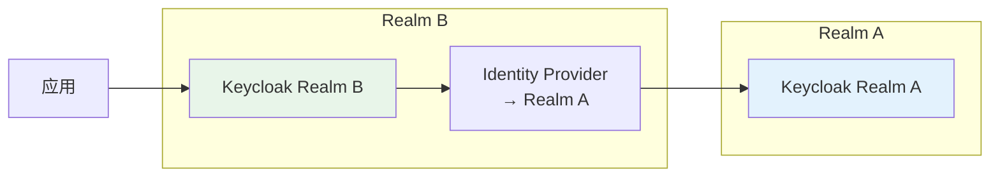

## 场景

你的 IAM 平台上线半年后，需求开始分化：

- 新写的微服务全部走 OIDC，认证快、对接简单
- 市场部买的 SaaS 工具只支持 SAML
- 合作伙伴的 API 需要 OAuth 2.0 客户端凭证
- 运维团队的堡垒机还在用 LDAP 认证

你不可能为每种协议部署一套独立的 IDP——运维成本会爆炸。你需要一个**统一的身份平台**：用户在一处管理，协议在背后自动适配。

本文不重复每种协议的细节（那些在[协议与标准]()部分已有完整阐述），而是聚焦于**把这些协议放在一起时，架构怎么设计、会话怎么统一、坑在哪里**。

## 适用与不适用

| 适用 | 不适用 |
|------|--------|
| 已有一个 IDP，需要为不同应用提供不同协议接入 | 只有一种协议需求的场景（直接看对应协议章节） |
| 收购/合并后需要整合多个身份系统 | 从零开始选协议（先看 [IAM 认证协议选型指南]()） |
| 需要支持既有旧系统（SAML/LDAP）又有新应用（OIDC） | 所有应用可以统一迁移到 OIDC（直接迁移，不需要多协议共存） |

## 核心挑战

一个 IAM 平台同时跑 OAuth 2.0、OIDC 和 SAML，真正的问题不是"配不配得通"，而是这三个：

1. **用户身份统一**：同一个用户在 OIDC 和 SAML 中拿到的 `sub` 是否一致？下游应用能否识别这是同一个人？
2. **会话统一**：用户通过 SAML 登录了应用 A，再打开 OIDC 应用 B 时到底要不要重新登录？
3. **协议语义差异**：OIDC 的 `groups` claim 和 SAML 的 `AttributeStatement` 里的 group 怎么对齐？

下面逐个拆解。

## 统一身份平台的架构



这个架构的核心原则：**用户存储只有一份，协议只是不同的"门面"**。不管用户从哪个门进来，验证的都是同一个密码哈希、读到的是同一组角色。

## 用户身份统一：sub 的一致性问题

这是多协议 IAM 中最容易被忽略但后果最严重的问题。

### 问题

某用户 `alice`，通过 OIDC 登录时 ID Token 的 `sub` 是 `a1b2c3d4-xxxx`（Keycloak 默认用 UUID）。通过 SAML 登录时，SAML Assertion 的 `NameID` 可能完全不一样——这取决于你的 SAML NameID 映射策略。如果下游应用 A（OIDC）和应用 B（SAML）各存了一份用户标识，将来做跨应用审计时根本对不上。

### 解决方案

**方案一：统一业务标识，而不是强行复用协议字段**

不要把 `email` 当成天然稳定的主键。邮箱可能因改名、域名迁移或离职再入职而变化；OIDC 的 `sub` 才是客户端识别用户的协议标识，应用侧应把它与 `iss` 一起作为外部身份键。跨协议审计若要关联同一用户，应在 IAM 用户目录中维护一个不可变的 `employee_id` 或随机 UUID，再分别映射到 OIDC claim 和 SAML Attribute/NameID。

如果历史系统只能用邮箱，先确认邮箱在整个生命周期内唯一且不会复用，并把这个限制写进身份数据契约；不要因为两个系统当前显示的邮箱相同，就推断它们一定代表同一个人。

```xml
<!-- SAML Client > Settings > Name ID Format: persistent -->
<!-- 将不可变 employee_id/UUID 映射为 NameID 或 Attribute -->
```

| NameID Format | OIDC 对应 | 适用场景 |
|---------------|-----------|---------|
| `email` | `email` claim | 仅适合邮箱不可变、不可复用的存量系统 |
| `persistent` | 需自定义 Mapper 映射到同一值 | 推荐用于跨协议稳定关联，不暴露邮箱 |
| `transient` | 无对应 | 每次登录不同，不适用于需要跨协议识别用户的场景 |
| `unspecified` | 取决于实现 | 不推荐，行为不可预测 |

**方案二：自定义 Claim Mapper（更灵活）**

如果 email 不能作为统一标识（例如内部员工和外部合作伙伴的 email 域不同），创建一个自定义 Mapper，把统一的员工编号（employee_id）同时写入 OIDC ID Token 和 SAML Attribute：

```
OIDC Client > Client Scopes > 新建 Mapper (User Attribute)
  Name: employee_id
  User Attribute: employee_id
  Token Claim Name: employee_id
  Add to ID token: ON

SAML Client > Client Scopes > 新建 Mapper (User Attribute)
  Name: employee_id
  User Attribute: employee_id
  SAML Attribute Name: employee_id
  Friendly Name: Employee ID
```

> ⚠️ **关键约束**：`employee_id` 必须在用户存储中唯一且不可变。如果 HR 系统可能修改员工编号，用随机 UUID 更安全（代价是读起来不友好）。应用数据库建议保存 `(issuer, subject)` 与内部用户 ID 的映射，而不是把 email 或显示名当主键。

### 标识符决策检查

上线前用一条身份数据契约把下面三件事写死，避免 OIDC 和 SAML 各自“看起来能用”：

1. **规范键**：内部用户 ID/UUID 的生成方、唯一性、变更和回收策略。
2. **协议映射**：OIDC 使用 `iss + sub`；SAML 使用 `persistent` NameID 或同值的 `employee_id` Attribute；邮箱只作为联系属性。
3. **生命周期测试**：改邮箱、改部门、离职后重新入职、删除后重新创建四种情况，都验证审计记录是否仍能关联到正确的内部用户。

这组测试比“登录成功”更能发现多协议 IAM 的数据一致性问题：认证流程绿了，不代表身份主键设计绿了。

## 会话统一：SSO 会话的跨协议传播

这是多协议 IAM 的第二大难题。用户通过 SAML 登录了应用 A，打开 OIDC 应用 B——到底要不要重新输入密码？

### Keycloak 的默认行为

在 Keycloak 中，**同一个浏览器 + 同一个 Realm = 共享 SSO 会话**。不管应用 A 用的是 OIDC 还是 SAML，只要用户在这个 Realm 下已完成认证且会话未过期，打开同 Realm 下的另一个应用时，Keycloak 会直接签发 Token/Assertion，不再要求输入密码。



### 不会自动共享 SSO 会话的情况

下列情形下，即使同一个 Keycloak 实例，用户也需要重新登录：

1. **跨 Realm**：Realm A 和 Realm B 是完全隔离的信任域，`KEYCLOAK_SESSION` cookie 按 Realm 隔离
2. **不同浏览器 / 不同设备**：会话 Cookie 浏览器隔离
3. **SAML 强制认证**：SAML AuthnRequest 中 `ForceAuthn="true"` 会强制重新认证
4. **OIDC 的 `prompt=login`**：要求重新认证，忽略已有 SSO 会话
5. **Cookie SameSite 限制**：跨站访问时 Cookie 可能不被发送

### 跨 Realm SSO 的实现：身份联合

如果确实需要跨 Realm 共享会话（例如公司有两个业务线，各自有独立 Realm），使用 Keycloak 的 Identity Brokering：



Realm B 配置一个指向 Realm A 的 OIDC Identity Provider。用户在 Realm B 登录时，被重定向到 Realm A 完成认证，然后返回 Realm B 完成用户关联。

具体配置参见 [Keycloak Identity Brokering]() 和 [Dex + Keycloak 联合身份]()。

## 协议语义差异与映射策略

不同协议对同一概念的表述方式不同。下面是一张快速对照表，每一行都是你在做多协议集成时可能踩的坑。

| 概念 | OIDC | SAML 2.0 | 映射策略 |
|------|------|----------|---------|
| 用户唯一标识 | `sub` claim | `NameID` | 两者指向同一值（email 或 UUID） |
| 用户组 | `groups` claim（自定义） | `AttributeStatement` 中的 group Attribute | 用同一个 LDAP/用户属性源，确保一致性 |
| 角色 | `realm_access.roles` / `resource_access` | `AttributeStatement` 中的 role Attribute | 角色名保持跨协议一致，不要 SAML 叫 `admin_role` 而 OIDC 叫 `administrator` |
| 会话过期 | `exp` + Refresh Token Rotation | `SessionNotOnOrAfter` | 超时时间统一配置（Keycloak Realm Settings > Tokens/Sessions） |
| 认证方式 | `amr` claim | `AuthnContextClassRef` | MFA 信息在两个协议中都要体现——审计时需要 |
| 登出 | RP-Initiated Logout / Backchannel Logout | SLO (Single Logout) | SLO 在企业端支持较差，建议 OIDC 用 Backchannel Logout 保持一致性 |

### 属性映射示例（Keycloak）

在 Keycloak 中，确保同一用户的 `groups` 在 OIDC 和 SAML 中一致：

**OIDC Client Scope**：
```
Mapper Type: Group Membership
Token Claim Name: groups
Add to ID token: ON
Add to access token: ON
```

**SAML Client**：
```
Mapper Type: Group list
SAML Attribute Name: groups
Group Attribute NameFormat: Basic
Single Group Attribute: OFF  （让所有组在一个属性中）
```

两个 Mapper 都指向同一个用户组存储，确保数据源一致。

## 常见错误与排错

### 错误 1：用户通过 OIDC 登录后，SAML 应用仍然要求登录

**症状**：同一个浏览器，先打开 OIDC 应用（登录成功），再打开 SAML 应用弹出登录表单。

**排查步骤**：
1. 检查两个应用是否在同一个 Realm
2. 打开浏览器 DevTools > Application > Cookies，检查 `KEYCLOAK_SESSION` 是否存在
3. 检查 SAML 应用的 `ForceAuthn` 是否被设为 `true`
4. 检查 Cookie 的 `SameSite` 和 `Secure` 属性——如果 OIDC 应用用 `https` 但 SAML 的 AssertionConsumerService 是 `http`，Cookie 可能不发送

### 错误 2：SAML 和 OIDC 中同一个用户的属性不一致

**症状**：用户在 OIDC 应用里是 `engineering` 组，在 SAML 应用里是 `engineering-team`。

**原因**：两个 Mapper 指向了不同的属性源。

**修复**：
- OIDC Client Scope 用 `Group Membership` Mapper
- SAML Client 用 `Group list` Mapper
- **确保两者都从 Keycloak Groups 读，而不是从用户属性（Attributes）读**

### 错误 3：跨协议登出不完整

**症状**：用户从 OIDC 应用登出，SAML 应用的会话仍然有效。

**原因**：OIDC RP-Initiated Logout 只清理了 Keycloak 端的 OIDC 会话，SAML 应用不知道用户已登出。

**修复选项**：
1. **启用 Backchannel Logout**（OIDC Client > Advanced > Backchannel Logout URL）：Keycloak 登出时主动通知应用
2. **缩短 Access Token 有效期**（5-15 分钟）：通过短生命周期 Token 减少残留会话窗口
3. **应用端主动检查**：应用定时（如每 5 分钟）用 iframe 检查 Keycloak OP iframe 的会话状态

## 生产检查清单

- [ ] 所有协议的 `sub`/`NameID` 是否指向同一个用户标识？
- [ ] 用户组/角色在 OIDC claims 和 SAML Attributes 中是否一致？
- [ ] SSO 会话超时在各协议中是否统一配置（Keycloak Realm Settings > Tokens/Sessions）？
- [ ] 是否测试过跨协议的登出行为（OIDC 登出 → SAML 应用是否受影响）？
- [ ] `ForceAuthn` 和 `prompt=login` 的使用场景是否有明确文档记录？
- [ ] SAML Metadata 中的签名证书是否在监控范围内，并已与 SP 的更新/回滚窗口对齐？
- [ ] 如果有跨 Realm 需求，Identity Brokering 的 User Federation 是否正确配置？

### 上线前验证身份键

不要只在浏览器里看到“登录成功”就结束验证。至少抽取一组测试用户，分别保存 OIDC 和 SAML 的结果，再检查它们是否能落到同一个内部用户 ID：

```bash
# OIDC：先用测试客户端获取 ID Token，再在本地解码 payload（不要把生产 Token 粘到第三方网站）
jq -R 'split(".") | .[1] | @base64d | fromjson | {iss, sub, employee_id, email}' < id-token.txt

# SAML：从测试登录响应中保存 Assertion，检查 NameID 和 employee_id
xmllint --xpath 'string(//*[local-name()="NameID"])' response.xml; printf '\n'
xmllint --xpath 'string(//*[local-name()="Attribute" and @Name="employee_id"]/*[local-name()="AttributeValue"])' response.xml; printf '\n'
```

预期结果不是“`sub` 和 `NameID` 字符串相等”，而是：OIDC 的 `(iss, sub)`、SAML 的稳定 `NameID`/`employee_id` 都能映射到同一个内部用户 ID。测试邮箱变更、员工离职后重新入职、用户删除后重建；如果内部 ID 被复用，历史审计会把两个不同的人串成一个人，这是比登录失败更难发现的事故。

## 回滚方式

多协议集成中的变更通常不影响用户数据，但可能影响登录体验。回滚策略：

1. **新增协议的 Client**：直接删除或禁用 Client 即可，不影响现有应用
2. **修改了 NameID 映射**：改回原来的 Mapper 配置，旧的 session 过期后自动恢复
3. **修改了 SSO Session 超时**：改回原值，`KEYCLOAK_SESSION` cookie 有效期恢复
4. **紧急情况**：如果某个协议的配置导致全部用户无法登录，通过 Keycloak Admin Console 禁用该 Client，用户就能绕过问题

> ⚠️ 不要在值班时段改生产环境的 SAML Metadata 证书——如果应用端不自动刷新 Metadata，证书过期会导致全部 SAML 应用无法登录。证书更新应该在维护窗口进行，并提前 2 周通知所有 SAML 应用的管理员。

## IAM 多协议集成 FAQ

### Q1：我能不能只用 OIDC，不用 SAML？

如果你的所有应用都支持 OIDC——可以。但现实中，SaaS 工具（Salesforce、Workday、Jira Cloud 等）对 SAML 的支持往往比 OIDC 更成熟。如果业务方已经买了这些工具，你的 IAM 就必须支持 SAML，这不是技术选择问题。

### Q2：多协议共存会不会让 IAM 架构变得过于复杂？

会，但比「为每种协议部署一个独立 IDP」简单得多。复杂度在内部（协议适配层），对外部应用透明。关键在于：**把用户存储和角色源统一，协议只是输出格式的差异**。

### Q3：Keycloak 的 Realm 是不是天然的多协议支持？

是。Keycloak 的 Realm 同时内置了 OIDC、SAML 2.0、OAuth 2.0 协议端点。创建一个 Realm，所有协议就都可以用，不需要额外安装插件。Cassdoor、Zitadel 等也支持多协议，但 SAML 的支持成熟度各有差异——选型时建议用你实际需要的 SAML 场景做一次 POC。

### Q4：OIDC 和 SAML 的会话超时不同步怎么办？

在 Keycloak Realm Settings 里统一配置 SSO Session Idle 和 Max 值。SAML 的 `SessionNotOnOrAfter` 由这些值决定，OIDC 的 Refresh Token 生命周期也受 Session Max 约束。**不要分别调**——在 SSO 会话层面统一控制。

### Q5：SAML Metadata 证书过期了怎么处理？

Keycloak 的 SAML 签名证书在 Realm Settings > Keys > SAML 2.0 Identity Provider Metadata 中查看和轮换。轮换步骤：

1. 生成新的 RSA 密钥对（Keycloak 会自动生成）
2. 导出新的 SAML Metadata XML
3. 通知所有 SAML SP 管理员更新 Metadata（给他们 2 周窗口）
4. 在旧证书过期前 48 小时，确认所有 SP 已完成切换
5. 移除旧密钥

**不要**先删旧密钥再加新密钥——这会导致中间窗口所有 SAML 应用无法登录。先确认 SP 支持多证书或已完成 Metadata 切换，再移除旧密钥。

## 延伸阅读

- [IAM 认证协议选型指南]() — 如果还没决定用哪些协议
- [OAuth 2.0 深度解读]() — OAuth 2.0 协议细节
- [OpenID Connect]() — OIDC 完整解读
- [SAML 2.0 协议详解]() — SAML 协议细节
- [身份联邦与中介]() — 跨域身份联合
- [Keycloak 架构深度解析]() — Keycloak 内部架构
