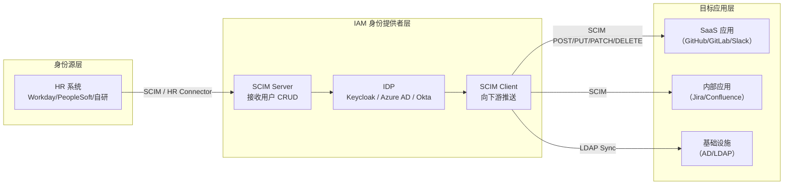

## 场景描述

一个新员工入职，HR 在人事系统里录入了他的信息。第二天 IT 手动在 AD、Keycloak、GitLab、Slack、Jira 里各创建一个账号，配好权限——前提是 IT 没忘记。一周后员工调岗，IT 再手动改一遍权限。三个月后员工离职，IT 批量关账号，漏了一个 Confluence 账号，安全审计时被发现。

这就是没有 **IAM 自动化身份供应（IAM Automated Identity Provisioning）** 的日常。SCIM（System for Cross-domain Identity Management）正是解决这个问题的标准协议。本文聚焦 IAM 场景下的 SCIM 落地实践：怎么让身份信息从 HR 系统自动流向 IDP、从 IDP 自动流向每个目标应用，不用人工介入。

**适用场景：**
- 企业已有人事系统（HRIS），希望自动化员工入职/调岗/离职的身份流转
- 使用支持 SCIM 的 IDP（Keycloak、Azure AD/Entra ID、Okta、OneLogin）且下游应用支持 SCIM
- 需要满足合规要求（如等保 2.0 的"身份信息应定期审查"、"离职用户应在 24 小时内回收权限"）

**不适用场景：**
- 用户数量极少（< 50），手动管理成本可接受
- 下游应用不支持 SCIM 且无法通过中间层适配
- 身份源（HR 系统）本身不稳定，无法保证数据质量

关于 SCIM 协议的完整技术细节，参阅 [SCIM 2.0 协议深度解读]()。IAM 中身份生命周期管理的概念基础见 [身份生命周期管理]()。

## IAM 自动身份供应的全链路架构

在企业 IAM 体系中，SCIM 扮演的是"身份数据的高速公路"——它连接身份源（HR 系统）→ 身份提供者（IDP）→ 目标应用（SaaS/内部应用），让用户信息在三层之间自动流转。



**流程说明：**

1. **入职（Joiner）**：HR 系统新增员工记录 → SCIM Connector 将用户 POST 到 IDP 的 `/scim/v2/Users` → IDP 自动创建用户 + 分配默认角色/组 → IDP 的 SCIM Provisioning 将用户推送到各下游应用
2. **调岗（Mover）**：HR 系统更新员工部门/职位 → SCIM PATCH 到 IDP → IDP 更新用户属性和组成员 → 下游应用同步收到角色变更
3. **离职（Leaver）**：HR 系统标记离职 → SCIM PATCH `active: false` 或 DELETE → IDP 禁用/删除用户 → 下游应用自动回收权限（在合规时限内完成）

这个 JML（Joiner-Mover-Leaver）流程是 IAM 运维自动化中最核心的一环。具体的安全策略见 [IAM 最小权限原则落地指南]()。

## Keycloak SCIM 部署实战

### SCIM 在 Keycloak 中的定位

Keycloak 自身没有内置完整的 SCIM Server，但可以通过社区扩展实现。目前主流方案是 `keycloak-scim-server`（Metatavu）插件。Keycloak 26.x 版本开始引入对 SCIM 的原生支持（作为技术预览），详情参考 [Keycloak 26.7 新特性深度解读]()。

### 安装 keycloak-scim-server

**环境要求：**
- Keycloak 25.x 或 26.x
- 支持 Docker 部署或裸机部署

**Docker 部署：**

```bash
# 基于 Keycloak 26 的 Dockerfile
FROM quay.io/keycloak/keycloak:26.1

# 下载 SCIM 插件 JAR
ADD https://github.com/Metatavu/keycloak-scim-server/releases/download/v2.5.0/keycloak-scim-server-2.5.0.jar \
    /opt/keycloak/providers/

# 构建镜像时自动安装插件
RUN /opt/keycloak/bin/kc.sh build
```

**环境变量配置：**

```bash
# realm 级别的 SCIM（全部用户）
SCIM_AUTHENTICATION_MODE=KEYCLOAK_ADMIN
SCIM_LINK_IDP=true

# 如果使用外部 JWT 认证（如 Azure AD 作为 SCIM 客户端）
# SCIM_AUTHENTICATION_MODE=EXTERNAL
# SCIM_EXTERNAL_ISSUER=https://sts.windows.net/{tenant-id}/
# SCIM_EXTERNAL_AUDIENCE=8adf8e6e-67b2-4cf2-a259-e3dc5476c621
```

### 验证 SCIM 端点

部署完成后，检查 SCIM 端点是否可达：

```bash
# 获取 Service Provider Config（SCIM 规范要求每个 SCIM Server 必须支持）
curl -s -H "Authorization: Bearer $(< admin_token)" \
  https://keycloak.example.com/auth/realms/{realm}/scim/v2/ServiceProviderConfig | jq .

# 查询用户列表
curl -s -H "Authorization: Bearer $(< admin_token)" \
  "https://keycloak.example.com/auth/realms/{realm}/scim/v2/Users?filter=userName+eq+%22zhangsan%22" | jq .
```

如果返回 401/403，检查认证模式和 Token 有效性。如果返回 500，检查日志中的 `Invalid SCIM configuration` 错误。

### SCIM 属性映射（连接 HR 系统到 Keycloak）

HR 系统中的字段需要映射到 SCIM User Schema。以下是一个常见映射表：

| HR 系统字段 | SCIM 属性 | Keycloak 属性 | 说明 |
|------------|----------|--------------|------|
| 工号 | `externalId` | 自定义属性 | 用于幂等匹配，防止重复创建 |
| 姓名 | `name.formatted` | `firstName` + `lastName` | 需要拆分或组合 |
| 邮箱 | `emails[type=work].value` | `email` | 同时用作 `userName`（常见做法） |
| 部门 | `urn:ietf:params:scim:schemas:extension:enterprise:2.0:User:department` | 自定义属性 | 用于动态分配 Group |
| 职位 | `title` | 自定义属性 | 用于角色推导 |
| 上级 | `urn:ietf:params:scim:schemas:extension:enterprise:2.0:User:manager` | 自定义属性 | 审批链关键字段 |
| 状态 | `active` | `enabled` | `true`=在职, `false`=离职 |

**创建用户的 SCIM 请求示例：**

```bash
curl -X POST \
  https://keycloak.example.com/auth/realms/{realm}/scim/v2/Users \
  -H "Authorization: Bearer $(< admin_token)" \
  -H "Content-Type: application/scim+json" \
  -d '{
    "schemas": ["urn:ietf:params:scim:schemas:core:2.0:User"],
    "externalId": "EMP-20260701",
    "userName": "zhangsan@example.com",
    "active": true,
    "name": {
      "formatted": "张三",
      "familyName": "张",
      "givenName": "三"
    },
    "emails": [{"value": "zhangsan@example.com", "type": "work", "primary": true}],
    "title": "高级工程师",
    "urn:ietf:params:scim:schemas:extension:enterprise:2.0:User": {
      "department": "基础架构部",
      "manager": {"value": "lisi@example.com", "displayName": "李四"}
    }
  }'
```

## Azure AD / Entra ID SCIM 集成

对于使用 Azure AD（现称 Microsoft Entra ID）的企业，Azure AD 自带 SCIM Provisioning 能力，可以将用户自动同步到支持 SCIM 的外部应用。

### 配置步骤

1. **Azure Portal → Enterprise Applications → 新建应用** → 选择 "Non-gallery application"
2. **Provisioning → Get started** → 选择 "Automatic"
3. **Admin Credentials**：
   - Tenant URL: `https://keycloak.example.com/auth/realms/{realm}/scim/v2`
   - Secret Token: 从 Keycloak 获取的 Bearer Token
4. **Test Connection** → 确认连通性
5. **Mappings** → 配置 Azure AD 属性到 SCIM 属性的映射（默认映射通常足够）
6. **Settings** → 选择 Scope（同步已分配的用户和组 or 全部用户）
7. **Start provisioning** → 首次同步建议手动触发，观察日志

### 常见问题

**问题 1：Test Connection 失败，报 `CredentialValidationUnavailable`**

这通常是 SCIM 端点返回非 200 的响应。检查：
- Keycloak SCIM 插件是否正确加载
- `SCIM_AUTHENTICATION_MODE` 是否与 Token 类型匹配
- Azure AD 的 Tenant URL 是否精确到 `/scim/v2` 且不含尾部空格

**问题 2：用户同步成功，但属性不全**

Azure AD 默认的属性映射不包括企业扩展属性（如 `department`、`manager`）。需要在 Provisioning Mappings 中手动添加这些映射。

**问题 3：离职用户未自动禁用**

配置 Azure AD 的 Scope 时，确保勾选了 "Sync only assigned users and groups" 且用户从应用中被移除时触发 Deprovisioning。

## IAM SCIM 排错清单

SCIM 集成最常见的失败点不在协议本身，而在配置和操作层面。

| 错误症状 | 可能原因 | 排查步骤 |
|---------|---------|---------|
| SCIM 端点返回 401 | Token 过期或认证模式错误 | 检查 Token 有效期；确认 `SCIM_AUTHENTICATION_MODE` 设置 |
| SCIM 端点返回 404 | 端点路径错误或插件未加载 | 确认 URL 包含正确的 realm；检查 `providers/` 目录有无 JAR |
| SCIM 端点返回 500 `Invalid SCIM configuration` | 环境变量缺失或配置不完整 | 检查所有 `SCIM_*` 环境变量；查看 Keycloak 日志 |
| 创建用户报 409 Conflict | `userName` 或 `externalId` 已存在 | 使用 PATCH 更新而非 POST 创建；确保 HR 系统的唯一标识正确传递 |
| 用户同步后无组成员 | 组未在 SCIM 中配置或映射缺失 | Keycloak SCIM 需要额外配置 Group 映射；Azure AD 需要在 Provisioning Mappings 中添加组映射 |
| 下游应用未收到用户变更 | SCIM Provisioning Interval 过长或应用端未配置 | Azure AD 默认每 40 分钟同步一次，可手动触发；检查应用端 SCIM 日志 |

### 诊断命令速查

```bash
# 查看 Keycloak SCIM 相关日志
docker logs keycloak-container 2>&1 | grep -i scim

# 查看 SCIM Service Provider Config（验证插件运行）
curl -s http://localhost:8080/auth/realms/master/scim/v2/ServiceProviderConfig \
  -H "Authorization: Bearer $(cat /tmp/admin_token)" | jq '.schemas'

# 查看特定用户是否存在
curl -s "http://localhost:8080/auth/realms/master/scim/v2/Users?filter=userName+eq+%22testuser%22" \
  -H "Authorization: Bearer $(cat /tmp/admin_token)" | jq '.totalResults'

# Azure AD 检查 Provisioning 日志
# Azure Portal → Enterprise Applications → {应用名} → Provisioning → Provisioning logs
```

## 回滚方式

SCIM 自动供应一旦出错，影响面广（可能批量创建/删除用户），回滚需谨慎。

1. **暂停同步**：Azure AD 中 Stop provisioning；Keycloak 中停用 SCIM 端点或移除插件
2. **数据回滚**：
   - 如果错误创建了大量用户：通过 SCIM DELETE 批量删除（按 `externalId` 模式匹配）
   - 如果错误修改了用户属性：从 HR 系统重新导出正确数据，通过 SCIM PATCH 修复
   - 如果错误删除了用户：从数据库备份恢复（Keycloak 数据库 + 下游应用数据库）
3. **事后审计**：检查 SCIM 操作日志，确认受影响用户范围；通知受影响用户；更新操作手册

**预防措施：**
- SCIM 同步先在 staging 环境验证，再切生产
- 首次同步时使用 "仅同步已分配用户"（Azure AD）或限定测试用户范围
- 配置 SCIM 操作的审计日志告警（如用户删除操作触发即时通知）
- 定期备份 IDP 数据库，确保可回滚到同步前的快照

## IAM SCIM 常见问题 FAQ

### SCIM 和 LDAP 在 IAM 里的定位有什么不同？

SCIM 和 LDAP 解决的是 IAM 中不同层面的问题。LDAP 是**目录查询协议**，解决"用户信息存储在哪、怎么查"；SCIM 是**身份同步协议**，解决"用户信息怎么从一个系统自动同步到另一个系统"。在企业 IAM 实践中，两者经常配合使用：LDAP 作为现有用户存储（如 AD），SCIM 作为从 HR 到 IDP、从 IDP 到 SaaS 应用的自动化桥梁。详见 [IAM 认证协议选型指南]()。

### Keycloak SCIM 和 Azure AD SCIM 哪个更成熟？

Azure AD（Entra ID）的 SCIM Provisioning 功能是内置的、生产级的产品能力，开箱即用，但只支持作为 SCIM Client（向其他应用推送用户）。Keycloak 的 SCIM 支持依赖社区插件（如 keycloak-scim-server），作为 SCIM Server 接收外部系统的用户同步请求。两者的典型组合：Azure AD 作为 HR→IDP 的 SCIM Client，Keycloak + SCIM 插件作为接收端，再由 Keycloak 的 Identity Brokering 或自定义逻辑推送到下游应用。

### 怎么保证 SCIM 同步不出错导致用户数据混乱？

三个关键措施：(1) 用 `externalId` 作为 HR 系统的唯一标识，避免同名冲突；(2) 同步前在 staging 环境跑完整流程；(3) 配置 SCIM 操作审计，每次用户创建/更新/删除都记录操作日志，异常时能回溯。

### IAM 中除了 SCIM 还有哪些自动化身份供应方式？

除了 SCIM，常见的自动化供应方式包括：(1) LDAP 同步（适合已有 AD 的企业）；(2) HR 系统直连 IDP 的专有 Connector（如 Workday→Okta 的专有连接器）；(3) 定时脚本/ETL（不推荐，缺乏实时性和标准化）；(4) Just-In-Time (JIT) Provisioning——用户在首次登录时自动创建（适合 SAML/OIDC Federation 场景，但属性更新不及时）。SCIM 的优势在于它是 IETF 标准、RESTful、支持实时推送，是当前 IAM 自动化供应的首选方向。

## 参考来源

- RFC 7643: SCIM Core Schema — https://datatracker.ietf.org/doc/html/rfc7643
- RFC 7644: SCIM Protocol — https://datatracker.ietf.org/doc/html/rfc7644
- Keycloak SCIM Server (Metatavu) — https://github.com/Metatavu/keycloak-scim-server
- Azure AD SCIM Provisioning 文档 — https://learn.microsoft.com/en-us/entra/identity/app-provisioning/use-scim-to-provision-users-and-groups
- Keycloak 26 Release Notes (SCIM 技术预览) — https://www.keycloak.org/2026/04/keycloak-2600-released
