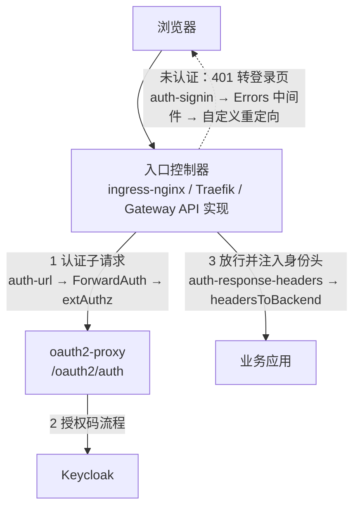

## 场景

集群入口跑着 ingress-nginx，业务 Ingress 用 `nginx.ingress.kubernetes.io/auth-url` + `auth-signin` 把认证委托给 oauth2-proxy，oauth2-proxy 对接 Keycloak——就是 [Keycloak + oauth2-proxy 集成指南]() 里那套两条 Ingress 的写法。ingress-nginx 在 2026 年 3 月退役，仓库已归档、不再有安全补丁，路由部分可以用 `ingress2gateway` 自动翻译。

**但认证注解一条都不会被转换。** 本文只处理这一层：路由可以照着工具输出改，身份入口必须手工重建，而重建的差异点集中在三个位置——认证子请求、认证结果注入后端的头、以及未认证时的跳转。

基线：Traefik v3.7（`kubernetesIngressNGINX` provider）、Envoy Gateway v1.9.1（`SecurityPolicy.extAuth` / `jwt.claimToHeaders`）、Keycloak 26.7.x、oauth2-proxy 7.15.x。

## 先确认退役事实与你的暴露面

| 时间 | 事件 | 来源 |
|------|------|------|
| 2025-11-11 | Kubernetes 官方博客宣布 ingress-nginx 将于 2026 年 3 月退役 | [kubernetes.io/blog/2025/11/11/ingress-nginx-retirement](https://kubernetes.io/blog/2025/11/11/ingress-nginx-retirement/) |
| 2026-01-29 | Steering 与 Security Response Committee 联合声明：退役后不再有 bug 修复、安全补丁或任何更新 | [kubernetes.io/blog/2026/01/29/ingress-nginx-statement](https://kubernetes.io/blog/2026/01/29/ingress-nginx-statement/) |
| 2026-03-19 | 最后一个 controller 版本 `controller-v1.15.1`（Helm chart `4.15.1`）发布 | `gh api repos/kubernetes/ingress-nginx/releases` |
| 2026-03-23 | 仓库归档（GitHub API `archived=true`），停止受理 issue/PR | `gh api repos/kubernetes/ingress-nginx` |

先分清两个同名项目，这是排错时最容易走错的第一步：

- **ingress-nginx**（`kubernetes/ingress-nginx`，社区维护）：本次退役的对象，IngressClass 的 `spec.controller` 通常是 `k8s.io/ingress-nginx`。
- **NGINX Ingress Controller**（F5，`docs.nginx.com`）：另一个产品，不受这次退役影响。

确认暴露面：

```bash
# 1. 集群里还有没有 ingress-nginx
kubectl get pods -A --selector app.kubernetes.io/name=ingress-nginx

# 2. 哪些 IngressClass 指向它
kubectl get ingressclass -o custom-columns=NAME:.metadata.name,CONTROLLER:.spec.controller \
  | grep k8s.io/ingress-nginx

# 3. 哪些 Ingress 上挂了认证注解——这就是必须手工重建的清单
kubectl get ingress -A -o json | jq -r '
  .items[] | select(.metadata.annotations // {}
  | to_entries[] | .key | test("auth-url|auth-signin|auth-response-headers|auth-snippet|auth-type|enable-global-auth"))
  | "\(.metadata.namespace)/\(.metadata.name)"'
```

第 3 条命令的输出应当被当成迁移的工作量基线：注解数量 ≈ 需要逐个确认的认证入口数量。

## 为什么认证层搬不动

`ingress2gateway` 1.0（2026-03-20 发布）把 ingress-nginx 注解支持从 3 个扩到 30 多个，覆盖 CORS、backend TLS、regex 匹配、path rewrite、timeouts、body size、canary、IP 段控制、SSL passthrough。但它对 ingress-nginx 的支持清单里**没有任何认证类注解**：`auth-url`、`auth-signin`、`auth-response-headers`、`auth-snippet`、`auth-type`、`enable-global-auth` 全都不在列表内。工具自己的定位也写明了：它不负责把注解搬运到 Gateway API，能转换的转换，不能转换的以 WARN 提示。

后果很具体：`HTTPRoute`/`Gateway` 会生成得很干净，路由测试全绿，但认证检查整层消失。如果切换时先删旧 Ingress、后补认证，应用会以「能访问」的形式暴露——不报错，也没有告警。**这是本次迁移里唯一不能靠工具兜底的环节，也是判断迁移做得对不对的分界线。**



图中虚线和实线是三类独立配置，前两类只影响「登录能不能成功」，第三类影响「未登录用户看到什么」。迁移时最常见的状态是：1 和 3 配好了，虚线忘了，于是浏览器里出现裸 401 而不是登录页——功能测试如果不覆盖「未登录访问受保护页面」，这个缺口会一路带到生产。

## 三条路线怎么选

| 路线 | 组件变化 | 后端身份头契约 | 在线用户是否需重新登录 | 适合什么情况 |
|------|---------|---------------|---------------------|-------------|
| A. Traefik 注解兼容 provider | 换控制器，oauth2-proxy / Keycloak 不动 | 不变（`auth-response-headers` 语义保留） | 不需要 | 注解数量多、希望尽量少改 YAML、能接受改全局行为配置 |
| B. Gateway API + ext_authz | 换控制器 + 新增 `SecurityPolicy`，oauth2-proxy 保留 | 需显式重建（`headersToBackend`） | 不需要 | 已在推进 Gateway API、需要按路由声明式管理认证 |
| C. 网关原生 OIDC | 去掉 oauth2-proxy | **丢失**（`X-Auth-Request-*` 是 oauth2-proxy 的产物） | 需要（会话 cookie 换主体） | 后端不依赖身份头、且授权不依赖数组型 claim |

A 与 B 能保住会话的原因很简单：oauth2-proxy 还是同一个实例，同一份 `--cookie-secret`、`--cookie-domain`、`--redirect-url`，外部 hostname 不变，浏览器里的会话 Cookie 就继续有效。**这让逐 host 切流、随时回滚成为可能**——这也是本文建议优先考虑 A 或 B 的工程理由，和"哪个控制器更好"是两回事。

## 路线 A：Traefik 注解兼容 provider

Traefik v3.7 提供 `kubernetesIngressNGINX` provider：默认按 `IngressClass.spec.controller == k8s.io/ingress-nginx` 选中现有 Ingress（provider 选项 `controllerClass`），把注解翻译成 Traefik 动态配置。**现有 Ingress 的 YAML 可以原样不动**，这是它在切流窗口里最大的价值。

```yaml
# Traefik 静态配置（Helm values 对应 providers.kubernetesIngressNginx）
providers:
  kubernetesIngressNGINX:
    enabled: true
    namespaces:                # 先只接管试点 namespace，避免和旧控制器抢同一个 host
      - team-a
    ingressClass: "nginx"
    controllerClass: "k8s.io/ingress-nginx"
    globalAuthURL: "http://oauth2-proxy.auth.svc.cluster.local:4180/oauth2/auth"
    allowSnippetAnnotations: false   # 与 ingress-nginx 侧同名开关对齐
    proxyRequestBuffering: false     # 按你旧 ConfigMap 的实际值对齐
```

三个必须逐项核对的差异（均出自 Traefik 官方 provider/注解 reference，不是猜测）：

1. **`auth-url` 的行为与 NGINX 不完全一致。** 官方备注写明"Only URL and response headers copy supported. Forward auth behaves differently than NGINX."，并且：当同一个 Ingress 上还有 `rewrite-target`（或在 snippet 里有 `rewrite` 指令）时，**发给认证服务的 `X-Forwarded-Uri` 是重写后的路径，不是客户端原始路径**。
   - 影响：oauth2-proxy 依赖原始 URI 决定登录后跳回哪里（`rd`）。路径前缀路由 + `rewrite-target` 是常见配置，切换后会出现"登录成功但跳到错误页面"。
   - 验证：对每个带 rewrite 的 host 各发一次未认证请求，检查 302 的 `Location` 与其中的 `rd` 是否等于原始请求 URI。
   - 处理：像旧方案一样显式把原始 URI 传给认证服务（历史上常用 `auth-snippet` 注入 `X-Original-URL`），同时确认新控制器允许 snippet 注解——provider 有 `allowSnippetAnnotations` 开关（示例值为 `false`）；开关关闭时不要预期 snippet 生效，先实测再排期。
2. **`auth-signin` 会自动追加 `rd`，也要防开放重定向。** Traefik 与 ingress-nginx 习惯一致，自动追加 `rd=$scheme://$best_http_host$escaped_request_uri`。官方同时警告：**没有 Host matcher 的路由上，`$best_http_host` 取自请求的 Host 头，可被构造为开放重定向。** 所有依赖该行为的 router 都必须用 Host 规则限定，别指望控制器替你兜底。
3. **全局行为不在注解里。** 请求缓冲（NGINX 默认开启请求缓冲，Traefik 需要 provider 级 `proxyRequestBuffering` 显式打开）、`ssl-redirect`、限流、`enable-global-auth` 对应的 `globalAuthURL` 都是 provider 级配置。切流前要把旧 ConfigMap 与 provider 配置逐项对齐，只对比 Ingress 注解会漏。

另外，provider 会独立发现集群内 Ingress，与标准 Kubernetes Ingress provider 同时启用时可能生成重复 router；用 `namespaces` / `watchNamespace` / IngressClass 显式收窄范围，别让两套控制器在同一窗口里都接管同一个 host。

## 路线 B：Gateway API + ext_authz（保留 oauth2-proxy）

Envoy Gateway v1.9.1 的 `SecurityPolicy.spec.extAuth.http`（字段核对自 `api/v1alpha1/ext_auth_types.go` 的 v1.9.1 标签）：

- **`path` 是追加语义，几乎一定会踩坑。** 源码注释写得很清楚：原始请求路径会被追加到配置的路径后面——配 `/oauth2`、原始路径 `/hello`，认证请求落到 `/oauth2/hello`。oauth2-proxy 的端点固定在 `--proxy-prefix`（默认 `/oauth2`）之下（`/oauth2/auth`、`/oauth2/start`、`/oauth2/callback`、`/oauth2/sign_in`、`/oauth2/sign_out`、`/oauth2/refresh`），追加路径落不进任何端点，你看到的是 404/401 而不是认证判定。
- 要固定路径必须用 **`pathOverride: /oauth2/auth`**（源码有 XValidation 约束：`path` 与 `pathOverride` 互斥）。
- **`headersToBackend`** 是"认证响应头 → 原始业务请求"的复制开关，对应 ingress-nginx 的 `auth-response-headers`；不配置则一个头都不会注入，后端拿不到用户身份。与 nginx 一致，同名头会被覆盖。
- **`failOpen` 默认 `false`**（fail-closed）：认证服务不可达时请求被拒。这是安全默认，但要确认可用性预期、告警和容量覆盖。
- **没有 `auth-signin` 的等价物。** ingress-nginx 是把 401 转成 302 到登录页，这是注解组合出来的行为；ext_authz 只做判定。未认证场景必须单独设计并实测。

```yaml
apiVersion: gateway.envoyproxy.io/v1alpha1
kind: SecurityPolicy
metadata:
  name: oauth2-proxy-extauth
  namespace: team-a
spec:
  targetRefs:
    - group: gateway.networking.k8s.io
      kind: HTTPRoute
      name: my-app
  extAuth:
    http:
      backendRef:
        name: oauth2-proxy
        namespace: auth
        port: 4180
      pathOverride: /oauth2/auth        # 不用 path，避免原始路径被追加
      headersToExtAuth:                 # 需要让 oauth2-proxy 看到的客户端头
        - cookie
      headersToBackend:                 # 等价于 auth-response-headers
        - x-auth-request-user
        - x-auth-request-email
      failOpen: false
```

注意这是认证层配置，不是授权结论：网关放行≠用户有权做某件事，后端仍应按 [零信任 IAM 的信任边界]() 自行校验资源级权限。

## 路线 C：网关原生 OIDC 什么时候不能用

原生 OIDC 在 [Envoy Gateway 原生 OIDC + Keycloak 落地与排错]() 里已经讲过配置与排错，这里只补两条决定"能不能顺手删掉 oauth2-proxy"的边界：

1. **数组型 claim 无法映射成请求头。** EG v1.9.1 的 `JWTProvider.claimToHeaders`（元素为 `ClaimToHeader{header, claim}`）在源码注释里限定 claim 类型为 string/int/double/bool，并明确写了 "Array type claims are not supported"。而 Keycloak 的 `groups`、`realm_access.roles` 都是数组——原来靠 `X-Auth-Request-Groups` 做组授权的应用，在原生 OIDC 下拿不到等价的头。这类应用要么改造后端（自己验 JWT 并做授权），要么保留 oauth2-proxy 走 ext_authz。这条边界决定了多数企业集群不适合"迁移时顺手精简组件"。
2. **切换必然带来一次重新登录。** 会话 cookie 由网关自己管理，与 oauth2-proxy 的 cookie 命名空间不同，在线用户会话不连续，切换要进维护窗口，并确认登出/会话失效行为（见[单点登出不彻底]()）。

## 认证能力对照表

| 能力 | ingress-nginx 现在的做法 | A. Traefik provider | B. Gateway API + ext_authz | C. 网关原生 OIDC | 迁移必查点 |
|------|------------------------|--------------------|---------------------------|-----------------|-----------|
| 认证子请求 | `auth-url` 注解 | `auth-url` 注解支持，但 ForwardAuth 行为与 NGINX 不同 | `extAuth.http.backendRef` + `pathOverride` | 无独立组件（Envoy OAuth2 filter） | 子请求路径是否正确、认证响应是否被判定为放行 |
| 认证结果注入后端 | `auth-response-headers` | 注解支持（仅 URL 与响应头复制） | `headersToBackend` | 需用 JWT `claimToHeaders` 重建，数组 claim 不支持 | 后端读到的头名与内容是否逐个核对 |
| 未认证跳转登录页 | `auth-signin`（401→302） | 注解支持，自动追加 `rd`，需 Host 规则防开放重定向 | **无对应字段**，需自行实现 | 由网关 OAuth2 filter 处理 | 未登录访问受保护页面是否 302 而非裸 401 |
| 回调路径放行 | 单独的 Ingress（不带 `auth-url`） | 沿用同一写法 | 用独立 HTTPRoute（不挂 `SecurityPolicy`） | 回调路径由网关内部处理 | 是否形成登录循环 |
| 全局默认认证 | `enable-global-auth` / ConfigMap | provider 级 `globalAuthURL` | 按 HTTPRoute 挂 `targetRefs` | 同 B | 全局默认是否覆盖了例外路径 |
| 定制头/片段 | `auth-snippet` | 仅支持部分指令，需开 `allowSnippetAnnotations` | Gateway API 无 snippet 概念 | 无 | 依赖 snippet 注入的头是否静默消失 |

## 验证清单

切换前在试点 host 上逐条跑，任何一条不过就不要扩大切流范围：

```bash
# 1. 未认证：应为 302 到 Keycloak 授权端点（而不是裸 401、也不是 200）
curl -sS -o /dev/null -D- https://app.example.com/dashboard | grep -E '^HTTP|^location'

# 2. 带 rewrite 的路径：302 里的 rd 是否等于原始请求 URI
curl -sS -o /dev/null -D- https://app.example.com/prefix/dashboard | grep -i '^location'

# 3. 认证子请求本身是否判定正常（从集群内直接打，绕过控制器）
kubectl -n auth run curl --rm -it --image=curlimages/curl -- \
  curl -sS -o /dev/null -w '%{http_code}\n' http://oauth2-proxy:4180/oauth2/auth

# 4. 身份头是否真的到了后端（用回显后端或 /headers 类端点）
curl -sS -H "Cookie: <已登录会话>" https://app.example.com/headers | grep -i x-auth-request

# 5. 回调路径是否被认证拦截（应为 oauth2-proxy 处理，不是 401 循环）
curl -sS -o /dev/null -D- https://app.example.com/oauth2/callback | grep -E '^HTTP'
```

第 2、4、5 条是本次迁移新增的风险点，旧集群上通常没人验过；建议把这三条固化进上线检查单，而不是一次性脚本。

## 常见错误

| 症状 | 根因 | 处理 |
|------|------|------|
| 路由能通、应用能打开，没有任何登录 | 认证注解不被转换，切换时整层丢失 | 回到 `auth-url` 清单逐条重建；把"未登录必须 302"作为验收项 |
| 登录成功但跳回错误页面 | Traefik 下 `rewrite-target` 使 `X-Forwarded-Uri` 为重写后路径 | 显式传原始 URI（`X-Original-URL` 一类头），并实测 snippet 是否被允许 |
| 未登录访问返回裸 401 | ext_authz 只做判定，没有 `auth-signin` 等价物 | 单独实现 401→登录页；API 路径按需保留 401 |
| 后端拿不到 `X-Auth-Request-User` | `headersToBackend` / `auth-response-headers` 未配置，或只配了 `--set-xauthrequest` | 两处都配：oauth2-proxy 生成头 + 控制器复制头 |
| 浏览器反复跳转、最终 5xx | `/oauth2/*` 回调路径被同一套认证规则拦截 | 回调走独立 Ingress/HTTPRoute，不带认证检查 |
| 401 排查时发现用户会话"时好时坏" | oauth2-proxy 刷新 Cookie 的 `Set-Cookie` 未转发到浏览器（分片只转了第一片） | 按控制器能力转发刷新 Cookie；见 [oauth2-proxy 常见错误](/blog/oauth2-proxy-common-errors/) |
| 切换后 Keycloak 侧登录地址/issuer 变化，全部 401 | 控制器变化导致外部 URL、`X-Forwarded-*`、客户端 IP 语义变化 | 按 [反向代理真实客户端 IP 与代理信任边界]() 重新核对 hostname 与代理信任配置 |
| 同一 host 上 `/oauth2` 路径行为异常 | 同 host 任一 Ingress 带 `use-regex` 或 `rewrite-target` 时，该 host 的所有路径按正则前缀、大小写不敏感匹配 | 自查 Host 级联影响，回调路径用独立 host 或更严格的匹配 |

## 回滚与切流

- **并行运行，按 host/权重切流。** 保留旧 ingress-nginx（虽然不再有补丁）与新控制器共存，用 IngressClass + namespace 范围把两者分开，按 host 或负载均衡权重逐步切换。不要一次性替换全部入口。
- **回滚动作要能在 5 分钟内完成。** 因为 oauth2-proxy、Keycloak、cookie 配置都没变，把 DNS/权重切回旧控制器即可恢复；这是 A/B 两条路线相对 C 最大的优势。
- **回滚触发条件写在切换前**：未登录跳转不正确、身份头缺失、Keycloak 侧出现新的 401 峰值、回调登录循环——任一命中立即切回，不在生产上现场改配置。
- **旧控制器保留但不要加固。** 它已经没有安全补丁，继续优化它的配置是沉没成本；把精力放在把认证层在新入口上重建完整，并尽快删除旧控制器与旧 Ingress（含 `configuration-snippet` 一类容易滥用的注解）。

## 常见问题（IAM 入口迁移）

### ingress-nginx 退役后，我的 Keycloak + oauth2-proxy 方案还能继续用吗？

可以。退役的是入口控制器，不是 oauth2-proxy 或 Keycloak。要迁移的是"谁在请求前发起认证子请求、怎么把认证结果传给后端、未认证时怎么跳转"这三件事；oauth2-proxy 与 Keycloak 的配置可以完全不动，这也是迁移期间在线用户不必重新登录的原因。

### 为什么 ingress2gateway 不会帮我转换 auth-url？

工具定位是路由与 Ingress 语义的翻译器，ingress-nginx provider 的支持清单里没有任何认证类注解（`auth-url`、`auth-signin`、`auth-response-headers`、`auth-snippet` 均不在列），未支持的注解只输出 WARN。认证层的语义跨实现差异太大（子请求路径、响应头复制、401 处理各不相同），必须结合目标实现逐个决策——这正是 IAM 团队要负责的部分，不能外包给转换工具。

### Traefik 的注解兼容模式是不是等于可以无脑迁移？

不等于。注解可以继续用、YAML 可以不动，但三处行为差异会直接影响身份入口：`auth-url` 的 ForwardAuth 行为与 NGINX 不同（`rewrite-target` 下 `X-Forwarded-Uri` 是重写后的路径）、`auth-signin` 自动追加 `rd` 需要 Host 规则限定以防开放重定向、请求缓冲一类的全局行为不在注解里。它降低的是改写成本，不是验证成本。

### 能不能借这次迁移把 oauth2-proxy 一起去掉？

只在后端不依赖 `X-Auth-Request-*` 身份头、且授权不依赖数组型 claim 时才可行。Envoy Gateway 的 JWT `claimToHeaders` 不支持数组型 claim，Keycloak 的 `groups`/`roles` 恰好都是数组，靠组头做授权的应用会直接失效；另外切换时在线用户会话不连续，需要维护窗口。

## 延伸阅读

- [Ingress NGINX Retirement（Kubernetes 官方宣布）](https://kubernetes.io/blog/2025/11/11/ingress-nginx-retirement/)
- [Ingress NGINX: Statement from the Kubernetes Steering and Security Response Committees](https://kubernetes.io/blog/2026/01/29/ingress-nginx-statement/)
- [Before You Migrate: Five Surprising Ingress-NGINX Behaviors](https://kubernetes.io/blog/2026/02/27/ingress-nginx-before-you-migrate/)
- [Announcing Ingress2Gateway 1.0](https://kubernetes.io/blog/2026/03/20/ingress2gateway-1-0-release/)（含 ingress-nginx 注解支持范围）
- [ingress2gateway：ingress-nginx provider 支持注解清单](https://github.com/kubernetes-sigs/ingress2gateway/blob/main/pkg/i2gw/providers/ingressnginx/README.md)
- [Traefik：Ingress NGINX 注解兼容 provider 配置](https://doc.traefik.io/traefik/reference/install-configuration/providers/kubernetes/kubernetes-ingress-nginx/)
- [Traefik：NGINX 注解支持与限制（auth-url / auth-signin / auth-snippet）](https://doc.traefik.io/traefik/reference/routing-configuration/kubernetes/ingress-nginx/)
- [ingress-nginx 外部认证示例：auth-url 与 auth-signin](https://kubernetes.github.io/ingress-nginx/examples/auth/oauth-external-auth/)
- [Envoy Gateway：External Authorization（HTTP ext authz）](https://gateway.envoyproxy.io/docs/tasks/security/ext-auth/)
- [Envoy Gateway v1.9.1 API：ext_auth_types.go / jwt_types.go](https://github.com/envoyproxy/gateway/tree/v1.9.1/api/v1alpha1)
