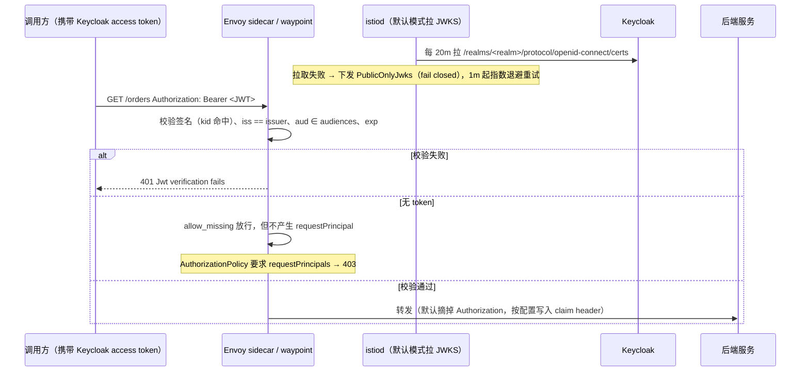

入口那层做了 Keycloak 登录之后，集群里通常还剩一个空洞：**东西向流量没有身份**。只要能访问 Service 的 ClusterIP，就能带着任意身份直连后端，绕过网关。把 JWT 校验下沉到 Envoy 是标准解法，但官方任务页给的 YAML 抄完就跑通的情况很少，卡人的点集中在四处：

1. `RequestAuthentication` 单独存在时**不拒绝**没有 token 的请求；
2. `issuer` 必须与 Keycloak 实际签发的 `iss` 逐字符一致，签名对、`iss` 错时错误文本是一样的；
3. JWKS 默认由 **istiod** 拉取，且默认 **20 分钟**才刷新一次——密钥轮换和启动顺序都受影响；
4. `audiences` 不配就**不校验** `aud`，同一 realm 签发的任何 token 都能通过。

本文的基线：**Istio 1.31.0**（2026-08-31 发布，官方支持 Kubernetes 1.32–1.36）、**Keycloak 26.7.x**。字段语义与默认值核对自 Istio `release-1.31` 源码（`pilot/pkg/security/authn/policy_applier.go`、`pilot/pkg/model/jwks_resolver.go`、`pilot/pkg/features/pilot.go`）和官方 API 参考；核对日期 2026-09-20。

## 适用与不适用

| 适用 | 不适用 |
|------|--------|
| 服务间（东西向）流量需要统一身份校验层，不想让每个语言各自实现 JWT 校验 | 需要交互式登录（浏览器授权码流程）——那是入口网关的事，见 [Keycloak + oauth2-proxy 集成]()、[Envoy Gateway 原生 OIDC]() |
| 后端是任意语言，只需要读一个可信身份（claim 对应的 header） | 后端要拿用户身份再去调下游（委派/换发 token）——网格只做校验，不换 token，见 [Keycloak Token Exchange]() |
| 已跑 sidecar 或 ambient 模式，能接受策略下发延迟 | 集群里没有网格，或只有两三个服务——入口代理方案成本更低 |
| 需要按路径、方法、claim、组做粗粒度门禁 | 需要资源级权限（某条记录、某个文档）——那是 PDP 的职责，见 [Keycloak + OpenFGA 的 ReBAC 集成]() |

## 1. 最小配置

Keycloak 端只需要一个能签发 access token 的 client（谁去取 token 不在本文范围：浏览器场景见 [IAM BFF 模式与 SPA Token 安全]()，后端服务场景见 [Spring Boot 3 资源服务器接入]()）。

网格侧两份 YAML。注意 `security.istio.io/v1`：安全类 API 自 Istio 1.22 起升为 `v1`，旧 `v1beta1` 仍在服务，但新写就别再用了。

```yaml
apiVersion: security.istio.io/v1
kind: RequestAuthentication
metadata:
  name: keycloak-jwt
  namespace: shop
spec:
  selector:
    matchLabels:
      app: orders-api
  jwtRules:
  - issuer: "https://sso.example.com/realms/shop"
    # issuer 只用于比对 iss，jwksUri 只用于取公钥，两者可以指向不同地址
    jwksUri: "http://keycloak.keycloak.svc.cluster.local:8080/realms/shop/protocol/openid-connect/certs"
    audiences:
    - "orders-api"
    forwardOriginalToken: true
---
apiVersion: security.istio.io/v1
kind: AuthorizationPolicy
metadata:
  name: require-jwt
  namespace: shop
spec:
  selector:
    matchLabels:
      app: orders-api
  action: ALLOW
  rules:
  - from:
    - source:
        requestPrincipals: ["*"]
```

三个必须理解的语义：

- **`RequestAuthentication` 是"有 token 就验"，不是"没 token 就拒"**。官方字段说明的原话是：不含任何认证凭据的请求会被接受，只是不带已认证身份；源码注释同样直白——`invalid token` 拒绝，无 token 放行。转换成 Envoy 配置后是 `requires_any: [{provider_name: origins-0}, {allow_missing: {}}]`，这就是 `allow_missing` 的来源。
- **`requestPrincipals` 才是门禁**。格式是 `<iss>/<sub>`，`"*"` 表示"必须有一个来自 JWT 的请求主体"。这条规则存在后，ALLOW 语义下不匹配的请求会被拒绝——`RequestAuthentication` 负责"验",`AuthorizationPolicy` 负责"拦"，少一份就等于没上锁。
- **`issuer` 与 `jwksUri` 是独立字段**。所以可以写"对外 `issuer` + 集群内 `jwksUri`"：`iss` 由 Keycloak 的对外地址决定，公钥直接从集群内 Service 拉，istiod 不必出网。

## 2. 坑一：issuer 与 Keycloak 的 iss 差一个字符就是 401

Keycloak 的 `iss` 由它自己的 hostname 配置决定，不是"你在 Istio 里填什么就是什么"。三条命令核对完整链路：

```bash
# 1) Keycloak 自己声明的 issuer
curl -s https://sso.example.com/realms/shop/.well-known/openid-configuration | jq -r .issuer

# 2) token 里的 iss（只看载荷，不验签）
echo "$TOKEN" | cut -d. -f2 | base64 -d 2>/dev/null | jq -r .iss

# 3) Istio 实际下发给 Envoy 的 provider issuer
istioctl proxy-config listener deploy/orders-api -n shop --port 8080 -o json \
  | jq '.. | objects | select(has("issuer")) | .issuer'
```

三个值必须完全一致。常见的不一致来源：

| 现象 | 根因 |
|------|------|
| Istio 里写内网地址（`http://keycloak.keycloak.svc.cluster.local:8080/realms/shop`），token 的 `iss` 是对外地址 | Keycloak 按自己的 hostname 配置签发 `iss`。签名验得过、`iss` 不匹配，Envoy 报错文本和"公钥拉不到"几乎一样（都是 `Jwt verification fails`），别只盯 JWKS |
| 结尾斜杠差异 `.../shop/` vs `.../shop` | 字符串精确比较，没有容错 |
| 老 YAML 里带 `/auth` 前缀 | Keycloak 17 起 Quarkus 发行版默认去掉 `/auth` 上下文路径（只有显式设 `--http-relative-path=/auth` 才保留）。从旧版升级过来的配置里 `/auth/realms/...` 会整体失效 |
| 同一个 realm 有时能过、有时 401 | Keycloak 未固定 hostname 时 `iss` 会随入口 Host 头漂移，多入口/多域名的环境必然踩到。固定策略见 [Keycloak Hostname v2 配置与迁移]() |

## 3. 坑二：JWKS 默认由 istiod 拉，且默认 20 分钟才刷新

这一层判断错了，排障方向会完全跑偏。默认（`PILOT_JWT_ENABLE_REMOTE_JWKS=false`）下**公钥不是 Envoy 去拉**，而是 istiod 拉好后以 inline JWKS 形式随配置下发：

| 模式 | 谁拉 JWKS | 适合的场景 |
|------|-----------|-----------|
| `false` / `istiod`（默认） | istiod | `jwksUri` 是内网或公网地址，istiod 能直连 |
| `hybrid` / `true` | Envoy 优先，解析不到集群时回退 istiod | `jwksUri` 指向网格内服务，同时保留 istiod 兜底 |
| `envoy` | 只由 Envoy | 明确要网格内直连，且已用 ServiceEntry 注册该主机 |

源码里的时间常量（不是"大概几分钟"）：

- 正常刷新间隔 `PILOT_JWT_PUB_KEY_REFRESH_INTERVAL`，默认 **20m**；
- 拉取失败后的后台刷新改为 **1m** 起，连续失败指数退避，上限 **60m**；恢复成功后重置回 20m；
- 缓存条目在 7 天未使用或 7 天未刷新成功时淘汰；
- Envoy 侧远程 JWKS 的 `cache_duration` 被 Istio 固定写成 **300s**。

由此得到四条运维结论：

**3.1 拉取失败是 fail-closed，表现是全量 401。** istiod 会下发一个"私钥已被永久丢弃"的公钥集合，日志原文是 `JWKS fetch failed for issuer ... using public-only JWKS with discarded private key - JWT requests will be rejected`。这时要查的是 istiod 到 `jwksUri` 的 DNS/网络/TLS，以及 istiod 日志，不是应用代码。

**3.2 密钥轮换有一个最长 20 分钟的窗口。** Keycloak 轮换 realm 签名密钥后，istiod 最长要等一个刷新周期才拿到新 `kid`，窗口内新签发的 token 会被拒（Envoy 侧常见 `Jwks doesn't have key to match kid or alg from Jwt`）。把"Keycloak 签名密钥轮换"和"网格 JWT 校验"排进同一个变更窗口；要缩短窗口只能调小刷新间隔，代价是所有 JWKS 一起刷得更密。

**3.3 istiod 出网要单独确认。** `jwksUri` 是公网地址时，需要 istiod 自己能出网。Egress 受限的集群里，这属于"配完能跑、重启后拉不到"的典型隐患。

**3.4 私有 CA 与 `envoy` 模式的两个硬约束。** istiod 只会额外信任挂载到 `/cacerts/extra.pem` 的 CA；`JWKS_RESOLVER_INSECURE_SKIP_VERIFY=true` 能跳过证书校验，但那是把校验链断在自己手里，不要在生产开。选 `envoy` 模式时，外部主机必须在网格里有 ServiceEntry，否则 istiod 会打印 `Failed to look up Envoy cluster ... Please create ServiceEntry to register external JWKs server or set PILOT_JWT_ENABLE_REMOTE_JWKS to hybrid/istiod mode.`，并生成一个指向"假集群"的远程 JWKS 配置——请求会一直验证失败，而且 CR 本身没有任何报错。

## 4. 坑三：不配 audiences，等于不校验 aud

Envoy 对 `audiences` 的语义是"未配置就不检查 `aud`"。Istio 侧只是 `Audiences: jwtRule.Audiences` 的透传，没有默认填充；官方字段说明里那句 "The service name will be accepted if audiences is empty" 是旧实现的表述，**不要把它当作"校验依然存在"的依据**。

后果很具体：Grafana 的 token、oauth2-proxy 的 token、CLI 里换出来的 token，只要同一个 realm 签发、签名有效、`iss` 匹配，就都能通过你的服务。这和 oauth2-proxy 上那个著名的 `expected audience got account` 是同一个根因——token 的 `aud` 里根本没有目标 API。

两步修掉：

1. Keycloak：在目标 client（或 client scope）加 `Audience` mapper，`Included Custom Audience` 填 `orders-api`，并勾选 Add to access token；
2. Istio：`audiences: ["orders-api"]`。

为什么不能指望 Keycloak 默认给：access token 的 `aud` 由 **audience resolve** mapper 填充，规则是"用户在该客户端上有角色，才把该 client id 加进 `aud`"。资源服务器自己（RP）默认不在列表里，全量 scope 下最常见的输出就是 `aud: ["account"]`。同一套 claim 语义在 [Keycloak + oauth2-proxy 集成]() 里也有记录，两边是同一个坑。

## 5. 坑四：身份怎么给后端，以及别让后端信任裸 header

两个方向都要显式配置，默认值都不是"你想要的"：

| 需求 | 字段 | 语义 |
|------|------|------|
| 后端还要拿原始 token 去调下游 | `forwardOriginalToken: true` | 默认 false：**校验成功后 Envoy 会把 `Authorization` 头摘掉**，后端读不到 token。这是"配了鉴权，后端说没收到 token"的最常见原因 |
| 后端只读身份 | `outputClaimToHeaders` | 把单个 claim 复制成 header；同名请求头会被**覆盖**；只支持 string/int/bool（实验特性） |
| 后端要完整 claim | `outputPayloadToHeader` | 输出 base64 编码的完整 payload |

比配置更重要的是边界：

- **无 token 请求会到达后端**。只有 AuthorizationPolicy 明确要求 `requestPrincipals` 时，"没有 token"才等价于"被拒绝"。否则请求照常进后端，只是没有任何身份 header 被写入。后端如果写成"没有 `X-User` 头就按匿名放行"，等于把鉴权交给了客户端。
- **自己验一次伪造头**，别靠推断：

```bash
curl -s -o /dev/null -w '%{http_code}\n' -H 'x-auth-user: admin' http://orders-api.shop:8080/api/me
```

- **ambient 模式另有一条硬规则**：waypoint 只认 `targetRefs`，`selector` 会被忽略。用 `selector` 写的策略在 ambient 下**静默不生效**，此时看到 200 不代表策略在跑，只代表策略没生效。



## 6. 验证

```bash
# 1) 无 token：ALLOW 策略要求 requestPrincipals → 403
curl -s -o /dev/null -w '%{http_code}\n' http://orders-api.shop:8080/orders

# 2) 无效/过期 token：由 jwt_authn 直接拒绝 → 401
curl -s -o /dev/null -w '%{http_code}\n' \
  -H 'Authorization: Bearer invalid.token.here' http://orders-api.shop:8080/orders

# 3) 有效 token → 200
curl -s -o /dev/null -w '%{http_code}\n' \
  -H "Authorization: Bearer $TOKEN" http://orders-api.shop:8080/orders
```

401 与 403 的区分本身就是定位线索：**401 来自 token 校验（签名/iss/aud/exp/kid），403 来自授权策略**（没带 token、claim 不匹配、策略选错工作负载）。

Envoy 侧配置核对：

```bash
istioctl proxy-config listener deploy/orders-api -n shop --port 8080 -o json \
  | jq '.. | objects | select(.name? == "envoy.filters.http.jwt_authn")'
```

应该能看到 provider 的 `issuer`、`localJwks`（默认模式是 inline）和 `requiresAny`。如果 inline JWKS 里只有那一个 `kid`、且 `n` 是一长串固定值，说明 istiod 没拉到公钥（fail closed 状态）。

istiod 侧：

```bash
kubectl -n istio-system logs deploy/istiod | \
  grep -Ei "jwks|jwt public key|Failed to look up Envoy cluster"
```

指标只看两个（源码里注册的就这两个）：`pilot_jwks_resolver_network_fetch_success_total`、`pilot_jwks_resolver_network_fetch_fail_total`。失败计数持续增长时，JWT 校验一定在 fail-closed 状态。

## 7. 常见错误表

| 症状 | 最可能的根因 | 先看什么 |
|------|--------------|----------|
| 401 `Jwt verification fails`，istiod 日志干净 | `iss` 与 `issuer` 不一致（内网/外网地址、斜杠、`/auth` 前缀） | 比对 discovery 的 `issuer`、token 的 `iss`、Envoy 里的 provider `issuer` 三个值 |
| 401，且 istiod 日志有 `JWKS fetch failed` | istiod 拉不到 `jwksUri`（DNS/出网/TLS/私有 CA） | istiod → `jwksUri` 的连通性；必要时挂 `/cacerts/extra.pem` |
| 刚轮换过 Keycloak 签名密钥，新 token 全被拒 | 20 分钟刷新窗口内 `kid` 未命中 | istiod 最近一次刷新时间；必要时临时调小刷新间隔 |
| 全新环境第一次部署就 401，CR 无报错 | `envoy` 模式下外部 JWKS 主机缺 ServiceEntry，生成了"假集群" | istiod 日志 `Failed to look up Envoy cluster` |
| 不带 token 的请求返回 200 | 只配了 `RequestAuthentication`，没有强制认证的 `AuthorizationPolicy` | `kubectl get authorizationpolicy -A` 是否覆盖了该工作负载 |
| 策略写了但完全不生效 | 策略不在目标命名空间/选择器不匹配；ambient 下用了 `selector` 而非 `targetRefs` | `istioctl analyze`；把工作负载与策略的命名空间、label 逐项对齐 |
| 后端收不到 `Authorization` 头 | `forwardOriginalToken` 默认 false | 需要透传就显式设为 true |
| 后端读到的身份 header 是客户端伪造的 | 无 token 请求未被打回，后端信任了裸 header | 用伪造 header 的 curl 复现；补 `requestPrincipals` 门禁 |

## 8. 回滚

回滚顺序要反着想：**先删 `AuthorizationPolicy`，再删 `RequestAuthentication`。**

只删 `RequestAuthentication` 而留着 `requestPrincipals: ["*"]` 的 ALLOW 策略，会让 `requestPrincipals` 永远为空，所有请求变成 403——比不做认证更糟，且现象看起来像"删了策略反而全挂"。反过来先删策略，回到"不校验也不拒绝"的中间态，最坏只是恢复到变更前的状态。

其余注意点：

- `istioctl analyze` 能抓到"VirtualService 用 JWT claim 路由但没有对应 `RequestAuthentication`"这类配置矛盾，但它不知道你的安全意图——"配了 `RequestAuthentication` 却没人强制"只能靠测试用例兜住（无 token 应当返回 401/403，而不是 200）。
- ambient 模式删掉 waypoint 会连带失去 L7 策略的执行点，回滚时把 waypoint 与策略当成一个整体。
- 变更本身是声明式的，回滚代价低；真正的风险是"回滚顺序"和"策略静默不生效"这两件事，先在预发环境演练一遍再把两份 YAML 推到生产。

## IAM FAQ

### IAM 里网格层校验 JWT，和入口网关的 oauth2-proxy 是重复建设吗？

不重复，职责不同：入口那层解决"人怎么登录、会话怎么保持"（浏览器重定向、cookie、登出），网格这层解决"每一次服务调用带的是什么身份"（无状态校验，不维护会话）。只做入口校验时，任何能访问 Service 的调用方都能绕过入口直连后端；只做网格校验时，浏览器用户没有地方完成交互式登录。两层都上时注意区分 token 受众：入口用前端 client 的 token，网格内部用服务自己的 token，`aud` 要能对上。

### IAM 的 RequestAuthentication 写一份就够了吗？

策略按工作负载生效：命名空间内的策略命中同命名空间的工作负载；放在 istio-system（root namespace）且不带 `selector` 的策略对所有命名空间生效。生产上不建议第一次就推"全局默认校验 + 少数例外"，先在一个命名空间验证 `iss`/`aud`/header 的实际行为，确认后再按命名空间铺开。

### IAM 里 Keycloak 轮换签名密钥，网格会中断多久？

上限取决于 istiod 的刷新周期（默认 20 分钟）和当前是否处于失败退避中。操作上：轮换前确认 istiod 到 `jwksUri` 连通，轮换后立刻用新签发的 token 打一次受保护接口，别等告警。要缩短窗口就调小 `PILOT_JWT_PUB_KEY_REFRESH_INTERVAL`。

### Istio 校验通过就等于授权完成了吗？

不等于。`requestPrincipals` 只证明"有一个本 realm 签发的有效 token"，不证明"这个 token 是发给这个服务的"（`aud` 要自己配），也不证明"这个用户有权做这件事"（那是后端或 PDP 的规则）。网格层能承担的是粗粒度门禁：路径、方法、claim/组。细粒度授权见 [Keycloak 细粒度权限]() 与 [Keycloak + OpenFGA]()。

## 相关阅读

- [Keycloak + oauth2-proxy 集成指南]()、[Envoy Gateway 原生 OIDC + Keycloak]()：入口（南北向）认证的两种做法
- [Keycloak 直连 K8s OIDC — API Server 认证与 RBAC]()：同样"集群内校验 Keycloak token"，但验证方是 kube-apiserver 而不是 Envoy
- [零信任身份架构]()：PEP/PDP 分层——网格是 PEP，Keycloak 是 PIP，两者不能互相替代
- [Keycloak Hostname v2 配置与 v1 选项迁移]()：`iss` 这个值的真正来源
- [Spring Boot 3 资源服务器接入]()：在应用层做同一件事时的 audience 校验差异
- [OAuth 2.0 DPoP 深度解析]()：网格只校验签名，不等价于抗重放；需要 sender-constrained 时看这里
- [集成模式 §18.4 Sidecar 模式]()：服务网格在整体集成方案中的位置

### 关键来源

- [Istio RequestAuthentication API 参考](https://istio.io/latest/docs/reference/config/security/request_authentication/)：`jwtRules` 全部字段语义、`selector` 与 `targetRefs` 的互斥关系、"无凭据请求会被接受"与 waypoint 下 `selector` 被忽略的说明
- [Istio — JWT claim based routing](https://istio.io/latest/docs/tasks/security/authentication/jwt-route/)：只校验不拒绝的官方提示、无效 JWT 返回 401 的行为、`@request.auth.claims` 仅网关可用
- [Istio pilot-discovery 环境变量](https://istio.io/latest/docs/reference/commands/pilot-discovery/)：`PILOT_JWT_ENABLE_REMOTE_JWKS` 各取值含义、`PILOT_JWT_PUB_KEY_REFRESH_INTERVAL` 默认 20m
- [Istio v1 API 公告](https://istio.io/latest/blog/2024/v1-apis/)：安全类 API 自 1.22 起为 `v1`，`v1beta1` 仍被支持
- [Announcing Istio 1.31.0](https://istio.io/latest/news/releases/1.31.x/announcing-1.31)：版本基线与 Kubernetes 支持范围
- Istio 源码 `release-1.31`：`pilot/pkg/security/authn/policy_applier.go`（`Audiences` 直接透传、`requires_any` + `allow_missing`、`Forward`/`ClaimToHeaders` 映射、"invalid token 拒绝、无 token 放行"注释、`envoy` 模式缺 ServiceEntry 时的错误日志）、`pilot/pkg/model/jwks_resolver.go`（`PublicOnlyJwks` fail-closed 回退、1m/20m/60m 刷新与退避常量、7 天淘汰、`/cacerts/extra.pem`、两个 `pilot_jwks_resolver_network_fetch_*` 指标）、`pilot/pkg/features/pilot.go`（`JWKS_RESOLVER_INSECURE_SKIP_VERIFY`）
- [Envoy JWT Authentication 配置参考](https://www.envoyproxy.io/docs/envoy/latest/api-v3/extensions/filters/http/jwt_authn/v3/config.proto)：`audiences` 未配置时不校验 `aud`、`forward=false` 时校验成功后移除 JWT、`claimToHeaders` 覆盖同名头
- [istio/istio#37456](https://github.com/istio/istio/issues/37456)、[istio/istio#53260](https://github.com/istio/istio/issues/53260)：istiod 拉取 JWKS 失败/外部 JWKS 主机未被网格识别时的真实现象
- Keycloak 文档：[Audience protocol mapper](https://www.keycloak.org/docs-api/latest/javadocs/org/keycloak/protocol/oidc/mappers/AudienceProtocolMapper.html) 与 audience resolve 的填充规则（[keycloak/keycloak#12415](https://github.com/keycloak/keycloak/issues/12415)）
